现在我已经对整个代码库有了深入的了解。以下是完整的技术负责人分析。

---

# 技术负责人分析报告：ForgeOS 五大缺口方向

## 概述

这份分析文档不是「想到了新功能」，而是「系统已达 ~95% 功能完备度，找到了关键 5% 的桥梁」——这是它的核心价值。作为 Tech Lead，我的第一反应是**这五项的修复/完善应当成为下个 Sprint 的骨架**，因为它们各自对应一个真实的架构质量隐患，而非镀金。

下文将每个方向拆解为可执行任务，并给出执行顺序、风险、资源评估和质量保证策略。

---

## 1. 任务分解

### 方向一 · `.forge/` 运行隔离（持久化层完整性）

| 任务 ID | 任务标题 | 涉及文件 | 前置依赖 | 预估工时 | 验收标准 |
|---------|---------|---------|---------|---------|---------|
| **TASK-001** | checkpoint 添加 run_id 字段 + 写入完整性 | `forge-core/internal/persist/checkpoint.go`, `persist/encode.go` | 无 | 2h | Save 时写入 run_id，Load 时校验；旧 checkpoint 向后兼容 |
| **TASK-002** | memory.go O_APPEND 添加 run_id 隔离 | `forge-core/internal/memory/memory.go` | 无 | 2h | 每行 JSONL 记录 run_id；Load 支持按 run_id 过滤；O_APPEND 原子性保留 |
| **TASK-003** | trace seq 从 1 开始（修复 0→1 语义偏移） | `forge-core/internal/trace/trace.go` | 无 | 1h | `NewTracer` 初始化 seq=1；首个 event seq=1；现有 test assertion 同步修正 |
| **TASK-004** | 三存储层 run_id 一致性与跨层集成测试 | `persist/*`, `memory/*`, `trace/*`, `cmd/forge/` | TASK-001, TASK-002, TASK-003 | 3h | 集成测试：一次 `forge run` 产生三个文件，run_id 全部对齐 |

**方向一小计：8h（1人天）**

### 方向二 · 遥测查询性（Trace 可读性）

| 任务 ID | 任务标题 | 涉及文件 | 前置依赖 | 预估工时 | 验收标准 |
|---------|---------|---------|---------|---------|---------|
| **TASK-005** | trace Reader 接口 + JSONL 行扫描器 | `forge-core/internal/trace/reader.go`（新） | 无 | 3h | `trace.ReadEvents(path)` 返回 `[]Event`；支持按 kind/name/seq 范围过滤；不依赖 Tracer 内部状态 |
| **TASK-006** | Trace CLI 子命令：`forge trace list/last/show` | `cmd/forge/trace_cmd.go`（新） | TASK-005 | 3h | `forge trace list` 列出所有 trace 文件；`forge trace last` 输出最近一次运行的 trace 摘要；`forge trace show --seq N` 单条查看 |
| **TASK-007** | scorecard 从覆写改为版本化追加 | `internal/routing/scorecard.go`, `harness/scorecard-update.mjs` | 无 | 2h | scorecard 写入保存历史版本；`forge scorecard history` 可查看版本演进；旧版读取模式向后兼容 |
| **TASK-008** | Telemetry CLI：`forge telemetry` 展示 cost/latency | `cmd/forge/telemetry_cmd.go`（新） | TASK-005, TASK-007 | 4h | `forge telemetry --from <trace>` 输出 p95_latency, avg_cost, total_cost；支持 --json 格式输出 |

**方向二小计：12h（1.5 人天）**

### 方向三 · 解析器测试成熟度（Fuzz + 差异测试）

| 任务 ID | 任务标题 | 涉及文件 | 前置依赖 | 预估工时 | 验收标准 |
|---------|---------|---------|---------|---------|---------|
| **TASK-009** | yaml2json Go 包 fuzz corpus 构建 | `forge-core/internal/yaml2json/yaml2json_fuzz_test.go`（新） | 无 | 3h | `go test -fuzz=FuzzYaml2Json` 跑 1min 无 panic；corpus 包含合法/非法/边界三种 YAML |
| **TASK-010** | yaml2json diff-fuzz：Go 与 Python 双实现一致性 | `forge-core/internal/yaml2json/yaml2json_fuzz_test.go`（扩） | TASK-009 | 4h | 对 1000+ 随机输入，Go 输出等于 `python3 harness/yaml2json.py` 输出；差异显式标记已知偏离 |
| **TASK-011** | routing.go 多维 fuzz 扩展 | `forge-core/internal/routing/routing_fuzz_test.go`（新） | 无 | 2h | 新增 FuzzTierFor（agent+mode 组合）、FuzzBudgetAdjust（全参数空间）；30s fuzz 无 panic |
| **TASK-012** | 全仓 fuzz 扫描与注册到 CI | `.github/workflows/forge.yml`, 各包 test 文件 | TASK-009, TASK-010, TASK-011 | 1h | CI 对每个含 fuzz 的包跑 `-fuzztime=30s`；结果 post 到 build log |
| **TASK-013** | routing band-table 属性基测试（property-based） | `forge-core/internal/routing/routing_property_test.go`（新） | 无 | 3h | 核心不变量：Haiku ≤ Sonnet ≤ Opus ≤ EscalateToHuman 全排序；Higher(A,B) ≥ A AND ≥ B；score 在 [0,1] 内输出单调 |

**方向三小计：13h（1.6 人天）**

### 方向四 · 工作流模板人机工程（CLI 可发现性）

| 任务 ID | 任务标题 | 涉及文件 | 前置依赖 | 预估工时 | 验收标准 |
|---------|---------|---------|---------|---------|---------|
| **TASK-014** | `forge workflow list` 子命令 | `cmd/forge/workflow_cmd.go`（新） | 无 | 2h | 列出所有可用 workflow（从 `.agent/workflows/*.yml` 扫描）；显示名称、阶段数、描述（来自 YAML 头部注释） |
| **TASK-015** | `forge workflow show <name>` 子命令 | `cmd/forge/workflow_cmd.go`（扩） | TASK-014 | 2h | 打印 workflow 全部阶段、每个阶段的 role/gate/on_fail；高亮当前 mode 下哪些 phase 会被 skip |
| **TASK-016** | `forge workflow new <name>` 子命令 | `cmd/forge/workflow_cmd.go`（扩）, `internal/gate/` | TASK-014 | 3h | 从模板（例如简化的 build.yml）生成新 workflow；交互式填写 phase 序列；输出到 `.agent/workflows/<name>.yml` |
| **TASK-017** | `forge workflow graph <name>` 子命令 | `cmd/forge/workflow_cmd.go`（扩） | TASK-015 | 2h | 以 ASCII/Mermaid 输出 workflow 的阶段依赖图和 loop-back 路径 |
| **TASK-018** | `docli` 自动补全 + `--help` 集成 | `cmd/forge/completion.go`, `cmd/forge/main.go` | TASK-014–017 | 1h | `forge workflow --help` 输出完整子命令树；`forge completion bash/zsh` 包含新子命令 |

**方向四小计：10h（1.25 人天）**

### 方向五 · pi-batch.py 质量

| 任务 ID | 任务标题 | 涉及文件 | 前置依赖 | 预估工时 | 验收标准 |
|---------|---------|---------|---------|---------|---------|
| **TASK-019** | pi-batch.py 函数拆分与文件重构 | `pi-batch.py` → `pi-batch/` 包（`__init__.py`, `executor.py`, `parser.py`, `config.py`, `cli.py`） | 无 | 3h | 单文件从 499 行拆到 ≤200 行/文件；现有入口 `pi-batch.py` 退化为 `from pi_batch.cli import main; main()` |
| **TASK-020** | pi-batch.py 单元测试覆盖（基础路径） | `pi-batch/` 下 `test_*.py` 文件 | TASK-019 | 3h | 覆盖：YAML 解析、串行执行、并行执行、CLI 参数解析、超时处理、错误分类（FileNotFoundError ≠ "not in PATH"） |
| **TASK-021** | pi-batch.py 超时机制双线程预算修复 | `pi-batch/executor.py` | TASK-019 | 2h | 两个 reader 线程共享同一个 timeout 预算而非各自满额；实际杀进程延迟 ≤ 1.1× 配置值 |
| **TASK-022** | pi-batch.py 错误分类细化 | `pi-batch/executor.py` | TASK-019 | 1h | 区分：二进制不存在 / cwd 不存在 / token 超时 / rate-limit；各自的错误信息精确描述 |
| **TASK-023** | pi-batch.py 集成测试 | `pi-batch/tests/test_integration.py` | TASK-020 | 2h | Fake subprocess 验证串行/并行执行顺序；实际 `/bin/echo` 验证最小路径存活 |

**方向五小计：11h（1.4 人天）**

### 总任务清单

| 汇总 | 任务数 | 总工时 |
|------|-------|-------|
| 方向一 | 4 | 8h |
| 方向二 | 4 | 12h |
| 方向三 | 5 | 13h |
| 方向四 | 5 | 10h |
| 方向五 | 5 | 11h |
| **总计** | **23** | **54h ≈ 6.75 人天** |

---

## 2. 执行顺序

```mermaid
graph TD
    subgraph "基础设施层 (Phase 1)"
        T001[TASK-001: checkpoint run_id] --> T004[TASK-004: 三层集成测试]
        T002[TASK-002: memory run_id] --> T004
        T003[TASK-003: trace seq 从1开始] --> T004
        T019[TASK-019: pi-batch.py 拆分包] --> T020[TASK-020: pi-batch 单测]
        T019 --> T021[TASK-021: 超时修复]
        T019 --> T022[TASK-022: 错误分类细化]
    end

    subgraph "可观测性层 (Phase 2)"
        T005[TASK-005: trace Reader 接口] --> T006[TASK-006: trace CLI 子命令]
        T007[TASK-007: scorecard 版本化] --> T008[TASK-008: telemetry CLI]
        T006 --> T008
    end

    subgraph "测试与质量 (Phase 2)"
        T009[TASK-009: yaml2json fuzz] --> T010[TASK-010: diff-fuzz]
        T011[TASK-011: routing fuzz] --> T012[TASK-012: CI fuzz 注册]
        T013[TASK-013: routing 属性测试] --> T012
    end

    subgraph "人机工程 (Phase 3)"
        T014[TASK-014: workflow list] --> T015[TASK-015: workflow show]
        T014 --> T016[TASK-016: workflow new]
        T015 --> T017[TASK-017: workflow graph]
        T014 --> T018[TASK-018: docli 集成]
    end

    subgraph "收尾 (Phase 3)"
        T020 --> T023[TASK-023: pi-batch 集成测试]
        T004 --> T006
        T012 --> T023
        T018 --> T023
    end

    classDef infra fill:#e1f5fe;
    classDef obs fill:#fff3e0;
    classDef test fill:#e8f5e9;
    classDef ux fill:#fce4ec;
    classDef done fill:#f3e5f5;

    class T001,T002,T003,T004,T019 infra;
    class T005,T006,T007,T008 obs;
    class T009,T010,T011,T012,T013 test;
    class T014,T015,T016,T017,T018 ux;
    class T020,T021,T022,T023 done;
```



### 可并行的任务组

| 并行组 | 任务 | 原因 |
|--------|------|------|
| **组 A（独立）** | TASK-003（trace seq） | 单文件改动，无外部依赖，任何开发者可独立完成 |
| **组 B（独立）** | TASK-019（pi-batch 分包） | 纯 Python 重构，与 Go 代码完全隔离 |
| **组 C（独立）** | TASK-007（scorecard 版本化） | 对 scorecard 的写入路径改动，不依赖其他任务 |
| **组 D（独立）** | TASK-009 + TASK-011 + TASK-013 | 三个不同的 fuzz 目标，完全隔离的测试文件 |
| **组 E（独立）** | TASK-014（workflow list） | 新 CLI 子命令骨架，不依赖方向一二的改动 |

**推荐：第一天就启动组 A、B、C、D、E 全部并行，然后逐步接入依赖链。**

---

## 3. 技术风险

### 3.1 风险矩阵

| 风险 ID | 描述 | 影响方向 | 概率 | 严重度 | 缓解策略 |
|---------|------|---------|------|--------|---------|
| **R1** | O_APPEND + run_id 过滤改动了 memory 包的原子性保证 | 方向一 | 低 | **高** | 保持 O_APPEND 写入格式不变，run_id 过滤只在 Load 时做；Load 回退兼容 old entries（无 run_id 字段 = 当前 run） |
| **R2** | trace seq 从 0→1 的改动导致已有测试/工具的逐字节断言碎裂 | 方向一 | **高** | 中 | 全局 grep trace event 的 seq assertion；对明确依赖 seq=0 的测试，改为 seq ≥ 1 或按业务含义断言 |
| **R3** | yaml2json Go 实现与 Python 实现存在已知语义差异（已由 Sprint 27 block-scalar 修复覆盖） | 方向三 | **高** | 中 | diff-fuzz 必须显式列出已知差异白名单，而非假装 100% 等价；fuzz 退出码区分"新差异被发现"和"已知差异" |
| **R4** | `forge workflow new` 生成的文件可能在 mode×lifecycle 下部分 phase 被静默跳过 | 方向四 | 中 | 中 | 生成后提示用户 run `forge workflow show` 验证在当前 mode 下的生效情况 |
| **R5** | pi-batch.py 分包时破坏现有调用协议 | 方向五 | 低 | **高** | 保留 `pi-batch.py` 作为兼容入口，内部 delegate 到新包；全部现有用法回归测试 |
| **R6** | trace CLI 读取的 trace.jsonl 文件可能处于写入中 | 方向二 | 中 | 中 | Reader 实现容忍不完整末行（最后一行无 `\n` 时不报错）；在 `forge trace` CLI 输出标记不完整行 |
| **R7** | scorecard 版本化导致磁盘占用线性增长 | 方向二 | 中 | 低 | 默认只保留最近 5 个版本；`forge scorecard prune --keep N` 手动清理 |

### 3.2 关键依赖与外部系统

- **无外部依赖**：所有改动均属于 forge-core（纯 Go 标准库）、harness（Python stdlib）、CLI 表面。为零外部系统风险。
- **CI 集成**（TASK-012）依赖 GitHub Actions runner 上 Go 版本支持 `-fuzz`（go ≥ 1.18）。`forge.yml` 当前 Go 版本需确认。

### 3.3 性能瓶颈

- trace Reader 解析整个 JSONL 为 `[]Event`：对 24h run 可能产生数万行，O(n) 内存。策略：添加 `--limit N` / `--since` 过滤，传给 Reader 做 streaming 级联过滤。
- scorecard 版本化：每次写入 append-only，Load 做 merge。若版本数过多（>100），merge 耗时会线性增长。策略：`Prune` 保留策略同步到 scorecard 路径。

### 3.4 测试覆盖难点

- **diff-fuzz 的 oracle 问题**：Python `yaml2json.py` 本身的正确性未被独立验证。如果 Python 实现在某些边缘输入上也是错的，diff-fuzz 会继承这个错误。缓解：在 fuzz 中除了双实一致性，还加入 **schema 属性检查**（输出 JSON 符合已知 schema shape）。
- **超时修复测试**（TASK-021）：超时的真实行为需要启动子进程并真的等 timeout 触发，测试会变慢。策略：mock `subprocess.Popen` 的 communicate 超时行为。

---

## 4. 资源评估

### 4.1 开发人员技能与数量

| 技能要求 | 负责任务 | 建议人数 |
|---------|---------|---------|
| Go 中高级（含 file IO、encoding/json、testing/fuzz） | TASK-001～017（方向一～四） | 2 人 |
| Python 中高级（拆包、subprocess、multithreading） | TASK-019～023（方向五） | 1 人 |
| CI/CD（GitHub Actions、Go toolchain） | TASK-012 | 0.5 人（和 Go 开发者共享） |
| **总人力** | | **3 人（含 0.5 共享）** |

**推荐团队配置**：2 名 Go 工程师（一 senior 带领架构一致性） + 1 名 Python 工程师（可兼职）。所有开发在同一个 sprint 内完成。

### 4.2 关键里程碑

| 里程碑 | 时间点 | 交付物 | 验收标准 |
|--------|-------|--------|---------|
| **M1** | Day 1 结束 | 组 A～E 的 5 个并行任务全部 PR 提交 | 各任务独立 `go test` / `pytest` 全绿 |
| **M2** | Day 3 结束 | 方向一+二核心功能完成（TASK-001～008） | `forge accept` ACCEPTED；trace CLI 输出真实可读 |
| **M3** | Day 4 结束 | 方向三全部 fuzz 合入 + CI 跑通（TASK-009～013） | fuzz CI job 30s 无 crash；diff-fuzz 零未知差异 |
| **M4** | Day 5 结束 | 方向四+五全部完成（TASK-014～023） | `forge workflow list/show/new` 三个子命令工作；pi-batch 包全部测试 |
| **M5** | Day 6 结束 | 完整集成测试 + 回归 | `forge accept` ACCEPTED；go vet -race 全绿；全量长路径集成测试 PASS |

### 4.3 阻塞点（Blockers）与解决策略

| 阻塞点 | 描述 | 解决策略 |
|--------|------|---------|
| **B1** | trace seq 从 0→1 可能破坏下游日志解析工具（内部或用户） | 发布前在 CHANGELOG 标注语义变更；旧日志向后兼容（Reader 容忍 seq=0 的 event 作为合法序列的第一个） |
| **B2** | yaml2json diff-fuzz 首次运行发现大量未知差异 | 建立白名单机制，先合并白名单内的已知差异，修复阻塞性差异（方向三的核心收益），非阻塞差异作为已知技术债跟踪 |
| **B3** | pi-batch.py 的现有隐式行为未文档化 | 分包前先用 `# type:` annot + docstring 标注每个函数的契约；对每个函数写 minimal contract test 后再拆 |

---

## 5. 质量保证

### 5.1 单元测试覆盖要求

| 包/文件 | 当前覆盖 | 目标覆盖 | 关键测试场景 |
|---------|---------|---------|-------------|
| `forge-core/internal/persist/` | ~80% | ≥90% | run_id 写入/读取；旧格式向后兼容；原子写入 crash 模拟（rename 前 kill） |
| `forge-core/internal/memory/memory.go` | ~75% | ≥90% | O_APPEND + run_id 过滤；Load by run_id；Supersedes 与 run_id 共存 |
| `forge-core/internal/trace/trace.go` | ~85% | ≥95% | seq 从 1 开始；Reader 容忍不完整末行；并发安全（race detector） |
| `forge-core/internal/yaml2json/` | ~60% | ≥90% | 每个 YAML 结构类型（mapping/sequence/scalar/block）独立 fuzz；Go vs Python diff |
| `forge-core/internal/routing/` | ~70% | ≥90% | 全维度 fuzz；属性测试覆盖单调性、有界性、幂等性 |
| `pi-batch/` | 0% | ≥80% | YAML 解析（含错误输入）；串行/并行执行顺序；超时预算；错误分类 |

### 5.2 集成测试策略

| 测试 | 覆盖范围 | 触发条件 |
|------|---------|---------|
| **三层存储集成** | 一次 `forge run --dry-run` 产生 checkpoint + memory + trace 三个文件，run_id 全部对齐 | `forge accept` 中的 app-test 路径 |
| **trace→telemetry 管线** | `forge run` 后 `forge telemetry` 能读到真实 cost/latency | 每次 CI（mock executor） |
| **workflow CLI 端到端** | `forge workflow list` + `show` + `new` + `graph` 四命令 | 每次 CI |
| **pi-batch 串/并行** | fake subprocess 模拟 3-5 个任务，验证执行顺序 | 每次 CI |

### 5.3 代码审查要点

| 审查焦点 | 涉及任务 | 原因 |
|---------|---------|------|
| **run_id 注入不破坏原子性** | TASK-001, TASK-002 | memory 的 O_APPEND 原子性高度依赖单行写入，run_id 添加不能改成先读后写的模式 |
| **trace Reader 接口不导出内部 mutex** | TASK-005 | Reader 应是无锁的纯函数，不依赖 Tracer 的内部锁状态 |
| **fuzz seed 不包含 panic 触发** | TASK-009, TASK-011 | fuzz seed 如果包含已知会 panic 的输入，CI 每次都会 red——seed 必须只含合法输入 |
| **pi-batch 分包不改变 CLI 行为** | TASK-019 | 保留入口兼容性：`python pi-batch.py` 必须继续工作；argparse 参数语义不变 |
| **scorecard 版本化不破坏读取** | TASK-007 | 当前 `LoadScorecards` 读到旧格式不应报错；新格式+旧格式在同一目录共存 |

### 5.4 性能测试需求

| 测试 | 场景 | 阈值 |
|------|------|------|
| trace Reader 大文件 | 10000+ events JSONL 文件 | 加载 < 100ms；内存 < 5MB |
| scorecard 版本合并 | 10 个版本各 50 条记录 | 合并 < 50ms |
| pi-batch 超时精度 | 长耗时子进程 + 500ms timeout | 实际杀进程 ≤ 600ms |

---

## 6. 实施计划

### 阶段总览

```
Day 1     Day 2     Day 3     Day 4     Day 5     Day 6
├─────────┼─────────┼─────────┼─────────┼─────────┤
  ████      ████      ████      ████      ████      ████
  基础并行   方向一核心  方向二闭环  方向三fuzz  方向四+五  回归集成
```

### 详细时间表

#### 阶段 1：基础设施搭建（Day 1）

| 时段 | 开发者 A（Go） | 开发者 B（Go） | 开发者 C（Python） |
|------|---------------|---------------|-------------------|
| 上午 | TASK-003: trace seq 从 1 开始 | TASK-001: checkpoint run_id | TASK-019: pi-batch 分包 |
| 下午 | TASK-005: trace Reader 接口 | TASK-002: memory run_id | TASK-020: pi-batch 单测（基础） |

**Day 1 结束验收**：组 A、B、C、D、E 全部启动。TASK-003 PR 已合并（最小风险，最高确定性）。

#### 阶段 2：核心功能实现（Day 2-3）

| 天 | 开发者 A（Go） | 开发者 B（Go） | 开发者 C（Python） |
|---|---------------|---------------|-------------------|
| D2 上午 | TASK-006: trace CLI（list + last） | TASK-004: 三层集成测试 | TASK-021: 超时修复 |
| D2 下午 | TASK-007: scorecard 版本化 | TASK-009: yaml2json fuzz corpus | TASK-022: 错误分类细化 |
| D3 上午 | TASK-008: telemetry CLI | TASK-010: yaml2json diff-fuzz | TASK-023: pi-batch 集成测试 |
| D3 下午 | TASK-006/008 集成测试 | TASK-011: routing fuzz 扩展 | 全 pi-batch 回归绿 |

**Day 3 结束验收**：`forge trace list` 显示可读 trace；`forge telemetry` 输出真实指标；pi-batch 全套测试覆盖。

#### 阶段 3：测试与 CLI 补全（Day 4-5）

| 天 | 开发者 A（Go） | 开发者 B（Go） | 开发者 C（Python） |
|---|---------------|---------------|-------------------|
| D4 上午 | TASK-013: routing 属性测试 | TASK-012: CI fuzz 注册 | 方向五代码审查 + 修复 |
| D4 下午 | TASK-014: workflow list | TASK-015: workflow show | 协助方向五集成测试 |
| D5 上午 | TASK-016: workflow new | TASK-017: workflow graph | 全项目跨层集成测试 |
| D5 下午 | TASK-018: docli 集成 | bug bash + 回归修复 | bug bash + 回归修复 |

**Day 5 结束验收**：`forge workflow list` 到 `forge workflow graph` 全链路可用；CI fuzz 30s 无 crash。

#### 阶段 4：回归发布（Day 6）

| 时段 | 全员 |
|------|------|
| 上午 | `forge accept` 完整跑通 → 修复任何 FAIL |
| 下午 | 逐方向交叉 code review（fresh-context）→ 合并 → 标记 ROADMAP 完成 |

**Day 6 结束验收**：全闸门绿；5 个方向全部合入主分支；ROADMAP.md 和 CURRENT_SPRINT.md 更新。

---

## 7. 各方向的商业价值与杠杆排序

作为 Tech Lead，如果需要按 ROI 排序：

| 优先级 | 方向 | 一句话理由 | 风险调整后 ROI |
|--------|------|-----------|---------------|
| **P0** | 方向一（运行隔离） | 持久化层的数据完整性是系统可信的底线，破则一切上层决策都可能是基于错误数据 | ⭐⭐⭐⭐⭐ |
| **P0** | 方向三（fuzz 测试） | 解析器是系统入口的**第一个数据转换点**，此处出错会污染整条管线；且修复成本极低（数行正则+测试） | ⭐⭐⭐⭐⭐ |
| **P1** | 方向二（遥测查询性） | 可观测性是运营 24h 无人值守运行的前提，"日志有但不可读"和"没有日志"一样危险 | ⭐⭐⭐⭐ |
| **P1** | 方向五（pi-batch 质量） | pi-batch 是 pi agent 的批处理执行器，虽然没有测试但作为独立脚本风险隔离；重构收益高但非紧迫 | ⭐⭐⭐ |
| **P2** | 方向四（工作流模板 CLI） | CLI 可发现性是用户体验的增益，不是系统正确性的要求；但对于降低新用户上手门槛至关重要 | ⭐⭐⭐ |

**建议执行策略**：所有 P0/P1 在同一个 Sprint 完成（方向一+三+二+五 = 44h），方向四（10h）作为 Sprint 的弹性边界，如果前 4 个方向提前完成则纳入。总人力 3 人 × 6 天 = 18 人天可用，54h（6.75 人天）请求绰绰有余。

---

## 8. 架构治理层面的观察

这份分析文档的差异化验证方法值得在架构决策记录（ADR）中永久记录：

1. **反向验证方法**：在 93+ 份已有文档中全文检索确认核心论点未被覆盖，再利用代码级证据验证。这是对 ForgeOS 自身治理体系的一种元检查（meta-check），将来可以作为 `forge detect` 或 `doctor` 命令的扫描策略模式——"找出声明与实现的间隙"。

2. **五方向的共同模式**：全部是**"已搭好框架但缺最后一公里"**的典型——checkpoint 能写但不能区分 run、trace 能写但没 Reader、fuzz 框架存在但只覆盖 1 个包、workflow 定义丰富但无 CLI 入口、pi-batch 功能完整但零测试。这种模式表明团队已经在"核心技术深度"上投入了足够精力，现在是补上"系统性质量"和"人机工程"的时候。

3. **长期建议**：将这份分析中的检查方法形式化为一个可重复的**「系统间隙扫描」**（System Gap Scan）流程——每轮大发布之前，用同样的方法（代码全文搜索 + 接口清单 x-ref）扫描一次，保证每个新功能在交付时"框架+最后一公里"同时存在，而不是等事后分析才被发现。
