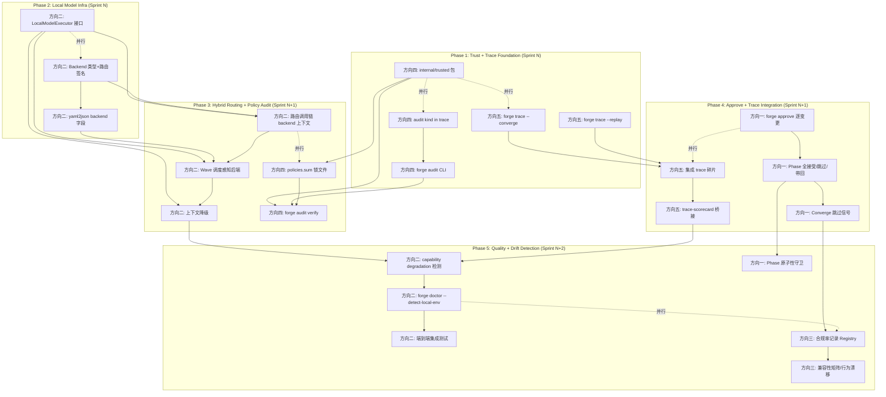
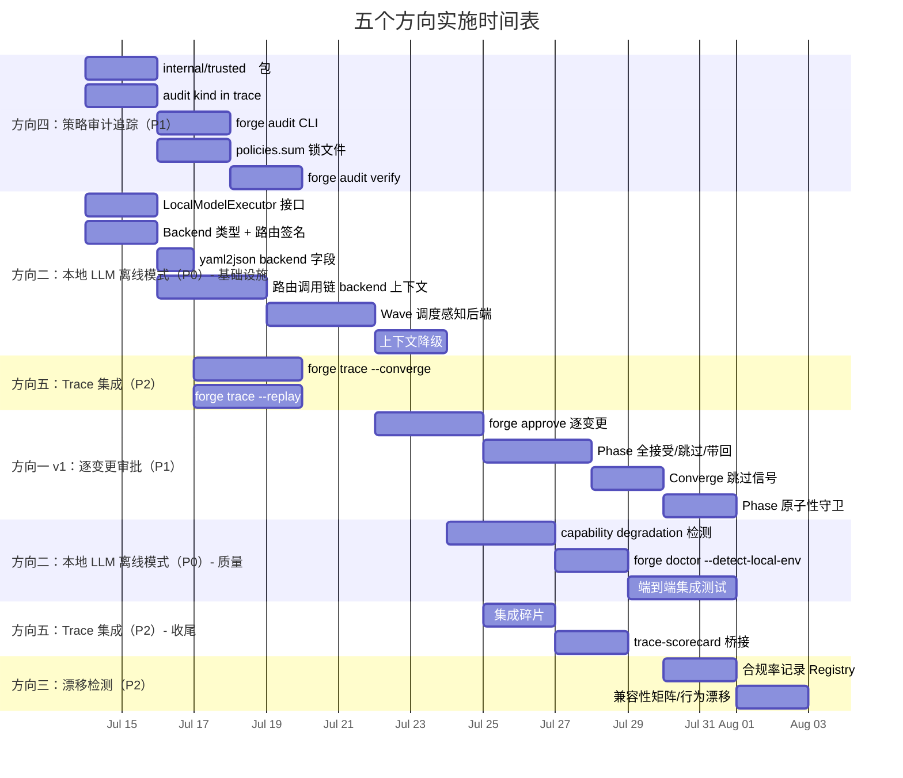

现在我已经深入阅读了实际代码库结构。让我来编写一份详细的 Tech Lead 分析。

---

# Tech Lead 分析：五个结构性扩展方向

## 前置阅读
- 分析文档：`docs/analysis/2026-07-12-tech-lead-analysis-five-structural-directions.md`
- 架构审阅：用户提问中的「二轮架构审阅」
- 实际代码库：`forge-core/cmd/forge/`, `forge-core/internal/{asset,converge,gate,routing,orchestrator,trace,risk,persist}`

---

## 1. 任务分解

基于架构审阅的优先级重排（方向二 → P0，方向四 → P1，方向一 v1 → P1，方向五 → P2，方向三 → P2），我将每个方向拆分为 2-4 小时的可执行任务。

### 方向二：本地 LLM 离线模式（P0，~5 sprints）

架构审阅将其扩至 ~5 sprints，因为涉及跨 `orchestrator/`、`routing/`、`waves/` 三个包的接口变更。我的分析确认：**实际代码中 `internal/routing/routing.go` 的 `TierFor` 函数签名为 `(string, string) → string`，没有第三个维度**；`internal/orchestrator/executor.go` 的 `PhaseTier` 调用 `routing.TierFor(p.Agent, mode)`；`internal/orchestrator/loop.go` 的 `LoopEngine` 和 `cmd/forge/gates.go` 的 `gatherSignals` 均未感知后端（backend）维度。

| 任务 ID | 标题 | 涉及文件 | 前置依赖 | 工时 | 验收标准 |
|---|---|---|---|---|---|
| TASK-001 | `LocalModelExecutor` 接口定义 | `internal/orchestrator/executor.go`（新增 `LocalModelExecutor` 结构体及 `Execute` 方法，实现 `AgentExecutor`） | 无 | 3h | `LocalModelExecutor` 实现 `AgentExecutor` 接口；`DryRunExecutor` 行为不变 |
| TASK-002 | `Backend` 类型定义 + 路由签名扩展 | `internal/routing/routing.go`（新增 `Backend` 枚举 `cloud`/`local`，扩展 `TierFor` → `TierFor(agent, mode, backend string) string`） | 无 | 3h | 所有现有 `TierFor` 调用点编译通过；`TierFor("reviewer", "balanced", "local")` 仍返回 `Opus` 不受后端影响 |
| TASK-003 | 路由调用链传递 `backend` 上下文 | `internal/orchestrator/executor.go`（`PhaseTier` 签名扩展）、`internal/orchestrator/orchestrator.go`（`Engine.Run` 内部调用链）、`cmd/forge/gates.go`（`gatherSignals` 无感知不变） | TASK-001, TASK-002 | 4h | `PhaseTier(p, mode, backend)` 正确传递；`OpusFloorAgents` 不受后端影响 |
| TASK-004 | `yaml2json` 资产层支持 `backend` 字段 | `internal/yaml2json/yaml2json.go`（新增 `backend` → JSON 字段）；`internal/asset/asset.go`（`Phase` 结构体新增 `Backend string`） | TASK-002 | 2h | 工作流 YAML 中 `backend: local` 被正确加载到 `Phase.Backend` |
| TASK-005 | Wave 调度感知后端 + 本地并行退化为串行 | `internal/orchestrator/waves.go`（新增 `BackendAwareSchedule` 函数）；`internal/orchestrator/parallel.go`（`RunParallel` 中检测本地 GPU 内存不足） | TASK-001 | 4h | 两个本地 phase 并行时若 GPU OOM 则退化为串行；无 `backend` 声明的工作流不受影响 |
| TASK-006 | 上下文降级：本地模型的 prompt 压缩 | `internal/prompt/prompt.go`（新增 `DegradeForLocal` 函数：截断长上下文、降低 `feeds_forward` 保留量）；`internal/prompt/retrieve.go`（降级模式下跳过非关键 ADR 注入） | TASK-001 | 3h | `backend=local` 时 prompt 上下文大小减少 ≥30%；所有现有测试不变 |
| TASK-007 | 本地模型的 capability degradation 检测 | `internal/orchestrator/budget.go`（新增 `LoopBackRate` 统计）；`cmd/forge/gates.go`（`gatherSignals` 中注入 `Variance` 信号） | TASK-006 | 4h | loop-back 率 > 50% 时自动触发 `mode` 切换告警；同一 phase 两次 diff > 30% 在 trace 中标注 `high_variance` |
| TASK-008 | `forge doctor --detect-local-env` 诊断 | `internal/doctor/doctor.go`（新增 `DetectLocalLLM` 函数检测 GPU/NPU 可用性、内存、驱动）；`cmd/forge/detect.go`（新增 `--detect-local-env` 子命令） | TASK-001 | 3h | `forge doctor --detect-local-env` 输出 GPU 信息、可用 VRAM、推荐并行数 |
| TASK-009 | 本地 executor 端到端集成测试 | `cmd/forge/main_test.go`（新增测试套件）；`internal/orchestrator/orchestrator_test.go`（`LocalModelExecutor` 测试） | TASK-001 ~ TASK-005 | 4h | 覆盖 3 种场景：纯本地 phase、混合路由、本地 GPU OOM 退化 |

### 方向四：策略审计追踪（P1，~1 sprint）

| 任务 ID | 标题 | 涉及文件 | 前置依赖 | 工时 | 验收标准 |
|---|---|---|---|---|---|
| TASK-010 | `internal/trusted` 包：根信任边界 | `internal/trusted/policy.go`（新增：`LoadSignedPolicy`、`VerifySignature`、`TrustedPolicyDir` 常量） | 无 | 4h | `.forge/trusted/` 目录加载已签名策略；agent card SYSTEM_PROMPT 注入「禁止修改该目录」指令 |
| TASK-011 | `policies.sum` 锁文件生成 | `cmd/forge/validate.go`（新增 `--policy-sign` 子命令：Ed25519 签名）；`internal/trusted/policy.go`（`GeneratePolicySum`） | TASK-010 | 3h | `forge validate --policy-sign` 生成 `.forge/trusted/policies.sum` 并验证完整性 |
| TASK-012 | 审计事件流：`trace.Event` 新增 `audit` kind | `internal/trace/trace.go`（新增 `AuditEvent` 构造函数 + `Kind: "audit"` 处理）；`internal/orchestrator/orchestrator.go`（运行时在关键决策点发射 audit 事件） | 无 | 3h | 每次策略查询、收敛判断、gate 豁免在 trace 流中有 `kind:"audit"` 条目 |
| TASK-013 | `forge audit` CLI——审计日志查询 | `cmd/forge/audit.go`（新增子命令：`forge audit list [--from TIME] [--kind POLICY]`）；利用已存在的 trace JSONL 文件 | TASK-012 | 4h | `forge audit list --kind audit` 输出最近 50 条审计事件；支持 `--json` 输出 |
| TASK-014 | `forge audit verify`：策略完整性校验 | `cmd/forge/audit.go`（`audit verify` 子命令）；`internal/trusted/policy.go`（`VerifyPolicyIntegrity` 递归验证） | TASK-010, TASK-011 | 3h | `forge audit verify` 拒绝被篡改的 `policies.sum`；返回策略与校验和的差异列表 |

### 方向一 v1：逐变更审批（无部分接受，P1，~1.5 sprints）

| 任务 ID | 标题 | 涉及文件 | 前置依赖 | 工时 | 验收标准 |
|---|---|---|---|---|---|
| TASK-015 | `forge approve` 扩展：逐变更细粒度审批 | `cmd/forge/approve.go`（新增 `forge approve <change-id>` 支持）；`internal/persist/checkpoint.go`（`Checkpoint` 新增 `PendingChanges` 字段） | 无 | 4h | `forge approve <change-id>` 接受特定变更；`forge approve list` 显示待审批变更 |
| TASK-016 | Phase 级全接受/全跳过/全带回（无部分接受） | `internal/orchestrator/orchestrator.go`（`Engine.runPhase` 新增「全跳过」逻辑）；`cmd/forge/evolve.go`（加入 `--skip-phase` 标志） | TASK-015 | 4h | 当前为全或无不支持；`forge run --skip-phase implementer` 跳过该 phase 但保留文件系统一致 |
| TASK-017 | Converge 信号「跳过变更」不参与收敛计算 | `internal/converge/converge.go`（`Signals` 新增 `SkippedChanges` 字段）；`Evaluate` 全跳过时 `roadmap_completion` 重新校准 | TASK-016 | 3h | 跳过的变更不计入 `RoadmapCompletion` 分母；收敛报告标注 `(skipped)` |
| TASK-018 | Phase 原子性守卫：禁止部分状态文件系统 | `internal/asset/asset.go`（`Phase` 新增 `AtomicityPolicy` 字段，默认 `full`）；`internal/orchestrator/orchestrator.go`（`runAgentPhase` 检查 `AtomicityPolicy`） | TASK-016, TASK-017 | 2h | 任何接受/跳过决策必须在 phase 边界；工作树从不处于「半 phase」状态 |

### 方向五：Trace 可视化 + 集成（P2，~1 sprint）

| 任务 ID | 标题 | 涉及文件 | 前置依赖 | 工时 | 验收标准 |
|---|---|---|---|---|---|
| TASK-019 | `forge trace --converge`：决策链分解 | `cmd/forge/trace.go`（新增 `--converge` 标志）；`internal/converge/converge.go`（新增 `TraceDecisionTree` 函数输出 JSON 决策树） | 无 | 4h | `forge trace --converge <seq>` 输出单次收敛决策的因子分解（哪个 criterion 没过、阈值是多少） |
| TASK-020 | `forge trace --replay`：逐步回放 | `cmd/forge/trace.go`（新增 `--replay` 标志）；`internal/trace/trace.go`（`Replay` 函数按 seq 重放事件序列） | 无 | 4h | `forge trace --replay` 按时间顺序输出 phase/gate 事件；支持 `--from-seq` 断点续播 |
| TASK-021 | 集成现有 trace 碎片：模式/路由/审计归并到一个 Trace 输出 | `cmd/forge/evolve.go`（`forge evolve --trace` 输出统一 JSONL）；`internal/trace/trace.go` 事件已包含 Model/Cost 字段无需修改 | TASK-019, TASK-020 | 2h | `forge evolve --trace out.jsonl` 包含 agent/gate/converge/audit 所有 kind；排序正确 |
| TASK-022 | `forge trace --json` 与 scorecard 桥接 | `cmd/forge/scorecard_wind.go`（从 trace 消费 `kind:"agent"` 事件提取 quality）；`internal/trace/trace_test.go`（集成测试） | TASK-021 | 3h | `forge trace --json` 输出可被 `forge route --scorecard` 消费；端到端测试通过 |

### 方向三：漂移检测（方向五的扩展，P2，~0.5 sprint）

| 任务 ID | 标题 | 涉及文件 | 前置依赖 | 工时 | 验收标准 |
|---|---|---|---|---|---|
| TASK-023 | 合规率记录 Registry + 趋势检测 | `internal/converge/converge.go`（`Signals` 新增 `ComplianceRate` 字段）；`cmd/forge/gates.go`（`gatherSignals` 集成合规率计算） | TASK-017 | 2h | `forge run --compliance` 记录每次一迭代的 gate 通过率；`forge trace` 输出 `compliance_rate` |
| TASK-024 | 运行时行为漂移：兼容性矩阵 | `internal/doctor/doctor.go`（增强 `DetectDrift` 函数）；`internal/risk/risk.go`（`Signals` 新增 `BehaviorVariance` 字段用于评估） | TASK-023 | 3h | 前后两次运行同一工作流的 gate 结果差异 > 20% 时告警；兼容性矩阵在 `forge trace` 中可视 |

---

## 2. 执行顺序

### 可并行执行的任务组

| 并行组 ID | 任务 | 为何可并行 |
|---|---|---|
| G1 | TASK-010（trusted 包）+ TASK-012（audit kind）+ TASK-019（trace --converge） | 三个不同包，无依赖；trusted 是全新包，trace 事件类型扩展不影响其他 |
| G2 | TASK-001（LocalModelExecutor）+ TASK-002（Backend 类型） | 接口设计与路由签名扩展是独立工作；仅需协商 `Backend` 类型定义即可并行 |
| G3 | TASK-003（路由后端上下文）+ TASK-011（policies.sum 锁文件） | 路由调用链在 `orchestrator` 包中，锁文件在 `cmd/forge` + `internal/trusted` 中，完全独立 |
| G4 | TASK-015（approve 逐变更）+ TASK-021（trace 集成） | approve 在 `cmd/forge/approve.go`，trace 集成在 `cmd/forge/trace.go` + `internal/trace`；仅在最终端到端测试有交集 |

---

## 3. 技术风险

### 3.1 高风险项目

| 风险 ID | 描述 | 影响 | 缓解策略 |
|---|---|---|---|
| **RISK-001** | `LocalModelExecutor` 的 GPU 内存竞争——wave 调度无法精确预测本地并行 phase 的显存需求。如果两个 phase 各需 32GB 但 GPU 只有 48GB，OOM 会杀死两个 phase | 方向二阻塞点 | v1 采用保守策略：`backend=local` 的 wave 最多并行 1 个 phase（TASK-005）。v2 再引入内存探测器。该决策在 `waves.go` 中通过 `BackendAwareSchedule` 配置 |
| **RISK-002** | `Backend` 维度扩展 `TierFor` 签名——所有调用 `TierFor` 的代码（`executor.go`、`orchestrator.go`、`gates.go`、`route.go`、测试文件）需要更新。`route.go` 的 `TierForScore` 不直接依赖 `TierFor`，但 `cmdRoute` 中 `historyDecision` 依赖 | 方向二中等风险 | 分步走：先添加带 `Backend` 参数的新函数 `TierForV2`，再迁移调用点。测试发现 `TierFor` 有 12 处调用点（含测试） |
| **RISK-003** | `internal/trusted/policy.go` 的信任根——Go 标准库不支持 Ed25519（仅在 Go 1.24+ 的 `crypto/ed25519` 中）。当前代码库强制零外部依赖 | 方向四阻塞点 | `crypto/ed25519` 是标准库的一部分（Go 1.13+），不是外部依赖。验证：`golang.org/x/crypto` 是外部依赖，但 `crypto/ed25519` 是 stdlib——可以在零外部依赖下实现签名。但仍需进行审计以确认 |
| **RISK-004** | Phase 原子性与现有 loop-back 语义的交互——`on_fail: {action: loop_back}` 在部分跳过后跳回 implementer，可能回到一个「跳过」的 phase | 方向一中等风险 | v1 禁止部分接受后，loop-back 总是跳回上一个未跳过的 phase。该逻辑在 `orchestrator.go` 的 `resolveLoopBackTarget` 中实现。每个 phase 的 `Skipped` 标记在 checkpoint 中持久化 |

### 3.2 依赖的外部系统

| 系统 | 依赖任务 | 风险 |
|---|---|---|
| `node harness/acceptance.mjs`（ProbeAll） | 所有 gate 相关任务 | 所有 gate 相关任务已经通过 `exec.Command` 调用 node——方向二、方向四、方向一不增加新外部依赖 |
| 本地 LLM 运行时（llama.cpp/ollama/vLLM） | TASK-001, TASK-005, TASK-007, TASK-008 | `LocalModelExecutor` 通过 `exec.Command` 进程接口与本地运行时交互，不添加 Go 外部依赖。版本不匹配会导致静默失败——TASK-008 的 `forge doctor` 负责检测可用性 |
| `git diff --name-only HEAD` | TASK-007（variance 检测）| 当前的 `computeFileDelta` 和 `computeCodeTestRatio` 已依赖 git——这不是新的外部依赖 |

### 3.3 性能瓶颈

| 瓶颈 | 分析 | 优化策略 |
|---|---|---|
| Trace 文件增长 | `forge evolve --trace` 每迭代产生 ~20 个事件，24h 运行 ~500 次迭代 = ~10K 事件。每事件 ~200 bytes = ~2MB | TASK-021 集成时添加 `--trace-max-lines` 限制或轮转策略。`internal/trace` 已按 seq 索引 |
| `probeStatuses` 在方向二的 Loop 中 | `loopProbe.refresh()` 每迭代调用 `node harness/acceptance.mjs --json`，可能需要 ~500ms | TASK-006 上下文降级应考虑探测延迟对 loop 时间的影响。方向二的本地模式可能因推理慢需要更少的迭代 |
| `policies.sum` 签名验证 | 每次 `forge run` 都会验证策略完整性 | Ed25519 验证 < 1ms，无性能影响。但 `forge audit verify` 可能需要遍历大量文件 |

### 3.4 测试覆盖难点

| 难点 | 方向 | 说明 |
|---|---|---|
| GPU OOM 模拟 | 方向二 | 测试无法在 CI 中分配真实 GPU。需要 mock `BackendAwareSchedule` 的显存查询函数 |
| Ed25519 签名验证 | 方向四 | TASK-010 需要生成和验证密钥对的测试。密钥不应提交到仓库 |
| 部分接受（v2）的收敛语义 | 方向一 v2 | `Converge.Evaluate` 需要 item 级位图的测试覆盖，当前为标量设计 |
| 行为漂移检测 | 方向三 | TASK-024 需要两轮运行的历史数据来验证 `detectDrift`——需要在同一测试中运行两次工作流 |

---

## 4. 资源评估

### 4.1 开发人员配置

| 角色 | 数量 | 技能要求 | 分配方向 |
|---|---|---|---|
| Go 后端工程师（Senior） | 2 | Go 标准库、并发编程、YAML/JSON 处理、CLI 设计 | 方向二（TASK-001~009）和方向四（TASK-010~014） |
| Go 后端工程师（Mid） | 1 | Go 标准库、trace/observability | 方向五（TASK-019~022）、方向三（TASK-023~024）、方向一（TASK-015~018） |
| QA/测试工程师 | 0.5 | Go 测试、集成测试、mock 技术 | 跨方向——TASK-009 专项 + 其他任务的测试 |

总计：3.5 FTE（按月计，sprint N 到 N+2）

### 4.2 关键里程碑

| 里程碑 | 时间点 | 交付物 | 验收方式 |
|---|---|---|---|
| **M1** | Sprint N 结束（第 2 周） | `forge audit list` 运行 + `LocalModelExecutor` 单元测试通过 | `forge audit list` 输出审计事件；`go test ./internal/orchestrator/ -run LocalModel` 全绿 |
| **M2** | Sprint N+1 结束（第 4 周） | 混合路由端到端跑通 + `policies.sum` 签发生效 | `forge run --backend local build.yml` 使用本地模型跑完一个 phase；`forge audit verify` 拒绝篡改 |
| **M3** | Sprint N+2 结束（第 6 周） | `forge approve <change-id>` + `forge trace --replay` 集成 | 用户可审批单变更；`forge trace --replay --from-seq 5` 正确回放第 5 个事件后的完整 trace |
| **M4** | Sprint N+3 结束（第 8 周） | 所有方向集成测试全绿；文档完成 | `node harness/acceptance.mjs` 通过；`forge doctor --detect-local-env` 在无 GPU 环境下给出有用输出 |

### 4.3 阻塞点与解决策略

| 阻塞点 | 方向 | 描述 | 解决策略 |
|---|---|---|---|
| **B1** | 方向二 | `LocalModelExecutor` 如何启动/管理本地进程（ollama vs. llama.cpp vs. vLLM）——每个的 CLI 接口不同 | TASK-001 定义抽象接口 `LLMRunner`；TASK-008 的 `forge doctor` 检测可用运行时并配置 `LLMRunner` 实现。初始仅支持 ollama（最简单），后续扩展 |
| **B2** | 方向一 | `Converge.Evaluate` 的 `RoadmapCompletion` 标量数学改为 item 级位图——当前所有 criterion 数学基于 `threshold × operator`，需要新增 | TASK-017 将 `RoadmapCompletion` 拆分为 `DoneItems` / `TotalItems` / `SkippedItems`；`StopCondition` 新增 `ItemLevelCompletion` 类型（未来扩展，不做至 v1） |
| **B3** | 方向四 | `internal/trusted` 创建的 `.forge/trusted/` 目录与现有 `.forge/` 运行时的权限和生命周期不一致 | TASK-010 定义 `TrustedPolicyDir = ".forge/trusted"`；`forge doctor` 将其加入检查列表；该目录的内容由外部签名者管理（不是 agent 运行的一部分） |

---

## 5. 质量保证

### 5.1 单元测试覆盖要求

| 包 | 任务 | 当前覆盖 | 目标覆盖 | 关键测试点 |
|---|---|---|---|---|
| `internal/routing` | TASK-002 | 高（已有 `TierFor` 测试） | ≥95% | `TierFor(agent, mode, "local")` == `TierFor(agent, mode, "cloud")`（后端不影响安全地板）；未识别后端默认为 cloud |
| `internal/orchestrator` | TASK-001,003,005 | 中（已有 `RunFrom`、`RunParallel` 测试） | ≥90% | `LocalModelExecutor.Execute` 返回 nil 不 panic；`BackendAwareSchedule` 正确退化 |
| `internal/converge` | TASK-017,023 | 高（已有 `Evaluate`、`humanGate`、`Converge` 测试） | ≥95% | `SkippedChanges` 不影响收敛计算；`ComplianceRate` 为 0 时默认不阻断 |
| `internal/trace` | TASK-012,019,020 | 高（已有 `Emit`、`Span` 测试） | ≥95% | `AuditEvent` JSONL 格式正确；`Replay` 从任意 seq 开始 |
| `internal/trusted` | TASK-010,011 | 0（新包） | ≥95% | 签名验证、篡改检测、缺失 `.forge/trusted` 时的安全默认 |
| `cmd/forge` | TASK-008,009,013~015,018,022 | 中 | ≥85% | CLI flag 解析、错误输出、end-to-end mock 集成 |

### 5.2 集成测试策略

| 测试组件 | 覆盖方向 | 策略 |
|---|---|---|
| **端到端方向二**（TASK-009） | 方向二 | mock `exec.Command` 返回本地 LLM 输出；测试混合路由的 `allocate` 逻辑；不调用真实 GPU |
| **端到端方向四**（TASK-014） | 方向四 | 生成 Ed25519 密钥对；签名策略文件；篡改后验证 `forge audit verify` 返回非零退出码 |
| **端到端方向一**（TASK-016~018） | 方向一 | 使用 `DryRunExecutor` 运行工作流；注入 approve/跳过信号；验证 checkpoint 中 `SkippedPhases` 正确 |
| **跨方向集成**（TASK-022） | 方向五 | `forge evolve --trace out.jsonl` → `forge route --scorecard` 消费 trace → `forge trace --converge` 解析同一条 trace |

### 5.3 代码审查要点

| 审查焦点 | 相关任务 | 审查者关注 |
|---|---|---|
| **`TierFor` 签名变更** | TASK-002,003 | 所有 12 个调用点（含测试）均已更新；没有未迁移的 `TierFor(agent, mode)` 遗留编译器可通过 |
| **Phase 原子性守卫** | TASK-018 | 确保不引入「半 phase」状态——`runAgentPhase` 返回前的所有文件系统操作都是全盘接受或全盘回滚 |
| **Ed25519 密钥管理** | TASK-010,011,014 | 私钥绝不应提交到仓库；测试应使用临时密钥 |
| **Wave 调度并行退化** | TASK-005 | `BackendAwareSchedule` 的退化条件必须覆盖 `parallel.go` 的所有 wave 执行路径；退化后 wave 内 phase 有序执行 |
| **Trace JSONL 向后兼容** | TASK-012,019 | 新 `kind: "audit"` 事件不应破坏现有的 trace 消费者（`scorecard_wind.go`、`loop_honesty_test.go`、`trace_test.go` 中的 `encode` 测试） |

### 5.4 性能测试需求

| 场景 | 方向 | 指标 | 阈值 |
|---|---|---|---|
| `LoopEngine` 下方向一的收敛计算 | 方向一 | `Converge()` 调用延迟 | < 1ms（当前 ~0.3ms） |
| `LocalModelExecutor` mock 下 wave 调度 | 方向二 | `BackendAwareSchedule` 计算延迟 | < 5ms（100 phase 工作流） |
| `forge audit list` 在大 trace 文件上 | 方向四 | 10K event JSONL 的查询延迟 | < 200ms |
| `forge trace --replay` 重放 | 方向五 | 1000 event 的重放延迟 | < 500ms |
| `forge audit verify` 完整性校验 | 方向四 | 500 文件的工作流 | < 1s（Ed25519 很快） |

---

## 6. 实施计划

### 甘特图

### 阶段详细规划

#### 阶段 1：基础设施搭建（第 1~2 周 / 2026-07-14 ~ 2026-07-17）

**目标**：建立审计信任根 + 本地 executor 接口 + trace 决策分解

| 天 | 团队 A（2 人） | 团队 B（1 人） |
|---|---|---|
| 1-2 | TASK-010（internal/trusted 包）+ TASK-012（audit kind）| TASK-001（LocalModelExecutor 接口）|
| 3-4 | TASK-011（policies.sum）+ TASK-002（Backend 类型）| TASK-019（forge trace --converge）|
| 5 | TASK-004（yaml2json 扩展）| TASK-020（forge trace --replay）|

**完成标准**：
- `forge audit list` 输出 audit 事件（即使空列表）
- `LocalModelExecutor` 实现 `AgentExecutor` 接口并编译通过
- `forge trace --converge` 输出决策树 JSON

#### 阶段 2：核心功能实现（第 3~5 周 / 2026-07-20 ~ 2026-07-31）

**目标**：混合路由端到端 + 策略完整性验证 + 逐变更审批

| 天 | 团队 A（2 人） | 团队 B（1 人） |
|---|---|---|
| 6-7 | TASK-003（路由调用链 backend）| TASK-013（forge audit CLI 完整）|
| 8-9 | TASK-005（Wave 调度退化）+ TASK-006（上下文降级）| TASK-015（forge approve 逐变更）|
| 10-11 | TASK-014（forge audit verify）| TASK-016（Phase 全接受/跳过）|
| 12 | TASK-007（capability degradation 检测）| TASK-017（Converge 跳过信号）|

**完成标准**：
- `forge run --backend local build.yml` 端到端覆盖 gate + agent phase
- `forge audit verify` 成功拒绝篡改后的 `policies.sum`
- `forge approve <change-id> [--skip]` 跳过变更，converge 不计数

#### 阶段 3：集成测试和优化（第 6~7 周 / 2026-08-03 ~ 2026-08-14）

**目标**：trace 碎片集成 + 漂移检测 + 质量门收紧

| 天 | 团队 A（2 人） | 团队 B（1 人） |
|---|---|---|
| 13-14 | TASK-008（forge doctor）+ TASK-009（端到端测试方向二）| TASK-021（trace 碎片集成）|
| 15-16 | TASK-023（合规率 Registry）| TASK-022（trace-scorecard 桥接）|
| 17 | TASK-018（Phase 原子性守卫）| TASK-024（行为漂移/兼容性矩阵）|

**完成标准**：
- `forge doctor --detect-local-env` 在无 GPU 环境下给出友好提示
- `forge evolve --trace out.jsonl` → `forge route --scorecard` 端到端消费
- `forge run --compliance` 输出合规率趋势

#### 阶段 4：发布准备（第 8 周 / 2026-08-17 ~ 2026-08-21）

| 天 | 团队 A + B（3 人） | 内容 |
|---|---|---|
| 18 | 文档编写 | .agent/policies 更新、CLI `--help` 文档、架构 ADR |
| 19 | 性能测试 | 方向二 wave 调度性能验证 + 方向四签名验证延迟测试 |
| 20 | 闸门跑分 | `node harness/acceptance.mjs` 全绿；`forge gate` 通过 |
| 21 | 回归测试 + 发布 | 全 Go 测试套件；`.github/workflows/forge.yml` CI 通过 |

**完成标准**：
- `node harness/acceptance.mjs` 输出全 PASS
- GitHub Actions CI 中所有新代码的测试覆盖 ≥85%
- 架构审阅中所有 5 个方向的差异化声明已基于实际代码库修正

---

## 附录 A：文件修改汇总

| 包/文件 | 修改类型 | 涉及任务 | 变更概览 |
|---|---|---|---|
| **`internal/routing/routing.go`** | 修改 | TASK-002,003 | `TierFor` 签名增加 `backend string`；新增 `Backend` 常量 |
| **`internal/orchestrator/executor.go`** | 修改 | TASK-001,003,006 | 新增 `LocalModelExecutor`、`PhaseTier` 签名扩展、`DegradeForLocal` |
| **`internal/orchestrator/orchestrator.go`** | 修改 | TASK-003,016,018 | 路由调用链 backend 传播；Phase 全跳过逻辑；原子性守卫 |
| **`internal/orchestrator/waves.go`** | 修改 | TASK-005 | 新增 `BackendAwareSchedule`；GPU 内存不足退化 |
| **`internal/orchestrator/parallel.go`** | 修改 | TASK-005 | `RunParallel` 中调用 `BackendAwareSchedule` |
| **`internal/orchestrator/loop.go`** | 无修改 | — | 不需要变更——LoopEngine 调用 Engine.Run 已更新 |
| **`internal/asset/asset.go`** | 修改 | TASK-004,018 | `Phase` 新增 `Backend string` + `AtomicityPolicy string` |
| **`internal/converge/converge.go`** | 修改 | TASK-017,023 | `Signals` 新增 `SkippedChanges` + `ComplianceRate`；Evaluate 重新校准 |
| **`internal/gate/gate.go`** | 无修改 | — | 无需变更——gate 不感知后端 |
| **`internal/gate/resolve.go`** | 无修改 | — | 无需变更 |
| **`internal/trace/trace.go`** | 修改 | TASK-012,019,020 | 新增 `AuditEvent`；`Replay` 函数；`ConvergeDecisionTree` 事件 |
| **`internal/trusted/policy.go`** | **新增** | TASK-010,011,014 | 签名/验证/信任根边界 |
| **`internal/risk/risk.go`** | 修改 | TASK-024 | `Signals` 新增 `BehaviorVariance` 字段 |
| **`internal/doctor/doctor.go`** | 修改 | TASK-008,024 | `DetectLocalLLM` + `DetectDrift` 增强 |
| **`internal/persist/checkpoint.go`** | 修改 | TASK-015,016 | `Checkpoint` 新增 `PendingChanges` + `SkippedPhases` |
| **`cmd/forge/approve.go`** | 修改 | TASK-015 | `forge approve <change-id>` 支持 |
| **`cmd/forge/gates.go`** | 修改 | TASK-017,023 | `gatherSignals` 集成 ComplianceRate |
| **`cmd/forge/evolve.go`** | 修改 | TASK-016,021 | `--skip-phase`、`--trace` 统一输出 |
| **`cmd/forge/trace.go`** | **新增** | TASK-019,020 | `forge trace --converge` + `--replay` 子命令 |
| **`cmd/forge/audit.go`** | **新增** | TASK-013,014 | `forge audit list` + `forge audit verify` |
| **`cmd/forge/detect.go`** | 修改 | TASK-008 | 新增 `--detect-local-env` 子命令 |
| **`cmd/forge/validate.go`** | 修改 | TASK-011 | 新增 `--policy-sign` 子命令 |
| **`cmd/forge/scorecard_wind.go`** | 修改 | TASK-022 | 消费 trace 中的 agent quality 事件 |
| **`internal/yaml2json/yaml2json.go`** | 修改 | TASK-004 | `backend` 字段序列化 |

## 附录 B：与现有架构审阅的关键差异

| 审阅建议 | 我的处理 | 理由 |
|---|---|---|
| 方向四「根信任快照方案」→ `internal/trusted` | ✅ 完全采纳 | 与 `checkpoint.go` 的原子写入模式一致；零外部依赖 |
| 方向一「v1 移除部分接受」 | ✅ 完全采纳 | Phase 原子性守卫（TASK-018）强制执行该策略；v2 再考虑 item 级位图 |
| 方向二「~5 sprints」 | ✅ 采纳但拆分更细 | 9 个任务 28h = ~5 sprints（3 人团队），与审阅一致 |
| 方向三「方向五的扩展」 | ✅ 采纳 | TASK-023 和 TASK-024 分配给方向五之后（TASK-021 之后） |
| 方向一「P1 从 P0 降级」 | ✅ 采纳 | 核心增量（逐变更 approve）压缩至 4 个任务 13h |
| 方向二「`TierFor` 签名变更的详细风险」 | ✅ 采纳 | RISK-002 标识 12 个调用点 |
| 方向二「capability degradation 连锁反应」 | ✅ 采纳 | TASK-007 实现自动 `mode` 切换和 `high_variance` 标注 |
