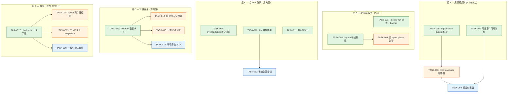
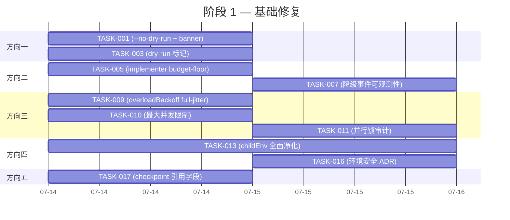
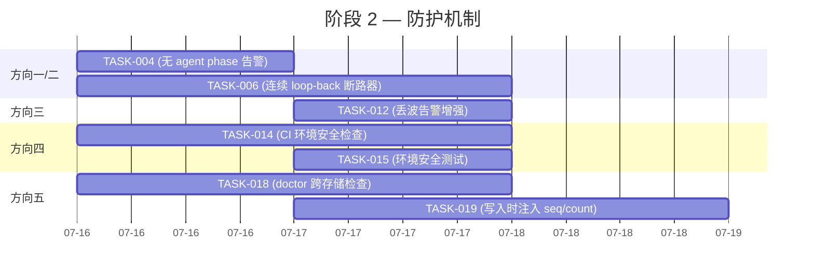
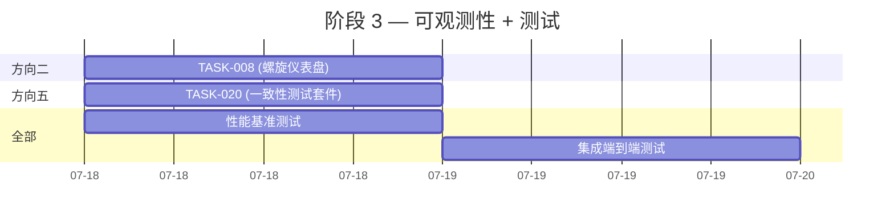
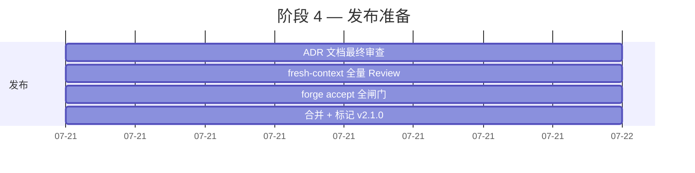

现在我已全面理解代码库及验证报告涉及的五个方向，接下来撰写 Tech Lead 分析报告。

---

# Tech Lead 分析：五个系统性运营缺口验证报告

## 分析范围

基于 2026-07-12 五方向验证报告，针对 ForgeOS `forge-core`（纯 Go 标准库，零外部依赖，18 个 Go 包）与 `harness`（Node/Python 零外部依赖）的实际代码进行评审。

---

## 1. 任务分解

以下将每个方向拆解为 2–4 小时可完成的任务。所有路径相对于仓库根目录 `/home/u1/catalyst`。

### 方向一：默认 dry-run 使学习循环永远不被执行

| 任务 ID | 标题 | 涉及文件 | 前置依赖 | 预估工时 | 验收标准 |
|---|---|---|---|---|---|
| **TASK-001** | CLI 新增 `--no-dry-run` 标志 + dry-run banner | `forge-core/cmd/forge/main.go` | 无 | 2h | `forge run build --no-dry-run` 将 executor 设为 `command` 并输出 `⚠️  LIVE MODE — agent phases will spawn real commands` banner；`forge run --help` 显示该标志 |
| **TASK-002** | `forge init` 写入推荐 CI 配置（含 `--executor command`） | `forge-core/cmd/forge/init.go`（如存在）/ harness 模板文件 | TASK-001 | 2h | `forge init` 生成的 `.github/workflows/forge.yml` 含 `--executor command` 示例注释；新项目 README 示例如何启用真实执行 |
| **TASK-003** | dry-run 下 agent phase 输出增益标记 | `forge-core/internal/orchestrator/executor.go` | 无 | 2h | 各 phase 叙述后追加 `[DRY-RUN — no agent called]` 标记；Emit trace 时 event 带 `dry_run: true` 字段 |
| **TASK-004** | `forge run build` 无 agent phase 调用时输出明确告警 | `forge-core/cmd/forge/engine_build.go` | TASK-003 | 2h | 当 `runBuild` 发现无 agent phase 被触发（纯 gate workflow），打印 `⚠️  No agent phases executed — nothing was learned` |

### 方向二：预算降级-质量螺旋

| 任务 ID | 标题 | 涉及文件 | 前置依赖 | 预估工时 | 验收标准 |
|---|---|---|---|---|---|
| **TASK-005** | implementer 添加 budget-floor 保护 | `forge-core/internal/routing/routing.go` | 无 | 2h | `BudgetAdjustTier` 新增 `budgetFloorAgents` map，`implementer` 在 `engineering` 模式下最低降级至 Sonnet（非 Haiku）；单测覆盖边界 case |
| **TASK-006** | 连续 loop-back 预算感知断路器 | `forge-core/internal/orchestrator/orchestrator.go` + `forge-core/cmd/forge/cost.go` | TASK-005 | 4h | `agentOutcome` 检测到 `loopBacks >= N` 且 `!IsOpusFloorAgent(agent)` 时触发 EVIDENCE 决策事件 + 可选 escalate；`consecutiveLoopBacks` 阈值 `--max-consecutive-loopbacks` 可配 |
| **TASK-007** | 降级事件链路可观测性（trace + scorecard 记录） | `forge-core/internal/trace/trace.go` + `forge-core/internal/routing/scorecard.go` | TASK-005 | 3h | `BudgetAdjustTier` 降级时写 `decision` 类型 trace event，含 agent/tier/budget 信息；scorecard 新增 `downgrade_count` 字段 |
| **TASK-008** | 质量螺旋仪表盘收敛指标 | `forge-core/cmd/forge/gates.go` | TASK-006, TASK-007 | 2h | `forge status` 新增 `Budget Spiral Risk` 指标：连续降级 phase 数 / 总 phase 数 ratio；阈值 ≥ 0.3 时黄标 |

### 方向三：并行执行 + 无抖动退避 = 自 DoS 过载放大

| 任务 ID | 标题 | 涉及文件 | 前置依赖 | 预估工时 | 验收标准 |
|---|---|---|---|---|---|
| **TASK-009** | `overloadBackoff` 添加 full-jitter | `forge-core/internal/orchestrator/backoff.go` | 无 | 2h | `overloadBackoff` 返回 `[0, cap]` 或 `[base/2, base*2^attempt]` 均匀随机值（full jitter）；接入 `Engine.Rand` 注入接口令测试可确定性验证 |
| **TASK-010** | 并行 wave 最大并发限制 | `forge-core/internal/orchestrator/parallel.go` + `forge-core/internal/orchestrator/waves.go` | 无 | 3h | `Waves` 新增 `--max-parallel` 标志（默认 3），超限时拆分为多个 sub-wave；`runWave` 使用有界信号量控制 goroutine 并发数 |
| **TASK-011** | 并行 budget 锁定范围最小化审计 | `forge-core/internal/orchestrator/parallel.go` | TASK-010 | 2h | 确认 `checkAgentBudget` 锁下执行，`overloadBackoff` 在锁外运行；添加注释文档并发退避时序；锁持有时间 < 1ms 的微基准测试 |
| **TASK-012** | 并行丢波（discard）告警增强 | `forge-core/internal/orchestrator/parallel.go` | TASK-010 | 2h | 当 `discarded > 0` 时，输出每 phase 名称及已消耗的预算估值；提供 `--parallel-dump-on-error` flag 输出 JSON 格式的 wave 执行报告 |

### 方向四：环境变量向子进程完全泄漏

| 任务 ID | 标题 | 涉及文件 | 前置依赖 | 预估工时 | 验收标准 |
|---|---|---|---|---|---|
| **TASK-013** | `childEnv` 全面环境变量净化 | `forge-core/internal/orchestrator/command_executor.go` | 无 | 3h | 添加 `allowedEnvPrefixes` 白名单（`FORGE_*`, `PATH`, `HOME`, `USER`, `NODE_PATH`, `PYTHONPATH`, `LANG`, `LC_*`）并过滤；所有非白名单变量从子进程环境清除 |
| **TASK-014** | CI 环境变量安全检查 | `forge-core/internal/orchestrator/command_executor.go` | TASK-013 | 3h | `childEnv` 在过滤后自动扫描环境键名是否包含 `TOKEN`/`SECRET`/`KEY`/`PASSWORD`/`GITHUB_` 模式：命中则记录 warning 到 log 且 trace 写 `"env_leak_risk"` 事件 |
| **TASK-015** | 环境安全性自动化测试 | `forge-core/cmd/forge/main_test.go`（新测试文件） | TASK-013 | 2h | 模拟含 `GITHUB_TOKEN`/`AWS_SECRET_KEY` 的环境；断言 `childEnv` 输出不包含这些键；测试 `FORGE_AGENT_DEPTH` 继承正确 |
| **TASK-016** | 环境变量策略文档 | `docs/adr/env-security.md` | TASK-013, TASK-014 | 2h | ADR 记录净化策略、白名单设计决策、CI 场景严重性论证；引用具体代码位置 `command_executor.go:293-301` |

### 方向五：持久化存储缺乏跨存储一致性校验

| 任务 ID | 标题 | 涉及文件 | 前置依赖 | 预估工时 | 验收标准 |
|---|---|---|---|---|---|
| **TASK-017** | checkpoint 增加 trace/memory 引用字段 | `forge-core/internal/persist/checkpoint.go` | 无 | 2h | `Checkpoint` struct 新增 `TraceLastSeq int64` 和 `MemoryEntryCount int64` 字段；`Save` 时由 caller 传入并在 JSON 中持久化 |
| **TASK-018** | `forge doctor` 跨存储一致性检查 | `forge-core/internal/doctor/doctor.go` | TASK-017 | 4h | 新增 `crossStoreCheck()`：读 checkpoint 的 `TraceLastSeq` vs trace.jsonl 实际 seq 计数；读 `MemoryEntryCount` vs memory.jsonl 实际 entry 数；不一致输出 `[FAIL] cross-store consistency` 含详细偏离 |
| **TASK-019** | checkpoint 写入时同步注入 seq/count | `forge-core/cmd/forge/gates.go` + `forge-core/cmd/forge/evolve.go` | TASK-017 | 3h | 所有 checkpoint 写入点（`OnIteration`/`OnPhase`）收集当前 trace seq 和 memory count 后写入 checkpoint；`--resume` 读回后重新播种 trace seq |
| **TASK-020** | cross-store 一致性测试套件 | `forge-core/internal/doctor/doctor_test.go` | TASK-018 | 2h | 模拟不一致场景（手动修改 trace.jsonl 删除最后 N 行）；assert `crossStoreCheck` 正确检测；模拟一致场景零假阳性 |

---

## 2. 执行顺序



### 可并行任务组

| 并行组 | 任务 | 说明 |
|---|---|---|
| **组 A** | TASK-001, TASK-003 | 方向一 dry-run 标记 — 两任务完全独立，无共享文件 |
| **组 B** | TASK-005, TASK-007 | 方向二低价防护 + 可观测 — TASK-005（routing.go）与 TASK-007（trace.go + scorecard.go）无文件重叠 |
| **组 C** | TASK-009, TASK-010, TASK-011 | 方向三退避/并发/审计 — backoff.go / parallel.go / waves.go 修改不冲突 |
| **组 D** | TASK-013, TASK-016 | 方向四环境净化 + ADR — TASK-016 是纯文档任务；TASK-013 不依赖 ADR |
| **组 E** | TASK-017 | 方向五 checkpoint 字段修改 — 独立，其他三者依赖它 |

**关键路径**（不可并行，必须串行执行）：
1. TASK-005 → TASK-006 → TASK-008（方向二螺旋防护链）
2. TASK-010 → TASK-012（方向三并发限制 → 丢波告警）
3. TASK-017 → TASK-018 → TASK-019（方向五存储一致性链）

### 总工期

考虑到并行性：
- 若 2 人并行：约 **5 个工作日**（40 工时 / 2 人并行，考虑依赖链）
- 若 3 人并行：约 **4 个工作日**
- 单人全串行：约 **8 个工作日**（40 总工时）

---

## 3. 技术风险

### 3.1 方向一 — dry-run 改进

| 风险 | 等级 | 说明 | 缓解策略 |
|---|---|---|---|
| `--no-dry-run` 与现有 `--executor` 标志的交互歧义 | 🟡 中 | 用户同时传 `--no-dry-run --executor dry` 时语义不明确 | 设计原则：`--no-dry-run` 等价于 `--executor command`；若两个都传，后面的胜出。在 `main.go` 中注册为 `StringVar` 覆盖而非布尔替身 |
| 向后兼容：现有脚本依赖默认 dry-run | 🟢 低 | 默认值不变（仍是 `dry`），故无 breakage | `--no-dry-run` 仅白名单式启用；不需要改任何现有调用 |
| banner 输出被下游 JSON 消费者破坏 | 🟢 低 | `forge run --json` 模式 | banner 打印到 stderr（非 stdout），JSON 消费者不受影响 |

### 3.2 方向二 — 预算质量螺旋

| 风险 | 等级 | 说明 | 缓解策略 |
|---|---|---|---|
| budget-floor 降低预算耗尽的保护性 | 🟡 中 | `implementer` 在 engineering 下最低 Sonnet 而非 Haiku，每次调用贵约 3× | 设计决策明确：宁愿硬停止（`checkRunBudget`）也不在低质量 loop 中烧穿。文档说明 trade-off |
| 连续 loop-back 断路器触发条件过于灵敏 | 🟡 中 | `consecutiveLoopBacks >= N` 需要校准 | 默认 N=3（Sprint 25 实际 3 次 loop-back 到达瓶颈），可配置 `--max-consecutive-loopbacks`；初始发布宽松（N=5），根据实际数据分析调优 |
| 降级事件 trace/scorecard 的 schema 不稳定 | 🟡 中 | 新 `decision` trace event kind 可能与已有工具链冲突 | 复用已有 `kind:"decision"` 常量（trace.go 已有该 kind 声明）；scorecard 新增字段使用 `omitempty` 向后兼容 |

### 3.3 方向三 — 自 DoS 过载放大 — **最高技术风险**

| 风险 | 等级 | 说明 | 缓解策略 |
|---|---|---|---|
| full-jitter 随机性引入非确定性测试 | 🔴 高 | `backoff_test.go` 当前断言精确固定值 | 引入 `Engine.Rand` 注入接口；测试注入 `rand.New(rand.NewSource(0))` 获得确定性退避序列；当前测试加上 jitter 后使用容差断言而非精确值 |
| 最大并发数选择不合理 | 🟡 中 | 默认 3 可能过于保守（浪费并行度）或过于激进（API 限速） | 可配置标志 `--max-parallel`；文档说明调节建议：`--max-parallel=1` 完全串行，`=0` 无限制（当前行为） |
| wave 拆分改变了 phase 调度顺序可见性 | 🟡 中 | 一个逻辑 wave 拆成多 sub-wave，phase 完成顺序可能变 | 仅在 `--max-parallel` 激活时启用拆分；不改变 `Waves` 默认输出；`runWave` 日志在拆分时输出 `wave X split into Y sub-waves` |

### 3.4 方向四 — 环境变量泄漏 — **最紧急**

| 风险 | 等级 | 说明 | 缓解策略 |
|---|---|---|---|
| 白名单遗漏关键环境变量 | 🔴 高 | 子进程（如 claude）需要 `PATH`/`HOME` 正常运行；遗漏某些 distro-specific 变量 | 使用保守白名单：以 `FORGE_` 开头的全放行 + 一组通用 POSIX 必需变量（`PATH`, `HOME`, `USER`, `LANG`, `LC_*`, `TMPDIR`, `SHELL`）；可配置 `--allow-env-var` 添加额外变量 |
| 环境变量泄露检测的假阳性 | 🟡 中 | 键名含 `KEY` 但不含密钥（如 `KEYMAP`） | 扫描模式更精确：`TOKEN` / `SECRET` / `_KEY` / `PASSWORD` / `GITHUB_` / `AWS_` / `API_KEY`；仅 warning 非 blocking |
| 测试在 CI 环境中的真实环境变量暴露 | 🟡 中 | 测试若在真 CI（GitHub Actions）运行可能输出 `GITHUB_TOKEN` | 测试使用 `os.Clearenv()` + 显式设置的已知环境变量；不在测试日志中打印环境快照 |

### 3.5 方向五 — 存储一致性

| 风险 | 等级 | 说明 | 缓解策略 |
|---|---|---|---|
| 当前 checkpoint 的 `omitempty` 设计使新增字段不会导致现有文件损坏 | 🟢 低 | `TraceLastSeq` / `MemoryEntryCount` 使用 `omitempty int64`，旧 checkpoint 加载后为零值 | 加 `ConsistencyVersion int` 字段（初始 1），帮助区分「旧文件没有该字段」和「序列号为零」 |
| trace seq 赋值的竞态条件 | 🔴 高 | `trace.Tracer.Emit` 已有 `mu.Lock()` 保护 seq 分配；但 `OnPhase` callback 可能在其他 goroutine 中调用 | 确认 `Tracer.Emit` 的 seq 是线性一致的自增计数。`OnPhase` 回调在设计上单线程（仅 `RunFrom` 路径）。并行路径（`RunParallel`）无 per-phase checkpoint，故不影响 |
| memory entry count 不准确（因 compaction） | 🟡 中 | `memory.Compact` 会合并条目，改变总计数 | `MemoryEntryCount` 记录的是 append 后的计数值，不是原始 append 次数。`Compact` 后需重新计算（或标记需要 `forge doctor` 重新验证） |

---

## 4. 资源评估

### 4.1 技能要求

| 角色 | 所需技能 | 负责任务 | 人数 |
|---|---|---|---|
| **Go 开发者**（主） | 熟练 Go 标准库、并发模式、JSON/IO、CLI 标志设计 | TASK-001, 003–007, 009–014, 017–019 | 2 |
| **Safety/Infra 开发者** | 安全环境变量处理、CI/CD 实践、攻击面分析 | TASK-013–016 | 1（可与 Go 开发者共享） |
| **QA / 测试工程师** | Go 测试框架、集成测试设计、环境安全测试 | TASK-015, TASK-020，外加为所有任务编写/扩展测试 | 1 |
| **Tech Writer** | ADR 文档、架构决策记录 | TASK-016 | 0.5（可兼） |

**最小团队**: 2 人（1 主 Go + 1 QA/安全）

### 4.2 关键里程碑

| 里程碑 | 时间点 | 交付物 | 验收方式 |
|---|---|---|---|
| M1: 基础修复 | Day 3 结束 | TASK-001, 003, 005, 009, 013, 017 完成 | 各自验收标准 + `forge accept` 全绿 |
| M2: 防护机制 | Day 5 结束 | TASK-006, 010, 014, 018 完成 | 断路器端到端测试 + 环境变量泄漏测试 pass |
| M3: 可观测性 | Day 6 结束 | TASK-004, 007, 008, 012 完成 | trace/scorecard 新字段真实落盘；`forge status` 显示新指标 |
| M4: 全面验证 | Day 8 结束 | TASK-015, 019, 020 + 全部功能闸门通过 | `forge accept: ACCEPTED`；所有新测试覆盖；ADR 定稿 |

### 4.3 阻塞点与解决策略

| 阻塞点 | 影响任务 | 策略 |
|---|---|---|
| `backoff_test.go` 需要修改以适应 full-jitter | TASK-009 | 并行编写：保留旧精确测试（使用注入的固定随机种子），同时新加基于分布的统计测试 |
| 环境变量白名单的决策不可逆 | TASK-013 | 分步上线：第一阶段实现白名单 + `--allow-env-var` escape hatch；第二阶段在生产使用 2 周后分析告警日志，稳定后移除 escape hatch 或降低告警级别 |
| checkpoint 字段添加后旧 checkpoint 无法回滚 | TASK-017 | `Checkpoint.FormatVersion` 从 `"forgeos.checkpoint.v1"` 更新为 `"forgeos.checkpoint.v2"`；解码器对 v1 文件填充零值字段并自动升级保存 |
| 跨团队协调：修改 trace.go 的 `Event` struct | TASK-007 | 新字段使用 `json:"downgrade_info,omitempty"`，现有 event 写入不受影响；无需协调下游消费者 |

---

## 5. 质量保证

### 5.1 单元测试覆盖要求

| 包 | 当前覆盖 | 目标覆盖 | 新增测试要点 |
|---|---|---|---|
| `forge-core/internal/orchestrator/backoff.go` | ~95% | 100%（新随机分支） | jitter 分布统计测试（Chi-squared）、`Engine.Rand` 注入的确定性测试 |
| `forge-core/internal/routing/routing.go` | ~90% | 100% | `BudgetAdjustTier` + `implementer` floor 边界（`engineering`/`explorer` 模式）、`DowngradeOne` 对 `haiku` 输入 |
| `forge-core/internal/orchestrator/command_executor.go` | ~85% | ≥95% | `childEnv` 白名单过滤（含/不含 `GITHUB_TOKEN`、多 `FORGE_` 前缀）、env 警告触发条件 |
| `forge-core/internal/doctor/doctor.go` | 0%（新拆包） | ≥85% | `crossStoreCheck` 四种场景（一致/seq 不符/count 不符/两者不符）、旧 checkpoint 文件兼容 |
| `forge-core/internal/persist/checkpoint.go` | ~92% | ≥95% | 新 `TraceLastSeq`/`MemoryEntryCount` 字段序列化 round-trip、FormatVersion 升级 |
| `forge-core/internal/orchestrator/parallel.go` | ~80% | ≥90% | wave 拆分逻辑、有界信号量、锁范围计时 |

**总量要求**：所有新增任务对应测试覆盖 ≥85%；整个 `forge-core` 包测试覆盖率不下降。

### 5.2 集成测试策略

| 场景 | 涉及任务 | 测试方式 |
|---|---|---|
| `--no-dry-run` 实际切换到 `command` executor | TASK-001 | `forge run build --no-dry-run --executor command --agent-cmd echo` 输出含 `[DRY-RUN]` 标记 **不** 出现 |
| 质量螺旋：连续 loop-back + 预算低于 80% → implementer 降级 Sonnet 而非 Haiku | TASK-005, 006 | `forge run build --max-agent-calls 10` 循环阻塞 gate + 高预算消耗；assert tier 日志含 `tier sonnet` 而非 `haiku` |
| 并行 wave + overload 退避：N goroutine 同时过载 | TASK-009, 010 | 注入 `Engine.Exec` 返回 `KindOverloaded`；2 并行 phase；assert 退避间隔 + jitter 范围正确；无竞态（`-race` 通过） |
| env 泄露：子进程 `printenv` 不应含 `GITHUB_TOKEN` | TASK-013, 014, 015 | `childEnv` 过滤后启动 `echo $GITHUB_TOKEN` 子进程；assert 输出空；`--allow-env-var GITHUB_TOKEN` 时含 |
| 存储一致性：trace seq 偏离 | TASK-018, 019 | 手动修改 `trace.jsonl` 删除最后 10 行；`forge doctor` 输出 `[FAIL] cross-store consistency`；修复后重新通过 |

### 5.3 关键代码审查要点

需 fresh-context 独立 Reviewer 特别关注的点：

1. **TASK-005（budget-floor）**：证实 `opusFloorAgents` 未意外放宽（reviewer/architect/cto 仍不可降级）；新 `budgetFloorAgents` 仅影响 implementer；`TierFor` 函数签名未改变
2. **TASK-009（jitter）**：随机源是否通过 `Engine` 注入（可测试）；退避预期范围上限不会超过 `overloadBackoffCap` 的两倍
3. **TASK-013（env 白名单）**：白名单中是否存在遗漏的核心变量（`TMPDIR`、`SHELL`、`LOGNAME` 等 POSIX 变量）；白名单注入点是否在 `childEnv` 函数内而非分散在多个位置
4. **TASK-018（跨存储检查）**：`crossStoreCheck` 在 `.forge/` 目录缺失时的行为（应 skip 而非 FAIL）；零值 `TraceLastSeq=0` 与真实 seq=1 的边界 case
5. **TASK-019（写入注入）**：并行路径（`RunParallel`）不应尝试写 checkpoint，确认 `OnPhase` 在该路径下不触发

### 5.4 性能测试需求

| 场景 | 方法 | 衡量指标 | 阈值 |
|---|---|---|---|
| `overloadBackoff` jitter 开销 | 微基准 `BenchmarkOverloadBackoff` | ns/op | ≤100ns（添加随机数后的合理上限） |
| env 白名单过滤开销 | `BenchmarkChildEnv`（30 个 env 变量） | ns/op | ≤500ns（基于当前 ~200ns + 白名单匹配） |
| cross-store 检查 IO 开销 | 模拟 10MB trace.jsonl | ms/check | ≤50ms（IO 为主，不增加 `forge doctor` 用户感知延迟） |
| 并行 wave 信号量开销 | `BenchmarkRunWave`（10 phase × 3 wave） | overhead % | ≤5%（相对于无信号量） |

---

## 6. 实施计划

### 阶段 1：基础设施搭建（Day 1–2）



**Day 1–2 结束验收**：
- `forge run build --no-dry-run` 输出新 banner
- `implementer` 在 engineering 模式下不降级到 Haiku
- `overloadBackoff` 有 jitter + `--max-parallel` 生效
- `childEnv` 仅输出白名单环境变量
- `checkpoint.json` 包含 `trace_last_seq` 和 `memory_entry_count`

### 阶段 2：核心功能实现（Day 3–5）



**Day 3–5 结束验收**：
- 连续 3 次 loop-back + 预算不足 → 断路器触发（非静默降级）
- 并行 wave 出错时输出每 phase 预算消耗
- 含 `TOKEN`/`SECRET` 的环境变量经过 `childEnv` 时触发 warning
- `forge doctor` 检测 trace.jsonl 被截断的偏离
- 所有 checkpoint 写入同步 trace seq 和 memory count

### 阶段 3：集成测试和优化（Day 6–7）



**Day 6–7 结束验收**：
- `forge status` 显示 Budget Spiral Risk 指标
- cross-store 一致性测试覆盖 4 种场景
- 所有基准测试在阈值范围内
- 集成测试（env 泄露/断路器/降级/退避）全部通过

### 阶段 4：发布准备（Day 8）



**Day 8 结束验收**：
- `forge accept: ACCEPTED`（6 项 PASS + 4 项诚实 N/A）
- Fresh-context reviewer APPROVED
- ADR 定稿（docs/adr/env-security.md + 相关架构决策记录）
- `go build/vet/test -race` 全绿
- `gate.mjs` PASS（文件数 / 行数阈值）
- `arch-check.mjs` 8/8 PASS
- `check.py` PASS（治理完整性）

---

## 总结：优先级与安全建议

### 执行顺序建议

```
第一优先（Day 1 上午）: TASK-013 环境变量全面净化
  理由: CI 场景泄漏 GITHUB_TOKEN = 立即的仓库写权限暴露
        配合 --agent-permission=acceptEdits（Sprint 24 默认）构成完整攻击链

第二优先（Day 1 下午）: TASK-009 抖动退避
  理由: 真点火后 529 过载的可能性最高
        注释本身承认 "jitter only matters once many agents retry in parallel"
        并行模式（Sprint 13）使此场景已现实化

第三优先（Day 1–2）: TASK-005 + TASK-017 质量保护 + 一致性
  理由: 低成本修复高质量问题
        implementer floor 保护是 2 行代码改动
        checkpoint 字段添加是向后兼容 schema 升级

剩余任务按依赖图依次完成
```

### 补充建议

1. **方向四的严重性自 P1 提升为 P0**：与验证报告建议一致，原因确凿。CI 环境变量泄漏 + `acceptEdits` 写权限 + LLM 进程任意代码执行 = 完整的端到端攻击面。建议在 TASK-013 合并后的首次部署中立刻确认

2. **方向二的「无 DecisionEvent」作为共通模式**：`routing.go:297-310` 的 `BudgetAdjustTier` 不写决策事件，`agentOutcome` 也不写 loop-back 次数。建议在 TASK-007 中实现一个通用的 `Engine.EmitDecision(kind, detail)` 方法，而非为每个降级场景写单独的 trace 调用

3. **方向三的注释自证是良好的代码review教训**：`backoff.go:67` 的注释 "jitter only matters once many agents retry in parallel" 恰好描述了 `RunParallel` 创建的场景。建议在 TASK-009 交付后，在该注释处追加一行 `// [fixed 2026-07-14: full-jitter added for RunParallel, see TASK-009]`，将修复记录锚定在原始风险点

4. **方向五的轻量替代方案（`checkpoint.json` 嵌入引用）** 已被 TASK-017 采用。未来可扩展为：在 `forge status --history` 中添加跨存储时间线视图（每条 checkpoint 记录两侧的 trace event 截图）
