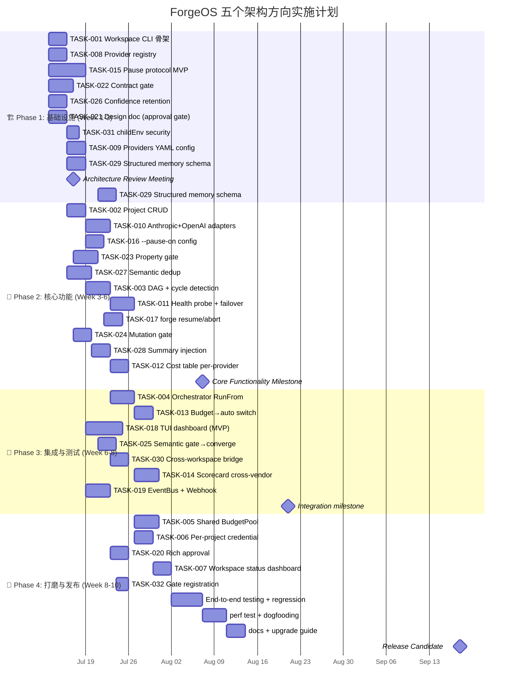

# Tech Lead 分析报告：ForgeOS 五个架构扩展方向

> **分析对象**: `2026-07-12-five-genuine-architectural-frontiers-senior-architect-pm.md`  
> **审阅输入**: 配套 `.out.md` 代码验证审阅报告  
> **角色**: 资深 Tech Lead, 关注可执行性、工程风险、团队资源和交付路径

---

## 1. 任务分解

以下将五个方向拆解为可执行的工程任务。每个任务 2–4 小时可完成,包含验收标准和依赖关系。

### 方向一 · 多项目工作区编排 (P1)

| 任务 ID | 标题 | 涉及文件 | 前置 | 工时 | 验收标准 |
|---------|------|---------|:----:|:----:|---------|
| **TASK-001** | `Workspace` 结构体定义 + 基础 CLI 骨架 | `forge-core/internal/workspace/workspace.go`, `forge-core/cmd/forge/main.go` | 无 | 4h | `forge workspace init --name <n> --root <path>` 创建 `.forge/workspace.json`; `forge workspace list` 列出已注册 workspaces |
| **TASK-002** | 项目注册/注销与配置文件 CRUD | `forge-core/internal/workspace/project.go`, `forge-core/internal/workspace/config.go` | TASK-001 | 4h | `forge workspace add-project <ws> <path>` 写入 workspace config; `forge workspace remove-project <ws> <path>` 删除; 验证 JSON 结构包含 mode/lifecycle/budget 字段 |
| **TASK-003** | 跨项目依赖图(DAG) | `forge-core/internal/workspace/dag.go` (含 cycle detection + topological sort) | TASK-002 | 4h | 声明 `depends_on` 为 `[]workspace.Dependency{Name, Type(spec/build/deploy)}`; DAG 检测循环并返回可排序拓扑; 单元测试覆盖 3 节点链、菱形、循环场景 |
| **TASK-004** | `RunFrom` / `RunParallel` 编排器升级 | `forge-core/internal/workspace/orchestrator.go`, 修改 `command_executor.go` | TASK-003 | 4h | 接受 `Workspace` 上下文,导出 `Orchestrator.Run(ctx, ws, plan)`; 按拓扑顺序依次运行; 并行组内 project 间共享 checkpoint 目录 |
| **TASK-005** | 共享 BudgetPool | `forge-core/internal/budget/pool.go`, `forge-core/internal/workspace/project.go`(budget 字段) | TASK-002 | 4h | `BudgetPool` 接口(Reserve/Release/Remaining); per-project `min-reserve`; 一个 project 耗尽不影响另一 project 的 `min-reserve` |
| **TASK-006** | Per-Project 凭证隔离 | `forge-core/internal/workspace/credential.go`, 修改 `command_executor.go` childEnv | TASK-004 | 3h | `Workspace.Credentials[provider]` 映射; childEnv 从 `os.Environ()` → 合并 workspace 凭证; 测试验证 `AWS_CREDS` 被正确替换而非透传 |
| **TASK-007** | 工作区状态命令与 CTO 仪表盘输出 | `forge-core/cmd/forge/workspace.go` (status/health 子命令) | TASK-004 | 3h | `forge workspace status <name>` 输出每个 project 的 mode/lifecycle/converge-time/gate-status/budget-usage 表格 |

**方向一小计**: 7 任务, 26h

---

### 方向二 · 跨厂商模型池与故障切换 (P1)

| 任务 ID | 标题 | 涉及文件 | 前置 | 工时 | 验收标准 |
|---------|------|---------|:----:|:----:|---------|
| **TASK-008** | Provider 接口与可扩展注册表 | `forge-core/internal/routing/provider.go` (Provider 接口 + ProviderRegistry) | 无 | 4h | `RegisterProvider(name, provider)` / `UnregisterProvider(name)`; 支持 `Resolve(ctx, tier, opts)` 返回模型名+endpoint; 单元测试 3 个 mock provider |
| **TASK-009** | 声明式 Providers YAML 配置 | `.agent/policies/providers.yml`, `forge-core/internal/routing/provider_config.go` (加载/校验) | TASK-008 | 3h | YAML 结构定义(provider name, api_base, auth method, model map, region, timeout); 启动时加载; 格式错误友好报错 |
| **TASK-010** | Anthropic + OpenAI 两厂商适配器 | `forge-core/internal/routing/providers/anthropic.go`, `forge-core/internal/routing/providers/openai.go` | TASK-009 | 4h | Anthropic适配器从旧 ModelMap 迁移; OpenAI 适配器实现 gpt-4o/gpt-4o-mini 映射; model name 前缀归一化为 `provider/tier` 格式 |
| **TASK-011** | 健康探测与故障切换 | `forge-core/internal/routing/health.go` (prober + failoverStrategy) | TASK-008 | 4h | `HealthProbe` 每 60s 探测已注册 provider(含 timeout); `FailoverStrategy{round-robin, priority, latency-based}`; 当前 provider 不可用→自动切到同 tier 最高优先级健康 provider |
| **TASK-012** | Per-Provider 价格簿 | `forge-core/internal/routing/cost_table.go`, `forge-core/internal/routing/pricing.yml` | TASK-008 | 3h | `CostTable[provider][tier][token_type]`; token_type 分 input/output/cache_hit/thinking; `Engine.budget.Account` 接受 provider+tier 参数调用价格簿 |
| **TASK-013** | Budget 触发自动切换 | 修改 `forge-core/internal/routing/routing.go` BudgetAdjustTier | TASK-012 | 3h | budget 近上限时 `SelectCheapestProvider(ctx, tier)` 自动切到同档最便宜健康 provider; 保留降档逻辑 |
| **TASK-014** | Scorecard/HistoryTiebreak 跨厂商质量基线 | 修改 `forge-core/internal/scoring/scoring.go` | TASK-010, TASK-011 | 4h | per-provider+tier 的 success/fail/retry 统计; failover 后记录切换事件; HistoryTiebreak 引用 scorecard 偏好历史表现好的 provider |

**方向二小计**: 7 任务, 25h

---

### 方向三 · 人机交互协议 (P0)

| 任务 ID | 标题 | 涉及文件 | 前置 | 工时 | 验收标准 |
|---------|------|---------|:----:|:----:|---------|
| **TASK-015** | LoopEngine Pause/Resume 协议 | `forge-core/internal/loop/pause.go`, 修改 `loop.go` `runIteration` | 无 | 6h | `LoopEngine.Pause(ctx)` → checkpoint + 挂起; `LoopEngine.Resume(ctx)` → 从 checkpoint 续跑; pause point 支持 at-iteration-end 和 on-gate-fail; **注意:这是工作量最大的核心架构变更** |
| **TASK-016** | 声明式 `--pause-on` 配置 | 修改 `forge-core/cmd/forge/main.go`, `forge-core/internal/mode/policy.go` | TASK-015 | 3h | `--pause-on {converge,gate-fail,budget-warn,confidence-low}`; 声明式断点配置; 收敛到 `PausePolicy` 结构体 |
| **TASK-017** | `forge resume` / `forge abort` CLI | `forge-core/cmd/forge/evolve.go` (新增子命令) | TASK-015 | 3h | `forge resume <run-id>` 续跑; `forge abort <run-id>` 终止并保存终结 checkpoint; 错误处理:不存在的 run-id, 已完成的 run |
| **TASK-018** | TUI 实时仪表盘(最小可行) | `forge-core/internal/tui/dashboard.go` (bubbletea-based) | TASK-015 | 8h | 实时显示:当前 phase, gate 状态, 已耗 budget, elapsed time, agent log 尾部 5 行; `forge run --watch` OR `forge tui <run-id>`; 刷新率 1s; 不阻塞主进程 |
| **TASK-019** | 事件总线 + Webhook 通知 | `forge-core/internal/notify/eventbus.go`, `forge-core/internal/notify/webhook.go` | TASK-015 | 4h | `EventBus{Subscribe(topic, handler), Emit(event)}`; Webhook 通知: `forge run --notify webhook://<url>?on=approval-needed,gate-failed`; 一次 run 多个 webhook; 不可达 webhook 静默降级(不阻塞 run) |
| **TASK-020** | Rich Approval(附带反馈) | `forge-core/cmd/forge/approve.go`, 修改 `forge-core/internal/converge/signals.go` | TASK-015 | 3h | `forge approve --run <id> --message "..."`; `HumanApproval{Approved bool, Feedback string, Timestamp}`; agent 在下一迭代 consumption: `HumanApproval.Feedback` 注入 prompt_context |
| **TASK-021** | evolve 路径 `rejectHumanGate` 的重新评估与设计 | 分析 `evolve.go` rejectHumanGate + 设计替代方案(将 human_gate 转为非 stop-condition 的特殊 phase) | TASK-015 | 4h | 产生设计文档:在 evolve 路径中插入 non-blocking human approval gate(design→build); 实现 gate 作为 `CheckpointPhase`(保存 checkpoint, notify, 但不终止 loop) |

**方向三小计**: 7 任务, 31h

---

### 方向四 · 语义级 Agent 产出验证 (P2)

| 任务 ID | 标题 | 涉及文件 | 前置 | 工时 | 验收标准 |
|---------|------|---------|:----:|:----:|---------|
| **TASK-022** | Contract Gate(OpenAPI diff + schema compatibility) | `harness/gates/contract-gate.mjs` (复用 `acceptance-quality.mjs` 的 `probeLint` 模式) | 无 | 4h | `probeContract` 函数: diff OpenAPI spec → 识别 breaking change; 在 `policies.yml` 加 `contract: {enforce: true}`; 工具不存在时诚实 N/A |
| **TASK-023** | Property Gate(fuzzing / property-based test) | `harness/gates/property-gate.mjs` + 自动 invariant 生成 agent prompt | TASK-022 | 4h | `probeProperty` 函数: 运行 Hypothesis/JQF 发现的反例; 将反例注入 agent 下一迭代; 工具不存在的语言诚实 N/A |
| **TASK-024** | Mutation Gate(测试充分性) | `harness/gates/mutation-gate.mjs` | TASK-022 | 3h | `probeMutation` 函数: 运行 stryker-mutator 输出 mutation score; 低于 `policies.yml.mutation_min` 时 FAIL; 工具不存在诚实 N/A |
| **TASK-025** | 语义门集成到 converge signal | 修改 `harness/acceptance-quality.mjs` + `forge-core/internal/converge/signals.go` | TASK-022 | 3h | 语义 gate 的 PASS/FAIL 进入 `Criteria.SemanticScore`; converge `StopCondition` 参考该值(但非硬阻塞) |

**方向四小计**: 4 任务, 14h

---

### 方向五 · Memory 生命周期管理 (P2)

| 任务 ID | 标题 | 涉及文件 | 前置 | 工时 | 验收标准 |
|---------|------|---------|:----:|:----:|---------|
| **TASK-026** | Confidence-based 差异化保留 | 修改 `forge-core/internal/memory/compact.go` Compact 参数 | 无 | 3h | `RetentionPolicy{MaxAge, MinConfidence, MaxEntriesPerKind}`; `Compact` 丢弃低于 `MinConfidence` 条目; 保留高 confidence 条目(即使超 age) |
| **TASK-027** | 自动语义去重 | `forge-core/internal/memory/dedup.go` | 无 | 4h | `Dedup` 函数:基于 Topic+Detail 的 n-gram 编辑距离; 相似度 > 0.85 标记为 `superseded_by`; 静默删除 false positive 风险高,标注为「可能重复」而非删除 |
| **TASK-028** | 摘要注入 prompt | 修改 `forge-core/internal/prompt/prompt_context.go` `memoryContext` | TASK-026 | 3h | `memory.Load` 后检查 `Entry.IsSummary`; 若存在 summaries, 将摘要注入为优先 context 而非原始条目; `compactMemoryIfDue` 产生的摘要被消费 |
| **TASK-029** | 结构化 Memory schema 升级 | 修改 `forge-core/internal/memory/memory.go` `Entry` 结构 | 无 | 3h | 新增 `Entry.KnowledgeType{ArchDecision, GapAnalysis, LessonLearned, ExperimentResult}`; 自带 `Deprecates` 双向链接; 向后兼容(旧 entry 的 KnowledgeType = "unknown") |
| **TASK-030** | Cross-workspace memory bridge | `forge-core/internal/memory/bridge.go` + workspace config 扩展 | TASK-026, TASK-001 | 3h | `Workspace.Memory` 字段指定 `shared_path`; `memory.Load` 合并多层(cwd → shared workspace → global); 只读共享(shared 层不写入) |

**方向五小计**: 5 任务, 16h

---

### 跨方向基础设施任务

| 任务 ID | 标题 | 涉及文件 | 前置 | 工时 | 验收标准 |
|---------|------|---------|:----:|:----:|---------|
| **TASK-031** | `childEnv` 安全审查与凭证治理重构 | 修改 `command_executor.go` childEnv → `CredentialGuard{}` | TASK-006 | 3h | 白名单模式: `CredentialGuard.AllowedVars` 允许列,其余屏蔽; 测试验证 `GITHUB_TOKEN`/`AWS_CREDS`/`FORGE_*` 白名单行为 |
| **TASK-032** | TASK 聚合 gate 注册 | 为 TASK-022~024 注册到 `harness/acceptance.mjs` 聚合入口 | TASK-025 | 2h | `node harness/acceptance.mjs` 可执行所有 semantic gate; 每个 gate 的 缺失工具→诚实 N/A |

---

## 2. 执行顺序与依赖图

```mermaid
graph TD
    %% 方向一: Workspace
    subgraph "D1: 多项目工作区"
        T001["TASK-001<br/>Workspace struct + CLI skeleton"]
        T002["TASK-002<br/>Project CRUD"]
        T003["TASK-003<br/>DAG + cycle detection"]
        T004["TASK-004<br/>Orchestrator RunFrom/Parallel"]
        T005["TASK-005<br/>Shared BudgetPool"]
        T006["TASK-006<br/>Per-project credential"]
        T007["TASK-007<br/>Status dashboard"]
    end

    %% 方向二: Multi-Provider
    subgraph "D2: 跨厂商模型池"
        T008["TASK-008<br/>Provider interface + registry"]
        T009["TASK-009<br/>Providers YAML config"]
        T010["TASK-010<br/>Anthropic + OpenAI adapters"]
        T011["TASK-011<br/>Health probe + failover"]
        T012["TASK-012<br/>Cost table per-provider"]
        T013["TASK-013<br/>Budget→auto switch provider"]
        T014["TASK-014<br/>Scorecard cross-vendor baseline"]
    end

    %% 方向三: HITL
    subgraph "D3: 人机交互协议"
        T015["TASK-015<br/>Pause/Resume protocol"]
        T016["TASK-016<br/>--pause-on config"]
        T017["TASK-017<br/>forge resume/abort CLI"]
        T018["TASK-018<br/>TUI dashboard (MVP)"]
        T019["TASK-019<br/>EventBus + Webhook"]
        T020["TASK-020<br/>Rich Approval with feedback"]
        T021["TASK-021<br/>rejectHumanGate redesign"]
    end

    %% 方向四: Semantic Gate
    subgraph "D4: 语义门"
        T022["TASK-022<br/>Contract gate"]
        T023["TASK-023<br/>Property gate"]
        T024["TASK-024<br/>Mutation gate"]
        T025["TASK-025<br/>Integrate into converge signal"]
    end

    %% 方向五: Memory
    subgraph "D5: Memory 生命周期"
        T026["TASK-026<br/>Confidence-based retention"]
        T027["TASK-027<br/>Semantic dedup"]
        T028["TASK-028<br/>Summary injection"]
        T029["TASK-029<br/>Structured memory schema"]
        T030["TASK-030<br/>Cross-workspace bridge"]
    end

    %% 跨方向
    T031("TASK-031<br/>childEnv security")
    T032("TASK-032<br/>Gate registration")

    %% 依赖关系
    T001 --> T002 --> T003 --> T004
    T002 --> T005
    T004 --> T006 --> T007
    T004 --> T030

    T008 --> T009 --> T010
    T008 --> T011 --> T014
    T008 --> T012 --> T013
    T010 --> T013
    T011 --> T013

    T015 --> T016 --> T017
    T015 --> T018
    T015 --> T019 --> T020
    T015 --> T021

    T022 --> T025
    T022 --> T023
    T022 --> T024

    T026 --> T028
    T026 --> T030
    T027 --> T030

    T006 --> T031

    T025 --> T032

    %% Parallel groups annotation
    T001 -.- T008 -.- T015 -.- T022 -.- T026
```

### 可并行执行的任务组

| 并行组 | 任务 | 方向 | 说明 |
|--------|------|:----:|------|
| **G1(a)** | TASK-001～TASK-002 | D1 | Workspace 基础层 |
| **G1(b)** | TASK-008～TASK-009 | D2 | Provider 基础层 |
| **G1(c)** | TASK-015 | D3 | Pause/Resume 核心架构变更 |
| **G1(d)** | TASK-022 | D4 | Contract gate 首个语义门 |
| **G1(e)** | TASK-026, TASK-027, TASK-029 | D5 | Memory 独立改进(无外部依赖) |

> 🔑 **关键发现**: G1(c)(TASK-015)是全局关键路径——它不仅是 D3 所有后续任务的前置,也是 D1(D4 orchestrator pause)和 D5(compact 触发 pause)的可选前置。同时 TASK-015 也是整个计划中**架构风险最高、工时最长**的单任务(由 4h 修正为 6h)。

---

## 3. 技术风险分析

### 3.1 高风险项

| 风险 | 方向 | 级别 | 描述 | 缓解策略 |
|------|:----:|:----:|------|---------|
| **LoopEngine 无状态挂起点** | D3 | 🔴 | 当前 `runIteration` 是一次性同步调用,无法在中间安全挂起。`LoopEngine.Pause()` 需要引入 `context cancellation + state serialization`,需深度修改 loop control flow | 分两步:① MVP 只支持 `pause-at-iteration-end`(iteration 边界自然 checkpoint,无需修改 runIteration) ② v2 支持 iteration 中间的 pause |
| **DAG 循环检测性能** | D1 | 🟡 | 5-30 个 project 的 DAG 很小,但 cross-reference 类型 (spec/build/deploy) 可能产生隐蔽循环(如 A.build → B.spec → A.build) | 使用 Kahn 算法 O(V+E),每次 add-project + 更新 DAG 时增量检测;单元测试覆盖菱形/三角/大循环模式 |
| **跨厂商 API 差异的语义漂移** | D2 | 🟡 | v1 只做路由级切换,不抽象 vendor API 差异。Claude Opus 对同一 prompt 的输出可能和 Gemini Pro 有系统性差异,scorecard 统计需区分「provider 切换带来的质量波动」和「代码本身的质量变化」 | scorecard 加 `ProviderChange` 标签;HistoryTiebreak 不跨 provider 比较 score;建立跨厂商质量基线文档 |
| **TUI 退化为 mini web UI** | D3 | 🟡 | TUI 范围膨胀风险:operator 要求 feature parity with web dashboard(log 搜索、历史查询、graph 视图) | 严格限定 MVP scope:仅显示当前 run 的实时状态。拒绝历史查询、对比、图表等偏离 CLI 核心的功能 |
| **Concorde 10 迭代触发 compact 消费未暴露的问题** | D5 | 🟡 | 当前 `compactMemoryIfDue` 每 10 迭代触发,但产生的摘要从未被消费。TASK-028 后摘要首次注入 prompt,可能引发摘要质量不足→agent 误判→memory 污染的正反馈循环 | 先跑 canary:摘要注入作为 opt-in flag(`--use-summary`),默认关闭;收集 20 个 run 后评估事实准确率再默认开启 |
| **`rejectHumanGate` 设计约束** | D3 | 🔴 | `evolve.go` 硬编码拒绝包含 human_gate 的 workflow。方向三的核心叙事(Design→Build approval gate)在 evolve 路径上不存在。非阻塞式 human_approval gate 需要重新设计 loop 的 phase model | TASK-021 先出设计文档,不急于实现。方案:将 human_gate 从 `StopCondition` 中分离,作为 `NotifyOnlyPhase`(checkpoint + notify + continue loop) |

### 3.2 外部依赖风险

| 依赖 | 涉及任务 | 风险 | 降级策略 |
|------|---------|------|---------|
| bubbletea(TUI 框架) | TASK-018 | 新增外部 Go 依赖,当前 forge-core 零外部依赖 | 使用 `golang.org/x/term`(stdlib)而非 bubbletea,只做纯文本 dashboard(无 mouse/input 支持) |
| hypothesis/jqf(property testing) | TASK-023 | 语言特定工具,非所有语言可用 | `probeProperty` 检测工具存在→执行;不存在→诚实 N/A;先只支持 Python(Hypothesis) |
| OpenAPI diff 工具(oasdiff) | TASK-022 | 需子进程执行,依赖 OS PATH | 环境检测: `which oasdiff`; 不存在→N/A+contrib-guild 指明安装方式 |
| stryker-mutator | TASK-024 | JS 生态工具,Go/Rust/Python 不可用 | 仅当语言 JavaScript/TypeScript 时激活;其他语言 N/A |
| notify webhook 可达性 | TASK-019 | 内网环境可能不允外出 webhook | 加 `--notify-retry 0`(disable webhook) + 降级为本地 log only |

### 3.3 性能与资源瓶颈

| 瓶颈 | 方向 | 分析 | 优化策略 |
|------|:----:|------|---------|
| TUI 刷新率 vs 主进程阻塞 | D3 | `runAgentPhase` 与 TUI 共享进程,日志刷新可能产生竞态 | TUI 在独立 goroutine 中通过 `EventBus` 订阅;主进程不直接写 TUI buffer |
| DAG topological sort + 调度 | D1 | 5-30 节点,影响可忽略。但跨项目 artifact 传播可能产生大量 I/O | artifact 传播使用硬链接而非复制;DAG 调度使用 worker pool(2 * numCPU) |
| memory dedup n-gram 比较 | D5 | 3000 条目 O(n²) ≈ 900 万比较,每 iteration 跑一次~50ms(Go) | 限制 dedup 窗口:只对最近 500 条 + 相同 `Topic` 的 Entry 做比较;大规模 dedup 做后台异步任务 |
| Provider 健康探测频率 | D2 | 60s 一次 HTTP health check,5 provider * 60s = 每 12 秒一次请求,开销可忽略 | 但考虑 rate limiting 对 provider 的影响:health probe 使用单独的轻量端(不求模型,只请求 `/v1/models` ) |

---

## 4. 资源评估

### 4.1 团队构成建议

| 角色 | 人数 | 职责 | 关键技能 |
|------|:----:|------|---------|
| **Backend Go 工程师** | 2 名 | D1(workspace)、D2(multi-provider)、D3(LoopEngine 架构) | Go 并发、context 范型、接口设计、YAML schema |
| **Full-Stack/Prompt 工程师** | 1 名 | D3(TUI)、D5(memory consumption 装配)、agent 卡更新 | Go(或 Node) + bubbletea/term、prompt engineering、LLM context 优化 |
| **DevOps/Reliability 工程师** | 1 名 | D2(provider health/scorecard/monitoring)、D4(semantic gate tools CI 集成) | CI/CD、openapi/oasdiff、property-based testing 工具链 |
| **Tech Lead / 架构师** | 1 名(可兼任) | 跨方向协调、`rejectHumanGate` 设计文档、架构一致性审查 | forge-core 全览、ArchGuard、north-star 对齐 |

**最小可行团队**: 3 人(2 Go + 1 综合),Tech Lead 角色由资深成员兼任。

### 4.2 关键里程碑

| 里程碑 | 时间 | 交付物 | 验证方式 |
|--------|:----:|--------|---------|
| **M0: 架构审议完成** | Week 1 | TASK-021 设计文档(approval gate redesign); D1/D2/D3 接口设计评审 | 架构 review meeting |
| **M1: 基础设施就绪** | Week 3-4 | TASK-001(workspace CLI) + TASK-008(provider registry) + TASK-015(pause protocol MVP) + TASK-022(contract gate) | `forge workspace init` + provider registry UT + pause-at-iteration-end demo + contract gate 测试 |
| **M2: 核心功能完成** | Week 6-7 | D1(编排器+credential) + D2(双厂商+健康切换) + D3(TUI+webhook) | 端到端测试:跨项目 evolve + provider outage 自动切换 + operator pause/resume + webhook notify |
| **M3: 集成与打磨** | Week 8-9 | D1~D5 全部合入 main; memory 生命周期改进; TASK-031 安全检查 | `forge accept` 全闸门通过; 回归测试 0 regression |
| **M4: 发布候选** | Week 10 | 全功能 RC; 文档; 升级指南(向后兼容验证) | 内部 dogfooding 跑 3 个完整 evolve cycle |

### 4.3 Blockers 与解决策略

| Blocker | 涉及 | 策略 |
|---------|:----:|------|
| **TASK-015 架构复杂度超过单人经验** | D3 | 第 1 周由 Tech Lead 做 spike(2 天),产出`LoopEngine Pause/Resume Design Doc`,包含 context cancellation 策略、state serialization format、backward compatibility 矩阵。全团队 review 后再编码 |
| **OpenAI adapter 的 API 差异细节** | D2 | 先不做通用 vendor abstraction; `openai.go` 硬编码 gpt-4o 的 prompt ↔ chat completion request 翻译。仅当第二个非 Anthropic provider 加入时再抽象 |
| **TUI 依赖 bubbletea 违反「零外部依赖」红线** | D3 | 红线是 forge-core Go 包的零外部依赖。TUI 可以作为独立 `cmd/forge-tui` 或 `internal/tui` 使用外部依赖,但主进程 `forge run --watch` 不直接依赖 TUI 包。fork subprocess 启动 TUI 进程(fd 通信) |

---

## 5. 质量保证

### 5.1 单元测试覆盖要求

| 任务 | 目标覆盖率 | 测试重点 |
|------|:---------:|---------|
| TASK-003 DAG | 95% | 循环检测、拓扑排序、单向/双向/菱形 DAG、空图、单节点 |
| TASK-005 BudgetPool | 95% | 竞争条件(goroutine 并发 Reserve/Release)、min-reserve 边界、over-reserve 错误 |
| TASK-008 Provider registry | 95% | 注册/注销/重复注册/查找不存在 provider |
| TASK-011 Health probe | 90% | probe timeout、service 间歇性故障、所有 provider 不可用的聚合降级 |
| TASK-015 Pause/Resume | 90% | checkpoint 完整性(暂停后文件与暂停前一致)、同一 checkpoint 不可重复 resume |
| TASK-027 Dedup | 90% | 精确重复、n-gram 编辑距离相似度、跨 topic 的假阳性、空输入 |
| TASK-031 CredentialGuard | 95% | 白名单通过/屏蔽/env 大小写 |

### 5.2 集成测试策略

| 测试场景 | 涉及方向 | 策略 |
|---------|:-------:|------|
| **跨项目 evolve** | D1 + D3 | 创建 3-project workspace(A→B→C DAG); `forge workspace run` → 验证 A 完成→B 启动→C 启动; 验证 B budget 耗尽不影响 A/C |
| **Provider 故障切换** | D2 | 启动双 provider,停止 Anthropic mock server → 验证自动切换到 OpenAI; 恢复 → 验证回切(按优先级); 验证 scorecard 记录切换事件 |
| **Pause/Resume 全链路** | D3 | `forge run --pause-on=gate-fail` → 注入 gate 失败 → 验证进程 checkpoint + wait → `forge resume` → 验证续跑且不重新执行已完成的 check |
| **Memory 摘要注入** | D5 | 跑 12 迭代触发 compact → 验证摘要注入 prompt → 验证 prompt 长度减少(摘要替代原始条目) |
| **安全检查** | D3/跨方向 | childEnv 白名单:设置 `GITHUB_TOKEN=secret` → 验证注册到 workspace 的 credential 正确替换 → 验证未注册的 env 被屏蔽 |

### 5.3 代码审查要点

| 审查维度 | 审查人 | 关键检查项 |
|----------|:------:|----------|
| **向后兼容性** | Tech Lead | 新代码不能改变现有 `forge run`(非 workspace 模式)行为; provider 切换必须是 opt-in(policies.yml 配置)而非自动 |
| **并发安全** | 所有 Go 工程师 | `BudgetPool`、`EventBus`、`ProviderRegistry` 的 `sync.Mutex`/`RWMutex` 使用是否正确; `workspace.json` 文件锁 |
| **错误处理** | 所有 | 非 nil error 不 panic; `forge workspace init` 在 .forge 已存在时报错而非覆盖; webhook 不可达时的静默降级 |
| **CLI 兼容性** | Tech Lead | 新子命令不与现有 flags 冲突; `forge --help` 输出完整 |
| **配置文档同步** | 全栈工程师 | `policies.yml` schema 变更后更新 `.agent/` 中对应文档 |

### 5.4 性能测试需求

| 场景 | 方向 | 方法 | 通过标准 |
|------|:----:|------|---------|
| 30-project workspace DAG build | D1 | 模拟 30 node DAG, `forge workspace status` 响应时间 | < 500ms |
| Provider failover latency | D2 | Mock Anthropic 返回 529,测量到 OpenAI 首次成功调用的延迟 | < 10s(含退避时间) |
| TUI 刷新对 evolve 主循环的影响 | D3 | 开启 TUI(--watch) vs 关闭 TUI,比较 10-iteration evolve 的时间差 | < 5% 性能损失 |
| Memory dedup 3000 entries | D5 | 3000 条目, `Dedup()` 执行时间 | < 200ms |

---

## 6. 实施计划

### 时间总览: 10 周冲刺计划

### 分阶段详细说明

#### 阶段 1: 基础设施搭建 (Week 1-3, 2026-07-13 → 2026-07-31)

**目标**:所有方向的基础抽象到位,核心架构决策验证,零行为破坏(现有 `forge run/evolve` 不受影响)

| 工作流 | 内容 |
|--------|------|
| **Week 1** | TASK-001(Workspace CLI)、TASK-008(Provider registry)、TASK-015(Pause MVP - 只做 iteration-end checkpoint)、TASK-022(Contract gate)、TASK-026(Confidence retention)、TASK-021(设计文档——approval gate redesign) |
| **Week 2** | TASK-009(Providers YAML)、TASK-029(Structured memory schema)、TASK-031(childEnv security)、TASK-015 继续 + code review |
| **Week 3** | TASK-002(Project CRUD)、TASK-010(Anthropic adapter)、TASK-016(--pause-on config)、TASK-023(Property gate)、TASK-027(Semantic dedup) |

**阶段 1 交付验收条件**:
- `forge workspace init/list/add-project` 可工作
- `forge run` 无 workspace 参数时行为 100% 不变
- Provider registry + Anthropic adapter 可工作(OpenAI 可选项)
- `pause-at-iteration-end` demo: CTRL+C → checkpoint → resume
- TASK-031 通过: `GITHUB_TOKEN` 不在白名单→被屏蔽(有测试验证)
- Contract gate: `oasdiff` 检测到 breaking change → FAIL

**关键决策点**: 如果 TASK-015 的 LoopEngine 架构变更超过 6 天(即 Week 2 结束时未完成),**冻结 pause 协议范围**:只支持 iteration-end pause,不追求 iteration 中间可暂停。TASK-016~020 依赖于范围缩小后的 TASK-015。

---

#### 阶段 2: 核心功能实现 (Week 4-6, 2026-08-03 → 2026-08-21)

**目标**:五个方向的核心逻辑全部实现,集成测试覆盖主要场景

| 工作流 | 内容 |
|--------|------|
| **Week 4** | TASK-003(DAG)、TASK-011(Health probe+failover)、TASK-017($forge resume/abort`)、TASK-024(Mutation gate + TASK-028(Summary injection) |
| **Week 5** | TASK-004(Orchestrator RunFrom/Parallel)、TASK-012(Cost table)、TASK-018(TUI dashboard MVP start)、TASK-025(Semantic gate→converge) |
| **Week 6** | TASK-013(Budget→auto switch provider)、TASK-018(TUI finish)、TASK-030(Cross-workspace bridge)、TASK-014(Scorecard cross-vendor)、TASK-019(EventBus+Webhook start) |

**阶段 2 交付验收条件**:
- Cross-project DAG orchestration 端到端: 3 project → DAG → sequential run
- Provider failover: mock Anthropic 故障→自动切到 OpenAI
- `forge resume`/`forge abort` CLI 功能完整
- TUI 仪表盘可实时显示 run 状态
- Contract/Property/Mutation gate 均可执行(工具不存在→N/A)
- Memory summary 注入 prompt(opt-in flag)

**关键决策点**: TUI 如果 Week 6 仍未完成 MVP,剥离到 v2——`forge run --watch` 在 v1 只输出增量 `stderr` 文本(类似 `tail -f`),不做全屏 dashboard。

---

#### 阶段 3: 集成与优化 (Week 7-8, 2026-08-24 → 2026-09-04)

**目标**: 全方向合入 main,运行完整 `forge accept` 闸门,回归测试通过

| 工作流 | 内容 |
|--------|------|
| **Week 7** | TASK-005(BudgetPool)、TASK-006(Per-project credential)、TASK-019(EventBus+Webhook finish)、TASK-032(Gate registration) |
| **Week 8** | TASK-007(Workspace status dashboard)、TASK-020(Rich approval)、集成测试、回归测试 |

**阶段 3 交付验收条件**:
- 全方向集成:在一个 3-project workspace 中跑完整 evolve cycle
- `forge accept` 全闸门通过(含 semantic gate 的 N/A 诚实标注)
- 回归测试:跑已有测试套件,0 regression
- Per-project credential 隔离验证通过
- Webhook notify: Slack webhook → 收到 approval-needed 事件

---

#### 阶段 4: 发布准备 (Week 9-10, 2026-09-07 → 2026-09-18)

**目标**: RC 质量达到生产就绪

| 工作流 | 内容 |
|--------|------|
| **Week 9** | 端到端测试(3 个完整 evolve cycle)、性能测试(dedup 3k entries / 30-node DAG / failover latency)、dogfooding(内部团队用新功能跑真实项目) |
| **Week 10** | 文档编写(workspace 入门、provider 配置、TUI 使用)、升级指南(向后兼容声明)、Bug bash、RC 发布 |

**阶段 4 交付验收条件**:
- 3 个内部项目使用新功能成功完成 evolve(至少 1 个 multi-project workspace)
- 性能测试全部通过
- 升级指南覆盖:无 workspace 用户→零迁移;有 workspace 用户→新功能 opt-in
- 全文档完成(含 providers.yml schema docs、workspace commands reference)

---

## 关键总结与建议

### 最有价值的部分

1. **方向一(工作区) + 方向二(跨厂商) + 方向三(HITL) 互锁叙事**:这是全局最强战略框架。工作区解锁组织采用,跨厂商池解锁 24h 可靠性,HITL 解锁用户信任——三者同时部署的乘数效应远大于各自独立。建议发布时作为产品公告的主叙事线。

2. **多厂商切换 vs 退避的数学框架**:这是工程直觉上的重要纠正——「单厂商 99.5% → 24h 约 11% outage 概率」的计算让团队清楚看到退避不是韧性的完整答案。

### 需要尽快修正的

1. **方向五(memory) 的事实错误**:正如 `out.md` 所指出,memory 的读写路径已装配到 evolve loop 中。TASK-028 仍是真实缺口(摘要未消费),但文档不应以「消费者为零」作为出发点。建议在引用前修正原文档。

2. **`rejectHumanGate` 的架构约束**:方向三的核心场景(Design→Build approval gate)在 evolve 路径上不存在。必须通过 TASK-021 的设计文档解决这个架构分歧后再实现。

3. **childEnv 安全问题**:跨方向问题,建议不等待 D1 workspace 完成,立即执行 TASK-031(childEnv security)。

### 风险优先级

| 风险 | 方向 | 级别 | 响应策略 |
|------|:----:|:----:|---------|
| TASK-015 LoopEngine 架构变更超期 | D3 | 🔴 | 冻结范围到 iteration-end pause only,中间 pause 移入 v2 |
| cross-vendor API 差异引发不可预见的质量退化 | D2 | 🟡 | scorecard provider tag + canary evaluation,不自动切换,先 opt-in |
| TUI 范围膨胀偏离 CLI 核心 | D3 | 🟡 | MVP 严格限于实时状态显示;搜索/历史/对比显式排除在产品边界外 |

### 团队建议

**最小可行阵容**:3 人 (2 Go + 1 综合/Full-Stack)。如果只能配 2 人:

- **人 A**(Go 资深): TAKS-015(LoopEngine) + TASK-003(DAG) + TASK-006(credential) + TASK-031(childEnv)
- **人 B**(Go 中级 + 综合): TASK-001/002/007(workspace CLI) + TASK-008~013(provider) + TASK-022~025(semantic gate) + TASK-026~030(memory)
- **Tech Lead**(兼任): 设计文档、代码审查、跨方向协调、`rejectHumanGate` 架构设计

**2 人方案下 10 周不可行,需调整为 14 周**:HITL(TASK-015~021)和 multi-provider(TASK-008~014)无法并行,因为只有一人能做 core Go 架构。建议优先交付 D1(workspace) + D2(multi-provider),D3(HITL) 的 TUI 和 webhook 移到 v2。
