有了完整的代码库上下文，以下是深度技术负责人分析。

---

# 技术负责人分析：ForgeOS 下一阶段 —— 从基础设施验证到平台打包

## 1. 任务分解

从分析文档中的五个方向 + 五个边缘情况，我在此将任务分解为可独立完成的小型工作单元（每个 2–4 小时），并严格遵循代码库的约束：Go 不使用外部依赖，Node/Python 也不使用（零外部依赖），函数 ≤ 50 行，文件 ≤ 500 行，单一职责。

### 方向一：事件网关（P1 — P2）

| 任务 ID | 标题 | 涉及文件 | 前置依赖 | 工时（小时） |
|---|---|---|---|---|
| TASK-001 | `StopCondition` 添加 `Triggers` 字段 | `forge-core/internal/asset/asset.go` | 无 | 1 |
| TASK-002 | 定义 `Trigger` 枚举类型 + YAML 解码 | `forge-core/internal/asset/asset.go` | TASK-001 | 1 |
| TASK-003 | `forge-core/internal/gateway/` 包骨架：`gateway.go` 接口 + `webhook.go` 最少 HTTP 端点 | `forge-core/internal/gateway/gateway.go`, `forge-core/internal/gateway/webhook.go` | 无 | 2 |
| TASK-004 | webhook 去重：LRU 集合，按事件 ID 去重 | `forge-core/internal/gateway/dedup.go` | TASK-003 | 1 |
| TASK-005 | `internal/persist/flock.go`：基于 `flock` 的检查点文件锁定 | `forge-core/internal/persist/flock.go` | 无 | 2 |
| TASK-006 | 信号处理：`main.go` 中添加 `SIGINT`/`SIGTERM` 处理程序，用于优雅关闭 | `forge-core/cmd/forge/main.go` | 无 | 1 |

**说明**：TASK-003 和 TASK-004 构成最小可行的 webhook 端点。TASK-005 和 TASK-006 是跨领域的先决条件，但逻辑上属于方向一。`Triggers` 字段完全绕过 `loop.go` 的现有路径（该路径通过外部停止的收敛检查进行分支），因此风险很低。

### 方向二：知识引擎（P3 — P4）

| 任务 ID | 标题 | 涉及文件 | 前置依赖 | 工时（小时） |
|---|---|---|---|---|
| TASK-007 | `internal/memory/harvest.go`：最小化知识采集——当 scorecard 质量门 FAIL 时，将 `kind=lesson` 条目追加到 `memory.jsonl` | `forge-core/internal/memory/harvest.go`, `forge-core/internal/converge/converge.go` | 无 | 2 |
| TASK-008 | TF-IDF 检索基准测试：证据表明 TF-IDF 对于 < 10^4 条目已足够 | `forge-core/internal/memory/memory_bench_test.go` | 无 | 1 |
| TASK-009 | 将 `harvest.go` 挂接到 `LoopEngine.OnIteration` 回调 | `forge-core/cmd/forge/evolve.go` | TASK-007 | 1 |

**说明**：TASK-007 是分析文档中描述的确切低成本、高信号的任务。不需要新的向量存储。TASK-009 是一个简单的单行连接，从 `evolve.go`（那里已经存在 `OnIteration` 连接）调用采集器。

### 方向三：多仓库治理（P0）

| 任务 ID | 标题 | 涉及文件 | 前置依赖 | 工时（小时） |
|---|---|---|---|---|
| TASK-010 | `manifest-integrity` 检查：当 `extends` 非空但 `.forgeos/` 不存在时，`forge accept` 返回 REJECTED | `harness/acceptance-kernel.mjs` | 无 | 2 |
| TASK-011 | ADR-0003 子模块就绪检查：`forge validate --governance` 报告 `extends` 状态——存在但未挂载 | `forge-core/internal/doctor/governance.go` | TASK-010 | 1 |
| TASK-012 | `forge-init` 解析器改造：读取 `extends` → 从子模块解析共享资产 → 合并覆盖层 | `harness/scaffold/forge-init.mjs` | TASK-010 | 3 |
| TASK-013 | `forge-upgrade` 并行支持：`extends` 感知资产更新 | `harness/scaffold/forge-upgrade.mjs` | TASK-012 | 2 |
| TASK-014 | 端到端测试套件：`extends` 多个项目，验证门 + 上下文 + 策略继承 | `harness/scaffold/test_forge-init.mjs`（扩展） | TASK-012, TASK-013 | 2 |

**关键排序**：TASK-010 必须**先**于 TASK-012/013 完成，以便部分实现永远不会产生静默损坏。这符合分析文档的预警。

### 方向四：预算治理引擎（P1）

| 任务 ID | 标题 | 涉及文件 | 前置依赖 | 工时（小时） |
|---|---|---|---|---|
| TASK-015 | `policy-protect` 模式定义：基于枚举的 `task_type` 保护规则 | `forge-core/internal/asset/asset.go`（模式和策略结构体） | 无 | 1 |
| TASK-016 | 预算裁决器：评估 `protect` 规则 → 强制模型层级 + `no_downgrade` 标志 | `forge-core/routing/router.go` | TASK-015 | 2 |
| TASK-017 | 将预算保护挂接到 `forge route` CLI | `forge-core/cmd/forge/route.go` | TASK-016 | 1 |
| TASK-018 | 将保护规则从 `.agent/policies/budget.yml` 加载到运行时 | `forge-core/internal/mode/policy.go` | TASK-015 | 1 |
| TASK-019 | 覆盖率：预算保护裁决器的单元测试 | `forge-core/routing/router_test.go` | TASK-016 | 1 |

**设计说明**：遵循建议的简化方案——条件是 `task_types: [security, payment]`，而不是任意表达式。这与现有的 `mode.Policy` 枚举模式相匹配。

### 方向五：可观测性（P2）

| 任务 ID | 标题 | 涉及文件 | 前置依赖 | 工时（小时） |
|---|---|---|---|---|
| TASK-020 | Trace 跨度父子关系：跨度 `parent_id` 和 `span_id` 添加到 trace 事件 | `forge-core/internal/trace/trace.go` | 无 | 2 |
| TASK-021 | `forge stats` CLI 命令：迭代摘要树（类似于 `git log --oneline --graph`） | `forge-core/cmd/forge/stats.go` | TASK-020 | 3 |
| TASK-022 | `/metrics` 端点（仅 HTTP）：P2 可观测性的第二部分 | `forge-core/internal/gateway/metrics.go` | TASK-003 | 1 |
| TASK-023 | `textfile` 收集器兼容格式：用于 Prometheus node_exporter 消费 | `forge-core/internal/gateway/metrics.go` | TASK-022 | 1 |

### 跨领域边缘情况

| 任务 ID | 标题 | 涉及文件 | 前置依赖 | 工时（小时） |
|---|---|---|---|---|
| TASK-024 | 检查点版本控制：`Checkpoint.Version` 字段 + 前向兼容性加载检查 | `forge-core/internal/persist/checkpoint.go` | 无 | 1 |
| TASK-025 | Gate degrade 契约：所有 `run()` 函数返回 `{status, degraded?, reason?}` | `harness/gate.mjs`, `harness/arch/arch-check.mjs`, `harness/sca.mjs` | 无 | 2 |
| TASK-026 | `acceptance.mjs` 聚合器中的 degrade 感知 | `harness/acceptance.mjs` | TASK-025 | 1 |
| TASK-027 | SCA gate degrade：`sca.mjs` 在 OSV 不可达时返回 `{degraded: true}` | `harness/sca.mjs` | TASK-025 | 1 |

**总计**：**27 个任务**，约 **36 个工时**

---

## 2. 执行顺序

```mermaid
graph TD
    %% 第一层：基础设施（无依赖）
    T001["TASK-001: Triggers 字段"]
    T003["TASK-003: Gateway 包骨架"]
    T005["TASK-005: flock 文件锁定"]
    T006["TASK-006: 信号处理"]
    T024["TASK-024: 检查点版本控制"]
    T025["TASK-025: Gate degrade 契约"]

    %% 第二层：取决于第一层
    T002["TASK-002: Trigger 枚举"] --> T001
    T004["TASK-004: Webhook 去重"] --> T003
    T026["TASK-026: acceptance degrade 感知"] --> T025
    T027["TASK-027: SCA degrade"] --> T025

    %% 方向三：多仓库治理——关键路径
    T010["TASK-010: manifest-integrity 检查"] --> T011["TASK-011: 子模块就绪检查"]
    T010 --> T012["TASK-012: forge-init 解析器改造"]
    T012 --> T013["TASK-013: forge-upgrade 并行支持"]
    T012 --> T014["TASK-014: 端到端测试"]

    %% 方向二：知识引擎
    T007["TASK-007: harvest.go 最小化采集"] --> T009["TASK-009: 挂接到 OnIteration"]
    T008["TASK-008: TF-IDF 基准测试"] --> T009

    %% 方向四：预算治理
    T015["TASK-015: policy-protect 模式"] --> T016["TASK-016: 预算裁决器"]
    T015 --> T018["TASK-018: 预算策略加载"]
    T016 --> T017["TASK-017: 挂接到 forge route"]
    T016 --> T019["TASK-019: 预算裁决器测试"]

    %% 方向五：可观测性
    T020["TASK-020: 跨度父子关系"] --> T021["TASK-021: forge stats 命令"]
    T003 --> T022["TASK-022: /metrics 端点"]
    T022 --> T023["TASK-023: textfile 收集器"]

    %% 并行分组
    subgraph 批次A["批次 A：基础设施（可并行）"]
        T001; T003; T005; T006; T024; T025
    end

    subgraph 批次B1["批次 B1：多仓库（WBS 关键路径）"]
        T010; T011; T012; T013; T014
    end

    subgraph 批次B2["批次 B2：独立特性（与 B1 并行）"]
        T007; T008; T015; T020; T022
    end

    subgraph 批次C["批次 C：集成与连接"]
        T002; T004; T009; T016; T017; T018; T021; T026; T027
    end

    subgraph 批次D["批次 D：测试与验证"]
        T014; T019; T023
    end
```



### 并行执行组

| 组 | 任务 | 可以并行 |
|---|---|---|
| **批次 A** | T001, T003, T005, T006, T024, T025 | 6 个开发者，完全解耦 |
| **批次 B1** | T010, T011 | 2 个开发者（T010 必须在 T012 之前） |
| **批次 B2** | T007, T008, T015, T020, T022 | 4 个开发者，完全解耦 |
| **批次 C** | T002, T004, T009, T016, T017, T018, T021, T026, T027 | 依赖批次 A/B，但彼此可以并行 |
| **批次 D** | T014, T019, T023 | 每个方向一个，可以并行 |

**理论持续时间和人力**：假设每个批次 2–3 名开发人员，顺序执行，大约 **2–3 个日历周**。

---

## 3. 技术风险

### 3.1 高风险项

| 风险 | 方向 | 概率 | 影响 | 缓解措施 |
|---|---|---|---|---|
| **方向三 Phase A 中间状态的静默损坏** | 多仓库 | **高** | **严重**——在不被解析的情况下，`extends` 会无意中断继承 | TASK-010 必须先于 TASK-012/013。end-to-end 测试必须模拟部分克隆场景 |
| **Gob 兼容性问题（检查点格式）** | 跨领域 | 中 | **高**——损坏的检查点会导致恢复失败或静默数据损坏 | TASK-024（版本控制）很容易实施。更大的风险是生产部署中未检测到的格式漂移 |
| **Webhook 去重竞争条件** | 事件网关 | 中 | 中——重复的事件会导致重复的 `forge run` 调用 | 基于 LRU 的去重（TASK-004）必须在时间窗口内对事件 ID 进行原子检查。最多 30 分钟的滑动窗口就足够了 |
| **外部停止的 `external` 类型触发** | 事件网关 | **高** | 中——当前代码在外部停止时返回安全边界，但从未检查 `triggers` 字段 | 这实际上是**零风险**，因为 `loop.go` 已经通过退出外部停止的收敛循环来优雅地处理 `type: external`。添加 `triggers` 检查只是一个附加条件 |

### 3.2 中风险项

| 风险 | 方向 | 缓解措施 |
|---|---|---|
| **`check.py` 的 OSV DB 不可达** | 跨领域（Gate 契约） | TASK-027 使 SCA 门能够返回 `degraded: true` 而不是 `pass`。现有的 N/A 契约意味着 `acceptance.mjs` 已经可以在不中断流程的情况下处理该问题 |
| **`forge-init` 中的 `extends` 解析器需要 YAML 边车** | 多仓库 | `forge-init` 是一个 Node.js 模块，它已经导入了 `yaml2json.py`。`extends` 解析可以使用相同的 python 转码管道。不需要新的 go 依赖 |
| **`forge stats` 迭代树的性能** | 可观测性 | 输出大小受已有迭代次数限制。最坏情况：100 次迭代 × 10 行 = 1000 行——对于 CLI 命令来说没问题 |
| **预算保护（方向四）的测试覆盖率** | 预算治理 | 预算裁决器是纯逻辑——枚举匹配，没有外部 I/O。应该在 1 小时内实现全面覆盖 |

### 3.3 外部依赖风险

| 依赖 | 影响 | 当前状态 |
|---|---|---|
| OSV DB（SCA 扫描） | 如果不可用则降级 | 框架已就位（TASK-027 完成了降级契约） |
| 子模块注册表（方向三） | 阻止跨项目治理 | 项目本身不控制这一点——它是一个组织级的 git 基础设施决策。ADR-0003 推荐使用子模块；TASK-010/011/012 使项目能够独立使用 |
| 真实 `claude` 进程验证 | `readonly` 强制执行，`on_rejected` 行为 | 用户已明确选择「仅有单元测试就足够」（2026-07-03）。没有新的外部验证风险 |

---

## 4. 资源评估

### 需要的人员

| 角色 | 技能 | 数量 | 专注方向 |
|---|---|---|---|
| **Go 开发者** | Go 标准库、JSON、文件 I/O、HTTP 服务器 | 2 | 方向一（网关）、方向四（预算）、检查点版本控制、跨领域边缘情况 |
| **Node.js 开发者** | JavaScript、MJS 模块、测试框架、child_process | 2 | 方向三（`forge-init`/`forge-upgrade`）、方向五（`forge stats`）、门契约 |
| **Go + Node 通才** | 熟悉两个代码库 | 1 | 方向二（知识引擎）、所有方向的集成测试 |
| **安全工程师** | CVE 矩阵、SemVer 匹配、依赖扫描 | 1（兼职） | SCA 降级审查、安全门契约 |

**总计**：**4 名全职开发人员 + 1 名兼职安全工程师**

### 关键里程碑

| 里程碑 | 时间 | 交付物 | 验收标准 |
|---|---|---|---|
| **M1：基础设施夯实** | 第 5 天 | 批次 A 全部完成 | `forge accept` 通过所有门，检查点获得版本支持，`flock` 锁定检查点 |
| **M2：多仓库治理上线** | 第 10 天 | 批次 B1 全部完成 | `forge init --extends agent-os` 解析共享资产，`manifest-integrity` 拒绝损坏的 `extends` 配置 |
| **M3：预算治理就位** | 第 12 天 | 批次 B2（方向四）全部完成 | `forge route --mode engineering --task-type security` 强制 Opus，拒绝降级 |
| **M4：可观测性基线** | 第 15 天 | 批次 C 全部完成 | `forge stats` 打印迭代树，`/metrics` 端点存活，SCA 门正确降级 |
| **M5：全面集成验证** | 第 18 天 | 批次 D 全部完成 | 所有 end-to-end 测试通过，`forge accept` 在真实项目中 ACCEPTED |

### 阻塞点

| 阻塞点 | 类型 | 解决策略 |
|---|---|---|
| **方向三需要真正的上游 `agent-os` 仓库** | 外部 | 需要一个最小的 `agent-os` 骨架仓库（1 个文件：`project.yml` + `harness/` 目录）。可以并行引导，与主工作流解耦 |
| **方向五的 `/metrics` 端点与网关端口冲突** | 内部 | 从 `GATEWAY_PORT` 环境变量派生 `METRICS_PORT`，默认值 +1。或者绑定到 UNIX 套接字 |
| **`sca.mjs` 需要 OSV 数据库 URL 配置** | 内部 | 默认使用 `https://api.osv.dev/v1/query`。在 `policies.yml` 中添加 `osv_db_url` 配置键，或降级为环境变量 |

---

## 5. 质量保证

### 5.1 单元测试覆盖要求

| 包 | 所需覆盖 | 焦点 |
|---|---|---|
| `forge-core/internal/gateway/` | ≥ 85% 行 | Webhook 解析、去重（TASK-004）、HTTP 错误处理 |
| `forge-core/internal/memory/harvest.go` | ≥ 90% 行 | 知识采集逻辑——错误路径 + 边界条件 |
| `forge-core/routing/router.go`（预算部分） | ≥ 90% 行 | 预算裁决——每个枚举组合 |
| `forge-core/internal/persist/` | ≥ 85% 行 | 检查点版本控制（TASK-024）、`flock` 锁定（TASK-005） |
| `harness/sca.mjs` | ≥ 80% 行 | 降级契约（TASK-027）、SemVer 引擎 |
| `harness/acceptance-kernel.mjs` | ≥ 90% 行 | `manifest-integrity` 检查（TASK-010） |

### 5.2 集成测试策略

| 测试 | 范围 | 方法 |
|---|---|---|
| **网关端到端** | TASK-003 + TASK-004 | `node --test` 启动 HTTP 服务器，发送具有重复 ID 的 webhook 负载，验证第二个被拒绝（`409 Conflict`） |
| **方向三集成** | TASK-010 + TASK-012 + TASK-013 | `forge init --extends fixture-agent-os` → `forge accept` 验证 ACCEPTED。健壮性测试：损坏的 `.forgeos/` → `forge accept` 返回 REJECTED |
| **预算治理集成** | TASK-016 + TASK-017 + TASK-018 | `forge route --task-type security --model haiku` → 预算裁决器强制 opus，无论 `--model` 如何 |
| **全栈 SCA 降级** | TASK-025 + TASK-027 | 用 `OSV_API_BASE=http://localhost:1` 调用 `sca.mjs` → 验证 `{degraded: true}` |
| **检查点版本控制** | TASK-024 | 加载 `v0`（无版本）检查点 → 自动假定为 `v1`。加载无效版本 → 硬错误 |

### 5.3 代码审查要点

| 区域 | 审查重点 |
|---|---|
| **方向一网关去重** | `dedup.go` 中的原子操作。LRU 集合必须是并发安全的（`sync.RWMutex` 或 `sync.Map`） |
| **方向三 `extends` 解析器** | 防止路径遍历：`extends: ../../etc/passwd` → 必须在被治理仓库的根目录内严格解析 |
| **方向四预算裁决器** | **只提高，不降低**原则。禁止通过错误配置的预算规则将安全任务降级到 Opus 以下 |
| **方向五 `forge stats`** | 输出格式必须是 stable 的——不进行排序或散列，这样回归测试才能稳定 |
| **跨领域 Gate 契约** | 每个 `run()` 实现都必须按要求返回 `{status, degraded?, reason?}`。不能有静默失败 = pass 的异常 |

### 5.4 性能测试要求

| 场景 | 阈值 | 方法 |
|---|---|---|
| Webhook 去起重负载 | < 1ms 额外延迟 | `dedup_test.go` 基准测试：1000 个 webhook/秒，50% 重复 |
| `forge stats` 渲染 | < 500ms 用于 100 次迭代 | `stats_bench_test.go`：构建 100 次迭代的跟踪，测量渲染 |
| 预算裁决器 | < 10µs / 次调用 | `router_bench_test.go`：基准测试预算检查循环 |
| 检查点版本加载 | 与未版本化加载相比无退化 | `checkpoint_bench_test.go`：将加载性能与旧格式进行对比 |

---

## 6. 实施计划

### 阶段 1：基础设施搭建（第 1–5 天）

**批次 A（并行）：**

```
第 1 天：[TASK-001] 向 StopCondition 添加 Triggers 字段
         [TASK-003] 创建网关包骨架和 HTTP 端点
         [TASK-005] 实现基于 flock 的检查点锁定
         [TASK-024] 向 Checkpoint 结构添加版本控制
         [TASK-025] 定义 Gate degrade 契约返回类型

第 2 天：[TASK-006] 实现 SIGINT/SIGTERM 信号处理
         [TASK-002] 定义 Trigger 枚举类型 + YAML 解码
         [TASK-026] 将 degrade 感知添加到 acceptance.mjs 聚合器
         [TASK-027] sca.mjs 在 OSV 不可用时返回 degraded: true

第 3–5 天：单元测试 + 集成测试 + 审查
```

**交付物**：
- `forge run --daemon` 优雅处理 SIGTERM
- 检查点具有版本感知能力——未来无论格式如何变化，都可以安全地前向加载
- Gate 在整个生态系统中如实报告降级状态
- `forge accept` 拒绝损坏的 `extends` 配置，防止静默损坏

**Gate 状态**：`forge accept` 必须在结束时返回 **ACCEPTED**。

### 阶段 2：核心功能实现（第 6–12 天）

**批次 B1 和 B2（并行）：**

```
第 6–8 天（B1）：[TASK-010] manifest-integrity 检查
               [TASK-011] 子模块就绪检查
               [TASK-012] forge-init extends 解析器改造
         （B2）：[TASK-007] harvest.go 最小化知识采集
               [TASK-008] TF-IDF 检索基准测试
               [TASK-015] policy-protect 模式定义
               [TASK-020] 跨度父子关系（trace.go）

第 8–10 天：[TASK-013] forge-upgrade 并行支持
           [TASK-009] 将 harvest.go 挂接到 OnIteration
           [TASK-016] 预算裁决器实现
           [TASK-021] forge stats CLI 实现

第 10–12 天：[TASK-018] 预算策略加载
            [TASK-017] 将预算保护挂接到 forge route
            [TASK-014] 方向三的端到端测试
            [TASK-019] 预算裁决器单元测试
```

**交付物**：
- `forge init --extends agent-os` 解析共享资产 → 合并覆盖层
- `forge migrate` 感知 `extends`——更新共享资产和本地覆盖层
- 每当 scorecard 门 FAIL 时，知识引擎自动采集 `kind=lesson` 条目
- `forge route --task-type security` 强制执行 Opus，禁止降级
- trace 事件具有父/子关系，可以回答“在这个过程中，是什么导致了迭代循环？”
- `forge stats` 打印可折叠的迭代树

**Gate 状态**：`forge accept` 必须为每个方向通过。

### 阶段 3：集成、测试和优化（第 13–16 天）

```
第 13–14 天：[TASK-022] /metrics HTTP 端点
           [TASK-023] textfile 收集器格式兼容性
           [TASK-004] Webhook 去重（LRU 集合）

第 14–16 天：跨方向集成测试
           性能基准测试
           对手测试（去重、预算裁决、降级）
           代码审查和修复
```

**交付物**：
- 所有 5 个方向的功能完整
- 综合基准测试结果（每个方向都有可测量的阈值）
- 所有已知边缘情况（重复 webhook、OSV 不可用、gob 兼容性、`extends` 损坏）都经过测试

**Gate 状态**：`forge accept` 必须在真实项目上返回 **ACCEPTED**。

### 阶段 4：发布准备（第 17–18 天）

```
第 17 天：文档更新
         - 用新 CLI 命令更新 harness/policies.yml
         - 更新方向三的 BOOTSTRAP.md 和 .agent/PROJECT.md
         - 更新方向四的预算保护文档
         - CHANGELOG.md 条目

第 18 天：最终回归测试
         - forge accept 全仓
         - 清理 forge-init 脚手架（确保复制了所有新文件）
         - 最终的人肉审查
```

**交付物**：
- 合并的拉取请求，包含所有 27 个任务
- `forge accept`：**ACCEPTED**
- `go test -race ./...`：全部通过
- `gate.mjs`：全部通过
- `arch-check.mjs`：8/8 全部通过
- `check.py`：全部通过（含新增的 `check_workflow_mode_gating` 检查）

---

## 实施总结

| 方面 | 评估 |
|---|---|
| **总工作量** | 36 个工时，4 名开发人员，18 个日历日 |
| **风险** | 方向三是唯一的高风险路径——但关键路径上的第一个任务是 `manifest-integrity` 门，它保证了安全失败。其他所有方向的风险从中到低不等 |
| **最大杠杆点** | **TASK-007**（`harvest.go` 最小化采集）：20 行代码，信号增益最大。**TASK-010**（`manifest-integrity` 检查）：防止半个方向三造成静默损坏 |
| **最大的技术债** | 方向三最接近完成状态——`extends` 字段已经声明。延迟意味着架构债务每天都在增加 |
| **最好的推迟决策** | 方向五（可观测性）到 P2。方向二（嵌入）直至 ≥ 10^4 条目 |
| **需要用户输入** | 方向三的上游 `agent-os` 仓库位置（需要组织级 git 基础设施决策）。方向一/方向四的预算保护策略值（哪些 `task_type` 值应该触发强制 Opus？） |
