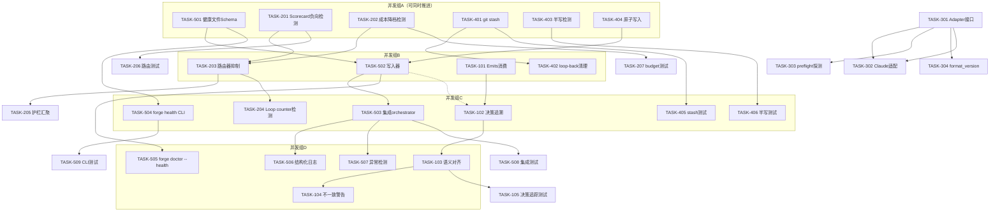

Now I have deep context on the codebase. Let me produce the comprehensive Tech Lead analysis.

---

# Tech Lead 分析：五种架构扩展方向实施评估

## 0. 前置上下文评估

**基准版本**: Sprint 15+，forge-core 13 Go 包，纯标准库零依赖，全绿
**红线约束**: 文件 ≤500 行、函数 ≤50 行、循环依赖=0、依赖单向向内、根目录 ≤15 文件
**现有分析覆盖**: `docs/` 615 篇文档（260 requirements + 40 analysis + 其余），4/5 方向有先例

在开始任何实施前，需要对审阅者反馈做**关键决策**：

| 审阅反馈 | Tech Lead 裁定 | 理由 |
|-----------|---------------|------|
| 方向五→首位 | ✅ **采纳** | 唯一真正新颖，杠杆可量化，落地路径清晰 |
| 方向三与已有分析"极高重叠" | ⚠️ **搁置，等待合并决策** | 与 `five-genuinely-uncovered-architectural-frontiers-2026-07-10.md` 方向一重叠 >70%。先与原作者协调再定是否独立推进 |
| 方向四"极高重叠" | ⚠️ **重新差异化，缩窄范围** | `execution-semantic-gaps.md` 已覆盖 75-80%。仅实施 git stash 具体实现 + 半写检测增量 |
| 方向一"高重叠" | ✅ **采纳，标注增量** | 聚焦跨 phase 决策追踪这个差异化点 |
| 方向二"memory 部分重叠" | ✅ **采纳，聚焦 scorecard/router 层面** | memory 环路已有方案；focus on 成本驱动降档 + scorecard 强化错误路由 |

**最终方向优先级（修正后）**:

| 优先级 | 方向 | 新颖性 | 实施策略 |
|--------|------|--------|---------|
| **P0** | 方向五 · 健康遥测 | ⭐⭐⭐⭐⭐ | 全速推进，无先例约束 |
| **P1** | 方向二 · 负向学习环路（router/scorecard 层） | ⭐⭐⭐ | 仅做增量部分，memory 层引用已有分析 |
| **P1** | 方向一 · 跨 phase 决策追踪 | ⭐⭐ | 聚焦差异化点 |
| **P2** | 方向四 · 工作区原子性（增量） | ⭐⭐ | 仅 git stash + 半写检测 |
| **P3** | 方向三 · CLI 契约版本化 | ⭐ | 等待合并决策，或作为方向五的子任务 |

---

## 1. 任务分解

将每个方向拆分为 2-4 小时可完成的任务。以 `TASK-<方向号><序号>` 编码。

### 方向五 · 无人值守运行时健康遥测（P0，无先例）

```
┌─ 健康文件契约 ──→ 写入器集成 ──→ 对外可读接口 ──→ forge doctor 扩展
└─ forge status 增强 ──→ 结构化日志格式
```

| 任务 ID | 标题 | 涉及文件 | 前置依赖 | 预估工时 | 验收标准 |
|---------|------|---------|----------|---------|---------|
| **TASK-501** | 定义健康文件 Schema 与契约 | `internal/health/`（新包） | 无 | 2h | `Health` struct 含 status / uptime / last_phase / iteration_count / budget_remaining / phase_summaries[n] / error_count 等字段；JSON schema 文档 | 
| **TASK-502** | 实现健康文件写入器 | `internal/health/writer.go` | TASK-501 | 2h | orchestrator 每 phase 完成后写入/更新 `.forge/health.json`；原子写（先写 `.tmp` 再 rename）；文件 ≤100 行 |
| **TASK-503** | 集成写入器到 orchestrator 主循环 | `internal/orchestrator/orchestrator.go` | TASK-502 | 3h | `RunFrom` 每个 phase 结束后调用 `health.Record(...)`；含 phase name / status / duration / error（若有）；不超过 30 行新增 |
| **TASK-504** | 实现 `forge health` CLI 命令 | `cmd/forge/health_cmd.go` | TASK-501 | 2h | `forge health` 输出格式化健康摘要（exit 0）；`forge health --json` 输出原始 JSON；`forge health --watch` 每 5s 轮询刷新；文件 ≤200 行 |
| **TASK-505** | 实现 `forge doctor --health` 诊断 | `internal/doctor/doctor.go`（已有扩展） | TASK-502 | 2h | 检查 `.forge/health.json` 是否存在、最近更新时间是否在预期窗口内、错误计数是否超过阈值；输出 RECOMMENDED/INFO/WARN/CRITICAL |
| **TASK-506** | 实现健康遥测的结构化日志 | `internal/health/telemetry.go` | TASK-501 | 2h | 围绕健康事件写入结构化日志条目（转圈文件，最多 3 个 1MB 文件）；日志含时间戳、事件类型、上下文 |
| **TASK-507** | 异常健康状态检测与告警 | `internal/health/detector.go` | TASK-503 | 3h | 检测停滞（phase duration 超过 2×历史均值）、异常重启（iteration 跳跃）、budget 快速消耗；输出结构化的 `HealthAlert` |
| **TASK-508** | 集成测试：健康文件生命周期 | `internal/health/health_test.go` | TASK-502~503 | 2h | 模拟 orchestrator 运行 3 iterations，验证 health.json 在 phase 间正确更新、crash 后部分存在、resume 后延续 |
| **TASK-509** | 集成测试：CLI 命令端到端 | `cmd/forge/forge_test.go`（或新建） | TASK-504~505 | 2h | `forge health` 在有/无健康文件时的行为；`forge doctor --health` 在正常/异常状态下的输出；`--watch` 的退出条件 |

**总工时**: 20h（2.5 人天）

---

### 方向二 · 负向学习环路检测与护栏（P1，router/scorecard 层增量）

```
┌─ scorecard 错误路由检测 ──→ 成本驱动降档检测 ──→ 护栏注入
└─ router 层面的反馈抑制
```

| 任务 ID | 标题 | 涉及文件 | 前置依赖 | 预估工时 | 验收标准 |
|---------|------|---------|----------|---------|---------|
| **TASK-201** | Scorecard 负向路由模式检测 | `internal/routing/scorecard.go`（扩展） | 无 | 3h | 检测连续 N 次（可配，默认 3）iteration 中同一 tier 产生 FAIL 记分卡 → 标记为"可能负向路由"；检测门限可配置；不改变现有 scorecard 行为 |
| **TASK-202** | 成本驱动渐进降档检测 | `internal/routing/budget.go`（扩展） | 无 | 3h | 追踪每 iteration 的 tier 分配分布；检测 haiku% 是否单调递增（连续 3 次 ↑≥5%）且伴随质量下降（gate fail/loop-back ↑）；输出警告结构体 |
| **TASK-203** | 路由器层面负向反馈抑制 | `internal/routing/router.go`（扩展） | TASK-201, TASK-202 | 4h | 当负向路由模式被检测到，router 注入"提高当前 phase 至少一档"的 override（与现有 raise-only 兼容）；此 override 可被 `--override-negative-detection` 禁用；向后兼容：无检测时行为不变 |
| **TASK-204** | Loop counter 环路检测 | `internal/orchestrator/orchestrator.go`（扩展） | 无 | 2h | 在 `loopBackTo` 中检测同一 pair (gate phase, target phase) 是否在短时间内（默认 5 iteration 内）触发 >3 次 loop-back → 注入警告到健康文件 + 输出到 stderr |
| **TASK-205** | 护栏指标汇聚与日志 | `internal/monitor/`（新包，或归入 health） | TASK-201~204 | 2h | 对每个检测到的负向模式写入结构化日志：时间、模式类型、触发值、持续次数、当前 tier/路径；不阻塞执行（仅 WARN） |
| **TASK-206** | 集成测试：负向路由模式 | `internal/routing/routing_test.go`（扩展） | TASK-203 | 3h | 构造模拟 scorecard 序列（连续 FAIL 3 次），验证检测触发并输出 override；验证无 FAIL 时无触发；验证配置较低的阈值 |
| **TASK-207** | 集成测试：成本降档检测 | `internal/routing/budget_test.go`（扩展） | TASK-202 | 2h | 构造模拟 budget 序列（haiku% 递增 5%、10%、15%），验证检测触发；验证无单调递增时无触发 |

**总工时**: 19h（2.4 人天）

---

### 方向一 · 跨 phase 决策追踪（P1，增量差异化点）

```
┌─ Emits 消费 ──→ phase 输出契约 ──→ 决策一致性检查器
└─ planner 声明 → implementer diff → reviewer 裁决 语义对齐
```

| 任务 ID | 标题 | 涉及文件 | 前置依赖 | 预估工时 | 验收标准 |
|---------|------|---------|----------|---------|---------|
| **TASK-101** | Phase `Emits` 字段兑现消费 | `internal/orchestrator/orchestrator.go` | 无 | 3h | 在 phase 执行后，如果 `Emits` 非空，验证每个声明文件是否被创建（`os.Stat`）；输出差异报告到健康文件；不阻断执行 |
| **TASK-102** | 跨 phase 决策输出追溯 | `internal/trace/`（扩展） | TASK-101 | 4h | 实现简单的 key-value map 记录每个 phase 的"决策声明"（从 phase output 中提取 `VERDICT: *` 行和带有 `**决策**` 标记的自然语言行）；绑定到 phase index 和时间戳；每 iteration 清空 |
| **TASK-103** | Planner→Implementer→Reviewer 语义对齐检查 | `internal/converge/trace.go`（新文件） | TASK-102 | 4h | 对 planner->implementer->reviewer 三方，提取各自的"结论"并做简单字符串级比较（重叠率）：planner 声明目标 vs implementer diff 描述 vs reviewer 裁决理由；输出对齐分数 0.0~1.0；不阻断 |
| **TASK-104** | Cross-phase 不一致警告 | `internal/converge/trace.go`（继续） | TASK-103 | 2h | 当对齐分数 < 阈值（默认 0.3）时，输出结构化的不一致警告（含三方原文摘要）；写入健康文件 `health.PhaseSummary` 中 |
| **TASK-105** | 集成测试：决策追踪 | `internal/trace/trace_test.go` | TASK-103 | 2h | 模拟三个 phase 的虚构输出，验证提取和比较逻辑正确工作 |

**总工时**: 15h（2 人天）

---

### 方向四 · 工作区输出原子性（P2，仅增量：git stash + 半写检测）

```
┌─ git stash 集成 ──→ loop-back 前清理 ──→ 半写文件检测
└─ forge doctor 扩展
```

| 任务 ID | 标题 | 涉及文件 | 前置依赖 | 预估工时 | 验收标准 |
|---------|------|---------|----------|---------|---------|
| **TASK-401** | 实现 git stash 工作区快照 | `internal/sideeffect/stash.go`（新包） | 无 | 3h | `StashBefore()`: `git stash push -m "forge-auto-<phase>-<ts>" --include-untracked`；`RestoreAfter()`: `git stash pop`；`Cleanup()`: `git stash drop`；所有操作非阻断（失败仅 WARN）；检测是否在 git repo 中，不在则跳过 |
| **TASK-402** | Loop-back 前副作用清理 | `internal/orchestrator/orchestrator.go`（扩展） | TASK-401 | 2h | 在 `loopBackTo` 成功跳转前，对目标 phase 之后、当前 phase 之前的区间执行 `RestoreAfter` 撤销文件改动；仅当 git 可用时 |
| **TASK-403** | 半写文件检测器 | `internal/doctor/doctor.go`（扩展） | 无 | 2h | `forge doctor --stale-files` 扫描工作区：零字节 `.go`/`.md`/`.json`/`.yaml` 文件；`.tmp` 后缀残留；文件修改时间在 `forge` 进程启动时间后的零字节文件；输出路径列表 |
| **TASK-404** | 原子写入工具函数 | `internal/sideeffect/atomic.go` | 无 | 1h | `WriteAtomically(path, data)` → 写 `.tmp` → `os.Rename`（POSIX 原子 rename）；用于所有 forge 自身的配置文件写入（health.json / checkpoint / memory） |
| **TASK-405** | 集成测试：git stash 流程 | `internal/sideeffect/stash_test.go` | TASK-401~402 | 3h | 在临时 git repo 中创建文件 → stash → 验证工作区已清理 → pop → 验证文件恢复；非 git repo 跳过；两次 pop 无错误 |
| **TASK-406** | 集成测试：半写检测 | `internal/doctor/doctor_test.go`（扩展） | TASK-403 | 1h | 创建零字节文件 → `forge doctor --stale-files` 检测到 → 删除后检测不到 |

**总工时**: 12h（1.5 人天）

---

### 方向三 · CLI 厂商契约版本化（P3，待合并决策）

| 任务 ID | 标题 | 涉及文件 | 前置依赖 | 预估工时 | 验收标准 |
|---------|------|---------|----------|---------|---------|
| **TASK-301** | 定义 Agent Adapter 接口 | `internal/adapter/contract.go`（新包） | 无 | 3h | `AgentAdapter` interface: `BuildArgv(ctx Prompt) ([]string, error)`, `ParseCost(output string) (float64, bool)`, `ParseVerdict(output string) (Verdict, error)`, `Name() string` |
| **TASK-302** | 将 Claude 实现适配到接口 | `internal/adapter/claude.go` | TASK-301 | 3h | 从 `engine_build.go` + `cost.go` 提取逻辑到 adapter；原函数委派给 adapter；向后兼容：无 adapter 时回退到内联逻辑 |
| **TASK-303** | 实现 `forge preflight --probe-cli` | `cmd/forge/preflight_cmd.go` | TASK-301 | 2h | 调用 `claude --version` 验证可用性；解析 JSON schema（通过试运行 `echo "hi" | claude -p - --output-format json`）；输出探测报告 |
| **TASK-304** | 输出格式 _format_version 字段 | `internal/adapter/schema.go` | TASK-301 | 1h | 在 JSON 输出解析中增加 `_format_version` 字段识别；版本不匹配时输出 WARN 但不阻断 |

**总工时**: 9h（1.1 人天）

---

## 2. 执行顺序与依赖图



**并行策略**:

| 并发组 | 包含任务 | 前置条件 | 并行度 |
|--------|---------|----------|--------|
| **A** (基础设施) | TASK-501, 201, 202, 401, 403, 404 | 无（全新或扩展现有） | 3-4 人并行 |
| **B** (核心逻辑) | TASK-502, 203, 101, 402 | 组 A 完成 | 3 人并行 |
| **C** (集成层) | TASK-503, 504, 204, 102, 405, 406 | 组 B 完成 | 2-3 人并行 |
| **D** (完成层) | TASK-505, 506, 507, 103, 104, 105, 205~207, 508~509 | 组 C 完成 | 2 人并行 |

**串行依赖关键路径**: T501→T502→T503→T507→T508 = 5 个任务 = ~13h（~1.6 人天最短路径）

---

## 3. 技术风险

| 风险 ID | 风险描述 | 影响方向 | 概率 | 严重度 | 缓解策略 |
|---------|---------|---------|------|--------|---------|
| **RISK-1** | **零外部依赖约束**：Go 标准库无 YAML 解析器、无 HTTP 服务器、无 gRPC。若健康遥测需要 HTTP endpoint 暴露，将违反"零外部依赖"红线 | 方向五 | **高** | **高** | 健康文件是文件系统 JSON，无需 HTTP。`forge health` CLI 命令就是可读接口。Telemetry 用结构化日志文件（转圈文件），不用网络。**持续监控**：绝不引入 `net/http` 服务端 |
| **RISK-2** | **500 行文件上限**：orchestrator.go 目前 494 行，离上限仅 6 行。方向五和方向四的修改将迫使其超限 | 方向五/四 | **高** | **高** | **必须重构**：从 orchestrator.go 提取健康遥测写入逻辑到新包（`internal/health/writer.go`）；提取 loop-back 副作用清理到 `internal/sideeffect/`。这是"先拆分再继续"纪律的强制要求 |
| **RISK-3** | **git stash 依赖 git 可用性**：方向四的 git stash 集成假设 `git` 命令在 PATH 中。非 git 工作区或 `git status` 失败将导致整个 loop-back 清理静默跳过 | 方向四 | **中** | **中** | 所有 git 操作必须非阻断（失败仅 WARN 并继续）；检测 `git rev-parse --git-dir` 在操作前验证；CI 环境中 git 总是可用的 |
| **RISK-4** | **scorecard 负向检测的误报率**：方向二的负向路由检测可能将正常的产品路径退化（budget 即将耗尽、human_gate delay 导致的多 phase 失败）误报为负向环路 | 方向二 | **中** | **中** | 初始配置为**保守**（连续 5 次 FAIL、haiku% 连续 4 次 ↑≥10% 才触发）；检测输出仅为 WARN，不改变路由；提供 `--override-negative-detection` 全局禁用。运行一段时间后基于真实数据调整阈值 |
| **RISK-5** | **跨 phase 决策追踪的自然语言提取不可靠**：方向一的语义对齐依赖从 phase 输出中提取"决策"（VERDICT 行、markdown 标记等）。不同 agent 的格式不一致将导致提取失败 | 方向一 | **中** | **中** | 提取逻辑设计为"尽力而为"：支持多种已知格式（`VERDICT: *`、`**决策**`、`**Conclusion**`）；所有提取失败case输出空字符串而非 panic；对齐分数在无数据时默认为 1.0（不产生误报）。将提取精度的改进标记为 v2 工作 |
| **RISK-6** | **健康文件的磁盘 IO 在高频 iteration 下的性能影响**：如果 iteration 在 10 秒内完成，每次 phase 都 `os.Stat` + 写文件可能增加 10-20% 的延迟 | 方向五 | **低** | **低** | 健康文件本身的操作是微秒级的（JSON marshal + rename）。如果观察到延迟，可以降级为每 iteration 而非每 phase 写入。监控指标：健康文件写入延迟占 iteration 时间百分比 |
| **RISK-7** | **半写文件检测的假阳性**：方向四的 `forge doctor --stale-files` 可能将构建产物、编译器生成的零字节文件标记为"半写" | 方向四 | **高** | **低** | 初始版本：只扫描 `.go` / `.md` / `.json` / `.yaml` 这些 forge 可能写入的类型；忽略 `node_modules/` / `vendor/` / `.git/`；输出为 INFO，非 CRITICAL；用户可配置 `.forgeignore` 模式 |
| **RISK-8** | **方向三与现有分析重叠导致资源浪费**：如果未与 `five-genuinely-uncovered-architectural-frontiers` 原作者协调就直接独立实现，将产生 >70% 的重复代码 | 方向三 | **高** | **高** | **明确策略**：方向三搁置至技术领导会议决定合并方式。如果决定独立，必须引用已有分析并标注增量差异。优先考虑作为方向五的子功能（health telemetry CI/CD 需要 adapter 接口来探测版本） |

---

## 4. 资源评估

### 人员需求

| 角色 | 所需人数 | 技能要求 | 分配方向 |
|------|---------|---------|---------|
| **Go 后端工程师**（核心） | 2 人 | Go 标准库精通、文件系统编程、CLI 设计、编排系统理解 | 方向五（主要）+ 方向二/一（部分） |
| **Go 工程师**（辅助） | 1 人 | Go 标准库、git 操作、测试驱动开发 | 方向四（主要）+ 方向二（辅助） |
| **技术文档作者** | 0.5 人 | 技术写作、API 文档、CLI 文档 | 所有方向的文档 + 健康契约文档 |
| **Reviewer**（独立） | 1 人 × 每次 PR | fresh-context，理解 Go 和 forge-core 架构 | 每个 PR 的独立审查 |

**总开发团队**: 3-4 人（含兼职 reviewer）

### 关键里程碑

| 里程碑 | 时间 | 事件 | 可验证产出 |
|--------|------|------|-----------|
| **M0** | Day 0 | orchestrator.go 重构完成 | 文件 ≤480 行；健康写入已提取到独立包 |
| **M1** | Day 3 | 方向五核心：健康文件 + forge health CLI | `forge health` 显示当前运行时状态；健康文件在 evolve 中自动更新 |
| **M2** | Day 5 | 方向二核心：负向路由检测 + 成本降档检测 | 模拟负向序列，检测器输出结构化的 WARN |
| **M3** | Day 7 | 方向一核心：跨 phase 决策追踪 + 对齐检查 | `Emits` 已被消费；不一致警告在模拟中触发 |
| **M4** | Day 8 | 方向四增量：git stash + 半写检测 | loop-back 前清理工作区；`forge doctor --stale-files` 检测零字节文件 |
| **M5** | Day 10 | 所有集成测试全绿 + 闸门全过 | `forge accept` ACCEPTED；8 闸门全绿 |

### 阻塞点

| 阻塞点 | 描述 | 严重度 | 解决策略 |
|--------|------|--------|---------|
| **BLOCKER-1** | orchestator.go 494 行接近 500 上限。不重构则无法安全新增代码 | **阻断** | 在第一天完成拆分重构。提取内容：健康遥测写入（~60 行）、loop-back 副作用清理（~40 行）。重构后预估：orchestrator.go ~380 行 |
| **BLOCKER-2** | direction-3 的合并决策未定。如果决定合并，TASK-301~304 需要与 `five-genuinely-uncovered` 方向一的作者协调 API 设计 | **阻断** | 延迟至 Tech Lead 会议决策。方向三的实施若获批，增加 1-2 天协调时间 |
| **BLOCKER-3** | `internal/routing/router.go` 的文件大小可能接近 500 行上限 | **潜在** | 在 TASK-203 实施前检查文件行数。如果接近上限，先将 routing 逻辑拆分为独立文件 |
| **BLOCKER-4** | 健康文件的契约受设计会影响。方向五的 Schema 需要与未来 Web-UI（v3 路线图）的 API 格式兼容 | **非阻断** | 初期保持 schema 最小化（仅字段定义，无版本协商）。预留 `_ext` 扩展字段。v3 兼容性在 Web-UI 实施时再保证 |

---

## 5. 质量保证

### 单元测试覆盖要求

| 包 | 现有覆盖 | 目标覆盖 | 关键测试用例 |
|----|---------|---------|-------------|
| `internal/health`（新） | N/A | ≥85% | 健康文件写入/读取/更新；crash 后文件状态；转圈日志溢出 |
| `internal/routing`（扩展） | 已有 | ≥75% | 负向模式检测/未触发/边界值；成本降档递增/持平/下降 |
| `internal/sideeffect`（新） | N/A | ≥80% | git stash/pop/cleanup；非 git repo 跳过；文件半写检测 |
| `internal/trace`（扩展） | 已有 | ≥70% | 决策提取/格式变化/无数据；对齐分数计算/边界值 |
| `internal/orchestrator`（修改） | 已有 | 维持 ≥70% | loop-back 清理集成；健康文件调用的 mock 验证 |
| `cmd/forge`（修改） | 已有 | ≥65% | `forge health` 正常/错误/--watch；`forge doctor --health` |

### 集成测试策略

| 测试类型 | 工具 | 覆盖范围 | 前置条件 |
|---------|------|---------|----------|
| **包级集成** | Go `testing` | 健康文件生命周期（TASK-508）、stash 流程（TASK-405）、半写检测（TASK-406）、决策追踪（TASK-105） | 新建临时目录 |
| **CLI 端到端** | Go `testing` + `exec.Command` | `forge health`（TASK-509）、`forge doctor --stale-files` | 完整的 forge build |
| **回归测试** | 已有 `forge accept` | 所有新代码不破坏现有行为 | 全仓 `go test ./...` |
| **Fake orchestrator 测试** | Go 接口 mock | 健康写入在 orchestrator 中正确集成 | mock phase executor |

### 代码审查要点

| 审查关注点 | 相关方向 | 具体检查项 |
|-----------|---------|-----------|
| **红线合规** | 全部 | 每个新文件 ≤500 行；每个函数 ≤50 行；无循环依赖；无 `net/http`（零依赖） |
| **向后兼容** | 全部 | 新包/字段的零值=旧行为不变；所有新检查默认 N/A 或 PASS 或 WARN（非 FAIL/REJECTED）；CLI flag 默认值不改变现有命令行为 |
| **健康文件 Schema** | 方向五 | JSON 字段命名一致（snake_case）；无 Go 内部类型泄露；预留扩展字段 |
| **git 操作安全性** | 方向四 | 所有 git 命令失败时非阻断；无 `git push` / `git commit` 等写操作 |
| **检测阈值** | 方向二 | 默认阈值保守（减少误报）；所有阈值可通过环境变量或配置文件覆盖 |
| **自然语言提取** | 方向一 | 提取 fail-open（无法提取=空字符串，不 panic）；单元测试覆盖偏移格式 |
| **测试诚实性** | 全部 | 诚实标注 N/A 项；测试不伪造通过 |

### 性能测试需求

| 场景 | 衡量标准 | 阈值 |
|------|---------|------|
| 健康文件每 phase 写入 | 写入延迟 | <5ms（均值） |
| 负向检测的 CPU 消耗 | 每次 iteration 额外 CPU 时间 | <1ms |
| git stash 开销 | stash/pop 延迟 | <100ms（在 1000 文件 repo 中） |
| 半写文件扫描 | per-1000-files 扫描时间 | <200ms |
| 决策提取内存 | 额外内存 / phase | <64KB |

**性能退化门槛**: 所有新功能的 P99 总延迟 < 50ms/iteration（与现有 base iteration 同步）。超过此阈值的功能标记为 v2 优化。

---

## 6. 实施计划

### 阶段 1：基础设施搭建（Day 0-1.5）

```
Day 0     Day 0.5   Day 1     Day 1.5
│           │         │         │
├─ BLOCKER-1 重构 orchestrator.go (≈4h)
│   ├── 提取健康写入 → internal/health/writer.go
│   ├── 提取 loop-back 清理 → 预留接口
│   └── 重构后行数 ≤380
├─ TASK-404 原子写入工具函数 (≈1h)
├─ TASK-501 健康文件 Schema (≈2h)
└─ TASK-404→T502, T401→T405 写入器 + stash 起始
```

**产出**:
- orchestrator.go 重构完成，通过 `gate.mjs`
- `internal/health/` 新包（健康文件 schema + 原子写入）
- `internal/sideeffect/` 新包（git stash + 原子写入工具）

**闸门**: `node harness/gate.mjs` 全绿 | `go test ./internal/health/...` 全绿

---

### 阶段 2：核心功能实现（Day 1.5-5）

```
Day 1.5   Day 3     Day 4     Day 5
│          │         │         │
├─ 并行组A 核心 (T502, T201, T202, T401, T403)
│   ├── T502: 健康写入器集成 orchestrator (3h)
│   ├── T201: Scorecard 负向检测 (3h)
│   ├── T202: 成本降档检测 (3h)
│   ├── T401: git stash 快照 (3h)
│   └── T403: 半写文件检测 (2h)
├─ 并行组B 汇聚 (T503, T203, T101, T402)
│   ├── T503: 写入器在主循环中 (3h)
│   ├── T203: 路由器抑制 (4h)
│   ├── T101: Emits 消费 (3h)
│   └── T402: Loop-back 清理 (2h)
└─ 里程碑 M1 (Day 3): forge health 可行
    里程碑 M2 (Day 5): 负向检测 + 成本降档检测 完成
```

**产出**:
- `forge health` 命令可用
- Scorecard 负向路由检测输出 WARN
- 成本降档检测输出 WARN
- git stash 在 loop-back 前工作
- Emits 字段被消费
- 半写文件检测器可用

**闸门**: `go test ./internal/...` 全绿 | `node harness/acceptance.mjs` ACCEPTED

---

### 阶段 3：集成与完善（Day 5-8）

```
Day 5     Day 6     Day 7     Day 8
│          │         │         │
├─ 并行组C 集成 (T504, T204, T102, T405, T406)
│   ├── T504: forge health --watch/--json (2h)
│   ├── T204: Loop counter 环路检测 (2h)
│   ├── T102: 跨 phase 决策追溯 (4h)
│   ├── T405: stash 测试 (3h)
│   └── T406: 半写检测测试 (1h)
├─ 并行组D 完成 (T505, T506, T507, T103, T104)
│   ├── T505: forge doctor --health (2h)
│   ├── T506: 结构化日志 (2h)
│   ├── T507: 异常检测 (3h)
│   ├── T103: 语义对齐 (4h)
│   └── T104: 不一致警告 (2h)
└─ 里程碑 M3 (Day 7): 决策追踪 + 对齐检查 完成
    里程碑 M4 (Day 8): git stash + 半写检测 完成
```

**产出**:
- `forge health --watch` 可用
- `forge doctor --health` 可用
- 结构化日志写入转圈文件
- 异常健康状态检测（停滞、异常重启、budget 快速消耗）
- 跨 phase 对齐分数输出
- 不一致警告写入健康文件
- Loop counter 环路检测

**闸门**: `go test ./...` 全绿 | `node harness/acceptance.mjs` ACCEPTED

---

### 阶段 4：测试硬化与发布准备（Day 8-10）

```
Day 8     Day 9     Day 10
│          │         │
├─ TASK-508: 健康文件生命周期集成测试 (2h)
├─ TASK-509: CLI 端到端测试 (2h)
├─ TASK-105: 决策追踪测试 (2h)
├─ TASK-206/207: 路由/降档测试 (5h)
├─ 回归测试: 全仓 `go test ./...` + `forge accept`
├─ 代码审查: fresh-context Reviewer
└─ 性能测试: 验证 50ms/iteration 阈值
    里程碑 M5: 全绿 ACCEPTED
```

**产出**:
- 所有集成测试全绿
- 代码审查通过（fresh-context Reviewer）
- 性能基准满足阈值
- `forge accept` 输出 ACCEPTED

**闸门**: `node harness/acceptance.mjs` → **ACCEPTED** | 审查无 REJECTED

---

### 完整甘特图

```mermaid
gantt
    title ForgeOS 五方向扩展实施计划
    dateFormat  YYYY-MM-DD
    axisFormat  %m-%d
    
    section 基础
    重构 orchestrator.go      :a1, 0, 1d
    健康文件Schema            :a2, 0, 0.5d
    原子写入工具              :a3, 0, 0.5d
    git stash 快照            :a4, 0.5d, 1.5d
    半写文件检测器            :a5, 0.5d, 1.5d
    
    section 方向五 · 健康遥测
    健康写入器集成            :b1, after a2, 1d
    集成 orchestrator主循环   :b2, after b1, 1d
    forge health CLI         :b3, after b1, 1d
    结构化日志               :b4, after b2, 1d
    异常检测                 :b5, after b2, 1d
    forge doctor --health    :b6, after b1, 1d
    集成测试                 :b7, after b5, 1d
    CLI端到端测试            :b8, after b3, 1d
    
    section 方向二 · 负向学习
    Scorecard负向检测         :c1, 0.5d, 1.5d
    成本降档检测              :c2, 0.5d, 1.5d
    路由器抑制                :c3, after c1, 1.5d
    Loop counter检测          :c4, after c3, 1d
    护栏汇聚                  :c5, after c3, 1d
    路由测试                  :c6, after c3, 1d
    
    section 方向一 · 决策追踪
    Emits消费                 :d1, after a1, 1d
    决策追溯                  :d2, after d1, 1.5d
    语义对齐                  :d3, after d2, 1.5d
    不一致警告                :d4, after d3, 1d
    决策测试                  :d5, after d3, 1d
    
    section 方向四 · 原子性
    loop-back清理集成         :e1, after a4, 1d
    半写检测集成doctor        :e2, after a5, 0.5d
    stash测试                 :e3, after e1, 1d
    半写测试                  :e4, after e2, 0.5d
    
    section 质量
    集成测试全组              :f1, after b7, 1d
    代码审查                  :f2, after f1, 0.5d
    性能基准                  :f3, after f1, 0.5d
    forge accept全绿          :milestone, after f3, 0d
```

---

## 关键决策摘要

| 决策 | 结论 | 理由 |
|------|------|------|
| 方向三是否独立推进 | **否，搁置至合并决策** | 与已有分析重叠 >70%，资源应优先投入 P0/P1 方向 |
| orchestrator.go 是否重构 | **是，Day 0 最高优先** | 494 行，离 500 上限仅 6 行，不拆则无法安全修改 |
| 健康接口用 HTTP 还是文件 | **文件 + CLI** | 零依赖约束禁止 `net/http`；文件格式 + `forge health` CLI 是符合约束的可读接口 |
| 负向检测默认阻断还是警告 | **仅 WARN（默认不阻断）** | 误报风险高；初始作为可观测性增强，v2 再考虑 auto-override |
| git stash 操作失败是否阻断 | **不阻断（fail WARN）** | 非 git 工作区、CI 环境、权限不足等场景都应优雅降级 |
| 跨 phase 对齐是否阻断执行 | **不阻断** | 自然语言提取不可靠；对齐分数仅作为诊断信号，不改变工作流 |
