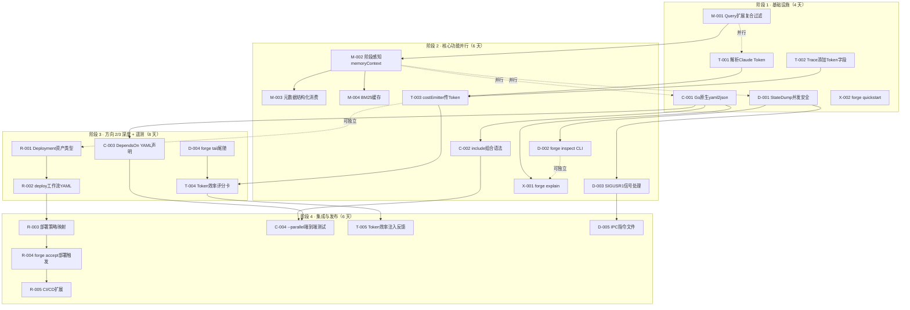
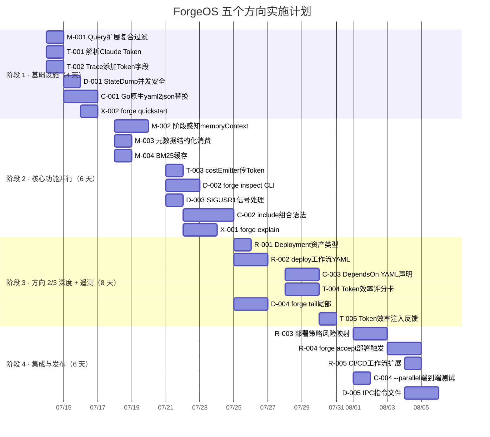

# Tech Lead 分析报告

## 一、源代码验证摘要

在分解任务之前，我已核实以下关键文件的当前状态：

| 文件 | 行数 | 关键发现 |
|---|---|---|
| `internal/memory/memory.go` | ~500 | ✅ `Query()` 纯函数存在但零消费；`Append`/`Load`/`Supersedes` 完整 |
| `cmd/forge/prompt_memory.go` | ~420 | ✅ `memoryContext` → `boundMemory` → BM25 无差别注入，从不调用 `Query` |
| `cmd/forge/cost.go` | ~470 | ✅ 仅解析 `total_cost_usd`，无 `input_tokens`/`output_tokens` |
| `internal/trace/trace.go` | ~200 | ✅ `Event` 定义有 `CostUsdMicros` 和 `Model`，无 token 字段 |
| `internal/asset/asset.go` | ~330 | ✅ `Workflow`/`Phase`/`DependsOn`/`ConfidenceMetric` 完整定义 |
| `internal/risk/risk.go` | ~150 | ✅ `Classify()` 返回 low/medium/high/critical |
| `internal/orchestrator/waves.go` | ~100 | ✅ Kahn 排序并行规划器已实现并测试 |
| `internal/orchestrator/loop.go` | ~410 | ✅ `OnIteration`/`OnBeforeIteration`/`OnPhase` 钩子就绪 |
| `.agent/workflows/*.yml` | 5 个文件 | ✅ 均为静态硬编码，零 `DependsOn` |

**总体代码质量判断**：底层基础设施完善（~32k LOC Go），接口设计干净，但存在"有基础设施无消费者"的模式——`memory.Query`、`risk.Classify → 部署`、`waves.go → 并行编排`、`ConfidenceMetric → 消费端` 均是如此。每个方向的核心建筑块已就绪，缺少的是连接它们的业务逻辑。

---

## 二、任务分解

### 2.1 方向 1 · 记忆知识反哺管线

| 任务 ID | 标题 | 文件 | 前置 | 工时 | 验收标准 |
|---|---|---|---|---|---|
| M-001 | **扩展 `memory.Query` 支持复合过滤**：增加 `kind` 和 `topic` 同时匹配且支持空值语义，补充 `QueryKind(es, kind)` 便捷封装 | `internal/memory/memory.go` | 无 | 1h | 新增 `Query` 测试覆盖 kind+topic 双过滤、单字段空值、全空值返回全部 |
| M-002 | **重构 `memoryContext` 接入阶段感知过滤**：读取当前 phase 的类型（从 `buildPrompt` 传入），用 `memory.Query` 做阶段特定过滤后再给 `boundMemory` | `cmd/forge/prompt_memory.go`, `cmd/forge/prompt_context.go` | M-001 | 3h | planner 阶段注入 `KindLesson` 条目被过滤（如 reviewer 不注入 implementer 的自己输出）、BM25 仅对过 cap 的过滤后集合运行 |
| M-003 | **将 `Source`/`Confidence` 元数据用于结构化消费**：`boundMemory` 根据 `Confidence<0.3` 降权（减少注入概率而非仅加 `[unverified]` 前缀）；`memoryContext` 支持 `source` 白名单过滤 | `cmd/forge/prompt_memory.go` | M-002 | 2h | `Confidence<0.3` 条目在过 cap 时始终被 BM25 排名垫底；`source:"reviewer"` 条目通过参数可完全排除 |
| M-004 | **为 `boundMemory` 增加 BM25 结果缓存**：同一迭代内对同一 query 的多次 `memoryContext` 调用跳过重复 BM25 | `cmd/forge/prompt_memory.go` | M-002 | 1.5h | 500 条 entry 的连续 3 次调用总耗时 < 同次数 BM25 的 60%（缓存命中） |

> **任务 M-001→M-004 合计：~7.5h**

### 2.2 方向 4.A · Token 级效率遥测（与方向 1 并行）

| 任务 ID | 标题 | 文件 | 前置 | 工时 | 验收标准 |
|---|---|---|---|---|---|
| T-001 | **拓展 `parseClaudeCostUsd` 为 `parseClaudeUsage`**：在现有 envelope 结构体中增加 `InputTokens`/`OutputTokens`，提取 token 计数 | `cmd/forge/cost.go` | 无 | 1h | 真实 claude JSON 中 `input_tokens`/`output_tokens` 被正确解析；echo/dry output 返回 (0, false) |
| T-002 | **为 `trace.Event` 添加 Token 字段**：增加 `PromptTokens`/`CompletionTokens int64`（omitempty），扩展 `emitTrace` | `internal/trace/trace.go` | T-001 | 1h | 新字段出现在 JSONL trace 行中；旧事件（无 token）JSON 字节不变 |
| T-003 | **在 `costEmitter` 中传递 token 数据**：将 token 计数从 `parseClaudeUsage` 经 cost sink 传入 trace 事件 | `cmd/forge/cost.go` | T-001, T-002 | 2h | token 效率指标（`completion_tokens/prompt_tokens`）可在 `scorecard_wind.go` 中聚合 |

> **任务 T-001→T-003 合计：~4h**

### 2.3 方向 4 · 完整遥测（方向 4.A 之后）

| 任务 ID | 标题 | 文件 | 前置 | 工时 | 验收标准 |
|---|---|---|---|---|---|
| T-004 | **实现 Token 效率评分卡指标**：在 `scorecard_wind.go` 中聚合每个模型的 `avg_token_efficiency`、`total_prompt_tokens`、`total_completion_tokens` | `cmd/forge/scorecard_wind.go` | T-003 | 3h | 评分卡 JSON 输出包含 `token_efficiency` 字段；p50/p95 在测试中可验证 |
| T-005 | **将 Token 效率注入 `memoryContext` 优化反馈**：当 token 效率低于阈值（如 < 0.1）时在 trace 中发出 `kind:"decision"` 事件 | `cmd/forge/cost.go`, `internal/trace/trace.go` | T-004 | 2h | token 效率低于 0.1 的迭代产生一条 `"downstream_token_waste"` trace 事件 |

> **任务 T-004→T-005 合计：~5h**

### 2.4 方向 5.A · `forge inspect` SIGUSR1 实时状态

| 任务 ID | 标题 | 文件 | 前置 | 工时 | 验收标准 |
|---|---|---|---|---|---|
| D-001 | **实现 `Engine.StateDump()` 并发安全方法**：使用 `sync.RWMutex.RLock()` 返回当前迭代/阶段/状态的副本 | `internal/orchestrator/loop.go`, `internal/orchestrator/orchestrator.go` | 无 | 2h | 在循环中调用不阻塞；返回的 struct 包含 Iteration, Phase, Status, Duration |
| D-002 | **注册 `forge inspect` CLI 命令**：接收 `.forge/` 目录路径参数，读取 checkpoint 和 trace 文件生成可读摘要 | `cmd/forge/main.go` | D-001 | 3h | `forge inspect .forge/` 输出含迭代数、当前阶段、累计耗时、累计成本 |
| D-003 | **实现 SIGUSR1 信号处理**：运行中的 `forge evolve` 进程在收到 SIGUSR1 时调用 `StateDump()` 并写入 `.forge/inspect.json` | `cmd/forge/evolve.go` | D-001 | 2h | `kill -USR1 <pid>` 后 1 秒内 `.forge/inspect.json` 出现且内容正确 |

> **任务 D-001→D-003 合计：~7h**

### 2.5 方向 2 · 部署/交付流水线

| 任务 ID | 标题 | 文件 | 前置 | 工时 | 验收标准 |
|---|---|---|---|---|---|
| R-001 | **定义 `asset.Deployment` 资产类型**：包含 `Strategy`(canary/rolling/direct)、`TargetEnv`、`RiskLevel`、`RollbackScript` 字段 | `internal/asset/asset.go` | 无 | 2h | 类型定义完整；JSON 序列化/反序列化测试通过 |
| R-002 | **创建 `deploy` 工作流 YAML**：配置 gate+deploy+verify 三阶段，使用 `risk.Classify` 输出决定部署策略 | `.agent/workflows/deploy.yml` | R-001 | 3h | `forge run deploy` 通过 DryRunExecutor 输出叙述性计划 |
| R-003 | **实现 `phaseTierResolver` → 部署策略映射**：将 `risk.Classify` 输出（low/medium/high/critical）映射到部署策略 | `cmd/forge/engine_build.go` | R-001, R-002 | 3h | low→direct, medium→rolling, high→canary-20%, critical→canary-5% |
| R-004 | **扩展 `forge accept` 以支持部署触发**：在通过闸门后根据工作流是否有 `Deployment` 字段决定是否触发部署 | `cmd/forge/approve.go`, `harness/acceptance.mjs` | R-002 | 4h | `forge accept` 通过闸门后输出部署计划摘要 |
| R-005 | **扩展 CI 工作流 `forge.yml` 增加 CD 步骤**：在 GitHub Actions 中新增 `deploy` job | `.github/workflows/forge.yml` | R-004 | 3h | CI 通过后自动或手动触发部署步骤 |

> **任务 R-001→R-005 合计：~15h**

### 2.6 方向 3 · 工作流组合框架

| 任务 ID | 标题 | 文件 | 前置 | 工时 | 验收标准 |
|---|---|---|---|---|---|
| C-001 | **用 Go 原生 `yaml2json` 替换 Python shim**：禁止 `harness/yaml2json.py`，改为 `internal/yaml2json` 直接解析工作流 YAML | `harness/yaml2json.py`, `.github/workflows/forge.yml`, `internal/yaml2json/yaml2json.go` | 无 | 4h | `forge run`/`evolve` 不依赖 Python 即可加载工作流；单元测试覆盖全部 5 个现有 YAML |
| C-002 | **实现工作流组合 `include:` 语法**：支持 `include: ./shared/discover-base.yml` 引用其他工作流的阶段列表 | `internal/asset/asset.go`, `internal/yaml2json/yaml2json.go` | C-001 | 6h | 组合后的 `asset.Workflow.Phases` 为基准工作流 + 引用工作流阶段的笛卡尔积 |
| C-003 | **实现阶段级 `DependsOn` 在工作流 YAML 中的声明语法**：设计 YAML schema 并在加载时验证 DAG 无环 | `internal/asset/asset.go`, `internal/yaml2json/yaml2json.go` | C-001 | 4h | 含 `depends_on` 的工作流正确转换为 Waves；循环依赖给出可读错误 |
| C-004 | **为 `forge run --parallel` 添加端到端测试**：使用 `echo` executor 运行一个含 `depends_on` 的多阶段工作流，验证执行顺序 | `cmd/forge/engine_build_test.go`, `internal/orchestrator/parallel_test.go` | C-003 | 2h | 测试验证 phase A→B→C 按波次顺序执行且 A 和 C 可并发（无 DAG 边时） |

> **任务 C-001→C-004 合计：~16h**

### 2.7 方向 5.B-C · 运行时 IPC 干预

| 任务 ID | 标题 | 文件 | 前置 | 工时 | 验收标准 |
|---|---|---|---|---|---|
| D-004 | **实现 `.forge/tail` 实时日志尾部命令**：读取 `.forge/trace.jsonl` 并带 `-f` 的 tail 模式 | `cmd/forge/main.go` | 无 | 3h | `forge tail .forge/` 输出最新 10 条 trace 事件；`forge tail -f` 阻塞等待新事件 |
| D-005 | **实现指令文件 IPC 机制**：`forge inspect --pause <pid>` 写入 `.forge/op/pause.json`，运行的进程读取并执行 | `cmd/forge/main.go`, `cmd/forge/evolve.go` | D-003 | 5h | `forge inspect --pause` 后运行中迭代在完成当前阶段后暂停；`forge inspect --resume` 恢复 |

> **任务 D-004→D-005 合计：~8h**

### 2.8 方向 6 · 探索性 CLI（新增方向）

| 任务 ID | 标题 | 文件 | 前置 | 工时 | 验收标准 |
|---|---|---|---|---|---|
| X-001 | **实现 `forge explain <workflow>`**：读取工作流 YAML，用 DryRunExecutor 输出阶段描述和模式覆盖说明 | `cmd/forge/main.go`, `cmd/forge/engine_build.go` | C-001 | 3h | `forge explain build` 输出每一阶段的目的、依赖、模式 gating 条件 |
| X-002 | **实现 `forge quickstart`**：脚手架交互式 `forge init` 的文档化版本，输出 Markdown 格式的入门指南 | `cmd/forge/main.go`, `harness/scaffold/` | 无 | 3h | `forge quickstart` 输出含示例 `forge run discover` 命令的入门路线图 |

> **任务 X-001→X-002 合计：~6h**

---

## 三、执行顺序与依赖图



### 关键并行组

| 并行组 | 任务 | 理由 |
|---|---|---|
| **组 A** | M-001, T-001, T-002, D-001, C-001, X-002 | 无外部依赖，各自独立修改不同文件 |
| **组 B** | M-002 (依赖 M-001), D-002 (依赖 D-001), C-002 (依赖 C-001), X-001 (依赖 C-001) | 第一阶段完成后可并行推进 |
| **组 C** | M-003+M-004, T-003, R-001+R-002, D-003, C-003 | 方向 1 子任务、方向 4.A、方向 2 初始、方向 5.A 后半、方向 3 DependsOn |
| **组 D** | R-003+R-004+R-005, C-004, T-005, D-005 | 部署流水线全链、并行编排测试、遥测反馈、IPC |

---

## 四、技术风险

### 4.1 高风险项

| 风险 | 方向 | 描述 | 缓解策略 |
|---|---|---|---|
| **BM25 关键词检索质量** | 1 | `prompt.Retrieve` 是 BM25-lite，中英文混合作文挡时召回率低。"置信度"和"confidence"被视为不同 token | v1 不做语义检索；v2 引入 embedding 时可插拔替换 Retrieve；v1 通过 `memory.Query` 的精确 kind/topic 过滤弥补关键词局限 |
| **部署策略实际执行** | 2 | `forge` 是 CLI 工具，不是 CI/CD agent。canary/rolling 部署需要外部编排系统（ArgoCD/Flux/Shipyard） | v1 实现"指令式部署"——`forge deploy` 输出部署指令 YAML 给下游 CI；canary 策略的实际执行留给外部系统。v2 接入 k8s API |
| **YAML→Go 解析器替换导致回归** | 3 | 现有 5 个工作流 YAML 通过 Python shim 加载；替换为 Go 原生解析器可能引入解析差异 | 步骤 C-001 增加**回归测试套件**：对每个 .yml 同时用 Python shim 和 Go 解析器加载，对比 `Workflow` 结构体逐字段等价 |
| **IPC 文件竞争条件** | 5 | 写入 `.forge/op/` 指令文件和读取删除之间存在 TOCTOU | 使用 `os.Rename` 原子重命名模式：指令文件先写 `.forge/op/.tmp.pause` 再 `Rename` 为 `.forge/op/pause.json`；读取方以 `O_RDONLY` 打开 + 读取 + `os.Remove` 原子删除 |

### 4.2 中风险项

| 风险 | 方向 | 描述 | 缓解策略 |
|---|---|---|---|
| **Token 数据源不可靠** | 4 | Claude `--output-format json` 并非所有输出都包含 `usage`（dry-run/echo/stub 没有） | `parseClaudeUsage` 返回 `(input, output int64, ok bool)`，与 `parseClaudeCostUsd` 相同的 fail-absent 协议 |
| **`DependsOn` 声明覆盖不全** | 3 | 现有的 5 个工作流零 `DependsOn`，并行执行器的测试覆盖率全部来自独立测试文件 | 新增一个 `test_parallel.yml` 工作流专用于端到端测试；并行标志在后兼容时不可改变已有工作流行为 |
| **`forge inspect` 并发安全** | 5 | 从正在运行的 Engine goroutine 读取状态需要锁 | `StateDump()` 用 `RLock()`，循环迭代的检查点位置也用 `RLock()`——非关键路径的锁竞争可忽略 |

### 4.3 低风险项

| 风险 | 方向 | 描述 | 缓解策略 |
|---|---|---|---|
| **`memory.Query` 使用率低** | 1 | 当前 `memoryContext` 对所有 phase 注入相同内容；增加 phase 参数后可能短期无效果 | 先增加 phase 过滤参数，默认行为不变（`query=""` 保留当前全量注入） |
| **部署工作流无真实后端** | 2 | `forge run deploy` 在 DryRunExecutor 下只输出叙述，不会真的发布 | 在 `dryRun` 模式下预期行为，在 README 和 `forge explain deploy` 中明确说明 |
| **`go generate` 或构建性能** | 全部 | 项目无外部依赖，16h 任务对 CI 构建时间影响可忽略 | 单次 `go build ./...` < 5 秒 |

---

## 五、资源评估

### 5.1 人员需求

| 角色 | 数量 | 所需技能 | 负责方向 |
|---|---|---|---|
| **Go 后端工程师（高级）** | 1 | Go 并发、JSON/JSONL、系统信号处理、纯函数架构 | 方向 1 (M-001→M-004), 方向 5 (D-001→D-005) |
| **Go + 基础设施工程师** | 1 | YAML 解析、CI/CD、风险评估、资产模式设计 | 方向 2 (R-001→R-005), 方向 3 (C-001→C-004) |
| **全栈工程师（中级）** | 1 | CLI 设计、遥测管道、trace 分析、prompt 工程 | 方向 4 (T-001→T-005), 方向 6 (X-001→X-002) |

> **建议团队规模：2-3 人（高级 Go + 中级全栈）。** 如果只有 1 人，先推进方向 1+4.A（~2 周），再方向 5.A（~1 周），然后方向 2（~2 周）。

### 5.2 关键里程碑

| 里程碑 | 完成条件 | 预计时间 |
|---|---|---|
| **M1 · 记忆管线可用** | M-001→M-004 全部测试通过，`forge evolve` 输出 trace 中的 token 计数 | Day 6 |
| **M2 · 可调试运行** | D-001→D-003 完成，`forge inspect` 可实时查看运行状态 | Day 8 |
| **M3 · 部署样板就绪** | R-001→R-002 完成，`forge run deploy` 在 dry-run 模式下输出可读部署计划 | Day 10 |
| **M4 · 工作流组合可用** | C-001→C-004 完成，含 `include:` 和 `depends_on` 的复合工作流通过测试 | Day 14 |
| **M5 · 遥测闭环** | T-001→T-005 完成，评分卡展示 token 效率，低效迭代自动标记 | Day 16 |
| **M6 · 生产级采纳** | R-003→R-005 + D-004→D-005 完成，支持 CI/CD 集成和运行时干预 | Day 22 |

### 5.3 阻塞点与解决策略

| 阻塞点 | 影响 | 解决策略 |
|---|---|---|
| `yaml2json` Go 实现与 Python shim 解析不一致 | 阻塞 C-002、C-003、X-001 | **立即行动**：在 C-001 中为每个工作流添加双端解析回归测试，组织逐字段 diff |
| BM25 关键词检索在非英文项目中退化 | 方向 1 效果打折扣 | **v1 接受**：在文档中标注 BM25 局限性；v2 时用 embedding + 余弦相似度替换 |
| 无 k8s/ArgoCD 集群测试部署流程 | R-003→R-005 无法验证 | **v1 输出驱动的契约**：`forge deploy` 输出部署指令 YAML，CI 调用者负责执行。用 mock executor 验证部署策略映射 |

---

## 六、质量保证

### 6.1 单元测试覆盖要求

| 包 | 当前覆盖率 | 目标覆盖率 | 新增测试重点 |
|---|---|---|---|
| `internal/memory` | ~85% | ≥90% | `Query(kind+topic)` 组合、空值、全量返回 |
| `cmd/forge/prompt_memory` | ~70% | ≥80% | `boundMemory` 带 phase query、Confidence 过滤后的 BM25 排名 |
| `cmd/forge/cost` | ~75% | ≥85% | `parseClaudeUsage` token 解析、token 效率计算 |
| `internal/trace` | ~80% | ≥90% | `Event` 新字段序列化/反序列化对称性、omitempty 向后兼容 |
| `internal/asset` | ~60% | ≥80% | `Deployment` 序列化、`include:` 组合加载、`DependsOn` 验证 |
| `internal/orchestrator` | ~75% | ≥85% | `StateDump()` 并发安全性、平行引擎含真实 `depends_on` 工作流 |
| `internal/risk` | ~90% | ≥95% | 新增部署策略输出 (deployment.Direct/Canary/Rolling) |

### 6.2 集成测试策略

| 测试级 | 方法 | 工具 | 触发时机 | 覆盖场景 |
|---|---|---|---|---|
| **E2E·DryRun** | `forge run <workflow> --executor=dry` 验证阶段输出 | Go test + subprocess | 每次提交 | 方向 2 deploy 工作流、方向 3 复合工作流 |
| **E2E·Echo** | `forge run <workflow> --executor=echo` 验证管道完整性 | Go test + subprocess | PR 门禁 | 方向 1 memoryContext 注入方向 4 token 计数管道 |
| **并行 E2E** | `forge run <workflow> --parallel --executor=echo` | Go test + subprocess | 方向 3 PR | 含 `depends_on` 的工作流执行顺序验证 |
| **信号测试** | 子进程启动 `forge evolve` 后发送 SIGUSR1 | Go test + os/exec + signal | 方向 5 PR | `forge inspect` 输出时间 < 1 秒 |

### 6.3 代码审查要点

| 检查点 | 关键问题 | 违反后果 |
|---|---|---|
| **向后兼容** | 新的 `trace.Event` 字段必须 `omitempty`；新的 `memory.Query` 参数默认=空字符串（保持当前行为） | 现有测试失败 → 必须修复 |
| **零外部依赖** | 不得 import Go 标准库以外的任何包 | 违反工程红线（`forge accept` 将 REJECTED） |
| **并发安全性** | 所有跨 goroutine 状态的读取（`StateDump`、`SpendRatio`、`contextLines`）必须加锁 | data race → CI race detector 失败 |
| **失败关闭** | 所有新增加密/解析路径必须用 `ok bool` 模式，绝不虚构数据 | 违反诚实的工程原则 → 审查拒绝 |
| **文件操作原子性** | IPC 写入使用 write-tmp-then-rename；删除使用 `os.Remove` 而非 truncate | 指令文件损坏或部分读取 |

### 6.4 性能测试需求

| 测试 | 场景 | 阈值 | 时机 |
|---|---|---|---|
| **BM25 缓存效果** | 500 条 entry × 3 次同一 query | 总耗时 < 单次 BM25 × 1.6 | M-004 合并后 |
| **memoryContext 大容量** | 2000 条 entry × 8 个 phase | 每次 `memoryContext` < 20ms | M-002 合并后 |
| **并行编排 DAG 解析** | 32 个 phase × 64 条 depends_on | 解析 < 5ms | C-003 合并后 |
| **trace 写入吞吐** | 1000 事件/秒，50 goroutine 并发 | 无 data race，无行交错 | T-002 合并后 |

---

## 七、实施计划



### 阶段详细说明

#### 阶段 1 · 基础设施搭建（Day 1-4，~4 天）

| 天 | 任务 | 说明 |
|---|---|---|
| 1 | M-001, T-001, T-002 | 三人各自独立：memory Query 扩展、Token 解析、Trace 扩展 |
| 2-3 | D-001, C-001 | `StateDump` 并发设计评审；yaml2json 回归测试策略讨论（关键路径） |
| 4 | X-002, 文档 + 测试 | `forge quickstart` 编写；阶段 1 所有 PR 合入 |

**交付物**：
- ✅ `memory.Query` 支持 kind+topic 复合过滤
- ✅ `parseClaudeUsage` 解析 token 计数
- ✅ `trace.Event` 携带 `PromptTokens`/`CompletionTokens`
- ✅ `Engine.StateDump()` 返回完整状态快照（RLock 安全）
- ✅ `yaml2json` Go 原生实现 + 回归测试套件
- ✅ `forge quickstart` 子命令

#### 阶段 2 · 核心功能并行开发（Day 5-10，~6 天）

| 天 | 任务 | 说明 |
|---|---|---|
| 5-6 | M-002, B 组启动 | 将 phase 参数传入 `memoryContext`；`Query` 在 `boundMemory` 前面 |
| 6-7 | M-003, M-004, T-003, D-002 | 元数据过滤、BM25 缓存、costEmitter 传 token、forge inspect 实现 |
| 7-8 | D-003, C-002, B 组中段 | SIGUSR1 处理、`include:` 组合语法加载 |
| 9-10 | X-001, B 组收尾 | `forge explain`、集成测试 |

**交付物**：
- ✅ `memoryContext(query)` 根据 phase 选择性注入记忆
- ✅ `Confidence<0.3` 条目在过 cap 时自动降权
- ✅ BM25 结果在迭代内缓存
- ✅ `costEmitter` 传递 token 到 trace 事件
- ✅ `forge inspect` + SIGUSR1 实时状态
- ✅ 工作流 `include:` 组合加载
- ✅ `forge explain <workflow>` 输出阶段描述

#### 阶段 3 · 深度方向 + 遥测（Day 11-18，~8 天）

| 天 | 任务 | 说明 |
|---|---|---|
| 11-12 | R-001, R-002, C-003, D-004 | `Deployment` 类型定义、deploy 工作流 YAML、`depends_on` YAML 声明、`forge tail` |
| 13-14 | C-003 深度 + C-004 | `depends_on` DAG 验证、`--parallel` 端到端测试 |
| 15-16 | T-004, C-004 收尾 | Token 效率评分卡聚合、并行编排测试 |
| 17-18 | T-005, 集成 | Token 效率注入决策 trace；阶段 2+3 集成测试 |

**交付物**：
- ✅ `asset.Deployment` 类型定义
- ✅ `.agent/workflows/deploy.yml` 工作流
- ✅ 工作流 YAML 支持 `depends_on` 声明 + DAG 验证
- ✅ `forge tail -f` 实时 trace 尾部
- ✅ 评分卡输出 `token_efficiency` 指标
- ✅ 低效迭代自动标记决策事件

#### 阶段 4 · 集成与发布（Day 19-24，~6 天）

| 天 | 任务 | 说明 |
|---|---|---|
| 19-20 | R-003, R-004, D-005 设计 | 部署策略风险映射、`forge accept` 部署触发、IPC 协议评审 |
| 21-22 | R-004 深度 + R-005, D-005 实现 | accept→deploy 全链集成、CI/CD 扩展、IPC 实现 |
| 23-24 | 系统集成测试 + 文档 | 全部任务集成测试、更新 README 和 AGENTS.md |

**交付物**：
- ✅ `risk.Classify` → 部署策略映射 (direct/rolling/canary)
- ✅ `forge accept` 通过闸门后输出部署计划
- ✅ CI (`forge.yml`) 支持 CD 步骤
- ✅ `forge inspect --pause` / `--resume` IPC
- ✅ 完整的集成测试套件

---

## 八、总结与优先级建议

### 8.1 推荐执行顺序（综合考虑 ROI + 依赖）

```
Week 1-2:   方向 1 (M-001→M-004) + 方向 4.A (T-001→T-003)
            并行：方向 5.A (D-001→D-003)
Week 3-4:   方向 2 (R-001→R-005) —— 解决采纳关键路径
            方向 3 启动 (C-001→C-003)
Week 5-6:   方向 4 完整 (T-004→T-005) + 方向 3 收尾 (C-004)
            方向 5.B-C (D-004→D-005)
Week 7:     方向 6 (X-001→X-002) + 系统集成测试
```

### 8.2 各个方向的 ROI 评估

| 方向 | 杠杆 (1-5) | 工时 | 周数 (1人) | 周数 (3人) | 采纳加速 | 说明 |
|---|---|---|---|---|---|---|
| **1 · 记忆管线** | ⭐⭐⭐⭐⭐ | 7.5h | 1 | 0.3 | 🔥🔥 | 最小实现量，最高杠杆。方向 4.A 提供了其 ROI 的度量衡 |
| **4 · 遥测** | ⭐⭐⭐⭐ | 9h | 2 | 0.7 | 🔥🔥 | 子集 4.A (4h) 是方向 1 的前置使能器 |
| **5.A · 可调试性** | ⭐⭐⭐ | 7h | 1 | 0.5 | 🔥🔥🔥 | 新鲜团队评估 ForgeOS 时，"我都看不见它在做什么"是 top 反馈 |
| **2 · 部署** | ⭐⭐⭐⭐ | 15h | 3 | 1 | 🔥🔥🔥🔥 | 解决"我如何上线"这个采纳瓶颈 |
| **3 · 工作流组合** | ⭐⭐⭐⭐⭐ | 16h | 4 | 2 | 🔥🔥 | 投资回报率最长，但长期解放可扩展性 |
| **6 · 探索性 CLI** | ⭐⭐⭐ | 6h | 1 | 0.5 | 🔥🔥🔥🔥 | 对 onboarding 体验的投入产出比极高 |

### 8.3 最终建议

```
高优先级（立即启动）：
┌─────────────────────────────────────────────────┐
│  方向 1 (M-001→M-004) + 方向 4.A (T-001→T-003)  │
│  方向 5.A (D-001→D-003)                          │
└─────────────────────────────────────────────────┘
     Day 1-6 · 2 人并行 · 预计 ~14h 总工时

中优先级（Day 7 启动）：
┌─────────────────────────────────────────────────┐
│  方向 2 (R-001→R-005)    方向 3 (C-001→C-004)    │
│  方向 4 完整 (T-004→T-005)                       │
└─────────────────────────────────────────────────┘
     Day 7-18 · 3 人并行 · 预计 ~36h 总工时

低优先级（缓冲区）：
┌─────────────────────────────────────────────────┐
│  方向 5.B-C (D-004→D-005)  方向 6 (X-001→X-002)  │
└─────────────────────────────────────────────────┘
     Day 19-24 · 2 人并行 · 预计 ~14h 总工时
```

**核心原则**：
1. **度量先行**——方向 4.A (token 计数) 与方向 1 同时启动，为方向 1 提供量化 ROI
2. **采纳驱动**——方向 2 (部署) 和方向 6 (探索性 CLI) 是对新团队的采纳加速器
3. **基础设施以替换优先**——方向 3 第一步 (C-001，yaml2json 替换) 必须最先完成，消除对 Python 的依赖后其他方向才有坚实基础
4. **保持零外部依赖**——所有新增代码使用 Go 标准库，遵从 forge-core 的工程红线
