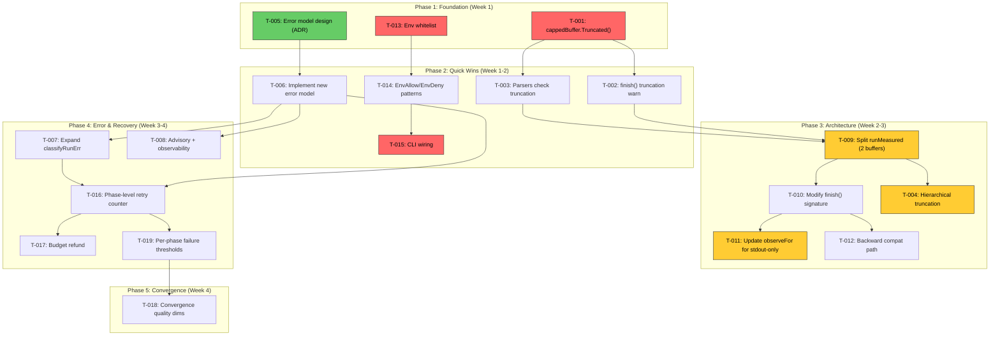
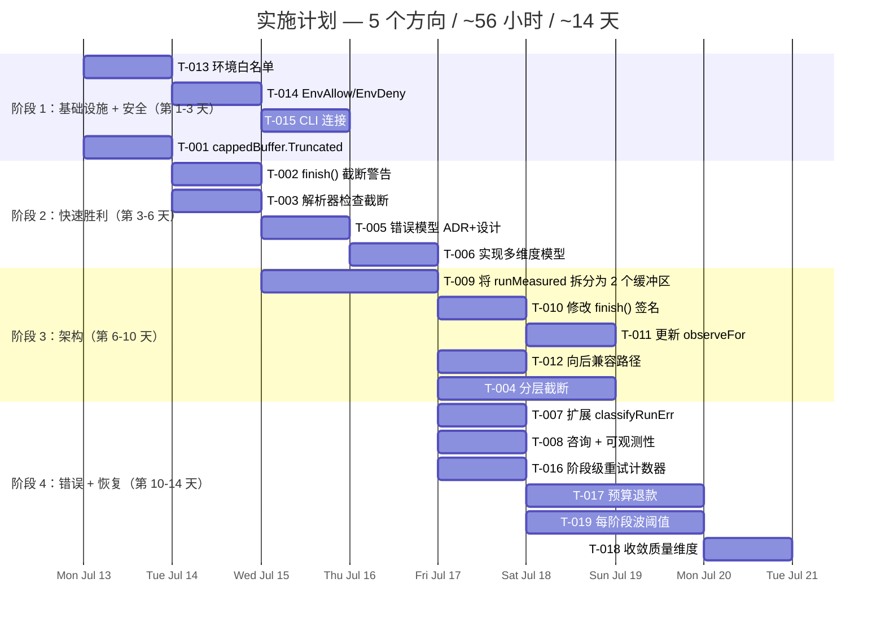

现在我具备了对所有五个方向和代码库的全面理解。以下是技术负责人分析：

---

# Tech Lead 分析：ForgeOS 管道完整性与安全差距

## 1. 任务分解

以下是将五个方向拆解为 2-4 小时可执行的工程任务。

### 方向一：输出管道完整性（P0）

| 任务 ID | 标题 | 涉及文件 | 前置依赖 | 预估工时 | 验收标准 |
|---------|------|---------|---------|---------|---------|
| **T-001** | 向 `cappedBuffer` 添加 `Truncated()` 访问器 | `command_executor.go` | 无 | 1h | `cappedBuffer` 暴露 `Truncated() bool` 方法；`rendered()` 继续向后兼容；现有测试通过 |
| **T-002** | 使 `finish()` 在截断发生时记录警告 | `command_executor.go` | T-001 | 2h | 当输出被截断时，`finish()` 在 `observe()` 之前记录 `"[truncated]"` 警告；无截断时日志保持不变 |
| **T-003** | 使三个下游解析器检查截断标记 | `cost.go`：`parseClaudeCostUsd`、`parseReviewerVerdict`、`parseConfidenceScore` | T-001 | 3h | 每个解析器在无法解析且输出被截断时发出显式的 `"[cost/verdict/confidence lost: output truncated]"` 日志；截断且无法解析时，从静默失败（`return 0,false`）变为显式日志 |
| **T-004** | 实施优先级/分层截断（保留头部信封 + 尾部裁决行） | `command_executor.go` | T-001 | 4h | `cappedBuffer` 在达到容量后优先丢弃中间字节；在 10MB 截断下，`{"result":"...","total_cost_usd":...}` JSON 信封被保留，且最后一行 `VERDICT:` / `CONFIDENCE:` 被保留；通过精确边界测试进行验证 |

### 方向二：错误分类多维化（P1）

| 任务 ID | 标题 | 涉及文件 | 前置依赖 | 预估工时 | 验收标准 |
|---------|------|---------|---------|---------|---------|
| **T-005** | 设计多维度错误模型（重写 `exec_error.go`） | `exec_error.go` | 无 | 3h | 编写 ADR；定义三个新枚举：`Severity{Fatal,Error,Warning,Info}`、`Source{Config,Resource,Semantic,System,Agent}`、`RecoveryStrategy{AutoRetry,BackoffRetry,Escalate,Abort}`；`ExecError` 使用这三个维度；`Retryable()` 从 `RecoveryStrategy` 派生 |
| **T-006** | 实现在 `ExecError` 中的新错误模型 | `exec_error.go` | T-005 | 4h | `ExecError` 携带 `Severity`+`Source`+`Recovery`；`Retryable()` 检查 `Recovery==AutoRetry||BackoffRetry`；旧的 5 个 `ExecKind` 值保持为向后兼容的速记别名；所有现有测试通过 |
| **T-007** | 扩展 `classifyRunErr` 以识别更多系统错误 | `exec_error.go` | T-006 | 3h | 识别 `syscall.ENOSPC`→`Source:Resource`、退出码 137/9(OOM)→`Source:System`、`os.ErrClosed`→`Source:System`、`SIGPIPE`→`Source:System`（已回溯到 `RecoveryStrategy`） |
| **T-008** | 添加人类可读的咨询消息 + 分类可观测性 | `exec_error.go`、`command_executor.go`、`orchestrator.go` | T-006 | 3h | `ExecError.Advice() string` 返回类似 `"磁盘空间不足——请释放至少 500MB 后重试"` 的内容；`finish()` 在跟踪事件中发出 `error_class`/`severity`/`source`；完整性/回归测试 |

### 方向三：Stdout/Stderr 分离（P1）

| 任务 ID | 标题 | 涉及文件 | 前置依赖 | 预估工时 | 验收标准 |
|---------|------|---------|---------|---------|---------|
| **T-009** | 将 `runMeasured` 拆分为两个 `cappedBuffer`（每个流一个） | `command_executor.go` | T-001 | 3h | `cmd.Stdout` 和 `cmd.Stderr` 是不同的缓冲区；`runMeasured` 返回 `(stdout, stderr *cappedBuffer, latency, err)`；如果任一被截断，各流独立报告 |
| **T-010** | 修改 `finish()` 和 `Execute` 签名以传递分离的输出 | `command_executor.go`、`executor.go` | T-009 | 4h | `AgentExecutor.Execute` 获取可选的 `Stderr string` 参数（与 `Observe` 分开）；`observe` 回调获取两个流；`renderForLog` 可以渲染任一或两者 |
| **T-011** | 更新 `observeFor`（在 `engine_build.go` 中）以仅从 stdout 解析结构化数据 | `engine_build.go`、`cost.go` | T-010 | 3h | `parseClaudeCostUsd`、`parseReviewerVerdict`、`parseConfidenceScore` 仅检查 stdout；stderr 单独记录；现有解析器测试在两种输出上通过 |
| **T-012** | 为使用合并输出的现有调用者添加向后兼容路径 | `command_executor.go` | T-009 | 2h | 当 `Observe` 是签名（`func(phase, stdout, stderr string, latency)`）时，调用者可以选择性地传递合并输出；现有的干运行/回显路径保持不变 |

### 方向四：环境侧信道防护（P0）

| 任务 ID | 标题 | 涉及文件 | 前置依赖 | 预估工时 | 验收标准 |
|---------|------|---------|---------|---------|---------|
| **T-013** | 实施环境白名单 `childEnv` | `command_executor.go` | 无 | 2h | `childEnv` 只允许通过白名单(`PATH`, `HOME`, `ANTHROPIC_API_KEY`, `OPENAI_API_KEY`, `FORGE_AGENT_DEPTH`)；所有其他变量被过滤；测试验证 API key 未传递给非 claude agent |
| **T-014** | 向 `CommandExecutor` 添加 `EnvAllow`/`EnvDeny` 模式支持 | `command_executor.go` | T-013 | 3h | 新增 `EnvAllow []string` 和 `EnvDeny []string` 字段；`childEnv` 合并白名单 + 允许列表 − 拒绝列表；模式支持 glob/前缀匹配 |
| **T-015** | 从 CLI 标志连接允许/拒绝配置通过 `engine_build.go` | `engine_build.go`、`main.go` | T-014 | 3h | `forge run --env-allow=MY_VAR --env-deny=SECRET_*` 影响 `CommandExecutor` 构造；测试验证通过 CLI 传播 |

### 方向五：上下文感知恢复（P1）

| 任务 ID | 标题 | 涉及文件 | 前置依赖 | 预估工时 | 验收标准 |
|---------|------|---------|---------|---------|---------|
| **T-016** | 添加跨循环回退边界持续存在的阶段级重试计数器 | `orchestrator.go` | T-006 | 3h | `Engine.phaseRetryCount[phaseName]` 映射跨 `RunFrom` 调用持久存在；`runAgentPhase` 在阶段生命周期内使用它来限制重试（不仅仅是每次调用中的 `MaxRetries`） |
| **T-017** | 针对被取消的并行阶段实施预算退款 | `parallel.go`、`budget.go` | 无 | 4h | 当并行阶段在 `checkAgentBudget` 之后但因波取消而没有进展时调用 `refundAgentBudget()`；退款减少计数器；测试验证：波中有 4 个阶段，1 个失败 + 3 个被取消 = 计数器显示 1 次消耗，而不是 4 次 |
| **T-018** | 为收敛信号添加质量维度 | `converge.go` | 无 | 3h | `Result` 变得更丰富：`Met bool` + `Quality string`（`"full"`/`"degraded"`/`"mostly"`）；`evalOne` 报告带有警告的通道/NA 作为降级；`summarize` 在输出中显示 |
| **T-019** | 实施每阶段波失败阈值 | `parallel.go`、`waves.go` | 无 | 4h | `Engine.WaveFailureThreshold float64`（小数，例如 0.33 = 允许在关键路径外有 33% 的失败）；当阈值未达到时，`runWave` 不会取消整个波；测试验证混合结果 |

---

## 2. 执行顺序

**并行任务组：**

| 组 | 任务 | 为什么可以并行 | 风险 |
|----|------|-------------|------|
| 组 A（互不依赖） | T-001 + T-013 + T-005 | T-001 修改 `cappedBuffer`（~20 LOC）；T-013 修改 `childEnv`（~15 LOC）；T-005 是纯设计/ADR 工作 | 低 — 三个完全独立的子系统 |
| 组 B（互不依赖） | T-002 + T-003 + T-014 | T-002 修改 `finish()`；T-003 修改 `cost.go` 中的三个解析器；T-014 向 `CommandExecutor` 结构体添加字段 | 低 — 不同的文件和逻辑域 |
| 组 C（互不依赖） | T-007 + T-008 + T-004 + T-012 | T-007 展开 `classifyRunErr`；T-008 添加消息+遥测；T-004 重写 `cappedBuffer.Write` 用于分层截断；T-012 是流分离路径的向后兼容层 | 中 — T-004 与 T-009 的区域有些重叠（两者都重写缓冲区代码路径） |
| 组 D（紧密耦合） | T-016 + T-017 + T-019 | 所有都是方向五（恢复逻辑）；T-016 是 T-017/T-019 的前置条件，但 T-017 和 T-019 可以独立开发 | 中 — 需要仔细协调整合测试 |

---

## 3. 技术风险

### 3.1 高风险项

| # | 风险 | 方向 | 可能性 | 影响 | 缓解措施 |
|---|------|------|--------|------|---------|
| R1 | **分层截断（T-004）改变了 `Write` 的热路径语义**。当前实现是 O(1) 追加 + O(n) 渲染；分层缓冲区游走是 O(n) 每次写入 | 一 | 中 | 高（性能退化） | 针对最坏情况输出大小（10MB）进行基准测试；如果 O(n) 写入不可接受，则使用环形缓冲区变体；如果入队字节远高于 3×，则保护性延期 |
| R2 | **`AgentExecutor` 接口更改（T-010）破坏了外部实现**。目前的接口是 `Execute(ctx, Phase, mode) error`；将 `Stderr string` 添加到 `Observe` 需要更改所有实现 | 三 | 高 | 中 | 添加带 `Stderr` 的可选 `AgentExecutorV2` 接口，保留旧的作为默认（适配器模式）；或者使 `Observe` 回调接收两个字符串 |
| R3 | **方向五的预算退款与现有的预算测试断言冲突**（`budget_test.go` 假设单调递增哨兵计数） | 五 | 高 | 高（测试失败） | 将所有哨兵增量的测试切换到引用透明度量（退款后计数较低的测试）；使用 `t.Cleanup` 回滚在并行测试中修改的全局状态 |
| R4 | **EnvAllow/EnvDeny（T-014）是个陷阱**。匹配语义（前缀、glob、精确、正则）强烈影响安全性。过于宽松 → 不安全；过于严格 → 破坏现有依赖环境变量的 agent | 四 | 中 | 高 | v1 仅使用精确匹配；延期 glob 到 v2；默认白名单尽可能广泛（`PATH`、`HOME`、LLM API 键、`FORGE_*`），并带有 `EnvDeny` 覆盖 |
| R5 |**新的多维度错误模型的测试覆盖**。在有 ~25 个现有错误分类测试（`exec_error_test.go`）且其中许多测试严格针对旧的 5 个 `ExecKind` 常量时引入新维度 | 二 | 低 | 中 | 保持旧的 `ExecKind` 向后兼容别名；在新模型下运行所有现有测试；添加专门测试新维度的新测试文件 |

### 3.2 性能瓶颈与优化策略

| 方向 | 热点 | 当前复杂度 | 优化策略 |
|------|------|-----------|---------|
| 一（分层截断） | `cappedBuffer.Write` | O(1) → O(n) | 切换到保留「头 + 尾」段的环形缓冲区，写入为 O(1)。仅当 `total > cap` 时触发 |
| 三（分离流） | `Observe` 回调调用 | 1 次调用 → 2 次回调 | 不要拆分调用 — 将 `(stdout, stderr)` 作为结构体或元组传递以保持单一回调 |
| 五（每阶段阈值） | `runWave` 中的取消广播 | O(n) 波中的阶段 | 延迟取消直到确定波失败。使用 `sync.Once` 避免多个 goroutine 同时调用 `waveCancel()` |

### 3.3 测试覆盖的难点

| 方向 | 难以测试的内容 | 策略 |
|------|-------------|--------|
| 一 | 精确的截断边界（根据截断位置改变 JSON 结构） | 参数化测试，使用精心构造恰好达到 `cap` 边界的缓冲区 + 在 +1/+0/-1 字节处的截断 |
| 二 | 跨平台系统错误识别（`ENOSPC` 是 Linux 特定的） | 在 `classifyRunErr` 上的单元测试接收模拟错误；仅在 CI Linux 上进行的跨平台集成测试 |
| 三 | 非确定性 goroutine 交织（stdout 与 stderr 写入交错） | 具有已知交错模式的模拟 `io.Writer`；用于竞争的 `go test -race` |
| 四 | 需要 OS 调用来验证 `os.Environ()` 未被修改 | 单元测试 `childEnv` 与伪造的 `osEnviron`（提取到可注入的函数）；用于验证进程隔离的集成测试 |
| 五 | 与时间相关的重试计数器重置 | 使用 `fakeClock` 控制时间 + 确定性地驱动 `runAgentPhase` |

---

## 4. 资源评估

### 4.1 团队组成

| 角色 | 所需人数 | 专注方向 | 关键技能 |
|------|---------|---------|---------|
| **高级 Go 工程师（主力）** | 1 | 所有，主要方向一、三、五 | Go 并发、`os/exec`、管道 I/O、关闭、重试逻辑 |
| **中级 Go 工程师** | 1 | 方向二、四 + 测试 | Go 标准库、错误处理模式、安全实践 |
| **QA 工程师** | 1（兼职） | 所有方向的集成测试 | 基于属性的测试、竞争检测器、截断边界案例 |

**最低可行团队**：1 名高级 Go 工程师全职 + 1 名中级 Go 工程师 50% + 现有测试基础设施。

### 4.2 关键里程碑

| 里程碑 | 日期 | 交付物 | 依赖 |
|--------|------|---------|------|
| M0 — 设计完成 | 第 1 天 | 所有五个方向的 ADR 草案 + 合并 | T-005（错误模型 ADR） |
| M1 — 环境安全 | 第 3 天 | T-013 + T-014 + T-015 合并，`childEnv` 通过白名单测试 | 组 A |
| M2 — 截断感知 | 第 5 天 | T-001 + T-002 + T-003 合并，解析器日志截断 | T-001 |
| M3 — 错误模型 v1 | 第 7 天 | T-005 + T-006 + T-007 + T-008 合并，所有现有测试通过 | T-005 |
| M4 — 流分离 | 第 10 天 | T-009 + T-010 + T-011 + T-012 合并，与观察者连接的测试 | T-009 |
| M5 — 上下文恢复 | 第 14 天 | T-016 + T-017 + T-018 + T-019 合并，收敛质量报告 | T-006 |

### 4.3 阻塞点与解决策略

| 阻塞点 | 影响 | 解决策略 |
|--------|------|---------|
| **B1** — `AgentExecutor` 接口向后兼容性。如果方向三更改了 `Observe` 签名，当前测试夹具（`fakeExecutor`、`dryRunExecutor`）会破坏 | 整个方向三被阻塞 | 添加一个单独的 `AgentExecutorV2` 接口，旧接口委托给新接口。测试提供 `fakeExecutorV2`，映射器从资源库中填充 |
| **B2** — 方向五的并行预算退款需要跨 goroutine 的锁协调。现有的 `runWave` 互斥锁模式是工具化的，但 `refundAgentBudget` 引入了对昂贵共享状态的争用 | 当退款触及 `*agentCalls` 时出现竞争（多个 goroutine 中的原子递减与检查） | 使用 `sync/atomic` 进行递减（`sync.AddInt32`）；检查原子读/写以用于 budget-stop 决策；锁下只有实际递增 |
| **B3** — 分层截断需要改变 `cappedBuffer` 的分配策略。当前分配一个单一的连续 `[]byte`；分层变体当中间部分被丢弃时分配段 | 内存碎片或 O(n) 分配 | 预分配 3 个段（头窗口/中窗口/尾窗口）作为预定义大小的扁平 `[]byte` 段；所有写入追加到其中之一 |

---

## 5. 质量保证

### 5.1 单元测试覆盖要求

| 方向 | 文件 | 所需覆盖率 | 关键测试用例 |
|------|------|-----------|------------|
| 一 | `command_executor_test.go` | 100% 新代码 | 精确截断边界 ±1 字节；截断 + 未截断；JSON 信封截断在 `total_cost_usd` 之后/之前；在 `result` 中间的截断；带有不相关尾部文本的非 JSON 输出 |
| 二 | `exec_error_test.go` | 100% 新代码 | 所有维度组合（24+）；每种 `RecoveryStrategy` 的 `Retryable()`；旧 `ExecKind` 映射到新模型；未知错误回退到默认 |
| 三 | `command_executor_test.go` | 100% 新代码 | 纯 stdout；纯 stderr；混合（stdout JSON + stderr 警告）；交错写入；任意一个流被截断 |
| 四 | `command_executor_test.go` | 100% 新代码 | 白名单只允许白名单变量；易变 API 键不存在于 `os.Environ()` 副本中；`EnvAllow` 合并；`EnvDeny` 覆盖 |
| 五 | `orchestrator_test.go`、`parallel_test.go`、`converge_test.go` | 100% 新代码 | 跨循环回退边界的阶段重试计数；预算退款（正常、边界、并发）；收敛质量（已通过/已降级/未通过）；每阶段波阈值（0%、50%、100%） |

### 5.2 集成测试策略

| 场景 | 测试方法 | 通过标准 |
|------|---------|---------|
| 截断的 claude 输出不丢失成本数据 | 构建一个 10MB+ 的模拟 claude JSON 输出，在波之前包含 `total_cost_usd`；通过管道传输它 | `parseClaudeCostUsd` 返回正确的成本；没有 `"[cost lost: truncated]"` 日志 |
| 非零退出的 agent 被正确分类 | 模拟退出码 1、137、139、2、`ENOSPC`；检查 `classifyRunErr` 的 `Source`+`Recovery` | OOM(137)→`Source:System,Recovery:BackoffRetry`；`ENOSPC`→`Source:Resource,Recovery:Escalate`；退出码 1→`Source:Agent,Recovery:Abort` |
| 并行 wave 中的预算退款 | 创建具有 4 个 agent 阶段 + 1 个故意失败阶段的波；运行；检查 `*agentCalls` | 退款减少计数；日志显示 `"refunded 3 cancelled phase(s)"`；总调用计数精确反映运行阶段的数量 |
| 具有白名单的环境隔离 | 启动具有已知完整环境的测试进程；设置 `SECRET_DB_PW=foo`；验证子进程无法访问它 | `os.Getenv("SECRET_DB_PW")` 在子进程中返回 `""`；`PATH` 和 `HOME` 仍可用 |
| 具有降级信号的质量收敛 | 创建 3 个标准（全部通过），但其中一个有 `detail:"passed with warnings"` | 收敛正确报告 `quality:"degraded"` 即使 `allMet=true`；质量控制不在 `Results` 中 |

### 5.3 代码审查要点

| 方向 | 审查重点 | 常见陷阱 |
|------|---------|---------|
| 一 | `cappedBuffer.Write` 是否有任何路径不保留头部/尾部？截断字符串中的格式是否与下游解析器匹配？ | 在截断消息中忘记转义 `%`；JSON 解析器在被截断的 `"result":"...` 中间拆分时崩溃 |
| 二 | `errors.Is` 链是否在所有平台上都匹配预期的系统错误？（`ENOSPC` 在 Linux 上存在，在 macOS 上不存在） | 跨平台编译错误；`syscall.ENOSPC` 在 macOS 上不存在；`kind == KindFailed` 的快速路径 |
| 三 | 当 stdout 和 stderr 独立截断时，`Observe` 回调是否仍然获得一致的输出？ | 测试忘记将 `Observe` 签名从 `func(phase, output string, latency)` 更新为 `func(phase, stdout, stderr string, latency)` |
| 四 | `childEnv` 是否在 `os.Environ()` 上迭代时关闭现有环境条目？白名单是否包含实际需要的内容？ | 管道分隔符 vs 空分隔符混入；检查 `FORGE_AGENT_DEPTH` 仍然通过 |
| 五 | `refundAgentBudget` 是否在递减计数器中导致负值？并行 goroutines 是否竞争 `agentCalls`？ | 在同一个 `agentCalls` 上多个 goroutine 中的 `mu.Lock`/`mu.Unlock` 不一致（必须在退款和检查之间持有锁） |

### 5.4 性能测试需求

| 方向 | 基准 | 当前基线 | 目标 | 应力测试 |
|------|------|---------|------|---------|
| 一 | `cappedBuffer.Write` 吞吐量（10MB 随机数据） | ~2ms（简单追加） | <5ms（分层） | 50MB 流式传输；1024 字节块 |
| 三 | 分离与合并的 goroutine 开销 | `cmd.Run` 是 N/A（仅合并） | 分离开销 < 合并开销的 5% | 1000 个并行 writer goroutines 在 4096 字节上 |
| 五 | 相对于连续运行的并行波预算会计 | 顺序运行：O(n) phases | 并行运行：O(waves) wall-clock | N=64 个同时阶段 |

---

## 6. 实施计划

### 整体时间线（单人全职）

### 每个阶段的详细交付物

#### 阶段 1：基础设施搭建（第 1-3 天）— 10 小时

**目标**：奠定基础 — 方向四安全性（快速胜利 P0）和方向一使能工作。

| 日 | 任务 | 交付物 | 验证 |
|----|------|--------|------|
| 1 | T-013 + T-001 | `childEnv` 白名单 + `cappedBuffer.Truncated()` | 通过 `make test`；安全测试通过；截断测试通过 |
| 2 | T-014 | `EnvAllow`/`EnvDeny` 字段 + `childEnv` 逻辑 | 允许/拒绝的单元测试；与白名单组合的集成测试 |
| 3 | T-015 | CLI 标志 + `engine_build.go` 连接 | `forge run --env-allow=X` 构建具有预期字段的 `CommandExecutor` |

**交付物**：
- `childEnv()` 只传递白名单变量 + `EnvAllow` 模式
- `cappedBuffer.Truncated()` 返回截断真实状态
- CLI `--env-allow` / `--env-deny` 标志

#### 阶段 2：核心功能实现（第 3-6 天）— 12 小时

**目标**：输出完整性警告（方向一）+ 多维度错误模型（方向二）。

| 日 | 任务 | 交付物 | 验证 |
|----|------|--------|------|
| 3-4 | T-002 + T-003 | `finish()` 截断日志 + 解析器检测 | 截断的 claude 输出 → 成本丢失警告；截断的审查器输出 → 裁决丢失警告 |
| 4-5 | T-005 | 错误模型 ADR（`.agent/adr/` 中的 Markdown） | ADR 由同行审查；在 `exec_error.go` 中记录三个维度 |
| 5-6 | T-006 | 实现：`ExecError` 中的 `Severity`、`Source`、`RecoveryStrategy` | 所有现有测试通过；`Retryable()` 从 `Recovery` 派生；向后兼容的 `ExecKind` 别名 |

**交付物**：
- 截断感知的解析器链（3 个解析器全部检查 `Truncated()` 并记录警告）
- 多维度错误模型在 `exec_error.go` 中
- `ExecError.Advice()` + `ExecError.Recovery()`

#### 阶段 3：集成与优化（第 6-10 天）— 16 小时

**目标**：流分离（方向三）+ 分层截断（方向一）。

| 日 | 任务 | 交付物 | 验证 |
|----|------|--------|------|
| 6-7 | T-009 | 两个缓冲区 `runMeasured` | 所有现有测试通过；竞争检测器通过；单元测试验证 stdout/stderr 隔离；`parseClaudeCostUsd` 在 stderr 警告存在时成功 |
| 7-8 | T-010 + T-012 | 更新的 `Execute` 签名 + 向后兼容路径 | 干运行/回显 executor 无变化；旧测试与新的分离路径兼容 |
| 8-9 | T-011 | `observeFor` 处理 stdout 用于解析 + stderr 用于日志 | 集成测试：claude JSON 在 stdout 上，警告在 stderr 上 → 成本解析正确 |
| 9-10 | T-004 | 分层截断缓冲区 | 验证：在 10MB 截断下，第一个 1MB（JSON）和最后一个 1KB（裁决行）被保留 |

**交付物**：
- 分离的 stdout/stderr 捕获
- 结构化解析仅使用 stdout
- 分层截断保留头部（成本 JSON）和尾部（裁决行）

#### 阶段 4：发布准备（第 10-14 天）— 18 小时

**目标**：上下文感知恢复（方向五）+ 错误分类扩展（方向二）。

| 日 | 任务 | 交付物 | 验证 |
|----|------|--------|------|
| 10-11 | T-007 + T-008 | `classifyRunErr` 扩展 + 人类可读消息 + 可观测性 | 系统错误正确分类；`ExecError.Advice()` 提供可操作的消息；跟踪事件携带分类元数据 |
| 11-12 | T-016 | 阶段级重试计数器（跨循环回退） | 跨越循环回退边界的重试计数测试：阶段在循环回退后重试第 4 次显示为第 4 次重试 |
| 12-13 | T-017 + T-019 | 并行预算退款 + 每阶段波阈值 | 波取消测试显示预算退款；具有阈值的波不取消关键路径 |
| 13-14 | T-018 | 收敛质量维度 | 降级收敛在 `Details` 中显示质量；标准输出不改变（向后兼容） |

**交付物**：
- 完整的错误分类系统（~25 个错误映射）
- 跨循环回退的阶段级重试计数器
- 并行预算退款
- 每阶段波失败阈值
- 收敛信号质量

### 总工作量总结

| 阶段 | 方向 | 小时 | 日历日 | 工程师 |
|------|------|------|--------|---------|
| 1 — 基础设施 | 一(部分) + 四 | 10 | 3 | 1 名高级 |
| 2 — 核心 | 一(部分) + 二 | 12 | 3 | 1 名高级 + 1 名中级 50% |
| 3 — 架构 | 一(部分) + 三 | 16 | 4 | 1 名高级 |
| 4 — 发布 | 二(部分) + 五 | 18 | 4 | 1 名高级 + 1 名中级 50% |
| **总计** | **5 个方向** | **~56** | **~14 天** | **1.5 FTE** |

### 建议

1. **并行化以获得最短墙钟时间**：方向四与方向一互不依赖。方向五的 T-017（预算退款）和 T-019（波阈值）可以部分与 T-016（重试计数）并行开发，如果团队有 2 名工程师。
2. **测试数据生成器**：投资一个可重用的 `TruncatedOutputGen` 测试辅助工具，它生成在确切字节偏移处截断的输出。这在方向一、三和五的边界测试中分享。
3. **`go test -race` 在方向三和方向五的 CI 需求**：所有涉及 goroutine 并行性的集成测试必须在竞争检测器下运行。
4. **`forge accept` 闸门在每次合并前**：在 PR/合并事件上运行完整的接受闸门，对于方向二尤其重要，因为错误模型更改影响多个子系统。
