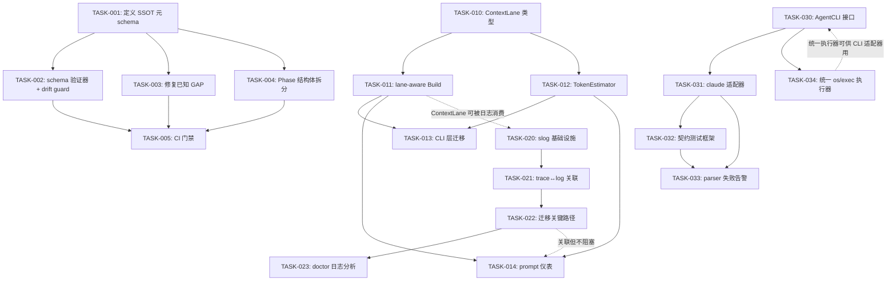
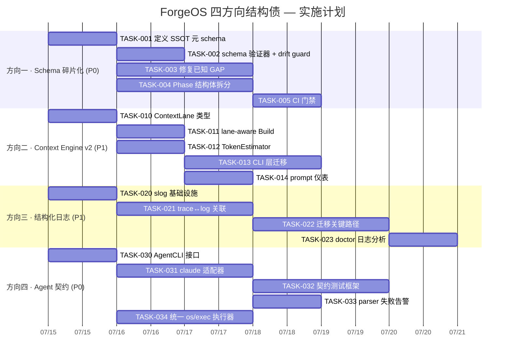

现在我开始撰写 Tech Lead 分析报告。

---

# Tech Lead 分析报告: ForgeOS 四方向结构债

> **基于**: `architect-product-perspective-four-structural-gaps.md` + 验证结果  
> **HEAD**: `b0c80e4` | **Go**: 1.26 (零外部依赖)  
> **日期**: 2026-07-12 | **角色**: Tech Lead

---

## 1. 任务分解

### 方向一 · Phase 结构体膨胀与 Schema 碎片化 (P0)

核心思路：引入**单一事实源 (SSOT)**——用一份权威 schema 定义 + 代码生成覆盖所有 6 个消费端，消除手动同步。

| ID | 标题 | 涉及文件 | 前置 | 工时 | 验收标准 |
|----|------|----------|------|------|----------|
| TASK-001 | **定义 Phase SSOT 元 schema** — 在 `internal/asset/` 下创建 `phaseschema.json` 或等效 Go 源码标注，描述每个字段的类型、JSON tag、消费端列表、版本 | `internal/asset/asset.go`, `internal/asset/phaseschema.go` **(新)** | 无 | 3h | 一份 JSON/YAML 文件精确描述了当前 40+ 字段的全部属性；所有消费端被列明 |
| TASK-002 | **构建 schema 验证器 + drift guard** — 写一个 `harness/` 中的 Python 或 Go 检查工具，读取 SSOT，验证 6 个消费端与 SSOT 一致 | `harness/schema-check.mjs` **(新)** | TASK-001 | 3h | 运行后如果任何一个消费端缺失对应字段则非零退出；通过当前 HEAD |
| TASK-003 | **修复已知 GAP: 补全零消费字段** — 对照 `FUNCTIONAL_REQUIREMENTS_AUDIT.md` 和 SSOT，补上 `requires_tools`, `readonly`, `secondary_template`, `blocking`, `confidence_metric` 失踪的消费端 | `internal/gate/resolve.go`, `internal/converge/converge.go`, `harness/check.py`, `cmd/forge/prompt_*.go` | TASK-001 | 4h | 每个字段至少有一个消费端读写；audit 中的对应 GAP 标记 Closed |
| TASK-004 | **Phase 结构体拆分: 职责分组** — 将 Phase 的~40 字段按职责拆分为内嵌子结构体: `Permission`, `Template`, `Dependency`, `GateConfig`, `Observability`，保持 JSON 反序列化兼容 | `internal/asset/asset.go` | TASK-001 | 4h | `type Phase struct` 不超过 8 个顶层字段；所有嵌套子结构体有独立单元测试；旧 workflow YAML 解析不受影响 |
| TASK-005 | **添加 CI 门禁** — 将 `schema-check.mjs` 纳入 `forge.yml` CI 管线，在 PR 合并前检查 schema 漂移 | `.github/workflows/forge.yml`, `harness/acceptance.mjs` | TASK-002 | 1h | schema 漂移的 PR 在 CI 中 FAIL |

**方向一小计**: 5 个任务 / 15h

---

### 方向二 · Context Engine v2: 结构化 Prompt 架构 (P1)

核心思路：不重写整个 prompt 系统，而是在内部建立**结构化 Context Lane 模型**，将字符串拼接替换为 lane 感知的构造器。

| ID | 标题 | 涉及文件 | 前置 | 工时 | 验收标准 |
|----|------|----------|------|------|----------|
| TASK-010 | **定义 ContextLane 结构化类型** — `LaneKind`, `LanePriority`, `ContextLane` struct，包含 kind/priority/content/tokenEstimate/metadata 字段 | `internal/prompt/lane.go` **(新)** | 无 | 2h | 类型定义清晰，支持序列化；所有 lane 类型枚举: task/adr/constraints/gate/memory/artifact |
| TASK-011 | **迁移 `Build` 为 lane-aware 构造器** — 重写 `prompt.Build()` 接收 `[]ContextLane`，按 priority 排序，注入时标注 lane 边界标记（XML 标签或 markdown 分隔） | `internal/prompt/prompt.go` | TASK-010 | 3h | 旧 `Build(agent,phase,mode,tier,card,ctx []string)` 签名保留 wrapper；新函数输出包含 lane 边界标记；全部现有测试通过 |
| TASK-012 | **实现 TokenEstimator** — 基于 `rune`→估计 token（slog 可用后可选接入 tiktoken 租用），提供每个 lane 的 token 消耗 + 总量告警 | `internal/prompt/token.go` **(新)** | TASK-010 | 3h | `TokenEstimate(lane) int` 可调用；累计 token 超过 `contextWindow * 0.85` 时产出 `warn` 回调 |
| TASK-013 | **迁移 CLI 层 lane 收集到结构化** — 重写 `cmd/forge/prompt_context.go` 中 `buildPrompt`，输出 `[]ContextLane` 而非 `[]string` | `cmd/forge/prompt_context.go`, `cmd/forge/prompt_memory.go`, `cmd/forge/prompt_artifacts.go` | TASK-011 | 4h | 每个 context lane 正确标注 kind/priority；gate result 带 priority 高于 memory；memory 按 recency 排序 |
| TASK-014 | **添加 prompt 内容仪表** — 在 trace 中记录每个 prompt 的 lane 构成和 token 消耗 | `internal/trace/trace.go`, `internal/prompt/prompt.go` | TASK-012 | 2h | 每次 `Build` 调用发出一个 trace event 包含 lane 构成摘要 |

**方向二小计**: 5 个任务 / 14h

---

### 方向三 · 结构化日志系统 (P1)

核心思路：利用 Go 1.26 标准库 `log/slog`（零外部依赖），在现有 `fmt.Printf`/`log.Printf` 旁建立并行日志通道，不破坏已有用户可见输出。

| ID | 标题 | 涉及文件 | 前置 | 工时 | 验收标准 |
|----|------|----------|------|------|----------|
| TASK-020 | **初始化 slog logger 基础设施** — 在 `internal/log/` 包创建 `NewFileLogger`/`NewConsoleLogger`，支持文件轮转、JSON 行输出、级别过滤；配置通过环境变量或 `.forge/config` | `internal/log/logger.go` **(新)**, `internal/log/handler.go` **(新)** | 无 | 3h | `slog.Info("msg", "key", val)` 工作；输出为 JSON 行；debug/info/warn/error 级别过滤；默认写入 `.forge/forge.log` |
| TASK-021 | **建立 trace↔log 关联** — trace.Event 增加 `LogID` 字段；在关键路径（迭代开始/结束、phase 启动、gate 裁决）同时写 trace + slog，共享 correlation ID | `internal/trace/trace.go`, `internal/orchestrator/*.go`, `internal/gate/gate.go` | TASK-020 | 4h | 每个 trace event 可用同一次运行的 log 文件按 correlation ID 关联定位 |
| TASK-022 | **迁移关键诊断路径** — 将 `cmd/forge/evolve.go`, `cmd/forge/engine_build.go`, `cmd/forge/cost.go` 中的 `fmt.Fprintf(os.Stderr, ...)` 和 `log.Printf` 替换为 `slog.*`（保留用户可见的 `fmt.Printf` 输出不变） | `cmd/forge/evolve.go`, `cmd/forge/engine_build.go`, `cmd/forge/cost.go`, `cmd/forge/main.go` | TASK-021 | 4h | 所有错误/警告路径使用结构化日志；用户可见输出 (forge status/validate) 继续使用 `fmt.Printf` |
| TASK-023 | **实现 doctor 日志分析** — `forge doctor` 增加 `--logs` 模式，读取 `.forge/forge.log`，按级别/模块/时间窗口过滤异常模式 | `internal/doctor/doctor.go`, `internal/doctor/log_analyzer.go` **(新)** | TASK-022 | 3h | `forge doctor --logs --since 1h` 输出结构化日志摘要；识别 `error` 级别事件簇 |

**方向三小计**: 4 个任务 / 14h

---

### 方向四 · 进程外 Agent 执行契约 (P0)

核心思路：引入**AgentCLI 接口层**——将 `os/exec.Command` + 字符串解析抽象为可测试的合约，提取 claude 适配器为接口实现之一。

| ID | 标题 | 涉及文件 | 前置 | 工时 | 验收标准 |
|----|------|----------|------|------|----------|
| TASK-030 | **定义 AgentCLI 接口** — `interface { Argv(prompt, model, opts) → []string; ParseOutput(stdout, stderr) → Result; ParseCost(output) → (Cost, bool); Name() string; Detect(output) → bool }` | `internal/agentcli/interface.go` **(新)** | 无 | 2h | 接口定义在 `internal/agentcli` 包；Result 包含 verdict/confidence/cost/error 字段 |
| TASK-031 | **提取 claude 适配器** — 从 `cmd/forge/engine_build.go:claudeArgv` 和 `cmd/forge/cost.go:parse*` 提取为 `ClaudeAdapter` 实现 `AgentCLI` 接口；保留现有行为 | `internal/agentcli/claude.go` **(新)**, `cmd/forge/engine_build.go`, `cmd/forge/cost.go` | TASK-030 | 4h | 原有 claude 调用路径无行为变化；所有 parser 在接口实现中；适配器通过现有 fake script 测试 |
| TASK-032 | **构建 parser 契约测试框架** — 创建 recording/replay 测试工具: 录制真实 claude 输出为 fixture，replay 时验证 parser 正确解析；添加格式版本探测（`Detect` 方法） | `internal/agentcli/fixture/` **(新目录)**, `internal/agentcli/contract_test.go` **(新)** | TASK-031 | 4h | 至少 3 个 fixture (成本/裁决/置信度)；`Detect("1.5.x")` 返回兼容性评分；parser 改变格式时 fixture 测试 FAIL |
| TASK-033 | **添加 parser 失败告警** — 当 `ParseCost`/`ParseOutput` 返回 `ok=false` 时，不再静默降级，而是: 发结构化日志告警(warn/error) + 写 trace event + 可选邮件/webhook 通知 | `internal/agentcli/claude.go`, `internal/agentcli/interface.go` | TASK-031 | 2h | `ok=false` 时触发 warn 日志 + trace event `kind=parse_failure`；静默降级归零 |
| TASK-034 | **统一 os/exec 执行器** — 将散落在 13 个文件中的 `os/exec.Command` 集中为 `internal/agentcli/executor.go`，提供超时/截断/重试/资源护栏的统一封装 | `internal/agentcli/executor.go` **(新)**, 逐个改造 13 个调用方 | TASK-030 | 4h | 所有 `os/exec.Command` 经过统一执行器；执行器提供超时 + cappedBuffer + 可配置重试 |

**方向四小计**: 5 个任务 / 16h

---

### 总体任务统计

| 方向 | 任务数 | 总工时 | 优先级 |
|------|--------|--------|--------|
| 方向一: Schema 碎片化 | 5 | 15h | P0 |
| 方向二: Context Engine v2 | 5 | 14h | P1 |
| 方向三: 结构化日志 | 4 | 14h | P1 |
| 方向四: Agent 契约 | 5 | 16h | P0 |
| **合计** | **19** | **59h** | |

---

## 2. 执行顺序

### 任务依赖图



### 可并行执行的组

```
Group A (独立, 立即开始):  TASK-001  TASK-010  TASK-020  TASK-030
Group B (依赖 A):          TASK-002  TASK-003  TASK-004  TASK-011  TASK-012  TASK-021  TASK-031  TASK-034
Group C (依赖 B):          TASK-005  TASK-013  TASK-014  TASK-022  TASK-032  TASK-033
Group D (依赖 C):          TASK-023
```

**方向间完全独立**——四个方向可以分配给四个不同的开发者并行推进。只有方向三的 `TASK-022` 与方向二的 `TASK-014` 有建议性关联（共用 trace 基础设施），但不阻塞。

---

## 3. 技术风险

### 3.1 高风险项

| # | 风险 | 方向 | 影响 | 概率 | 缓解策略 |
|---|------|------|------|------|----------|
| R1 | **Phase 结构体拆分破坏 JSON 反序列化兼容性** — 现有 workflow YAML→JSON pipeline 依赖 `json.Unmarshal` 直接射入 `Phase`。内嵌子结构体改变 JSON 扁平结构 | 方向一 | 高 — 破坏所有 workflow 加载 | 中 | 使用 `json.Unmarshal` 的 flatten 技巧: 子结构体不改变 JSON tag 路径；在每个子结构体上单独测试反序列化；灰度验证所有 `.agent/workflows/*.yml` |
| R2 | **`prompt.Build` 签名为公共 API** — 有外部调用者（harness 中的 Python shim、pipeline 脚本）依赖旧签名 | 方向二 | 中 — 需要兼容层 | 高 | 保留旧 `Build(agent, phase, mode, tier, card, ctx []string) string` 作为 wrapper，标记 `@Deprecated`，内部调用改为新函数 |
| R3 | **slog 引入后二进制体积与性能** — 虽然零外部依赖，但高频路径（如 trace.Emit）不可同步写日志 | 方向三 | 低 — 性能退化 | 低 | slog 的 `Handler` 接口支持异步；高频路径使用 `LogAttrs` 避免分配；添加 `--log-level` 运行时切换 |
| R4 | **claude CLI 输出格式无版本号** — parser 无法可靠检测版本变化，`Detect()` 方法可能误判 | 方向四 | 高 — 契约检测不可靠 | 高 | 启发式版本检测 (JSON envelope key 集合、`total_cost_usd` 字段类型)；fixture 测试覆盖已知版本；添加 `--agent-cli-version` 手动覆盖 |
| R5 | **13 个 os/exec 调用方迁移范围风险** — 每个调用方有不同的错误处理、超时、输出处理逻辑，统一执行器可能引入回归 | 方向四 | 高 — 回归面广 | 中 | 逐文件迁移，每个文件有独立测试；保留旧代码路径作为 fallback，加 feature flag 切换 |
| R6 | **方向一 + 方向四同时修改同一文件** — `harness/check.py` 分别在 TASK-003 和 TASK-004 中被修改 | 方向一/四 | 中 — 合并冲突 | 中 | 统一分配一个 owner 修改 `check.py`；或先完成方向一再改方向四 |

### 3.2 外部依赖与系统边界

- **零外部依赖红线**: 四个方向全部必须坚守。slog 是 Go 标准库的一部分（Go 1.21+），Go 1.26 完全支持。schema 验证器使用 `encoding/json` 和标准 `os/exec` 产生。不允许引入 zap/viper/protobuf/tiktoken。
- **Agent CLI 输出格式**: 这是方向四唯一的外部依赖——claude CLI 的输出格式不是 API。缓解: fixture-based 契约测试 + 版本探测 + 手动覆盖。
- **文件系统并发**: 方向三的日志文件可能被并行 phase 写入。slog `Handler` 自带锁，但需验证文件轮转的原子性。

### 3.3 性能瓶颈

| 瓶颈 | 方向 | 说明 | 优化策略 |
|------|------|------|----------|
| Phase JSON 反序列化 | 一 | 拆分后子结构体增加反序列化嵌套深度 | 使用 `json.RawMessage` 预处理，不走反射深嵌套 |
| Token 估算 | 二 | 每个 prompt 构建时扫描全部 ADR 做 TF-IDF 打分 | 缓存 ADR 标题索引；估算 O(n) 控制 n = ADR 数 |
| 日志写入 | 三 | 每次 trace.Emit 同步写磁盘 | async handler + 批量写入 (256ms 窗口或 50 条) |
| os/exec 进程创建 | 四 | 统一执行器增加调度开销 | 保留 `cmd.Start` 直调路径 (跳过多层抽象) |

---

## 4. 资源评估

### 4.1 人员需求

| 角色 | 所需技能 | 数量 | 负责方向 |
|------|----------|------|----------|
| **Go 高级工程师** | Go 1.26, 代码生成, 架构重构 | 2 人 | 方向一 (SSOT + 拆分) + 方向四 (接口设计) |
| **Go 全栈工程师** | slog, 日志系统, 测试框架 | 1 人 | 方向三 (日志) + 方向四 (执行器) |
| **Go/CLI 工程师** | prompt 工程, 上下文管理 | 1 人 | 方向二 (Context Engine v2) |
| **QA 工程师** | 契约测试, fixture 录制, CI 集成 | 1 人 (兼职) | 所有方向的测试 + CI 门禁 |

**建议**: 2 人全职投入 P0 方向 (一 + 四)，1 人全职投入 P1 方向 (二/三 选一个优先)，1 人兼职 QA。

### 4.2 关键里程碑

| 里程碑 | 时间 | 交付物 | 验收标准 |
|--------|------|--------|----------|
| **M1: 基础就绪** | Day 3 | TASK-001, TASK-010, TASK-020, TASK-030 完成 | 四个方向的基础接口/类型定义通过 code review |
| **M2: P0 核心** | Day 7 | TASK-002→TASK-004, TASK-031→TASK-034 完成 | schema 验证器运行通过；claude 适配器通过 fixture 测试 |
| **M3: P1 核心** | Day 11 | TASK-011→TASK-013, TASK-021→TASK-022 完成 | lane-aware Build 通过现有测试；结构化日志覆盖关键路径 |
| **M4: 集成发布** | Day 14 | TASK-005, TASK-014, TASK-023, TASK-033 完成 + 全量 `forge accept` 通过 | 完整 CI 门禁运行；无回归；旧 workflow 全部可工作 |

### 4.3 阻塞点 (Blocker) 与解决策略

| Blocker | 说明 | 策略 |
|---------|------|------|
| **B1**: Phase JSON 兼容性验证 | 拆分后所有现有 workflow 需要验证 | 自动化: 收集所有 `.agent/workflows/*.yml`，反序列化为旧/新 Phase，diff JSON 输出 |
| **B2**: claude CLI 输出格式缺少版本号 | 无版本号的契约无法可靠检测 | 上游不解决。我们加两层: (1) 启发式检测；(2) 用户声明 `--agent-cli-version` 手动覆盖。fixture 测试保底 |
| **B3**: slog 文件轮转和并发 | 24h+ 运行的日志文件可能巨大 | 内置按大小轮转 (100MB) + 按日期归档；使用 `io.Writer` 封装 |
| **B4**: 方向四统一执行器与现有调用方兼容 | 13 个调用方各有微妙差异 | 渐进式迁移: 先封装接口，内部调用方逐个适配，不一次性替换 |

---

## 5. 质量保证

### 5.1 单元测试覆盖要求

| 方向 | 关键测试目标 | 最低覆盖率 | 特别注意事项 |
|------|-------------|-----------|-------------|
| 一 | Phase JSON 序列化/反序列化 round-trip；SSOT 验证器对所有 6 个消费端的校验 | 90%+ | 每个字段至少一个测试用例包含 (JSON tag, yaml tag, consumer count) |
| 二 | ContextLane 排序和合并；TokenEstimator 边界 (空/中文/超长)；Build 兼容旧签名 | 85%+ | 测试 `adrTopK=6` 和 `taskCap=4000` 的截断行为 |
| 三 | slog Handler 输出格式验证；级别过滤；异步写入批量边界 | 80%+ | 使用 `bytes.Buffer` 作为测试 writer；验证 JSON 行有效性 |
| 四 | AgentCLI 接口的 fixture replay 测试；parser 对所有已知输出格式的解析；失败路径告警 | 90%+ | fixture 文件必须被版本控制；每次 claude 升级后录制新 fixture |

### 5.2 集成测试策略

```
层次 1: 单元测试 (每个 PR)
  ├─ Phase JSON round-trip + 旧 workflow 兼容
  ├─ ContextLane 排序 + Build 输出
  ├─ slog Handler format/level
  └─ AgentCLI fixture replay

层次 2: 组件集成 (每日)
  ├─ forge validate --all-workflows (验证 Phase 解析)
  ├─ forge doctor --logs (验证日志通路)
  └─ fake-agent run (mock CLI 验证适配器)

层次 3: 端到端 (每周)
  ├─ 真实 claude evolve --dry-run (验证完整管线)
  ├─ 多厂商: mock Codex/Gemini adapter
  └─ 24h evolve 模拟 (验证日志轮转 + trace 关联)
```

### 5.3 代码审查要点

| 方向 | Reviewer 重点关注 |
|------|-------------------|
| **一** | JSON 反序列化兼容性不破坏；SSOT 文件是否完整列出所有字段；drift guard 是否覆盖所有 6 个消费端 |
| **二** | 旧 `Build` 签名退化为 wrapper 且标记 Deprecated；lane 排序逻辑是否符合优先级语义；TokenEstimator 不引入外部依赖 |
| **三** | 用户可见 `fmt.Printf` 没有被误改为 slog；correlation ID 生成策略 (UUID vs 递增)；异步 handler 不丢日志 |
| **四** | `AgentCLI` 接口是否泛化足够支持 Codex/Gemini；fixture 测试是否覆盖失败路径；统一执行器的超时/截断行为与原有一致 |

### 5.4 性能测试需求

| 场景 | 方向 | 测试方法 | 通过标准 |
|------|------|----------|----------|
| Phase 加载 100 个 workflow | 一 | benchmark: 反序列化 100 次 | < 50ms (纯 CPU, 与当前持平) |
| Prompt Build 含 50 lane | 二 | benchmark: Build 含 50 lane + TokenEstimate | < 5ms (含排序) |
| 日志写入 10k 条/秒 | 三 | benchmark: async slog handler | < 100ms 落盘延迟 |
| Agent CLI 调用模拟 (1000 次) | 四 | benchmark: replay fixture | < 1s (不含子进程) |

---

## 6. 实施计划

### 甘特图



### 阶段详细时间表

#### 阶段 1: 基础设施搭建 (Day 1-3, 2026-07-15 ~ 2026-07-17)

| 日期 | 工作项 | 负责人 |
|------|--------|--------|
| D1 | Kickoff + 四人同步 SSOT 接口定义、ContextLane 类型、slog 配置、AgentCLI 接口 | 全员 |
| D1 | **TASK-001**: 阅读现有 asset.go Phase 定义，提取 SSOT JSON | Dev A |
| D1 | **TASK-010**: 定义 ContextLane struct + LaneKind/LanePriority 枚举 | Dev B |
| D1 | **TASK-020**: 创建 `internal/log/` 包，初始化 slog Handler | Dev C |
| D1 | **TASK-030**: 定义 AgentCLI interface + Result/Cost 类型 | Dev D |
| D2-3 | **TASK-002/003/004**: Dev A 并行开发 | Dev A |
| D2-3 | **TASK-011/012**: Dev B 实现 lane-aware Build + TokenEstimator | Dev B |
| D2-3 | **TASK-021**: Dev C 实现 trace↔log 关联 | Dev C |
| D2-3 | **TASK-031/034**: Dev D 提取 claude 适配器 + 统一执行器 | Dev D |

**阶段 1 完成标志**: 四个方向的基础接口 + 核心实现通过 code review，CI 通过。

#### 阶段 2: 核心功能实现 (Day 4-7, 2026-07-18 ~ 2026-07-21)

| 日期 | 工作项 | 负责人 |
|------|--------|--------|
| D4-5 | **TASK-003 延续**: 补全零消费字段 (gate/resolve/converge/check.py) | Dev A |
| D4-5 | **TASK-013**: 重写 `cmd/forge/prompt_context.go` → `[]ContextLane` | Dev B |
| D4-5 | **TASK-022**: 迁移 evolve/engine_build/cost/main 中的非结构化日志 | Dev C |
| D4-5 | **TASK-032**: fixture 录制 + 契约测试框架；完成 TASK-033 告警逻辑 | Dev D |
| D6-7 | **TASK-004**: Phase 结构体职责分组，子结构体拆分 | Dev A |
| D6-7 | **TASK-014**: prompt 仪表 trace event | Dev B |
| D6-7 | **TASK-022 延续**: 验证所有 `os.Stderr` 输出路径 | Dev C |
| D6-7 | **TASK-034 延续**: 逐文件迁移 13 个 `os/exec` 调用方 | Dev D |

**阶段 2 完成标志**: 所有 P0 功能开发完成；所有 P1 功能开发完成 80%+。

#### 阶段 3: 集成测试和优化 (Day 8-11, 2026-07-22 ~ 2026-07-25)

| 日期 | 工作项 | 负责人 |
|------|--------|--------|
| D8-9 | 全量回归测试: `forge accept` 通过；所有 workflow YAML 解析验证 | QA + 全员 |
| D8-9 | 性能测试: Phase 加载 benchmark、prompt Build benchmark | Dev B |
| D10-11 | claude CLI 输出 fixture 录制 + 跨版本兼容性验证 | Dev D |
| D10-11 | 日志系统 24h 模拟测试 → 轮转 + 防丢 | Dev C |
| D10-11 | `TASK-005`: CI 门禁集成 (drift guard 加入 forge.yml) | Dev A |

**阶段 3 完成标志**: 性能测试通过；方向一 + 方向四的 CI 门禁在 pipeline 中运行；阶段 2 发现的回归全部修复。

#### 阶段 4: 发布准备 (Day 12-14, 2026-07-26 ~ 2026-07-28)

| 日期 | 工作项 | 负责人 |
|------|--------|--------|
| D12 | 文档更新: ARCHITECTURE.md 中的 Context Engine 描述；AGENTS.md 中的 schema 管理规则 | Dev B |
| D12 | CHANGELOG 条目: 每个方向标注新引入的包/接口/行为变化 | Dev A |
| D13 | 演示: 向团队演示四个方向的成果 | 全员 |
| D13-14 | 冒烟测试 + 回滚计划准备 | QA |
| D14 | 全量 `forge accept` 最终通过 → 合并到主干 | 全员 |

**阶段 4 完成标志**: PR 合并；文档和 CHANGELOG 完成；无 blocker 级别问题。

---

## 7. 附: 建议的执行策略

### 7.1 "先止血，再根治" 策略

对于 P0 方向（一和四），建议用 **2 天止血**再开始根治性重构:

- **止血 (Day 1)**: 在 `harness/check.py` 中添加一个快速检查脚本，扫描所有 6 个消费端与 Phase struct 的字段匹配——阻塞后续 PR 引入新的 schema 漂移。这只需要几十行 Python，是 TASK-002 的 MVP 版本。
- **止血 (Day 1)**: 在 `cmd/forge/cost.go` 的 parser 失败路径中添加 `fmt.Fprintf(os.Stderr, "[WARN] cost parser failed\n")`——结束静默降级。这是 TASK-033 的 MVP 版本。
- **随后根治**: 按上述完整任务清单推进。

### 7.2 方向选择建议

如果资源有限（只能选 2 人），建议:

```
优先级: 方向一 (P0) > 方向四 (P0) > 方向三 (P1) > 方向二 (P1)
```

**理由**: 方向一的 schema 碎片化直接影响**每 sprint 的开发速度**——每加一个字段改 6 个文件是持续出血。方向四的 `os/exec` + 字符串解析是**集成层的结构脆弱性**——一旦 claude CLI 输出格式变化，静默数据丢失。方向三和二是运营/架构的天花板问题——在遇到真实排障瓶颈或 token 预算需求前可以暂缓。

### 7.3 遗留风险和后续建议

这四个方向完成后，以下问题仍然存在（不在本次 Scope 内）:

1. **CLI 层 vs 核心层职责倒置** — `cmd/forge/prompt_context.go` (454 行) 是 `internal/prompt/prompt.go` (59 行有效) 的 7x，方向二修复了一部分但未解决整体层间倒置。
2. **Go 零依赖带来的限制** — 不能引入 OpenAPI codegen、protobuf、tiktoken，schema 管理和 token 估算需要手写。
3. **多 Agent CLI 适配** — 方向四定义了接口但只适配了 claude；Codex/Gemini 适配是后续工作。
4. **`FUNCTIONAL_REQUIREMENTS_AUDIT` 中的其他 GAP** — schema 碎片化 GAP 解决了，但其他类别 GAP 需后续处理。

---

*分析结束。建议在 PR 合并前评审的检查项: `forge accept` 完整通过、所有 `.agent/workflows/*.yml` 解析一致、claude fixture replay 测试通过、slog 日志无 `fmt.Printf` 遗漏。*
