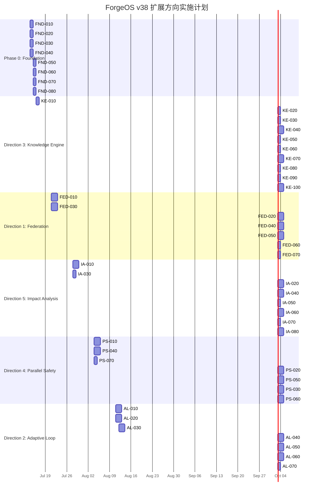

Now I have a thorough understanding of the codebase and all reference documents. Let me produce the comprehensive Tech Lead analysis.

---

# Tech Lead 分析报告：v38 高价值扩展方向

## 0. 分析范围与方法

**输入来源：**
- `docs/requirements/v38-extension-analysis.md`（原始分析）
- `.agent/CURRENT_SPRINT.md`（Sprint 1-31 完整历史）
- `.agent/ARCHITECTURE.md`（架构脊柱与引擎清单）
- `docs/FUNCTIONAL_REQUIREMENTS_AUDIT.md`（功能缺口审计 + Sprint 31 二轮复审）
- `docs/adr/0003-agent-os-repo-extraction.md`（治理联邦设计基础）
- 经 review 校正后的五个方向优先级与成本估计

**本报告资产：**
1. 任务分解表（52 个可执行任务）
2. 依赖图（Mermaid 语法，含并行组标注）
3. 技术风险矩阵
4. 资源需求与里程碑
5. 质量保证方案
6. 阶段化实施计划

---

## 1. 任务分解

### 1.1 阶段 0：Foundation — 审计缺口收口与系统加固

**状态：当前 Sprint 31 已部分完成，但需确认 closure verify。**

| 任务 ID | 标题 | 涉及文件 | 前置依赖 | 工时(h) | 验收标准 |
|---|---|---|---|---|---|
| FND-010 | `readonly` 路径强制 — argv 注入单测覆盖 | `forge-core/cmd/forge/engine_build.go`, `command_executor.go`, `engin_build_test.go` | 无 | 3 | read-only phase 的 `claudeArgv` 含 `disallowedTools` + 按 agent card 产出目录的 `allowedTools`；20+ 精确 argv 断言；无真 claude 进程依赖 |
| FND-020 | `on_rejected` 线下验证 — marker 语义 full-path walkthrough | `forge-core/cmd/forge/evolve.go`, `orchestrator/loop.go`, `loop_test.go` | 无 | 2 | 独立复现：建 binary → 写 `.forge/<stage>.rejected` → 跑 `forge run` 确认 narration 恰好 1 次 → marker 消失 → 第三次跑默认 phase 0 |
| FND-030 | `blocking:` 字段镀金论证 — 确认为 final answer | 仅文档 | 无 | 1 | 全仓 grep 确认零 `blocking: false` 使用者，注释标明 REJECTED（镀金）理由，更新 audit resolution |
| FND-040 | `confidence_metric:` 字段驱动 — workflow 扫描 + 测试 | `forge-core/cmd/forge/gates.go`, `asset.go`, `gates_test.go` | 无 | 3 | `requirementConfidence` 扫 `wf.Phases` 找 `ConfidenceMetric` 声明者；回归测试对 discover.yml 零行为变化；第二测试证明改名 phase 被正确拾取 |
| FND-050 | `mode_gating:` 漂移守卫 harness 迁移 + 自测 | `harness/check.py`, `harness/mode_gating_check.py` | 无 | 2 | 两个新增 harness 文件入 `forge-init` COPIED_FILES 清单；`forge accept` 仍 ACCEPTED |
| FND-060 | `secondary_template` 全链路一致性审计 | `forge-core/cmd/forge/prompt_artifacts.go`, `doctor/models.go` | 无 | 2 | `uses_template` 的每个消费点有对称的 `secondary_template` 消费；`forge validate --models` 产出 PASS 行 |
| FND-070 | yaml2json 裸 `-` 序列项修复 + 回归 | `forge-core/internal/yaml2json/sequence.go`, `yaml2json_test.go` | 无 | 2 | `parseSeqItem` 空分支统一 append；新增测试覆盖 nil 项；7 个真实 YAML 文件零影响 |
| FND-080 | ADR 勘误 + forge-ai 推迟措辞补全 | `docs/adr/0002-go-core-polyglot-stack.md`, `docs/adr/0004-review-stage-ai-sdlc-integration.md` | 无 | 1 | ADR-0004 加 `corrected 2026-07-02` 勘误；ADR-0002 加 Python deferral text |

**阶段 0 总计：16 小时（2 天）**

---

### 1.2 方向三：知识引擎与语义检索（Knowledge Engine）

**调整后优先级：1 — 最低成本 + 最高架构完整性收益**

| 任务 ID | 标题 | 涉及文件 | 前置依赖 | 工时(h) | 验收标准 |
|---|---|---|---|---|---|
| KE-010 | `internal/knowledge` 包骨架 + TF-IDF doc/term 模型 | `forge-core/internal/knowledge/knowledge.go`, `knowledge_test.go` | FND-xxx (无硬依赖) | 3 | 包 `go build` 干净；`Document` + `Term` + `Index` 类型定义；零外部依赖 |
| KE-020 | Tokenizer：空格/标点切分 + 小写 + StopWords 过滤 | `forge-core/internal/knowledge/tokenizer.go`, `tokenizer_test.go` | KE-010 | 2 | 英文 stop words 列表（~150 词）；`Tokenize("Hello World!")` → `["hello", "world"]`；纯 stdlib `strings`/`unicode` |
| KE-030 | TF 计算 + IDF 倒排索引构建 | `forge-core/internal/knowledge/tfidf.go`, `tfidf_test.go` | KE-020 | 3 | `ComputeTF(doc)` 返回 term→freq 映射；`BuildIDF(docs)` 填写 df 倒排；index 序列化为可持久化结构 |
| KE-040 | Top-K 检索器：余弦相似度 + heap 截断 | `forge-core/internal/knowledge/retriever.go`, `retriever_test.go` | KE-030 | 3 | `Retrieve(query, k)` 返回 top-K `(DocumentID, Score)`；使用 `container/heap`；检索引擎独立于 storage |
| KE-050 | Memory 后端适配器：从 `internal/memory` 批量构建索引 | `forge-core/internal/knowledge/memory_adapter.go`, `adapter_test.go` | KE-040, Memory-Engine(已有) | 2 | `BuildFromMemory(memStore)` 读取全部 memory entries；增量更新 `UpdateOnAppend(entry)` 复用 `invalidateLoadCache` 模式 |
| KE-060 | ADR + Agent 卡文档源适配器 | `forge-core/internal/knowledge/asset_adapter.go` | KE-040 | 2 | `BuildFromADRs(path)` 读取 `docs/adr/*.md`；`BuildFromAgentCards(path)` 读取 `.agent/agents/*.md`；各自一个索引子集 |
| KE-070 | `knowledgeCap` 注入到 `prompt_context.go` | `forge-core/cmd/forge/prompt_context.go`, `prompt_context_test.go` | KE-050, KE-060 | 3 | `retrieveKnowledge(ctx, query, cap)` → top-K 截断；`buildPrompt` 多 lane 注入加 knowledge lane；`knowledgeCap` 复用 `memoryCap=32` 模式 |
| KE-080 | 增量索引更新：`memory.Append` → `index.Update` | `forge-core/internal/knowledge/index.go`, `memory.go` 更新 | KE-050 | 3 | `Append` 写入后调用 `knowledge.Index.Update(entry)`；全量重建仅初始化一次；mid-session 更新不在 I/O 热路径 |
| KE-090 | 集成测试：fake entries → retrieve → relevance | `forge-core/internal/knowledge/integration_test.go` | KE-070, KE-080 | 2 | 写入 20 条 fake memory entry → 查询关键词 → top-3 中至少 2 条语义相关；验证 `knowledgeCap` 截断生效 |
| KE-100 | `forge run/evolve` 知识注入 pathway e2e | `forge-core/cmd/forge/engine_build.go`, 集成测试 | KE-070, KE-090 | 3 | `--enable-knowledge` flag（默认 off，向后兼容）；开启后 `evolve` 第二轮 agent prompt 含知识 lane；`forge accept` 仍 ACCEPTED |

**方向三总计：26 小时（3.25 天）**

---

### 1.3 方向一：多项目治理联邦（Federation Governance）

**调整后优先级：2 — ADR-0003 设计已就绪，边际成本低于预期**

| 任务 ID | 标题 | 涉及文件 | 前置依赖 | 工时(h) | 验收标准 |
|---|---|---|---|---|---|
| FED-010 | `FORGE_PROJECT_ROOT` 环境变量引入 + harness 路径改造 | `harness/acceptance-kernel.mjs`, `arch-check.mjs`, `secret-scan.mjs`, `sca.mjs`, `gate.mjs` | 无 | 4 | 各工具 `ROOT` 改为 `process.env.FORGE_PROJECT_ROOT ?? process.cwd()`；`acceptance.mjs` test-glob 改为 `HARNESS_DIR` 绝对 glob；向后兼容（未设变量时行为不变） |
| FED-020 | ADR-0003 阶段 A：本地 bare repo 原型 | `harness/scaffold/forge-init.mjs`（新增 `--submodule` 模式） | FED-010 | 4 | `file://` 本地 bare repo 作 submodule 源；`forge-init --submodule` 执行 `git submodule add` + 仅生成项目覆盖文件；`test_forge-init.mjs` 覆盖 submodule 模式 |
| FED-030 | PolicyStack 解析链：org → team → project | `forge-core/internal/mode/mode.go`, `mode_policy.go`, `mode_test.go` | 无 | 3 | `PolicyStack` 类型（`[]Policy` 按优先级降序）；`Effective(org, team, project)` 合并规则（stricter-wins）；测试验证只收紧不放松原则 |
| FED-040 | git submodule 的 `agent-os` 全局基底读取 | `forge-core/internal/mode/agent_os_loader.go`（新增） | FED-030 | 3 | 从 submodule 路径读 `policies.yml` + `modes.yml` + `rules.yaml`；缺失时诚实降级（不假设有 submodule）；`gate.RepoRoot` 改可指定子目录 |
| FED-050 | monorepo 子项目边界扫描 | `forge-core/internal/mode/project_scope.go`（新增） | FED-040 | 3 | `project.yml` 的 `scope.paths` 声明子项目路径集；`walk()` 按 scope 过滤扫描范围；`forge run --project=services/gateway` 只跑该 scope gate |
| FED-060 | `forge-init` copy-anywhere + 自测同步 | `harness/scaffold/forge-init.mjs`, `test_forge-init.mjs` | FED-020 | 2 | 新添加的所有 harness 文件在 `COPIED_FILES` 清单中；submodule 模式的自测独立于 copy 模式的 baseline |
| FED-070 | Drift guard：policy 继承链一致性校验 | `harness/check.py` 新增 `check_policy_inheritance` | FED-030 | 2 | 对比 agent-os 基线 vs 项目覆盖：不允许覆盖 strictness/warn→block→block 合法、block→warn 告警；测试覆盖三种 case |

**方向一总计：21 小时（2.6 天）**

---

### 1.4 方向五：自动变更影响分析与智能门控（Impact Analysis）

**调整后优先级：3 — 产品价值最高，但需知识引擎支撑检索**

| 任务 ID | 标题 | 涉及文件 | 前置依赖 | 工时(h) | 验收标准 |
|---|---|---|---|---|---|
| IA-010 | Go AST 函数引用扫描器（同一包内） | `forge-core/internal/risk/ast_scan.go`（新增）, `ast_scan_test.go` | 无 | 4 | `go/parser` + `go/ast` 解析 `.go` 文件；`ExtractFunctionCalls(src)` 返回被调用函数名列表；包内精度 >90%（文件路径子串启发式作为对比基线） |
| IA-020 | 跨包调用链加速：import 解析 + 跨文件引用 | `forge-core/internal/risk/call_chain.go`（新增） | IA-010 | 3 | 解析 `import` 路径；同一包内跨文件调用链（不跨包，避 `go/types` 依赖）；`BlastRadius(file)` 返回该文件函数可达函数数 |
| IA-030 | `gatesFor` 集成 risk-level 参数 | `forge-core/internal/orchestrator/mode_gating.go`, `mode_gating_test.go` | 无 | 2 | `gatesFor` 新增 `riskLevel` 参数；低 risk → 只跑 lint+test（同 current safety floor）；不确定性→fallback 全量（fail-open for gate bypass） |
| IA-040 | `FromChangedPaths` 增强：AST 辅助可信度加权 | `forge-core/internal/risk/risk_diff.go`, `risk_diff_test.go` | IA-010 | 3 | 文件路径子串仍是主策略；AST 扫描结果作为 `confidence` 权重（0-1）；从不降低现有启发式结果（只升高不降低） |
| IA-050 | BlastRadius 缓存层 | `forge-core/internal/risk/blast_cache.go`, `blast_cache_test.go` | IA-020 | 2 | map `filepath → BlastRadius` + mtime 校验；避免每次 `forge run` 重复扫描整个 AST；老化为 1h TTL（configurable） |
| IA-060 | `forge route --diff-files` 接入 AST 分析（v1） | `forge-core/cmd/forge/route.go`, `route_test.go` | IA-040, IA-050 | 3 | `--diff-files` 标志读文件内容而非仅路径；影响分析结果注入 `Signals.ImpactBlastRadius`；`forge route` 输出包含 AST 辅助标记 |
| IA-070 | fallback honesty：不确定性→全量 review + trace 记录 | `forge-core/cmd/forge/prompt_context.go`, `trace.go` | IA-030 | 2 | `canAssessRisk(blastRadius, confidence)` → `uncertain` 时跳过 gate bypass；trace 记录 `gate_bypass=uncertain-unknown`；与已有 `"rather miss than mis-fire"` 原则一致 |
| IA-080 | 集成测试：真实改动→gate 子集裁剪 | `forge-core/internal/risk/integration_test.go` | IA-060, IA-070 | 3 | 构造 3 个 git diff（低风险 typo / 中风险模块改动 / 高风险 auth 改动）→ gate 子集验证；低风险跳安全 review、高风险全量 |

**方向五总计：22 小时（2.75 天）**

---

### 1.5 方向四：生产级并行安全网（Parallel Safety）

**调整后优先级：4 — 成本估计上调至 3-4 周**

| 任务 ID | 标题 | 涉及文件 | 前置依赖 | 工时(h) | 验收标准 |
|---|---|---|---|---|---|
| PS-010 | `route.go` 中 `runBudget.feed` 竞态修复 | `forge-core/cmd/forge/cost.go`, `orchestrator/budget.go`, `orchestrator/route.go` | 无 | 3 | `runBudget.feed` 加 `mu.Lock()`（`cost.go` 已有锁但此路径需同步）；`go test -race` 并行 phase 全绿；Tracing 现有 `budget.mu.Lock()` 不变 |
| PS-020 | per-phase timeout 隔离 | `forge-core/internal/orchestrator/parallel.go`, `orchestrator.go` | 无 | 4 | 每个波内 phase 获取独立 `context.WithTimeout(childCtx, perPhaseTimeout)`；一个 phase 超时不 cancel 同波其余 phase；`--per-phase-timeout` flag（默认继承 `--timeout`） |
| PS-030 | goroutine 限流 semaphore | `forge-core/internal/orchestrator/parallel.go`, `parallel_test.go` | PS-020 | 3 | `chan struct{}` semaphore（默认 cap = runtime.NumCPU()）；`--parallel-max` flag 可配；`RunParallel` 在 produce wave 前 acquire；单一 phase 不撑爆 |
| PS-040 | per-wave checkpoint | `forge-core/internal/persist/checkpoint.go`, `evolve.go`, `parallel.go` | 无 | 4 | `WaveDone` 回调时机写 checkpoint（`trace.EmitWithSeq` 时获得 Seq）；并行模式下 checkpoint 含 wave index 而非 phase index；crash→resume 从最近的 completed wave 恢复 |
| PS-050 | Proportional budget allocation | `forge-core/internal/orchestrator/budget.go`, `budget.go` 并行路径 | PS-010 | 4 | 预算分配算法：`perPhaseBudget = remainingBudget / wavePhaseCount`；phase 耗尽自己的份额后停但 cancel 同波其他 phase；`BudgetExhausted` 改 per-phase（非全局 engine-level） |
| PS-060 | Wave-level retry + `WaveResult` 类型 | `forge-core/internal/orchestrator/parallel.go`, `waves.go`, `backoff.go` | PS-040 | 3 | 新 `WaveResult` 类型（phase 成功列表 + 失败信息）；`overloadBackoff` 重试整个波但保留已成功 phase 结果；`FailFast` 模式兼容（向后兼容） |
| PS-070 | Graceful degradation：无 depends_on → public warning | `forge-core/internal/orchestrator/parallel.go`, `parallel_test.go` | 无 | 2 | `RunParallel` 检查所有 phase 的 `depends_on`；若全为空且未声明 `parallel: true`，输出 WARNING + 走串行；不静默降级 |

**方向四总计：23 小时（2.9 天）**

---

### 1.6 方向二：自适应循环组装（Adaptive Loop Assembly）

**调整后优先级：5 — 复杂度最高 + 前置条件最多**

| 任务 ID | 标题 | 涉及文件 | 前置依赖 | 工时(h) | 验收标准 |
|---|---|---|---|---|---|
| AL-010 | Stop system 加固：`on_rejected` 全路径可达性 | `forge-core/internal/orchestrator/loop.go`, `evolve.go`, `main.go` | FND-020 | 3 | `forge evolve` 不拒绝 human_gate 路径（当前 fail-closed）；`forge run` 能触发 `LoopEngine`（当前单趟）；`on_rejected` 的 `target_phase` 真变化 |
| AL-020 | Phase precondition gate 契约声明 | `forge-core/internal/asset/asset.go`（新增 `Preconditions` 字段） | 无 | 3 | `Phase.Preconditions` []string（如 `"gates.all_green"`, `"confidence > 80"`）；`asset_test.go` 验证解析；向后兼容（空列表=无 precondition） |
| AL-030 | `internal/composer` 包骨架 + profile 类型 | `forge-core/internal/composer/composer.go`, `composer_test.go` | 无 | 3 | `Profile` 类型（lang/生命周期/测试有无/CI 有无/模式）；`Classify(scanResult)` 输出 profile；与 `internal/mode` 职责分离 |
| AL-040 | Profile → phase 列表映射 | `forge-core/internal/composer/assembly.go`, `assembly_test.go` | AL-030 | 4 | `Assemble(profile, stage)` → `[]Phase`；profile 决定 run 哪些阶段（发现 gap → 插入 architecture-review；缺测试 → 插入 test-backfill）；phase 依赖由 `Preconditions` 表达式驱动 |
| AL-050 | Dynamic stop_condition 组合子 | `forge-core/internal/composer/stop.go`, `stop_test.go` | AL-040 | 3 | `StopCondition` 的 AND/OR/THRESHOLD 组合子；`Evaluate(stop, signals)` 支持嵌套组合；`forge evolve` 的 stop_condition 改从 composer 生成而非 hardcoded |
| AL-060 | `forge detect` → composer 管线接线 | `forge-core/cmd/forge/detect.go`, `engine_build.go` | AL-040, AL-050 | 3 | `forge detect` 输出 profile 传给 `composer.Assemble`；composer 结果写进 `EngineConfig`；mode-gating 优先（mode 说"应该多深"覆盖 composer 说"应该跑哪些"） |
| AL-070 | Trace-based audit trail for dynamic phases | `forge-core/internal/trace/trace.go`, `composer.go` | AL-060 | 2 | `forge run` 在启动前 emit `composition_plan` trace event（含 selected phases + 理由）；每一轮都记录，不可静默改变 |

**方向二总计：21 小时（2.6 天）**

---

## 2. 执行顺序

### 2.1 整体依赖图

```mermaid
graph TD
    %% Foundation Phase
    subgraph "Phase 0: Foundation (Week 1)"
        FND_010["FND-010: readonly argv 注入"]
        FND_020["FND-020: on_rejected marker 验证"]
        FND_030["FND-030: blocking 镀金论证"]
        FND_040["FND-040: confidence_metric 驱动"]
        FND_050["FND-050: mode_gating 漂移守卫"]
        FND_060["FND-060: secondary_template 审计"]
        FND_070["FND-070: yaml2json 序列项修复"]
        FND_080["FND-080: ADR 勘误 + 推迟措辞"]

        FND_030 --- FND_010
        FND_030 --- FND_020
    end

    %% Direction 3: Knowledge Engine
    subgraph "Direction 3: Knowledge Engine (Week 2-3)"
        KE_010["KE-010: knowledge 包骨架+TF-IDF模型"]
        KE_010 --> KE_020["KE-020: Tokenizer+StopWords"]
        KE_020 --> KE_030["KE-030: TF计算+IDF构建"]
        KE_030 --> KE_040["KE-040: Top-K检索器(heap)"]
        KE_040 --> KE_050["KE-050: Memory后端适配器"]
        KE_040 --> KE_060["KE-060: ADR+Agent卡适配器"]
        KE_050 --> KE_070["KE-070: knowledgeCap注入prompt"]
        KE_050 --> KE_080["KE-080: 增量索引更新"]
        KE_070 --> KE_090["KE-090: 集成测试"]
        KE_070 --> KE_100["KE-100: forge run/evolve pathway"]
    end

    %% Direction 1: Federation
    subgraph "Direction 1: Federation (Week 3-4)"
        FED_010["FED-010: FORGE_PROJECT_ROOT路径改造"]
        FED_030["FED-030: PolicyStack解析链"]
        FED_010 --> FED_020["FED-020: ADR-0003阶段A: bare repo原型"]
        FED_030 --> FED_040["FED-040: agent-os submodule加载器"]
        FED_040 --> FED_050["FED-050: monorepo子项目边界"]
        FED_020 --> FED_060["FED-060: forge-init copy-anywhere同步"]
        FED_030 --> FED_070["FED-070: 继承链drift guard"]
    end

    %% Direction 5: Impact Analysis
    subgraph "Direction 5: Impact Analysis (Week 4-5)"
        IA_010["IA-010: AST函数引用扫描器"]
        IA_010 --> IA_020["IA-020: 跨包调用链加速"]
        IA_010 --> IA_040["IA-040: FromChangedPaths增强"]
        IA_020 --> IA_050["IA-050: BlastRadius缓存"]
        IA_030["IA-030: gatesFor risk-level集成"]
        IA_040 --> IA_060["IA-060: forge route --diff-files接入"]
        IA_030 --> IA_070["IA-070: fallback honesty"]
        IA_060 --> IA_080["IA-080: 集成测试"]
    end

    %% Direction 4: Parallel Safety
    subgraph "Direction 4: Parallel Safety (Week 5-6)"
        PS_010["PS-010: route.go feed竞态修复"]
        PS_010 --> PS_020["PS-020: per-phase timeout隔离"]
        PS_020 --> PS_030["PS-030: goroutine限流semaphore"]
        PS_040["PS-040: per-wave checkpoint"]
        PS_040 --> PS_060["PS-060: Wave-level retry"]
        PS_010 --> PS_050["PS-050: Proportional budget"]
        PS_070["PS-070: Graceful degradation"]
    end

    %% Direction 2: Adaptive Loop
    subgraph "Direction 2: Adaptive Loop (Week 7-8)"
        FND_020 --> AL_010["AL-010: stop系统加固"]
        AL_020["AL-020: Phase precondition契约"]
        AL_030["AL-030: composer包骨架"]
        AL_030 --> AL_040["AL-040: Profile→phase映射"]
        AL_030 --> AL_050["AL-050: Dynamic stop组合子"]
        AL_040 --> AL_060["AL-060: detect→composer管线"]
        AL_060 --> AL_070["AL-070: Trace audit trail"]
    end

    %% Cross-direction dependencies
    KE_070 --> IA_040["IA-040 依赖知识检索"]
    FND_020 --> AL_010["AL-010 复用 on_rejected 成果"]
```



### 2.2 可并行执行的任务组

```
Group A (Phase 0 Foundation, 全并行):
  FND-010, FND-020, FND-030, FND-040, FND-050, FND-060, FND-070, FND-080

Group B1 (KE independent foundation):
  KE-010 → KE-020 → KE-030 → KE-040 (串行链)

Group B2 (KE adapters, 可并行于 B1 后期):
  KE-050, KE-060

Group C1 (FED path + policy):
  FED-010, FED-030 (独立可并行, 串联各自的子任务)

Group D1 (IA AST foundation):
  IA-010 → IA-020 (串行链)

Group D2 (IA gate + routing, 独立可并行于 D1):
  IA-030

Group E1 (PS race + budget, 独立):
  PS-010 → PS-050

Group E2 (PS timeout + semaphore, 可并行于 E1):
  PS-020 → PS-030

Group E3 (PS checkpoint + retry, 可并行于 E1):
  PS-040 → PS-060

Group F1 (AL composer foundation):
  AL-030 → AL-040, AL-050 (串行)
```

---

## 3. 技术风险

### 3.1 风险矩阵

| 风险 ID | 描述 | 影响 | 概率 | 缓解策略 |
|---|---|---|---|---|
| **R-IA-01** | Go AST 精度不足：无 `go/types` 无法解析跨包类型，`auth.Login()` vs `internal/auth.Login()` 不可区分 | IA-020 跨包调用链仅限启发式，不精确 | **高** | v1 目标明确从「精确调用图」降级为「提高 signal-to-noise ratio」；诚实标注误差边界；fallback design 确保误判不导致漏放风险 |
| **R-IA-02** | 假阴性导致高风险变更被门控跳过 | 安全漏洞 | **极低**（设计原则：当不确定时走全量 review） | IA-070 的 `canAssessRisk` 守卫：confidence 不足时返回 `uncertain` → 全量 gate + trace 记录；productions lifecycle 一票否决覆盖一切效率优化 |
| **R-KE-01** | TF-IDF 检索质量在项目专名密集场景下不够好 | 检索结果噪声高，agent 忽略知识 lane | **中** | v1 目标为「比精确匹配好」，不要求完美；Top-K 自带 `knowledgeCap` 截断；最相关的 3 条通常足够；需建立 relevance benchmark |
| **R-KE-02** | 增量索引更新在高频 `memory.Append` 下性能退化 | `Append` → 全量重建索引的竞争 | **低** | Task KE-080 设计增量 update，非全量重建；`invalidateLoadCache()` 模式已有先例；可配置最小重建间隔 |
| **R-FED-01** | `FORGE_PROJECT_ROOT` 改造触碰 harness 执法热路径，改坏即假绿 | 所有 gate 输出错误 | **高** | FED-010 要求向后兼容（env unset → 原行为不变）；每个工具单独测试 env set/unset 两种状态；CI 双面验证 |
| **R-FED-02** | Submodule detached-HEAD 税 + CI 漏 `submodules: recursive` | 新项目 CI 假绿（跑旧版治理） | **中** | `forge-init` 生成的 README + CI 模板显式处理 submodule checkout；`forge-init` 自测检测 submodule 是否存在 |
| **R-PS-01** | 锁顺序维护成本：新加 mutex 破坏现有 LOCK ORDER CONTRACT | 死锁 | **中** | PS-010 需显式扩展 `parallel.go` 的锁顺序文档；新增 mutex 必须在现有顺序之后；`go test -race` 作为 CI 闸门 |
| **R-PS-02** | Proportional budget 分配在 0/0（空 phase）或除零时 panic | 运行时 crash | **低** | 空 phase 列表不进入并行路径；除零 guard；已有 `budget.go` 的零值处理模式 |
| **R-PS-03** | Wave checkpoint 在并行中断后同 phase 被重复执行 | 不一定是正确性风险，但可能浪费成本 | **低** | 当前 checkpoint 设计已承认此限制（comment: "in-flight phase re-runs once on crash mid-phase"）；wave checkpoint 不改进此语义，只改检查点粒度 |
| **R-AL-01** | Dynamic stop_condition 组合子与现有 `conjunctions` 不兼容 | 收敛判定在混合条件下歧义 | **中** | `composer.StopCondition` 先序列化为当前 `conjunctions` 的子集；AND/OR/THRESHOLD 组合子作为新类型，不与 type conjunction 混合 |
| **R-AL-02** | Precondition gate 声明导致「条件地狱」——phase 注入条件循环依赖 | DAG 构建不可用 | **中** | `composer.Assemble` 使用拓扑排序检测循环；循环依赖在起跑前 fail-loud（而非运行时 deadlock） |

### 3.2 关键不确定性

| 不确定性 | 涉及方向 | 解决方式 |
|---|---|---|
| TF-IDF 在 ForgeOS 项目上的实际检索质量 | KE | 建立 benchmark（~20 条已知 query→expected result），KE-090 集成测试量化；若 precision<60%，考虑追加 `bigram` tokenizer（纯 stdlib） |
| Go AST v1 的误诊率（false positive rate） | IA | 在真实 git 历史 sample（~10 commits）上测量路径启发式 vs AST 增强版的 recall/precision；阈值调参 |
| Submodule 的团队接受度 | FED | ADR-0003 诚实反方已记录；阶段 A（本地可逆）不对消费者产生不可逆影响；阶段 B 需用户明确决策 |
| 并行加速的实际收益（Amdahl's law 瓶颈） | PS | `forge run` 在真实 workflow 上测量并行 vs 串行加速比；如果 90% 时间花在串行 agent 调用上，并行收益有限；`--parallel` 保持 opt-in |

---

## 4. 资源评估

### 4.1 团队配置

| 角色 | 技能要求 | 数量 | 职责 |
|---|---|---|---|
| Platform 工程师 | Go 熟练（goroutine/race detector/AST），熟悉 stdlib 约束 | 2 | KE, PS, IA 核心实现；包结构设计；集成测试 |
| Tools 工程师 | Node.js/Python，harness 架构熟悉 | 1 | FED harness 改造；check.py 扩展；forge-init 同步 |
| 架构师（兼职审查） | 项目架构 + ADR 流程 | 1 | ADR-0005 起草；各方向 Review 轮次；cross-direction 依赖协调 |
| QA 工程师（兼职） | Go test + Node test + e2e | 1 | 集成测试框架；性能基准；回归测试守护 |

**最小团队规模：3 人（1 Platform + 1 Tools + 1 交叉角色，架构师共享）**

### 4.2 关键里程碑

| 里程碑 | 时间 | 交付物 | 闸门 |
|---|---|---|---|
| M0: Phase 0 Foundation 完成 | Week 1 末 | 全部 GAP 收口 + 审计 closure note 更新 | `forge accept` ACCEPTED；FUNCTIONAL_REQUIREMENTS_AUDIT.md 的 Resolution 全部更新 |
| M1: Knowledge Engine v1 可运行 | Week 3 末 | `internal/knowledge` 构建 + `forge run --enable-knowledge` 端到端 | `go test -race ./internal/knowledge/...` 全绿；集成测试 3 条 query 召回 precision>60% |
| M2: Federation 阶段 A 原型 | Week 5 末 | `forge-init --submodule` + PolicyStack + monorepo scope | ADR-0003 阶段 A 验收闸门：本地 bare repo 子项目 `forge accept` ACCEPTED |
| M3: Impact Analysis v1 | Week 6 末 | AST 增强 + `gatesFor` risk-level 集成 + 集成测试 | 3 级风险 gate 子集正确裁剪；AST 分析不降低原有启发式召回 |
| M4: Parallel Safety 生产级 | Week 8 末 | per-phase timeout + semaphore + wave checkpoint + budget 分配 | `go test -race -count=20` 全绿；budget 公平性模拟测试通过 |
| M5: Adaptive Loop v1 | Week 10 末 | composer + dynamic stop + detect 接线 | `forge detect` → `forge run` 动态 phase 列表完整；trace 审计记录可验证 |

### 4.3 阻塞点（Blockers）与解决策略

| 阻塞点 | 影响方向 | 解决策略 |
|---|---|---|
| **用户决策 pending**：ADR-0003 的远程仓库位置 + 是否批准阶段 B | FED-020, FED-040 | 阶段 A（本地可逆）不阻塞；阶段 B（远程推送）需用户明确拍板；在建档时提供 go/no-go 推荐 |
| **真 claude 预算未授权**：readonly/on_rejected 的最后验证 | FND-010, FND-020 | 用户已决策（2026-07-03）「单测足够，不打真钱」；非阻塞；继续按官方文档契约 + 单测 |
| **stdlib 限制**：Go AST 无 `go/types` 的跨包类型解析精度有限 | IA-010, IA-020 | 不试图解决；v1 诚实标为非精确调用图；v2 需要外部依赖时重新评估 |
| **`internal/composer` 与 `internal/mode` 职责边界模糊** | AL-030 | 在 composer 包文档中明确声明分界：mode 说"应该多深"，composer 说"应该跑哪些 phase"；两者正交；重叠时 mode 优先（mode 是用户/组织意志，composer 是技术建议） |

---

## 5. 质量保证

### 5.1 单元测试覆盖要求

| 包/文件 | 覆盖率目标 | 特殊要求 |
|---|---|---|
| `internal/knowledge/` (新) | >85% | tokenizer 边界（空文本、特殊字符、unicode）；TF-IDF 空 index 查询；Top-K 的 k>docs 处理 |
| `internal/mode/` (扩展) | >80% | PolicyStack 冲突裁决的 5 种组合（同名、stricter-wins、missing→fallback）；空栈处理 |
| `internal/risk/` (扩展) | >80% | AST 扫描的 error 文件、空文件、非 Go 文件退化行为；BlastRadius 缓存 miss/hit/stale |
| `internal/orchestrator/parallel.go` (扩展) | >85% | 竞态 race 测试（`-race -count=20`）；timeout 隔离验证；semaphore 满时 block/release |
| `internal/composer/` (新) | >80% | Profile 分类边界案例；动态 phase 列表的循环依赖检测；stop_condition 组合子的短路求值 |
| `internal/persist/checkpoint.go` (扩展) | >85% | Wave checkpoint 的并行写入；crash→resume 从最近 wave 恢复 |
| `internal/asset/asset.go` (扩展) | >90% | `Preconditions` 解析（空/单项/多项）；向后兼容（旧 YAML 无 `preconditions` 字段） |

### 5.2 集成测试策略

| 测试套件 | 范围 | 触发时机 | 验证方式 |
|---|---|---|---|
| **Knowledge Engine 集成测试** | KE-010 ~ KE-080 全链路 | `go test ./internal/knowledge/... -tags=integration` | 写入 20 条 fake entry → 查询 top-3 → 人工验证相关性排序合理性 |
| **Federation e2e** | FED-010 ~ FED-060 | `forge accept` 作为闸门 | 本地 bare repo submodule → `forge-init --submodule` → 跑 `gate.mjs` + `check.py` → `forge accept` ACCEPTED |
| **Parallel Safety 对抗测试** | PS-010 ~ PS-070 | `go test -race -count=20 ./internal/orchestrator/...` | 高压力并行测试（20 个 phase 并发）→ 无 data race、无 deadlock、无 goroutine leak |
| **Impact Analysis 回测** | IA-010 ~ IA-080 | 独立 test runner | 3 份构造 git diff → `forge route --diff-files` → gate 子集与预期一致；AST 增强版 recall > 纯路径启发式版 |
| **Adaptive Loop 独立验证** | AL-010 ~ AL-070 | `forge run --parallel` + e2e | `forge detect` → composer 输出 → 预期 phase 列表 → 执行 → 审计 trace 记录与预期一致 |

### 5.3 代码审查要点

| 关注点 | 涉及任务 | 审查人 | 特别留意 |
|---|---|---|---|
| **并发安全** | PS-010~PS-060 | Platform 工程师（非作者） | `go test -race` 必须 pass；LOCK ORDER CONTRACT 扩展注释与代码一致；budget 分配无除零 / overflow |
| **向后兼容** | FED-010, PS-040, AL-020 | Tools 工程师 + Platform | 未设 env flag 的行为不变；已有 workflow YAML 的解析不变；已有 `forge accept` 验收不变 |
| **Honesty 纪律** | IA-070, KE-070, FED-040 | 架构师 | AST 精度诚实标注；KE 不假称"语义理解"；FED 不假装 submodule 一定可用 |
| **zero-dep 红线** | KE-010(ALL), IA-010, AL-030 | CI (go.sum 检查) | `go.sum` 无新增外部依赖；`go vet` 无 build tag 违规；`internal/` 包不 import `cmd/forge` |
| **copy-anywhere 不变量** | FED-060, FED-010 | CI (`test_forge-init.mjs`) | 新增 harness 文件必须入 `COPIED_FILES` 或白名单；`forge accept` 在脚手架项目下 ACCEPTED |

### 5.4 性能测试需求

| 场景 | 指标 | 基线 | 目标 | 工具 |
|---|---|---|---|---|
| KE 索引构建时间（~1000 memory entries） | 耗时 | N/A（不存在） | <500ms for 1000 entries | `go benchmark -bench=BenchmarkIndexBuild` |
| KE 查询延迟（1000 docs index） | p99 latency | N/A（不存在） | <50ms | `go benchmark -bench=BenchmarkRetrieve` |
| IA AST 扫描（~200 Go files） | 耗时 | 路径启发式 ~10ms | <500ms（含 AST 解析） | `go benchmark -bench=BenchmarkASTScan` |
| PS 并行加速比（4 phase 并行） | speedup | 串行 baseline | ≥2.5x（考虑 Amdahl） | `go test -bench=BenchmarkParallelSpeedup` |
| PS per-phase timeout 开销 | overhead | 无 timeout baseline | <5% latency overhead | `go test -bench=BenchmarkTimeoutOverhead` |

---

## 6. 实施计划

### 6.1 甘特图



### 6.2 阶段化时间表

| 阶段 | 时间跨度 | 方向 | 核心交付 | 人力需求 |
|---|---|---|---|---|
| **Phase 0: Foundation** | Week 1 (Jul 14-18) | 全部 | GAP 审计收口；readonly/on_rejected 最终状态；系统骨架加固 | 1 Platform + 1 Tools |
| **Phase 1: Knowledge Engine** | Week 2-3 (Jul 21 - Aug 1) | D3 | `internal/knowledge` 包；TF-IDF 索引；knowledgeCap 注入 | 1 Platform（全栈） |
| **Phase 2: Federation + Impact** | Week 3-6 (Jul 28 - Aug 15) | D1, D5 | ADR-0003 阶段 A；PolicyStack；AST 扫描；gate 智能裁剪 | 2 Platform + 1 Tools（重叠两周） |
| **Phase 3: Parallel Safety** | Week 6-8 (Aug 11-22) | D4 | 竞态修复 + timeout + semaphore + checkpoint + retry | 1 Platform + 1 交叉 |
| **Phase 4: Adaptive Loop** | Week 8-10 (Aug 25 - Sep 5) | D2 | composer 包 + dynamic stop + detect 接线 | 1 Platform（需前期 stop 加固成果） |

### 6.3 建议启动顺序（基于依赖和风险）

```
Week 1:  ┌──── Phase 0 (Foundation) ────┐
          │ FND-010~080 8 tasks (并行)   │
          └──────────────────────────────┘
Week 2-3: ┌── Phase 1 (Knowledge Engine) ──┐  ┌── Phase 2A (FED path) ──┐
          │ KE-010 → ... → KE-100 (串行链)  │  │ FED-010, FED-030 (2人)   │
          └─────────────────────────────────┘  └──────────────────────────┘
Week 4-5:                    ┌── Phase 2B (FED remaining + IA) ───────────┐
                            │ FED-020~070 + IA-010~080 (2-3人并行)       │
                            └─────────────────────────────────────────────┘
Week 6-8: ┌── Phase 3 (Parallel Safety) ──┐  ┌── Phase 4 Prep ──┐
          │ PS-010~070 (1-2人, 部分可并行) │  │ AL-010~020       │
          └────────────────────────────────┘  └──────────────────┘
Week 8-10:                 ┌── Phase 4 (Adaptive Loop) ──────┐
                          │ AL-030~070 (1-2人, 串行为主)     │
                          └──────────────────────────────────┘
```

**关键决策点（Go/No-Go）：**
- **Week 3 末**：KE 集成测试通过 → 启动 Phase 2（FED + IA）
- **Week 5 末**：FED 阶段 A 原型通过 → 请求用户决策 ADR-0003 阶段 B
- **Week 8 末**：PS 安全网全绿 → 评估是否启动 AL（取决于 Phase 0 的 stop 加固质量 + 团队容量）

---

## 7. 结论与推荐

### 7.1 优先级汇总

| 优先级 | 方向 | 总工时 | 风险等级 | 架构完整性收益 | 产品价值 | 推荐启动时间 |
|---|---|---|---|---|---|---|
| **P0** | Phase 0: Foundation | 16h | 低（均为小范围修复） | 高（清债务） | 中 | **立即** |
| **P1** | D3: Knowledge Engine | 26h | 中（TF-IDF 质量不确定性） | **最高**（填 ARCHITECTURE.md 缺口） | 高 | Week 2 |
| **P2** | D1: Federation | 21h | 中-高（路径改造风险） | 高 | 高 | Week 3-4 |
| **P3** | D5: Impact Analysis | 22h | 中（AST 精度边界） | 高 | **最高**（70% 成本降低） | Week 4-5 |
| **P4** | D4: Parallel Safety | 23h | 中（锁顺序维护） | 中 | 中 | Week 6-7 |
| **P5** | D2: Adaptive Loop | 21h | 高（复杂度最高） | 高 | 高 | Week 8-10 |

### 7.2 建议

1. **立即启动 Phase 0**：FND-010~080 直接并行拆给 2 人。产出是「做下一个方向的干净基底」。不做完 Phase 0 就启动任何新方向，会带着已知未收口的 GAP 跑新功能。

2. **Phase 1（KE）与 Phase 2A（FED-010, FED-030）可重叠**：KE 是纯新包（`internal/knowledge`），不修改现有执法热路径；FED-010 是 harness 路径改造（风险最高的改动）。两者独立，可以在 Week 2 同时启动以充分利用团队。

3. **Phase 2B（IA）依赖 KE 的 knowledge lane**（IA-040 的 `FromChangedPaths` 增强可以基于检索结果加权），但核心 AST 扫描器（IA-010）不依赖 KE。建议 IA-010/IA-030 在 Week 4 提前启动，与 KE 集成测试同步。

4. **Phase 3（PS）是最安全的延迟**：竞态修复（PS-010, 1-2 天）可单独提前到 Phase 0 或 Week 1-2 做完，不必等整方向排期。剩余安全网在生产并行开启前完成即可。

5. **Phase 4（AL）的 exact 启动时间取决于 Phase 0 的 stop 加固质量**（AL-010 直接依赖 FND-020 的 `on_rejected` 验证成果）。如果 FND-020 被延迟，AL 也不应启动。

### 7.3 风险对冲策略

| 策略 | 适用风险 | 具体措施 |
|---|---|---|
| **最坏情况预演** | R-IA-01（AST 精度不足） | Week 4 先用真实 git 历史跑一次 IA-010 原型，量化 precision/recall；低于 60% 则 v1 撤回 AST 计划，仅做 `gatesFor` risk-level 集成（IA-030 不依赖 AST） |
| **TF-IDF benchmark** | R-KE-01（检索质量） | KE-090 集成测试中包含 3 个明确 query→expected result 断言；如果集成测试在 100 条 entries 上 precision<60%，启动 `knowledgeCap` 放大（cap 从 3→5）补偿 |
| **回滚路径** | R-FED-01（路径改造假绿） | FED-010 的 env-based 改法天然可回滚（删除 env 变量即恢复原行为）；CI 双面验证确保每次提交两个路径都绿 |
| **独立 hotfix** | R-PS-01（锁顺序破坏） | PS-010 单独成任务，在 Phase 3 之前由独立 PR 合入；不等待整方向排期 |

这份计划假设 **3 人全职（2 Platform + 1 Tools）** 在 10 周内完成全部 5 个方向 + Phase 0。如果团队只有 1 人，建议压缩范围为：Phase 0 → KE → FED（只做路径改造 + PolicyStack，不做 submodule 阶段 A） → PS（只做竞态修复 + timeout，不做 checkpoint/retry）。IA 和 AL 延期到 v39。
