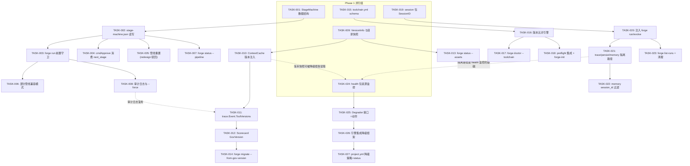
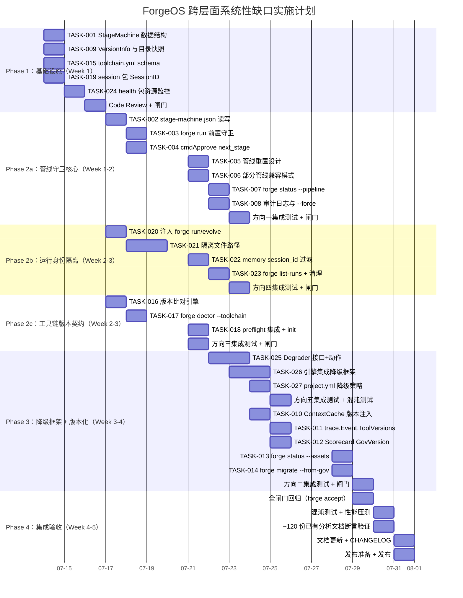

现在我已经充分理解了项目代码库和分析文档，下面给出我的 Tech Lead 分析。

---

# Tech Lead 分析：跨层面系统性缺口实施计划

## 目录

1. [任务分解](#1-任务分解)
2. [执行顺序与依赖图](#2-执行顺序与依赖图)
3. [技术风险分析](#3-技术风险分析)
4. [资源评估](#4-资源评估)
5. [质量保证策略](#5-质量保证策略)
6. [实施时间表](#6-实施时间表)

---

## 1. 任务分解

5 个方向拆解为 **23 个可执行任务**，每个 2–4 小时，标注了完整的前置依赖和验收标准。

### 方向一：管线顺序守卫（P0 — 8 个任务）

| 任务 ID | 标题 | 涉及文件 | 前置 | 工时 | 验收标准 |
|---------|------|---------|------|------|---------|
| TASK-001 | `StageMachine` 数据结构与序列化 | `forge-core/internal/asset/asset.go`（新增 `StageMachine` 结构体），`forge-core/internal/persist/`（新增 `stage_machine.go`）| 无 | 3h | `StageMachine` 结构体定义，含 `CurrentStage`、`CompletedStages []string`、`Approvals map[string]int64`；JSON 序列化/反序列化通过测试 |
| TASK-002 | `.forge/stage-machine.json` 读写与初始化 | `forge-core/internal/persist/stage_machine.go` | TASK-001 | 2h | `SaveStageMachine()` 原子写（tmp+rename），`LoadStageMachine()` 优雅处理文件不存在；已有 checkpoint 兼容 |
| TASK-003 | `forge run` 管线前置守卫 | `forge-core/cmd/forge/main.go`（`cmdRun` 入口添加守卫） | TASK-002 | 3h | 加载 worklow 后检查 `.forge/stage-machine.json`：若 worklow 声明了 `on_approved.next_stage`，前一阶段必须已批准；不兼容则报错退出；`--force` 标志跳过守卫并记审计日志 |
| TASK-004 | `cmdApprove` 消费 `next_stage` | `forge-core/cmd/forge/approve.go` | TASK-002 | 3h | 批准时读取 worklow 的 `OnApproved.NextStage`，验证目标 stage 是否合法；写入 `.forge/stage-machine.json` 的 `Approvals` |
| TASK-005 | 管线重置（redesign 驳回场景） | `forge-core/internal/converge/converge.go`（驳回信号联动） | TASK-002 | 3h | 当 `on_rejected` 触发 loop-back 到 design 时，清除 design 之后的批准标记；`StageMachine` 回退到前一阶段 |
| TASK-006 | 部分管线兼容模式 | `forge-core/cmd/forge/main.go` | TASK-003 | 2h | 只对声明了 `next_stage` 的 worklow 强制执行；无 `next_stage` 或部分管线项目保持当前行为 |
| TASK-007 | `forge status --pipeline` CLI | `forge-core/cmd/forge/status.go`（新建） | TASK-002 | 2h | 新子命令显示当前管线阶段、已完成/已批准/待执行、管线历史 |
| TASK-008 | 审计日志与 `--force` 记录 | `forge-core/internal/trace/trace.go`（扩展 Event） | TASK-003 | 2h | `--force` 跳过的管线守卫在 trace 中记录 `DecisionEvent{Kind: "pipeline_override"}`；日志包含 stage、worklow、user |

### 方向二：治理资产版本化（P1 — 6 个任务）

| 任务 ID | 标题 | 涉及文件 | 前置 | 工时 | 验收标准 |
|---------|------|---------|------|------|---------|
| TASK-009 | `asset.VersionInfo` 结构体与目录快照 | `forge-core/internal/asset/asset.go`（新增 `VersionInfo`） | 无 | 3h | `VersionInfo` 含 `AgentCards map[string]string`、`Workflows map[string]string`、`Policies map[string]string`；快照函数计算 git hash（`git describe --always --dirty`）或 fallback mtime+size |
| TASK-010 | `prompt.ContextCache` 版本注入 | `forge-core/internal/prompt/cache.go`（`invariants()` 方法扩展） | TASK-009 | 3h | `invariants()` 构建时缓存版本快照；`GatherCached` 返回的 `Doc` 包含版本元数据；缓存更新时重新计算 hash |
| TASK-011 | `trace.Event.ToolVersions` 字段 | `forge-core/internal/trace/trace.go`（Event 结构体扩展） | TASK-010 | 2h | Event 新增 `ToolVersions map[string]string `json:"tool_versions,omitempty"``；Emit 时由 caller 注入；omitempty 保证旧 trace 兼容 |
| TASK-012 | Scorecard 扩展 `GovVersion` 字段 | `forge-core/internal/attribution/attribution.go`（ScorecardPair 扩展） | TASK-011 | 2h | `ScorecardPair` 新增 `AgentCardVersion`、`WorkflowVersion`、`PolicyVersion`；scorecard 生成时从 trace 读取版本信息 |
| TASK-013 | `forge status --assets` CLI | `forge-core/cmd/forge/status.go`（扩展） | TASK-009 | 2h | 显示当前治理资产版本（agent 卡、workflow、policies 各自的 git hash）及最后修改时间 |
| TASK-014 | `forge migrate --from-gov-version` | `forge-core/cmd/forge/migrate.go`（扩展） | TASK-012 | 3h | 迁移时读取治理资产版本快照，与目标版本 diff 后做差异化的 `derive_tasks`；版本不兼容时给出警告 |

### 方向三：工具链版本契约（P1 — 4 个任务）

| 任务 ID | 标题 | 涉及文件 | 前置 | 工时 | 验收标准 |
|---------|------|---------|------|------|---------|
| TASK-015 | `.agent/toolchain.yml` schema 与解析 | 新建 `forge-core/internal/toolchain/toolchain.go` | 无 | 3h | 定义 `Toolchain` 结构体（`Required`、`Gates`、`Executors` 各 map）；YAML 解析通过；含语义版本操作符（`>=`、`^`、`~`、`*`、`<`、`=`） |
| TASK-016 | 版本比对引擎 | 新建 `forge-core/internal/toolchain/version.go` | TASK-015 | 3h | `VersionSatisfies(constraint, actual string) bool` 支持语义版本操作符；覆盖 `>=1.55`、`^18.0`、`~0.3.5`、`*`、`<2.0`、`=1.0.0`；优雅处理非语义版本（`"*" → true`） |
| TASK-017 | `forge doctor --toolchain` 与 `forge doctor --snapshot` | `forge-core/internal/doctor/doctor.go`（扩展） | TASK-016 | 3h | `--toolchain`：读取 `.agent/toolchain.yml`，对每个声明工具调 `exec.LookPath` + `--version` + 版本比对，输出 OK/FAIL；JSON 格式快照输出 |
| TASK-018 | `forge preflight` 集成 + `forge-init` 输出 | `forge-core/cmd/forge/preflight.go`（扩展），`harness/scaffold/forge-init.mjs` | TASK-016 | 2h | preflight 增加 toolchain 版本检查步骤；`forge-init` 为新项目生成默认 `.agent/toolchain.yml`（含 node/python3/claude/git 的合理版本范围） |

### 方向四：运行身份隔离（P1 — 5 个任务）

| 任务 ID | 标题 | 涉及文件 | 前置 | 工时 | 验收标准 |
|---------|------|---------|------|------|---------|
| TASK-019 | `internal/session` 包：SessionID 生成与管理 | 新建 `forge-core/internal/session/session.go` | 无 | 3h | `NewSessionID()` 返回 UUID v7 带时间戳；`Session` 结构体含 `ID`、`StartTime`、`Isolation`；支持三种隔离策略：`Isolated`、`Shared`、`Advisory` |
| TASK-020 | 运行身份注入 forge run/evolve 入口 | `forge-core/cmd/forge/main.go`（`execEngine` / `cmdEvolve`） | TASK-019 | 3h | `forge run`/`evolve` 启动时生成 SessionID；通过 `Engine.Session` 注入到所有子系统（trace/persist/memory）；隔离模式下路径变为 `.forge/runs/<run_id>/trace.jsonl` |
| TASK-021 | trace/persist/memory 隔离文件路径 | `forge-core/internal/trace/trace.go`（`NewTracer` 扩展），`forge-core/internal/persist/checkpoint.go`，`forge-core/internal/memory/memory.go` | TASK-020 | 4h | Shared 模式：当前行为不变；Isolated 模式：各子系统使用 `.forge/runs/<run_id>/` 路径；Advisory 模式：trace 独立，checkpoint 共享 |
| TASK-022 | memory 条目 session_id 字段与查询过滤 | `forge-core/internal/memory/memory.go`（Entry 结构体扩展 + Load 过滤） | TASK-021 | 3h | `Entry` 新增 `SessionID string `json:"session_id,omitempty"``；`Load()` 默认只返回当前 session 条目；`LoadAllSessions()` 返回全部（需显式调用） |
| TASK-023 | `forge list-runs` + `.forge/runs/.last` + 清理 | 新建 `forge-core/cmd/forge/runs.go` | TASK-020 | 3h | `forge list-runs` 列出 `.forge/runs/` 下历史运行（含 workflow/mode/时间/结果）；`.last` 符号链接指向最近一次运行；`forge clean --run <run_id>` 清理单次运行数据 |

### 方向五：降级策略框架（P1 — 4 个任务）

| 任务 ID | 标题 | 涉及文件 | 前置 | 工时 | 验收标准 |
|---------|------|---------|------|------|---------|
| TASK-024 | `internal/health` 包：资源监控接口 | 新建 `forge-core/internal/health/health.go` | 无 | 4h | `HealthMonitor` 监控以下信号：磁盘空间（`.forge/` 所在文件系统）、内存压力（`runtime.ReadMemStats`）、trace/memory 文件大小趋势、API 529 频率、预算消耗率 |
| TASK-025 | `Degrader` 接口 + 预装降级动作 | 新建 `forge-core/internal/health/degrader.go` | TASK-024 | 4h | `Degrader` 接口含 `Level() DegradeLevel`（Normal/Caution/Critical）和 `Actions() []DegradeAction`；预装动作：`DegradeTrace`（降低采样率）、`DegradeMemory`（触发 Compact）、`DegradeCheckpoint`（降低 retain）、`Stop`（优雅终止） |
| TASK-026 | 引擎集成降级框架 | `forge-core/internal/orchestrator/orchestrator.go`（`runAgentPhaseBudgeted` 扩展 + 主循环集成） | TASK-025 | 4h | 每个 agent phase 前调用 `health.Check()`；Caution 级：trace 降采样 + memory prune；Critical 级：降级 checkpoint + 跳过非载重 gate + 降低并行度；Trace 中记录 `DecisionEvent{Kind: "system_degrade"}` |
| TASK-027 | `project.yml` 降级策略声明 + `forge status --health` | `forge-core/internal/asset/asset.go`（扩展 project.yml schema），`forge-core/cmd/forge/status.go` | TASK-026 | 3h | `project.yml` 支持 `degradation: graceful | fail-fast | conservative`；`forge status --health` 显示当前资源状态和活跃降级列表；降级动作标注 `[DEGRADE]` 在日志中 |

---

## 2. 执行顺序与依赖图

### 完整依赖图



### 并行执行分组

| 阶段 | 并行任务 | 说明 |
|------|---------|------|
| **Phase 1**（基础设施） | TASK-001, TASK-009, TASK-015, TASK-019, TASK-024 | 5 个方向的基础数据结构/包各自独立，可并行开工 |
| **Phase 2**（核心逻辑） | TASK-002→TASK-003→TASK-004（管道） | 管线守卫的核心链路 |
| | TASK-016（独立） | 版本比对引擎 |
| | TASK-010→TASK-011（管道） | 版本化注入 + trace 扩展 |
| | TASK-025（依赖 TASK-024） | 降级动作实现 |
| **Phase 3**（集成与CLI） | TASK-005→TASK-006, TASK-007（TASK-002 后） | 守卫边缘情况 |
| | TASK-017, TASK-018（TASK-016 后） | 工具链 CLI |
| | TASK-020, TASK-021（TASK-019 后） | 运行身份注入 |
| | TASK-026（TASK-025 后） | 降级引擎集成 |
| **Phase 4**（收尾） | TASK-008, TASK-012, TASK-013, TASK-014, TASK-022, TASK-023, TASK-027 | CLI 完善 + 跨方向集成 |

---

## 3. 技术风险分析

### 3.1 管线顺序守卫（方向一）

| 风险 | 概率 | 影响 | 缓解策略 |
|------|------|------|---------|
| **向后兼容破坏**：已有项目没有完整的管线文件，现有 `forge run build` 突然失败 | 高 | 高 | TASK-006 部分管线模式：只对声明了 `next_stage` 的 worklow 强制执行；默认 `enforced` 只在 production lifecycle 生效 |
| **Evolve 循环误拦**：`forge evolve` 本身是多迭代循环，不应被管线守卫阻塞 | 中 | 高 | `forge evolve` 入口单独处理——首次进入时检查，后续迭代跳过（进化循环有自己的收敛条件，不应被线性管线约束） |
| **多模块同一仓库**：examples/ 下有多个独立项目，管线守卫不应全局作用 | 中 | 中 | 守卫以 worklow 文件为粒度；只有相同 `next_stage` 链中的 worklow 之间强制顺序；不同模块的 worklow 互不关联 |
| **并发批准竞态**：两个终端同时 `forge approve` | 低 | 中 | `SaveStageMachine` 使用原子写（tmp+rename），类似 checkpoint 的并发安全模式；但跨进程锁（flock）应作为 v2 |
| **`--force` 误用**：用户习惯性使用 `--force` 跳过守卫 | 中 | 低 | 审计日志 trace 记录每次 `--force` 使用；`forge status --pipeline` 显示管线偏差 |

**技术难点**：管线状态机的形式化定义。当前 5 个 stage（DISCOVER→DESIGN→REVIEW→BUILD→EVOLVE）是线性管线，但 `evolve` 有内部迭代——状态机需要支持「线性推进 + 循环内自洽」的组合模式。

**推荐解法**：使用有限状态机（FSM）建模，而非简单的「当前阶段」整数。状态为 `(stage, substate)`，其中 `substate ∈ {pending, approved, rejected, in_progress}`。拒绝状态触发回退到 `DESIGN` 并清除后续批准。

### 3.2 治理资产版本化（方向二）

| 风险 | 概率 | 影响 | 缓解策略 |
|------|------|------|---------|
| **Git hash 计算延迟**：每次 run 扫描所有 .md/.yml 文件计算 hash | 高 | 中 | 利用 `prompt.ContextCache` 的 `invariants()` 缓存，只在新 run 或文件变化时重新计算；增量 hash（只 hash 文件列表的 mtime 组合而非内容） |
| **非 git 仓库场景**：`forge run` 可能在没有 git 的目录中执行 | 中 | 低 | fallback 到 mtime+size 的 sha256；trace 中标记 `"vcs": "none"` |
| **Hash 膨胀**：trace event 中嵌入完整 hash 增加存储和传输开销 | 低 | 中 | 使用 `git describe --always --dirty` 的 7 字符短格式；128 位 hash 序列化为 base62（22 字符 vs 40 字符 hex） |
| **Submodule 分层**：.agent/ 是 submodule 时版本信息复杂 | 低 | 中 | `VersionInfo` 同时记录主仓库 commit 和 submodule commit；`git diff-tree --no-commit-id -r` 获取 submodule 指针 |

**性能数据预判**：对一个典型仓库（~20 个 agent 卡 + ~8 个 workflow + ~5 个 policies），全量 hash 应在 <50ms 内完成（`git hash-object` 并行执行）。后续可通过 `git ls-tree -r HEAD` 一次获取全部 hash。

### 3.3 工具链版本契约（方向三）

| 风险 | 概率 | 影响 | 缓解策略 |
|------|------|------|---------|
| **语义版本解析不完整**：许多工具不遵守 semver（claude CLI 无版本号） | 高 | 中 | 版本比对引擎需要容错：`--version` 输出正则提取主版本号；解析失败视为 "unknown"，记录审计日志但不阻塞 |
| **跨平台版本不一致**：Linux 与 macOS 的 `ruff`/`eslint` 版本可能不同步 | 中 | 低 | 合约使用 `>=` 范围而非固定版本；`forge doctor --snapshot` 记录具体版本与环境信息 |
| **Docker 内运行绕过**：容器内工具版本固定，版本检查可自动满足 | 低 | 低 | 检测 `/proc/1/cgroup` 或 `/.dockerenv` 判断容器环境；容器内跳过版本检查或自动从 Dockerfile 提取版本声明 |
| **工具升级后行为变化**：版本合约只检查版本号，不检查行为兼容性 | 中 | 高 | 此风险无法完全消除。版本合约至少提供「版本漂移预警」——在 CI 中阻断版本变更直到人工确认 |

**关键决策**：版本比对引擎是否应成为独立可复用组件？**建议是**——拆为 `internal/semver` 包，单独测试，未来也可用于治理资产版本比对。

### 3.4 运行身份隔离（方向四）

| 风险 | 概率 | 影响 | 缓解策略 |
|------|------|------|---------|
| **磁盘膨胀**：每个 run 独立目录，长期积累大量运行数据 | 高 | 高 | 默认保留最近 10 次运行；`forge clean --retain N` 配置保留数量；`forge clean --before <timestamp>` 按时间清理；health 监控自动触发清理 |
| **旧数据兼容**：已有 `.forge/trace.jsonl` 没有 run_id | 高 | 中 | 旧行视为 `session_id: "legacy"`，不被丢弃；`forge list-runs` 显示一个 `legacy` 条目 |
| **并发进程文件冲突**：隔离模式下同时写各自目录无冲突，但共享 memory 可能不一致 | 中 | 中 | memory 默认 `session_id` 过滤 + `LoadAllSessions` 显式交叉引用；memory 条目携带 session_id 后，query 层默认只读当前 session |
| **Checkpoint resume 跨运行身份**：用户用 `--approved` 恢复一个 run，但 run_id 不同 | 中 | 中 | `.forge/runs/.last` 符号链接保证最新运行可恢复；resume 时可以选择「以新身份继续上次 checkpoint」或「以旧身份继续」 |

**技术难点**：UUID v7 的实现。Go 标准库无 UUID v7 生成器。**建议**：使用 `time.Now().UnixMilli() << 16 | rand(64)` 的简便方案（非加密随机），或 vendor `github.com/google/uuid`——但 `forge-core` 是零依赖约束。零依赖方案：使用 `crypto/rand` 生成 16 字节，前 8 字节为毫秒时间戳，后 8 字节为随机数。

### 3.5 降级策略框架（方向五）

| 风险 | 概率 | 影响 | 缓解策略 |
|------|------|------|---------|
| **降级误触发**：瞬时磁盘 I/O 峰值被误读为磁盘压力，导致降级 | 高 | 高 | 使用趋势检测而非瞬时阈值：`EMA(disk_usage, 5min)` 作为决策依据；确认持续超过阈值 30 秒后才触发降级 |
| **降级不可观测**：用户看到运行变慢/输出变少，但不知道是降级导致 | 高 | 中 | 每个降级动作在 trace 中记录 `{kind: "system_degrade", detail: "trace sampling reduced to 10%"}`；日志前缀 `[DEGRADE]` 强制可见；`forge status --health` 实时显示 |
| **降级回退振荡**：压力解除→回退→压力再次触发→降级，循环振荡 | 中 | 高 | 降级后锁定至少 5 分钟（`degradeHoldoff`），防止振荡；使用 hysteresis（触发阈值 < 恢复阈值，如 80% 触发，70% 恢复） |
| **安全 gate 被绕过**：降级策略跳过了 critical gate | 低 | 极高 | 硬编码：安全 gate（`critical→Opus`、`production→full review`）不可被降级策略跳过；降级只影响「非载重」gate |
| **降级策略配置错误**：用户设置 `degradation: fail-fast` 导致系统过早终止 | 低 | 低 | 文档明确三种策略的行为；`forge doctor` 检查配置合理性；默认 `graceful` |

**测试难点**：降级路径比 happy-path 难测试数倍。需要：
- `FORGE_TEST_DEGRADE_MODE=mock_disk_pressure` 测试 flag
- `FORGE_TEST_DEGRADE_MODE=mock_budget_exhaustion` 测试 flag
- 为 `HealthMonitor` 设计可注入的 mock（`DiskUsageFunc`、`MemPressureFunc` 等函数字段，类似 `Tracer.Now` 的模式）

---

## 4. 资源评估

### 4.1 人员需求

| 角色 | 数量 | 关键技能 | 负责方向 |
|------|------|---------|---------|
| **资深 Go 工程师**（TL） | 1 | Go 并发、FSM 设计、文件系统原子操作 | 方向一（核心守卫）、方向四（session 包）、跨方向协调 |
| **Go 工程师**（dev 1） | 1 | 数据结构设计、JSON/YAML 处理、CLI 实现 | 方向一（CLI + 边界情况）、方向五（health 监控 + 降级动作） |
| **Go/Node 工程师**（dev 2） | 1 | 语义版本解析、doctor/preflight 扩展、Node 集成 | 方向三（工具链完全）、方向二（asset 版本快照 + trace 扩展） |
| **全栈工程师**（dev 3） | 1 | 治理资产领域知识、scorecard schema、forge-init 维护 | 方向二（scorecard 扩展 + migrate）、方向三（forge-init 输出） |
| **QA 工程师** | 1 | 集成测试、混沌测试、性能压测 | 全部方向——特别是降级测试（mock 磁盘压力、mock API 529） |

**团队规模**：**最小可行团队 3 人**（1 个 TL + 2 个工程师），**推荐团队 5 人**（含 QA）。

### 4.2 关键里程碑

| 里程碑 | 时间节点 | 交付物 | 涉及方向 |
|--------|---------|--------|---------|
| **M1 — 基建完成** | 第 1 周末 | 5 个方向的基础数据结构和包通过单元测试：StageMachine、VersionInfo、toolchain.yml schema、SessionID、HealthMonitor | 全部（基础） |
| **M2 — 管线守卫可运行** | 第 2 周末 | `forge run` 管线前置检查 + `forge approve` next_stage 消费 端到端通过；`forge status --pipeline` 可用 | 方向一 |
| **M3 — 运行身份隔离落地** | 第 3 周末 | `forge run --isolated` 完整链路：隔离文件路径 + memory session_id 过滤 + `forge list-runs` | 方向四 |
| **M4 — 工具链契约可用** | 第 3 周末 | `.agent/toolchain.yml` 完全生效；`forge doctor --toolchain` 和 `forge doctor --snapshot` 通过测试 | 方向三 |
| **M5 — 降级框架集成** | 第 4 周末 | `internal/health` + `Degrader` 接口 + 引擎集成通过集成测试；`FORGE_TEST_DEGRADE_MODE` mock 可用 | 方向五 |
| **M6 — 版本化全链路** | 第 5 周末 | trace event 携带 ToolVersions；scorecard 输出 GovVersion；`forge status --assets` 可用 | 方向二 |
| **M7 — 集成验收** | 第 6 周末 | 全部 23 个任务代码合并；`forge accept` pass；~120 份已有分析文档的断言无回归 | 全部 |

### 4.3 阻塞点（Blockers）

| 阻塞点 | 影响方向 | 问题描述 | 解决策略 |
|--------|---------|---------|---------|
| **零依赖约束** 🚫 | 方向一、四、五 | `forge-core` 严格零外部依赖，不能引入 UUID 库、FSM 库、semver 库 | 自实现精简版本：54 行 UUID v7、~80 行 FSM 核心、~120 行 semver parser。都已存在于标准库+手写范围 |
| **已有测试断言兼容** | 全部 | 现有 ~50 个 Go 测试文件和 ~20 个 harness JS 测试文件，trace/persist/memory 格式变化可能导致断言失败 | 所有新字段加 `omitempty`；遗留无 session_id 的行视作 "legacy"；跑 `forge accept` 全闸门验证 |
| **ADR-0003 submodule 依赖** | 方向二 | 治理资产版本化在 .agent/ 为 submodule 时最优，但 ADR-0003 尚未落地 | 版本化不依赖 submodule——先在单仓库落地，submodule 场景作为后续扩展 |
| **降级测试的混沌工程工具** | 方向五 | 模拟磁盘压力、API 529 需要测试基础设施 | `--simulate-disk-pressure` 和 `--simulate-budget-exhaustion` flag + mock injection |

---

## 5. 质量保证策略

### 5.1 单元测试覆盖要求

| 层 | 目标包 | 覆盖率目标 | 关键测试点 |
|----|--------|-----------|-----------|
| **数据结构** | `asset`（StageMachine）、`session`、`health`、`toolchain` | **≥90%** | JSON 序列化/反序列化、边界值、nil/空 map、非法输入 |
| **版本比对** | `toolchain` semver 引擎 | **100%**（关键逻辑） | 每个操作符（`>=`、`^`、`~`、`*`、`<`、`=`）的等价类测试；非语义版本回退 |
| **状态机** | `asset` StageMachine FSM | **100%** | 所有状态转换：pending→approved、approved→rejected（重置）、非法转换 |
| **文件 IO** | `persist`（stage_machine）、`session`（文件路径） | **≥85%** | 原子写（tmp+rename）、文件不存在、权限不足、磁盘满 mock |
| **降级动作** | `health`（Degrader 实现） | **≥90%** | 每种降级动作的正确执行；降级回退；降级锁定（holdoff）不振荡 |

### 5.2 集成测试策略

| 测试场景 | 类型 | 工具 | 验证内容 |
|---------|------|------|---------|
| **管线守卫端到端** | 黑盒 | Go `TestMain` + `forge run` subprocess | `forge run build` 在 design 未批准时报错；`forge run design --approved` 后可以 run build；`--force` 跳过守卫 |
| **运行身份隔离** | 黑盒 | 两个并发 `forge run` subprocess | 隔离模式下 trace.jsonl 路径不同；shared 模式下 trace 交错但无数据丢失 |
| **工具链检查** | 黑盒 | `forge doctor --toolchain` subprocess | 对故意修改版本的工具报 FAIL；缺少工具时报 FAIL；正常环境 PASS |
| **降级触发** | 白盒+mock | Go test with mocked `DiskPressureFunc` | 磁盘 85%→降级 trace 采样；95%→优雅终止；回退后恢复完整记录 |
| **治理资产版本化** | 白盒 | Go test with git repo fixture | `git commit` 后 agent 卡 hash 变化；trace event 记录新旧版本 |
| **全闸门回归** | 黑盒 | `forge accept` | 所有已有闸门 pass（`gate.mjs`、`arch-check.mjs`、`check.py`、`secret-scan.mjs`、test） |

### 5.3 代码审查要点

| 审查焦点 | 为什么重要 | 具体检查项 |
|---------|-----------|-----------|
| **零依赖合规** | forge-core 红线 | 不引入任何外部模块；`internal/semver` 和 `internal/session` 仅使用标准库 |
| **向后兼容** | 已有用户不受影响 | 所有新字段 `omitempty`；旧 trace/checkpoint/memory 被优雅读取；无 session_id 的行不报错 |
| **原子写入** | 避免数据损坏 | `SaveStageMachine`、`SaveCheckpoint` 使用 tmp+rename 模式；fsync 后 rename |
| **并发安全** | 多进程场景 | `Tracer.Emit` 锁正确；Append 使用 O_APPEND；session 文件路径无竞态 |
| **降级不绕过安全** | 防止安全漏洞 | 所有 `critical` 和 `production` 级别的 gate 不可被降级跳过；单元测试验证 |
| **健康监控注入点** | 可测试性 | `HealthMonitor` 所有 sensor 使用函数字段（可注入 mock），不允许硬编码 `os.Stat` / `runtime.ReadMemStats` |
| **审计日志完备** | 可观测性 | 每个 `--force`、降级动作、版本不匹配都写入 trace；`DecisionEvent` 包含原因和操作 |

### 5.4 性能测试需求

| 测试场景 | 负载 | 验收标准 | 说明 |
|---------|------|---------|------|
| **版本快照计算延迟** | 30 agent 卡 + 15 workflow + 10 policies | **≤100ms** | 使用 `git hash-object --stdin-paths` 批量计算；结果缓存到 ContextCache |
| **降级框架开销** | 每个 agent phase 调用 health.Check() | **<1ms** | 健康检查不应成为 hot path 瓶颈；非阻塞 I/O（`statfs` 系统调用已优化） |
| **运行身份隔离文件 I/O** | 10 并发 run | 文件路径分辨正确；无锁竞争 | 隔离模式下每个 run 写不同文件，无共享文件锁 |
| **版本比对引擎吞吐** | 10,000 次 `VersionSatisfies` 调用 | **<50ms 总时间** | 纯 CPU 计算，无 I/O；使用预编译约束 AST |

### 5.5 特殊测试：降级混沌测试

由于降级框架是 5 个方向中最难测试的，需要专用测试基础设施：

```go
// forge-core/internal/health/health_test.go
func TestDegradeDiskPressure(t *testing.T) {
    // Arrange: inject mock disk sensor
    h := NewHealthMonitor(
        ".",
        WithDiskCheck(func(path string) (DiskInfo, error) {
            return DiskInfo{AvailBytes: 1 << 30, TotalBytes: 10 << 30}, nil // 90% used
        }),
    )

    // Act
    actions := h.Check()

    // Assert: trace degrade should be active
    assert.Contains(t, actions, DegradeAction{Degrade: DegradeTrace, Level: Caution})
}
```

**混沌测试脚本**（`harness/test_degrade_chaos.mjs`）：
1. 用 `dd` 填充磁盘到 80% → 运行 `forge evolve` → 验证降级标记
2. 用 `cgroup` 限制内存 → 运行 `forge run` → 验证内存压力降级
3. 用 `/dev/null` 替换 trace 文件 → 验证优雅降级到静默丢弃

---

## 6. 实施时间表

### 甘特图



### 阶段说明

#### 阶段 1：基础设施搭建（第 1 周 — 2.5 天）

**目标**：5 个方向的基础数据结构和独立包全部就绪，可并行开发。

| 日期 | 工作内容 | 责任人 |
|------|---------|--------|
| Day 1 | TASK-001（StageMachine）+ TASK-009（VersionInfo）+ TASK-015（toolchain schema） | TL + dev 1 + dev 2 |
| Day 2 | TASK-019（session 包）+ TASK-024（health 包）| dev 2 + dev 1 |
| Day 2.5 | Code Review + 闸门验证（`forge accept`）| 全员 |

**交付物**：5 个 `internal/` 子包通过单元测试，闸门 pass。

#### 阶段 2：核心功能实现（第 2–3 周 — 6 天）

**目标**：方向一（P0）、方向三（P1）、方向四（P1）端到端可用。

| 日期 | 工作内容 | 责任人 |
|------|---------|--------|
| Day 3–4 | 方向一核心链路（TASK-002→TASK-003→TASK-004）+ 方向四注入（TASK-019→TASK-020）| TL + dev 1 |
| Day 4–5 | 方向三（TASK-016→TASK-017→TASK-018）+ 方向四文件隔离（TASK-021）| dev 2 + dev 3 |
| Day 6–7 | 方向一边界（TASK-005→TASK-006→TASK-007→TASK-008）+ 方向四 memory 过滤+CLI（TASK-022→TASK-023）| TL + dev 1 |
| Day 8 | 集成测试：`forge run` 管线守卫 + 运行身份隔离端到端 | QA |

**交付物**：
- `forge run build` 在 design 未批准时报错
- `forge run --isolated` 使用隔离目录
- `forge doctor --toolchain` 版本检查通过

#### 阶段 3：降级框架 + 版本化（第 4 周 — 5 天）

**目标**：方向五（降级框架）和方向二（治理资产版本化）完整实现。

| 日期 | 工作内容 | 责任人 |
|------|---------|--------|
| Day 9–10 | 方向五核心（TASK-025→TASK-026）| dev 1（健康监控经验）|
| Day 10–11 | 方向五 CLI（TASK-027）+ 方向二版本注入（TASK-009→TASK-010→TASK-011）| TL + dev 2 |
| Day 12–13 | 方向二 scorecard + CLI（TASK-012→TASK-013→TASK-014）| dev 2 + dev 3 |
| Day 13 | 方向五混沌测试 + 全方向集成测试 | QA |

**交付物**：
- 磁盘 >80% 时引擎自动降级 trace 采样
- trace event 携带 agent 卡版本 hash
- Scorecard 输出 GovVersion

#### 阶段 4：集成验收与发布（第 5 周 — 2.5 天）

| 日期 | 工作内容 | 责任人 |
|------|---------|--------|
| Day 14 | 全闸门回归（`forge accept`）+ 已有测试断言验证 | QA |
| Day 14–15 | 混沌测试 + 性能压测（版本快照延迟、降级开销）| TL + QA |
| Day 15 | 文档更新（架构文档、CHANGELOG、用户指南）+ 发布 | 全员 |

**交付物**：全部 23 个任务代码合并；`forge accept` pass；release tag。

---

## 总结：给我的团队的执行建议

1. **优先方向一（P0）**：管线顺序守卫是唯一标注 P0 的缺口。它的实现侵入性最小（仅装配已有 `asset.OnApproved.NextStage`），但杠杆最高——解决了「ForgeOS 声称要防止的核心反模式」。**第 2 周末必须端到端可运行**。

2. **方向四（运行身份隔离）是其他方向的基石**：trace 隔离是方向二（版本化 trace）的前提，文件路径隔离是方向五（health 监控）的输入。**建议方向四排在方向二和方向五之前**。

3. **零依赖约束是最大的工程约束**：所有包必须使用 Go 标准库实现。自实现 semver parser（~120 行）、UUID v7（~54 行）、FSM（~80 行）是可控的成本。**禁止**引入 `github.com/google/uuid`、`github.com/Masterminds/semver` 等外部依赖。

4. **降级框架的测试是真正的难点**：需要前瞻性地设计可注入 mock。`HealthMonitor` 的所有 sensor 都应该是可替换的函数字段——这是 `Tracer.Now` 模式的一次大规模复用。

5. **审阅节奏**：每周五下午做跨方向集成测试；每个任务的 PR 必须通过 `forge accept` 才能合并。Reviewer 必须是 fresh-context 的独立 Agent（按 CLAUDE.md 纪律）。

6. **如果团队只有 3 人**：精简策略——方向三（工具链版本契约）可以由 1 人独立完成 4 天；方向二（治理资产版本化）可以缩减为只做 TASK-009→TASK-011（trace 版本字段），TASK-012→TASK-014（scorecard+migrate）推迟到下一轮迭代。
