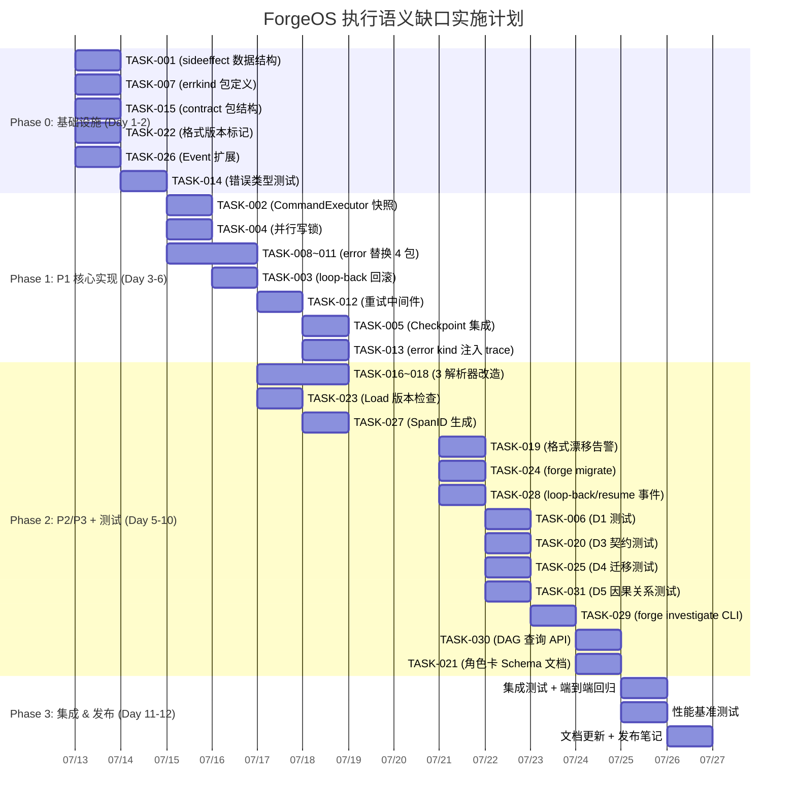

好的，我现在以 Tech Lead 身份，基于 `docs/requirements/execution-semantics-gap-analysis.md` 的内容，从任务分解、执行顺序、技术风险、资源评估、质量保证和实施计划六个维度进行深入分析。

---

# Tech Lead 分析报告：执行语义与系统韧性缺口

> **源文档**: `docs/requirements/execution-semantics-gap-analysis.md` (623 行)  
> **日期**: 2026-07-12  
> **角色**: Tech Lead  
> **范围**: 5 个方向（2×P1、2×P2、1×P3）的全生命周期交付规划

---

## 1. 任务分解

共 **31 个可执行任务**，每个 2–4 小时，按方向分组。

### 方向一：Phase 副作用模型（P1）

| ID | 任务标题 | 涉及文件 | 前置 | 工时 |
|----|----------|----------|------|------|
| **TASK-001** | 定义副作用数据结构（Manifest/Diff/Snapshot） | `internal/sideeffect/manifest.go`, `internal/sideeffect/diff.go`, `internal/sideeffect/snapshot.go` | — | 3h |
| **TASK-002** | 在 CommandExecutor 中植入 phase 前/后快照 | `orchestrator/command_executor.go`, `internal/sideeffect/snapshot.go` | TASK-001 | 3h |
| **TASK-003** | 实现 loop-back 回滚机制（diff → 文件还原） | `orchestrator/orchestrator.go`, `internal/sideeffect/rollback.go` | TASK-002 | 4h |
| **TASK-004** | 添加并行 phase 文件级写锁 | `orchestrator/parallel.go`, `internal/sideeffect/writelock.go` | TASK-001 | 3h |
| **TASK-005** | 副作用追踪集成到 Checkpoint（crash-resume 恢复） | `persist/checkpoint.go`, `internal/sideeffect/checkpoint.go` | TASK-003, TASK-022 | 3h |
| **TASK-006** | 副作用模型单元测试 + 集成测试 | `internal/sideeffect/*_test.go`, `orchestrator/orchestrator_test.go` | TASK-003, TASK-004, TASK-005 | 3h |

**小计**: 19h

### 方向二：结构化错误类型体系（P1）

| ID | 任务标题 | 涉及文件 | 前置 | 工时 |
|----|----------|----------|------|------|
| **TASK-007** | 定义 `internal/errkind` 包（Kind 枚举 + 构造函数 + Unwrap 链） | `internal/errkind/kind.go`, `internal/errkind/errors.go` | — | 3h |
| **TASK-008** | 替换 `internal/asset` 中所有 `fmt.Errorf` | `internal/asset/asset.go` | TASK-007 | 2h |
| **TASK-009** | 替换 `internal/memory` 中所有 `fmt.Errorf` | `internal/memory/memory.go` | TASK-007 | 2h |
| **TASK-010** | 替换 `internal/trace`、`persist/checkpoint`、`internal/routing` 中 `fmt.Errorf` | `internal/trace/trace.go`, `persist/checkpoint.go`, `internal/routing/*.go` | TASK-007 | 3h |
| **TASK-011** | 替换 `cmd/forge`（config.go、converge.go、run.go、main.go）中 `fmt.Errorf` | `cmd/forge/config.go`, `cmd/forge/converge.go`, `cmd/forge/run.go`, `cmd/forge/main.go` | TASK-007 | 4h |
| **TASK-012** | 为 memory/checkpoint/gate 添加可配置重试中间件 | `internal/memory/memory.go`, `persist/checkpoint.go`, `orchestrator/gate.go` | TASK-008, TASK-009, TASK-010 | 3h |
| **TASK-013** | 将 error kind 注入 trace event 和 scorecard | `internal/trace/trace.go`, `internal/routing/scorecard_wind.go` | TASK-012 | 2h |
| **TASK-014** | 错误类型系统单元测试 | `internal/errkind/*_test.go` | TASK-007 | 2h |

**小计**: 21h

### 方向三：Agent 输出契约校验（P2）

| ID | 任务标题 | 涉及文件 | 前置 | 工时 |
|----|----------|----------|------|------|
| **TASK-015** | 创建 `internal/contract` 包（输入规范化 + Schema 声明接口） | `internal/contract/normalize.go`, `internal/contract/schema.go` | — | 3h |
| **TASK-016** | 实现 Verdict 解析器模糊匹配（大小写/Prefix/Regex fallback） | `cmd/forge/cost.go`, `internal/contract/verdict.go` | TASK-015 | 3h |
| **TASK-017** | 实现 Confidence 解析器鲁棒化（`"85%"`、`"85.0"` 等变体） | `cmd/forge/cost.go`, `internal/contract/confidence.go` | TASK-015 | 2h |
| **TASK-018** | 实现 Roadmap checkbox 解析器强化（`*`/`+`/`1.` 列表标记） | `cmd/forge/cost.go`, `internal/contract/roadmap.go` | TASK-015 | 2h |
| **TASK-019** | 添加格式漂移告警日志（解析变体时记录 `fuzzy_match` 事件到 trace） | `internal/contract/drift.go`, 集成 `internal/trace` | TASK-016, TASK-017, TASK-018 | 2h |
| **TASK-020** | 契约测试（含所有合理格式变体） | `internal/contract/*_test.go`, `cmd/forge/cost_test.go` | TASK-016, TASK-017, TASK-018 | 3h |
| **TASK-021** | 在 agent 角色卡中声明输出契约 Schema（文档化） | `.agent/agents/*.md` | TASK-015 | 2h |

**小计**: 17h

### 方向四：On-disk 格式版本管理（P2）

| ID | 任务标题 | 涉及文件 | 前置 | 工时 |
|----|----------|----------|------|------|
| **TASK-022** | 为 Checkpoint、Scorecards 添加 `_format`/`format_version` 标记 | `persist/checkpoint.go`, `internal/routing/scorecards.go` | — | 3h |
| **TASK-023** | 在 Load 函数中添加格式版本检查（不支持时报错 + 提示迁移命令） | `internal/memory/memory.go`, `internal/trace/trace.go`, `persist/checkpoint.go` | TASK-022 | 3h |
| **TASK-024** | 实现 `forge migrate --format` 子命令（JSONL/JSON 原地迁移） | `cmd/forge/migrate.go`, 内部调用迁移函数 | TASK-023 | 4h |
| **TASK-025** | 跨版本安全文档 + 迁移测试 | `docs/operations/data-migration.md`, `internal/memory/memory_test.go` | TASK-024 | 2h |

**小计**: 12h

### 方向五：执行轨迹因果关系（P3）

| ID | 任务标题 | 涉及文件 | 前置 | 工时 |
|----|----------|----------|------|------|
| **TASK-026** | 扩展 Event 结构体（TraceID / SpanID / ParentSpanID） | `internal/trace/trace.go` | — | 2h |
| **TASK-027** | 在编排器中为 phase/gate/converge 生成 SpanID 并记录 Parent | `orchestrator/orchestrator.go`, `orchestrator/parallel.go` | TASK-026 | 3h |
| **TASK-028** | 添加 loop-back / resume / cost-guard-trip 事件（带 ParentLink） | `orchestrator/orchestrator.go` | TASK-027 | 2h |
| **TASK-029** | 实现 `forge investigate` CLI 子命令（加载 trace.jsonl + 重建 DAG + 根因查询） | `cmd/forge/investigate.go`, `internal/trace/dag.go` | TASK-028 | 4h |
| **TASK-030** | 实现 DAG 查询 API（按 TraceID 查询、按 SpanID 上下游遍历、热点统计） | `internal/trace/dag.go`, `internal/trace/query.go` | TASK-029 | 4h |
| **TASK-031** | 因果关系追踪测试 | `internal/trace/*_test.go` | TASK-028 | 2h |

**小计**: 17h

---

### 总计

| 指标 | 数值 |
|------|------|
| 任务总数 | **31** |
| 预估总工时 | **86h** |
| 并行工作（2 人） | ≈ **10 个工作日**（2 周） |
| 并行工作（3 人） | ≈ **6 个工作日**（1.2 周） |

---

## 2. 执行顺序与依赖图

任务依赖图（仅显示关键依赖边，未标注所有横向并行）：

```mermaid
graph TD
    %% ─── Phase 0: Foundation ───
    subgraph Phase0["Phase 0: 基础设施 (Day 1-2)"]
        T007[TASK-007: errkind 包定义]
        T001[TASK-001: sideeffect 数据结构]
        T015[TASK-015: contract 包结构]
        T026[TASK-026: Event 扩展 TraceID/SpanID]
        T022[TASK-022: Checkpoint/Scorecards 格式标记]
    end

    %% ─── Phase 1: Core Implementation ───
    subgraph Phase1["Phase 1: 核心实现 (Day 2-8)"]
        %% Direction 1
        T001 --> T002[TASK-002: CommandExecutor 快照]
        T002 --> T003[TASK-003: Loop-back 回滚]
        T001 --> T004[TASK-004: 并行写锁]
        T003 --> T005[TASK-005: Checkpoint 集成]
        T022 --> T005

        %% Direction 2
        T007 --> T008[TASK-008: asset 替换]
        T007 --> T009[TASK-009: memory 替换]
        T007 --> T010[TASK-010: trace/persist/routing 替换]
        T007 --> T011[TASK-011: cmd/forge 替换]
        T008 --> T012[TASK-012: 重试中间件]
        T009 --> T012
        T010 --> T012
        T012 --> T013[TASK-013: error kind 注入 trace/scorecard]
        
        %% Direction 3
        T015 --> T016[TASK-016: Verdict 模糊匹配]
        T015 --> T017[TASK-017: Confidence 鲁棒化]
        T015 --> T018[TASK-018: Roadmap 强化]
        T016 --> T019[TASK-019: 格式漂移告警]
        T017 --> T019
        T018 --> T019

        %% Direction 4
        T022 --> T023[TASK-023: Load 版本检查]
        T023 --> T024[TASK-024: forge migrate --format]

        %% Direction 5
        T026 --> T027[TASK-027: SpanID 生成]
        T027 --> T028[TASK-028: Loop-back/Resume 事件]
        T028 --> T029[TASK-029: forge investigate CLI]
        T029 --> T030[TASK-030: DAG 查询 API]
    end

    %% ─── Phase 2: Testing ───
    subgraph Phase2["Phase 2: 测试 & 文档 (Day 7-10)"]
        T003 --> T006[TASK-006: 副作用模型测试]
        T004 --> T006
        T005 --> T006
        
        T007 --> T014[TASK-014: 错误类型测试]
        
        T019 --> T020[TASK-020: 契约测试]
        T015 --> T021[TASK-021: 角色卡 Schema 文档]

        T024 --> T025[TASK-025: 迁移测试 + 文档]

        T028 --> T031[TASK-031: 因果关系测试]
    end

    %% ─── 并行标记 ───
    style T007 fill:#4a9,stroke:#333
    style T001 fill:#4a9,stroke:#333
    style T015 fill:#4a9,stroke:#333
    style T026 fill:#4a9,stroke:#333
    style T022 fill:#4a9,stroke:#333
```

### 可并行执行的任务组

| 并行组 | 任务 | 说明 |
|--------|------|------|
| **Group A** (基础) | TASK-001, TASK-007, TASK-015, TASK-022, TASK-026 | 互不依赖，可分别由 3–5 人同时开工 |
| **Group B** (方向 D1) | TASK-002, TASK-004 | 快照机制与写锁可并行 |
| **Group C** (方向 D2) | TASK-008, TASK-009, TASK-010, TASK-011 | 各包的 `fmt.Errorf` 替换完全独立，可分配给不同人 |
| **Group D** (方向 D3) | TASK-016, TASK-017, TASK-018 | 三个解析器改造互不依赖 |
| **Group E** (测试) | TASK-006, TASK-014, TASK-020, TASK-025, TASK-031 | 各方向测试可并行执行 |

---

## 3. 技术风险

### 3.1 方向一：副作用模型

| 风险 | 等级 | 描述 | 缓解策略 |
|------|------|------|----------|
| 快照性能开销 | **中** | 大项目（10K+ 文件）中 sha256 全量文件清单可能耗时数百 ms 到秒级 | 差分快照策略：首次全量，后续只记录 mtime 变化；允许 opt-out（`SIDE_EFFECT_TRACKING=false`） |
| Git 工作树冲突 | **高** | 如果用户同时在外部修改文件，快照回滚可能覆盖用户未提交的改动 | 检测 dirty work tree 时跳过回滚并告警；优先使用 `git checkout -- <files>` 而非文件覆盖 |
| 并行 phase 写锁死锁 | **中** | 波内两个 phase 相互等待对方的写锁 | 写锁按文件路径字典序获取（全局排序以防死锁）；设置获取超时（`LOCK_TIMEOUT=5s`） |
| 大文件 diff 内存爆炸 | **低** | Git LFS / 二进制文件纳入清单 | 在 `internal/sideeffect/manifest.go` 中过滤 `.git/`、`node_modules/`、二进制文件；提供忽略模式配置 |

### 3.2 方向二：结构化错误类型

| 风险 | 等级 | 描述 | 缓解策略 |
|------|------|------|----------|
| 替换范围遗漏 | **中** | 17 个包 × 42 个 cmd 文件，难免有漏网之鱼 | 添加 CI 检查脚本（`grep -rn 'fmt.Errorf' --include="*.go"` 在 PR 中必须为零）；最后一次全局扫查 |
| 重构导致行为变化 | **中** | `%w` 包装 vs 新构造函数可能改变 `errors.Is` 行为 | 每个替换必须加对应测试（断言 `errors.Is` / `errors.As` 分类正确）；Code Review 逐行确认 |
| 重试逻辑的幂等性假设 | **高** | Memory `Append` 重试可能导致重复 entry | 重试策略必须是**幂等安全**的：为每个操作分配 `idempotency_key`，目标操作先检查是否已执行 |

### 3.3 方向三：Agent 输出契约校验

| 风险 | 等级 | 描述 | 缓解策略 |
|------|------|------|----------|
| 模糊匹配误召回 | **中** | 过度宽容导致错误信号被接受（例如 `VERDICT: APPLAUSE` 被匹配为 APPROVE） | 模糊匹配必须输出 confidence score，低于阈值（如 0.85）的匹配走告警路径而非静默接受 |
| 正则注入 | **低** | Agent 输出可能包含恶意构造的正则 | 所有 regex 使用 `regexp.QuoteMeta` 或预编译模式；绝不对用户/agent 输入直接 `regexp.Compile` |
| 版本演化耦合 | **低** | 新 LLM 输出格式变化导致模糊匹配规则需要频繁更新 | 匹配规则作为配置文件（如 `.forge/output-contracts.yaml`），不改代码即可更新 |

### 3.4 方向四：格式版本管理

| 风险 | 等级 | 描述 | 缓解策略 |
|------|------|------|----------|
| 迁移过程中数据损坏 | **高** | `forge migrate --format` 执行一半时崩溃 → 部分数据 v1 部分 v2 | 迁移必须是原子事务：先写入 temp 文件，确认完整性后 rename 覆盖 |
| 跨版本兼容性估算不准 | **中** | V1 代码读到 v2 数据时 `json.Unmarshal` 无法捕获语义变化 | 在 `_format` 字段中嵌入最小兼容版本范围（`compat: ">=v1,<=v2"`） |
| 用户从未运行 `migrate` | **中** | 新代码自然 write v2，但用户不主动 migrate 导致混合格式 | 在 `Load` 时自动触发自动 migration（只向前迁移一次）；提供 `--no-migrate` 逃逸 |

### 3.5 方向五：因果关系追踪

| 风险 | 等级 | 描述 | 缓解策略 |
|------|------|------|----------|
| SpanID 生成性能 | **低** | UUID 生成在高频事件下不是瓶颈（每秒 <1000 事件） | 使用 `crypto/rand` 或简单的原子计数器 + 时间戳方案 |
| DAG 内存增长 | **中** | 24h 运行可能产生 10K+ 事件，DAG 全量加载可能消耗 ~50MB | DAG 重建使用流式处理（`json.Decoder`），只加载前 N 个根事件 + lazy 加载子事件 |
| 事件排序与恢复后乱序 | **低** | Crash-resume 后 trace 事件的 Seq 序列从 checkpoint 偏移 | Checkpoint 保存当前的 `Seq`，resume 后继续；SpanID 不依赖 Seq |

---

## 4. 资源评估

### 4.1 团队配置

| 角色 | 数量 | 技能要求 | 主要负责方向 |
|------|------|----------|-------------|
| **Senior Go 工程师** | 2 人 | 深入理解 Go error handling, `json.Unmarshal` 行为, 并发 sync 原语 | D1（副作用）+ D2（错误类型） |
| **Full-stack Go 工程师** | 1 人 | 熟悉 CLI 工具开发, trace/observability 概念, CI 集成 | D3（契约校验）+ D5（因果关系） |
| **DevOps / 基础设施** | 0.5 人 | 版本升级策略, migration 自动化 | D4（格式版本管理） |

> **最小可行团队**: 2 名 Senior Go 工程师，1 人同时覆盖较弱方向。  
> **最优团队**: 3 人，含 1 名偏 DevOps 方向。

### 4.2 关键里程碑

| 里程碑 | 时间点 | 交付内容 |
|--------|--------|----------|
| **M0: 基础设施完成** | Day 2 收盘 | TASK-001, 007, 015, 022, 026 全部合并（5 个方向的基础包可用） |
| **M1: P1 方向核心能力** | Day 6 收盘 | Loop-back 回滚生效（TASK-003 合并）+ 全系统错误类型替换完成（TASK-011 合并） |
| **M2: P2 方向核心能力** | Day 8 收盘 | Agent 输出模糊匹配上线（TASK-019 合并）+ `forge migrate --format` 可用（TASK-024 合并） |
| **M3: 全部功能冻结** | Day 10 收盘 | 所有 31 个任务完成 + 测试通过 |
| **M4: 发布准备** | Day 12 收盘 | 文档更新 + 端到端测试 + CI 通过 + 发布笔记 |

### 4.3 阻塞点与解决策略

| 阻塞点 | 影响方向 | 策略 |
|--------|---------|------|
| **D1 回滚方案的 git 交互** | D1 | 如果选型「基于 git checkout 回滚」→ 必须解决 dirty work tree 问题。**解决**: 优先用文件级快照还原（`os.Rename` 恢复备份文件），非 git 操作；git 作为备选方案 |
| **D2 替换范围完整性** | D2 | 17 个包、42 个 cmd 文件手动替换容易漏。**解决**: 用 grep 基线扫描（`list_unstructured_errors.sh`）在 CI 中作为通过/不通过闸门 |
| **D5 `forge investigate` 交互设计** | D5 | 终端界面适合展示 DAG 吗？**解决**: 优先输出文本树（`tree` 格式），而非 TUI 图形；减少前端复杂度 |

---

## 5. 质量保证

### 5.1 单元测试覆盖要求

| 包 | 要求行覆盖率 | 关键测试场景 |
|----|-------------|-------------|
| `internal/errkind` | ≥ 90% | 每种 Kind 的 create/wrap/Is/As；`fmt.Errorf`→`ErrKind` 迁移等价性 |
| `internal/sideeffect` | ≥ 85% | 空目录快照、含 git 目录过滤、大文件过滤、并行写锁争用、rollback 前后文件对比 |
| `internal/contract` | ≥ 90% | 每种解析器 × 10+ 个格式变体（大小写、多余空格、前缀文本、markdown 包裹） |
| `internal/trace`（扩展后） | ≥ 85% | SpanID 唯一性、DAG 重建正确性、Parent 链验证、空 trace 处理 |
| `persist/checkpoint` | ≥ 80% | 版本标记兼容性、旧版本 Load 报错、迁移前后内容一致 |

### 5.2 集成测试策略

| 测试场景 | 涉及方向 | 方法 |
|----------|---------|------|
| Loop-back 后文件回滚正确 | D1 | 创建一个有 5 个 phase 的 workflow，第 3 个 phase gate 强制失败 → 验证 loop-back 后第 3 个 phase 的旧输出被清理 |
| Crash + Resume 的副作用一致性 | D1 | 在 phase 执行中间 kill 进程 → resume → 验证所有 phase 的 side effect 与连续运行一致 |
| `fmt.Errorf` 替换后的 error 分类 | D2 | 对所有内部包做故障注入（磁盘满、超时、配置错误）→ 验证 `errors.Is` 分类正确 |
| 新版 LLM 输出格式变体 | D3 | 用模拟 agent 输出（含各种格式噪声）运行 `forge evolve` → 验证 verdict / confidence 正确提取 |
| 跨版本格式迁移 | D4 | 创建 v1 格式数据 → 运行 `forge migrate --format` → 验证 v2 格式数据可读且内容一致 |
| 24h 长跑 trace DAG | D5 | 用 1000+ 事件的模拟 trace 运行 `forge investigate` → 验证 DAG 查询和热点分析正确 |

### 5.3 代码审查要点

| 审查重点 | 相关任务 | 检查内容 |
|----------|---------|---------|
| **错误处理完整性** | TASK-008→011 | 每处 `fmt.Errorf` 替换是否选择了正确的 Kind；是否保留了 `%w` 包装链 |
| **并发安全** | TASK-001, 004 | `internal/sideeffect` 中的 map 访问是否有 mutex；快照是否线程安全 |
| **json.Unmarshal 容错** | TASK-022, 023 | 未知字段是否被正确忽略（`json.Unmarshal` 默认行为 vs `json.NewDecoder.DisallowUnknownFields`） |
| **重试幂等性** | TASK-012 | Memory `Append` 重试是否会导致重复 entry；Checkpoint save 是否有幂等键 |
| **测试变体覆盖** | TASK-020 | 合同测试是否覆盖了 >10 种格式变体；大小写/空格/标点/换行/代码块 |

### 5.4 性能测试需求

| 场景 | 指标 | 当前基线 | 目标下限 |
|------|------|---------|---------|
| 大项目（10K 文件）快照时间 | Phase 执行前延迟增加 | 0ms | ≤ 500ms（增量快照）|
| Parallel write lock 争用 | 并发 10 phase 写入同文件 | 竞态 → 损坏 | 全部串行化，无竞态损坏 |
| DAG 重建（10K 事件） | 内存占用 / 加载时间 | N/A | ≤ 50MB / ≤ 2s |
| `forge migrate --format`（100MB JSONL） | 迁移耗时 / 磁盘使用 | N/A | ≤ 30s / 临时空间 ≤ 原始 110% |

---

## 6. 实施计划

### 阶段时间线（2 人团队，10 个工作日）

### 阶段详细说明

#### 阶段 0：基础设施搭建（Day 1–2）

**目标**：5 个方向的基础包和数据结构就绪，让后续开发可以并行推进。

| 活动 | 负责 | 产出 |
|------|------|------|
| `internal/errkind` 包接口冻结 | Dev A | `ErrKind` 类型 + 5 种 Kind 枚举 + `New()` / `Wrap()` 函数 |
| `internal/sideeffect` 数据结构定义 | Dev A | `Manifest` / `Diff` / `Snapshot` struct + JSON 序列化 + 文件清单扫描实现 |
| `internal/contract` 包框架 | Dev B | `NormalizeInput()` 函数 + `Schema` interface + 大小写 / Prefix / Regex 三种匹配器 |
| Checkpoint/Scorecards 版本标记 | Dev B | `_format: forgeos.checkpoint.v1` 字段 + 向后兼容写入 |
| Event 结构体扩展 | Dev B | `TraceID` / `SpanID` / `ParentSpanID` 字段 + 构造函数 |

**闸门**：所有基础包编译通过 + 单元测试 ≥ 80% 覆盖率。

#### 阶段 1：P1 核心功能实现（Day 3–8）

**目标**：Loop-back 正式具备副作用清理能力；全系统错误类型替换完成。

| 活动 | 负责 | 产出 |
|------|------|------|
| CommandExecutor 快照植入 | Dev A | Phase 执行前 `Snapshot()` → 执行后 `Diff()` → 保存到 Context |
| 并行写锁 | Dev A | 按字典序排序的文件锁 + `sync.Map` 或 channel-based 互斥 |
| Loop-back 回滚 | Dev A | `RunFrom` 中检测 jumped → 调用 `rollback.Apply()` → 确认文件恢复 |
| Checkpoint 集成 | Dev A | Checkpoint 中记录未提交的 `PendingDiff` → Resume 时应用或放弃 |
| 4 包 error 替换 | Dev B | `asset`/`memory`/`trace+persist+routing`/`cmd/forge` 依次替换 → 每包 CI 通过 |
| 重试中间件 | Dev B | Memory/Checkpoint/Gate 的重试包装器（指数退避 + `RetryAfter` 配置） |
| Error kind → trace/scorecard | Dev B | Trace Event 新增 `ErrorKind` 字段；Scorecard 按 Kind 聚合失败计数 |

**闸门**：
- `grep -rn 'fmt.Errorf' --include="*.go" forge-core/` 返回空
- Loop-back 集成测试：3 次 loop-back 后文件内容与预期一致（无累计 side effect）
- 故障注入测试：磁盘满时 memory Append 重试 ×3 然后优雅降级

#### 阶段 2：P2/P3 实现 + 全面测试（Day 5–10）

**目标**：Agent 输出契约鲁棒化、格式版本迁移、因果关系追踪能力全部可用。

| 活动 | 负责 | 产出 |
|------|------|------|
| 3 解析器改造 | Dev B | Verdict/Confidence/Roadmap 解析器使用 `internal/contract` 的匹配器 |
| 格式漂移告警 | Dev B | 每次 fuzzy match 都 emit trace event `kind: contract_drift` |
| Load 版本检查 | Dev B | 所有持久化产物读取时 first-pass 检查 `_format`，不兼容则报错 |
| `forge migrate --format` | Dev B | 子命令：遍历 JSONL/JSON 文件，重写为最新格式，保留备份 |
| SpanID 生成 + ParentLink | Dev A+Dev B | 编排器中每个 phase/gate/converge 的 span 创建和关联 |
| Loop-back/resume 事件 | Dev A | 在 loopBackTo / RunFrom 中 emit 新的 trace event |
| `forge investigate` CLI | Dev A | 支持 `--trace .forge/trace.jsonl` → 输出因果树；`--why-stopped` 根因分析 |
| DAG 查询 API | Dev A | 按 TraceID 查询全部 span；按 SpanID 遍历 Parent→Children 子树 |

**闸门**：
- 契约测试：每种解析器 ≥ 10 个格式变体全部通过 + 模糊匹配 confidence ≥ 0.85
- 迁移测试：v1→v2→v1 往返迁移数据无损（三次比较 SHA256）
- DAG 重建测试：1000 事件 trace → 重建时间 ≤ 200ms，内存 ≤ 20MB

#### 阶段 3：集成测试与发布准备（Day 11–12）

| 活动 | 负责 | 产出 |
|------|------|------|
| 端到端回归测试 | Dev A+B | `forge evolve` 完整 flow（side effect + error 分类 + contract + migrate + trace） |
| 性能基准测试 | Dev A | 快照性能/写锁争用/DAG 加载/迁移耗时 → 满足 §5.4 指标 |
| 文档更新 | Dev B | `docs/operations/data-migration.md`, `docs/architecture/execution-model.md`, CLI 文档 |
| 发布笔记 | Dev A+B | Changelog + 升级注意事项（特别是 D4 的跨版本兼容性说明） |
| CI 流水线加固 | Dev A | 新增 `check_structured_errors.sh` 闸门 + `check_contract_coverage.py` 变体覆盖率 |

---

## 总结建议

1. **优先启动 D1 + D2（P1）** ：两者合起来占 40h（~5 人天），是系统正确性和可观测性的基础门槛。在 direction C 之前，loop-back 不可靠，错误不可自动分类——其他方向的价值被削弱。

2. **D4（格式版本）必须在 D1 写入 checkpoint 字段之前完成**：TASK-005 依赖 TASK-022，这是关键路径上的硬依赖。如果 D4 滞后，D1 保存的新 checkpoint 字段就没有版本保护。

3. **D5 可推迟到后续 Sprint**：作为 P3，D5 的价值体现在 24h 长跑运维中，不影响 core correctness。如果团队只有 2 人，建议 D5 后移至 Sprint 2（第 3 周）。

4. **推荐敏捷节奏**：每 2 天一次 standup 检查依赖阻塞；每方向完成一个「核心任务」后立即合并并邀请 fresh-context Reviewer 审查；避免堆积到最后大规模集成。

5. **风险对冲**：如果 D1 的快照方案遇到 git dirty tree 难题，快速回退到「只做 diff 记录、不做自动回滚」的最小可行方案（MVS），将 full rollback 标记为降低优先级的后续工作。
