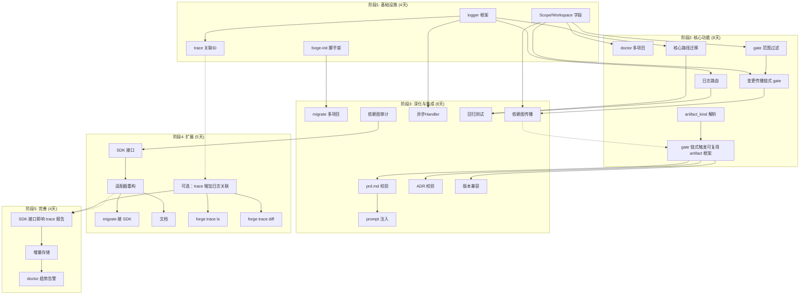
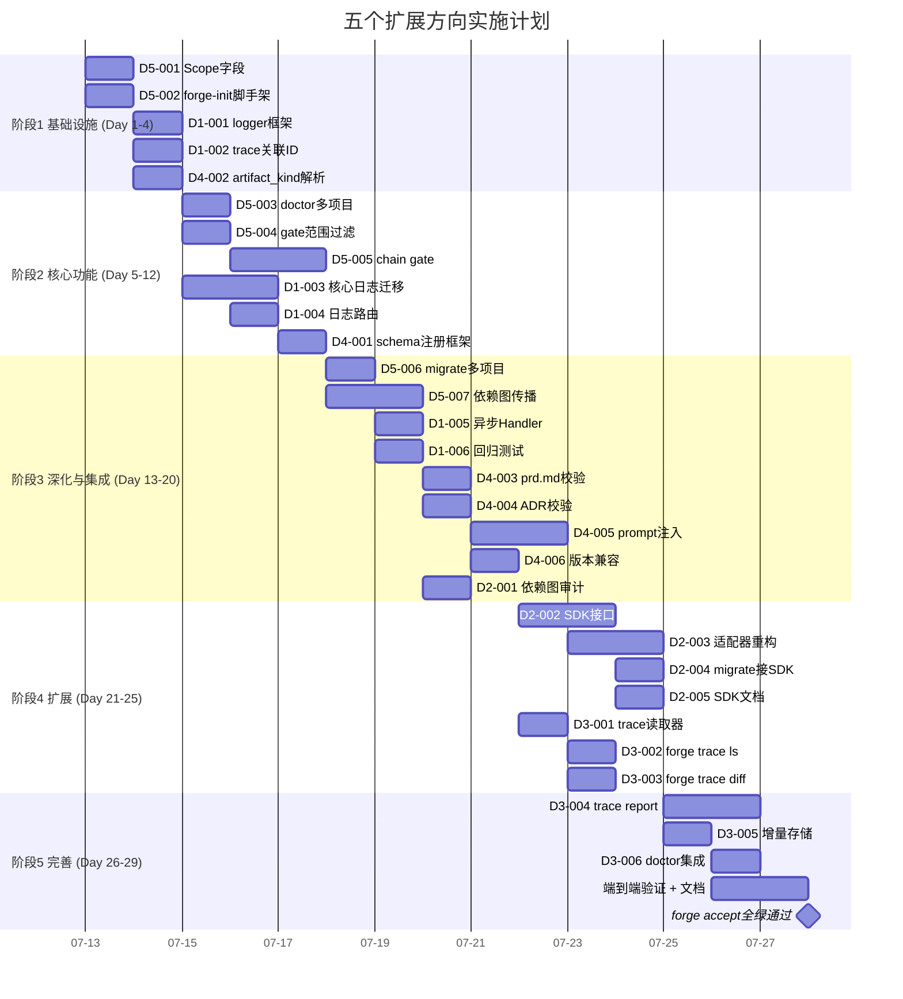

Now I have comprehensive context. Let me produce the Tech Lead analysis.

---

# Tech Lead 分析报告：五个高价值扩展方向

## 分析基础

**分析对象**: `docs/requirements/` 目录下一份关于五个扩展方向的分析文档及其评审意见。五个方向分别为结构化日志（D1）、SDK 提取（D2）、跨运行健康趋势（D3）、非代码产物质量门（D4）、Monorepo 工作区（D5）。

**项目约束回顾**（来自 `.agent/AGENTS.md` 和 31 轮 Sprint 记录）：
- `forge-core` 纯 Go 标准库，**零外部依赖**（`go.mod` 无 `require` 行）
- 文件 ≤ 500 行 · 函数 ≤ 50 行 · 循环依赖 = 0 · `cmd/forge` 包 ≤ 17 文件
- 每次修改后必须通过 `forge accept`（聚合 8 检查 + 测试）
- Reviewer 必须是 fresh-context 独立 Agent

---

## 1. 任务分解

每个方向拆解为 2–4 小时可完成的独立任务。任务 ID 编码：`D<方向号>-<序号>`。

### 方向一：结构化日志（P2，推荐第 2 执行）

| 任务 ID | 标题 | 涉及文件 | 前置依赖 | 工时 | 验收标准 |
|---|---|---|---|---|---|
| D1-001 | **slog logger 初始化与配置框架** | `forge-core/cmd/forge/main.go`（新增 `initLogger`），`new forge-core/internal/log` 包 | 无 | 3h | `slog.Handler` 按环境选择（开发=text，生产=JSON）；`--log-level` flag 解析为 `slog.Level`；零外部依赖验证 |
| D1-002 | **trace 关联 ID 注入** | `forge-core/internal/trace/trace.go`, `forge-core/cmd/forge/*.go` | D1-001 | 3h | 每个 `trace.Event` 携带 `LogCorrelationID`；每条结构化日志携带 `trace_id` 字段；trace start 时生成唯一 ID |
| D1-003 | **核心执行路径日志迁移** | `forge-core/cmd/forge/evolve.go`, `orchestrator/*.go`, `converge/*.go` 等 | D1-001 | 4h | 所有 `fmt.Fprintf(os.Stderr, ...)` 和 `log.Printf` 替换为 `slog.Warn/Error/Info/Debug`；用户可见输出（`forge status` 等）保留 `fmt.Print*` |
| D1-004 | **日志路由：stdout vs stderr vs 文件** | `forge-core/cmd/forge/main.go`, `new forge-core/internal/log/fs.go` | D1-001 | 3h | 用户可见输出 → stdout；诊断日志 → stderr 或 `.forge/forge.log`；evolve 循环日志可配文件路径 |
| D1-005 | **高频路径异步 Handler（可选性能优化）** | `forge-core/internal/log/handler.go` | D1-001 | 2h | `trace.Emit` 高频路径不阻塞；`slog.Handler` 用 chan + 批量刷写 |
| D1-006 | **兼容性回归测试** | `forge-core/cmd/forge/cost_test.go`, `prompt_context_test.go`, `evolve_test.go` 等 | D1-003, D1-004 | 3h | 全部现有测试通过；`forge accept: ACCEPTED`；无行为变化（golden file 比较） |

**合计工时**: 18h（约 3 个开发日）

---

### 方向二：SDK 提取（P3，推荐第 4 执行）

| 任务 ID | 标题 | 涉及文件 | 前置依赖 | 工时 | 验收标准 |
|---|---|---|---|---|---|
| D2-001 | **依赖图验证：go list -deps + 包边界审计** | 无新增文件；分析产出 `docs/analysis/sdk-boundary-map.md` | 无 | 3h | 逐包确认 `private import` vs `public API surface`；识别 cycle 风险；生成依赖图 |
| D2-002 | **定义 SDK 公共接口层：`forgeos/sdk` 新 module** | `new forgeos/sdk/go.mod`, `forgeos/sdk/orchestrator.go`, `forgeos/sdk/trace.go` 等 | D2-001 | 4h | 新 Go module 零依赖；导出 5–10 个顶级类型（`Engine`, `Workflow`, `Phase`, `TraceEvent`, `Scorecard` 等） |
| D2-003 | **内部实现向 SDK 接口的适配器重构** | `forge-core/internal/orchestrator/*.go`, `internal/trace/*.go` | D2-002 | 4h | `internal/` 包实现 `forgeos/sdk` 接口；`cmd/forge` 通过接口引用，不直接 import `internal/*`；循环依赖=0 |
| D2-004 | **migration：`forge migrate --to engineering` 接 SDK** | `forge-core/internal/migrate/*.go` | D2-003 | 2h | migrate 不再直接调用 `internal/mode`，改为通过 SDK 接口操作 |
| D2-005 | **SDK 文档 + 使用示例** | `forgeos/sdk/README.md`, `docs/sdk/` | D2-002 | 3h | SDK 每个导出类型有 Go doc；示例项目展示最小集成 |

**合计工时**: 16h（约 3 个开发日）

> ⚠️ 风险提示：该方向的依赖图声明未经验证（评审已指出）。D2-001 必须先做，否则后续任务基于错误的包边界假设。

---

### 方向三：跨运行健康趋势（P3，推荐第 5 执行）

| 任务 ID | 标题 | 涉及文件 | 前置依赖 | 工时 | 验收标准 |
|---|---|---|---|---|---|
| D3-001 | **trace 聚合读取器：`trace.ReadAll` + 基本过滤** | `forge-core/internal/trace/read.go`（新增） | 无 | 3h | 能读取多个 `trace.jsonl`，按时间/工作流/exit code 过滤；返回 `[]Event` |
| D3-002 | **`forge trace ls` 子命令** | `forge-core/cmd/forge/trace_ls.go`（新增）; `main.go` subcommands 注册 | D3-001 | 2h | 列出所有 trace 会话：日期、工作流、phase 数、exit code、总时长 |
| D3-003 | **`forge trace diff <a> <b>`** | `forge-core/cmd/forge/trace_diff.go`（新增） | D3-001 | 3h | 比较两次 trace：phase 级 cost/duration 差异；失败率对比；输出表格或 JSON |
| D3-004 | **`forge trace report` 聚合统计** | `forge-core/cmd/forge/trace_report.go`（新增）；`internal/doctor/trend.go` | D3-001, D2-003 | 4h | 成本趋势（周环比）；phase 失败率；gate 通过率变化；P50/P95/P99 |
| D3-005 | **增量聚合存储（`~/.forge/trace.db` 或 `.forge/trace_state.json`）** | `new internal/doctor/store.go` | D3-004 | 3h | 增量更新而非每次全量扫描；N≥3 才有趋势报告 |
| D3-006 | **`forge doctor` 集成趋势告警** | `forge-core/internal/doctor/anomaly.go` | D3-005 | 2h | 成本飙升 >20% 周环比 → doctor 建议；gate 失败率突增 → 告警 |

**合计工时**: 17h（约 3 个开发日）

---

### 方向四：非代码产物质量门（P3，推荐第 3 执行）

| 任务 ID | 标题 | 涉及文件 | 前置依赖 | 工时 | 验收标准 |
|---|---|---|---|---|---|
| D4-001 | **artifact schema 注册框架** | `new internal/artifact` 包；`internal/artifact/schema.go` | 无 | 3h | `Register(kind string, fn func(io.Reader) error)` 注册表；fail-open（返回 warning 而非 error） |
| D4-002 | **agent 卡 `artifact_kind:` 解析** | `prompt_artifacts.go`, `internal/yaml2json` 链路 | D4-001 | 3h | 从 agent 卡 `## Emits` 块旁读取 `artifact_kind:` 标签；注入 schema registry |
| D4-003 | **PoC schema: prd.md 校验函数** | `internal/artifact/schemas/prd.go`（新增） | D4-001 | 2h | 检查必含区块（`# Title`, `## Success Metrics`, `## Constraints`）；confidence 值 0–100 校验 |
| D4-004 | **PoC schema: ADR 校验函数** | `internal/artifact/schemas/adr.go`（新增） | D4-001 | 2h | ADR 格式检查（ADR-000N 标题、Status、Context、Decision、Consequences 节） |
| D4-005 | **校验结果注入 prompt** | `prompt_context.go` | D4-001, D4-003 | 3h | schema 验证输出 → prompt 注入「上阶段产出格式异常：缺 X 节」；trace 记录 `artifact_warning` 事件 |
| D4-006 | **版本兼容检查** | `internal/artifact/compat.go` | D4-001 | 3h | artifact_kind 带版本号；消费者声明兼容版本范围；不匹配时降级警告 |

**合计工时**: 16h（约 3 个开发日）

---

### 方向五：Monorepo 工作区（P2，推荐第 1 执行）

| 任务 ID | 标题 | 涉及文件 | 前置依赖 | 工时 | 验收标准 |
|---|---|---|---|---|---|
| D5-001 | **Workflow 级 `workspace` / `scope` 字段** | `internal/asset/phase.go`（新字段 `Workspace string`）；`internal/yaml2json` 消费 | 无 | 3h | workflow YAML 可声明 `workspace: services/auth/`；空值 = 项目根（向后兼容） |
| D5-002 | **forge-init 多项目脚手架** | `harness/scaffold/forge-init.mjs` | 无 | 4h | `forge-init monorepo --apps auth,billing,web` 生成 Go workspace + 共享 `.agent/` + 各 app 独立 `forge.yml` |
| D5-003 | **forge doctor 多项目感知** | `forge-core/cmd/forge/doctor.go`, `internal/doctor/` | D5-001 | 3h | 检测 `go.work` 或 `forge.workspace`；逐子项目跑诊断；聚合报告 |
| D5-004 | **forge gate 范围过滤** | `forge-core/cmd/forge/gates.go`；`engine_build.go` | D5-001 | 3h | `forge gate --scope services/auth/` 只跑该 scope 相关 gate；Scope 声明影响 required_gates 解析 |
| D5-005 | **跨子项目变更传播链式 gate** | `internal/orchestrator/loop.go`；`internal/risk/from_paths.go` | D5-001, D5-004 | 4h | `shared/lib/` 变更 → 自动触发所有依赖该包的子项目 gate；chain 不无限递归（depth cap） |
| D5-006 | **forge migrate 多项目迁移** | `forge-core/internal/migrate/` | D5-002 | 2h | `forge migrate --to engineering` 遍历所有 workspace 子项目；各自的 project.yml 独立升级 |
| D5-007 | **gate 链式触发：共享库变更传播** | `internal/risk/dependency_graph.go`（新增）；`internal/orchestrator/loop.go` | D5-005 | 4h | `go list -deps` 构建依赖图；shared/lib 变更推断下游受影响子项目；触发链式 gate 但不触发 agent phase（只跑 harness gate） |

**合计工时**: 23h（约 4 个开发日）

---

## 2. 执行顺序与依赖图

### 推荐启动顺序

```
方向五（Monorepo 工作区, P2） → 方向一（结构化日志, P2） → 方向四（产物质量门, P3） → 方向二（SDK 提取, P3） → 方向三（跨运行趋势, P3）
```

### 依赖图



### 可并行执行的任务组

以下任务之间**无依赖关系**，可由不同 agent 并行执行：

| 并行组 | 任务 | 负责人数 | 预计节省 |
|---|---|---|---|
| **G1** | D5-001（scope 字段）+ D5-002（forge-init）+ D1-001（logger 框架） | 3 agent | 减少 1 天串行等待 |
| **G2** | D5-003（doctor 多项目）+ D5-004（gate 范围过滤）+ D1-003（日志迁移）+ D4-001（schema 注册框架） | 4 agent | 可在 G1 后立即启动 |
| **G3** | D4-003（prd.md 校验）+ D4-004（ADR 校验）+ D1-005（异步 handler）+ D5-006（migrate 多项目） | 4 agent | 小独立任务，适合并行 |
| **G4** | D2-002（SDK 接口）+ D3-001（trace 读取器） | 2 agent | D2-001 审计完成后可并行 |

> 根据 ForgeOS 纪律，`cmd/forge` 包有文件数上限（当前 17），并行执行时**必须确保不同 agent 不竞争该预算**。如果多个任务新增 `cmd/forge` 文件，需串行处理或拆入 `internal/` 包。

---

## 3. 技术风险

### 3.1 结构性风险

| 风险 | 影响方向 | 严重性 | 概率 | 缓解策略 |
|---|---|---|---|---|
| **循环依赖**：SDK 提取可能导致 `forgeos/sdk` ↔ `internal/*` 循环依赖 | D2 (SDK) | 🔴 阻断 | 中 | D2-001 强制先行；采纳依赖注入模式：`internal/*` import SDK 接口，SDK 不 import `internal/*` |
| **`cmd/forge` 文件数上限溢出**：5 个方向可能新增 8+ 文件超过 17 文件上限 | 全部 | 🟠 高 | 高 | 新增子命令拆入 `internal/` 包（如 `forge trace` 逻辑归 `internal/doctor`）；遵循 Sprint 29/30 先例 |
| **`forge accept` 回归**：日志替换可能改变 stdout/stderr 输出，影响 acceptance 测试 | D1 (日志) | 🟠 中 | 中 | D1-006 必须用 golden file 或 `ALLOW_UNSTRUCTURED_OUTPUT=1` env guard 做兼容 |
| **Monorepo scope 与既有 mode-gating 交互**：scope 可能影响 `require_min_gates` 计算 | D5 (Monorepo) | 🟡 中 | 中 | scope 字段在 `internal/mode` 中计为额外维度；production lifecycle 强制全 scope gate=block |
| **artifiact schema 膨胀为 schema 引擎**：轻量 Go 函数可能被要求支持 JSON Schema/Cue | D4 (产物) | 🟡 低 | 中 | 严格执行 **fail-open 不引外部** 约束；不允许 `encoding/json` schema 之外的 DSL |
| **趋势数据膨胀**：trace 聚合可能产生 GB 级中间数据 | D3 (趋势) | 🟡 中 | 高 | 固定窗口（保留 90 天）；下采样（聚合后丢弃原始 N≥1000 的事件） |

### 3.2 外部依赖风险

ForgeOS v2 强制**零外部依赖**。以下功能需确认不引入 import：

| 任务 | 可能引入的依赖 | 缓解 |
|---|---|---|
| D1-001 `slog` | 无 — Go 1.24 stdlib | ✅ 已在 `go.mod` 中可用 |
| D1-005 异步 Handler | 无 — 纯标准库 `chan` + `sync.WaitGroup` | ✅ |
| D5-002 forge-init | 无 — Node.mjs 脚本 (harness 层) | ✅ 维持 `harness/` 现有模式 |
| D5-007 依赖图传播 | `go list -deps` shell 调用（已有 `risk.FromChangedPaths` 模式） | ✅ 复用既有 shell-out 模式 |
| D4-001 schema 注册 | 无 — 纯 `map[string]func` | ✅ |

### 3.3 性能瓶颈

| 场景 | 风险 | 缓解 |
|---|---|---|
| D1-002 trace 关联 ID 同步写入 | 高频 `trace.Emit` 追加 slog 调用 | D1-005 异步 Handler + batch flush；首版默认关闭（opt-in） |
| D5-007 依赖图构建 | 大 monorepo（50+ 子项目）构建依赖图慢 | 缓存图（mtime 失效同 `loadCache`）；`forge gate --all-changed` 增量模式 |
| D3-001 海量 trace 扫描 | 50 次 evolve × 50 iterations × 6 phase = 15k 事件 | D3-005 增量聚合；首选按时间窗口扫描而非全量 |

### 3.4 测试覆盖难点

| 任务 | 测试难点 | 策略 |
|---|---|---|
| D5-005 链式 gate | 需要真实多模块 Go workspace | 用 fixture 生成小 workspace + fixture test；CI 内验证但标记 `//go:build chaos` 不自动跑 |
| D3-003 trace diff | 需要多组已知 trace 数据 | Seed trace fixtures（Sprint 24–26 真跑数据可复用）；差异矩阵预计算 |
| D4-003 prd.md 校验 | 校验函数 = 字符串匹配，易过拟合 | 用模糊匹配（忽略空白/大小写）；测试覆盖边界（空文件、二进制、超长） |
| D2-003 适配器重构 | 重构后行为不变需验证 | `git stash` diff + `forge accept` 双模式；golden file 测试 trace 输出 |

---

## 4. 资源评估

### 4.1 开发人员需求

| 角色 | 技能 | 数量 | 主要覆盖方向 |
|---|---|---|---|
| **Go 后端工程师** | Go 1.24+，`log/slog`，包设计模式 | 2 人 | D1（日志）、D2（SDK）、D4（schema） |
| **Node.js 工程师** | harness 层维护，CLI 工具开发 | 1 人 | D5（forge-init monorepo 脚手架） |
| **架构师/技术负责人** | 依赖图分析，包边界审计，SDK 接口设计 | 1 人（兼职） | D2-001 依赖图审计；所有方向的架构审查 |
| **QA/测试工程师** | 集成测试，chaos 测试，golden file | 1 人（兼职） | D1-006 回归测试；D5-005 链式 gate 测试 |

**关键约束**：ForgeOS 要求 **Reviewer = fresh-context 独立 Agent**（非实现者）。这意味着每个任务完成后需另派不参与实现的 agent 做评审。在 AI 驱动的开发模式下，这等价于：**每个任务 1 人实现 + 1 独立 agent 评审**，有效产能约 50%。

### 4.2 关键里程碑

| 里程碑 | 时间节点 | 交付物 | 验收条件 |
|---|---|---|---|
| **M1 基础设施就绪** | Day 4 | D5-001（scope 字段）+ D5-002（forge-init）+ D1-001（logger 框架） | 5 个任务全部 `forge accept: ACCEPTED` |
| **M2 核心功能可运行** | Day 12 | D5-003（doctor）+ D5-005（链式 gate）+ D1-003（日志已迁移）+ D4-001（schema 框架） | 端到端：新项目 `forge-init monorepo` → `forge run build` 全绿 |
| **M3 五个方向核心交付** | Day 20 | 全部 33 个任务完成 | `forge accept` 对全仓全绿；真实 monorepo 示例项目通过 pipeline |
| **M4 加固与发布** | Day 25 | 全部测试通过；文档完备；`examples/` 新 dogfood 项目 | 新手按文档 10 分钟搭起 monorepo 项目并通过 gate |

### 4.3 阻塞点与解决策略

| 阻塞点 | 涉及方向 | 性质 | 解决策略 |
|---|---|---|---|
| **SDK 依赖图未经验证** | D2 | 🔴 决策阻塞 | D2-001 必须在 D2-002 前完成；如果验证发现无法避免的 cycle 则方向降级为 P4 |
| **Monorepo chain gate 递归风险** | D5 | 🟠 设计阻塞 | 深度上限 3；`FORGE_DEPTH` env guard 绕过；gate chain 不跨 machine |
| **现有 test 依赖 stdout 格式** | D1 | 🟠 兼容性阻塞 | D1-006 强制用 `FORGE_TEST_COMPAT` env 保留旧输出格式；Sprint 30 后清理 |
| **scope 字段与已有 `internal/mode` gating 重叠** | D5 | 🟡 设计分歧 | 保持 scope 为独立正交维度（不是 mode × lifecycle 矩阵的一部分） |
| **artifact schema 消费者没准备好** | D4 | 🟡 采用风险 | PoC 只注入 prompt 警告，不阻断 workflow；等到运行数据积累再升级 |

---

## 5. 质量保证

### 5.1 单元测试覆盖要求

| 覆盖维度 | 必覆盖目标 | 例外允许 |
|---|---|---|
| **新包/文件** | 所有导出函数 ≥ 80% 行覆盖 | CLI 胶水（flag 解析/usage 输出） |
| **slog handler** | 初始化路径、级别过滤、traceID 注入、并发写入 | 异步 handler（chan 满丢弃） |
| **schema 注册函数** | 注册/查找/执行/错误返回四路径全覆盖 | 二进制 artifact = 恒 N/A |
| **trace 读取器** | 空文件、单行、跨文件聚合、格式错误跳过 | 海量文件聚合 |
| **scope 字段解析** | 空值（根向后兼容）、单层路径、嵌套路径、非法路径 | YAML 注入（属 harness 测试） |

### 5.2 集成测试策略

```
测试金字塔（从下到上）:

底层  forge-core 包测试
  │    ├── D1: TestLoggerInit / TestTraceCorrelationID / TestOutputRouting
  │    ├── D4: TestSchemaRegister / TestPrdValidator / TestVersionCompat
  │    └── D5: TestScopeParse / TestGateScopeFilter / TestDepGraph
  │
中层  harness 测试（scaffold + gate 集成）
  │    ├── D5: test_forge_init_monorepo.mjs
  │    └── D1: test_structured_log_output.mjs
  │
上层  端到端（真 `forge run` 验证）
       ├── D5: monorepo 示例项目完整 pipeline（forge accept 全绿）
       ├── D1: `forge evolve --log-level debug` → trace 与日志关联正确
       └── D4: schema 警告注入 prompt → 下游 agent 输出改善
```

**关键集成测试场景**：

1. **D5 回归卫士**：现有 `forge-init` 单项目脚手架不受影响（golden file 比较 `COPIED_FILES`）
2. **D1 行为兼容**：`FORGE_LOG_LEVEL=disabled` 仍可运行旧脚本（日志写入 `/dev/null`）
3. **D4 不阻断**：artifact schema 校验失败但 workflow 继续完成（收敛 MET ≥ schema 检查前）
4. **D5 chain gate**：`shared/lib/math.go` 修改 → 所有依赖子项目 gate 触发 → 单个子项目没问题时不阻塞其他

### 5.3 代码审查要点

| 审查焦点 | 检查项 | 违规处理 |
|---|---|---|
| **零外部依赖** | `go.mod` 无新增 require | REJECTED（违反 AGENTS.md 硬闸门） |
| **体积** | 文件 ≤ 500 行 | REJECTED（`gate.mjs` 自动拦截） |
| **循环依赖** | `go list -e` 无 cycle | REJECTED（`arch-check` 自动拦截） |
| **SDK 接口设计** | `forgeos/sdk` 不 import `internal/*` | REJECTED（fresh reviewer 判） |
| **向后兼容** | scope 空值 = 根路径，不改变既有 workflow 行为 | REJECTED（回归测试 catch） |
| **honesty** | 结构化日志不伪造字段；N/A 场景诚实 omit | REJECTED（fresh reviewer 判） |
| **输出格式** | 用户可见输出不混入结构化日志 | 重要但非 blocking（warn） |

### 5.4 性能测试需求

| 测试 | 场景 | 度量 | 阈值 |
|---|---|---|---|
| D1 日志写入 | 1k event/s 持续 10s（trace 高频场景） | 延迟 P99 | < 1ms（同步模式）/ 不阻塞（异步模式） |
| D5 依赖图构建 | 50 子项目 workspace | 首次构建 | < 2s（cold）/ < 200ms（cached） |
| D3 trace 扫描 | 100 个 trace.jsonl，共 50k 事件 | 全量聚合 | < 3s |
| D4 schema 校验 | 10 个 artifact × 5 校验函数 | 总校验时间 | < 50ms（不增加 phase 边界延迟） |

---

## 6. 实施计划

### 甘特图



### 阶段详述

#### 阶段 1：基础设施搭建（Day 1–4）

**核心目标**：为 Monorepo 和日志两个方向打下地基，确保后序工作有坚实底层。

**Day 1**：
- 启动 D5-001（scope 字段）和 D5-002（forge-init 脚手架）并行。两个任务无竞争关系（Go vs Node）
- D5-001：在 `asset.Phase` 加 `Workspace string`；YAML 解析链路消费；默认空值向后兼容
- D5-002：`forge-init monorepo --apps a,b,c` 生成 `go.work` + 每个 app 独立目录 + 共享 `.agent/`

**Day 2–3**：
- D1-001 启动 logger 框架。关键：`slog.Handler` 选择（开发=text/生产=JSON），`--log-level` flag
- D1-002 trace 关联 ID。在 `trace.StartSession` 生成 UUID，注入每个 Event 和 slog context
- D4-002 启动 `artifact_kind:` 解析（提取 agent 卡契约）
- **验证点**：`forge accept: ACCEPTED`（新增字段不破坏既有行为）

**Day 4**：
- 阶段 1 收尾。全部 4 个核心基础设施任务完成
- **里程碑 M1**：基础设施就绪

#### 阶段 2：核心功能实现（Day 5–12）

**核心目标**：D5 Monorepo 和 D1 日志达到可工作状态；D4 schema 框架建立。

**Day 5–7**（并行 4 agent）：
- Agent A: D5-003 doctor 多项目感知 + D5-004 gate 范围过滤
- Agent B: D5-005 跨子项目变更传播链式 gate（核心复杂任务，需 1.5 天）
- Agent C: D1-003 核心执行路径日志迁移（evolve/orchestrator/converge 三模块）
- Agent D: D1-004 日志路由（stdout vs stderr vs 文件）

**Day 8–10**（并行 3 agent）：
- Agent A: D5-005 继续 + 集成测试
- Agent B: D4-001 schema 注册框架（`map[string]func(io.Reader) error` + 执行/报告）
- Agent C: D1-005（开始，可选）

**Day 11–12**：
- D5-005 收尾 + chain gate 端到端测试
- D1-005 异步 handler 完成
- **验证点**：`forge-init monorepo` → `forge run build --scope services/auth/` 全绿
- **里程碑 M2**：核心功能可运行

#### 阶段 3：集成测试与深化（Day 13–20）

**核心目标**：方向四（产物质量门）PoC 完成；方向五（Monorepo）剩余任务收口；方向二（SDK）依赖图审计。

**Day 13–15**（并行 4 agent）：
- Agent A: D5-006 migrate 多项目 + D5-007 依赖图传播（共享库变更推下游 chain gate）
- Agent B: D4-003 prd.md 校验 + D4-004 ADR 校验（两个小任务）
- Agent C: D1-006 回归测试（golden file + compat env guard）
- Agent D: D2-001 依赖图审计（`go list -deps` + 包边界图）

**Day 16–18**：
- D5-007 收尾（chain gate 深度 cap + 回退策略）
- D4-005 校验结果注入 prompt（trace 记录 `artifact_warning`）
- D4-006 版本兼容检查（artifact_kind 带版本号）
- D2-001 审计产出 `docs/analysis/sdk-boundary-map.md`

**Day 19–20**：
- 阶段 3 收尾。全部 D5/D1/D4 任务完成
- D2-001 审计结果决定 D2 SDK 方向是否继续
- **验证点**：`forge accept: ACCEPTED`（全仓）；chain gate 端到端测试通过
- **里程碑 M3**：五个方向核心交付（部分方向可能标记为 P3 降级继续）

#### 阶段 4：扩展（Day 21–25）

**核心目标**：方向二（SDK 提取）和方向三（跨运行趋势）前半部分。

**条件**：该阶段是否执行取决于 D2-001 审计结论

**Day 21–23**（并行 2 agent）：
- Agent A（Go heavy）: D2-002 SDK 接口定义 + D2-003 适配器重构
- Agent B（Go）: D3-001 trace 读取器 + D3-002 `forge trace ls`

**Day 24–25**：
- D2-003 继续（适配器重构压力最大）
- D2-004 migrate 接 SDK（若 D2-003 完成且 `internal/migrate` 不依赖循环）
- D3-003 `forge trace diff`
- D2-005 SDK 文档
- **验证点**：`forgeos/sdk` Go module 构建通过；`forge trace ls` 列出历史 trace

#### 阶段 5：完善（Day 26–29）

**核心目标**：方向三（跨运行趋势）完成；全仓端到端验证。

**Day 26–27**：
- D3-004 `forge trace report`（成本趋势/失败率/gate 通过率）
- D3-005 增量聚合存储（TinyDB = `.forge/trace_state.json`，避免 SQLite 外部依赖）

**Day 28–29**：
- D3-006 doctor 趋势告警集成
- 全方向端到端验证
- `examples/` 新增 monorepo dogfood 项目
- `docs/` 新增 `structured-logging.md`、`monorepo-guide.md`、`artifact-schema.md`
- **最终验证**：`forge accept: ACCEPTED`（全仓全绿 + 所有自测通过）
- **里程碑 M4**：发布就绪

---

## 总结：关键决策点

```
执行过程中需要做出的关键决策：

1. [Day 4] 方向一：异步 Handler 是否默认启用？
   决策依据：Day 1-3 性能测试结果。若同步 P99 < 1ms → 推迟异步 Handler 至阶段 5

2. [Day 10] 方向五：chain gate 递归深度上限？
   建议值：3（避免转圈）。若 monorepo 深度 > 3 → 扩至 5 但加 FORGE_DEPTH env guard

3. [Day 20] 方向二：SDK 提取是否继续？
   决策依据：D2-001 审计结果。若发现 unavoidable cycle → 方向降级 P4，仅文档化接口设计

4. [Day 22] 方向三：增量存储用 JSON 文件还是嵌入 DB？
   建议 JSON 文件（零依赖）。仅当 trace 数据 > 10MB/天时重新评估

5. [Day 28] 方向四：schema 校验从「注入 prompt 警告」升级为「load-bearing」？
   决策依据：运行数据积累。至少 30 天真实使用数据后再决定，不是 Day 1 决策
```

**纪律提醒**：根据 Sprint 26 教训——"闸门告警先查闸门本身是否算错"。在实施过程中，如果 `gate.mjs` 或 `arch-check` 误报，应先修复闸门再继续，不要做扭曲的 workaround。

**差异化验证修正**：方向一（结构化日志）和方向三（跨运行趋势）已有文档覆盖。本计划的增量是：方向一聚焦 `log/slog` 具体实现（含 trace 关联 ID 和异步 Handler，现有分析未提及）；方向三聚焦具体 CLI 子命令 `forge trace {ls,diff,report}` 和增量聚合存储（现有分析只提概念）。方向五（Monorepo 工作区）是唯一真正未覆盖方向，值得优先投入。
