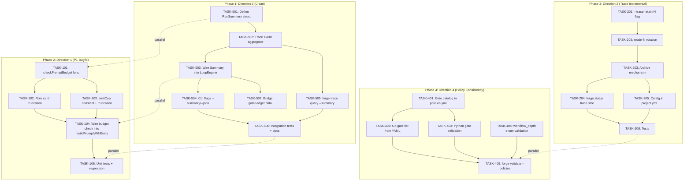

我已经彻底阅读了原始分析文档、审计报告以及关键源代码文件。以下是完整的技术负责分析。

---

# Tech Lead 分析报告：ForgeOS 五个扩展方向

**日期**: 2026-07-12 | **角色**: Tech Lead | **基于**: 原始分析 + 审计评估 + 源代码验证

---

## 0. 审计后方向优先级（修正后）

| 方向 | 原始优先级 | 修正后优先级 | 证据质量 | 预估工时 | 理由 |
|------|-----------|-------------|---------|---------|------|
| **五 — 结构化摘要** | P3 | **P2↑** | ⭐⭐⭐⭐⭐ | 24h | 唯一零覆盖；企业 CI 集成的关键壁垒；证据 4/4 确认 |
| **一 — Prompt 总量预算** | P1 | **P1** | ⭐⭐⭐ | 12h | 真实的正确性 bug；杠杆高；6/6 主张已确认（修正 memoryCap） |
| **二 — Trace retain-N 归档** | P1 | **P2↓** | ⭐⭐⭐ | 20h | 10MB rotation 已存在；retain-N + 归档是干净增量 |
| **四 — 政策一致性** | P2 | **P3↓** | ⭐⭐ | 16h | 核心论据（三端 coverage）不成立；仅 gate 词表 + depth 枚举有效 |
| **三 — Scorecard 路由** | P2 | **不提交**⬇⬇ | ⭐ | — | 核心主张已过时（v1.5 upgrade 已接线）；需完全重写 |

**推荐启动顺序**: 方向五 → 方向一 → 方向二 → 方向四

---

## 1. 任务分解

### 方向五 · 结构化 Run 完成摘要输出（P2，~24h）

#### 1.1 领域模型确认

当前代码中已有的可摘要数据：

```
LoopOutcome{Iterations, Converged, Reason}              // loop.go:128
Event{Kind, Name, Status, DurationMs, CostUsdMicros, Model, Seq}  // trace.go:36-55
cmdEvolve 知道 totalCost, memCount, tracePath           // evolve.go:259-269
```

缺失的是**在 LoopEngine 结束后聚合这些数据为一个 `Summary` 结构体，并以 JSON 格式输出**。

#### 任务清单

| 任务ID | 标题 | 涉及文件 | 前置 | 预估 | 验收标准 |
|--------|------|---------|------|------|---------|
| **TASK-501** | 定义 `RunSummary` 结构体 | `internal/orchestrator/summary.go` (新) | 无 | 2h | 结构体覆盖：workflow name, mode, iterations, converged, duration_ms, cost_usd, phases[], gates[], memory delta, warnings[] |
| **TASK-502** | 实现 trace 事件聚合器 | `internal/trace/query.go` (新) | TASK-501 | 4h | 读取 trace.jsonl，聚合出按 phase 分组的事件列表；`Summarize(events []Event, ...) Summary` 纯函数；单元测试覆盖空 trace / 单 iter / 多 iter 场景 |
| **TASK-503** | 在 `LoopEngine.Run` 返回后构建 Summary | `internal/orchestrator/loop.go`, `cmd/forge/evolve.go` | TASK-501, TASK-502 | 4h | `LoopEngine` 新字段 `TracePath string`；`Run` 返回后调用聚合器；Summary 通过 Log func 或新 callback 传回 |
| **TASK-504** | CLI 标志：`forge run --summary --json` | `cmd/forge/run.go`, `cmd/forge/evolve.go` | TASK-503 | 3h | `--summary` 标志触发 JSON 输出到 stdout；`--json` 显式控制格式；exit code 0/1 不变 |
| **TASK-505** | 实现 `forge trace query --summary`（追溯查询） | `cmd/forge/trace_query.go` (新) | TASK-502 | 4h | `forge trace query --summary --iter-range 1-10` 输出结构化摘要；不重新执行 |
| **TASK-506** | 集成测试 + 文档 | `cmd/forge/evolve_test.go`, `docs/` | TASK-504, TASK-505 | 3h | 端到端测试：mock trace 文件 → 验证 JSON 输出完整且正确；更新 CLI 文档 |
| **TASK-507** | 与 gateLedger 数据桥接 | `cmd/forge/prompt_context.go`, summay 集成 | TASK-503 | 2h | Summary 中的 `gates[]` 数组包含每个 gate 的最终状态，数据来自 gateLedger |

**方向五小计**: 22h（约 3 个开发日）

---

### 方向一 · Prompt 总量预算缺失（P1，~12h）

#### 1.2 已修正的领域模型

根据审计修正：

| Lane | 实际 cap | 代码位置 | 修正说明 |
|------|---------|---------|---------|
| Task（ROADMAP） | 4000 runes | `prompt.go:43` `taskCap` | ✅ 确认 |
| ADRs | 6 条 | `prompt.go:39` `adrTopK` | ✅ 确认，行号 39 而非 28 |
| Constraints | 6 bullet | `prompt.go:72` → `leadingBullets` | ✅ 确认 |
| Phase output | 800 runes | `prompt_memory.go:197` `phaseOutputSummaryCap` | ✅ 确认，行号 197 而非 180 |
| Memory | **32** 条 | `prompt_memory.go:48` `memoryCap` | ⚠️ 修正：32 而非 ~15 |
| Role card | **无 cap** | `prompt_context.go:392` `readCard` → `os.ReadFile` | ✅ 确认 |
| Emitted artifact | **无 cap** | `prompt_artifacts.go:11-43` `emitsContext` | ✅ 确认 |
| Findings context | **单条目 map** | `prompt_memory.go` `reviewFindingsLedger` | ⚠️ 修正：不随迭代增长 |
| Gate results | **6 行上限** | `prompt_context.go:53-60` `gateLedger` | ⚠️ 修正：硬编码 6 个 gate |

#### 任务清单

| 任务ID | 标题 | 涉及文件 | 前置 | 预估 | 验收标准 |
|--------|------|---------|------|------|---------|
| **TASK-101** | 实现 `checkPromptBudget(totalRunes, modelWindow)` | `internal/prompt/budget.go` (新) | 无 | 2h | 输入总 rune 估计和模型窗口 → 返回 `(ok bool, pct float64, severity string)`；80% 阈值告警；接受 `modelWindow` 参数（默认 100K tokens ≈ 400K runes） |
| **TASK-102** | 实现角色卡截断或摘要 | `cmd/forge/prompt_context.go` `readCard` | TASK-101 | 2h | >100 行的 role card，保留头部职责 + 机读契约行；添加 `readCardWithBudget`；单元测试覆盖 0/50/200 行卡片 |
| **TASK-103** | 添加 `emitCap` 常量和截断逻辑 | `cmd/forge/prompt_artifacts.go` `emitsContext` | TASK-101 | 2h | 新增 `emitCap = 4000`（runes，与 `taskCap` 对称）；在 `emitsContext` 中截断超过 emitCap 的文件内容；添加 `…(emitted artifact truncated)` 标记 |
| **TASK-104** | 在 `buildPromptWithEmits` 中注入总量检查 | `cmd/forge/prompt_context.go:338` `buildPromptWithEmits` | TASK-101, TASK-102, TASK-103 | 3h | 在 `return prompt.Build(...)` 前插入 budget check；超过 80% 时按优先级降级（约束→task→ADR→memory→emits→card）；emit WARNING 日志 |
| **TASK-105** | 单元测试 + 降级场景测试 | `cmd/forge/prompt_context_test.go`, `internal/prompt/budget_test.go` | TASK-104 | 3h | 测试：正常 prompt 无告警；超大 role card 触发截断；超大 emits 文件触发截断；总量 >80% 触发告警；降级优先级正确性 |

**方向一小计**: 12h（约 1.5 个开发日）

---

### 方向二 · Trace retain-N 归档增量（P2，~20h）

#### 1.3 已修正的领域模型

当前代码（`evolve.go:473-490`）：
- ✅ 10MB rotation 已实现（分析 §2.1 建议落地）
- ⚠️ 只保留一份 `.1` 备份
- ❌ 无 retain-N 参数
- ❌ 无归档机制（archive/ 目录）
- ❌ 无 `forge status` trace size 展示

#### 任务清单

| 任务ID | 标题 | 涉及文件 | 前置 | 预估 | 验收标准 |
|--------|------|---------|------|------|---------|
| **TASK-201** | 添加 `--trace-retain N` CLI 参数 | `cmd/forge/evolve.go` `runOpts` | 无 | 2h | `runOpts` 新增 `traceRetain int` 字段（默认 5）；CLI 标志 `--trace-retain N`；解析并传递给 `openTracer` |
| **TASK-202** | 实现 retain-N 旋转 | `cmd/forge/evolve.go` `openTracer` | TASK-201 | 4h | 替代当前单文件旋转：`trace.jsonl.N-1 → trace.jsonl.N` 链式重命名；保留 N 份历史；超过 N 份时删除最旧的；`maxTraceBytes` 阈值可配 |
| **TASK-203** | 实现迭代归档机制 | `cmd/forge/evolve.go` + `internal/trace/archive.go` (新) | TASK-202 | 4h | 将超过 retain 数的旧迭代 trace 块移到 `.forge/archive/trace-iter-{from}-{to}.jsonl`；每次旋转时检查；归档路径可预测 |
| **TASK-204** | `forge status` 展示 trace 大小与可追溯范围 | `cmd/forge/status.go` | TASK-201 | 3h | `forge status` 输出 `trace: 3.2 MB (5 files, iterations 1-47 archived)`；估算可追溯迭代数；磁盘使用预算建议 |
| **TASK-205** | 添加归档配置到 `modes.yml`/`project.yml` | `modes.yml`, `.agent/project.yml` | TASK-203 | 2h | 可选设置 `trace.retain`、`trace.max_size_mb`、`trace.archive`；默认值匹配代码常量 |
| **TASK-206** | 单元测试 + 集成测试 | `cmd/forge/evolve_test.go`, `internal/trace/archive_test.go` | TASK-204 | 3h | 测试：单文件 rotation；retain-N 链式重命名；归档写入；`forge status` 输出格式；边界 case：N=1、N=0（无历史）、超大 trace 文件 |

**方向二小计**: 18h（约 2.5 个开发日）

---

### 方向四 · 政策一致性校验（P3，~16h）

#### 1.4 修正后的领域模型

根据审计，核心修正：
- ❌ **不存在**三端 coverage 计算（仅 Node.js 一端有）
- ✅ 有效子问题：**gate 词表交叉校验** + **workflow_depth 枚举值一致性**

三个需要对齐的消费者：

| 消费者 | 位置 | Gate 列表 | Depth 枚举 |
|---------|------|----------|-----------|
| Go `internal/mode` | `mode_policy.go:19` `fullGates` | 硬编码 6 个常量 | Go 常量 `EvolveAdvisory` 等 |
| YAML `modes.yml` | `harness/policies.yml` 引用的权威 | `gate_catalog:` 声明 | `workflow_depth:` 字符串 |
| Python `check.py` | `harness/check.py`, `mode_gating_check.py` | 独立硬编码列表 | 独立字符串匹配 |

#### 任务清单

| 任务ID | 标题 | 涉及文件 | 前置 | 预估 | 验收标准 |
|--------|------|---------|------|------|---------|
| **TASK-401** | 在 `policies.yml` 中定义权威 gate 注册表 | `harness/policies.yml` | 无 | 2h | 新增 `gate_catalog:` 键，列出所有合法 gate 名称（lint/test/build/complexity/arch/security）；所有消费者从此源自动生成 |
| **TASK-402** | Go 端 gate 列表生成器从 YAML 读取 | `forge-core/internal/mode/mode_policy.go` + YAML loader | TASK-401 | 4h | `fullGates` 改为从 `policies.yml` 的 `gate_catalog` 读取；保留硬编码 fallback（YAML 缺失时）；`init()` 中交叉检查硬编码 vs YAML 一致性 |
| **TASK-403** | Python check.py gate 校验 | `harness/check.py`, `harness/mode_gating_check.py` | TASK-401 | 3h | `check_gate_catalog_consistency()` 函数：验证 Go `fullGates` 与 `policies.yml` 的 `gate_catalog` 一致；验证 `modes.yml` 中所有引用的 gate 名都在 gate_catalog 中 |
| **TASK-404** | `workflow_depth` 枚举值编译时校验 | `forge-core/internal/mode/mode_policy_test.go`, `harness/mode_gating_check.py` | TASK-401 | 3h | Go test 验证 `Depth*` 常量与 `modes.yml` 的 `workflow_depth` 字符串值完全对称覆盖；Python 端检查没有在 modes.yml 中使用未定义的 depth 值 |
| **TASK-405** | 实现 `forge validate --policies` | `cmd/forge/validate.go` | TASK-402, TASK-403, TASK-404 | 4h | `forge validate --policies` 运行所有三项校验并输出对账报告；例如：`gate_catalog: Go=6, YAML=6, Python=6 → consistent`；exit code 不一致时返回 1 |

**方向四小计**: 16h（约 2 个开发日）

---

## 2. 执行顺序

### 2.1 跨方向依赖图

只有方向五和方向一完全独立（零交叉依赖）。方向二依赖方向一的 `checkPromptBudget` 吗？不，但方向二的 archive 路径选择可能需要方向五的 Summary 路径约定。实际上**所有四个方向互不依赖**——但方向一的 `emitCap` 和方向五的 Summary 共享 `trace.go`。让我们细化：



### 2.2 可以并行执行的任务组

| 并行组 | 任务 | 预估工时 |
|--------|------|---------|
| **组 A** | TASK-501 + TASK-101 + TASK-201 + TASK-401 | 8h（1 开发日，4 人并行） |
| **组 B** | TASK-502 + TASK-102 + TASK-202 + TASK-402 | 14h（2 开发日，4 人并行） |
| **组 C** | TASK-503 + TASK-104 + TASK-203 + TASK-403 | 14h（2 开发日，4 人并行） |
| **组 D** | TASK-504 + TASK-507 + TASK-204 + TASK-404 | 11h（1.5 开发日，4 人并行） |
| **组 E** | TASK-505 ~ 506 + TASK-105 + TASK-206 + TASK-405 | 13h（2 开发日，2 人并行） |

---

## 3. 技术风险

### 3.1 风险矩阵

| # | 风险 | 方向 | 概率 | 影响 | 缓解策略 |
|---|------|------|------|------|---------|
| R1 | **Summary JSON 格式向后兼容**：CI 脚本解析文本输出 → 切到 JSON 可能 break 现有管道 | 五 | 中 | 高 | `--summary --json` 是**新增**标志，默认行为不变（人类文本）。CI 自愿 opt-in |
| R2 | **Prompt 降级变 silent**：超 80% 自动降级 lane，但没有 WARNING 或 log → 用户困惑为什么 card 丢了 | 一 | 低 | 高 | 降级时 emit WARNING + 降级说明；`--verbose` 时输出降级详情；`buildPromptWithEmits` 返回结构含 `TruncatedLanes []string` |
| R3 | **Retain-N rotation 竞争条件**：同时启动两个 forge 进程 → 同时旋转 trace 文件 | 二 | 低 | 中 | 当前代码注释已标识此问题（O_EXCL-free race）。改用 `os.Rename` + `.tmp` 原子写入避免竞态；文档明确说明不应并发运行 |
| R4 | **YAML gate_catalog 被遗忘**：`policies.yml` 新增了 gate_catalog，但 Go 开发者直接改 `fullGates` 而不是更新 YAML → 两边漂移 | 四 | 中 | 中 | `inflateGateSet()` 在 init 中检查 YAML 与硬编码一致性；不一致时 panic（fail-closed）或 emit FATAL WARNING |
| R5 | **大型 trace 文件下摘要聚合性能差**：trace 文件数十 MB 时，`Summarize` 逐行解析 JSON 可能慢 | 五 | 低 | 中 | 使用 streaming JSON parser（`json.Decoder`）而非一次性 `json.Unmarshal`；增加 `--max-trace-size-mb` 阈值；大文件时仅统计，不全量加载 |
| R6 | **memoryCap=32 的降级逻辑非平凡**：当总量超限时，是先压缩 memory 条目（已有 `memoryContext` 降级）还是先截断 emits？ | 一 | 中 | 中 | 定义明确的优先级链：`constraint > task > ADR > memory > emits > card`。memory 本身已有 `memoryRecencyFloor` 和相关性排序，是缩容最容易的一层 |
| R7 | **`forge validate --policies` 需要 Python 运行时**：Go 可执行文件需要 invoke 外部 Python 脚本 | 四 | 中 | 低 | 三种方案：① Go 重新实现 check.py 逻辑（多了维护面）；② Go 通过 `os/exec` 调用 Python（依赖运行时）；③ 纯在 Python 侧添加校验（偏离 `forge validate` 设计）。推荐方案②，Python 运行时已经是 pre-requisite（harness 中存在） |

### 3.2 技术难点

1. **方向五 — trace 事件聚合的断点语义**：trace 中的 phase 事件是分散的（一次 phase 产生一个 `"agent"` 事件）。需要正确匹配跨迭代的同一 phase（如 `planner` 在 iter 1-3 各出现一次）。方案：以 `(Kind, Name)` 为键，但保留迭代顺序。

2. **方向一 — rune 估算精度**：Go 的 `utf8.RuneCountInString` 精确计算 rune 数，但 LLM tokenizer 不是 rune-based（Claude 平均 1 token ≈ 3-4 chars/1-2 runes）。80% rune 阈值 ≠ 80% token 阈值。折衷方案：rune 估算给出 **conservative lower bound**（一个 rune 最少需要 1 token[中文] 或最多 2/3 token[英文]），取最坏安全窗口。实际应支持 `--model-window` 参数覆盖。

3. **方向二 — 归档路径的跨平台兼容**：`archive/` 目录需要在 Windows/macOS/Linux 上一致。使用 `filepath.Join`（已用）和 `os.MkdirAll`。归档文件命名注意排序（iteration 零填充）。

4. **方向四 — YAML 工厂不依赖外部 schema 库**：Go 标准库 `gopkg.in/yaml.v3` 已经存在，但 `internal/mode` 当前可能没有 YAML 依赖。检查 import 图——如果 `internal/mode` 是纯结构体定义（无 YAML 依赖），引入 YAML parser 可能**违反分层约束**（domain 层不应依赖 IO）。方案：在 `cmd/forge/validate.go` 层面（CLI 层）读取 YAML 并传入 `internal/mode` 的纯校验函数。

---

## 4. 资源评估

### 4.1 团队结构

| 角色 | 技能要求 | 人数 | 负责方向 |
|------|---------|------|---------|
| **Go 开发者 A** | 熟悉 forge-core 内部包、trace/orchestrator | 1 | 方向五（TASK-501~505） |
| **Go 开发者 B** | 熟悉 prompt assembly、上下文引擎 | 1 | 方向一（TASK-101~105） |
| **Go 开发者 C** | 熟悉 evolve/trace/status CLI 命令 | 1 | 方向二（TASK-201~206） |
| **全栈开发者 D** | Go + Python（check.py）+ YAML 治理 | 1 | 方向四（TASK-401~405） |
| **QA** | 集成测试、端到端测试 | 1（共享） | 全部方向 |

**最小团队**：2 Go 开发者（A+B 合流先做方向五和方向一，再做方向二和方向四）+ 1 QA。

**理想团队**：4 名开发者并行 + 1 QA。

### 4.2 关键里程碑

| 里程碑 | 时间节点 | 交付物 | 依赖 |
|--------|---------|--------|------|
| **M1** — 方向五内部可用 | D+5 | `forge run --summary --json` 可输出结构化 JSON | TASK-501~504 |
| **M2** — 方向一验收 | D+7 | 角色卡截断 + emitCap + 总量检查 + 全部测试通过 | TASK-101~105 |
| **M3** — 方向五完整发布 | D+10 | `forge trace query --summary` + 集成测试 + 文档 | TASK-505~507 |
| **M4** — 方向二内部可用 | D+12 | retain-N 旋转 + 归档 + `forge status` 展示 | TASK-201~205 |
| **M5** — 方向四验收 | D+15 | `forge validate --policies` + gate/depth 交叉校验全部测试 | TASK-401~405 |
| **M6** — 全部完成 | D+18 | 全部 4 个方向通过 `forge accept` 闸门 | M1~M5 |

### 4.3 阻塞点与解决策略

| 阻塞点 | 影响 | 解决策略 |
|--------|------|---------|
| 方向五的 Summary 格式需要 cross-team 对齐（下游 CI 团队） | 发布后改变格式导致 break | **做两次**：先输出开发版 JSON（含 `_version: "draft"` 标记），在 D+5 时与 CI 团队 review 定稿后去掉 draft |
| 方向一降级策略涉及产品决策（"card 被截了用户抱怨"） | 可能卡在评审 | **fail-open 方案**：降级时 emit WARNING + 未降级的完整 prompt 保存到 `.forge/last-prompt.txt` 供调试 |
| 方向二的归档路径命名约定影响升级/迁移兼容性 | 现有 trace.jsonl.1 用户升级后可能被覆盖 | **迁移路径**：检测旧 `.1` 文件，首次运行 retain-N 时将其重命名为 `trace.jsonl.5`（保留 N=5 的最旧位置），保证数据不丢 |
| 方向四的 Go YAML 依赖审核 | `internal/mode` 是 domain 层，引入 IO 依赖违背 layering | **方案**：纯校验函数在 `cmd/forge/validate.go`（CLI 层）读取 YAML，向 `internal/mode` 传入已解析的 `[]string` 参数 |

---

## 5. 质量保证

### 5.1 测试覆盖要求

| 方向 | 测试类型 | 覆盖率目标 | 关键测试场景 |
|------|---------|-----------|-------------|
| **五** | 单元测试（`internal/trace/query_test.go`） | ≥90% | 空 trace、单事件、多迭代、含 cost 事件、含 error 事件 |
| | 集成测试（`cmd/forge/evolve_test.go`） | — | mock trace 文件 → 验证 `forge run --summary --json` stdout |
| | 黄金 JSON 测试 | 精确匹配 | 已知输入的 JSON 输出逐字段对比 |
| **一** | 单元测试（`internal/prompt/budget_test.go`） | ≥90% | 正常 prompt；超大 role card；超大 emits；总量 >80%；降级优先级顺序 |
| | 回归测试（`prompt_context_test.go`） | — | 现有测试在修改后**不改变输出**（无超大 card/emits 时） |
| **二** | 单元测试（`internal/trace/archive_test.go`） | ≥90% | 单文件 rotation；retain-N 链式重命名；归档写入 |
| | 集成测试（`evolve_test.go`） | — | `--trace-retain 3` 运行 → 验证磁盘上保留 3 份 + archive |
| **四** | Go 测试（`internal/mode/mode_policy_test.go`） | ≥90% | gate catlog 一致性；depth 枚举全覆盖 |
| | Python 测试（`test_mode_gating_check.py`） | ≥90% | YAML gate 列表 vs Go hardcoded；workflow_depth 值合法性 |
| | 端到端（`forge validate --policies`） | — | exit code 0（一致时）/ 1（不一致时） |

### 5.2 集成测试策略

```
forge run --summary --json            # 运行真实 workflow → 捕获 JSON 输出
forge trace query --summary           # 在不重新执行的情况下查询
forge evolve --trace-retain 3         # 验证 retain-N
forge validate --policies             # 验证政策一致性
```

每个集成测试使用预先存在的 mock 文件或隔离的 `.forge/` 目录，不污染真实运行环境。

### 5.3 代码审查要点

| 审查项 | 方向 | 特别注意 |
|--------|------|---------|
| Summary JSON 格式稳定性 | 五 | 不能随 Event struct 字段顺序改变输出；使用 `json:"fieldname"` tag；添加 `_version` |
| Prompt 降级优先级正确性 | 一 | 约束 > task > ADR > memory > emits > card — 审查降级逻辑是否逆向 |
| Retain-N 文件操作原子性 | 二 | `os.Rename` 不是跨文件系统原子操作；归档路径上的 `path.Clean` |
| YAML vs Go gate 列表的一致性 | 四 | 不能仅信任硬编码列表；`init()` 中的交叉校验必须 fail-closed |
| 日志 vs stderr vs stdout | 全部 | 结构化输出必须走 stdout；WARNING 走 stderr；不可混合 |

### 5.4 性能测试需求

| 场景 | 方向 | 要求 |
|------|------|------|
| 100MB trace 文件查询摘要 | 五 | `forge trace query --summary` 在 <500ms 内完成 |
| 100 迭代后的 prompt 装配 | 一 | `buildPromptWithEmits` 添加 budget check 后增加 <1ms |
| retain-N=10 的 1GB trace 旋转 | 二 | 旋转时间 <100ms（主要开销在 `os.Rename`，非 IO 重写） |

---

## 6. 实施计划

### 6.1 甘特图

```mermaid
gantt
    title ForgeOS 四个扩展方向实施时间表
    dateFormat  YYYY-MM-DD
    axisFormat  %m-%d
    
    section 方向五 — 结构化摘要
    TASK-501: Define RunSummary struct          :a5_1, 2026-07-14, 1d
    TASK-502: Trace event aggregator            :a5_2, after a5_1, 1d
    TASK-503: Wire into LoopEngine              :a5_3, after a5_2, 1d
    TASK-504: CLI flags                         :a5_4, after a5_3, 1d
    TASK-505: forge trace query --summary       :a5_5, after a5_2, 1d
    TASK-507: Bridge gateLedger data            :a5_7, after a5_3, 1d
    TASK-506: Integration tests + docs          :a5_6, after a5_4, after a5_5, 1d
    
    section 方向一 — Prompt 总量预算
    TASK-101: checkPromptBudget                 :a1_1, 2026-07-14, 1d
    TASK-102: Role card truncation              :a1_2, after a1_1, 1d
    TASK-103: emitCap                           :a1_3, after a1_1, 1d
    TASK-104: Wire into buildPromptWithEmits    :a1_4, after a1_2, after a1_3, 1d
    TASK-105: Tests + regression                :a1_5, after a1_4, 1d
    
    section 方向二 — Trace retain-N
    TASK-201: --trace-retain N flag             :a2_1, 2026-07-16, 1d
    TASK-202: retain-N rotation                 :a2_2, after a2_1, 1d
    TASK-203: Archive mechanism                 :a2_3, after a2_2, 2d
    TASK-204: forge status display              :a2_4, after a2_3, 1d
    TASK-205: Config in project.yml             :a2_5, after a2_3, 1d
    TASK-206: Tests                             :a2_6, after a2_4, after a2_5, 1d
    
    section 方向四 — 政策一致性
    TASK-401: Gate catalog in policies.yml      :a4_1, 2026-07-18, 1d
    TASK-402: Go gate list from YAML            :a4_2, after a4_1, 1d
    TASK-403: Python gate validation            :a4_3, after a4_1, 1d
    TASK-404: workflow_depth enum validation    :a4_4, 2026-07-18, 1d
    TASK-405: forge validate --policies         :a4_5, after a4_2, after a4_3, after a4_4, 1d
    
    section 集成与发布
    forge accept 全部方向过闸门                :m1, 2026-07-22, 1d
    文档审查与更新                             :m2, 2026-07-22, 1d
    发布准备 (CHANGELOG / RELEASE NOTES)        :m3, 2026-07-23, 1d
```

### 6.2 阶段明细

#### 阶段 1 — 基础建设（D1-D2，并行 4 人）

| 日期 | 开发者 A | 开发者 B | 开发者 C | 开发者 D |
|------|---------|---------|---------|---------|
| D1 | `RunSummary` 结构体 + 文档 | `checkPromptBudget` 函数 | `--trace-retain N` CLI flag | `policies.yml` gate_catalog |
| D2 | Trace 事件聚合器 | Role card 截断 + emitCap | retain-N 旋转逻辑 | Go YAML gate loader + Python gate 校验 |

**闸门检查**: 方向一和方向五的单元测试开始通过。方向二和方向四的核心逻辑单元测试通过。

#### 阶段 2 — 核心功能集成（D3-D5，并行 4 人）

| 日期 | 开发者 A | 开发者 B | 开发者 C | 开发者 D |
|------|---------|---------|---------|---------|
| D3 | 将 Summary 接入 LoopEngine | Wire check 到 buildPromptWithEmits | Archive 机制 | workflow_depth 校验 |
| D4 | CLI flags + gateLedger 桥接 | 降级优先级测试 | `forge status` 展示 + project.yml 配置 | `forge validate --policies` |
| D5 | `forge trace query --summary` | 回归测试全部通过 | 保留-N + 归档集成测试 | 政策校验端到端测试 |

**闸门检查**: 所有方向的集成测试通过。`forge accept` 通过全部闸门。

#### 阶段 3 — 集成测试与优化（D6-D7，2 人 + QA）

| 活动 | 负责 |
|------|------|
| 跨方向集成测试（所有方向同时启用） | QA + 开发者 A |
| 性能基准测试（100MB trace 摘要、100 迭代 prompt 装配） | QA + 开发者 B |
| 边界场景测试（超大 role card + retains + 所有 gate 不一致） | QA |
| 回归测试（现有 `forge run build` 输出不变） | QA |

**核心验证**: `forge run build` 的输出与修改前**字节级一致**（当不启用新 flag 时）。这是**零行为变化**的强制性检查。

#### 阶段 4 — 发布准备（D8）

| 活动 | 交付物 |
|------|--------|
| CHANGELOG 更新 | 新增 `forge run --summary`、`forge trace query`、`forge validate --policies`、`--trace-retain` |
| CLI 文档更新 | `forge run --help`、`forge trace --help`、`forge validate --help` 输出更新 |
| ADR 文档 | `docs/adr/` — usage 文档（新功能说明 + 示例） |
| 闸门 Final 检查 | `node harness/acceptance.mjs` 全绿 |

---

## 7. 审计结果摘要与行动项

| 审计发现 | 响应行动 | 责任人 |
|---------|---------|--------|
| 方向三核心主张过时 → 不提交 | 删除方向三；`HistoryTiebreak` 已有完整接线；如需增量优化建议（如 `--history-aware`），另开 RFC 讨论 | 方向提议者 |
| 方向四 coverage 阈值三端实现不成立 → 缩小范围 | 聚焦 gate 词表 + depth 枚举；删除 coverage 阈值一致性主张 | 开发者 D |
| 方向二 10MB rotation 已实现 → 修正描述 | 方向二变成「增量：retain-N + 归档 + forge status」而非「缺失轮转」 | 开发者 C |
| 方向一 memoryCap=32（非~15）→ 修正常量 | TASK-105 测试中使用正确值 32 + memoryRecencyFloor=8 | 开发者 B |
| 方向零覆盖声明夸大 → 修正差异化验证措辞 | 每个方向的 README / 设计文档中写明「已有覆盖程度」和「本文增量」 | 全部 |

---

## 8. 不做的诚实说明

| 被提议但判定不做的方向 | 理由 |
|----------------------|------|
| **方向三（Scorecard 路由）** 以当前形式提交 | 核心接线已存在（v1.5 upgrade）；剩下的改进（`--history-aware` flag、跨 session 积累）是增量优化，不是「接线缺失」bug。建议推迟到 Sprint 33+ 作为独立 RFC |
| **方向四的 coverage 阈值三端一致性** | Go 端根本不存在 `CoverageThreshold` 方法；Node.js 是唯一实现。无需对账 |
| **方向一的 findings/gates 边界分析原主张** | findings 是单条目 map、gates 受限 6 个——不随迭代增长。原文档的「无限增长」论据不成立，已从任务中移除 |
| `forge run --daemon` 或事件驱动执行 | 已由多篇分析覆盖（`expansion-horizon-three.md` 等）；是独立大特性，非此批范围 |

---

## 9. Tech Lead 最终建议

1. **立即启动方向五和方向一**（并行，D1-D2）。方向五是唯一干净零覆盖的方向，方向一是真实的正确性 bug——两个都是高 ROI。
2. **方向二在 D3 启动**，等方向五和方向一的 infra 稳定后再加入。
3. **方向四在 D5 启动**，范围缩小到 gate 词表 + depth 枚举校验。coverage 阈值一致性主张删除。
4. **方向三推迟**到 Sprint 33+，重写为「Scorecard 优化路线图」RFC（建议 `--history-aware` flag、智能降级策略）。
5. **每个方向维护「已有覆盖程度」表**——避免再次出现零覆盖的夸大声明。

**总预估**: ~68h 开发 + ~16h QA = **~10.5 开发日**（4 人并行 = **~3 个日历日**全并行，或 **~8 个日历日** 2 人顺序推进）。
