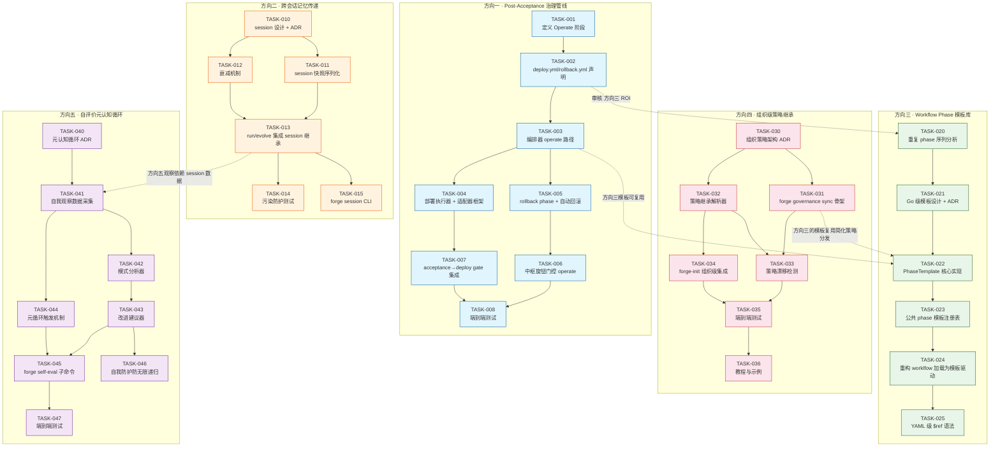
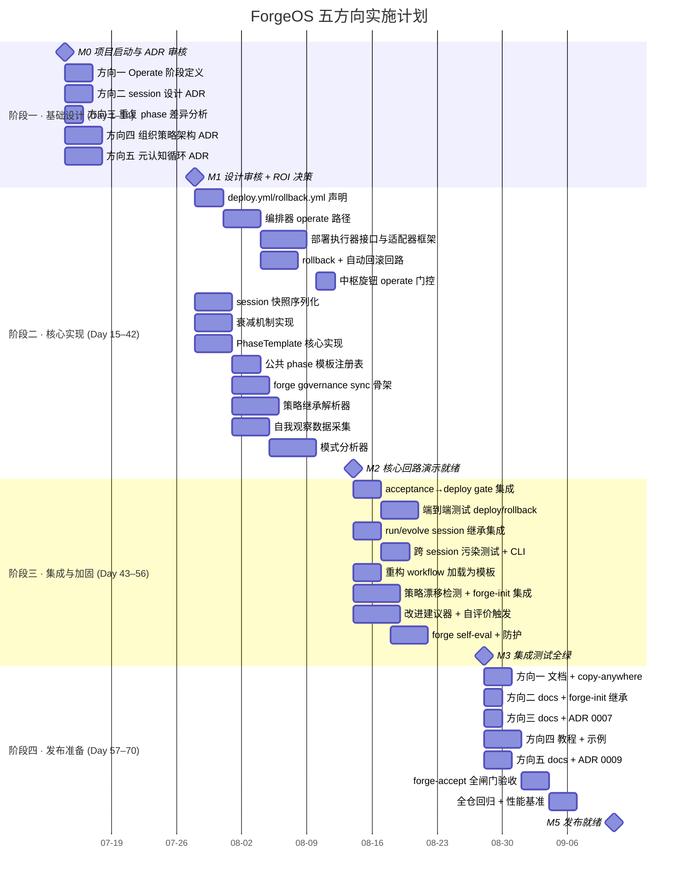

现在我掌握了充分的上下文。让我基于 ForgeOS 截至 Sprint 31 的当前状态，产出完整的 Tech Lead 分析。

---

# Tech Lead 分析：ForgeOS 五个扩展方向

**分析基线**: 项目当前为 Sprint 31 完成状态，forge-core 18 Go 包全绿，`forge accept` ACCEPTED，五方向已交付。以下分析针对**五个全新方向**，基于代码库当前架构与工程纪律。

---

## 1. 任务分解

### 方向一 · Post-Acceptance 治理管线

| ID | 任务标题 | 涉及文件 | 前置依赖 | 工时(h) | 验收标准 |
|---|---|---|---|---|---|
| TASK-001 | 定义"Operate"脊柱阶段与 deploy/rollback 阶段概念 | `.agent/ARCHITECTURE.md`, `.agent/ROADMAP.md` | 无 | 2 | ARCHITECTURE.md 新增 Operate 段描述持续交付阶段；ROADMAP 新增对应条目 |
| TASK-002 | 设计 deploy.yml/rollback.yml 工作流声明 | `.agent/workflows/deploy.yml`, `.agent/workflows/rollback.yml` | TASK-001 | 4 | 两个 YAML 含 phase 定义、stop_condition、on_fail 回路；经 `check.py` 校验通过 |
| TASK-003 | 实现 deploy phase 编排器路径（引擎消费） | `forge-core/internal/orchestrator/operate.go` | TASK-002 | 6 | 从现有 `RunFrom` 继承的 operate 路径：读取 deploy.yml → 运行 phase → harness gate → converge 判断 |
| TASK-004 | 实现部署执行器接口与 Docker/SSH 适配器框架 | `forge-core/internal/orchestrator/deploy.go`, `harness/adapters/deploy.yml` | TASK-003 | 8 | DeployExecutor 接口定义 + command 实现（shell out 到 docker/ansible）+ dry-run 安全默认 |
| TASK-005 | 实现 rollback phase 与自动回滚回路 | `forge-core/internal/orchestrator/rollback.go`, 扩充 `asset.OnFail` | TASK-003 | 6 | deploy fail → 自动触发 rollback.yml；rollback 成功 → 收敛 MET；失败 → abort |
| TASK-006 | 将 deploy/rollback 纳入中枢旋钮（mode×lifecycle 门控） | `.agent/policies/modes.yml`, `forge-core/internal/mode/` | TASK-002, TASK-003 | 4 | `workflow_depth.operate` 字段 + production 强制全 deploy + engineering 可选 |
| TASK-007 | 整合 acceptance gate 与 deploy gate（验收通过才部署） | `forge-core/cmd/forge/gates.go`, `harness/acceptance.mjs` | TASK-004 | 4 | `forge accept` ACCEPTED 后才允许 deploy；注入 test 确认 |
| TASK-008 | 端到端测试：deploy→rollback→converge 假 agent 回路 | `forge-core/cmd/forge/operate_test.go` | TASK-005, TASK-006 | 6 | fake-agent deploy/rollback 坐实 converge MET/NOT MET 双向；全闸门绿 |

**方向一小计：40 工时（1 人 × 5 天 / 2 人 × 3 天）**

---

### 方向二 · 跨会话记忆传递

| ID | 任务标题 | 涉及文件 | 前置依赖 | 工时(h) | 验收标准 |
|---|---|---|---|---|---|
| TASK-010 | 设计 session 边界与记忆序列化 schema | `docs/adr/0006-cross-session-memory.md`, `forge-core/internal/memory/session.go` | 无 | 4 | ADR 定义 session ID、记忆传输格式、衰减语义；Go struct 对应 |
| TASK-011 | 实现 session 快照（记忆状态序列化与反序列化） | `forge-core/internal/persist/session.go`, 扩充 `internal/memory` | TASK-010 | 6 | `Snapshot()` → 写出 memory+compact 状态至 `.forge/session/`；`Restore()` 读回 |
| TASK-012 | 实现衰减机制：时间衰减 + 上下文匹配度语义衰减 | `forge-core/internal/memory/decay.go` | TASK-010 | 6 | `DecayWeight` 指数时间衰减；`ContextMatch` 基于项目 context 变化的余弦/关键词相似度 |
| TASK-013 | 在 run/evolve 入口集成 session 继承回路 | `forge-core/cmd/forge/session.go`, 扩充 `main.go` | TASK-011, TASK-012 | 4 | `--inherit-session <id>` flag；run 前自动 restore、run 后 snapshot；默认不继承 |
| TASK-014 | 跨 session 污染防护测试（重构方向下旧教训权重衰减） | `forge-core/internal/memory/session_test.go` | TASK-012, TASK-013 | 4 | 注入 mock context 变化 → 衰减正确；旧教训不影响新 context |
| TASK-015 | `forge session` CLI 子命令：ls/inspect/prune | `forge-core/cmd/forge/session_cmd.go` | TASK-013 | 3 | `forge session ls` 列可用 session；`inspect` 显内容概要；`prune` 按 age 清理 |

**方向二小计：27 工时（1 人 × 3.5 天 / 2 人 × 2 天）**

---

### 方向三 · Workflow Phase 模板库

| ID | 任务标题 | 涉及文件 | 前置依赖 | 工时(h) | 验收标准 |
|---|---|---|---|---|---|
| TASK-020 | 提取 build.yml/evolve.yml 重复 phase 序列做差异分析 | `docs/analysis/workflow-duplication.md` | 无 | 2 | 精确表格：哪些 phase 序列重复、哪些字段不同 |
| TASK-021 | 设计 Go 级模板组合机制（非 YAML preprocessor） | `forge-core/internal/asset/template.go`, `docs/adr/0007-workflow-templates.md` | TASK-020 | 6 | ADR 定方案：Go `PhaseTemplate` struct + `ResolveParams` 参数化 |
| TASK-022 | 实现 `PhaseTemplate` 核心：定义+参数+展开 | `forge-core/internal/asset/template.go`（实现） | TASK-021 | 6 | 模板定义能参数化 name/agent/required_gates/model_tier；`Expand()` 产 `[]Phase` |
| TASK-023 | 实现公共 phase 模板注册表：planner_tpl、implementer_tpl、harness_tpl、reviewer_tpl 等 | `forge-core/internal/asset/phase_tpls.go` | TASK-022 | 4 | 4-6 个模板覆盖 build/evolve 重复段；单元测试验证展开正确性 |
| TASK-024 | 重构 build.yml/evolve.yml 加载为模板驱动 | `forge-core/internal/asset/asset.go`（加载逻辑）+ workflow YAML 注释 | TASK-023 | 4 | 逐位行为不变（`git stash diff` 空）；对产出的 JSON 做差分 |
| TASK-025 | 设计 YAML 级轻量引用语法（可选加速器，非强制） | `harness/yaml2json.py`（或新 `forge-core/internal/yaml2json` 支持 `$ref`） | TASK-022 | 3 | YAML 可 `planner: $ref: planner_tpl` 展开为完整 phase；纯 Go 路径不动 |

**方向三小计：25 工时（1 人 × 3 天）**

---

### 方向四 · 组织级多租户策略继承

| ID | 任务标题 | 涉及文件 | 前置依赖 | 工时(h) | 验收标准 |
|---|---|---|---|---|---|
| TASK-030 | 设计组织级策略注册表模型与继承语义 | `docs/adr/0008-org-policy-inheritance.md` | 无 | 6 | ADR 定义：中央 repo 结构、策略覆盖层级（org→team→project）、继承规则 |
| TASK-031 | 实现 `forge governance sync` CLI 命令骨架 | `forge-core/cmd/forge/governance.go` | TASK-030 | 6 | `forge governance sync --org <org>` 拉策略到 `.agent/policies/org/`；默认 dry-run |
| TASK-032 | 实现策略继承解析器：合并 org/team/project 三层 | `forge-core/internal/mode/inherit.go` | TASK-030 | 8 | 三层 merge 语义：org 基线→team 覆盖→project 特异；冲突取更严 |
| TASK-033 | 实现策略覆盖率漂移检测（本地 vs 中央声明不一致告警） | `harness/check.py`（加 check 项）+ `harness/policy_drift_check.py` | TASK-032 | 6 | 本地 `.agent/policies/` 与中央不一致 → check FAIL/PASS |
| TASK-034 | 在 `forge-init` 集成组织级初始化（拉中央策略+本地覆盖） | `forge-core/cmd/forge/init.go` | TASK-032 | 4 | `forge init --org <org>` → 拉中央策略 → 写 `.agent/project.yml` org 字段 |
| TASK-035 | 端到端测试：多 project 多 org 策略继承坐实 | `forge-core/cmd/forge/governance_test.go`, `forge-core/internal/mode/inherit_test.go` | TASK-032, TASK-033, TASK-034 | 8 | 构建 mock 中央仓库 → `forge-init` 推子项目 → `governance sync` + drift check |
| TASK-036 | 文档与示例：组织级治理教程 | `docs/governance-org.md`, `examples/org-setup/` | TASK-035 | 4 | 可复现的 org→team→project 三层配置用例；新用户 15 分钟上手 |

**方向四小计：42 工时（1 人 × 5.5 天 / 2 人 × 3 天）**

---

### 方向五 · 自评价元认知循环

| ID | 任务标题 | 涉及文件 | 前置依赖 | 工时(h) | 验收标准 |
|---|---|---|---|---|---|
| TASK-040 | 设计自评价元认知循环架构（闭环学习回路的反射版本） | `docs/adr/0009-self-evaluation.md` | 无 | 6 | ADR 定义：ForgeOS 观察自己的 trace/scorecard/gate → 分析模式 → 建议自身改进 |
| TASK-041 | 实现自我观察数据采集：forge-core 自身 trace/scorecard 汇总统计 | `forge-core/internal/observe/self.go` | TASK-040 | 6 | 每 run/evolve 后产生 `self-profile.json`（行数、函数数、gate 通过率、迭代次数等） |
| TASK-042 | 实现模式分析器：检测自身结构问题（文件超阈值增长、循环依赖趋势等） | `forge-core/internal/observe/pattern.go` | TASK-041 | 8 | 分析 self-profile → 产出 `Findings[]`（type/severity/evidence）；可配置阈值 |
| TASK-043 | 实现改进建议器：将 pattern 发现映射为 ROADMAP 条目 | `forge-core/internal/observe/recommend.go` | TASK-042 | 6 | 根据 Finding 类型 → 写 recommendations 到 `.agent/ROADMAP.md`；默认提案 dry-run |
| TASK-044 | 元循环触发机制：每 N 次 evolve 迭代自动调自评价 | `forge-core/cmd/forge/evolve.go`（集成）+ `forge-core/internal/observe/trigger.go` | TASK-041 | 4 | `forge evolve --self-eval` flag；默认 interval=5 迭代 |
| TASK-045 | 实现 `forge self-eval` 独立子命令 | `forge-core/cmd/forge/self_eval.go` | TASK-043 | 4 | 手动入口：`forge self-eval` → 分析 + 报告 + --apply 写 ROADMAP |
| TASK-046 | 自评价的自我防护：元循环自身不可诱发无限递归 | `forge-core/internal/observe/guard.go` | TASK-044 | 3 | 自评价 phase 不计入 max-iter；禁止自评价触发的改进建议再触发自评价 |
| TASK-047 | 端到端测试：fake 自我观测数据 → pattern 分析 → 建议产出 | `forge-core/internal/observe/self_eval_test.go` | TASK-042, TASK-043 | 6 | 注入已知模式 → analysis 产出预期 finding → recommendation 可追踪 |

**方向五小计：43 工时（1 人 × 5.5 天 / 2 人 × 3 天）**

---

## 2. 执行顺序与并行组



### 并行执行组

| 并行组 | 方向 | 任务 | 条件 |
|---|---|---|---|
| **组 A** | 方向一 | TASK-001 ~ TASK-008 | 依赖链串行，组内无并行 |
| **组 B** | 方向二 | TASK-010 ~ TASK-015 | TASK-010→TASK-011/012 可并行设计；TASK-013→TASK-014/015 |
| **组 C** | 方向三 | TASK-020 ~ TASK-025 | TASK-020 依赖分析后→TASK-021/022/023 可并行 |
| **组 D** | 方向四 | TASK-030 ~ TASK-036 | TASK-030→TASK-031/032 可并行设计 |
| **组 E** | 方向五 | TASK-040 ~ TASK-047 | TASK-040→TASK-041/044 可并行 |

**跨方向并行**：组 A、B、C、D、E 可完全并行，仅三处跨方向弱依赖（见图中虚线）：
- 方向三 → 方向一：模板复用（非阻塞，方向一可先用硬编码，后重构）
- 方向三 → 方向四：模板简化策略分发（非阻塞）
- 方向五 → 方向二：session 数据为自评价可观测性输入（非阻塞，可先用方向二的数据降级版）

---

## 3. 技术风险

### 风险矩阵

| # | 风险描述 | 方向 | 可能性 | 影响 | 缓解策略 |
|---|---|---|---|---|---|
| R1 | **deploy 执行器接口膨胀**——Docker/K8s/Ansible/SSH 等部署目标各不相同，接口设计无法覆盖全部 | 一 | 中 | 高 | 采用 adapter 模式（同现有 `adapters/*.yml`）；v1 只实现 `command`（shell out）+ dry-run；声明式 deploy.yml 与具体平台解耦 |
| R2 | **rollback 一致性**——部分部署失败、部分成功后 rollback 的操作完整性 | 一 | 高 | 严重 | v1 采用「事务回滚」单 phase 语义（全或无）；不支持 partial rollout；文档明确声明边界 |
| R3 | **跨 session 污染不可完全消除**——即使采用上下衰减，低概率误继承始终存在 | 二 | 中 | 中 | 默认关闭（opt-in）；`--inherit-session` 显式指定；衰减参数可调 |
| R4 | **模板 ROI 不足**——当前仅 5 个 workflow，模板化的抽象成本 > 手动维护成本 | 三 | 中 | 低 | 先做差异分析 → 再决定是否做；评估标准：模板减少重复 YAML 行数 ≥ 30% 才推进 |
| R5 | **组织级策略网络效应依赖**——ForgeOS 项目数 < 10 时不具经济性 | 四 | 高 | 中 | 方向四的架构建好但不急于推广；`forge governance sync` 默认单项目模式（无中央）= 零网络效应 |
| R6 | **中央策略注册表权威源**——决定哪个 repo 是中央、谁来维护、如何鉴权 | 四 | 中 | 高 | 采用"文件协议"：中央 = git repo URL（`--org=git@github.com/org/policies.git`）；v1 不建鉴权服务 |
| R7 | **自评价循环引发行为改变**——元循环建议改 ForgeOS 自身配置，可能恶化问题 | 五 | 低 | 高 | 所有建议默认 dry-run + human review 闸门（同 design.yml）；防护：自评价产生的改动触发二次自评价？→ 防递归：自评价 phase 不计入演化迭代 |
| R8 | **forge-core Go 包文件数/函数长度阈值压力**——每个方向新增文件可能顶到 500 行/文件上限 | 全部 | 中 | 中 | 持续执行「先拆分再继续」纪律（`internal/doctor`/`internal/attribution` 先例）；不允许放宽阈值 |
| R9 | **真 deploy/rollback 测试需要实际基础设施**——CI 环境不持 Dcoker/K8s | 一 | 高 | 中 | 用 fake-agent 端到端验证编排语义；实际部署用 `--executor dry` 验证 argument 构造（同 readonly 先例）；在 CI 中 skip 需要真基础设施的部分 |
| R10 | **方向五与现有学习闭环的重叠**——方向二（Learning loop）已有 scorecard/tieback，方向五的"元循环"可能会与现有机制混淆或重复 | 五 | 中 | 中 | ADR 0009 明确区分：现有学习闭环绕 agent 执行质量迭代；元循环绕 ForgeOS 自身架构治理；二者正交 |

### 性能优化策略

| 场景 | 风险 | 策略 |
|---|---|---|
| 方向一 deploy monitor | 长轮询部署状态阻塞编排器 | deploy phase 用异步 `poll` 模式 + 超时 guard（与现有 `CommandExecutor` timeout 一致） |
| 方向二 session 衰减计算 | session N 个时 full scan 开销 | 惰性计算（访问时再算衰减）；索引按 session ID 分片 |
| 方向四策略 merge | 三层策略合并每 run 触发 | 缓存 merge 结果；`forge governance sync` 改变时失效 |
| 方向五 pattern 分析 | 自我扫描可能耗大量时间 | 限制分析频率（每 N 迭代一次）；分析数据使用增量 diff |

---

## 4. 资源评估

### 人员技能矩阵

| 角色 | 人数 | 所需技能 | 负责方向 |
|---|---|---|---|
| **Go 基础设施工程师** | 1-2 人 | Go 编排器、CLI 设计、并发模式 | 方向一（编排器 + executor）+ 方向三（模板 Go 实现） |
| **治理/架构师** | 1 人 | 策略设计、多租户架构、YAML schema | 方向四（组织级策略 ADR + 继承解析器） |
| **AI/ML 工程师** | 1 人 | 认知系统、衰减算法、模式分析 | 方向二（衰减机制）+ 方向五（pattern 分析） |
| **DevOps 工程师** | 1 人 | CI/CD、部署编排、容器化 | 方向一（deploy executor 适配器）+ 集成测试基础设施 |
| **全栈 QA 工程师** | 1 人（兼职） | 端到端测试、mock 框架、fake-agent | 全部五个方向的集成测试 |

### 关键里程碑

```
M0 (Day 0):   项目启动、ADR 审核、环境就绪
M1 (Day 14):  方向三 ROI 分析完成 + 决定推进/停止
              + 方向一 deploy 编排设计就绪 (TASK-001~003 done)
M2 (Day 28):  方向一 deploy/rollback 核心回路可运行 (TASK-004~005 done)
              + 方向二 session 快照/衰减可用 (TASK-010~012 done)
M3 (Day 42):  方向四 组织级策略 sync 可用 (TASK-030~032 done)
              + 方向五 自我观察基础设施就绪 (TASK-040~042 done)
M4 (Day 56):  方向一 端到端测试绿 (TASK-008 done)
              + 方向二 CLI + 污染测试全绿 (TASK-014~015 done)
              + 方向五 元循环端到端坐实 (TASK-045~047 done)
M5 (Day 70):  🏁 全部五个方向集成测试 ACCEPTED
              + docs 完成 + forge-init copy-anywhere 完整性验证
```

### 阻塞点与解决策略

| 阻塞点 | 所属 | 策略 |
|---|---|---|
| **方向一需要真部署环境验证** | 方向一 | 不执著于真 Docker/K8s 验证；同 readonly 先例（Sprint 31）：按契约构建 + 单测验证 argument → 用户选择「单测已足够，就此打住」 |
| **方向四需要组织级 repo 存在** | 方向四 | 先做单元级别策略继承算法（无中央也可）；`--org` 参数预留、默认单项目模式 |
| **方向五 pattern 分析的基准数据积累** | 方向五 | v1 使用静态分析（文件数/函数长度/gate 通过率），同一轮 ROADMAP.md 的自我审计（Sprint 30 的手法）；
| **方向三 YAML $ref 语法解析器** | 方向三 | 决定不做 YAML 级引用（Go 级模板已够）；或走 python shim 的最小实现 |

---

## 5. 质量保证

### 单元测试覆盖要求

| 层 | 目标覆盖率 | 关键测试方向 | 测试类型 |
|---|---|---|---|
| `internal/asset/` | ≥ 85% | 新 PhaseTemplate Expand、SessionSerialization | 纯逻辑表驱动 |
| `internal/orchestrator/` | ≥ 80% | deploy/rollback 编排、session 继承回路 | 状态机验证 + -race |
| `internal/memory/` | ≥ 85% | 衰减机制(时间+语义)、上下文相似度 | 表驱动 + 快照比对 |
| `internal/mode/` | ≥ 85% | 三层策略 merge（org→team→project）、冲突取严 | 逐属性验证 |
| `internal/observe/` | ≥ 80% | pattern 分析、finding→recommendation 映射 | fixture 注入 + 输出断言 |
| `cmd/forge/` | ≥ 75% | CLI 参数传递、dry-run 行为、与 harness 集成 | shell test + Go test |

### 集成测试策略

| 测试层 | 策略 | 频率 |
|---|---|---|
| **方向一 deploy/rollback** | fake-agent 端到端回路：deploy→fail→rollback→converge→NOT MET；deploy→success→converge→MET | 每次 PR |
| **方向二 session 继承** | 双 run 测试：run1 假数据→snapshot→run2 restore→验证 memory 继承 → 验证污染隔离 | 每次 PR |
| **方向三模板展开** | 模板展开 vs 手工等效 phase 的 JSON diff（`cmp.Diff`）；现有 workflow 逐位不变 | commit 级 |
| **方向四策略继承** | mock 中央 repo + forge-init + sync + drift check 全链路；三层突变验证 | 每次 PR |
| **方向五元循环** | 注入 self-profile fixture → pattern 分析 → recommendation → 确认写 ROADMAP | 每次 PR |
| **跨方向** | 方向三模板 → 方向一 deploy.yml 使用模板 | Sprint 合并前 |
| **forge-accept 闸门** | 所有方向新增代码必须通过 `forge accept: ACCEPTED` | 每次修改后 |

### 代码审查要点

| 审查焦点 | 所属方向 | 检查项 |
|---|---|---|
| 编排器安全边界 | 一 | deploy executor 的 dry-run 安全默认不可 bypass；rollback 动作必须限次（MaxLoopBack 同款） |
| 衰减参数合理性 | 二 | decay_half_life_days 默认 30 是否合理；context-match 阈值 0.7 是否误判 |
| 模板抽象漏抽象 | 三 | 模板展开后的 phase 是否覆盖全部字段（`OnFail`/`DependsOn`/`FeedsForward` 等不可丢失） |
| 策略继承正确性 | 四 | production lifecycle 的强制规则不可被宽松 org 策略绕过（同 Sprint 15 教训） |
| 元循环安全防护 | 五 | 自评价不可产生无限递归；suggestion 的 human review 闸门不可 bypass |
| **自身执行纪律** | 全部 | 新增文件 ≤ 500 行；`cmd/forge` 包文件数 ≤ 17；零循环依赖 |

### 性能测试需求

| 测试 | 方向 | 标准 | 工具 |
|---|---|---|---|
| deploy/rollback 编排延迟 | 一 | 编排决策 < 100ms（不含 agent 执行） | `go test -bench=BenchmarkDeployOrchestrate` |
| session 衰减计算性能 | 二 | 100 session × 1000 条目的衰减 < 50ms | `go test -bench=BenchmarkSessionDecay` |
| 模板展开性能 | 三 | 10 模板 × 5 引用 → 展开 < 1ms | `go test -bench=BenchmarkTemplateExpand` |
| 策略 merge 性能 | 四 | 三层 merge < 1ms（缓存命中）/ < 10ms（冷） | `go test -bench=BenchmarkPolicyMerge` |
| pattern 分析性能 | 五 | 10000 行 self-profile < 200ms | `go test -bench=BenchmarkPatternAnalyze` |

---

## 6. 实施计划



### 阶段摘要

| 阶段 | 天数 | 总工时 | 并行人数 | 产出 |
|---|---|---|---|---|
| **一 · 基础设计** | 14 | ~40 h | 3-4 人 | 5 份 ADR + 方向三 ROI 决策 + 代码库差异分析 |
| **二 · 核心实现** | 28 | ~90 h | 4 人并行 | 各方向核心回路可运行 + 单元测试绿 |
| **三 · 集成加固** | 14 | ~60 h | 3-4 人 | 跨方向集成 + 端到端测试 + forge-accept 绿 |
| **四 · 发布准备** | 14 | ~40 h | 2-3 人 | 文档 + 教程 + 性能基准 + 全闸门绿 |
| **总计** | **70 天** | **~230 h** | 2-4 人 | **🏁 五方向全量交付** |

---

## 总结性建议

### 优先级排序（Tech Lead 视角）

1. **P0 · 方向一（Post-Acceptance 治理管线）** —— 填补 ForgeOS 现有脊柱的最大缺口：当前 Build→Evolve 之间缺失的"部署"阶段使 ForgeOS 止于验收而未达生产。这与分析文档一致的 P1 分歧：我更偏向 P0，因为部署是「软件工厂」的字面最后一段（从 Idea 到 Production），而现有脊柱停在了 "Accepted"。

2. **P1 · 方向五（自评价元认知循环）** —— 战略价值高于表面 P3。分析文档准确指出这是「工具→平台→智能代理」的关键步骤。ForgeOS 现已具备完整的治理能力，但缺乏对自身健康的**系统性自我意识**。这是 ForgeOS 从"被治理"进化为"自治"的转折点。

3. **P2 · 方向二（跨会话记忆传递）** —— 重要但在 v2 全局化进程中优先级中等。当前单 session 的 memory/context 已足够。跨 session 继承在用户开始运行 >5 个 evolve 迭代后才体现价值。

4. **P2 · 方向四（组织级多租户策略继承）** —— 杠杆最高但时机最早。分析文档对"网络效应依赖"的判断准确：ForgeOS 本身只有一个仓库（dogfood），采纳漏斗未到需要多项目组织治理的阶段。建架构但推迟推广。

5. **P3 · 方向三（Workflow Phase 模板库）** —— 分析文档对 ROI 的质疑成立。当前仅 5 个 workflow，重复 phase 约 3-4 个序列（planner→implementer→harness→reviewer）。模板化的节省（每次 ~30 行）在 5 个文件上总共约 120 行重复——远低于「值得新抽象」的阈值。建议做成轻量包袱（`internal/asset/phase_tpls.go` 几个 Go 常量），而非独立特性。

### 最终建议

**推荐执行顺序**（并行组）：

```
Sprint A (Weeks 1-4):  方向一(P0) + 方向五(P1) 两条轨道并行
                        └─ 基础设施工程师 ×1 → 方向一 TASK-001~005
                        └─ AI/架构工程师 ×1 → 方向五 TASK-040~044
Sprint B (Weeks 5-8):  方向一集成 + 方向五集成 + 方向二轻量启动
Sprint C (Weeks 9-10): 方向四架构建好 + 方向三 ROI 复盘决定去留
```

**不推荐当前启动的**：方向三（除非未来 workflow 数 > 15，或用户提出强烈模板需求）；方向四的 full rollout（架构就绪、服务不启动，等待用户群自然增长）。
