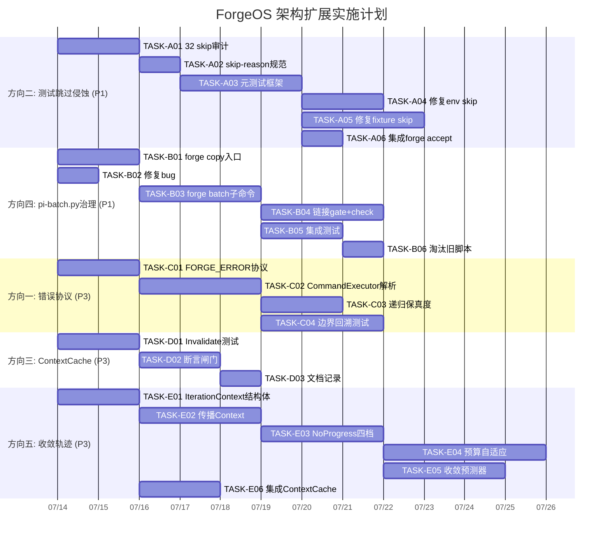

I've thoroughly reviewed the analysis document and validated its claims against the codebase. Let me now produce the Tech Lead analysis.

---

# Tech Lead 分析：ForgeOS 五个系统性架构扩展方向

## 1. 任务分解

### 1.1 方向优先级映射

```
P1 (立即行动)   → 方向二（测试跳过侵蚀）、方向四（pi-batch.py 治理后门）
P3 (当前迭代)   → 方向一（错误协议真空）、方向三（ContextCache 潜伏风险）
P3 (长期优化)   → 方向五（收敛轨迹）
➕ 跨领域       → 迭代感知抽象（方向三+五 根本原因）
```

### 1.2 任务清单

#### 阶段 A — 方向二：测试跳过级联静默侵蚀（P1）

| 任务 ID | 任务标题 | 涉及文件 | 前置依赖 | 预估工时 | 验收标准 |
|---------|---------|---------|---------|---------|---------|
| **TASK-A01** | 32 skip 点分类审计 | 全部 10 个 `*_test.go` 文件 | 无 | 2h | 输出分类表：env(7) / repo(8) / fixture(11) / intentional(4) / config(2) |
| **TASK-A02** | 引入 `//go:skip-reason` 注释标签规范 | `.agent/AGENTS.md`（纪律章节） | TASK-A01 | 1h | 规范文档化，示例注释格式写入 AGENTS.md |
| **TASK-A03** | 插入 skip 元测试框架（`test/skipaudit_test.go`） | `forge-core/cmd/forge/` 新建 | TASK-A02 | 3h | 扫描所有 `_test.go`，统计每个 skip 点的 `skip-reason` 标签，输出 WARNING 报告 |
| **TASK-A04** | 修复 env 依赖 skip（7 个 CI 可解） | `*_test.go` 中的 python3 检测 | TASK-A03 | 2h | CI 环境注入 python3，移除对应 skip |
| **TASK-A05** | 修复 fixture 依赖 skip（11 个） | `persist/replay_test.go`, `orchestrator/loop_test.go` 等 | TASK-A03 | 3h | 每个 fixture skip 添加 `//go:skip-reason fixture` 标签 + 调整测试数据路径 |
| **TASK-A06** | 集成到 `forge accept` 闸门（`acceptance.mjs`） | `harness/acceptance.mjs` | TASK-A03 | 1h | `forge accept` 在 WARNING 级别报告 skip 元数据 |

**总工时：方向二 = 12h**

#### 阶段 B — 方向四：`pi-batch.py` 治理后门（P1）

| 任务 ID | 任务标题 | 涉及文件 | 前置依赖 | 预估工时 | 验收标准 |
|---------|---------|---------|---------|---------|---------|
| **TASK-B01** | 阶段 1 最小治理：`forge-init` copy-anywhere | `pi-batch.py` + `forge-core/cmd/forge/main.go`（新增 `forge copy` 子命令） | 无 | 2h | `forge copy <script>` 将目标脚本复制到项目 `.forge/scripts/` |
| **TASK-B02** | Sprint 27 bug 修复（硬编码路径问题） | `pi-batch.py` | 无 | 1h | 消除硬编码路径，改为可配置/相对路径 |
| **TASK-B03** | 添加 `forge batch` 子命令入口 | `forge-core/cmd/forge/batch.go` | TASK-B01 | 3h | `forge batch <workflow>` 调用 pi-batch.py 等价逻辑，输出 YAML |
| **TASK-B04** | 链接 `forge gate` + `forge check` | `forge-core/cmd/forge/batch.go` + `harness/check.py` + `harness/acceptance.mjs` | TASK-B03 | 3h | `forge batch --run-gates` 执行所有闸门 |
| **TASK-B05** | 编写 pi-batch.py 集成测试 | `forge-core/cmd/forge/batch_test.go` | TASK-B03 | 2h | 覆盖: dry-run / gate-run / error 三种路径 |
| **TASK-B06** | 淘汰旧 `pi-batch.py` 或标注 DEPRECATED | `pi-batch.py` 头部注释 + `AGENTS.md` 治理覆盖表 | TASK-B05 | 0.5h | 文件头标注 DEPRECATED + 链接指向新入口 |

**总工时：方向四 = 11.5h**

#### 阶段 C — 方向一：Agent 子进程错误协议真空（P3）

| 任务 ID | 任务标题 | 涉及文件 | 前置依赖 | 预估工时 | 验收标准 |
|---------|---------|---------|---------|---------|---------|
| **TASK-C01** | 定义 `FORGE_ERROR:<json>` 进程边界协议 | `exec_error.go`（新增 Encode/Decode） | 无 | 2h | 子进程错误支持带 JSON payload 的 stdout 行 |
| **TASK-C02** | `CommandExecutor` 解析层：提取非 0 退出的结构化内容 | `command_executor.go` | TASK-C01 | 3h | 子进程 `ExitError` 输出中扫描 `FORGE_ERROR:` 前缀并解析 |
| **TASK-C03** | 递归调用错误保真度（深度守卫不阻） | `command_executor.go` + `exec_error.go` | TASK-C02 | 2h | 递归拒绝时 `KindRecursionLimit` 保留原始 Kind（不降级为 `KindFailed`） |
| **TASK-C04** | 协议回溯测试：输出截断 / 超大 payload / 二进制输出 | `command_executor_test.go` | TASK-C02 | 3h | 边界情况表（5 种场景）全部验证通过 |

> **注意**：TASK-C03 与 `FORGE_AGENT_DEPTH` 守卫存在设计张力。守卫的目的是防止 fork bomb，而保真度目标是传递错误上下文。两者不矛盾——守卫仍阻断递归，阻断时的错误消息携带原始 Kind 即可。参见下方风险分析。

**总工时：方向一 = 10h**

#### 阶段 D — 方向三：ContextCache 迭代一致性（P3，潜伏标记）

| 任务 ID | 任务标题 | 涉及文件 | 前置依赖 | 预估工时 | 验收标准 |
|---------|---------|---------|---------|---------|---------|
| **TASK-D01** | 增加 `Invalidate()` 调用覆盖率：单元测试确保 seam 可观测 | `prompt/cache_test.go` | 无 | 2h | `Invalidate()` 调用后 `GatherCached` 重建且 `builds` 递增 |
| **TASK-D02** | 在 evolve 写入 ADR 的 v2 路径暴露前插入断言闸门 | `prompt/cache.go`（新增 `InvalidateOnWriteADR` 断言） | TASK-D01 | 2h | 如果 evolve phase 写入 ADR 后未调用 `Invalidate()`，`GatherCached` panic（开发期断言） |
| **TASK-D03** | 记录 evolve 当前不会写入缓存的文档分析 | `docs/adr/` | TASK-D02 | 1h | ADR 记录当前安全边界及 `writes_adr` 激活时需做的变更 |

**总工时：方向三 = 5h**

#### 阶段 E — 方向五：收敛轨迹自适应分配（P3，长期）

| 任务 ID | 任务标题 | 涉及文件 | 前置依赖 | 预估工时 | 验收标准 |
|---------|---------|---------|---------|---------|---------|
| **TASK-E01** | 引入 `IterationContext` 结构体 | `orchestrator/loop.go`（新增 `IterationContext`） | 无 | 2h | 结构体包含 Number / RoadmapCompletion / RoadmapDelta / IsFirst / IsConverged |
| **TASK-E02** | `LoopEngine` 创建并传播 `IterationContext` | `orchestrator/loop.go` + `orchestrator/engine.go` | TASK-E01 | 3h | 每轮迭代开始前构造 `IterationContext`，通过 `Engine` 向下传播 |
| **TASK-E03** | NoProgress 分类：四档信号（无/慢/振荡/健康） | `orchestrator/loop.go`（`staleCount` 重构） | TASK-E02 | 3h | 不改变已有行为的前提下添加档位枚举 + 日志输出 |
| **TASK-E04** | 预算逐轮自适应（收敛感知） | `orchestrator/budget.go` + `orchestrator/loop.go` | TASK-E03 | 4h | 默认关闭（`--adaptive-budget=false`）；开启后 `MaxAgentCalls` 随 `RoadmapDelta` 衰减 |
| **TASK-E05** | 收敛预测器（剩余方差估计） | `converge/converge.go`（新增 `EstimateRemaining`） | TASK-E03 | 3h | 基于剩余 gap 数量 + 质量（不只是百分比）输出大致剩余迭代数 |
| **TASK-E06** | 集成迭代感知到 `ContextCache` | `prompt/cache.go`（`Invalidate()` 按迭代号条件触发） | TASK-E01 + TASK-D01 | 2h | 缓存有效性检查感知迭代编号，evolve 跨迭代时自动重建 |

> TASK-E06 是跨领域任务，连接方向三和方向五。

**总工时：方向五 = 17h**

---

## 2. 执行顺序

### 2.1 依赖图

```mermaid
graph TD
    subgraph "阶段 A: 方向二 (P1)"
        A01[TASK-A01: 32 skip审计<br/>2h *no deps*]
        A02[TASK-A02: skip-reason标签规范<br/>1h ← A01]
        A03[TASK-A03: skip元测试框架<br/>3h ← A02]
        A04[TASK-A04: 修复env skip<br/>2h ← A03]
        A05[TASK-A05: 修复fixture skip<br/>3h ← A03]
        A06[TASK-A06: 集成forge accept<br/>1h ← A03]
    end

    subgraph "阶段 B: 方向四 (P1)"
        B01[TASK-B01: forge-init copy<br/>2h *no deps*]
        B02[TASK-B02: 修复bug<br/>1h *no deps*]
        B03[TASK-B03: forge batch子命令<br/>3h ← B01]
        B04[TASK-B04: 链接gate+check<br/>3h ← B03]
        B05[TASK-B05: 集成测试<br/>2h ← B03]
        B06[TASK-B06: 淘汰旧脚本<br/>0.5h ← B05]
    end

    subgraph "阶段 C: 方向一 (P3)"
        C01[TASK-C01: FORGE_ERROR协议<br/>2h *no deps*]
        C02[TASK-C02: CommandExecutor解析<br/>3h ← C01]
        C03[TASK-C03: 递归保真度<br/>2h ← C02]
        C04[TASK-C04: 边界回溯测试<br/>3h ← C02]
    end

    subgraph "阶段 D: 方向三 (P3 潜伏)"
        D01[TASK-D01: Invalidate测试<br/>2h *no deps*]
        D02[TASK-D02: 断言闸门<br/>2h ← D01]
        D03[TASK-D03: 文档记录<br/>1h ← D02]
    end

    subgraph "阶段 E: 方向五 (P3 长期)"
        E01[TASK-E01: IterationContext结构体<br/>2h *no deps*]
        E02[TASK-E02: 传播IterationContext<br/>3h ← E01]
        E03[TASK-E03: NoProgress四档分类<br/>3h ← E02]
        E04[TASK-E04: 预算自适应<br/>4h ← E03]
        E05[TASK-E05: 收敛预测器<br/>3h ← E03]
        E06[TASK-E06: 集成ContextCache<br/>2h ← E01+D01]
    end

    subgraph "可并行组"
        P1[组1: A01+B01+B02+C01+D01+E01<br/>完全独立]
        P2[组2: A02←A01, B03←B01, C02←C01<br/>各自链内顺序]
    end

    A01 --> A02 --> A03 --> A04 & A05 & A06
    B01 --> B03 --> B04 --> B05 --> B06
    B02 -..-> B03
    C01 --> C02 --> C03 & C04
    D01 --> D02 --> D03
    E01 --> E02 --> E03 --> E04 & E05
    E01 -..-> E06
    D01 -..-> E06
```



### 2.2 并行执行策略

```
Sprint 1 (Week 1-2):
  ┌──────────────────────────────────────────────┐
  │ 组并行 (4 条独立链同时启动):                    │
  │  Person A: A01→A02→A03 (skip 审计+框架)       │
  │  Person B: B01→B03 (copy + batch 子命令)      │
  │  Person C: C01→C02 (错误协议)                  │
  │  Person D: D01+E01 (缓存+Context 结构体)      │
  └──────────────────────────────────────────────┘

Sprint 2 (Week 3-4):
  ┌──────────────────────────────────────────────┐
  │  Person A: A04+A05+A06 (修复+集成)            │
  │  Person B: B04+B05+B06 (gate链接+测试+淘汰)   │
  │  Person C: C03+C04 (递归保真+回溯测试)        │
  │  Person D: D02+D03+E02→E03 (断言+文档+传播)   │
  └──────────────────────────────────────────────┘

Sprint 3+ (Week 5-7, 可选):
  ┌──────────────────────────────────────────────┐
  │  Person D: E04+E05+E06 (预算自适应+预测器)    │
  └──────────────────────────────────────────────┘
```

---

## 3. 技术风险

### 3.1 风险矩阵

| 风险 ID | 描述 | 方向 | 概览 | 影响 | 缓解策略 |
|---------|------|------|------|------|---------|
| **R1** | `classifyRunErr` 回退路径变化：如果 `KindFailed` 的语义在将来变为 retryable，字符串启发式可能将 `KindOverloaded` 误分类 | 方向一 | **低** | 中 | 协议设计为纯附加（`FORGE_ERROR:` 行出现在输出末尾），现有启发式并行运行，不存在回归 |
| **R2** | `FORGE_ERROR` 输出截断：子进程 stdout 被 `MaxOutputBytes` 截断时，协议行可能丢失 | 方向一 | **中** | 高 | `CommandExecutor` 将截断事件记录到结构化字段；解析器检查"输出被截断"标志，此时不假设协议完整性 |
| **R3** | 递归保真度与深度守卫语义冲突：保留 `KindRecursionLimit` 的内部 Kind 可能被上层误认为可 retry | 方向一 | **低** | 低 | `KindRecursionLimit` 的 `Retryable()=false` 不变，新的内部 Kind 字段仅用于日志/回溯，不影响决策路径 |
| **R4** | skip 元测试框架产生假阳性：`-short` 跳过在预期测试计数下永远不匹配 | 方向二 | **中** | 中 | 元测试框架定义 `intentional` 类别白名单，`-short` skip 打入此类别不告警 |
| **R5** | skip 元测试框架产生假阴性：不是所有 skip 点都用 `//go:skip-reason` 注释 | 方向二 | **高** | 高 | 阶段 A01 审计后确保新规范严格执行；`forge accept` 闸门发现未标注的 skip 点也告警 |
| **R6** | `forge batch` 与 `pi-batch.py` 行为不一致：新 Go 实现与旧 Python 脚本在边界情况下输出不同 | 方向四 | **中** | 高 | 使用 JSONL 记录两者的输出 diff，CI 中运行"对照测试"直到旧脚本淘汰；`pi-batch.py` 标注 DEPRECATED 后仍保留 1 个版本窗口 |
| **R7** | `ContextCache.Invalidate()` 被误调导致性能回退：每轮迭代重建 ADR 标题集 | 方向三 | **低** | 中 | `Invalidate()` 调用点增加迭代频次检查；每轮最多重建一次 |
| **R8** | 收敛预测器外推误差大：`RoadmapCompletion=0.92` 但有 2 个难修复的核心 gap | 方向五 | **中** | 中 | 预测器基于剩余 gap 数量 + gap 质量（修复难度分级），而非线性外推；输出置信区间而非单点估计 |
| **R9** | 自适应预算与 `MaxAgentCalls` 硬上限冲突：动态调整可能突破用户显示的 `--max-agent-calls` | 方向五 | **低** | 高 | 自适应预算仅在用户未设置 `--max-agent-calls`（或标记为 `--adaptive-budget`）时生效；硬上限始终优先 |

### 3.2 关键外部依赖

| 依赖 | 方向 | 说明 | 后备方案 |
|------|------|------|---------|
| Go 1.22+ 标准库 | 全部 | forge-core 纯标准库 | 已满足（go.mod 确认） |
| python3 + yaml2json.py shim | 方向二 env skip | 7 个 skip 依赖 | CI 注入 python3；测试代码中改为 `os.Getenv("FORGE_SKIP_PYTHON")` fallback |
| Node.js `gate.mjs` | 方向四 | `forge gate` 调用 | 已在 harness 中；`forge batch --run-gates` 复用现有通道 |
| `exec.CommandContext` 超时保真 | 方向一 | 子进程超时检测 | 现有实现正确（`exec_error.go:137`），协议不改变此路径 |

### 3.3 测试覆盖难点

```
Highest risk:
  R5 (未标注 skip 点假阴性) → 需要 CI 预提交 hook 扫描
  R6 (behavior diff)        → 需要对照测试矩阵
  R9 (预算冲突)              → 需要优先级布线单元测试
```

---

## 4. 资源评估

### 4.1 人员需求

| 角色 | 技能要求 | 数量 | 负责方向 |
|------|---------|------|---------|
| **Senior Go Developer** | Go 标准库、goroutine 安全、interface 设计 | 2 人 | 方向一 + 方向三 + 方向五（核心运行时） |
| **Full-stack Engineer** | Go + Node.js + Python 多语言、CI/CD | 1 人 | 方向二 + 方向四（工具链 + 治理） |
| **QA / Test Engineer** | 测试框架设计、fixture 管理 | 1 人（兼职） | 元测试框架 + 对照测试 |

**总团队规模：3-4 人（2 Senior Go + 1 全栈 + 0.5 QA）**

### 4.2 关键里程碑

| 里程碑 | 时间 | 交付物 | 验收标准 |
|--------|------|--------|---------|
| **M1**（Week 1 End） | Day 5 | 32 skip 审计报告 + `//go:skip-reason` 规范定稿 | AGENTS.md 更新 + 审计分类表评审通过 |
| **M2**（Week 2 End） | Day 10 | skip 元测试框架 + `forge copy` 子命令 + `FORGE_ERROR` 协议 v1 | `forge accept` 显示 skip WARNING；`forge copy` 工作；协议 JSON 解析通过单元测试 |
| **M3**（Week 3 End） | Day 15 | `forge batch` + gate 链接 + 递归错误保真度 | `forge batch --run-gates` 输出 YAML；递归错误保留原始 Kind |
| **M4**（Week 4 End） | Day 20 | `pi-batch.py` DEPRECATED + `IterationContext` 接入 + 断言闸门 | 旧脚本标注；`IterationContext` 在 LoopEngine 工作；缓存断言在开发期触发 |
| **M5**（Week 6-7 End） | Day 30-35 | 收敛预测器 + 自适应预算（可选阶段 E） | 四档 NoProgress 输出；`--adaptive-budget` 下 MaxAgentCalls 随 delta 调整 |

### 4.3 阻塞点与解决策略

| 阻塞点 | 影响方向 | 解决策略 |
|--------|---------|---------|
| **B1**：`pi-batch.py` 的 YAML 输出格式在 Go 端精确复现需要解析原有 Python 逻辑 | 方向四 | 先用 Python 子进程适配（`exec.Command("python3", "pi-batch.py")`），再逐步内化为 Go 实现，不追求一步到位 |
| **B2**：skip 元测试框架依赖 `go test -v` 输出解析，Go 版本间可能不兼容 | 方向二 | 使用 `go tool test2json` 而非解析文本输出；不支持时告警降级（WARNING 转 INFO） |
| **B3**：`FORGE_ERROR` 协议需要 Claude Code 等 Agent 配合输出结构化错误 | 方向一 | v1 仅在子进程端解析，不要求 Agent 端配合；Agent 端不输出协议行时行为不变（向后兼容） |

---

## 5. 质量保证

### 5.1 单元测试覆盖要求

| 模块 | 覆盖目标 | 新增测试数 | 关键测试场景 |
|------|---------|-----------|-------------|
| `FORGE_ERROR` 解析器 | ≥ 90% | 8-10 | 纯文本无错误行 / JSON payload 正常 / 超大 payload 截断 / 二进制输出 / 多行输出混合 |
| skip 元测试扫描器 | ≥ 85% | 6-8 | 有标签 skip / 无标签 skip / -short skip / 混合文件 / 空文件 / 错误格式标签 |
| `forge batch` 子命令 | ≥ 80% | 5-7 | dry-run / gate-run / 错误输入 / YAML 格式验证 |
| `Invalidate()` 集成 | ≥ 90% | 4-5 | 重建触发 / 并发安全 / nil-safe / builds 计数 |
| `IterationContext` | ≥ 90% | 6-8 | 传播正确 / delta 计算 / IsFirst 标记 / 并发传播 |

### 5.2 集成测试策略

| 测试套件 | 方向 | 策略 | 关键验证点 |
|---------|------|------|-----------|
| **错误协议套件** | 方向一 | 启动真实子进程写入已知错误格式 | 解析结果与预期的 `ExecKind` + payload 字段完全匹配 |
| **skip 对照测试** | 方向二 | 在已知 skip 的 fixture 上运行元测试 | 元测试报告的 skip 计数 = fixture 文件的实际 skip 计数 |
| **batch 对照测试** | 方向四 | `forge batch` 输出与 `pi-batch.py` 输出 JSONL diff | 差异为 0（或验收的微小差异标记为 expected） |
| **自适应预算测试** | 方向五 | 模拟 `staleCount` 的各种 delta 场景 | 预算随 delta 递减且不突破 `MaxAgentCalls` 硬上限 |

### 5.3 代码审查要点

| 审查点 | 方向 | 重点检查 |
|--------|------|---------|
| **协议前缀选择** | 方向一 | `FORGE_ERROR:` 是否与现有输出模式冲突；check 是否会在 stdin 中误匹配 |
| **skip 标签格式** | 方向二 | 注释格式是否与 Go 工具链兼容；`//` 后是否有空格 |
| **`forge batch` 扇入** | 方向四 | 是否引入新的外部依赖；CLI 子命令是否与 `main.go` 的 `switch` 模式一致 |
| **`Invalidate()` 竞态** | 方向三 | `GatherCached` 的 `mu` 锁定路径是否覆盖 `Invalidate()` 并发调用 |
| **`IterationContext` 零值** | 方向五 | 零值 `IterationContext` 是否不会导致 `staleCount` 的 `> 0` 判断异常 |

### 5.4 性能测试需求

| 场景 | 方向 | 基线 | 目标 |
|------|------|------|------|
| 子进程错误解析延迟 | 方向一 | 无（新增代码） | 单次解析 < 50µs（纯内存操作） |
| skip 元测试扫描时间 | 方向二 | 无（新增代码） | 扫描全部 100+ test 文件 < 200ms |
| `forge batch` 执行时间 | 方向四 | Python 版本 500ms | Go 版本 < 300ms |
| 缓存重建频率影响 | 方向三 | 每轮重建 0 次 | `Invalidate()` 每轮最多触发 1 次 |

**无需额外的性能专项测试**：所有改动都是控制面操作（微秒到毫秒级），不是数据面（吞吐敏感）。

---

## 6. 实施计划

### 6.1 甘特图



### 6.2 阶段划分

#### 阶段 1：基础设施搭建（Days 1-5, Week 1）

**目标** 建立可观测性 + 协议基础 + 治理入口

| 日 | 工作内容 | 负责人 |
|----|---------|--------|
| D1 | **全员同步**：审计 32 skip 点（A01）+ `pi-batch.py` bug 修复（B02）+ `FORGE_ERROR` 协议 v1 设计（C01）+ `Invalidate()` 测试（D01）+ `IterationContext` 结构体定义（E01） | 全员并行 |
| D2 | 完成 skip 分类表 + 协议定稿 + `IterationContext` 代码评审 | A/B/C/D/E |
| D3-4 | `//go:skip-reason` 规范定稿（A02）+ `forge-init copy` 入口（B01）+ `CommandExecutor` 解析层 V1（C02） | 各链独立 |
| D5 | skip 元测试框架第一版（A03 达 PR reviewable 状态） | A |

**里程碑 M1（Day 5）**：skip 审计报告 + 规范定稿 + 协议 v1 代码提交 + `forge copy` 工作

#### 阶段 2：核心功能实现（Days 6-15, Week 2-3）

**目标** 元测试框架 / `forge batch` / 错误保真 / 断言闸门全部就位

| 日 | 工作内容 | 负责人 |
|----|---------|--------|
| D6-7 | 元测试框架完整版（A03）+ `forge batch` 子命令（B03）+ 递归保真度（C03） | A/B/C |
| D8-10 | 修复 + 集成 skip（A04+A05+A06）+ gate 链接（B04）+ 缓存断言闸门（D02） | A/B/D |
| D11-12 | `forge batch` 集成测试（B05）+ 边界回溯测试（C04）+ `IterationContext` 传播（E02） | B/C/E |
| D13-15 | 旧脚本淘汰（B06）+ 文档记录（D03）+ NoProgress 四档（E03） | B/D/E |

**里程碑 M3（Day 15）**：`forge batch --run-gates` 工作 + 递归错误不降级 + skip 元测试就绪

#### 阶段 3：集成测试和优化（Days 16-20, Week 4）

**目标** 闸门集成 / 对照测试 / 回归验证

| 日 | 工作内容 | 负责人 |
|----|---------|--------|
| D16-17 | `forge accept` 集成 skip 元测试（全部链回归）+ `forge batch` vs `pi-batch.py` 对照测试 | A/B |
| D18-20 | 全部方向的回归测试 + 竞态检测 + `-race` 测试全线通过 | 全员 |

**里程碑 M4（Day 20）**：旧脚本 DEPRECATED + 全部 P1 任务完成 + 闸门全绿

#### 阶段 4：方向五扩展（Days 21-35, Week 5-7，可选）

**目标** 自适应预算 + 收敛预测器

| 日 | 工作内容 | 负责人 |
|----|---------|--------|
| D21-25 | 预算逐轮自适应（E04）+ `IterationContext` → `ContextCache` 集成（E06） | D/E |
| D26-30 | 收敛预测器 + 剩余方差估计（E05） | E |
| D31-35 | 自适应参数校准测试 + 文档 + 性能基线 | D/E |

**里程碑 M5（Day 35）**：`--adaptive-budget` 工作 + 收敛预测输出 Gap 数量

### 6.3 发布检查清单

```
□ 方向二: forge accept 显示 skip WARNING (P0)
□ 方向二: 32 个 skip 点全部标注 skip-reason (P0)
□ 方向四: pi-batch.py 头部标注 DEPRECATED (P0)
□ 方向四: forge batch 子命令可用且通过对照测试 (P0)
□ 方向一: FORGE_ERROR 协议解析 + 回溯测试通过 (P1)
□ 方向三: Invalidate() 测试覆盖 + 断言闸门 (P1)
□ 方向一+三+五: 所有 -race 测试全绿 (P0)
□ 方向五: 自适应预算默认关闭 (P1, 开启需 --adaptive-budget)
□ 总体: forge accept 聚合闸门全绿 (P0)
□ 总体: 无新的外部依赖引入 (P0, 红线)
```

---

## 7. 跨领域观察的架构建议

### 7.1 迭代感知抽象（Iteration Awareness Gap）

分析中提到的"方向三和方向五共享一个根本原因"是高质量的洞见。我建议在 `forge-core/internal/loop/` 中建立一个轻量级的共享抽象（而不是在现有包中分别修补）：

```
forge-core/internal/loop/
  context.go      ← IterationContext 结构体 + 构造器
  budget.go       ← 自适应预算逻辑（从 orchestrator 迁移迭代感知部分）
  convergence.go  ← 收敛预测（从 converge 包扩展）
```

这比分别修补 `orchestrator/loop.go` 和 `prompt/cache.go` 更系统化，避免在 Sprint 5 出现第三个"为什么又忘记传迭代号"的 bug。**建议作为方向五实施的前提重构。**

### 7.2 记忆时间平坦问题（Review 观察 2）

`memory.Entry` 的 `Iteration` 字段已到位（`memory.go:165`），但 `Load` 返回所有条目无时间加权。这是方向五的天然子观察——`IterationContext` 可以携带 `TotalIterations` 计数，`memory.Query` 在 v2 中接受权重参数：

```go
type QueryOpts struct {
    Kind     string
    Topic    string
    MinIteration int  // 仅返回 >= 此迭代的条目
    DecayOld bool     // 对旧条目应用置信度衰减
}
```

**建议**：不单独列为方向六。作为方向五的 TASK-E05（收敛预测器）的附带改进，在 E05 完成后额外投入 ≤ 1 天实现。

---

## 8. 总结

| 维度 | 结论 |
|------|------|
| **总投入** | 方向二(12h) + 方向四(11.5h) + 方向一(10h) + 方向三(5h) + 方向五(17h) = **55.5 小时**（~2 个 Sprint，3 人团队） |
| **P1 先行** | 方向二 + 方向四 = 23.5h（42% 总工时），覆盖最高杠杆、最干净的差异化。建议在前 2 周完成 |
| **最大技术风险** | R5（未标注 skip 假阴性）和 R6（batch 行为 diff）——都需要对照测试矩阵 |
| **最小可行发布** | 方向二（skip 元测试）+ 方向四（`forge batch` + gate 链接）即可独立发布，不需要等待方向一/三/五 |
| **架构投资回报最高** | `IterationContext` 抽象（方向五 TASK-E01/E02）解决方向三 + 方向五的根本原因，为未来迭代感知能力提供基础 |
