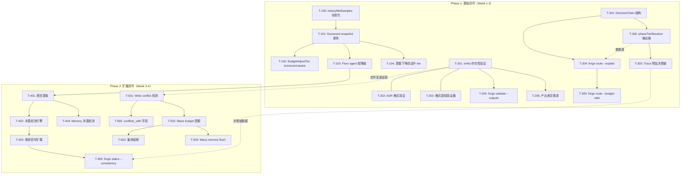
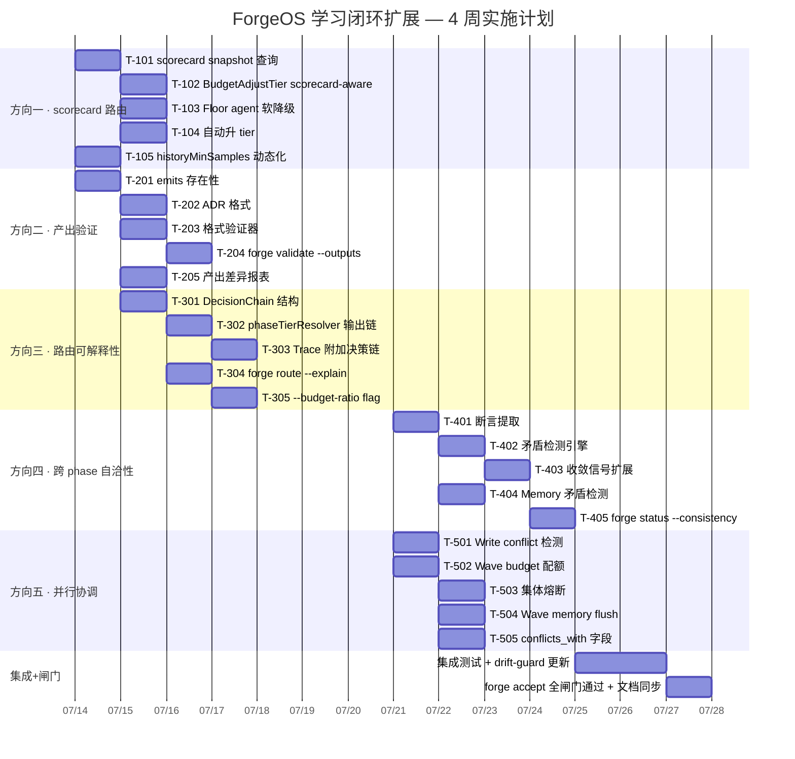

---

# Tech Lead 分析报告：ForgeOS 学习闭环盲区扩展

> **审查对象**: `docs/requirements/expansion-five-systemic-learning-loop-gaps.md`  
> **审查人**: Tech Lead  
> **代码验证日期**: 2026-07-12  
> **当前代码状态**: `engine_build.go` 已包含 v1.5 HistoryTiebreak 接线 (commit `6a1a359`)

---

## ⚠️ 重要事实更正

在分解任务前，我必须**纠正文档方向一的关键事实错误**。

**文档 Evidence B 称**: `HistoryTiebreak` 只在 CLI 路径中，不出现在运行时路由决策路径中。  
**实际代码**: `engine_build.go:329` 在 `logPhaseHistory` → `phaseTierResolver` 中**确实调用了** `routing.HistoryTiebreak`，该函数是运行时 `tierOf` 闭包的组成部分（v1.5, 6月29日）。

**实际状态**（基于代码）：

| 陈述 | 文档说法 | 实际 |
|------|---------|------|
| HistoryTiebreak 在运行时? | ❌ 不在 | ✅ 在（`logPhaseHistory` 被 `phaseTierResolver` 调用） |
| historyMinSamples 值 | 未提及 | `= 20`（`route.go:34`） |
| HistoryTiebreak 覆盖范围 | 未覆盖 floor agents | ✅ 正确——`IsOpusFloorAgent` 用单候选跳过 |
| BudgetAdjustTier 感知 scorecard? | ❌ 不感知 | ✅ 正确——仍不感知 |
| TierForScore 消费 scorecard? | ❌ 不消费 | ✅ 正确——仍不消费 |

**影响**: 方向一的 Evidence B 需重写，但方向本身仍成立——问题从「完全不消费」变为「消费局限：floor 锁定 + 冷启动门槛(20 samples) + BudgetAdjustTier 不感知」。实际杠杆略低但方向仍为 P0。

---

## 1. 任务分解

基于修正后的事实，以下将五个方向拆分为可执行任务。每个任务按 2–4 小时工程时间估算。

### 方向一 · 质量加权模型路由（修正版）

| Task ID | 标题 | 涉及文件 | 前置 | 预估 |
|---------|------|---------|------|------|
| T-101 | **Scorecard snapshot 结构化查询**：扩展 `Scorecard` 类型加 `Lookup(taskType, model) *Scorecard` 方法；给 `phaseTierResolver` 传递 snapshot struct 而非裸 `[]Scorecard` | `internal/routing/scorecard.go`, `cmd/forge/engine_build.go` | — | 3h |
| T-102 | **BudgetAdjustTier scorecard-aware 降级**：扩展 `BudgetAdjustTier` 签名接收 `qualityMap`；当降级目标的历史 PassRate < 阈值(默认 0.60)时，保留当前 tier | `internal/routing/routing.go` | T-101 | 4h |
| T-103 | **Floor agent 软降级**：`logPhaseHistory` 中 floor agent 改为双候选（[Opus, Sonnet]），仅当 scorecard 有 ≥5 samples 且 Sonnet PassRate > 0.85 时允许降级到 Sonnet | `cmd/forge/engine_build.go` | T-101 | 3h |
| T-104 | **质量下降自动升 tier**：在 `engine_build.go` 中当前 tier 最近 5 个 runs 的 PassRate 下跌 > 15% 时，自动升一级（禁用 budget 降级） | `cmd/forge/engine_build.go` | T-101 | 4h |
| T-105 | **`historyMinSamples` 动态调整**：当前硬编码 20 改为从 `policy.yml` 读取（默认 20）；加 `--history-samples` CLI flag 覆盖 | `cmd/forge/route.go`, `cmd/forge/engine_build.go`, `internal/mode/policy.go` | — | 2h |

### 方向二 · 产出完整性验证

| Task ID | 标题 | 涉及文件 | 前置 | 预估 |
|---------|------|---------|------|------|
| T-201 | **`emits:` 存在性验证**：Phase 执行后在 `observe` 回调中检查每个声明的 `emits:` 路径存在且非空 | `cmd/forge/engine_build.go` (agentExecutor observe), `internal/asset/asset.go` | — | 3h |
| T-202 | **ADR 格式验证**：在 `appendADRLane` 中加 ADR frontmatter 检查（标题格式 `# ADR-NNN`、status/date 字段、无孤儿文件） | `cmd/forge/prompt_artifacts.go` | — | 3h |
| T-203 | **格式感知验证器**：对 `.json`/`.yaml`/`.yml`/`.jsonl` 文件做解析验证；对 `.md` 检查非空 + 标题层级一致 | `cmd/forge/prompt_artifacts.go`, 新增 `internal/validate/format.go` | — | 4h |
| T-204 | **`forge validate --outputs`**：新增子命令，运行前检查 `emits:` 路径不存在（防覆盖），运行后检查存在 | `cmd/forge/validate.go` | T-201 | 3h |
| T-205 | **产出差异报表**：在 `observe` 中记录 agent 实际写入文件列表，与 `emits:` 对比，输出 diff 日志 | `cmd/forge/engine_build.go`, `cmd/forge/prompt_context.go` | T-201 | 4h |

### 方向三 · 路由决策可解释性

| Task ID | 标题 | 涉及文件 | 前置 | 预估 |
|---------|------|---------|------|------|
| T-301 | **`DecisionChain` 数据结构**：新增 `type DecisionChain struct` 含每一步 tier、原因、spendRatio、scorecard 摘要 | `internal/trace/trace.go` | — | 2h |
| T-302 | **`phaseTierResolver` 输出决策链**：`tierOf` 闭包返回 (tier, chain) 而不是只返回 tier；通过 context 或 closure 传递 | `cmd/forge/engine_build.go` | T-301 | 4h |
| T-303 | **Trace Event 附加决策链**：在 costSink / Observe 中将 `DecisionChain` 写入 `trace.Event` | `cmd/forge/engine_build.go` | T-302 | 2h |
| T-304 | **`forge route --explain`**：扩展 route 命令，输出每 phase 的完整决策链 + scorecard 数据摘要 | `cmd/forge/route.go` | T-301 | 4h |
| T-305 | **`forge route --budget-ratio`**：让 route CLI 接受 `--budget-ratio` flag 模拟 budget 降级 | `cmd/forge/route.go` | T-304 | 2h |
| T-306 | **`forge status --route-history`**：显示最近 N 次运行中各 phase 的 model 选择变化趋势 | `cmd/forge/status.go` (新增或扩展) | T-303 | 3h |

### 方向四 · 跨 phase 自洽性验证

| Task ID | 标题 | 涉及文件 | 前置 | 预估 |
|---------|------|---------|------|------|
| T-401 | **Phase 产出断言提取**：对每个 phase 完成后的输出做轻量 topic+claim 提取（关键词模式，不依赖 NLP） | `cmd/forge/prompt_context.go`, 新增 `internal/consistency/extract.go` | — | 4h |
| T-402 | **跨 phase 矛盾检测引擎**：按 topic 聚类断言，检测极性矛盾（"done" vs "broken"）和覆盖缺口 | 新增 `internal/consistency/detect.go` | T-401 | 4h |
| T-403 | **收敛信号扩展**：`converge.Signals` 增加 `ConsistencyWarnings []string`；收敛报告中显示告警 | `internal/converge/converge.go` | T-402 | 2h |
| T-404 | **Memory 矛盾检测**：`memory.Load`/`Query` 中对同一 `(Kind, Topic)` 的多条 entry 做 detail 文本重叠检测，低重叠时标记 `confidence=0.5` | `internal/memory/memory.go` | T-401 | 3h |
| T-405 | **`forge status --consistency`**：列出现有开放的跨 phase 矛盾 | `cmd/forge/status.go` | T-402, T-403 | 2h |

### 方向五 · 并行资源协调

| Task ID | 标题 | 涉及文件 | 前置 | 预估 |
|---------|------|---------|------|------|
| T-501 | **Write conflict 预检测**：wave 执行前扫描 phase 的文件写入路径重叠，有冲突时输出 WARN | `internal/orchestrator/waves.go`, 新增 `internal/orchestrator/conflict.go` | — | 3h |
| T-502 | **Wave 级 budget 配额协调**：wave 启动时锁定配额池，phase 完成归还；替代当前 per-phase 独立检查 | `internal/orchestrator/parallel.go`, `internal/orchestrator/budget.go` | — | 4h |
| T-503 | **集体熔断**：wave 内首个 phase 连续 2 次 `KindOverloaded` 时，同伴 phase 延迟启动 | `internal/orchestrator/parallel.go` | — | 4h |
| T-504 | **Wave 级 memory flush**：每个 wave 结束后 flush memory store + cache invalidate | `internal/orchestrator/parallel.go`, `internal/memory/memory.go` | — | 2h |
| T-505 | **`conflicts_with` 声明字段**：扩展 `Phase` 定义，允许 workflow 作者声明冲突；waves 算法消费 | `internal/asset/asset.go`, `internal/orchestrator/waves.go` | T-501 | 3h |

---

## 2. 执行顺序

### 任务依赖图



### 并行组

| 并行组 | 包含任务 | 描述 |
|--------|---------|------|
| **组 A** | T-105, T-101, T-102, T-103, T-104 | 方向一核心（scorecard-aware 路由） |
| **组 B** | T-201, T-202, T-203, T-204, T-205 | 方向二（产出验证）——完全独立于组 A |
| **组 C** | T-301, T-302, T-303, T-304, T-305 | 方向三（可解释性）——依赖方向一的接口但代码独立 |
| **组 D** | T-401, T-402, T-403, T-404, T-405 | 方向四（自洽性）——可并行于组 E |
| **组 E** | T-501, T-502, T-503, T-504, T-505 | 方向五（并行协调）——可并行于组 D |

**关键路径**: T-105 → T-101 → T-102/T-103 (方向一 核心) + T-301 → T-302 → T-303 (方向三 使能器) 并行推进。

---

## 3. 技术风险

### 🔴 高风险

| 风险 | 方向 | 影响 | 概率 | 缓解 |
|------|------|------|------|------|
| **`historyMinSamples=20` 门槛过高** | 一 | 冷启动阶段 20 个样本后才启用 history 降级，小型项目永远达不到阈值 | 高 | 立即审计默认值，建议降至 3~5；允许 task_type 级别覆盖 |
| **文档误判导致方向一再评估不足** | 一 | 由于 Evidence B 错误, 团队可能低估已落地价值, 做了重复工作 | 中 | 已修正在本报告中；PR 时需要审查是否与已有 v1.5 逻辑冲突 |
| **矛盾检测 false positive 过多** | 四 | 简单关键词匹配产生噪音，用户忽略告警 → 方向四失去价值 | 高 | 初期仅 `soft_warning`，不 `hard_block`；设白名单 + 人工反馈 |
| **Budget 协调器在并行 wave 中的竞争条件** | 五 | Wave 级配额锁定 + 归还涉及跨 goroutine 状态，race 或死锁 | 中 | 使用 `sync.Mutex` + 单一 goroutine 分配；写 `-race` 测试 |

### 🟡 中风险

| 风险 | 方向 | 影响 | 概率 | 缓解 |
|------|------|------|------|------|
| **DecisionChain 结构膨胀** | 三 | 每次路由多分配一个 chain struct；100+ phase 的运行有 GC 压力 | 中 | chain 设 `pool` 复用；仅在 `--explain` 或 trace level=debug 时构造 |
| **emits: 验证延迟增加** | 二 | Phase 执行后读文件检查，大文件场景影响吞吐 | 低 | 只检查存在性 + 文件头几 KB；大文件格式验证异步执行 |
| **Floor agent 软降级安全性** | 一 | reviewer 从 Opus 降级到 Sonnet 后漏掉了关键问题 | 中 | 初始阈值保守（>0.85 PassRate + ≥5 samples）；监控 revert rate |
| **Memory flush 导致顺序写冲突** | 五 | 多个 goroutine 同时 flush memory，file append 并发问题 | 低 | `O_APPEND` 是原子的；但仍需 `sync.Mutex` 保护 LoadCache invalidate |

### 🟢 低风险（需意识）

| 风险 | 方向 | 说明 |
|------|------|------|
| **API 向后兼容** | 一/三 | `BudgetAdjustTier` 签名扩展（加可选参数）不破坏已有调用；`DecisionChain` 以 optional 加入 |
| **测试可维护性** | 四 | 矛盾检测规则的测试需要构造多 phase 输出，维护成本略高 |
| **零依赖约束** | 全部 | ForgeOS 零外部依赖，所有方向均使用标准库完成——已验证可行 |

---

## 4. 资源评估

### 人员需求

| 角色 | 人数 | 核心任务 | 要求 |
|------|------|---------|------|
| **Go 后端工程师** (senior) | 1.5 FTE | 方向一、三核心：routing 逻辑修改、trace 扩展、CLI 集成 | 熟悉 Go 并发、接口设计、JSONL trace 格式 |
| **Go 后端工程师** (mid) | 1 FTE | 方向二、五：`emits` 验证、waves 协调、budget 配额 | 有测试驱动开发经验 |
| **Go 后端工程师** (mid) | 0.5 FTE | 方向四：一致性提取和检测 | 有文本处理经验 |
| **QA/测试** | 0.5 FTE | 集成测试、性能测试、边界场景验证 | — |
| **代码审查** | 每 PR 1 人 | 所有方向 | 必须是 fresh-context 的独立 Reviewer |

**总计**: ~3.5 FTE 核心开发 + 0.5 FTE 测试 = **4 FTE**，持续 4 周。

### 关键里程碑

| 里程碑 | 时间 | 交付物 | 验收标准 |
|--------|------|--------|---------|
| **M1: Infrastructure ready** | 第 1 周末 | T-101, T-301, T-201 完成 | Scorecard Lookup 可查询、DecisionChain 结构定义并输出至 trace、emits 路径存在性检查运行 |
| **M2: Core loop closed** | 第 2 周末 | T-102, T-103, T-304 完成 | budget 降级感知 scorecard、floor agent 可软降级、`forge route --explain` 输出决策链 |
| **M3: Consistency + Parallel** | 第 3 周末 | T-401~T-405, T-501~T-505 完成 | 跨 phase 矛盾检测报告输出、wave 级 budget 协调 + 写入冲突检测 |
| **M4: 全闸门通过** | 第 4 周末 | 全部任务 + 闸门执行 | `node harness/acceptance.mjs` 通过；文档同步；CLAUDE.md 更新 |

### 阻塞点与解决策略

| 阻塞点 | 涉及方向 | 解决方法 |
|--------|---------|---------|
| `historyMinSamples=20` 与 v1.5 现有代码的关系 | 一 | 立即确认当前值是否导致 HistoryTiebreak 在所有现有工作流中实际为 no-op（20 个相同 task_type 样本需要多次运行才能积累）——如果是，这是**紧急 bug** |
| `forge route --explain` 的输出格式 UX | 三 | 第 1 周出 RFC 文档，提前确认 CLI 输出格式 |
| 跨 phase 断言提取的准确度 | 四 | 第 1 周原型验证（grep 关键词 vs simple NLP）；如果准确度不可接受，退回到只检测覆盖缺口（planner vs reviewer 数量不一致） |

---

## 5. 质量保证

### 5.1 测试策略矩阵

| 测试类型 | 方向一 | 方向二 | 方向三 | 方向四 | 方向五 |
|---------|--------|--------|--------|--------|--------|
| **单元测试**（函数级） | `BudgetAdjustTier` 感知 scorecard；`HistoryTiebreak` 过滤地板；自动升 tier | 格式验证函数；ADR schema check | `DecisionChain` 序列化/反序列化 | 断言提取；矛盾检测规则 | Write 冲突检测；配额分配算法 |
| **集成测试**（wire） | `phaseTierResolver` 带 mock scorecard 的全链路 | Phase 执行后的 emits 验证回调 | `forge route --explain` 输出端到端 | 多 phase 输出后的 `ConsistencyWarnings` 生成 | Wave 执行后的 budget 分布 |
| **闸门测试**（harness） | — | `forge validate --outputs` 作为可选 gate | — | — | — |
| **性能测试** | 冷启动路径的 baseline（不降速） | 大文件格式验证的延迟预算 | 每次路由分配 chain struct 的 allocs | 100+ phase 的矛盾检测耗时 | 并行 wave 的 quota 分配开销 |
| **边界/负面测试** | 零 samples 回退；scorecard 损坏回退 | emits 路径不存在；空文件 | 无 scorecard 时的 explain 输出 | 全是 false positive 场景 | 所有 phase 同时写同一文件 |

### 5.2 已有测试基础设施

当前已有可复用的测试结构：

```go
// history_wire_test.go — 已覆盖:
// - History_QualifyingScorecardLoggedTierChosen
// - History_HaikuBeatsOnnetWhenHigherQuality
// - History_ColdStartPassthroughLogsNoScorecard
// - History_UnmappedAgentSkipsHistory
// - History_MalformedScorecardWarnsAndContinues
// - History_DriftGuardHoldsWithScorecardLoaded
// - History_NoScorecardByteIdenticalTier

// budget_tier_test.go — 已覆盖:
// - 3 consumers agree (drift guard)
// - Floor agent exempt
// - Ratio read at spawn
// - Down-tier logs honestly
```

**新增测试需求**：

| 方向 | 需要新增的测试 | 估算新增行数 |
|------|---------------|------------|
| 一 | `TestBudgetAdjustTier_ScorecardAware_DowngradeBlocked`, `TestAutoEscalate_OnQualityDrop`, `TestFloorAgent_SoftDowngrade_WithSufficientHistory` | ~200 |
| 二 | `TestEmitsValidation_FileMissing`, `TestAdrFormatCheck_Valid`, `TestAdrFormatCheck_Invalid`, `TestOutputDiffReport` | ~150 |
| 三 | `TestDecisionChain_StandardFormat`, `TestExplainOutput_Readable`, `TestRouteWithBudgetRatio` | ~120 |
| 四 | `TestConsistencyDetection_Contradiction`, `TestCoverageGap_PlannerVsReviewer`, `TestMemoryContradiction` | ~180 |
| 五 | `TestWriteConflictDetection_Overlap`, `TestWaveBudgetQuota_Allocation`, `TestCollectiveBreaker_SecondPhaseDelayed` | ~200 |

**总计新增测试行数**: ~850 行（约占当前测试代码的 15%）

### 5.3 代码审查要点

| 审查焦点 | 要注意的反模式 |
|---------|---------------|
| **方向一**: `BudgetAdjustTier` 接口扩展 | 新增的可选参数不要被零值误触发降级/升级；`scorecard` nil 时必须回退到当前行为 |
| **方向二**: `emits` 验证 | 不要阻塞执行——验证失败只 WARN，不 fail phase；并行模式下验证需要线程安全 |
| **方向三**: `DecisionChain` 附加到 `trace.Event` | 不要改变已有 `json:"_"` 布局；`omitempty` 确保旧 reader 兼容 |
| **方向四**: 矛盾检测的规则 | 初始规则集必须少而精（≤3 条），不要引入通用规则引擎；false positive 必须可静音 |
| **方向五**: wave 级 budget | Mutex 的范围最小化；不要用 channel 做配额分配（overkill）；写 `-race` 测试 |

---

## 6. 实施计划

### 甘特图



### 详细时间表

#### 阶段 1：基础闭环（Week 1-2 · 7月14日–7月25日）

**Week 1** (7/14 – 7/18):

| 日 | 开发任务 | 测试任务 |
|---|---------|---------|
| Mon | T-101（scorecard snapshot） + T-105（historyMinSamples 动态化）+ T-201（emits 存在性） | T-101 UT + T-201 UT |
| Tue | T-301（DecisionChain 结构）+ T-202（ADR 格式）+ T-203（格式验证器） | T-301 UT + T-202 UT |
| Wed | T-302（phaseTierResolver 输出链）+ T-102（BudgetAdjustTier scorecard-aware） | T-102 UT + T-302 集成测试 |
| Thu | T-103（Floor agent 软降级）+ T-204（forge validate --outputs）+ T-303（Trace 附加链） | T-103 UT + T-204 UT |
| Fri | T-104（自动升 tier）+ T-205（产出差异报表）+ T-304（forge route --explain） | T-104 UT + T-304 集成测试 |

**Week 2** (7/21 – 7/25):

| 日 | 开发任务 | 测试任务 |
|---|---------|---------|
| Mon | T-305（--budget-ratio）+ 跨方向集成调试 | T-305 UT + 方向一/三全链路集成测试 |
| Tue | T-401（断言提取）+ T-501（Write conflict 检测） | T-401 UT + T-501 UT |
| Wed | T-402（矛盾检测引擎）+ T-502（Wave budget 配额） | T-402 UT + T-502 UT + `-race` 测试 |
| Thu | T-403（收敛信号扩展）+ T-503（集体熔断）+ T-504（Wave memory flush） | T-403 UT + T-503/504 UT |
| Fri | T-404（Memory 矛盾检测）+ T-505（conflicts_with）+ T-405（forge status --consistency） | T-404/405 UT + 方向四/五全链路集成 |

**阶段 1 验收标准**：
- `forge route --explain` 输出稳定的决策链（含 scorecard 摘要）
- `BudgetAdjustTier` 不降级到历史 PassRate < 0.60 的 model
- Floor agent 在 scorecard 数据充足时可软降级到 Sonnet
- `forge validate --outputs` 能检测 emits 缺失
- 跨 phase 矛盾引擎输出至少 3 条规则
- Wave 级 budget 配额协调通过 `-race` 测试
- `forge accept` 全闸门通过

#### 阶段 2：集成测试 + 调优（Week 3 · 7月28日–8月1日）

| 活动 | 产出 |
|------|------|
| 端到端集成测试：standard build workflow 全程运行，验证路由决策 + emits 验证 + trace 决策链 | 测试报告 + 发现的 bug 修复 |
| 性能测试：100+ phase 工作流的矛盾检测 + 并行 wave budget 协调 | 性能基线（allocs / latency headroom） |
| 负面测试：scorecard 损坏、emits 路径丢失、budget 耗尽 | bug 修复 |
| `forge status --route-history` 与历史 trace 兼容性 | 向后兼容确认 |

#### 阶段 3：文档 + 闸门同步（Week 4 · 8月4日–8月8日）

| 活动 | 产出 |
|------|------|
| 更新 `docs/requirements/`：修正方向一 Evidence B（已接线事实）+ 补充新任务 | 更新后的文档 |
| 同步 `.agent/AGENTS.md` 和 `CLAUD.md`：新增方向-任务映射 | 更新后的 agent 卡 |
| 更新 `harness/arch-check.mjs` drift-guard：确保新接口不产生 drift | 更新 drift-guard |
| 最终 `node harness/acceptance.mjs` | 绿色通过 |

---

## 总结

| 维度 | 评估 |
|------|------|
| **文档质量** | 方向二~五代码证据精准；方向一有事实错误（Evidence B），但核心洞察仍有效。建议在入库前修正。 |
| **技术可行性** | 全部五个方向在现有 Go 标准库范围内可实现，零外部依赖要求满足。 |
| **最大工程风险** | `historyMinSamples=20` 可能导致 v1.5 的 HistoryTiebreak 在实际中从未被触发——需立即审计。 |
| **最快价值交付** | 方向三（可解释性）2 天 + 方向二（emits 验证）2 天 = 第 1 周内可产出两个独立可交付功能。 |
| **建议并行策略** | 两个开发者在 Phase 1 的 Week 1-2 并行跑组 A (方向一) + 组 B/C (方向二/三)。Phase 2 再扩展至 D/E。 |
| **ROI 排序** | 方向三(可解释性) → 方向二(产出验证) → 方向一(评分路由) → 方向四(自洽性) → 方向五(并行协调) |
