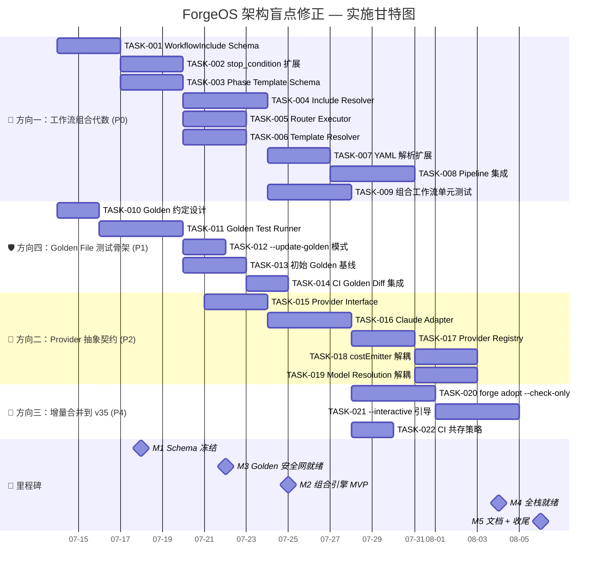

以下是基于审计文档的 Tech Lead 全面分析报告。

---

# Tech Lead 分析报告：ForgeOS 架构盲点修正

**分析依据**: `2026-07-11-five-codelevel-architectural-blindspots.out.md` 审计 + 交叉验证 `expansion-horizon-three.md`、`high-value-extension-v35.md`、`expansion-production-readiness.md`、`strategic-extensions-v33.md`、`.agent/ARCHITECTURE.md`

**分析日期**: 2026-07-12

---

## 核心策略判断

审计揭示了三处差异化声明缺陷（方向三 80%+ 重叠、方向二架构描述过时、方向一/二引用错误），但 **方向本身的选择是正确的**。作为 Tech Lead，我的决策：

1. **方向一（工作流组合代数）**→ P0，全速推进。这是真正的水平断裂，审计确认代码证据 100% 准确。H3 愿景关键拼图。
2. **方向四（golden file 测试骨架）**→ P1，优先做。它不只是一个方向，更是方向一的**安全网**——没有 golden file，组合工作流的改动没有回归防护。
3. **方向二（Provider 抽象契约）**→ P2，等方向一/四稳定后再做。架构已部分解耦（依赖注入模式），最紧迫的耦合点（`costEmitter` 解析 Claude JSON、`isClaude` 字符串匹配）可以推迟到 v3 跨厂商需求明确时处理。
4. **方向三（渐进式治理采纳）**→ **不作为独立方向执行**。80%+ 已被 `high-value-extension-v35.md` 方向五覆盖。仅将三项增量（`--check-only`、`--interactive`、CI 共存）合并为 v35 方向五的扩展 PR。

---

## 1. 任务分解

### 方向一：工作流组合代数（P0）

| 任务 ID | 标题 | 涉及文件 | 前置依赖 | 预估工时 | 验收标准 |
|---------|------|---------|---------|---------|---------|
| TASK-001 | **WorkflowInclude schema 设计** — 在 `asset.go` 中添加 `WorkflowInclude` 结构体，定义 include 语义（阶段合并策略、覆盖规则、循环引用检测） | `forge-core/internal/asset/asset.go` | 无 | 3h | `Workflow.WorkflowIncludes []WorkflowInclude` 字段定义完善，包含 `path string`、`strategy (merge/prepend/append)`、`phase_mapping []PhaseOverride`，有设计注释 |
| TASK-002 | **stop_condition 扩展** — 在 `StopCondition` 中增加 `OnMet`/`OnUnmet` 路由指令，定义条件跳转语义（目标 workflow + phase） | `forge-core/internal/asset/asset.go` | TASK-001 | 3h | `StopCondition.OnMet *RouterDirective`、`StopCondition.OnUnmet *RouterDirective` 字段新增，`RouterDirective` 含 `target_workflow string`、`target_phase string`、`timeout duration` |
| TASK-003 | **Shared Phase Template schema** — 定义 `PhaseTemplate` 结构体，允许 workflow 引用外部可复用 phase 模板 | `forge-core/internal/asset/template.go`（新文件） | TASK-001 | 3h | `PhaseTemplate` 结构体定义完成，支持 `name`、`phases []Phase`、`params map[string]interface{}`、`$ref` 解析语法 |
| TASK-004 | **WorkflowInclude resolver** — 实现 include 加载器：解析路径→加载 YAML→按策略合并 phases→循环引用检测 | `forge-core/internal/asset/resolver.go`（新文件） | TASK-001, TASK-002 | 4h | 能解析三层嵌套 include；循环引用报警并中止；merge/prepend/append 三种策略均实现；单元测试覆盖 |
| TASK-005 | **stop_condition router executor** — 在 orchestrator 的 Converge 之后添加路由逻辑：读 `OnMet`/`OnUnmet`→`autoSelectWorkflow`→加载目标 workflow 继续执行 | `forge-core/internal/orchestrator/engine.go`、`internal/orchestrator/executor.go` | TASK-002, TASK-004 | 3h | Converge 返回 `met=true` 时触发 `OnMet` 路由，加载目标 workflow 并执行；`met=false` 触发 `OnUnmet`；无路由指令时保持现有行为（兼容性） |
| TASK-006 | **Phase Template resolver** — 实现模板实例化：加载模板→替换参数→展开 phases→检查缺失参数 | `forge-core/internal/asset/template.go` | TASK-003 | 3h | 模板能实例化为 `[]Phase`；参数缺失时报具体错误；支持模板嵌套引用 |
| TASK-007 | **YAML 解析扩展** — 更新 workflow YAML parser 解析 include/on_met/on_unmet/template 语法 | `forge-core/internal/asset/yaml.go` | TASK-001, TASK-002, TASK-003 | 3h | 能解析带 include/template 的完整 workflow YAML；解析失败给出可读错误信息（行号 + 上下文） |
| TASK-008 | **Pipeline 集成** — 将组合工作流接入 `cmdRun`/`cmdEvolve`：加载后先 resolve include/template，再执行；添加 `forge pipeline` 命令（可选） | `forge-core/cmd/forge/main.go`、`cmd/forge/run.go` | TASK-004, TASK-005, TASK-007 | 4h | `forge run <workflow>` 能执行含 include 的组合 workflow；pipeline 执行完成后输出完整执行轨迹；错误时定位到具体子 workflow |
| TASK-009 | **组合工作流单元测试** — 覆盖 include 解析的 3 种策略、循环引用检测、OnMet/OnUnmet 路由、template 参数化 | `forge-core/internal/asset/asset_test.go`、`internal/orchestrator/executor_test.go` | TASK-004, TASK-005, TASK-006 | 4h | 测试覆盖率 ≥ 85%（方向一新增代码）；所有边界场景（空 include、循环、缺失文件、模板参数错误）均有测试 |

### 方向四：Golden File 测试骨架（P1）

| 任务 ID | 标题 | 涉及文件 | 前置依赖 | 预估工时 | 验收标准 |
|---------|------|---------|---------|---------|---------|
| TASK-010 | **Golden file 目录结构和格式约定** — 设计 `testdata/golden/` 目录布局，定义 golden 文件内容格式（phase 序列、mode 变化、converge 结果、gate 调用） | `docs/testing/golden-file-convention.md`（新文件） | 无 | 2h | 文档完整，包含目录结构示例、golden 文件格式定义、更新流程（本地 + CI）；团队 review 通过 |
| TASK-011 | **Golden test runner 核心** — 实现 DryRunExecutor + golden 对比：执行 workflow → 序列化执行轨迹 → 与 golden 文件 diff | `forge-core/internal/orchestrator/golden_test.go`（新文件） | TASK-010 | 4h | 能加载 workflow fixture → DryRun → 生成结构化轨迹（phase 顺序、gate 调用、mode 切换记录、converge 结果）→ 与 golden 文件对比 → 输出 diff（包含轨迹差异具体位置） |
| TASK-012 | **`--update-golden` 模式** — 添加测试 flag/local env 检测：环境变量或 flag 控制是否更新 golden 文件 | `forge-core/internal/orchestrator/golden_test.go` | TASK-011 | 2h | `UPDATE_GOLDEN=1 go test` 或 `--update-golden` flag 自动重新生成 golden 文件；CI 环境下不执行更新（安全机制） |
| TASK-013 | **为现有 5 个 workflow 创建 golden 基线** — 运行 golden test runner 生成初始 golden 文件，提交到仓库 | `forge-core/internal/orchestrator/testdata/golden/discover.yml/` 等 5 个目录 | TASK-011 | 3h | 5 个 workflow 的 golden 文件完整；`go test` 验证全部通过（golden 一致）；所有 golden 文件签入 git |
| TASK-014 | **CI golden diff 集成** — 在 GitHub Actions 中添加 step：运行 golden test + 文件状态检查 | `.github/workflows/forge.yml`、`harness/check_golden.mjs`（新文件） | TASK-013 | 2h | CI 中 golden 测试自动运行；golden 文件变更时 CI 失败并显示 diff；有 `[golden-update]` commit tag 跳过 golden 检查 |

### 方向二：Provider 抽象契约（P2）

| 任务 ID | 标题 | 涉及文件 | 前置依赖 | 预估工时 | 验收标准 |
|---------|------|---------|---------|---------|---------|
| TASK-015 | **Provider Interface 定义** — 设计 `Provider` 接口：`SendPrompt(ctx, prompt, tier) → (response, cost, error)`、`ParseCost(raw json) → Cost`、`ResolveModel(tier string) → model string`、`RenderLog(raw json) → string` | `forge-core/internal/provider/interface.go`（新包 `internal/provider`） | 无 | 3h | 接口方法完整，覆盖当前 Claude 耦合的 3 个核心点（cost解析、model 解析、log 渲染）；有清晰的接口设计注释和实现契约 |
| TASK-016 | **Claude provider adapter** — 封装现有 Claude 逻辑：`claudeArgv`、`unwrapClaudeResult`、`classifyClaudeOverload`、`parseClaudeCostUsd` 迁移到 adapter | `forge-core/internal/provider/claude.go`（新文件） | TASK-015 | 4h | 所有 Claude 特有逻辑迁移到 `ClaudeProvider`；原有 `engine_build.go`/`cost.go` 调用者改为通过 adapter 调用；功能等价、所有现有测试通过 |
| TASK-017 | **Provider registry + factory** — 实现 `ProviderFactory`：根据配置（`agent_cmd` 或 `provider.name`）创建对应 provider；替换 `isClaude := strings.Contains(o.agentCmd, "claude")` 字符串匹配 | `forge-core/internal/provider/registry.go`（新文件） | TASK-015, TASK-016 | 3h | Factory 能根据 agent_cmd 选择 provider；配置化 provider 选择（`project.yml` 中 `provider: claude`）；字符串匹配仅保留在 factory 中，其余代码消除 `isClaude` 分支 |
| TASK-018 | **costEmitter 解耦** — 替换 `parseClaudeCostUsd` 硬编码解析，改为通过 `provider.ParseCost()` 调用 | `forge-core/internal/orchestrator/cost.go` | TASK-016 | 3h | `costEmitter` 不直接引用 Claude JSON 路径；cost 解析通过 Provider 接口；现有成本报告功能不变 |
| TASK-019 | **model resolution 解耦** — 替换 `routing.ResolveModel("anthropic", tier)` 硬编码，引入 provider-aware model resolution | `forge-core/internal/llm/routing.go` | TASK-015, TASK-016 | 3h | `routing.ResolveModel` 接受 Provider 参数；`ModelMap` 注册到 Provider 内部；现有路由行为不变 |

### 方向三：增量合并到 v35（P4）

| 任务 ID | 标题 | 涉及文件 | 前置依赖 | 预估工时 | 验收标准 |
|---------|------|---------|---------|---------|---------|
| TASK-020 | **`forge adopt --check-only <check>` 粒度命令** — 新增 `adopt` 子命令（或扩展 `forge-init`），支持运行单个治理检查 | `forge-core/cmd/forge/adopt.go`（新文件）、`harness/check.py`（新增 `--checks` flag） | 无 | 4h | `forge adopt --check-only lint` 只运行 lint 检查；输出可读结果（pass/fail + 细节）；`forge adopt --list-checks` 列出所有可用检查 |
| TASK-021 | **`forge adopt --interactive` 交互引导** — CLI 对话式向导：询问项目规模、已有 CI、治理需求→推荐 profile | `forge-core/cmd/forge/adopt_interactive.go`（新文件） | TASK-020 | 4h | 交互式对话完整：4-6 个问题后推荐 profile+ 显示推荐理由 + 询问确认；确认后执行相应配置 |
| TASK-022 | **CI 共存策略** — docs + 实现：检测已有 CI 配置（Makefile/.github/workflows）→不覆盖 + 生成兼容适配 | `docs/operations/ci-coexistence.md`（新文件）、`harness/etc/coexist.mjs`（新文件） | 无 | 2h | 有 CI 配置文件时不覆盖；生成 `forge-accept.yml` 片段可手动 merge；文档包含兼容配置示例 |

---

## 2. 执行顺序与依赖图

```mermaid
graph TD
    %% === Style Definitions ===
    classDef p0 fill="#1a7f37",stroke="#145c27",color="#ffffff"
    classDef p1 fill="#9a6700",stroke="#7a5200",color="#ffffff"
    classDef p2 fill="#8250df",stroke="#6230bf",color="#ffffff"
    classDef p4 fill="#6e7681",stroke="#505560",color="#ffffff"
    classDef milestone fill="#0d419d",stroke="#0a2e70",color="#ffffff"

    %% === 方向一：工作流组合代数 (P0) ===
    T001[TASK-001: WorkflowInclude schema]:::p0
    T002[TASK-002: stop_condition 扩展]:::p0
    T003[TASK-003: Phase Template schema]:::p0
    T004[TASK-004: Include resolver]:::p0
    T005[TASK-005: stop_condition router executor]:::p0
    T006[TASK-006: Phase Template resolver]:::p0
    T007[TASK-007: YAML 解析扩展]:::p0
    T008[TASK-008: Pipeline 集成]:::p0
    T009[TASK-009: 组合工作流单元测试]:::p0

    %% === 方向四：Golden File 测试骨架 (P1) ===
    T010[TASK-010: Golden file 约定设计]:::p1
    T011[TASK-011: Golden test runner]:::p1
    T012[TASK-012: --update-golden 模式]:::p1
    T013[TASK-013: 初始 golden 基线]:::p1
    T014[TASK-014: CI golden diff 集成]:::p1

    %% === 方向二：Provider 抽象契约 (P2) ===
    T015[TASK-015: Provider Interface]:::p2
    T016[TASK-016: Claude adapter]:::p2
    T017[TASK-017: Provider registry]:::p2
    T018[TASK-018: costEmitter 解耦]:::p2
    T019[TASK-019: Model resolution 解耦]:::p2

    %% === 方向三增量：合并到 v35 (P4) ===
    T020[TASK-020: forge adopt --check-only]:::p4
    T021[TASK-021: --interactive 引导]:::p4
    T022[TASK-022: CI 共存策略]:::p4

    %% === 依赖关系 ===
    %% 方向一依赖
    T001 --> T002
    T001 --> T003
    T001 --> T004
    T002 --> T004
    T002 --> T005
    T003 --> T006
    T004 --> T005
    T004 --> T007
    T005 --> T008
    T006 --> T007
    T007 --> T008
    T004 --> T009
    T005 --> T009
    T006 --> T009

    %% 方向四依赖
    T010 --> T011
    T011 --> T012
    T011 --> T013
    T012 --> T014
    T013 --> T014

    %% 方向二依赖
    T015 --> T016
    T015 --> T017
    T016 --> T017
    T016 --> T018
    T016 --> T019
    T017 --> T018
    T017 --> T019

    %% 方向三依赖
    T020 --> T021

    %% 跨方向依赖（方向四 → 方向一安全网）
    T013 -.->|安全网使能| T009

    %% === Milestones ===
    M1((M1: Schema 冻结<br/>Day 5)):::milestone
    M2((M2: 组合引擎 MVP<br/>Day 12)):::milestone
    M3((M3: Golden 安全网就绪<br/>Day 10)):::milestone
    M4((M4: 全栈就绪<br/>Day 20)):::milestone

    T001 --> M1
    T002 --> M1
    T003 --> M1
    T010 --> M3
    T011 --> M3
    T004 --> M2
    T005 --> M2
    T008 --> M4
    T014 --> M4
```

### 可并行执行的任务组

| 并行组 | 任务 | 分配给 | 时段 |
|--------|------|--------|------|
| **Group A**（3 人并行） | TASK-001（Schema设计）、TASK-010（Golden约定）、TASK-015（Provider Interface）、TASK-020（adopt --check-only） | Dev A/B/C | Day 1-3 |
| **Group B**（3 人并行） | TASK-002（stop_condition）、TASK-003（Template schema）、TASK-011（Golden runner） | Dev A/B/C | Day 3-6 |
| **Group C**（2 人并行） | TASK-004（Include resolver）、TASK-006（Template resolver）、TASK-016（Claude adapter） | Dev A/B | Day 6-10 |
| **Group D**（3 人并行） | TASK-005（Router executor）、TASK-007（YAML解析）、TASK-012（update-golden）、TASK-017（Registry） | Dev A/B/C | Day 10-14 |
| **Group E**（3 人并行） | TASK-008（Pipeline集成）、TASK-013（Golden基线）、TASK-018（costEmitter解耦）、TASK-021（interactive） | Dev A/B/C | Day 14-18 |
| **Group F**（3 人并行） | TASK-009（组合测试）、TASK-014（CI golden）、TASK-019（Model resolution）、TASK-022（CI共存） | Dev A/B/C | Day 18-22 |

---

## 3. 技术风险

### 🔴 高风险

| 风险 | 描述 | 影响方向 | 缓解策略 |
|------|------|---------|---------|
| **R1: WorkflowInclude 循环引用** | Workflow A include B, B include A 导致无限递归 | 方向一 | **必须做**: 在 resolver 中实现三色标记循环检测（类似 Go 的 `import cycle`），循环时报错而非 panic。测试覆盖 2→3→4 层嵌套。 |
| **R2: Golden file 基线漂移** | workflow 语义随引擎更新频繁变化，golden 文件变成「不断重拍的靶子」| 方向四 | **必须做**: golden 文件更新时 CI 要求 human review（golden 文件单独列在 CODEOWNERS）；每次 golden 更新关联对应的 workflow 变更 PR；设置 `git diff --stat` 阈值告警（golden 文件变更超过 30% 需额外审批）。 |
| **R3: Provider Interface 过粗或过细** | 接口太粗（`SendPrompt` 一个方法）→ 新 provider 要实现的逻辑太重；太细（5+ 方法）→ 每个 Claude 细节都暴露 | 方向二 | **必须做**: 先做 2 个 mock provider 实现验证接口合理性（Claude + 一个 FakeProvider for testing）。接口精确度以「一个非 Claude 的 LLM provider（如 OpenAI）能否以 ≤20 行 adapter 集成」为衡量标准。 |

### 🟡 中风险

| 风险 | 描述 | 影响方向 | 缓解策略 |
|------|------|---------|---------|
| R4: 组合后 phase 执行顺序歧义 | include merge 策略选择不当导致 phase 顺序违反直觉 | 方向一 | 策略采用「深度优先展开后按声明顺序排列」，拒绝拓扑排序（防止隐式重排）。每个组合策略（merge/prepend/append）在 schema 设计文档中给出显式示例。 |
| R5: `costEmitter` 与 provider 紧耦合重构范围过大 | cost 解析散布在 cost.go 多个函数中（`parseClaudeCostUsd`、`observeFor`、`RenderLog`），重构涉及面太广 | 方向二 | **分步走**: 第一步只抽象 `parseCost` 一个方法（最小可行接口）；第二步再抽象 `RenderLog`。不追求一步到位。 |
| R6: 方向三增量被 v35 方向五优先级碾压 | `high-value-extension-v35.md` 方向五也在同一个 backlog 里，两个 PR 可能冲突 | 方向三 | **明确归属**: 方向三的三项增量作为 `v35-direction5-ext` 分支提交，不单独分配 sprint 容量。在 v35 方向五实现完毕后，再安排 2 天做增量扩展。 |
| R7: 测试覆盖率要求影响交付速度 | 审计强调"零外部依赖"，但测试基础设施（fixture、golden 文件、mock provider）的搭建本身需要时间 | 所有方向 | 不做 100% 覆盖的教条要求。**硬性要求**: 所有新代码路径有一个 happy path + 一个 error path 测试。剩余边界场景标记 `// TODO(tc): cover edge case: XYZ` 并在下一 sprint 补充。 |

### 🟢 低风险

| 风险 | 描述 | 影响方向 | 缓解策略 |
|------|------|---------|---------|
| R8: `forge pipeline` 命令命名争议 | P0 集成本身不要求新命令，`forge run` 可以隐性支持组合 | 方向一 | 延迟决策：先专注引擎层能力，CLI 命名在 Sprint 回顾中决定。 |
| R9: YAML include 语法与已有 `depends_on` 冲突 | `depends_on` 是 phase 级引用，include 是 workflow 级包含，语义层次不同 | 方向一 | 在 schema 文档中明确区分 `depends_on`（phase 等待语义）与 `include`（workflow 包含语义），用不同关键字（`$include` vs `depends_on`）消除歧义。 |

---

## 4. 资源评估

### 团队组成建议

| 角色 | 数量 | 技能要求 | 主要职责 |
|------|------|---------|---------|
| **Go 工程师（资深）** | 1 | Go 标准库、测试驱动开发、架构设计 | 方向一核心（TASK-001~009）— schema 设计 + resolver + pipeline 集成 |
| **Go 工程师（中级）** | 1 | Go 基础、调试能力、代码阅读 | 方向四 + 方向三增量（TASK-010~014 + TASK-020~022）— golden test runner + CI 集成 |
| **Go/全栈 工程师** | 1（兼职） | Go、代码重构、接口设计 | 方向二（TASK-015~019）— provider 抽象，可与其他组并行 |
| **DevOps** | 0.5 | GitHub Actions、YAML、bash | CI golden diff 集成、CI 共存策略 |

> **最优配置**：2 名 Go 工程师（1 senior + 1 mid-level）全时投入 4 周，第 3 周加入第 3 人（兼职）做方向二。

### 关键里程碑

| 里程碑 | 时间点 | 交付物 | 通过标准 |
|--------|--------|--------|---------|
| **M1: Schema 冻结** | Day 5 | `asset.go` 三个新结构体 + YAML 语法草案 + golden 约定文档 | 团队 review 通过；`go build` 通过；无 design diff |
| **M2: 组合引擎 MVP** | Day 12 | 单层 include 解析 + stop_condition 路由 + 单元测试 | 2 个 workflow 的组合成功执行；Converge 后自动跳转 |
| **M3: Golden 安全网就绪** | Day 10 | golden test runner + 5 个 baseline golden 文件 | `go test` 全部通过；CI 上 golden diff 能捕获故意改动 |
| **M4: 全栈就绪** | Day 20 | 完整组合代数 + golden 回归保护 + Provider 抽象 + v35 增量合并 | 所有 22 个任务完成；`forge accept` 通过；闸门全绿 |
| **M5: 文档 + 收尾** | Day 22 | architecture 更新 + golden 文件编码标准文档 | Review 通过；README 更新；无遗留 TODO |

### 阻塞点（Blockers）与应对策略

| Block | 描述 | 涉及任务 | 应对策略 |
|-------|------|---------|---------|
| **B1** | `next_stage` 已有 schema 但零消费，方向一的风险在于「现有流程是否依赖手动触发」的假设 | TASK-005 | 先在 `main.go` 中添加 trace 日志验证 `next_stage` 使用情况（2h 内完成），再决定路由 executor 设计 |
| **B2** | `costEmitter` 的 JSON 解析路径散落在多个函数中，重构时需要全面理解 cost pipeline | TASK-018 | 在重构前写一份 `cost-data-flow.md` 文档（2h），追踪从 `unwrapClaudeResult` 到 `emitCost` 的完整数据流 |
| **B3** | 方向三增量合并到 v35 方向五需要与 v35 作者协调 | TASK-020~022 | 提前联系 v35 原作者，确定分支策略（是 PR 到 v35 分支还是独立 PR 后由 v35 作者 cherry-pick）|

---

## 5. 质量保证

### 5.1 单元测试覆盖要求

| 方向 | 必须覆盖的模块 | 最低覆盖率 | 关键边界场景 |
|------|--------------|-----------|-------------|
| **方向一** | WorkflowInclude resolver、stop_condition router、Template resolver、YAML parser | **85%**（新代码） | 循环引用、空 include、merge 冲突策略、OnMet & OnUnmet 同时为 nil、template 参数缺失 |
| **方向四** | Golden test runner diff 引擎、update 模式逻辑 | **80%**（新代码） | golden 文件缺失（自动 fail）、格式不匹配（非 JSON）、部分匹配时的 diff 输出 |
| **方向二** | Provider Interface 实现、Registry factory、cost 解析适配 | **90%**（新代码） | 未知 provider 名（fallback 到 Claude）、cost 字段缺失、model name 映射不存在 |
| **方向三** | `--check-only` 过滤逻辑、交互式引导状态机 | **75%**（新代码） | 无效 check name、交互输入 EOF（优雅退出）|

### 5.2 集成测试策略

```
+-------------------------------------------------------------+
|  【层 1 — DryRun 集成测试】（CI 每次提交运行，~30s）            |
|  使用 fixture YAML 加载组合 workflow → DryRunExecutor 执行     |
|  → 验证 phase 序列 / 路由跳转 / converge 结果                  |
|  覆盖：所有组合策略、所有路由条件                                |
+-------------------------------------------------------------+
|  【层 2 — Golden diff 测试】（CI 每次提交运行，~60s）           |
|  真实 workflow + DryRun → 与 golden 文件对比                  |
|  失败条件：golden 文件与执行结果不一致（有意改动触发）            |
+-------------------------------------------------------------+
|  【层 3 — 端到端测试】（CI 每日一次或 pre-release，~5min）      |
|  forge run 实际组合 workflow → 验证 exit code + 输出内容       |
|  仅覆盖最关键的 1-2 个组合场景                                  |
+-------------------------------------------------------------+
```

### 5.3 代码审查要点

| 审查焦点 | 具体检查项 | 所属方向 |
|---------|---------|---------|
| **Schema 设计正确性** | 字段语义是否清晰？新增结构是否与已有 `asset.go` 类型一致？空值是否零值安全？ | 方向一 |
| **循环引用检测** | resolver 是否使用三色标记/DFS？检测到循环时是否优雅报错而非 panic？ | 方向一 |
| **Golden diff 准确性** | diff 是否按语义路径对比而非逐行？false positive 场景是否已考虑？（如时间戳/随机值） | 方向四 |
| **Provider 接口粒度** | 接口是否足够泛化以支持 OpenAI/Anthropic/Google？是否有 Claude 特有概念泄漏？ | 方向二 |
| **向后兼容性** | 现有 workflow YAML 不加 include/on_met 是否 100% 保持原有行为？ | 方向一 |
| **无硬编码新 dependency** | `go.mod` 无新增外部依赖；`harness/` 无新的 npm/pip 依赖 | 所有方向 |

### 5.4 性能测试需求

| 测试场景 | 方向 | 负载 | SLA |
|---------|------|------|-----|
| 3 层嵌套 WorkflowInclude 解析耗时 | 方向一 | 最大 10 层嵌套 | < 50ms |
| 同时执行 5 个组合 workflow 的内存峰值 | 方向一 | 5 个组合 pipeline | 相对 baseline + < 20% |
| Golden diff 大文件（1000+ phase）的对比时间 | 方向四 | 1000-phase golden 文件 | < 500ms |
| Provider registry 并发创建（10 goroutine）| 方向二 | 10 并发创建请求 | 无 race condition |

> **性能测试原则**：不做不必要的早优化。上述 SLA 只在真实性能问题暴露后才加回归测试。

---

## 6. 实施计划



### 阶段划分

#### 阶段 1：基础设施 + 设计（Day 1-5 | 7月14日-7月18日）

| 日期 | 活动 | 产出 |
|------|------|------|
| Day 1 | **项目启动** — 审计发现同步、团队对齐、任务认领、开发环境验证 | Kickoff 记录、分支策略确定 |
| Day 2-3 | **Schema 设计冲刺** — TASK-001、TASK-010、TASK-015、TASK-020 设计文档 + 代码 | `asset.go` 新增结构体、golden 约定文档、Provider Interface |
| Day 4-5 | **Schema review + 修正** — 团队 review、设计缺陷修正、冻结 | **M1 里程碑**: Schema 冻结 |

> **Dev A**: TASK-001（WorkflowInclude schema）+ TASK-003（Template schema）
> **Dev B**: TASK-010（Golden 约定）+ TASK-020（adopt --check-only）
> **Dev C（兼职）**: TASK-015（Provider Interface）

#### 阶段 2：核心引擎实现（Day 6-12 | 7月21日-7月25日）

| 日期 | 活动 | 产出 |
|------|------|------|
| Day 6-8 | **组合核心** — TASK-002（stop_condition 扩展）、TASK-011（Golden runner） | stop_condition 扩展实现、golden diff 引擎 |
| Day 9-10 | **Resolver 实现** — TASK-004（Include resolver）+ TASK-006（Template resolver） | 循环引用检测、include 解析、模板实例化 |
| Day 11-12 | **集成验证** — TASK-005（Router executor）+ TASK-007（YAML 解析） | 组合 workflow 能跑起来 |

> **M2 里程碑**（Day 12）：组合引擎 MVP — 2 个 workflow 能组合，stop_condition 跳转工作
> **M3 里程碑**（Day 10）：Golden 安全网就绪 — golden 测试通过，CI 能检测漂移

#### 阶段 3：集成 + 扩展（Day 13-19 | 7月28日-8月3日）

| 日期 | 活动 | 产出 |
|------|------|------|
| Day 13-15 | **Pipeline 集成** — TASK-008（集成到 main.go）+ TASK-013（Golden 基线） | `forge run` 支持组合 workflow；所有 golden 基线签入 |
| Day 15-17 | **Provider 解耦** — TASK-016（Claude adapter）+ TASK-017（Registry） | 方向二核心：Provider 接口的 Claude 实现 |
| Day 17-19 | **剩余功能** — TASK-018（costEmitter 解耦）+ TASK-019（Model resolution）+ TASK-014（CI golden） | 方向二完成；CI golden diff 自动执行 |

#### 阶段 4：测试 + 发布（Day 20-22 | 8月4日-8月6日）

| 日期 | 活动 | 产出 |
|------|------|------|
| Day 20 | **测试强化** — TASK-009（组合工作流测试）+ TASK-021（--interactive）/ TASK-022（CI 共存） | 组合测试覆盖率 ≥ 85%；方向三增量完成 |
| Day 21 | **闸门全跑** — `forge accept` 完整闸门、架构一致性检查、secret 扫描 | 所有闸门通过 |
| Day 22 | **文档 + 回顾** — 更新 `BOOTSTRAP.md`、`.agent/ARCHITECTURE.md`；团队回顾 | **M5 里程碑**：发布就绪 |

> **备注**: 方向三的三项任务（TASK-020~022）不形成独立阶段，**merge 到 v35 方向五的扩展分支**，在 Day 20-21 作为收尾工作完成。

---

## 总结：给方向提交者的反馈

### 三处必须修正

| # | 问题 | 严重程度 | 修正要求 |
|---|------|---------|---------|
| 1 | 方向三「零覆盖」声明不成立（80%+ 重叠 v35 方向五） | **Critical** | 重新定位为 v35 方向五的增量扩展；删除「零覆盖」声明 |
| 2 | 方向二架构描述不准确（实际已用 DI 模式） | **Major** | 更新代码描述：聚焦 `costEmitter` 解析 Claude JSON、`isClaude` 字符串匹配、`ResolveModel("anthropic")` 硬编码这 3 个真正耦合点 |
| 3 | 方向一/二差异化引用指向错误内容 | **Major** | 方向一引用 `expansion-horizon-three.md` 方向一（管线工作流组合）而非「多仓库联邦」；方向二引用 `ROADMAP.md` P3 而非 `expansion-horizon-three`/`sixth-wave` |

### 两处建议完善

| # | 建议 | 方向 | 理由 |
|---|------|------|------|
| 4 | 文末加「与已有分析关系总表」 | 全局 | 避免再次出现误导性「零覆盖」声明；让 reviewer 一目了然重叠度和增量 |
| 5 | 方向四明确引用 `asset-runtime-gap.md` §2.1 作为基础 | 方向四 | 诚实承认已有提案，清晰定位 golden file 机制为增量，增强可信度 |

修正后，**方向一**和**方向四**应保持 P0/P1 优先级推进，**方向二**降为 P2（等 v3 跨厂商需求明确），**方向三**不独立提交。
