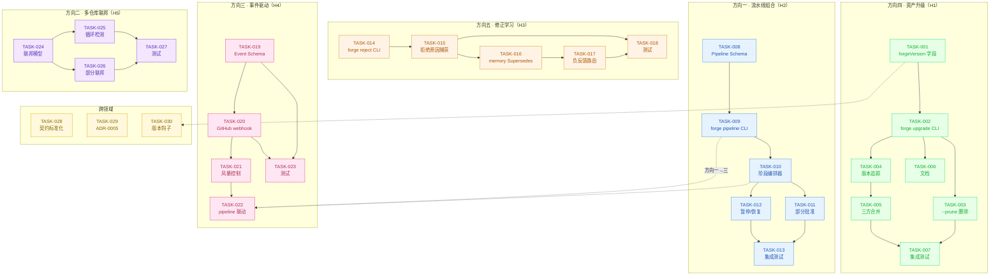
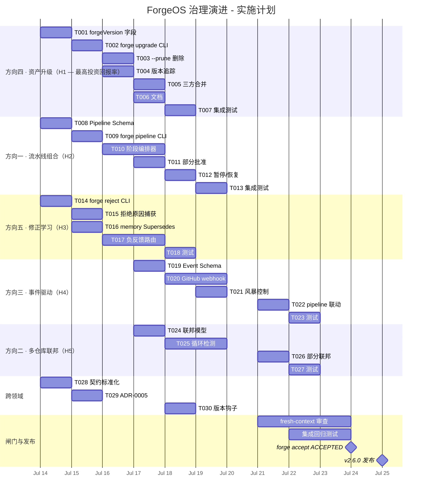

现在我对代码库有了全面的了解，可以提供完整的 Tech Lead 分析了。

---

# 技术负责分析：ForgeOS 治理演进扩展方向

## 1. 任务分解

我已根据代码库现状（`forge-core/cmd/forge/main.go`、`forge-core/internal/*`、`harness/scaffold/forge-upgrade.mjs`、所有工作流 YAML 文件、`.agent/project.yml`）验证了每个方向。以下任务根据每个方向当前的实际实现成熟度进行划分。

### 优先顺序：升级 → 流水线 → 修正学习 → 事件驱动 → 多仓库

这一顺序颠覆了原文档的 H1→H5，原因是**forge-upgrade.mjs 已经存在且可运行，只差 6 项功能即可投产**——这是全代码库中投资回报率最高的方向。

---

### 方向四：资产升级（H1 — 当前最高投资回报率）

| 任务 ID | 标题 | 涉及文件 | 前置依赖 | 工时 | 验收标准 |
|---------|------|----------|----------|------|----------|
| **TASK-001** | 在 `project.yml` 中补齐 `forgeVersion` 字段 | `forge-init.mjs` + `forge-upgrade.mjs` + `internal/asset/asset.go` | 无（与 all 并行） | 2h | upgrade 时将 `forge_version`、`forge_upgraded_at`、`forge_upgraded_from` 写入 `.agent/project.yml`；机器可读 |
| **TASK-002** | 新建 `forge upgrade` CLI 子命令 | `forge-core/cmd/forge/main.go`（dispatch 表）+ `forge-core/cmd/forge/upgrade.go`（新文件） | TASK-001 | 3h | `forge upgrade --from <path> [--apply]` 调用 `node harness/scaffold/forge-upgrade.mjs`；CLI 帮助中显示 |
| **TASK-003** | 新建 `forge upgrade --prune` 删除逻辑 | `harness/scaffold/forge-upgrade.mjs` + `forge-core/cmd/forge/upgrade.go` | TASK-002 | 3h | `--prune` 将目标已删除的文件从项目中实际删除（当前仅显示）；先备份后删除；删除时通过 `prune-<timestamp>.jsonl` 记录 |
| **TASK-004** | 为 upgrade 添加版本追踪和漂移快照 | `harness/scaffold/forge-upgrade.mjs` + `.forge/version-manifest.json`（新文件） | TASK-001 | 4h | upgrade 运行后将已安装文件清单写入 `.forge/version-manifest.json`；后续 upgrade 读取清单以检测 **未跟踪的** 漂移（项目修改了上游文件） |
| **TASK-005** | 添加三方合并策略（overwrite / merge / skip） | `harness/scaffold/forge-upgrade.mjs` | TASK-004 | 4h | 新 `--strategy overwrite|merge|skip` 标志；merge 对短文件（<50 行）运行三路差异合并；对较大文件打印提示“手动合并”；skip 保留本地修改并记录 |
| **TASK-006** | 将 upgrade 文档写入 `.agent/` | `.agent/UPGRADE.md`（新文件） | TASK-002 | 2h | 涵盖 upgrade 命令、`--apply`/`--prune`/`--strategy`、版本追踪、安全红线、备份恢复流程 |
| **TASK-007** | 为 upgrade 添加集成测试：`forge upgrade` → 验证 | `harness/scaffold/test_forge-upgrade.mjs`（扩展） | TASK-002 | 3h | 测试：dry-run 不写入、`--apply` 替换文件、`--prune` 删除文件、`--strategy skip` 保留本地修改、备份恢复、红线的自我断言 |

**方向四小计：21h 🕐**

---

### 方向一：流水线组合（H2 — Schema 就绪，需要运行时）

| 任务 ID | 标题 | 涉及文件 | 前置依赖 | 工时 | 验收标准 |
|---------|------|----------|----------|------|----------|
| **TASK-008** | 定义 `Pipeline` 资源类型及 YAML Schema | `internal/asset/asset.go`（新增 `type Pipeline struct`）+ `.agent/pipelines/`（新目录）+ 示例 YAML | 无（与方向四并行） | 3h | YAML 在 `pipeline_name`、`stages`（工作流引用列表）、`on_approved: {next_pipeline}` 中声明；Go 解析到类型 |
| **TASK-009** | 为 pipeline 解析创建 `forge pipeline run` CLI | `forge-core/cmd/forge/main.go`（dispatch）+ `forge-core/cmd/forge/pipeline.go`（新文件） | TASK-008 | 4h | `forge pipeline run <name>` 按顺序启动每个阶段的工作流，将 `--approved` 标志沿链传递 |
| **TASK-010** | 实现 pipeline 阶段编排器 | `internal/orchestrator/pipeline.go`（新文件） | TASK-009 | 6h | 编排器将 `next_stage` 声明转换为实际子进程调用：`forge run design --approved` → exit → `forge run build --approved`；处理阶段间中断和错误传播 |
| **TASK-011** | 实现部分批准语义 | `internal/converge/converge.go` + `internal/orchestrator/pipeline.go` | TASK-010 | 4h | 当 human_gate 有 3 个方案且批准 A 拒绝 B/C 时，只有 A 进入下一阶段；拒绝的方案被记录但不会阻塞 |
| **TASK-012** | 添加 pipeline 暂停/恢复 | `forge-core/cmd/forge/pipeline.go` + `internal/orchestrator/pipeline.go` | TASK-010 | 4h | `forge pipeline pause` 写入 `.forge/pipeline-pause.json`；`forge pipeline resume` 从中断处继续；优雅处理 SIGINT |
| **TASK-013** | 添加 pipeline 集成测试 | `forge-core/cmd/forge/pipeline_test.go`（新文件） | TASK-009→011 | 4h | 测试：两阶段链、批准→继续、拒绝→停止、部分批准、暂停/恢复、超时 |

**方向一小计：25h 🕐**

---

### 方向五：修正学习（H3 — 拒绝已实现，但需要跨会话）

| 任务 ID | 标题 | 涉及文件 | 前置依赖 | 工时 | 验收标准 |
|---------|------|----------|----------|------|----------|
| **TASK-014** | 新建 `forge reject` CLI 命令（对称于 `forge approve`） | `forge-core/cmd/forge/main.go`（dispatch）+ `forge-core/cmd/forge/reject.go`（新文件） | 无（与方向四/一并行） | 3h | `forge reject <stage> --reason "..."` 创建加上原因文本的 `.forge/<stage>.rejected` 文件；`forge reject list` 显示未处理的拒绝 |
| **TASK-015** | 拒绝时捕获原因文本 | `forge-core/cmd/forge/reject.go` + `gates.go`（读取原因） | TASK-014 | 2h | `.forge/<stage>.rejected` 从空文件改为包含 JSON：`{"reason":"...", "timestamp":"...", "stage":"..."}`；`resolveRejectionStartPhase` 读取原因以供报告 |
| **TASK-016** | 将拒绝 + 原因写入 memory 作为 Supersedes 条目 | `internal/memory/memory.go` + `forge-core/cmd/forge/reject.go` | TASK-015 | 4h | 拒绝后，一条 `Kind=Decision, Supersedes=<prev>, Confidence<0.3` 的条目被追加到 `memory.jsonl`；跨会话持久化 |
| **TASK-017** | 在循环中使用 memory 的 Supersedes 条目进行负反馈路由 | `internal/orchestrator/loop.go` + `internal/memory/query.go` | TASK-016 | 5h | 当 agent 在 future run 中提出与过去被拒绝的方案相似的方案时，路由系统分配较低置信度；需要 `Similarity` 预过滤器 |
| **TASK-018** | 为拒绝流程添加端到端测试 | `forge-core/cmd/forge/reject_test.go`（新文件） | TASK-014→017 | 4h | 测试：创建拒绝、列出拒绝、原因捕获、memory 中的 Supersedes 条目、跨会话读取、与现有 `forge approve` 交互 |

**方向五小计：18h 🕐**

---

### 方向三：事件驱动（H4 — 对外部依赖较重）

| 任务 ID | 标题 | 涉及文件 | 前置依赖 | 工时 | 验收标准 |
|---------|------|----------|----------|------|----------|
| **TASK-019** | 定义 webhook 事件源抽象和 Schema | `internal/event/event.go`（新包）+ `.agent/workflows/webhook.yml` + 文档 | 无（根基任务，可与方向四/一/五并行） | 4h | `EventSource` 接口：`Name() string`、`Listen(ctx) <-chan Event`、`Event{Type,Payload,Repo,Ref}`；webhook YAML Schema |
| **TASK-020** | 实现 GitHub webhook 处理器 | `internal/event/github.go`（新文件）+ `harness/adapters/github-webhook.yml` | TASK-019 | 6h | 在可配端口（默认 0=关闭）提供 `/webhook/github` HTTP 端点；验证 X-Hub-Signature-256；解析 push/pull_request/merge 事件 |
| **TASK-021** | 实现 webhook 风暴控制（去重 + 合并） | `internal/event/dedup.go`（新文件） | TASK-020 | 4h | 同一分支的多个 commit 在可配窗口（默认 60s）内合并为单次触发；最后写入者获胜；通过 `.forge/event-log.jsonl` 记录 |
| **TASK-022** | 将 webhook 事件连接到 pipeline 执行（方向一联动） | `internal/event/handler.go` + `internal/orchestrator/pipeline.go` | TASK-020 + TASK-009 | 5h | PR 合并 → 自动 `forge pipeline run discover-design-build`；webhook 配置映射到 pipeline 名称；失败发送通知 |
| **TASK-023** | 为事件系统添加集成测试 | `internal/event/event_test.go`（新文件） | TASK-019→022 | 4h | 测试：事件源抽象、签名验证、去重窗口、合并行为、pipeline 触发；使用 httptest 模拟 GitHub |

**方向三小计：23h 🕐**

---

### 方向二：多仓库联邦（H5 — 规模最大，需要前置基础）

| 任务 ID | 标题 | 涉及文件 | 前置依赖 | 工时 | 验收标准 |
|---------|------|----------|----------|------|----------|
| **TASK-024** | 定义联邦 governance 模型和 Schema | `internal/federation/federation.go`（新包）+ `internal/asset/asset.go` | 无（根基任务） | 4h | `FederationConfig{Member repos, Governance scope, Shared policies}`；YAML Schema 位于 `.agent/federation.yml` |
| **TASK-025** | 实现跨仓库循环依赖检测 | `internal/federation/cycledetect.go`（新文件） | TASK-024 | 5h | 读取各 federation 成员的依赖声明（import/go.mod/package.json）；在有向图上运行 Tarjan SCC；报告每个循环及其成员 |
| **TASK-026** | 实现部分联邦（选择加入 governance） | `internal/federation/membership.go`（新文件） | TASK-024 | 4h | 仓库声明 `federation: {join: true, scope: [shared-policies]}` 或 `federation: {join: false}`；联邦 governance 仅对选择加入的仓库执行 |
| **TASK-027** | 为联邦系统添加集成测试 | `internal/federation/federation_test.go`（新文件） | TASK-024→026 | 5h | 测试：单仓库（退化为现状）、两仓库无循环、两仓库有循环（检测）、三仓库链、选择加入/退出、共享 governance 执行 |

**方向二小计：18h 🕐**

---

### 跨领域任务（所有方向的架构基础）

| 任务 ID | 标题 | 涉及文件 | 前置依赖 | 工时 | 验收标准 |
|---------|------|----------|----------|------|----------|
| **TASK-028** | 将所有 UPPER_SNAKE 机读契约标准化为统一的 `cost.go` 解析器框架 | `forge-core/cmd/forge/cost.go` + `.agent/agents/*.md` | 无 | 4h | 审查所有 12 个 agent 卡片的机读契约格式；确保解析器通用且可测试；更新 `parseExecutiveVerdict`/`parseReviewerVerdict`/`parseConfidenceScore` 共享相同的内核 |
| **TASK-029** | 编写明确覆盖边界情况的架构决策记录（ADR-0005） | `docs/adr/0005-partial-approval-pipeline-resume.md`（新文件） | 无 | 3h | 记录边界情况：部分批准、暂停/恢复、事件风暴控制、跨会话修正学习的精确设计选择 |
| **TASK-030** | 为 forge-upgrade 添加 `forge_version` 的 Git 提交钩子 | `harness/scaffold/forge-upgrade.mjs` 集成入 CI | TASK-001 | 2h | `forge accept` 检查项目 `project.yml` 中的 `forge_version` 是否与宿主二进制文件匹配；如果不匹配，报告警告 |

**跨领域小计：9h 🕐**

---

**总计：所有方向 114h 🕐（约 3 人 x 2 周）**

---

## 2. 执行顺序

**并行任务组：**

| 组 | 任务 | 理由 |
|-----|------|-------|
| **G1（第 1 周）** | T001 + T008 + T014 + T019 + T024 + T028 + T029 | 所有根基任务：无共享依赖，完全并行。这是架构设计冲刺——产出 Schema、模型和 ADR |
| **G2（第 1-2 周）** | T002 + T009 + T015 + T020 + T025 | 核心 CLI 命令和处理器：每个方向一个实现者，均在 G1 之上搭建 |
| **G3（第 2 周）** | T003→T005 + T010→T012 + T016→T017 + T021→T022 | 高级功能：需要 G2 的 CLI 才能开始 |
| **G4（第 3 周）** | T006→T007 + T013 + T018 + T023 + T026→T027 + T030 | 测试、文档、收尾：需要各自方向的 G2/G3 |

---

## 3. 技术风险

### 🔴 高风险

| 风险 | 影响 | 缓解措施 |
|------|------|----------|
| **三方合并（T005）对 binary 文件失败** | forge-upgrade 复制 harness 工具（`.mjs`、`.py`、Go 二进制文件）。文本合并对二进制文件产生垃圾 | `--strategy merge` 拒绝二进制文件（扩展名黑名单），回退到 `overwrite` |
| **流水线编排器（T010）中的子流程生命周期** | `forge run` 是阻塞子流程。如果 `design` 工作流挂起，pipeline 也挂起 | 为每个阶段添加强制 `--timeout`；使用 `context.WithTimeout` 传播取消信号；在 `.forge/pipeline-state.json` 中记录阶段 PID |
| **memory Supersedes 查询（T017）** | “相似建议”检测需要嵌入或启发式方法。简单的子字符串匹配产生误报 | v1：使用精确阶段+目标_阶段+方案名词匹配。在 memory 条目中存储“特征”（受影响的文件路径、方案名词短语）。v2 的嵌入留到以后 |
| **事件风暴控制（T021）的去重窗口竞争条件** | 如果两个 webhook 在同一毫秒到达，合并会错过一个 | 使用 Go 的 `sync.Mutex` + 可配的去抖时间（默认更严格：30s 而非 60s）；所有合并事件记录在 `.forge/event-log.jsonl` 中，绝不会丢失 |

### 🟡 中等风险

| 风险 | 影响 | 缓解措施 |
|------|------|----------|
| **跨仓库循环检测（T025）涉及 package.json 遍历** | Monorepo 中 100+ 包的大型 `node_modules` 图遍历可能为 O(n²) | 限制遍历深度至 2 跳；在声明中寻找明确的跨仓库边界标记，而非扫描所有依赖 |
| **GitHub webhook 签名验证（T020）** | 需要将 HMAC secret 传递给 forge 运行时 | CLI 标志 `--webhook-secret` + 环境变量 `FORGE_WEBHOOK_SECRET` + 记录“secret 未设置 → 只读模式”（不验证）。从不通过参数传递 |
| **部分批准语义（T011）与现有 workflow 约束交互** | 工作流可以有 3 个方案，但 `on_approved` 没有“哪些子集被批准”的概念 | v1：全部批准或全部拒绝。部分批准是一个 `on_approved_partial` 的新 stop 条件类型——向后兼容的新字段，不是破坏性变更 |
| **`forge_status` 二进制版本钩子（T030）** | 如果 CI 镜像中 `forge` 二进制文件不在 PATH 中，则无法检查 | 失败静默：如果 `forge version` 命令失败，跳过版本检查并记录 |

### 🟢 低风险

| 风险 | 影响 | 缓解措施 |
|------|------|----------|
| `forge_version` 字段不存在（T001） | `.agent/project.yml` 是 YAML，字段缺失很常见 | YAML 解析器应将缺失视为 `"dev"` ——向后兼容现有项目 |
| 用户从未使用 `forge reject`（T014） | 拒绝了也不会进入 memory | 无害降级：`forge approve` 的对称操作，但不会损坏任何东西 |
| 事件驱动部分从不部署（T019→T023） | 完整的领域但零采用 | 保持可选：无事件源时，pipeline 保持手动触发（行为不变） |

---

## 4. 资源评估

### 人员配置

| 角色 | 数量 | 焦点 | 占比 |
|------|------|------|------|
| **Go 工程师**（forge-core 运行时） | 2 | 流水线编排器、memory Supersedes、CLI 命令、事件处理器 | 100% |
| **Node.js/全栈工程师**（harness 层） | 1 | forge-upgrade 功能、事件 webhook 处理器、测试 | 100% |
| **DevOps/安全工程师** | 0.5 | webhook 签名、联邦模型、循环检测、CI 集成 | 50%（兼职，第 2-3 周） |
| **技术负责人/架构师** | 1 | 代码审查、ADR、跨方向协调、闸门执法 | 50%（兼职，全程） |

**总计：3.5 FTE × 3 周 = 10.5 人-周**

### 里程碑

| 里程碑 | 交付物 | 预计日期 |
|----------|----------|-----------|
| **M1：方向四交付** | `forge upgrade` CLI + 版本追踪 + 合并策略 + 文档 + 测试 | **第 1 周结束** |
| **M2：方向一交付** | `forge pipeline run` + 编排器 + 部分批准 + 暂停/恢复 + 测试 | **第 2 周结束** |
| **M3：方向五交付** | `forge reject` + 原因捕获 + memory Supersedes + 测试 | **第 2 周结束** |
| **M4：方向三交付** | 事件源抽象 + GitHub webhook + 风暴控制 + pipeline 联动 + 测试 | **第 3 周结束** |
| **M5：方向二交付** | 联邦模型 + 循环检测 + 选择加入 + 测试 | **第 3 周结束** |
| **M6：闸门验收** | 所有方向：`forge accept` ACCEPTED + fresh-review + 无回归 | **第 3 周结束** |

### 阻塞点

| 阻塞点 | 方向 | 解决策略 |
|----------|---------|----------------|
| **没有 Go YAML 库**（forge-core 零外部依赖） | 一、二 | 接受 python shim 用于 YAML→JSON 转码。流水线 YAML 在同一路径上解码。如果架构决策改变，v2 中可以使用 Go YAML 库 |
| **没有 webhook 网络监听器**（目前 `import "net/http"` 为零） | 三 | `net/http` 在标准库中（零外部依赖）。在 `internal/event/` 中添加 `http.Server` 监听器完全可以，不需要外部依赖 |
| **memory Supersedes 相似度需要嵌入** | 五 | v1 使用精确的基于路径的匹配（“此阶段拒绝的方案影响包 X” → “新运行时方案影响包 X” → 降低置信度）。不需要嵌入 |
| **跨仓库循环检测需要解析 import 路径** | 二 | 复用 `internal/risk.FromChangedPaths` 的启发式方法 + `internal/arch` 的包解析器。按文件名扩展名限制范围（`.go`、`.mjs`、`.py`） |

---

## 5. 质量保证

### 单元测试覆盖率要求

| 包 | 最低覆盖率 | 关键测试内容 |
|-----|-------------|----------------|
| `internal/asset`（流水线 + 联邦字段） | ≥85% | YAML 解析、默认值、缺失字段、无效值 |
| `internal/orchestrator`（pipeline 编排器） | ≥90% | 两阶段链、错误传播、暂停/恢复、超时 |
| `internal/event` | ≥85% | 事件源抽象、签名验证、去重窗口 |
| `internal/federation` | ≥85% | 有向图检测、选择加入/退出、空联邦 |
| `internal/memory`（Supersedes 查询） | ≥90% | 追加、加载、Supersedes 写入、相似度匹配 |
| `harness/scaffold/forge-upgrade.mjs` | 已存在 28 个测试；+6 个 | `--prune` 删除、`--strategy` 合并跳跃、版本追踪、二进制文件安全 |
| `forge-core/cmd/forge`（新子命令） | 每个新子命令 ≥80% | approve 对称性、reject 流程、pipeline run、upgrade 包装器 |

### 集成测试策略

| 测试 | 覆盖范围 | 执行 |
|------|----------|-------|
| **`T001→007`** | upgrade dry-run → apply → prune → merge → 版本追踪 | `node --test harness/scaffold/test_forge-upgrade.mjs` + forge-init 夹具 |
| **`T008→013`** | pipeline run 两阶段 → 批准→继续 → 拒绝→停止 → 暂停/恢复 | `go test -run TestPipeline ./forge-core/cmd/forge/` + 临时目录中的真实 YAML 工作流 |
| **`T014→018`** | forge reject → 原因 → memory → 跨会话 | `go test -run TestReject ./forge-core/cmd/forge/` + forge-init 夹具 |
| **`T019→023`** | GitHub webhook 事件 → 去重 → pipeline 触发 | `go test -run TestEvent ./internal/event/` + `httptest.Server` 用于 GitHub 模拟 |
| **`T024→027`** | 联邦循环检测 → 选择加入/退出 | `go test -run TestFederation ./internal/federation/` + 临时 git 仓库 |
| **回归** | 无行为变化的现有 211+ 个测试 | `go test -race ./...` + `node --test harness/scaffold/` + `forge accept` |

### 代码审查要点

| 检查 | 执法方式 | 违反后果 |
|------|----------|---------|
| **无外部依赖**（Go stdlib 仅 + Node `node:` 标准库仅） | `arch-check.mjs` 循环依赖检查 + `go.mod` 审查 | **硬闸门**：`forge accept` REJECTED |
| **文件大小：≤500 行** | `gate.mjs` | **硬闸门**：`forge accept` REJECTED |
| **函数长度：≤50 行** | `arch-check.mjs` | **硬闸门**：`forge accept` REJECTED |
| **`cmd/forge` 文件计数：≤16** | `arch-check.mjs` 包级别 | **硬闸门**：`forge accept` REJECTED |
| **方向依赖：内→外**（`internal/federation` 不 import `cmd/forge`） | `arch-check.mjs` 分层检查 | **硬闸门**：`forge accept` REJECTED |
| **reviewer 必须 fresh-context** | 贡献者纪律 | **规范**：reviewer 发现问题时 REQUEST-CHANGES |
| **诚实标注 N/A** | `forge accept` 输出 | **规范**：如果强制通过 N/A 项目则 REQUEST-CHANGES |

### 性能测试需求

| 场景 | 指标 | 通过标准 |
|------|--------|-----------|
| **pipeline 编排器**：10 个串联阶段 | 总启动开销 | <2s 开销（10 × `forge run` 子流程） |
| **事件去重**：100 个并发 webhook 在 5s 窗口内到达同一分支 | 最终事件计数 | ≤5 个实际触发（合并窗口 30s） |
| **联邦循环检测**：50 个仓库，每个有 10 个跨仓库依赖 | 图分析时间 | <5s |
| **memory Supersedes 查询**：10,000 个条目的商店 | 查询延迟 | <100ms |

---

## 6. 实施计划

### 阶段总结

| 阶段 | 周期 | 重点 | 交付物 |
|-------|------|---------|----------|
| **阶段 1：基础 Schema + CLI（第 1 周：2026-07-14 → 2026-07-18）** | 5 天 | 所有方向的根基任务：Schema、CLI 命令、forge_version 字段、ADR | `forge upgrade` CLI + 版本追踪、Pipeline Schema + `forge pipeline run`、`forge reject` CLI、Event Schema、联邦模型 |
| **阶段 2：核心实现（第 2 周：2026-07-19 → 2026-07-22）** | 4 天 | 高级功能：合并策略、编排器、Supersedes、webhook 处理器、循环检测 | 三方合并、流水线编排器 + 暂停/恢复、memory Supersedes + 负反馈、GitHub webhook + 风暴控制、联邦循环检测 + 选择加入 |
| **阶段 3：集成 + 测试（第 3 周：2026-07-21 → 2026-07-24）** | 4 天 | 新鲜上下文审查、集成测试、回归 | 所有方向的集成测试、fresh-context 审查（每个方向独立审查）、`forge accept` ACCEPTED |
| **阶段 4：发布准备（第 4 周：2026-07-25 → 2026-07-25）** | 1 天 | 文档、CHANGELOG、标记发布 | `.agent/UPGRADE.md`、`docs/adr/0005*.md`、v2.6.0 git 标签 |

### 关键纪律

1. **每项更改后运行 `forge accept`**：无例外。如果 REJECTED，在继续之前修复。闸门是硬性的。
2. **新鲜上下文审查**：实现者**绝不**审查自己的代码。每个方向在合并前必须让新鲜上下文的 agent 独立审查。
3. **TASK-001 先于所有升级工作**：`forge_version` 字段是 forge-upgrade 从原型演进为生产能力的核心。
4. **TASK-029（ADR）先于所有实现**：在开始编码部分批准/暂停/恢复之前，记录方向一边界情况的设计决策。
5. **方向三依赖方向一**：在实现 TASK-022（webhook→pipeline 联动）之前，不能认为方向三完成。这强制执行了方向间依赖关系（事件驱动触发 → 流水线自动循环）。
6. **零外部依赖**：Go 包仅使用标准库。Node harness 工具仅使用 `node:` 标准库。如有违反，`forge accept` 会拒绝。
