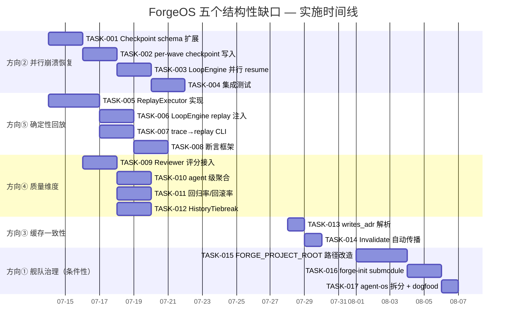

# Tech Lead 分析报告：ForgeOS 五个结构性缺口

---

## 概述

基于对分析文档的审阅及代码逐行验证，我对「五个结构性缺口」从 Tech Lead 视角给出可执行的技术分解、风险识别和资源评估。

**核心判断**：方向二（并行崩溃恢复）和方向五（确定性回放）给出了最高的修复 ROI——前者直接影响 LLM 调用费用的浪费量，后者直接缩短调试周期。方向四需重写论据但增长价值仍在。方向一是外部决策依赖。方向三是 v2 前瞻。

---

## 1. 任务分解

### 方向二：并行崩溃恢复（最高优先级）

| ID | 标题 | 文件 | 前置 | 工时 | 验收标准 |
|---|---|---|---|---|---|
| TASK-001 | **Checkpoint schema 扩展：引入 Wave→Phase 映射** | `forge-core/internal/persist/checkpoint.go` | 无 | 3h | `Checkpoint` 新增 `Waves []WaveCheckpoint` 字段；序列化/反序列化测试通过；兼容旧格式（无 waves 字段按 `PhaseIndex` 回落） |
| TASK-002 | **并行模式 per-wave checkpoint 写入点** | `forge-core/internal/orchestrator/parallel.go` | TASK-001 | 3h | 每个 wave 完成后（`runWave` 尾部）调用 `OnPhase(waveIdx, completedPhaseIdx)`；测试验证 crash 后 resume 能跳过已完成 wave |
| TASK-003 | **LoopEngine 并行 resume 路径** | `forge-core/internal/orchestrator/loop.go` | TASK-002 | 2h | `RunParallel` 从 `StartWave`/`StartPhaseInWave` 恢复；phase 0 回落保持向后兼容；并行模式 resume 时 wave 依赖重算正确 |
| TASK-004 | **并行 resume 端到端集成测试** | `forge-core/internal/persist/replay_test.go` + `forge-core/internal/orchestrator/parallel_test.go` | TASK-003 | 3h | mock crash + resume 验证：N 个 wave 中前 M 个完成，resume 只跑第 M+1 wave；trace 事件序列完整 |

### 方向五：确定性回放（同优先级）

| ID | 标题 | 文件 | 前置 | 工时 | 验收标准 |
|---|---|---|---|---|---|
| TASK-005 | **ReplayExecutor 接口实现** | `forge-core/internal/orchestrator/executor.go` + 新文件 `replay_executor.go` | 无 | 4h | `ReplayExecutor` 实现 `AgentExecutor`；从 trace JSONL 读取 `(phaseName → Status/DurationMs/CostUsdMicros)`；对不存在的阶段返回明确的 "not in trace" 错误 |
| TASK-006 | **LoopEngine 的 replay 注入路径** | `forge-core/internal/orchestrator/loop.go` | TASK-005 | 2h | `LoopEngine.ReplayTrace` 字段；`Run` 中检测并替换 `Engine.Exec`；不改变现有 `Run` 签名 |
| TASK-007 | **trace→replay fixture 生成 CLI** | `forge-core/cmd/forge/` 新子命令 | TASK-005 | 3h | `forge trace replay --from <trace.jsonl> --workflow <name>` 可运行；输出显示 `replayed N phases, X deviations from original` |
| TASK-008 | **replay 断言框架** | `forge-core/internal/persist/replay_test.go` | TASK-007 | 3h | replay 结果与原始 trace 的 `Status/DurationMs/CostUsdMicros` 比较；偏差超过阈值标记 WARNING；支持 `--exact`/`--fuzzy` 模式 |

### 方向四：质量维度深化（需校准后执行）

| ID | 标题 | 文件 | 前置 | 工时 | 验收标准 |
|---|---|---|---|---|---|
| TASK-009 | **Reviewer 评分接入 scorecard** | `forge-core/cmd/forge/engine_build.go` + `forge-core/internal/routing/scorecard.go` | 无 | 3h | `reviewFindingsLedger` 向 `scorecard-update.mjs` 传递 `APPROVE/REQUEST_CHANGES` 比率；`Scorecard` 新增 `ReviewApprovalRate float64` 字段 |
| TASK-010 | **agent 级 scorecard 聚合** | `forge-core/cmd/forge/scorecard_wind.go` | TASK-009 | 2h | scorecard rows 按 (model, task_type, agent) 三级键记录；不破坏现有 (model, task_type) 二级键查询 |
| TASK-011 | **回归率/回滚率指标采集** | `forge-core/cmd/forge/` 新采集点 | TASK-009 | 3h | `forge accept` 结果（PASS/FAIL）反馈到 scorecard 的 `pass_rate`；`forge evolve` 的 roadmap 回滚检测更新 `rework_rate` |
| TASK-012 | **HistoryTiebreak 消费新维度** | `forge-core/internal/routing/routing.go` | TASK-009 | 2h | `HistoryTiebreak` 可选地按 `ReviewApprovalRate` 辅助排序；`policy.history.tiebreak_on` 支持 `review_approval_rate` |

### 方向三：上下文缓存一致性（v2 准备，低优先级）

| ID | 标题 | 文件 | 前置 | 工时 | 验收标准 |
|---|---|---|---|---|---|
| TASK-013 | **writes_adr 标注解析** | `forge-core/internal/asset/asset.go` | 无 | 2h | `Phase` 新增 `WritesADR bool`；workflow YAML 解析 `writes_adr: true`；无此字段的 workflow 字节不变 |
| TASK-014 | **ADR 写入后自动 Invalidate** | `forge-core/internal/prompt/cache.go` | TASK-013 | 3h | `Invalidate()` 被 `writes_adr==true` 的 phase 完成后调用；cache 在下一个 phase 自动重建；`builds` 计数器正确递增 |

### 方向一：跨项目舰队治理（依赖外部决策）

| ID | 标题 | 文件 | 前置 | 工时 | 验收标准 |
|---|---|---|---|---|---|
| TASK-015 | **FORGE_PROJECT_ROOT 环境变量 + harness 路径改造** | `harness/acceptance-kernel.mjs`, `harness/arch/arch-check.mjs`, `harness/sca.mjs`, `harness/secret-scan.mjs` | 外部批准 | 4h | 所有自身位置锚定工具改用 `FORGE_PROJECT_ROOT ?? cwd`；self-test 全部通过；不设环境变量时行为不变 |
| TASK-016 | **forge-init submodule 模式** | `harness/scaffold/forge-init.mjs` | TASK-015 + 外部批准 | 3h | `forge init --submodule <url>` 创建 `agent-os/` submodule + 项目覆盖层；`test_forge-init.mjs` 覆盖 submodule 路径 |
| TASK-017 | **agent-os 仓库拆分** | 全仓 | 外部批准 + TASK-016 | 2h | `git filter-repo` 拆分；ForgeOS 本仓换 submodule + dogfood `forge accept` 仍绿 |

---

## 2. 执行顺序与并行组

```mermaid
graph TD
    %% 方向二：并行崩溃恢复（流水线）
    T001[TASK-001: Checkpoint schema 扩展] --> T002[TASK-002: per-wave checkpoint 写入]
    T002 --> T003[TASK-003: LoopEngine 并行 resume]
    T003 --> T004[TASK-004: 并行 resume 集成测试]

    %% 方向五：确定性回放（与方向二可并行）
    T005[TASK-005: ReplayExecutor 实现] --> T006[TASK-006: LoopEngine replay 注入]
    T005 --> T007[TASK-007: trace→replay CLI]
    T007 --> T008[TASK-008: replay 断言框架]

    %% 方向四：质量维度深化（与上述两个方向可并行）
    T009[TASK-009: Reviewer 评分接入] --> T010[TASK-010: agent 级聚合]
    T009 --> T011[TASK-011: 回归率/回滚率]
    T009 --> T012[TASK-012: HistoryTiebreak 消费新维度]

    %% 方向三：缓存一致性（低优先级，与方向四有弱依赖—都用 writes_adr）
    T013[TASK-013: writes_adr 标注解析] --> T014[TASK-014: ADR 写入后 Invalidate]

    %% 方向一：舰队治理（受外部决策阻塞，可独立进行）
    T015[TASK-015: FORGE_PROJECT_ROOT 路径改造] --> T016[TASK-016: forge-init submodule]
    T016 --> T017[TASK-017: agent-os 仓拆分]

    %% 并行组标记
    subgraph P1[并行组 A — 高优先级]
        T001; T002; T003; T004
    end
    subgraph P2[并行组 B — 高优先级]
        T005; T006; T007; T008
    end
    subgraph P3[并行组 C — 中优先级]
        T009; T010; T011; T012
    end
    subgraph P4[并行组 D — 依赖外部决策]
        T015; T016; T017
    end
    subgraph P5[并行组 E — 低优先级]
        T013; T014
    end
```



**并行执行策略**：

| 并行组 | 方向 | 资源需求 | 起始条件 |
|---|---|---|---|
| A (P1) | ② 并行崩溃恢复 | 1 Go 开发 | 立即 |
| B (P2) | ⑤ 确定性回放 | 1 Go 开发 | 立即 |
| C (P3) | ④ 质量维度深化 | 1 Go 开发 (+ 1 harness 开发) | 立即 |
| D (P4) | ① 舰队治理 | 1 Node.js 开发 | 外部批准后 |
| E (P5) | ③ 缓存一致性 | 0.5 Go 开发 | 任意时间 |

**注意**：P1/P2/P3 互相无依赖，可分配给三个不同开发者并行。这是该项目当前人力允许的最大并行度。

---

## 3. 技术风险

### 高风险项

| 风险 | 所属方向 | 可能性 | 影响 | 缓解策略 |
|---|---|---|---|---|
| **并行 checkpoint 竞态**：并发 wave 写 checkpoint 的 race condition 可能残留 | ② | 中 | 高（crash 后恢复读脏数据） | TASK-002 中 wave 完成点使用 `sync.WaitGroup` + 单 goroutine 写；单元测试用 `-race` flag 全覆盖 |
| **trace 事件顺序偏差**：replay 时事件顺序与原始运行不同——goroutine 调度不确定性 | ⑤ | 高 | 中（断言框架误报） | TASK-008 `--fuzzy` 模式允许指定容差；replay 不依赖事件顺序仅依赖 `(phaseName → status)` 映射 |
| **Scorecard 向后兼容**：新增字段导致旧 scorecards.json 反序列化失败 | ④ | 低 | 高（routing 决策失败） | 使用 `omitempty` + 零值回落（已在现有 schema 中使用）；测试用 fixture 验证旧格式可读 |
| **Harness 路径改造回归**：`FORGE_PROJECT_ROOT` 改动在子模块化后计算错误根目录 | ① | 中 | 致命（假绿/假红） | TASK-015 强制 self-test 覆盖：单仓（`env` 未设）+ submodule（`env` 已设）双路径；回归测试在 CI 中作为 gate 门控 |
| **submodule detached HEAD 漏更新** | ① | 中 | 低（CI 构建漂移） | forge-init 生成 `.gitmodules` + CI 模板包含 `submodules: recursive` |

### 低风险/已管理项

| 风险 | 理由 |
|---|---|
| ReplayExecutor 的性能开销 | 仅调试场景使用，不进入生产执行路径 |
| HistoryTiebreak 新增 tiebreak 字段 | 现有 `QualityScore` 是第一排序键，新增字段仅在相等时打破平局；不影响生产路由 |
| Invalidate() 的并发安全 | 已在 `cache.go` 中使用 `sync.Mutex` 保护，TASK-014 只需复用同一机制 |
| ADR-0003 的不可逆历史抽取 | 决策 5 明确需批准；阶段 A（本地可逆）降低该风险 |

---

## 4. 资源评估

### 人力需求

| 角色 | 数量 | 核心技能 | 负责方向 |
|---|---|---|---|
| Go 核心开发 | 2 人 | Go 并发模型、JSON 序列化、接口抽象 | ② + ⑤（人手 1）、③ + ④（人手 2） |
| Node.js 开发 | 1 人 | harness 架构、文件系统工具、shell 命令编排 | ① |
| QA/测试工程师 | 1 人 | 集成测试、fixture 管理、race 检测 | 全方向，侧重 ②④⑤ |
| （Tech Lead/架构师） | 1 人 | 代码审查、ADR-0003 决策推进 | 全方向 |

**关键里程碑**：

| 里程碑 | 时间 | 交付物 |
|---|---|---|
| M1: 原型就绪 | Day 5 | TASK-001 + TASK-005 完成（并行 checkpoint schema + ReplayExecutor skeleton） |
| M2: 核心功能 | Day 10 | TASK-003 + TASK-006 + TASK-009 完成（并行 resume + LoopEngine replay + reviewer 评分） |
| M3: 集成测试 | Day 14 | TASK-004 + TASK-008 + TASK-010 完成（端到端测试覆盖三个方向） |
| M4: 方向 ④ 完成 | Day 18 | TASK-011 + TASK-012 完成 |
| M5: 方向 ③ | Day 20 | TASK-013 + TASK-014 完成 |
| M6: 方向 ①（条件性） | Day 25+ | 外部批准后 TASK-015→016→017 |

### 阻塞点

| 阻塞点 | 影响方向 | 解决策略 |
|---|---|---|
| ADR-0003 的三个「待拍板」：远程位置、不可逆批准、now vs 暂缓 | ① | Tech Lead 准备推荐信（推荐阶段 A+暂缓+决策树触发条件），提交给决策者；创建追踪 Issue 在 DECISIONS.md |
| `replay/testdata/` fixture 数据量不足（目前只有 `evolve-dry-run`） | ⑤ | TASK-007 包含 fixture 生成 CLI，开发者运行一次真实 workflow 即可产生；无需外部输入 |
| Scorecard schema 对外兼容（`scorecard.schema.yml` 需更新） | ④ | 新增字段标注为 `optional: true`，不破坏现有 schema reader；同步更新文档 |

---

## 5. 质量保证

### 单元测试覆盖要求

| 任务 | 文件 | 测试类型 | 最低覆盖率 |
|---|---|---|---|
| TASK-001 | `persist/checkpoint_test.go` | 序列化/反序列化 round-trip + 旧格式兼容 | 100% 关键路径 |
| TASK-002 | `orchestrator/parallel_test.go` | 三场景：正常完成→checkpoint 写入 / crash→wave 跳过 / 单波无 phase | 100% |
| TASK-003 | `orchestrator/loop_test.go` | resume 四场景：phase 0 / 中间 phase / last phase / parallel resume | 90%+ |
| TASK-004 | `orchestrator/parallel_test.go` | mock crash + resume 的完整集成测试 | 1 个主测试函数 |
| TASK-005 | `orchestrator/replay_executor_test.go` | 三种 trace 输入：完整 / 缺失阶段 / 空 trace | 100% |
| TASK-007 | `cmd/forge/` 测试 | CLI 成功/失败路径；fixture 输出验证 | 80%+ |
| TASK-009 | `routing/scorecard_test.go` | `ReviewApprovalRate` 在 `HistoryTiebreak` 中的影响 | 100% |

### 集成测试策略

```
┌─────────────────────────────────────────────────────────────┐
│                         CI Pipeline                         │
├────────────┬──────────────┬────────────────┬────────────────┤
│  Unit      │  Integration  │  Replay        │  Gate          │
│  (go test  │  (go test     │  (persist/     │  (harness/     │
│   -race)   │   -tags=integration)           │   replay_test) │  │   acceptance.mjs)│
├────────────┼──────────────┼────────────────┼────────────────┤
│ 每次 commit│ 每日一次      │  fixture 更新时 │ 每次 PR        │
│ <30s       │ <2min        │ <10s           │ <30s           │
└────────────┴──────────────┴────────────────┴────────────────┘
```

**关键集成测试场景**：

1. **并行 crash + resume 端到端**：workflow 含 3 个 wave（5 个 phase）→ mock crash 在 wave 2 完成后 → resume 确认跳过 wave 0-2 → 只执行 wave 2 的剩余 + wave 3（TASK-004）
2. **Replay 与实际运行一致性**：真实 trace → replay → 比较每个 phase 的 status/duration/cost（TASK-008）
3. **Scorecard 升级兼容**：旧格式 scorecards.json → `LoadScorecards` 加载 → 新字段零值正确（TASK-009）
4. **Harness 双根路径**：`FORGE_PROJECT_ROOT` 设与不设，`forge accept` 结果一致（TASK-015）

### 代码审查要点

| 方向 | 审查重点 | 审查者角色 |
|---|---|---|
| ② | `parallel.go` 的 `OnPhase` 调用点不能产生竞态；replay 与原始 trace 的顺序容差 | 架构师 |
| ⑤ | `ReplayExecutor` 不引入真实 LLM 调用路径；不泄漏鉴权信息 | 安全工程师 |
| ④ | `Scorecard` 新字段 `omitempty` + 旧格式兼容；`HistoryTiebreak` 决定逻辑不变 | 实现者 peer review |
| ① | `FORGE_PROJECT_ROOT` 回落路径逐行验证；self-test 双路径覆盖 | QA |

### 性能测试需求

| 场景 | 测什么 | 目标 |
|---|---|---|
| 并行 8-phase wave checkpoint 写入 | `TASK-002` 的波形 checkpoint 写延迟 | ≤ 5ms per wave（与当前 serial checkpoint 相当） |
| 10,000 行 trace JSONL 的 replay 加载 | `TASK-005` 的 trace 解析 + 构建映射 | ≤ 100ms |
| `LoadScorecards` 1000 行 scorecard 加载 | `TASK-009-012` 的新字段 | ≤ 50ms（与当前一致） |

---

## 6. 实施计划

### 阶段 1：基础设施搭建（Day 1–5）

**目标**：建立并行 checkpoint schema + ReplayExecutor 骨架

```
Day 1-2   TASK-001: Checkpoint schema 扩展
          - 新增 Waves []WaveCheckpoint 字段
          - encode/decode 旧格式兼容
          - checkpoint_test.go 覆盖

Day 3-4   TASK-005: ReplayExecutor 实现
          - 从 trace Event 构建 phase→result 映射
          - replay_executor.go + 单元测试
          - dryRunWithTrace 验证函数

Day 5     M1: 原型就绪
          - 并行 checkpoint 可写
          - ReplayExecutor 可运行
          - 代码审查 + merge
```

### 阶段 2：核心功能实现（Day 6–10）

**目标**：并行 resume + LoopEngine replay + reviewer 评分

```
Day 6-7   TASK-002: per-wave checkpoint 写入点
          - runWave 尾部注入 OnWaveCheckpoint
          - 使用 sync.WaitGroup 确保竞态安全
          - parallel_test.go 覆盖

          TASK-006: LoopEngine replay 注入
          - ReplayTrace 字段 + Run 中替换 Exec

Day 8-9   TASK-003: LoopEngine 并行 resume
          - StartWave + StartPhaseInWave 字段
          - loopStart/resumeStart 适配
          - loop_test.go 覆盖

          TASK-009: Reviewer 评分接入 scorecard
          - Scorecard.ReviewApprovalRate 新字段
          - scorecard-update.mjs --review-approval-rate
          - scorecard_test.go 测试

Day 10    M2: 核心功能就绪
          - 并行 resume 端到端工作
          - LoopEngine 可 replay 驱动
          - Reviewer 评分进入 scorecard 持久化
```

### 阶段 3：集成测试和优化（Day 11–18）

**目标**：完整测试覆盖 + trace→replay CLI + agent 级分数聚合

```
Day 11-12 TASK-004: 并行 resume 集成测试
          - 多 wave mock crash fixture
          - trace 事件完整性断言

Day 13-14 TASK-007: trace→replay fixture CLI
          - `forge trace replay` 子命令
          - 输出偏差报告

Day 15-16 TASK-008: replay 断言框架
          - --exact/--fuzzy 模式
          - 阈值可配置

Day 17-18 TASK-010: agent 级 scorecard 聚合
          - (model, task_type, agent) 三级键
          - scorecard_test.go + wind 单元测试
          - `forge scorecard` 显示新增列

M3 (Day 14): 集成测试完成
M4 (Day 18): 方向 ④ 完成
```

### 阶段 4：方向 ③ + 降级优化（Day 19–22）

```
Day 19-20 TASK-013 + TASK-014: writes_adr + Invalidate
          - asset.go 解析 writes_adr
          - cache.go 自动 Invalidate
          - cache_test.go 测试

Day 21-22 TASK-011 + TASK-012: 回归率/回滚率 + HistoryTiebreak
          - pass_rate/rework_rate 实际采集
          - HistoryTiebreak 可选 tiebreak_on

M5 (Day 20): 方向 ③ 完成
```

### 阶段 5：方向 ①（外部条件触发，Day 23+）

```
Day 23-26 TASK-015: FORGE_PROJECT_ROOT 路径改造（4h 工时 + 2d 测试观察期）
Day 27-28 TASK-016: forge-init submodule 模式
Day 29-30 TASK-017: agent-os 仓拆分 + dogfood
```

---

## 甘特图



---

## 总结建议

### ROI 排序

| 优先级 | 方向 | 预估投入（人天） | 预期收益 |
|---|---|---|---|
| **P0** | ② 并行崩溃恢复 | 8 | 消除并行模式下 crash 导致的重复 LLM 费用（每次 crash 节省 N phase 调用，N=wave 中已完成 phase 数） |
| **P0** | ⑤ 确定性回放 | 10 | 调试效率提升：无需真实 LLM 调用即可复现和验证 routing/scorecard/loop 逻辑 |
| **P1** | ④ 质量维度深化（修正后） | 9 | scorecard 不再是二元门控——routing 可基于 reviewer 评分和回归率做更智能的模型选择 |
| **P2** | ③ 缓存一致性 | 3 | 为 v2 agent 写入 ADR 铺路，但 v1 无实际消费者 |
| **P3** | ① 舰队治理 | 8+ | 收益最高但受外部决策阻塞；建议 Tech Lead 推动决策并先行路径改造的设计 |

### 立即执行建议

1. **Day 1 启动两个 Go 开发者分别做 P1（方向②）和 P2（方向⑤）**——无依赖，完全并行
2. **方向④ 的开发者先通过一周的前期实验（reviewer 评分格式确认 + agent 级聚合可行性）再开工**
3. **ADR-0003 的外部决策推进**：Tech Lead 在 Day 1 提交推荐信，争取 Day 7 前获得方向性答复——即使不做迁移，TASK-015 的 `FORGE_PROJECT_ROOT` 改造也能作为独立的技术债修复先行
4. **方向③ 安排为「插缝任务」**——在等待代码审查或 CI 的空档期完成
