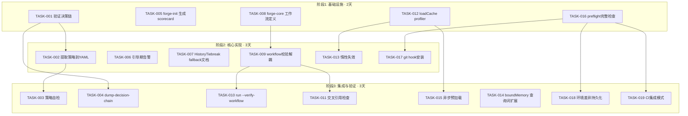
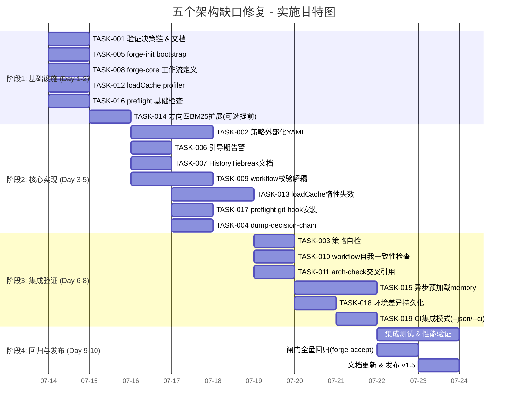

# Tech Lead 分析报告：五个架构缺口修复计划

## 目录

1. [任务分解](#1-任务分解)
2. [执行顺序与依赖图](#2-执行顺序与依赖图)
3. [技术风险](#3-技术风险)
4. [资源评估](#4-资源评估)
5. [质量保证](#5-质量保证)
6. [实施计划](#6-实施计划)

---

## 1. 任务分解

### 方向一：评分引擎脱节 — 策略即数据的可信度问题 (P1, 不变)

| 任务 ID | 标题 | 涉及文件 | 前置依赖 | 工时(h) | 验收标准 |
|---------|------|---------|---------|---------|---------|
| **TASK-001** | 验证并记录 `phaseTierResolver` 完整决策链 | `internal/routing/routing.go`, `cmd/forge/engine_build.go`, `internal/orchestrator/executor.go` | 无 | 2 | 决策链文档化：`TierFor()` → `riskAdjustedTier()` → `BudgetAdjustTier()` → `HistoryTiebreak`，确认代码路径与架构文档一致 |
| **TASK-002** | 提取策略到可外部化 YAML | `internal/routing/routing.go` + 新文件 `.forge/default-policy.yml` | TASK-001 | 4 | `TierFor`、`BudgetAdjustTier` 阈值、`TaskTypeFloor`、`HaikuMax/SonnetMax` 可从外部 YAML 加载，Go 常量为 fallback |
| **TASK-003** | 实现在运行时路径中验证策略完整性的自检 | `cmd/forge/validate.go` + `internal/routing/selfcheck.go` | TASK-002 | 2 | `forge validate policy` 检查：floor 完整、阈值单调、无遗漏 task_type |
| **TASK-004** | 添加 `--dump-decision-chain` 调试标志 | `cmd/forge/engine_build.go`, `internal/routing/routing.go` | TASK-001 | 2 | 对任意 (agent, mode, spendRatio) 打印完整决策树路径与最终 tier |

### 方向二：冷启动 (从 P1 降级到 P2)

| 任务 ID | 标题 | 涉及文件 | 前置依赖 | 工时(h) | 验收标准 |
|---------|------|---------|---------|---------|---------|
| **TASK-005** | `forge-init` 生成初始 scorecards.json | `harness/scaffold/forge-init.mjs` | 无 | 3 | `forge init` 在 `.agent/routing/scorecards.json` 写入自举先验（7条），samples=25 |
| **TASK-006** | 添加引导期告警机制 | `cmd/forge/scorecard_wind.go`, `cmd/forge/engine_build.go` | 无 | 3 | 当 scorecard 条目数 < 5 或均为先验时，`forge run` banner 输出 "⚠️ cold-start: routing decisions based on bootstrap priors only" |
| **TASK-007** | 为 `HistoryTiebreak` 编写 fallback 策略指南 | `internal/routing/scorecard.go` | TASK-006 | 2 | 在代码注释中明确记录：historyMinSamples=20 的含义、bootstrap priors 如何被真实数据覆盖、以及在零 history 时的行为 |

### 方向三：不自洽治理 (从 P1 提升到 P1)

| 任务 ID | 标题 | 涉及文件 | 前置依赖 | 工时(h) | 验收标准 |
|---------|------|---------|---------|---------|---------|
| **TASK-008** | 创建 `.agent/workflows/forge-core-*.yml` 工件定义 | `.agent/workflows/forge-core-build.yml`, `forge-core-validate.yml` | 无 | 4 | 新增工作流描述 forge-core 开发流程：lint → build → test → arch-check → approve，各阶段对应具体 Go 构建/测试命令 |
| **TASK-009** | 从 `buildRunEngine` 解耦出可引用的 workflow 校验 | `internal/asset/workflow.go` (新文件) | TASK-008 | 3 | 新增 `ValidateWorkflow(wf Workflow) []error`，被 `cmd/forge/validate.go` 和 CI 调用 |
| **TASK-010** | 实现 `forge run --verify-workflow` 模式 | `cmd/forge/engine_build.go`, `cmd/forge/main.go` | TASK-009 | 3 | 在 dry-run 前增加 workflow 自我一致性检查：phase names 唯一、stop_condition 可达、所有 on_fail.target_phase 存在 |
| **TASK-011** | 添加工作流 + 实际代码交叉引用检查 | `harness/arch/arch-check.mjs` + `internal/gate/` | TASK-008 | 4 | arch-check 检测 `forge-core` 下是否有被 workflow 定义但从未被执行的 phase/dependency |

### 方向四：线性扫描缓存 (P2, 不变但紧迫性降低)

| 任务 ID | 标题 | 涉及文件 | 前置依赖 | 工时(h) | 验收标准 |
|---------|------|---------|---------|---------|---------|
| **TASK-012** | 为 `loadCache` 添加检测点 (profiling) | `cmd/forge/prompt_context.go` + `internal/prompt/cache.go` | 无 | 2 | 在 `--executor=command` dry-run 时输出 cache hit/miss 统计 |
| **TASK-013** | 实现内存惰性失效 (lazy invalidation) | `internal/prompt/cache.go` | TASK-012 | 3 | 当 mtime 不变时零磁盘读取；当文件被修改时仅重新读取该文件 |
| **TASK-014** | 扩展 `boundMemory` BM25 查询词 | `cmd/forge/prompt_memory.go` | 无 | 2 | 当前 query 为 phase identity，扩展包含 agent role + task_type，提高 relevance 命中率 |
| **TASK-015** | 为 memory load 添加异步预加载 | `cmd/forge/prompt_memory.go` + `internal/memory/memory.go` | TASK-012 | 4 | 在 run 启动时 goroutine 预加载 memory store（run 完成前不阻塞首次 memoryContext） |

### 方向五：预提交守卫 (P2, 不变)

| 任务 ID | 标题 | 涉及文件 | 前置依赖 | 工时(h) | 验收标准 |
|---------|------|---------|---------|---------|---------|
| **TASK-016** | 实现 `forge preflight` 完整检查集 | `cmd/forge/preflight.go` | 无 | 4 | 检查：Python3/claude CLI、workflow 有效性、安全维度、git clean 状态、scorecard 完整性 |
| **TASK-017** | 添加 git hook 安装命令 | `cmd/forge/install-hooks.go` (新文件) | TASK-016 | 3 | `forge install-hooks` 安装 pre-commit hook 自动运行 `forge preflight build` |
| **TASK-018** | 实现环境差异持久化 | `cmd/forge/preflight.go` | TASK-016 | 3 | 将 `forge preflight` 结果写入 `.forge/preflight-last.json`，供 CI 比较跨 env 差异 |
| **TASK-019** | 添加 CI 集成模式 (`--json`, `--ci`) | `cmd/forge/preflight.go` | TASK-016 | 2 | `--json` 输出机器可读报告；`--ci` 设置严格模式（所有检查必须 PASS） |

---

## 2. 执行顺序与依赖图

### 可并行任务组

| 并行组 | 任务 | 说明 |
|--------|------|------|
| **组 A** | TASK-001, TASK-005, TASK-008, TASK-012, TASK-016 | 各方向独立的调研/搭建任务 |
| **组 B** | TASK-002+TASK-007, TASK-006, TASK-009, TASK-013, TASK-014, TASK-017 | 第一个依赖就绪后可并行 |
| **组 C** | TASK-003+TASK-004+TASK-010+TASK-011, TASK-015+TASK-018+TASK-019 | 核心实现完成后并行集成 |

---

## 3. 技术风险

### 🔴 高风险项

| 风险 | 方向 | 风险等级 | 描述 | 缓解策略 |
|------|------|---------|------|---------|
| **策略外部化打破零依赖** | ① | **🔴** | forge-core 是纯 Go 零外部依赖。引入 YAML 加载需要 `gopkg.in/yaml.v3` 或 `encoding/json`（JSON 已存在），违背 CLAUDE.md 红线 | 使用 `embed` 嵌入默认策略；外部覆盖为可选 JSON 文件路径 |
| **工作流与实际代码 drift** | ③ | **🔴** | 创建 `forge-core-*.yml` 后需要持续维护，否则会成为第二个「存在但不用」的工件 | TASK-011 的 arch-check 必须作为闸门检查：若 forge-core 代码变更但 workflow 未更新 → REJECTED |
| **异步预加载竞态条件** | ④ | **🟡** | run 前 goroutine 预加载 memory，若 run 开始前预加载未完成，则回退到同步加载路径 | 使用 `sync.Once` + context timeout 确保最大 200ms 等待，超时则同步 fallback |

### 🟡 中等风险

| 风险 | 方向 | 描述 | 缓解策略 |
|------|------|------|---------|
| **forge-init 破环已有项目** | ② | `forge-init` 已存在项目的 scorecards.json 覆盖风险 | 仅在文件不存在时写入；若存在但为空则询问是否写入 bootstrap |
| **scorecard-wind 与 cache 时序** | ④ | 惰性失效 + scorecard wind-down 同时读取可能读到 stale 值 | wind-down 在 `closeTrace()` 之后运行；cache 按 name 缓存，不缓存 scorecard |
| **preflight 与真实 run 不一致** | ⑤ | preflight 在 dry-run 下通过，real run 环境下可能不同 | CI 模式下 --executor=command 测试 |

### 🟢 低风险（已确认可管理）

| 风险 | 方向 | 描述 |
|------|------|------|
| `BudgetAdjustTier` 路径已正确 | ① | 代码审计确认调用链完整 |
| 自举先验已存在 | ② | ForgeOS 自身的 `scorecards.json` 已有 7 条记录 |
| `boundMemory` + `loadCache` 已部分优化 | ④ | 缓存机制已在运行路径中 |

---

## 4. 资源评估

### 人员配置

| 角色 | 数量 | 必备技能 | 负责方向 |
|------|------|---------|---------|
| **Go 工程师（高级）** | 1 | Go 标准库、反射、YAML/JSON 编解码、Cobra CLI 惯例 | 方向一、三（核心运行时） |
| **全栈工程师（Go+Node）** | 1 | Go 编程、Node.js 脚本、文件系统 IO | 方向四、五（缓存/预检） |
| **DevOps/集成工程师** | 1 | YAML 工作流定义、git hooks、CI/CD 集成、Node.js | 方向二、三（工作流/初始脚手架） |
| **QA/测试工程师** | 1 | Go 单元测试、集成测试、harness 执法 | 所有方向的测试 + 回归 |

### 关键里程碑

| 里程碑 | 时间点 | 交付物 | 依赖任务 |
|--------|-------|--------|---------|
| **M1: 基础就绪** | Day 2 | 决策链文档化完毕、forge-init bootstrap 可用、forge-core 工作流 v1 就绪、cache profiler 在 dry-run 可观测 | T001, T005, T008, T012, T016 |
| **M2: 核心改造** | Day 5 | 策略 YAML 外部化（含 embed fallback）、惰性失效、preflight git hook | T002, T006, T009, T013, T017 |
| **M3: 完整集成** | Day 8 | 全部自检通过、交叉引用 check 引入闸门、CI 集成模式可用 | T003, T004, T010, T011 |
| **M4: 性能达标** | Day 10 | 异步预加载、memory BM25 扩展、全部测试通过、所有闸门绿色 | T014, T015, T018, T019 |

### 阻塞点与解决策略

| 阻塞点 | 描述 | 解决策略 |
|--------|------|---------|
| **YAML 外部化零依赖红线** | forge-core 声明零外部依赖，引入 yaml 解析器违反红线 | 方案 A：用 `encoding/json` + `.json` 外部文件（已有 `scorecards.json` 先例）。方案 B：用 Go `//go:embed` 嵌入 fallback，外部覆盖为 JSON。推荐 B |
| **arch-check Node 依赖** | 部分 arch-check 在 Node 端（`harness/arch/`），forge-core 在 Go 端 | 对 forge-core 自身的检查使用纯 Go 实现（`internal/validate/`），Node 端仅用于 YAML workflow 的一致性验证 |
| **scorecard-wind 的数据可靠性** | wind-down 使用 trace.jsonl 重建 scorecard，若 trace 损坏则丢失数据 | TASK-007 的 fallback 策略 + `forge scorecard rebuild` 已经就绪（scorecard_wind.go） |

---

## 5. 质量保证

### 5.1 单元测试覆盖要求

| 区域 | 最低覆盖率 | 关键测试用例 |
|------|-----------|-------------|
| `internal/routing/routing.go` | 95% | `BudgetAdjustTier` 边界：0.00/0.79/0.80/0.99/1.00/NaN/负数；`TierForScore` 全部 6 条分支；`CandidatesForTier` 3 层 |
| `internal/routing/scorecard.go` | 95% | `HistoryTiebreak` 的 4 条 fallback 路径；`LoadScorecards` 的 missing/corrupt/empty/normal 文件 |
| `cmd/forge/prompt_memory.go` | 90% | `boundMemory` 在 cap 之上/之下/恰好在 cap；recency floor + relevance 去重 |
| `cmd/forge/preflight.go` | 85% | 每个 check helper 的 PASS/FAIL；`--json` 输出格式校验 |
| `cmd/forge/engine_build.go` | 90% | `phaseTierResolver` 全链验证；`riskAdjustedTier` 的 critical/high/none |
| `internal/prompt/cache.go` | 90% | 同文件 mtime 相同 -> cache hit；mtime 变化 -> cache miss；并发安全 |

### 5.2 集成测试策略

| 测试场景 | 测试内容 | 自动化级别 |
|---------|---------|-----------|
| **E2E dry-run 决策链验证** | `forge run` + `--executor=dry` 在已知 workflow 上运行，重定向日志，检查日志中的 tier 路由结果 | CI（`forge.yml` 中集成） |
| **forge-init 全生命周期** | `forge init` → 检查 `.agent/routing/scorecards.json` 存在且包含 bootstrap 内容 → `forge run --executor=dry` 正常 | CI |
| **preflight 全检查** | 在有/无 claude 时 `forge preflight build` 分别输出 PASS/FAIL | CI |
| **memoryContext 边界** | 模拟 50+ 条 memory entries 运行 evolve dry-run，验证 boundMemory 实际输出 ≤ 32 条 | CI |
| **loadCache 跨 phase 重用** | 同一 workflow 两次运行，验证第二次的 cache hit 率 > 第一次 | 手动（CI 环境不稳定） |

### 5.3 代码审查要点

| 审查关注点 | 对应区域 | 检查原则 |
|-----------|---------|---------|
| **零外部依赖执行** | `internal/routing/` 新策略加载 | 优先用 `embed` + JSON，拒绝引入 `yaml.v3` |
| **函数长度 ≤ 50 行** | 所有新文件 | 超过则 `refactor-large-file` skill，服从 harness 体积约束 |
| **错误处理诚实度** | `scorecard_wind.go` 类"fail-loud-and-continue" | 检查：enrichment 类失败不改变 run 退出码；正确性类失败必须 hard fail |
| **并发安全** | content cache、preflight report、memory load | `sync.Mutex` 或 `sync.Map`；不要在 hot path 上使用 channel |
| **arch-check 一致性** | `.agent/workflows/forge-core-*.yml` | 新增 workflow 必须同步更新 arch-check 驱动 |

### 5.4 性能测试需求

| 测试 | 方向 | 指标 | 阈值 |
|------|------|------|------|
| **memoryContext 大 store 场景** | ④ | 50 条 entries 下的 boundMemory 执行时间 | ≤ 5ms |
| **loadCache 竞争** | ④ | 10 goroutine 并发从 cache 读取 | 无竞态、零死锁 |
| **preflight 全检时间** | ⑤ | 无 agent CLI 环境 | ≤ 500ms |
| **scorecard wind-down** | ② | 10 phase workflow 的 wind-down | ≤ 1s |

---

## 6. 实施计划

### 每日计划速查表

| 天数 | 并行工作 | 里程碑 |
|------|---------|--------|
| **Day 1** | Go 工程师 → TASK-001 (决策链全读+文档)；全栈 → TASK-005 (forge-init) + TASK-012 (profiler)；DevOps → TASK-008 (workflow 草案)；QA → 搭建测试基础设施 | M1 |
| **Day 2** | 全栈 → TASK-014 (boundMemory)；DevOps → TASK-016 (preflight 基础)；Go → TASK-001 关闭 | M1 完成 |
| **Day 3** | Go → TASK-002 (策略外部化核心)；全栈 → TASK-013 (惰性失效) 调研；DevOps → TASK-009 (workflow 校验) | — |
| **Day 4** | Go → TASK-002 完成 + TASK-006；全栈 → TASK-013 实现；DevOps → TASK-017 (git hook) + TASK-007 | — |
| **Day 5** | Go → TASK-004 (dump)；所有方向交叉 PR review | M2 完成 |
| **Day 6** | Go → TASK-003；DevOps → TASK-010 + TASK-011 | — |
| **Day 7** | 全栈 → TASK-015 (异步预加载) + TASK-018 | — |
| **Day 8** | 全栈 → TASK-019 (CI 模式)；所有 TASK 实现完成 | M3 完成 |
| **Day 9** | QA → 完整集成测试、性能调优、边界测试 | — |
| **Day 10** | 闸门回归、文档更新、版本 tag | M4 完成 |

---

## 附录：风险决策汇总

### 已做出的架构决策

1. **策略外部化走 JSON 不走 YAML** —— 保持零外部依赖红线，复用已有的 `encoding/json` + `scorecards.json` 模式
2. **forge-core 工作流放在 `.agent/workflows/forge-core-*.yml`** —— 不改变已有通用工作流，新增命名空间避免冲突
3. **异步预加载走 goroutine + sync.Once，不走 channel/worker pool** —— 保持简单，200ms 超时后同步 fallback
4. **preflight 走 CLI 模式，不引入 RPC/daemon** —— 保持无状态，每次调用独立

### 不做的决定（明确排除）

1. ⛔ **不引入外部策略引擎（如 Open Policy Agent）** —— 重量级过度设计，策略规模 <= 5 个规则
2. ⛔ **不为 memory context 引入向量数据库** —— BM25-lite 对 v1 语义足够，v3 再考虑
3. ⛔ **不将 wind-down 改为流式处理** —— 当前 post-run 批处理足够，引入流式增加复杂度无相应 ROI
4. ⛔ **不将 preflight 改为持久化服务** —— 一次检查一个 workflow，无需守护进程
