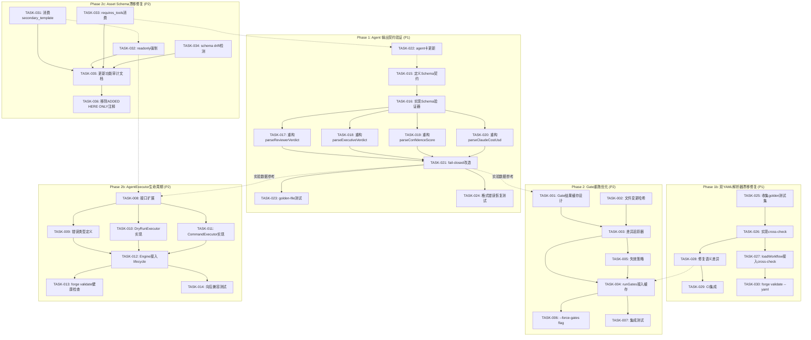
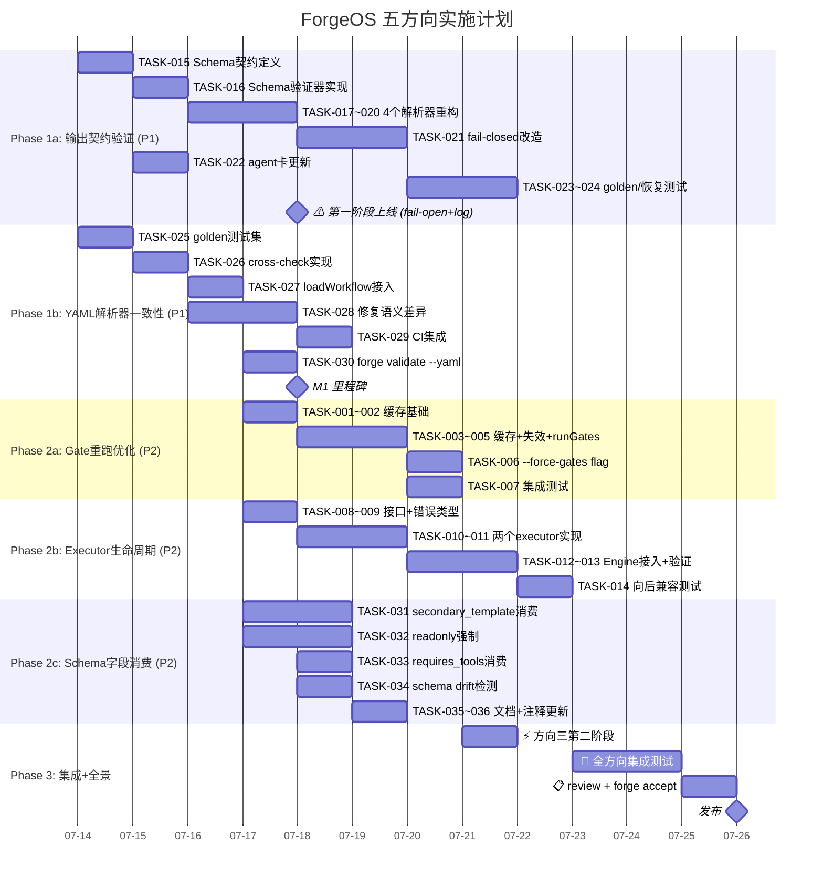

# Tech Lead 分析报告

基于交叉验证报告和五方向架构缺口分析文档，以下从技术实现和项目管理角度进行深度分析。

---

## 1. 任务分解

### 方向一：Gate Loop-back 重跑优化（P2）

| 任务 ID | 任务标题 | 涉及文件 | 前置依赖 | 预估工时 | 验收标准 |
|---|---|---|---|---|---|
| TASK-001 | 门结果缓存数据结构设计 | `internal/orchestrator/cache.go`(新) | 无 | 2h | `GateResultCache` 结构体，支持按 gate name + hash key 存取 PASS/FAIL/NA 结果 |
| TASK-002 | 文件变更哈希计算器 | `internal/orchestrator/filehash.go`(新) | 无 | 2h | `computeFileHash(repoRoot, paths []string) string` 对给定路径集合计算 SHA256 摘要 |
| TASK-003 | gate 维度「自上次运行以来哪些文件变了」差异追踪 | `internal/orchestrator/cache.go` | TASK-001, TASK-002 | 4h | `changedSince(repoRoot, prevHash string) bool` 工作；对 `build.yml` 典型场景可区分"只有 implementer outputs 改了 vs gate 前置文件改了" |
| TASK-004 | `runGates` 接入缓存语义 | `internal/orchestrator/orchestrator.go` | TASK-003 | 4h | loop-back 后已 PASS 的 `complexity`/`arch` gate 如果 hash 未变则跳过真实 fork；test gate (probe-backed)已在缓存命中 |
| TASK-005 | cache 失效策略实现（expiry + file-change + forced-invalidation） | `internal/orchestrator/cache.go` | TASK-001 | 3h | 三种失效机制：(1) expire after 5 min (2) detected file change (3) explicit `--force-gates` flag |
| TASK-006 | CLI `--force-gates` flag | `cmd/forge/main.go` | TASK-005 | 1h | `forge run/evolve --force-gates` 使所有 gate 跳过缓存强制执行 |
| TASK-007 | 集成测试：loop-back 后 gate 跳过确认 | `internal/orchestrator/orchestrator_test.go` | TASK-004, TASK-005 | 3h | 用 fake gate 脚本验证：(1) 无文件变更时 gate 不重跑 (2) 文件变更时 gate 重跑 (3) `--force-gates` 无条件重跑 |

**总计：19h（约 2.5 人天）**

### 方向二：AgentExecutor 生命周期真空（P2）

| 任务 ID | 任务标题 | 涉及文件 | 前置依赖 | 预估工时 | 验收标准 |
|---|---|---|---|---|---|
| TASK-008 | `AgentExecutor` 接口扩展——定义 `Init`/`Shutdown`/`Rollback`/`Health` | `internal/orchestrator/orchestrator.go` | 无 | 2h | 接口新增四个方法，带详细 Go doc 说明契约语义 |
| TASK-009 | 新增 `AgentLifecycleError` 错误类型和分类 | `internal/orchestrator/errors.go`(新) | TASK-008 | 2h | `InitError` `ShutdownError` `RollbackError` `HealthError` 四种错误类型；`IsRetryable()`/`IsFatal()` 区分 |
| TASK-010 | `DryRunExecutor` 实现新生命周期方法（no-op logging） | `internal/orchestrator/command_executor.go` | TASK-008 | 2h | Init 打印受信 executor 信息；Shutdown no-op；Health 永远返回健康；Rollback no-op |
| TASK-011 | `CommandExecutor` 实现生命周期方法（进程预热/关闭） | `internal/orchestrator/command_executor.go` | TASK-008 | 4h | Init 中验证 `--agent-cmd` 是否在 PATH 中、可执行；Shutdown 清理子进程资源；Health 检查 CLI 版本；Rollback 记录但不自动回滚（因无文件系统快照） |
| TASK-012 | `Engine` 接入 lifecycle hooks | `internal/orchestrator/orchestrator.go` | TASK-010, TASK-011 | 3h | Run 开始时调 `Init()`，结束时调 `Shutdown()`（含 error 路径）；每次 Exec 前调 `Health()` 检查；phase 失败时（若 retry 耗尽且 executor 支持）调 `Rollback()` |
| TASK-013 | `forge validate` 增加 executor 健康检查 | `cmd/forge/validate.go` | TASK-011 | 2h | `forge validate --executor command` 运行 `Health()` 并报告 CLI 版本/可用性 |
| TASK-014 | 向后兼容测试：现有 dry-run executor 零行为变化 | `internal/orchestrator/orchestrator_test.go` | TASK-012 | 3h | 全量 orchestrator 测试在 dry-run executor 下运行，Init/Shutdown 不改变任何外部可见行为 |

**总计：18h（约 2.25 人天）**

### 方向三：Agent 输出契约验证（P1 — 最高优先级）

| 任务 ID | 任务标题 | 涉及文件 | 前置依赖 | 预估工时 | 验收标准 |
|---|---|---|---|---|---|
| TASK-015 | 定义 Agent 输出 Schema 契约（JSON Schema / Go struct） | `internal/contract/`(新包) | 无 | 3h | 每组契约文件：`reviewer_verdict.json`、`executive_verdict.json`、`confidence_score.json`、`cost_output.json`；含正式 JSON Schema |
| TASK-016 | 实现通用 Schema 验证器 `ValidateOutput(output string, schema JSON Schema) error` | `internal/contract/validator.go` | TASK-015 | 3h | 解析 output 末行/JSON 块，对照 schema 逐字段校验；返回具体错误（"line 5: expected VERDICT: … got …"） |
| TASK-017 | 重构 `parseReviewerVerdict` 接入 Schema 验证 | `cmd/forge/cost.go` | TASK-016 | 3h | 旧 exact-match 逻辑包装为 schema 驱动的验证；验证失败时记录结构化错误（trace event）而非静默返回 `ok=false` |
| TASK-018 | 重构 `parseExecutiveVerdict` 接入 Schema 验证 | `cmd/forge/cost.go` | TASK-016 | 2h | 同上，五元裁决 |
| TASK-019 | 重构 `parseConfidenceScore` 接入 Schema 验证 | `cmd/forge/cost.go` | TASK-016 | 2h | schema 允许 `CONFIDENCE: 85` 和 `CONFIDENCE: 85/100` 两种合法格式 |
| TASK-020 | 重构 `parseClaudeCostUsd` 接入 Schema 验证 | `cmd/forge/cost.go` | TASK-016 | 2h | 允许 claude JSON 输出中有前后文本尾随，不做严格 `TrimSpace`+`Unmarshal` |
| TASK-021 | **fail-closed 改造**：格式错误时 Retry agent | `internal/orchestrator/orchestrator.go` | TASK-017, TASK-018, TASK-019, TASK-020 | 4h | 当 verdict/confidence/cost 的 schema 验证失败时，不是 fail-open 继续，而是 retry agent phase（计入 `MaxRetries`）；所有 retry 用完才 fail-close |
| TASK-022 | agent 卡更新：输出格式声明加入机器可读 schema 引用 | `.agent/agents/reviewer.md`, `.agent/agents/cto.md`, `.agent/agents/product-manager.md` | TASK-015 | 2h | 每个 agent 卡中 `OUTPUT SCHEMA:` 字段链接到 `internal/contract/` 中的对应 schema |
| TASK-023 | golden-file 测试：agent 输出格式变化时的回归检测 | `cmd/forge/cost_test.go` | TASK-017–TASK-020 | 4h | 全部 5 个解析器各 10+ 边界用例：合法格式、markdown 包裹、trailing text、百分号、非英语分隔符 |
| TASK-024 | 格式错误恢复测试：用输出格式错误的 fake agent 验证 retry + 最终 fail-close | `internal/orchestrator/orchestrator_test.go` | TASK-021 | 3h | Fake agent 第一次输出 `VERDICT: **REQUEST_CHANGES**` → retry → 第二次输出正确 `VERDICT: REQUEST_CHANGES` → 通过；两次都错 → fail-close |

**总计：28h（约 3.5 人天）**

### 方向四：双 YAML 解析器静默漂移（P1）

| 任务 ID | 任务标题 | 涉及文件 | 前置依赖 | 预估工时 | 验收标准 |
|---|---|---|---|---|---|
| TASK-025 | 收集全仓真实 YAML 文件构建 golden 测试集 | `internal/yaml2json/testdata/*.yml` | 无 | 2h | 所有 `.agent/workflows/*.yml` + 此外 3-5 个边界 YAML（混合缩进、block scalar、Unicode、空序列） |
| TASK-026 | 实现 cross-check 验证：Go 解析器输出 vs Python 解析器输出逐字段比对 | `internal/yaml2json/crosscheck.go`(新) | TASK-025 | 3h | `CrossCheck(path string) error` 读取 YAML → Go decode → Python decode → `reflect.DeepEqual`，不一致时报告差异路径和值 |
| TASK-027 | 在 `loadWorkflow` 中接入 cross-check | `cmd/forge/main.go` | TASK-026 | 2h | Go 解析成功后，异步调用 CrossCheck；不一致时 logging warn（非阻断，因 Go 是主路径且当前无已知问题） |
| TASK-028 | 修复 cross-check 发现的语义差异 | `internal/yaml2json/normalize.go` + `mapping.go` + `scalar.go` | TASK-026 | 4h | 对 golden 集 100% 通过 cross-check（byte-identical JSON）；差异回归测试 |
| TASK-029 | CI 中集成 golden-file cross-check | `.github/workflows/forge.yml` | TASK-028 | 1h | 每次 PR 自动执行 `go test ./internal/yaml2json/ -run TestCrossCheck`；失败阻断 PR |
| TASK-030 | `forge validate` 增加 YAML 解析器一致性诊断 | `cmd/forge/validate.go` | TASK-026 | 2h | `forge validate --yaml` 报告 Go vs Python 一致性状态，附带每个文件的 diff 摘要 |

**总计：14h（约 1.75 人天）**

### 方向五：Asset Schema 字段漂移（P2 — 声明实现间隙关闭）

| 任务 ID | 任务标题 | 涉及文件 | 前置依赖 | 预估工时 | 验收标准 |
|---|---|---|---|---|---|
| TASK-031 | 消费 `secondary_template`：`buildPromptWithEmits` 接入第二模板 | `cmd/forge/prompt_artifacts.go` | 无 | 4h | `performance-reliability-review` phase 现在真实注入第二个模板内容；下游 prompt 包含两段 review guideline |
| TASK-032 | 实现 `readonly` phase 的技术强制 | `internal/orchestrator/command_executor.go` | 无 | 4h | readonly phase 的 `claudeArgv` 添加 `--disallowedTools "Edit Write"` + `--allowedTools <emits dirs from agent card>`；非 claude executor 通过 `executor.Readonly()` 钩子实现 |
| TASK-033 | 消费 `requires_tools`：degrade-and-flag 机制 | `internal/orchestrator/requires_tools.go`(新) | 无 | 3h | phase 声明 `requires_tools: [web_search]` 但无可用工具时：(1) addvisory 降级 (2) 注入 agent prompt 标注「工具不可用，以下内容未经核实」 (3) trace 事件记录降级 |
| TASK-034 | 实现 schema drift 检测：`check.py` 新增 `check_asset_schema_drift` | `harness/check.py` | 无 | 3h | 对比 `asset.go` 中 `Phase` 结构体 tag 与 `.agent/workflows/*.yml` 中使用字段；报告「在 YAML 中有但 Go struct 无」和「在 Go struct 中有但 YAML 无注释/用例」两种漂移 |
| TASK-035 | 更新 `docs/FUNCTIONAL_REQUIREMENTS_AUDIT.md` 中 4 个字段从 GAP 改为 RESOLVED | `docs/FUNCTIONAL_REQUIREMENTS_AUDIT.md` | TASK-031–TASK-034 | 1h | 每个字段附加 resolution 注释、引用对应代码路径 |
| TASK-036 | 移除或标记 ADDED HERE ONLY 注释 | `internal/asset/asset.go` | TASK-031–TASK-033 | 1h | 所有 4 个字段的 `ADDED HERE ONLY` 注释改为 `RESOLVED: <指向对应实现文件>` |

**总计：16h（约 2 人天）**

---

## 2. 执行顺序

### 依赖图



### 可并行执行的任务组

| 组别 | 包含方向 | 理由 |
|---|---|---|
| **组 A** (Phase 1) | 方向三 + 方向四 | 两个都是 P1，但修改的文件集完全不重叠（方向三在 `cmd/forge/cost.go` + `internal/contract/`，方向四在 `internal/yaml2json/`）；评审资源需要分别给不同 reviewer |
| **组 B** (Phase 2) | 方向一 + 方向二 + 方向五 | 三个 P2 方向，文件集基本不重叠（方向一在 `internal/orchestrator`，方向二在 `internal/orchestrator` + `cmd/forge`，方向五在 `cmd/forge` + `harness/check.py` + `internal/asset`）；方向二和方向一共享 `orchestrator.go` 但修改区域不同（方向一改 `runGates`，方向二加 lifecycle hooks 到 `Engine` 结构体），需注意 merge 冲突管理 |

---

## 3. 技术风险

### 高风险

| 风险 | 涉及方向 | 概率 | 影响 | 缓解策略 |
|---|---|---|---|---|
| **fail-closed 改造导致回归**（当前 fail-open→fail-close 是行为变更） | 方向三 | 中 | **高** — 如果 `parseReviewerVerdict` 在 fail-close 后把旧格式的 agent 输出全部拒绝，会导致所有 workflow 卡在 gate/reviewer phase | **分步 rollout**: (1) 第一阶段 schema 验证 + logging，仍 fail-open (2) 一周度量数据驱动分析 (3) 第二阶段 fail-close，带 `--relaxed-parsing` flag 做逃生舱 |
| **双 YAML 解析器 cross-check 发现大量差异** | 方向四 | 低 | **高** — 如果 Go 解析器对真实工作流 YAML 有系统性偏差，回退路径的异步 warn 可能变成类噪音 | 先跑一次完整的 cross-check 诊断 → 影响评估 → 决定是修 Go 解析器还是切 Python 为权威 |
| **AgentExecutor 接口扩展现有实现者破坏** | 方向二 | 低 | **高** — 接口增加方法会让所有现有实现（即使只有 DryRunExecutor）需要修改 | 用 **Go 1.14+ 接口兼容模式**：新增方法放在新接口 `AgentExecutorLifecycle` 中，`Engine` 通过类型断言检查是否实现，而非直接调用 |

### 中风险

| 风险 | 涉及方向 | 概率 | 影响 | 缓解策略 |
|---|---|---|---|---|
| **Gate 缓存语义不正确** → 漏执行 gate 导致伪 PASS | 方向一 | 中 | **高** — 缓存误判「文件未变」但实际 env/依赖变了 | 保守策略：只缓存 probe-backed gate（`test`），对 `complexity`/`arch` 这种 fork 子进程的 gate 只缓存确定性 checks（如 `gate.mjs` 在没有文件变化时输出必然相同）；缓存 TTL 5min，`--force-gates` 可绕过 |
| **schema drift 检测静态分析精度不足** → 大量假阳性 | 方向五 | 中 | 低 | 直接输出结果给 human reviewer 判断，不做自动阻断（仅在 `check.py` 中报 warning，非 error） |

### 低风险

| 风险 | 涉及方向 | 概率 | 影响 | 缓解策略 |
|---|---|---|---|---|
| golden-file 测试集覆盖不足 | 方向四 | 低 | 低 | 从 CI 日志中搜集真实 workflow 文件 + 通用 YAML 边界用例（YAML spec test suite） |
| readonly 强制在非 claude executor 中不可用 | 方向五 | 中 | 低 | `Readonly()` 方法在 `AgentExecutorLifecycle` 中是 optional（类型断言检测），非 claude executor 返回 `ErrNotSupported`，engine 降级为 logging 而不阻断 |

---

## 4. 资源评估

### 团队组成

| 角色 | 人数 | 覆盖方向 | 关键技能 |
|---|---|---|---|
| **Backend Engineer (Go)** | 2 | 方向一、二、三、四、五 | Go 标准库、接口设计、并发安全、JSON Schema |
| **Infra/Test Engineer** | 1 | 方向三、四 | YAML、Python shim、golden-file testing、CI 集成 |
| **Security/Governance Engineer** | 0.5 | 方向五 | `check.py` 扩展、静态分析、schema drift |
| **Reviewer (fresh-context)** | 1 (每阶段轮换) | 全部 | 独立审查，禁止实现者自审 |

### 关键里程碑

| 里程碑 | 时间 | 交付物 | 验收标准 |
|---|---|---|---|
| **M1** | Day 3 | Schema 契约 + 验证器 + 4 个解析器重构 | golden-file 测试全部 PASS，CI 集成 |
| **M2** | Day 5 | YAML cross-check + 差异修复 | golden 集 100% byte-identical；`forge validate --yaml` 通过 |
| **M3** | Day 7 | fail-closed 改造（方向三）+ readonly 强制 + schema drift 检测（方向五） | fake agent 格式错误 → retry → fail-close；readonly phase agent argv 正确；check.py 新检查 PASS |
| **M4** | Day 10 | Gate 缓存 + AgentExecutor 生命周期 + secondary_template 消费 | loop-back 后 gate 跳过确认；executor Init/Shutdown 运行正确；review.yml 第二模板注入 |
| **M5** | Day 12 | 集成测试全绿 + 全景功能审计 | `forge accept: ACCEPTED`；全部 5 方向 `docs/FUNCTIONAL_REQUIREMENTS_AUDIT.md` 更新 |

### 阻塞点与解决策略

| 阻塞点 | 涉及方向 | 描述 | 解决策略 |
|---|---|---|---|
| **B1** | 方向三 | fail-closed 改造的真实影响无法评估 | 第一阶段 fail-open + logging → 观察 1-2 周 agent 输出格式数据 → 决定第二阶段时间窗口 |
| **B2** | 方向一 | Gate 缓存粒度选择（文件级 vs gate 级 vs phase 级） | 最小可行：gate 级 + probe-backed 专用缓存；不尝试通用文件级差异追踪（太高风险） |
| **B3** | 方向二 | `AgentExecutor` 接口扩展的 Go 模块兼容性 | 用新接口 + 类型断言（非嵌入式接口），零行为变更保证 |

---

## 5. 质量保证

### 单元测试覆盖要求

| 方向 | 包 | 当前覆盖 | 目标覆盖 | 关键测试场景 |
|---|---|---|---|---|
| 方向一 | `internal/orchestrator` | ~85% | ≥90% | 缓存命中/未命中/失效/强制跳过 |
| 方向二 | `internal/orchestrator` | ~85% | ≥90% | Init 失败 → 阻塞 run；Health 失败 → graceful degrade；Shutdown 在 error 路径也执行 |
| 方向三 | `internal/contract` | 0%（新包） | ≥95% | 合法/非法/边缘格式全部覆盖；fail-open→fail-close 迁移测试 |
| 方向三 | `cmd/forge` (cost.go) | ~80% | ≥95% | 5 个解析器各 15+ 边界用例 |
| 方向四 | `internal/yaml2json` | ~75% | ≥95% | golden 集 100% cross-check |
| 方向五 | `cmd/forge` (prompt_artifacts.go) | ~70% | ≥90% | secondary_template 注入；readonly argv；requires_tools degrade |
| 方向五 | `harness/check.py` | 10 checks | 12 checks | schema drift 检测真阳性/假阳性 |

### 集成测试策略

| 测试类型 | 覆盖方向 | 工具/框架 | 关键验证点 |
|---|---|---|---|
| **方向三端到端** | 方向三 | `fake-agent` 脚本 + `forge run` | 格式错误 → retry → 成功 / fail-close |
| **Loop-back 缓存端到端** | 方向一 | `forge run build --executor command --agent-cmd echo` | 两次 loop-back 中 gate 不重跑 |
| **YAML cross-check CI** | 方向四 | `go test ./internal/yaml2json/ -run TestCrossCheck` | golden 集 byte-identical |
| **readonly 强制验证** | 方向五 | `argv` 断言 + fake CLI | readonly phase argv 含 `--disallowedTools "Edit Write"` |
| **全景回归** | 全部 | `forge accept` | 5 方向改动不破坏既有 100+ PASS 测试 |

### 代码审查要点

| 审查维度 | 特别注意 | 审查者要求 |
|---|---|---|
| **方向三 fail-closed 行为变更** | 之前 fail-open 的路径全改为 fail-close → 需确认所有 agent 卡正确格式输出 | fresh-context reviewer，不能是方向三的实现者 |
| **方向一缓存正确性** | 缓存失效条件是否过于激进/保守；`--force-gates` 是否覆盖所有路径 | 需熟悉 orchestrator gate 执行语义 |
| **方向二接口兼容性** | 类型断言是否在所有 executor 上工作；零值 Engine 是否向后兼容 | Go 接口设计经验者 |
| **方向四 cross-check** | 不要将 cross-check 的结果误认为「Go 解析器正确」；只记录不一致，不做自动切换 | YAML 规范熟悉者 |
| **方向五 schema drift 检测** | 假阳性率评估；检查是否只报真正可操作的项目 | 需熟悉 `asset.Phase` 字段演化历史 |

### 性能测试需求

| 方向 | 测试场景 | 性能目标 | 测量方法 |
|---|---|---|---|
| 方向一 | 3× loop-back × (complexity + arch + test) 三个 gate | 优化后墙钟 ≤ 优化前 × 0.5 | `time forge run build --mode engineering` 对比 |
| 方向三 | schema 验证器的解析开销 | ≤ 0.1ms/解析（不影响 LLM 执行 10s+ 的量级） | `BenchmarkParseVerdict` / `BenchmarkValidateOutput` |
| 方向四 | cross-check 对 `loadWorkflow` 热路径影响 | 在 CI 中 ≤ 50ms 额外开销（异步 goroutine，不影响主路径） | `BenchmarkLoadWorkflow` 带/不带 cross-check |

---

## 6. 实施计划

### 甘特图



### 详细阶段说明

#### 阶段 1a: 输出契约验证基础设施（Day 1-4）

目标：建立 schema 验证框架，先 fail-open + logging 上线，不改变现有行为。

| Day | 做什么 | 谁做 | 风险控制 |
|---|---|---|---|
| 1 | TASK-015 + TASK-016 (Schema 定义 + 验证器) | Go Engineer 1 | schema 定义初版请 fresh-context reviewer 确认 |
| 2-3 | TASK-017~020 (4 个解析器重构，保持旧行为，加 schema 验证) | Go Engineer 1 + 2 | 每个解析器重构后双路径运行（旧 exact-match + 新 schema 验证），结果必须一致 |
| 3 | TASK-022 + TASK-023 (agent 卡 + golden 测试) | Go Engineer 2 | golden 测试包含全部已知边界情况 |
| 4 | **第一阶段上线**：fail-open + logging | Go Engineer 1 | 线上观察 1-2 周 agent 输出格式分布；所有 schema 违规记录 trace event |

#### 阶段 1b: YAML 解析器一致性（Day 1-4，与 1a 并行）

目标：消除双解析器静默漂移，建立 CI 防护。

| Day | 做什么 | 谁做 | 风险控制 |
|---|---|---|---|
| 1 | TASK-025 (golden 测试集) | Infra/Test Engineer | 从 CI 日志 + 已知 YAML spec 边界集收集 |
| 2-3 | TASK-026 + TASK-028 (cross-check + 修复) | Go Engineer 2 + Infra/Test Engineer | 修复差异时 **逐个差异独立提交**，附带对应 golden case |
| 3-4 | TASK-027 + TASK-029 + TASK-030 (集成) | Infra/Test Engineer | CI 中 cross-check 仅 warn（非阻断），直到所有 golden 100% PASS |

#### 阶段 2: 三个 P2 方向并行实现（Day 5-9）

目标：三个 P2 方向由两个 Go Engineer 并行推进。

| Day | 方向一 (Go Eng 1) | 方向二 (Go Eng 2) | 方向五 (Go Eng 1+2) |
|---|---|---|---|
| 5 | TASK-001~002: 缓存基础 | TASK-008~009: 接口 + 错误 | TASK-031: secondary_template |
| 6 | TASK-003~005: 缓存 + runGates | TASK-010~011: executor 实现 | TASK-032: readonly 强制 |
| 7 | TASK-006~007: flag + 测试 | TASK-012: Engine 接入 | TASK-033: requires_tools |
| 8 | 方向一集成测试 | TASK-013~014: validate + 兼容性测试 | TASK-034: schema drift 检测 |
| 9 | **方向一 merge** | **方向二 merge** | TASK-035~036: 文档 |

Merge 冲突管理：方向一和方向二都修改 `orchestrator.go` 但不同区域（方向一改 `runGates`，方向二加 lifecycle hooks）。策略是：方向二先 merge（因为生命周期是更基础的抽象变更），方向一 rebase。

#### 阶段 3: 集成 + 全景验证（Day 10-12）

目标：方向三 fail-closed 第二阶段上线 + 全方向集成 + 最终审查。

| Day | 做什么 | 谁做 |
|---|---|---|
| 10 | **方向三第二阶段上线**：fail-close 改造；`--relaxed-parsing` 逃生舱；更新 agent 卡 | Go Engineer 1 |
| 10-11 | 全方向集成测试：`go test -race ./...` + `forge accept` + webhook/CI 模拟 | Infra/Test Engineer |
| 11 | **fresh-context Reviewer** 逐方向独立审查 | 2 名独立 reviewer（非实现者） |
| 12 | 修复 reviewer 发现的 bug；全景回归 + `forge accept` | 全部 |
| 12 | 发布 | — |

### 资源峰值

| 时间段 | 需要同时工作的人数 | 说明 |
|---|---|---|
| Day 1-4 | 2.5 人 | 2 Go + 1 Infra (并行做方向三和方向四) |
| Day 5-9 | 2 人 | 2 Go (并行做方向一、二、五) |
| Day 10-12 | 3 人 + 2 Reviewer | 集成 + 审查高峰 |

---

## 总结

### 优先级推荐

```
P1 (立即开始) ──── 方向三 · 方向四
                       │
P2 (Day 5 开始) ──── 方向一 · 方向二 · 方向五
                       │
P3 (下次迭代) ──── 方向二的 ClaudeExecutor 真实现
```

**方向三**和**方向四**是 P1 因为：
- 方向三的 fail-open 静默丢失信号已被交叉验证报告确认为真实问题（D3、D4 区域的解析器脆弱性，代价可能是 reviewer REQUEST_CHANGES 被静默吞没 → 代码直接进入生产）
- 方向四的双解析器漂移被交叉验证报告评价为「信息不完美但风险真实」（与 Sprint 27 已修复的 block-scalar bug 同类——那次 Go 解析器对 `>` block scalar 产出错误值，7 个真文件全部跑偏）
- 两个方向都是「正确性」而非「性能/可扩展性」，适合先修复

**方向一**推迟到 Day 5 是因为：
- 当前的 loop-back gate 重跑虽然浪费墙钟，但**不影响正确性**（所有 gate 都正确跑了一遍，只是跑多了）
- 它受益于方向三的实验数据（需要了解在 fail-close 后 loop-back 频率是否变化——如果 agent 经常因为格式问题被 retry，loop-back 可能减少，gate 重跑的浪费也减少）

**方向五**的 `ADDED HERE ONLY` 字段虽然已有交叉验证报告指出，但 `secondary_template` 和 `readonly` 在 Sprint 31 中被部分处理（readonly argv 已按官方文档构造），剩余的工作量不大，可并行推进。
