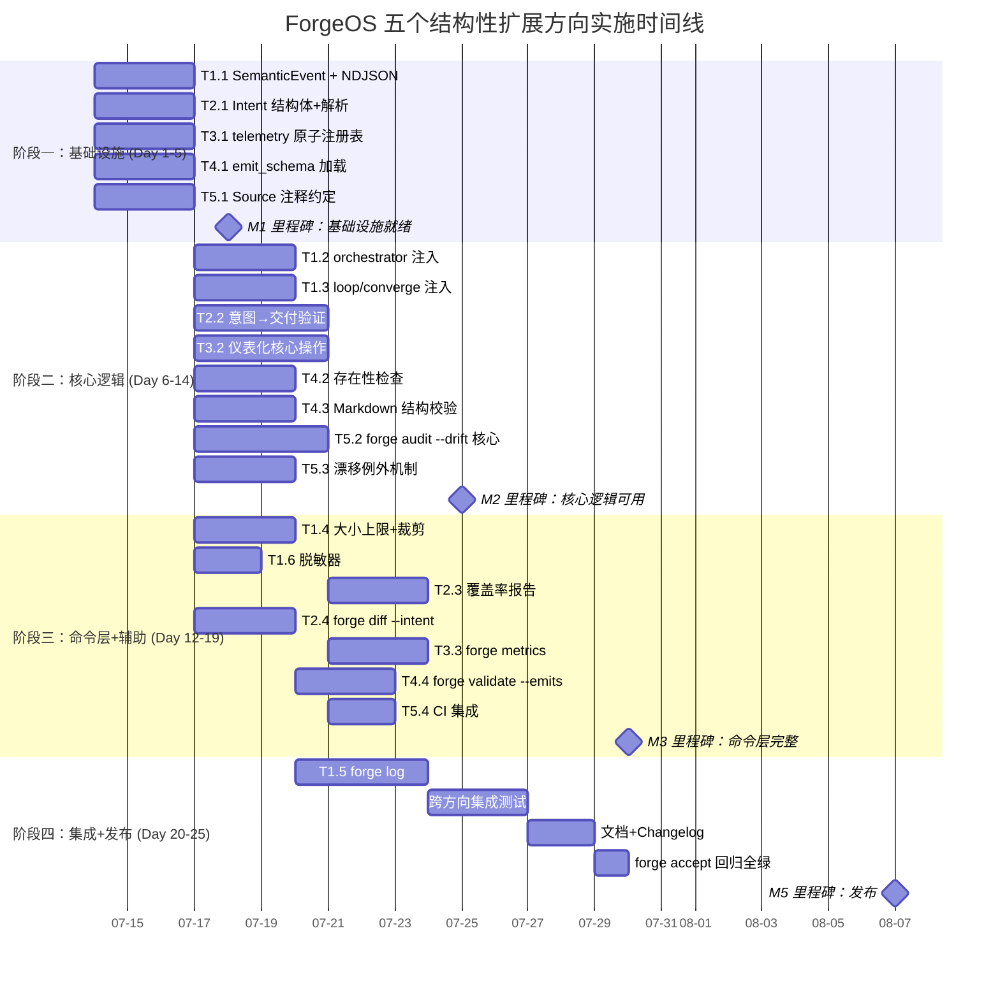

好的，已完整阅读 28.5 KB 的分析文档。以下是我的 Tech Lead 正式分析报告。

---

# Tech Lead 技术实现与项目管理分析报告

## 目录
1. 任务分解
2. 执行顺序与依赖图
3. 技术风险
4. 资源评估
5. 质量保证
6. 实施计划

---

## 1. 任务分解

将 5 个方向拆解为 22 个可执行任务，每个 2–4 小时，涉及 `forge-core` (Go) 和 `harness` (Node.js/Python) 两类代码库。

### 1.1 方向一：Workflow 执行语义日志 (P1)

| 任务 ID | 标题 | 涉及文件 | 前置 | 预估(h) | 验收标准 |
|---------|------|---------|------|---------|---------|
| **T1.1** | 定义 `SemanticEvent` 结构体体系 + NDJSON 双流格式 | `internal/trace/event.go` (新), `internal/trace/trace.go` | 无 | 3 | `SemanticEvent` 含 `PhaseCompleted/LoopBackTriggered/ConvergenceVerdict/StageSkipped/GateResult` 五子类型；`trace.go` 支持 `WriteEvent` 写入 `trace.ndjson`，每行 `{"version":1,"timestamp","type":"metric|semantic",...}`；已有 `scorecard-update.mjs` 在处理时跳过 `type:"semantic"` |
| **T1.2** | 在 `orchestrator.go` 注入 phase 完成/跳过事件 | `internal/engine/orchestrator.go` | T1.1 | 3 | `runAgentPhase` 结束后 emit `PhaseCompleted{Verdict, FilesChanged, OutputSummary}`；`mode_gating` 触发 skip 时 emit `StageSkipped` |
| **T1.3** | 在 `loop.go`/`converge.go` 注入 loop-back/收敛事件 | `internal/loop/loop.go`, `internal/converge/converge.go` | T1.1 | 3 | loop-back 触发时 emit `LoopBackTriggered{From,To,Reason,Budget}`；`Evaluate` 结束后 emit `ConvergenceVerdict{Met, Criteria}`；`Result` 序列化为 JSON |
| **T1.4** | 语义日志大小上限 + 裁剪策略 + 向后兼容 | `internal/trace/trace.go`, `harness/scorecard/scorecard-update.mjs` | T1.1 | 3 | 总上限 10MB，超限从最旧语义事件开始裁剪；指标事件永不裁剪；已有 scorecard 解析器跳过语义行（单元测试断言零行为变化） |
| **T1.5** | `forge log` 子命令（结构化查询 CLI） | `cmd/forge/main.go`, `cmd/forge/log.go` (新) | T1.1–T1.4 | 4 | `forge log --run latest --event-type loop-back` 输出可读文本；`--json` 输出 NDJSON；`--phase <name>` 过滤；无匹配时 exit 0 输出空列表 |
| **T1.6** | 敏感信息脱敏器 | `internal/trace/sanitize.go` (新) | T1.1 | 2 | 默认对 `OutputSummary` 做 pattern 匹配 (sk-.../AKIA.../-----BEGIN)；脱敏替换为 `***`；`--no-sanitize` 关闭；单元测试覆盖 5+ 敏感 pattern |

### 1.2 方向二：跨 Phase 意图一致性验证 (P1)

| 任务 ID | 标题 | 涉及文件 | 前置 | 预估(h) | 验收标准 |
|---------|------|---------|------|---------|---------|
| **T2.1** | `Intent` 结构体 + 从 planner 输出解析 | `internal/engine/intent.go` (新) | 无 | 3 | 解析 `task-plan.md` 或 stdout 中 `INTENT: [{"id":"P1","type":"implement","target":"url-shortener","files":["src/shorten.go"]}]` 标记；无效/缺失时返回空切片 + WARN 日志；失败不退化为 error |
| **T2.2** | 意图→交付验证（git diff 匹配） | `internal/engine/intent.go`, `internal/engine/orchestrator.go` | T2.1 | 4 | implementer phase 结束后：`git diff --name-only` 比较 intent 中 `files` 与实改文件；不在 intent 内的文件修改 → 记录 `ScopeCreep` 告警；intent 声明但未改的文件 → 记录 `MissingDelivery` 告警；全部匹配 → 记录 `IntentMatch` |
| **T2.3** | 意图覆盖率收敛报告 + 边界场景 | `internal/engine/intent.go`, `internal/report/report.go` | T2.2 | 3 | convergence report 新增行 `intent_coverage: 2/3 (P1:PASS P2:PASS P3:MISS)`；文件白名单（`.agent/`/`harness/`/`forge-core/` 排除）；回退到关键词子串匹配当意图过抽象 |
| **T2.4** | `forge diff --intent` 命令 | `cmd/forge/diff.go`, `cmd/forge/main.go` | T2.1 | 3 | 输出结构化差异报告：`P1 (url-shortener): 3 files matched ✓` / `P2 (billing): file billing.go NOT MODIFIED ✗` / `Unexpected: src/unrelated.go` |

### 1.3 方向三：Core 内部性能与正确性遥测 (P2)

| 任务 ID | 标题 | 涉及文件 | 前置 | 预估(h) | 验收标准 |
|---------|------|---------|------|---------|---------|
| **T3.1** | `internal/telemetry` 包：原子计数注册表 | `internal/telemetry/registry.go` (新), `internal/telemetry/metrics.go` (新) | 无 | 3 | 纯 `sync/atomic`，零外部依赖；支持 `Counter` 和 `DurationGauge` 两种原语；`Register()` / `Get()` 方法；线程安全；导出 `Snapshot()` |
| **T3.2** | 仪表化核心操作（loadWorkflow/gatherSignals/accept） | `internal/engine/engine.go`, `internal/yaml2json/decode.go`, `cmd/forge/accept.go`, `internal/mode/mode.go` | T3.1 | 4 | 5 个关键操作各注册 `forge_internal_*_duration_ms` 和 `forge_internal_*_count`；`yaml2json` 额外注册 `*_error_count`（正确性比）；操作开始时 `Start()` → defer `Observe()` |
| **T3.3** | `forge metrics` 子命令 | `cmd/forge/metrics.go` (新) | T3.1–T3.2 | 3 | 输出：`yaml2json.decode.avg_ms 1.2 (n=47) / load_workflow.avg_ms 3.8 (n=23) / ...`；空 metrics 时输出空表 exit 0；可选 `--json` |
| **T3.4** | 基准快照 + CI 门控 | `benchmark.json`, `.github/workflows/forge.yml`, `harness/benchmark-compare.mjs` (新) | T3.1 | 3 | CI 运行 `forge metrics` 后输出到 `benchmark.json`（git-tracked）；`benchmark-compare.mjs` 比较当前 vs 快照；`>20%` 退化 → CI 告警（非阻断）；首次运行时创建基线 |

### 1.4 方向四：Phase 产出物 Schema 强制 (P2)

| 任务 ID | 标题 | 涉及文件 | 前置 | 预估(h) | 验收标准 |
|---------|------|---------|------|---------|---------|
| **T4.1** | `emit_schema` 字段 + JSON Schema 加载 | `asset/phase.go`, `internal/engine/schema.go` (新) | 无 | 3 | Phase 结构体新增 `EmitSchema string`；`schema.go` 加载 `.schema.json` 文件（无外部 JSON Schema 库——用 `encoding/json` + 手写校验器）；schema 解析失败 = 降级为无 schema + trace 错误 |
| **T4.2** | 执行后 emits 存在性检查 | `internal/engine/orchestrator.go`, `internal/engine/existence.go` (新) | T4.1 | 3 | 每个 agent phase 结束后：对所有 `emits:` 文件做 `filepath.Glob` → 非空通过；缺失 → WARN（非 FAIL）；如果声明了 `emit_schema` → JSON Schema 校验产出物；结果记录到 SemanticEvent `PhaseArtifactCheck` |
| **T4.3** | Markdown 结构标记校验 | `internal/engine/mdcheck.go` (新) | T4.1 | 3 | 零外部依赖（无 Markdown AST）；逐行扫描匹配 `^## ` 标题和 `^VERDICT:/^CONFIDENCE:/^INTENT:` 标记；规则由 `emit_schema` 中轻量描述（`required_headings: ["## Success Criteria"]`）；缺失 → WARN；单元测试覆盖 5+ 范式 |
| **T4.4** | `forge validate --emits` 命令 + 边界场景集成 | `cmd/forge/validate.go`, `cmd/forge/main.go` | T4.2–T4.3 | 3 | 不执行 agent，只验证 workflow 声明：所有 emits 文件被 `uses_template` 覆盖？emit_schema 存在且合法？readonly phase 跳过 emits 校验；已有 workflow 无 schema → 静默通过 |

### 1.5 方向五：配置声明-实现漂移检测 (P1)

| 任务 ID | 标题 | 涉及文件 | 前置 | 预估(h) | 验收标准 |
|---------|------|---------|------|---------|---------|
| **T5.1** | `Source` 注释约定 + 初始常量标注 | `internal/mode/mode.go`, `internal/routing/routing.go`, `harness/gate.mjs`, `harness/arch/arch-check.mjs` | 无 | 3 | 每个 Go/JS 策略常量旁加注释 `// Source: harness/policies.yml:max_function_lines`；`internal/mode/baseline` 表每个 entry 标注 `// Source: modes.yml:explorer.harness`；`forge audit --drift` 能解析这些注释 |
| **T5.2** | `forge audit --drift` 命令 | `cmd/forge/audit.go` (新), `internal/audit/drift.go` (新) | T5.1 | 4 | 解析 `modes.yml`/`policies.yml`/`routing/policy.yml` (Go yaml2json)；按 Source 注释匹配 Go/JS 常量；输出漂移列表 `policies.yml: max_function_lines:60 ≠ arch-check.mjs:50`；已同步项输出绿色 ✓ |
| **T5.3** | 漂移例外机制 + relaxed/strict 模式 | `internal/audit/drift.go`, `.forge/drift-exceptions.json` (新) | T5.2 | 3 | `drift-exceptions.json` 声明已知漂移（含 `reason` + `expires`）；relaxed 模式跳过注释/格式等非关键漂移；strict 模式任何漂移都告警；`// Source: ... // intentional` 注释标记故意偏离 |
| **T5.4** | CI 集成 | `.github/workflows/forge.yml`, `harness/acceptance.mjs` | T5.2–T5.3 | 2 | `forge.yml` 中新 step `forge audit --drift --strict`；CI 红当 drift 非例外且 >1 处不匹配；示例输出嵌入 job summary |

---

## 2. 执行顺序与依赖图

### 2.1 完整依赖图

```mermaid
graph TD
    %% Direction 1 - 语义日志
    T1_1[🔷 T1.1 SemanticEvent + NDJSON] --> T1_2[🔷 T1.2 orchestrator 注入]
    T1_1 --> T1_3[🔷 T1.3 loop/converge 注入]
    T1_1 --> T1_4[🔷 T1.4 大小上限+裁剪]
    T1_1 --> T1_6[🔷 T1.6 脱敏器]
    T1_2 --> T1_5[🔷 T1.5 forge log]
    T1_3 --> T1_5
    T1_4 --> T1_5

    %% Direction 2 - 意图一致性
    T2_1[🔶 T2.1 Intent 结构体+解析] --> T2_2[🔶 T2.2 意图→交付验证]
    T2_2 --> T2_3[🔶 T2.3 覆盖率报告]
    T2_1 --> T2_4[🔶 T2.4 forge diff --intent]

    %% Direction 3 - 内部遥测
    T3_1[🟢 T3.1 telemetry 包] --> T3_2[🟢 T3.2 仪表化核心操作]
    T3_1 --> T3_4[🟢 T3.4 基准快照+CI]
    T3_2 --> T3_3[🟢 T3.3 forge metrics]

    %% Direction 4 - 产出物 Schema
    T4_1[🟣 T4.1 emit_schema 加载] --> T4_2[🟣 T4.2 存在性检查]
    T4_1 --> T4_3[🟣 T4.3 Markdown 结构校验]
    T4_2 --> T4_4[🟣 T4.4 forge validate --emits]
    T4_3 --> T4_4

    %% Direction 5 - 配置漂移
    T5_1[🔴 T5.1 Source 注释约定] --> T5_2[🔴 T5.2 forge audit --drift]
    T5_1 --> T5_3[🔴 T5.3 漂移例外机制]
    T5_2 --> T5_4[🔴 T5.4 CI 集成]
    T5_3 --> T5_4

    %% Cross-direction 集成
    T1_1 -. "可选集成：语义事件记录验证结果" .-> T2_2
    T1_1 -. "可选集成：记录 artifact check" .-> T4_2

    %% 样式
    classDef p1 fill:#e74c3c,color:#fff,stroke:#c0392b;
    classDef p2 fill:#f39c12,color:#fff,stroke:#e67e22;
    class T1_1,T1_2,T1_3,T1_4,T1_5,T1_6,T2_1,T2_2,T2_3,T2_4,T5_1,T5_2,T5_3,T5_4 p1;
    class T3_1,T3_2,T3_3,T3_4,T4_1,T4_2,T4_3,T4_4 p2;
```



### 2.2 并行执行组

| 组 | 包含任务 | 并行度 | 建议人力 |
|----|---------|--------|---------|
| **A - 基础设施 (全部 T.x.1)** | T1.1, T2.1, T3.1, T4.1, T5.1 | 5 路并行 | 2–3 人 |
| **B - 核心逻辑 (全部 T.x.2/T.x.3)** | T1.2, T1.3, T2.2, T3.2, T4.2, T4.3, T5.2, T5.3 | 8 路并行（受 A 阻塞） | 2–3 人 |
| **C - 命令层 + 辅助 (全部 T.x.4/T.x.6)** | T1.4, T1.6, T2.3, T2.4, T3.3, T4.4, T5.4 | 7 路并行（受 A+B 阻塞） | 2 人 |
| **D - 复合命令** | T1.5 (forge log) | 单线程（受 B+C 阻塞） | 1 人 |
| **E - 跨方向集成测试** | 集成验证 + E2E | 1 路（受全部完成阻塞） | 1 人 |

> **关键洞察**：T1.5（`forge log`）是唯一有最长依赖链的任务——需要 T1.1→T1.2/T1.3→T1.4→T1.5 全部完成。建议安排经验最丰富的开发承担此任务。

---

## 3. 技术风险

### 3.1 风险矩阵

| ID | 风险 | 概率 | 影响 | 缓解策略 |
|----|------|------|------|---------|
| **R1** | NDJSON 格式演化导致旧工具无法读取新 trace | 中 | 高 | 每行含 `version` 字段，消费者按 version 降级；写 `MIGRATION.md` 记录格式变更 |
| **R2** | `INTENT:` 标记提取不稳定（LLM 不按格式输出） | 高 | 中 | 回退到关键词子串匹配；缺失时 WARN 非 FAIL；prompt 工程强化格式要求 |
| **R3** | `sync/atomic` 在高频 op 上的 cache line 伪共享 | 低 | 中 | 每个 counter 独占缓存行（`_ [cachelinePad]`）；benchmark 验证 < 1% 开销 |
| **R4** | Markdown 结构校验误报（规则过于严格） | 中 | 低 | 校验结果仅为 WARN 级，不影响 convergence 判定；允许用户配置 `check_strictness: relaxed` |
| **R5** | `forge audit --drift` 解析 YAML→Go 类型不匹配（int vs string） | 中 | 高 | 类型宽松比较：`"500"` 与 `500` 视为相等；float 有 1e-6 容差；测试覆盖所有现有策略值 |
| **R6** | 语义日志在 200+ phase 运行中产生 >10MB 数据 | 中 | 中 | 裁剪策略已设 10MB cap；提供 `forge log prune` 手动触发；指标事件永不裁剪保证 scorecard 完整性 |
| **R7** | `forge diff --intent` 在非 git repo 中运行 | 低 | 高 | 检测 `git rev-parse --git-dir` 失败 → exit 1 + 清晰错误信息"not a git repository" |
| **R8** | CI 基准快照因 runner 硬件波动误报 >20% 退化 | 高 | 低 | 仅比较同 runner label（`ubuntu-latest` vs `ubuntu-latest`）；连续两次退化才告警；提供 `benchmark reset` 重置基线 |

### 3.2 依赖外部系统

| 外部系统 | 用于 | 风险等级 | 替代方案 |
|---------|------|---------|---------|
| `git` (git diff) | 意图一致性验证 | 低 — 已是 ForgeOS 核心依赖 | 无，但已是必备依赖 |
| GitHub Actions (CI) | 基准门控 + 漂移检测 CI | 低 — 已有 `forge.yml` | `forge audit --drift` 可在本地独立运行 |
| Go 标准库 `sync/atomic` | 内部遥测 | 无 — 标准库 | 不适用 |
| JSON Schema (手写校验) | 产出物 Schema | 低 — 零外部依赖 | 使用 `encoding/json` + 手写 walker，无需第三方库 |

### 3.3 测试覆盖难点

| 难点 | 方向 | 策略 |
|------|------|------|
| LLM 输出不确定性 → INTENT 格式不可控 | D2 | 使用 `json.Unmarshal` 宽松解析 + `strict` 回退到关键词匹配；单元测试用 fixture 文件而非真实 LLM |
| NDJSON 格式演化兼容 | D1 | 写入测试矩阵：v1 format → v2 reader、v2 format → v1 reader（向后兼容断言） |
| `forge audit --drift` 的解析覆盖 | D5 | 模拟 YAML 与 Go const 的全排列组合：匹配/不匹配/类型不同/intentional_drift/exception |
| 性能基准快照对比 | D3 | 单元测试 mock 时间；集成测试用固定数据；CI 中首次 run 建立快照 |

---

## 4. 资源评估

### 4.1 开发团队建议

| 角色 | 技能要求 | 人数 | 负责方向 |
|------|---------|------|---------|
| **Go 后端工程师 A** | forge-core 熟悉，并发/atomic 经验 | 1 | D1（语义日志）+ D3（内部遥测）— 两个方向共享 `internal/telemetry` 包 |
| **Go 后端工程师 B** | forge-core 治理流程熟悉，git/CLI 经验 | 1 | D2（意图一致性）+ D5（配置漂移）— 两个方向共享 `cmd/forge` 子命令 |
| **全栈/Node 工程师** | JS/Node, yaml, CI 配置 | 0.5（兼职） | D4（产出物 Schema）+ CI 集成 — 与 Go 工程师协作开发 |
| **QA/测试工程师** | ForgeOS 使用经验，E2E 测试 | 0.5（兼职） | 跨方向集成测试 + 回归测试 |

> **最低配置**：2 名全栈 Go 工程师（人均可覆盖 2–3 个方向）+ 1 名 QA 兼职。

### 4.2 关键里程碑

| 里程碑 | 时间点 | 交付物 | 验证方式 |
|--------|-------|--------|---------|
| **M1 — 基础设施就绪** | Day 5 | 5 个 T.x.1 任务完成，NDJSON 写入 + Intent 解析 + telemetry 注册 + Schema 加载 + Source 注释 | 单元测试全部通过 + `forge build` 保持绿 |
| **M2 — 核心逻辑可用** | Day 12 | 注入点完成（D1.2/D1.3/D2.2/D3.2/D4.2/D4.3/D5.2/D5.3），每个方向能产生核心输出 | `forge run build` + `forge diff --intent` 打出正确结果 |
| **M3 — 命令层完整** | Day 18 | `forge log` / `forge diff --intent` / `forge metrics` / `forge validate --emits` / `forge audit --drift` 全部可用 | CLI 命令验收，用户文档初步可读 |
| **M4 — CI 集成 + E2E** | Day 22 | CI 包含 `forge audit --drift` + 基准比较 + 跨方向 E2E 测试 | CI green，`forge accept` 通过 |
| **M5 — 发布** | Day 25 | 文档完成，changelog 更新，回归测试全量通过 | `forge accept` 全部 P + N/A |

### 4.3 阻塞点与解决策略

| 阻塞点 | 影响方向 | 解决策略 |
|--------|---------|---------|
| **Go JSON Schema 校验库选择** | D4 | 决策：**不使用第三方库**，手写 `validateJSON(data, schema map[string]interface{})` 支持 required/properties/type/enum/pattern 子集——保持 forge-core 零外部依赖红线。若后续需要完整 JSON Schema 支持，通过 `harness` 侧（Node.js + ajv）扩展 |
| **INTENT 格式的 LLM 遵从率** | D2 | 不能在 P1 阶段依赖 LLM 100% 遵从。方案：双重解析（结构化 JSON 优先 → 回退到关键词子串 → 退化为无验证 WARN）。不阻塞——prompt 工程渐进改进 |
| **`forge audit --drift` 的 YAML 解析** | D5 | forge-core 已有 `yaml2json` 包（纯 Go，零外部依赖），直接复用。不增加新的 Go YAML 依赖 |
| **NDJSON 向后兼容** | D1 | 旧 `trace.jsonl` 文件（单行 `Event` JSON）与新 `trace.ndjson`（双类型流）不兼容。方案：检测文件首行——如果首行不含 `"type":` 则为旧格式，执行升级迁移 |

---

## 5. 质量保证

### 5.1 单元测试覆盖要求

| 方向 | 关键模块 | 最低覆盖率 | 测试重点 |
|------|---------|-----------|---------|
| D1 | `internal/trace/event.go` | 90%+ | SemanticEvent 序列化/反序列化、version 字段兼容、NDJSON 行结束符 |
| D1 | `internal/trace/trace.go` | 85%+ | 多 goroutine 写入、裁剪策略（大小超限后语义事件被删、指标事件保留）、脱敏器 pattern 匹配 |
| D2 | `internal/engine/intent.go` | 90%+ | INTENT 解析（正常/缺失/格式错误）、git diff 匹配（匹配/不匹配/越界）、白名单过滤 |
| D3 | `internal/telemetry/registry.go` | 90%+ | 并发注册/读取/快照、Counter incr、DurationGauge 基本统计 |
| D4 | `internal/engine/existence.go` | 85%+ | Glob 匹配（通配符/零匹配/多匹配）、JSON Schema 校验（合规/不合规/空 schema） |
| D4 | `internal/engine/mdcheck.go` | 90%+ | 标题匹配（存在/不存在/大小写敏感）、标记匹配（VERDICT/CONFIDENCE/INTENT）、空文件 |
| D5 | `internal/audit/drift.go` | 85%+ | Source 注释解析、YAML vs Go 值比较（int/float/string/[]string）、intentional 注释、exception 文件 |

### 5.2 集成测试策略

| 测试场景 | 覆盖的方向 | 方法 | 环境 |
|---------|-----------|------|------|
| 完整的 `forge run build` 执行 | D1 + D4 | 运行 `forge run build`，检查 `trace.ndjson` 包含 semantic events + 存在性检查 WARN | 本地 |
| planner→implementer 意图验证 | D2 | 构造 fixture workflow（planner 输出固定 `INTENT`），检查 `forge diff --intent` 输出 | 本地 |
| 多个 forge 命令组合 | D1–D5 | `forge run build && forge log --json && forge metrics && forge audit --drift` 全链通行 | CI |
| 漂移检测全场景 | D5 | 修改 `modes.yml` 但不更新 `mode.go` → `forge audit --drift` 检测到漂移；标记例外后跳过 | CI |
| 向后兼容 | D1 | 写入旧 `trace.jsonl`（指标只有）→ 升级后新 binary 读取不崩溃 | CI |
| 基准退化检测 | D3 | CI 运行 benchmark-compare.mjs 检查退化告警逻辑 | CI |

### 5.3 代码审查要点

| 审查维度 | 重点关注 | 审查人 |
|---------|---------|-------|
| **并发安全** | `telemetry` 包的 atomic 操作、`trace.go` 的多个 goroutine 写 `ndjson` 文件 | Go 方向 senior |
| **零外部依赖红线** | `internal/telemetry`, `internal/engine/mdcheck.go` 没有 import 标准库以外的包 | 全体 reviewer |
| **错误处理风格** | 所有 "缺失/格式错误" 场景是 WARN 不是 FAIL（向后兼容承诺） | 产品 + 架构 |
| **CLI 输出稳定性** | `forge log`/`forge metrics` 的文本格式是稳定的（可供工具解析） | API reviewer |
| **Source 注释格式** | `// Source:` 注释的语法一致性（路径格式、key 分隔符） | D5 owner |
| **测试完整性** | 每个 T.x.1 的 fixture 数据是否覆盖边界 case；N/A 是否诚实标记 | QA |

### 5.4 性能测试需求

| 测试 | 方法 | 目标 | 时机 |
|------|------|------|------|
| 语义日志写入吞吐 | 模拟 100 phase 连续执行，测量 `WriteEvent` 的 p99 延迟 | <500µs/event | 每 PR |
| telemetry overhead | 在 instrumented hot loop 前后测量 wall clock 增加 | <1% | M2 |
| `forge audit --drift` 执行时间 | 真实 modes.yml + 5 个 Go 文件解析 | <200ms | M3 |
| `forge log --run latest` 查询 | 10MB trace.ndjson 上的过滤性能 | <100ms | M3 |

---

## 6. 实施计划

### 6.1 甘特图



### 6.2 阶段详情

#### 阶段一：基础设施搭建（Day 1–5，5 天）

**目标**：5 个方向的数据模型和注册机制全部就绪

| 日期范围 | 活动 | 输出 |
|---------|------|------|
| Day 1–3 | T1.1 + T2.1 + T3.1 + T4.1 + T5.1 — 5 人并行（或 2–3 人串行完成 2 个方向） | 5 个 PR，每个含类型定义 + 单元测试 |
| Day 4–5 | Code review + 跨方向集成验证（确保 NDJSON → Scorecard 跳过 → 不影响现有功能） | 5 个 PR 合并，`forge accept` 绿 |

**关键交付**：
- `internal/trace/event.go` — 5 个 SemanticEvent 子类型
- `internal/engine/intent.go` — Intent 结构体 + JSON 解析
- `internal/telemetry/registry.go` — Counter/DurationGauge
- `asset/phase.go` — EmitSchema 字段
- `internal/mode/mode.go` — Source 注释标注

#### 阶段二：核心功能实现（Day 6–14，9 天）

**目标**：每个方向的核心执行逻辑可工作

| 日期范围 | 活动 | 输出 |
|---------|------|------|
| Day 6–9 | T1.2 + T1.3（Go engineer A） + T4.2 + T4.3（Node/Go engineer B） + T5.2（Go engineer C） | orchestrator 注入完成、存在性检查、drift 核心引擎 |
| Day 8–12 | T2.2 + T3.2 + T5.3（T5.2 后追加） + D4.2/D4.3 集成 | intent→delivery 验证、仪表化、例外机制 |
| Day 13–14 | 集成调试、修复跨方向兼容问题 | M2 里程碑 |

**关键交付**：
- `forge run build` 产出含 semantic events 的 `trace.ndjson`
- `forge diff --intent` 能输出意图覆盖率
- `forge metrics` 能输出 5+ 内部指标
- `forge audit --drift` 能列举漂移项

#### 阶段三：命令层和辅助功能（Day 12–19，8 天）

**目标**：所有 CLI 子命令可用 + 辅助机制（裁剪、脱敏、例外）

| 日期范围 | 活动 | 输出 |
|---------|------|------|
| Day 12–15 | T1.4 + T1.6 + T2.3 + T2.4 + T3.3 | 裁剪策略、脱敏器、覆盖率报告、diff 命令、metrics 命令 |
| Day 16–17 | T4.4 + T5.4 | validate --emits 命令、CI 集成 |
| Day 18–19 | 命令层集成测试 + bug fix | M3 里程碑 |

**关键交付**：
- `forge log --run latest --event-type loop-back` 输出正确
- `forge diff --intent` 输出结构化差异
- `forge metrics` 输出内部指标表
- `forge validate --emits` 验证 workflow 声明一致性
- `forge audit --drift` CI 步骤绿

#### 阶段四：集成测试和发布（Day 20–25，6 天）

**目标**：全功能可用，`forge accept` 全绿

| 日期范围 | 活动 | 输出 |
|---------|------|------|
| Day 20–22 | T1.5（`forge log` 命令）| forge log 子命令可用 |
| Day 22–24 | 跨方向 E2E 测试、性能测试、文档编写 | 测试报告、用户文档 |
| Day 25 | `forge accept` 回归、changelog、发布 | 版本发布 |

**E2E 测试场景**（建议覆盖）：
```
1. forge run build
2. forge log --run latest --json | jq '.type'               → 检查同时含 metric 和 semantic
3. forge diff --intent                                       → 输出有或无（取决于 planner）
4. forge metrics                                             → 5+ 行指标
5. forge validate --emits                                    → 所有 emits 文件存在
6. forge audit --drift                                       → 漂移项列表+同步项列表
7. 修改 modes.yml → forge audit --drift --strict            → 检测到漂移
8. forge accept                                              → 全 P + N/A
```

---

## 7. 总览总结

### 7.1 优先级执行建议

按「对现有功能零影响 + 最高价值 / 最低风险」排序，建议的交付顺序：

| 优先级 Wave | 方向 | 理由 |
|-------------|------|------|
| **Wave 1** (Day 1–9) | **D1 语义日志** + **D5 配置漂移** | 两个 P1 方向，共享 trace + cmd 基础设施，无外部依赖，不影响核心执行路径 |
| **Wave 2** (Day 6–14) | **D2 意图一致性** | P1，需 D1 的 semantic event 做记录（软依赖），核心逻辑可独立开发 |
| **Wave 3** (Day 12–19) | **D4 产出物 Schema** | P2，价值随自治运行时长累积递增，可推迟 |
| **Wave 4** (Day 12–16) | **D3 内部遥测** | P2，长期收益大但短期不阻塞任何功能，可最后交付 |

### 7.2 关键纪律

1. **零外部依赖红线不可违反** — 每个 PR 的 `go.mod` 变更必须被严格审查
2. **向后兼容承诺不可违反** — 所有新特性缺失时退化为 WARN 而非 FAIL，已有 workflow 行为零变化
3. **N/A 诚实标记** — 测试中无对应工具的检查标记 N/A 而非伪造通过
4. **每方向 T.x.1 先合并再开 T.x.2** — 防止基础设施不一致导致的返工
5. **`forge accept` 是硬闸门** — 每次 PR 合并前必须全绿

### 7.3 预估总工时

| | 方向 | 任务数 | 总工时(h) | 人天(6h) |
|---|------|--------|----------|---------|
| D1 | 语义日志 | 6 | 18 | 3 |
| D2 | 意图一致性 | 4 | 13 | 2.2 |
| D3 | 内部遥测 | 4 | 13 | 2.2 |
| D4 | 产出物 Schema | 4 | 12 | 2 |
| D5 | 配置漂移 | 4 | 12 | 2 |
| — | 跨方向集成 + 文档 + 发布 | — | 15 | 2.5 |
| | **总计** | **22** | **83h** | **~14 人天** |

> 2 名全职 Go 工程师预估 **3.5 周 (17.5 工作日)** 可完成。若投入 3 人（含 1 名兼职 Node 工程师），压缩至 **3 周 (15 工作日)**。
