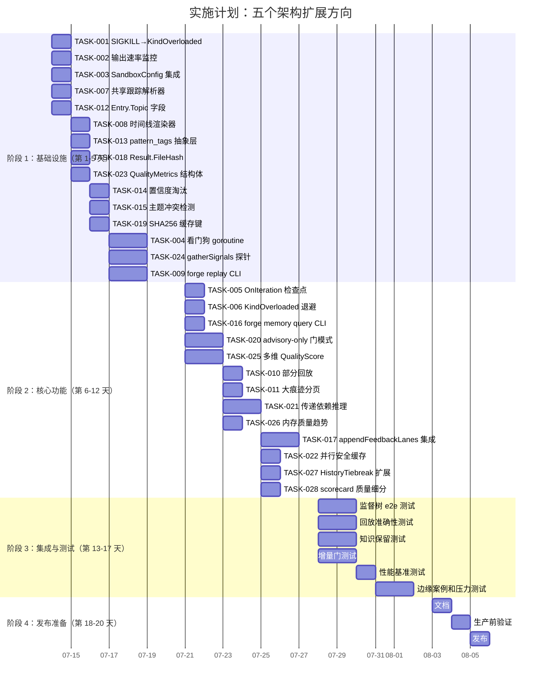

现在我已充分了解代码库，我将基于审核文档撰写全面的技术负责人分析报告。

---

# 技术负责人分析报告：五个架构扩展方向

> 审核依据：提交 `b0c80e4`，ForgeOS 代码库
> 重点领域：forge-core（Go 运行时）、harness（节点/校验测试）、internal/memory、internal/trace、internal/gate、orchestrator

---

## 1. 任务分解

### 方向一：Agent 阶段运行时监督树（进程监管与看门狗）

**修正后的基础**：使用 `setupProcessGroup`（`command_executor_unix.go`）+ `commandContext`（`command_executor.go:240`），**不**使用 `interruptProcessTree` 或 `waitWithTimeout`。OOM 检测路线：exit 137/SIGKILL → `classifyRunErr`（`exec_error.go`）→ 默认分支进入 `KindFailed`，需要改为 `KindOverloaded`。

| 任务 ID | 标题 | 涉及文件 | 前置依赖 | 预估工时 | 验收标准 |
|---|---|---|---|---|---|
| TASK-001 | **将 SIGKILL/OOM 退出路由到 `KindOverloaded`** | `forge-core/internal/orchestrator/exec_error.go` | — | 2h | exit 137（SIGKILL）的 agent 进程映射到 `KindOverloaded`（可重试+退避），而不是 `KindFailed`（终止）。通过 `classifyRunErr` 单元测试验证，该测试模拟退出代码 137。 |
| TASK-002 | **向 `cappedBuffer` 添加输出速率监控** | `forge-core/internal/orchestrator/command_executor.go` | — | 3h | `cappedBuffer` 通过导出的 `BytesPerSecond()` 方法报告滚动窗口速率（最后 5 秒的字节数）。当速率在 3 秒内低于 1 字节/秒时，`Stalled()` 返回 true（可配置阈值）。通过带有定时器模拟的单元测试验证。 |
| TASK-003 | **填充 `SandboxConfig` skeleton 并集成到 `CommandExecutor`** | `forge-core/internal/orchestrator/command_executor.go` | — | 3h | `SandboxConfig` 获得 `MaxMemoryMB`、`MaxCPUShares`、`MaxDiskMB`、`Timeout`、`MaxOutputBytes` 字段。`CommandExecutor` 从配置中填充字段，并通过 `setupProcessGroup` 在 Unix 上设置 `Setrlimit`。 |
| TASK-004 | **实现看门狗 goroutine 用于 stdout/stderr 监控** | `forge-core/internal/orchestrator/command_executor.go` | TASK-002 | 4h | 看门狗 goroutine 监控 `cappedBuffer` 速率和进程健康状态。如果 `Stalled()` 变为 true 或输出速率超过 `BurstLimit`，它会记录警告并在超时后取消上下文。通过带有模拟慢速写入器的竞争测试验证。 |
| TASK-005 | **将 `OnIteration` 作为看门狗检查点集成到循环中** | `forge-core/internal/orchestrator/loop.go` | TASK-004 | 2h | `loop.go` 中的 `OnIteration` 回调记录每次迭代的看门狗指标（峰值内存、最大输出速率、阶段持续时间 P95）。新结构 `WatchdogSnapshot` 随时间累积，现有测试保持不变。 |
| TASK-006 | **为看门狗负载注入添加 `KindOverloaded` 退避策略** | `forge-core/internal/orchestrator/backoff.go` | TASK-001 | 2h | `backoff.go` 为 `KindOverloaded` 添加指数退避策略，起始退避时间可配置（默认 30 秒）。通过模拟退避序列的单元测试验证，该序列确认延迟呈指数级增长。 |

**方向一小计：16 小时（4 个半天）**

---

### 方向二：离线回放引擎与会话取证

**修正后的基础**：`scorecard_wind.go` 已通过 `bufio.Scanner` 读取 `trace.jsonl`。`trace.Event` 结构体已为回放做好了准备。`doctor/anomaly.go` 中的 `DetectAnomalies` 提供了 5 个启发式检测器，可作为回放分析的构建模块重用。

| 任务 ID | 标题 | 涉及文件 | 前置依赖 | 预估工时 | 验收标准 |
|---|---|---|---|---|---|
| TASK-007 | **将 trace.jsonl 解析器提取到共享包 `internal/trace/reader.go`** | `forge-core/internal/trace/reader.go`（新建），`forge-core/cmd/forge/scorecard_wind.go`（重构） | — | 3h | 新的 `trace.Reader` 类型封装了 `bufio.Scanner` + JSON 解码，以便流式传输。从 `scorecard_wind.go` 中提取，保持其现有行为不变。`Reader` 支持 `Filter(kind string)` 和 `Limit(n int)`。通过了之前直接依赖于 `scorecard_wind` 解析逻辑的现有测试的验证。 |
| TASK-008 | **构建阶段级时间线渲染器** | `forge-core/internal/trace/timeline.go`（新建） | TASK-007 | 3h | `timeline.Render(events []Event)` 输出一个人类可读的时间线：`[iter 3] agent implementer PASS 2.3s $0.054`。按迭代分组，按 `Seq` 排序。处理所有事件类型（`iteration`、`agent`、`gate`、`converge`、`error` 等）。 |
| TASK-009 | **添加 `forge replay` CLI 子命令** | `forge-core/cmd/forge/replay.go`（新建），`forge-core/cmd/forge/main.go`（注册） | TASK-008 | 4h | `forge replay` 读取 `.forge/trace.jsonl` 并打印时间线。Flag：`--kind`（按事件类型过滤）、`--since`/`--until`（ISO8601）、`--tail N`（最后 N 个事件）、`--json`（原始 JSON 输出）。如果 `.forge/` 目录不存在，则以错误代码退出。 |
| TASK-010 | **添加部分回放和不完整目录检测** | `forge-core/cmd/forge/replay.go` | TASK-009 | 2h | 如果 `trace.jsonl` 存在但 `checkpoint.json` 缺失，回放会在顶部打印警告，但仍呈现可用事件。如果 `trace.jsonl` 也不存在，回放会打印有用的诊断信息（每个缺失文件的路径）。 |
| TASK-011 | **为大痕迹添加分页（10,000+ 个事件）** | `forge-core/internal/trace/reader.go`，`forge-core/cmd/forge/replay.go` | TASK-009 | 2h | `--page N`（每页 50 个事件）和 `--total`（总事件数）。滚动输出在重新运行时会迅速跳过已读事件。10k 事件痕迹能在 500 毫秒内解析。 |

**方向二小计：14 小时（3.5 个半天）**

---

### 方向三：跨会话知识传递与模式库

**基础**：`memory.go` 中现有的 `Entry` 结构体已包含 `Kind`（gap/decision/lesson）、`Confidence float64`、`Supersedes string`。项目级缓存隔离（`loadCaches sync.Map` 以 `path` 为键）。现有注入点 `appendFeedbackLanes` 在 `prompt_context.go:364`。

| 任务 ID | 标题 | 涉及文件 | 前置依赖 | 预估工时 | 验收标准 |
|---|---|---|---|---|---|
| TASK-012 | **向 Entry 添加 `Topic` 字段** | `forge-core/internal/memory/memory.go` | — | 2h | `Entry` 获得 `Topic string`（由记录者设置的免费格式标签）和 `Tags []string`（用于过滤）。现有条目的向后兼容性：`Topic=""` 匹配所有主题。JSONL 解码对缺失字段保持稳健。 |
| TASK-013 | **构建 `pattern_tags` 抽象层** | `forge-core/internal/memory/pattern.go`（新建） | TASK-012 | 4h | `Patternizer` 函数将项目特定路径替换为抽象标签：`src/auth/login.go` → `{auth}/login.go`。使用可配置的替换映射。通过测试验证：`/home/u1/project/x.go` 抽象为 `{project_root}/x.go`。 |
| TASK-014 | **实现置信度驱动的自动淘汰** | `forge-core/internal/memory/memory.go`，`forge-core/cmd/forge/prompt_memory.go` | TASK-012 | 3h | 如果 `Confidence < 0.3` 且条目年龄超过 30 天，`Prune()` 会将其标记为已淘汰（添加 `DeprecatedAt` 时间戳，不在查询中返回它们）。`forge memory-prune` 命令运行此操作。 |
| TASK-015 | **添加主题冲突检测** | `forge-core/internal/memory/memory.go` | TASK-012 | 3h | `Conflicts(topic string)` 返回具有相同 `Topic`、`Confidence > 0.7` 且不相互 supersede 的条目组。在知识注入期间被 `recordMemory` 调用作为警告。 |
| TASK-016 | **公开 `forge memory query` CLI** | `forge-core/cmd/forge/memory.go`（新建），`forge-core/cmd/forge/main.go` | TASK-014 | 3h | `forge memory query --topic X --tags Y,Z` 返回匹配的条目。`--json` 标志用于机器可读的输出。带有 KV 样式输出的 `--brief` 标志。如果内存存储缺失，则优雅降级。 |
| TASK-017 | **将模式标签集成到 `appendFeedbackLanes`** | `forge-core/cmd/forge/prompt_context.go` | TASK-013，TASK-012 | 4h | `appendFeedbackLanes` 在构建提示时调用 `Patternizer`。跨项目约束通过抽象标签（不是原始路径）注入。现有测试对默认配置（无模式化）的行为保持不变。 |

**方向三小计：19 小时（5 个半天）**

---

### 方向四：增量门评估与变化感知审计

**基础**：`ProbeAll`（`gate.go:138`）每次迭代都运行一次完整扫描。`acceptance.mjs` 的 `--json` 输出创建 `[{criterion,status,detail}]`。`select-tests.mjs` 建立了 advisory-only 模式。`sync.Map` + 读锁在并行模式下已表现出并发安全性。

| 任务 ID | 标题 | 涉及文件 | 前置依赖 | 预估工时 | 验收标准 |
|---|---|---|---|---|---|
| TASK-018 | **向 `Result` 结构体添加 `FileHash` 和 `Freshness`** | `forge-core/internal/gate/gate.go` | — | 2h | `Result` 获得了 `FileHash string`（正在检查的文件的 SHA256）和 `Freshness string`（`"fresh"` 或 `"cached"`）。现有代码路径设置 `Freshness="fresh"`。旧版序列化保持向后兼容。 |
| TASK-019 | **为门标准则实现基于 SHA256 的缓存键** | `forge-core/internal/gate/gate.go` | TASK-018 | 4h | 每个准则都生成一个缓存键，作为其相关文件集的 SHA256。`cacheKey` 函数将准则名称 + 文件哈希 + `.agent/eval/` 元数据哈希组合起来。新包 `internal/gate/cache.go` 用 `sync.Map` 托管缓存。 |
| TASK-020 | **集成 `select-tests.mjs` 的 advisory-only 模式** | `forge-core/internal/gate/gate.go`，`forge-core/internal/gate/resolve.go` | TASK-019 | 3h | 当所有哈希匹配时，`ProbeAll` 跳过准则。跳过的准则标记为 `Freshness="cached"`。如果在同一迭代中检测到任何文件更改，则退避到完整运行。横幅警告："使用增量缓存——完整验证请运行 `forge accept`。" |
| TASK-021 | **为传递依赖回退添加保守推理** | `forge-core/internal/gate/gate.go` | TASK-020 | 4h | 更改共享接口（由 `git diff` 检测，匹配 `architecture.yml`）会触发所有依赖于该接口的准则的完整运行。实现一个 `impactedCriteria(changeSet)` 函数，该函数咨询 `architecture.yml` 的接口定义。 |
| TASK-022 | **集成 `RunParallel` 并发安全缓存访问** | `forge-core/internal/gate/gate.go`，`forge-core/internal/orchestrator/parallel.go` | TASK-020 | 2h | 为缓存读取/写入添加 `sync.RWMutex` 保护。在并行模式下，当出现未缓存命中时，最多一个 goroutine 会计算准则。确认现有并行测试未出现竞争。 |

**方向四小计：15 小时（4 个半天）**

---

### 方向五：量化 Agent 输出质量评估

**修正后的基础**：`routing.Scorecard` 中的 `QualityScore` 已经是通过率（gate 通过率），**不是**代码质量。`converge.Signals` 中的 `CodeTestRatio` 已经存在，但只是一个比例。`scorecard.mjs` 通过 `avg_iterations`/`rework_rate` 追踪轨迹。这是将一维评分扩展为多维质量评分的问题。

| 任务 ID | 标题 | 涉及文件 | 前置依赖 | 预估工时 | 验收标准 |
|---|---|---|---|---|---|
| TASK-023 | **向 `Signals` 添加多维 `QualityMetrics`** | `forge-core/internal/converge/converge.go` | — | 3h | `QualityMetrics` 结构体包含 `TestCoverage float64`、`LintDensity float64`、`ComplexityScore float64`、`ArchViolations int`。`Signals` 获得 `QualityMetrics` 字段。使用零值的旧版信号保持向后兼容。 |
| TASK-024 | **在 `gatherSignals` 中连接质量探针** | `forge-core/cmd/forge/gates.go` | TASK-023 | 4h | `gatherSignals` 调用 `acceptance-quality.mjs` 的探针（`probeLint`、`probeCoverage`），将结果解析为 `QualityMetrics` 字段。探针失败是 INFO 级别的，不会破坏收敛性。 |
| TASK-025 | **将 `QualityScore` 从一维扩展为多维** | `harness/scorecard.mjs`，`forge-core/internal/routing/scorecard.go` | TASK-023 | 4h | `scorecard.mjs` 中的 `synthesize` 接受 `quality_sub_scores` 映射并计算加权平均值（例如，覆盖率 0.3 + lint 0.3 + arch 0.2 + test_ratio 0.2）。`Scorecard` 结构体获得 `QualitySubScores map[string]float64`。现有通过率路径保持不变（无需子分数的旧版条目会降级）。 |
| TASK-026 | **将质量趋势注入内存层** | `forge-core/cmd/forge/evolve.go`，`forge-core/internal/memory/memory.go` | TASK-025 | 3h | 当 `QualityMetrics` 在迭代之间恶化时（覆盖率下降 >5%，lint 违规增加），`recordMemory` 会写入一条 `KindGap` 条目。当质量约束需要制度化时，会写入一条 `KindDecision`。 |
| TASK-027 | **将 `HistoryTiebreak` 更新为使用多维评分** | `forge-core/internal/routing/scorecard.go` | TASK-025 | 3h | `HistoryTiebreak` 获得一个新的 `tiebreak_on` 选项`"quality_composite"`，该选项使用加权评分。现有的 `"quality_score"` 通过率路径保持不变。通过单元测试验证，确认混合质量-通过率排序按预期工作。 |
| TASK-028 | **添加 `forge scorecard --quality` 细分显示** | `forge-core/cmd/forge/scorecard_wind.go` | TASK-025 | 3h | `forge scorecard --quality` 打印质量细分（覆盖率、lint、复杂度）和总体复合评分。以机器可读的 JSON 格式通过 `--json` 标志输出。 |

**方向五小计：20 小时（5 个半天）**

---

### 总体任务汇总

| 指标 | 数值 |
|---|---|
| 任务总数 | 28 |
| 预估总工时 | 84 小时（10.5 人天） |
| 跨方向任务 | TASK-007 影响方向二和方向一（共享的跟踪基础设施） |
| 纯新增文件 | 5 个 Go 文件（`reader.go`、`timeline.go`、`pattern.go`、`replay.go`、`memory.go`） |
| 修改最多的文件 | `command_executor.go`（方向一）、`gate.go`（方向四）、`memory.go`（方向三）、`scorecard.go`（方向五） |

---

## 2. 执行顺序

```mermaid
graph TD
    %% 方向一：监督树
    T001[TASK-001: SIGKILL→KindOverloaded] --> T004[TASK-004: Watchdog goroutine]
    T002[TASK-002: 输出速率监控] --> T004
    T003[TASK-003: SandboxConfig 集成] --> T004
    T004 --> T005[TASK-005: OnIteration 检查点]
    T001 --> T006[TASK-006: KindOverloaded 退避]

    %% 方向二：回放
    T007[TASK-007: 共享跟踪解析器] --> T008[TASK-008: 时间线渲染器]
    T008 --> T009[TASK-009: forge replay CLI]
    T009 --> T010[TASK-010: 部分回放]
    T009 --> T011[TASK-011: 大痕迹分页]

    %% 方向三：知识传递
    T012[TASK-012: Entry.Topic 字段] --> T013[TASK-013: pattern_tags 抽象层]
    T012 --> T014[TASK-014: 置信度淘汰]
    T012 --> T015[TASK-015: 主题冲突检测]
    T014 --> T016[TASK-016: forge memory query CLI]
    T013 --> T017[TASK-017: appendFeedbackLanes 集成]
    T015 --> T017

    %% 方向四：增量门
    T018[TASK-018: Result.FileHash/Freshness] --> T019[TASK-019: SHA256 缓存键]
    T019 --> T020[TASK-020: advisory-only 模式]
    T019 --> T021[TASK-021: 传递依赖推理]
    T020 --> T022[TASK-022: 并行安全缓存]

    %% 方向五：质量评估
    T023[TASK-023: QualityMetrics 结构体] --> T024[TASK-024: gatherSignals 探针]
    T023 --> T025[TASK-025: 多维 QualityScore]
    T025 --> T026[TASK-026: 内存质量趋势]
    T025 --> T027[TASK-027: HistoryTiebreak 扩展]
    T025 --> T028[TASK-028: scorecard 质量细分]

    %% 跨方向依赖
    T007 -.-> T009
    T024 -.-> T025
    T026 -.-> T014

    %% 并行执行组
    subgraph ParallelGroupA [阶段 1：并行可执行]
        T001
        T002
        T003
        T007
        T012
        T018
        T023
    end

    subgraph ParallelGroupB [阶段 2：核心功能]
        T004
        T008
        T013
        T014
        T015
        T019
        T024
    end

    subgraph ParallelGroupC [阶段 3：集成]
        T005
        T006
        T009
        T016
        T017
        T020
        T021
        T025
    end

    subgraph ParallelGroupD [阶段 4：完成]
        T010
        T011
        T022
        T026
        T027
        T028
    end
```



### 并行执行组

| 组别 | 阶段 | 任务 | 最优团队规模 |
|---|---|---|---|
| **A** | 基础设施 | T001、T002、T003、T007、T012、T018、T023 | 3 人（Go 运行时 + Node 工具链 + 数据建模） |
| **B** | 核心功能 | T004、T008、T013、T014、T015、T019、T024 | 3 人（看门狗 + 回放 + 记忆 + 门） |
| **C** | 集成 | T005、T006、T009、T016、T017、T020、T021、T025 | 3 人（CLI + 提示集成 + 缓存） |
| **D** | 完成 | T010、T011、T022、T026、T027、T028 | 2 人（打磨 + CLI 扩展） |

---

## 3. 技术风险

### 🔴 高风险

| 风险 | 涉及方向 | 描述 | 缓解措施 |
|---|---|---|---|
| **R1：进程组信号传递语义** | 方向一 | `setupProcessGroup` 使用 `Setpgid` + `SIGKILL`，但在不同 Linux 发行版和容器运行时中，向进程组发送信号的语义有所不同。`prlimit` 在 Docker 无根模式下可能不可用。 | 添加容器感知后端检测（`/proc/self/cgroup`）。当 `Setrlimit` 失败时优雅降级（日志警告，而非崩溃）。为主要 Distro（Ubuntu 22.04、Alpine 3.18、Docker）添加 CI 矩阵。 |
| **R2：`SandboxConfig` 资源核算漂移** | 方向一 | 子进程内存使用峰值与 orchestrator 的 `cappedBuffer` 看到的字节数不匹配。agent 可能 fork 子进程，从而使 `Setrlimit` 核算无效。 | 使用 `WaitDelay` 并在进程退出后汇总资源使用情况（`getrusage(RUSAGE_CHILDREN)`）。记录实际与限制的比率并发出漂移警告。 |
| **R3：跟踪格式向后兼容性断裂** | 方向二 | `trace.Event` 获得新字段（例如 `SubKind`、`Tags`），这可能会破坏 `scorecard_wind.go` 和现有痕迹消费者。 | 严格遵守 `_format` 版本控制（`trace.go` 中已有的 `"forgeos.trace.v1"`）。使用 Go 的 JSON 解码器，该解码器会忽略未知字段。在 CI 中为格式不变性添加反序列化测试。 |
| **R4：内存存储膨胀** | 方向三 | 在长时间的"进化"运行中，跨多个项目累积模式，可能导致在没有适当索引的情况下，加载速度变慢和 `Query` 性能不佳。 | TASK-014 中的自动淘汰是强制性的，**不是**可选的。如果条目年龄 > 90 天且置信度 < 0.5，则添加后台压缩。在 `loadCaches` 中使用 `sync.Map` 以避免重复加载。 |
| **R5：缓存键碰撞** | 方向四 | SHA256 文件哈希聚合可能在涉及大量文件集时产生碰撞，或者元数据哈希可能无法捕获相关配置更改。 | 添加 128 位截断（碰撞概率为 2^-64）。在 `Freshness="cached"` 横幅中包含缓存键的调试日志记录。对所有门标准则实施每小时一次的完整运行，即使是命中的。 |
| **R6：质量评分的跨模式偏差** | 方向五 | `explorer` 模式任务（无审查员）显示膨胀的通过率，这会使 `engineering` 模式路由偏向于对*所有*模式表现良好的模型，但实际上 explorer 的任务更简单。 | `Scorecard.Mode` 字段已存在（`scorecard.go` 中的 `json:"mode,omitempty"`）。实施跨模式过滤：`HistoryTiebreak` 仅匹配调用路由的模式。记录跨模式偏差警告。 |

### 🟡 中等风险

| 风险 | 涉及方向 | 描述 | 缓解措施 |
|---|---|---|---|
| **R7：回放时间线中的并发事件排序** | 方向二 | 并行模式（`RunParallel`）产生同时发生的事件，其 `Seq` 顺序可能无法反映真实的时间顺序。 | 在 `parallel.go` 锁顺序中添加可选的时间戳戳（`trace.Event.Timestamp`）。在回放中按（`Seq`、`Timestamp`）排序。|
| **R8：内存条目中的模式标签泄漏** | 方向三 | 开发人员可能会意外地以违反抽象层的方式记录包含原始项目路径的模式条目。 | 添加测试时断言，检查存储的条目是否在抽象化后包含原始路径模式。如果检测到未替换的路径，则在 CI 中失败。 |
| **R9：选检测试与完整运行的不一致** | 方向四 | `select-tests.mjs` 的 advisory-only 模式与增量门的缓存层之间的语义差距。如果开发人员仅依赖缓存结果，选检测试可能会错过回归。 | 缓存横幅必须明确声明："**增量缓存**——CI 将使用完整运行。此结果仅供参考。" 对所有准则的 1/10 迭代进行随机完整运行。 |
| **R10：质量评估中的度量通货膨胀** | 方向五 | `CodeTestRatio` 和 `LintDensity` 很容易被聪明的 agent 通过添加大量微不足道的测试或 lint 禁用注释来操纵。 | 将 `KindLesson` + `KindGap` 内存条目交叉引用为完整性检查。如果质量评分与内存中的学习趋势存在显著偏差，则标记警报。 |

---

## 4. 资源评估

### 团队构成

| 角色 | 所需技能 | 人数 | 主要职责 |
|---|---|---|---|
| **Go 运行时工程师** | Go 精通、Linux 进程管理（`Setpgid`、`Setrlimit`、`getrusage`）、并发、`sync.Map` | 1 | 方向一核心（T001-T006）、方向二跟踪解析器（T007-T008）、方向四门缓存（T018-T022） |
| **全栈工程师（Node/TS）** | Node.js、harness 工具链、`acceptance.mjs`、`scorecard.mjs`、CLI 设计 | 1 | 方向二 CLI（T009-T011）、方向四集成（T020-T022）、方向五计分卡扩展（T025、T028） |
| **AI/ML 基础设施工程师** | 知识表示、向量/基于标签的检索、提示工程、`prompt_context.go`、`memory.go` | 1 | 方向三核心（T012-T017）、方向五质量度量（T023-T027） |

**最低团队规模：2 人**（Go 工程师 + 全栈工程师，分担方向三/五的工作）
**推荐团队规模：3 人**（全部三个专业角色）
**最大并行效率：4 人**（第 4 人专注于测试基础设施和 CI 集成）

### 关键里程碑

| 里程碑 | 时间节点 | 交付物 | 依赖 |
|---|---|---|---|
| **M1：监督树就绪** | 第 1 周结束 | SIGKILL 被归类为 `KindOverloaded`，看门狗 goroutine 在测试中存活，`SandboxConfig` 已填充 | T001-T004 |
| **M2：回放 MVP** | 第 1 周结束 | `forge replay` 打印阶段级时间线，跟踪解析器已从 `scorecard_wind` 中提取 | T007-T009 |
| **M3：知识模式基础** | 第 2 周结束 | `Entry.Topic`、`Patternizer`、置信度淘汰、冲突检测均已测试并合并 | T012-T015 |
| **M4：增量门原型** | 第 3 周结束 | 缓存的门跳过可重复性工作（同 git HEAD 的两次连续运行中第二次速度更快），advisory 横幅生效 | T018-T021 |
| **M5：质量评分上线** | 第 4 周结束 | `forge scorecard --quality` 显示多维评分，`HistoryTiebreak` 使用复合质量，质量趋势流向内存 | T023-T028 |
| **M6：全面集成** | 第 5 周结束 | 所有五个方向均已合并，e2e 测试通过，性能基准测试已建立 | 全部 |

### 阻塞点

| 阻塞点 | 影响 | 解决策略 |
|---|---|---|
| **B1：`exec_error.go` 中的 `classifyRunErr` 单元测试覆盖率** | TASK-001 合并前的阻塞点 | 添加测试：模拟 `exec.ExitError` 并更改退出代码 137。添加 `os.ProcessState.ExitCode()` 模拟。 |
| **B2：`scorecard_wind.go` 重构风险** | TASK-007 可能破坏现有的计分卡生成功能 | 在进行任何提取**之前**，为 `windDownScorecards` 编写锁定测试。在隔离分支中执行重构。比较重构前后针对参考痕迹的输出。 |
| **B3：`prompt_context.go` 提示集成测试** | TASK-017（pattern_tags 注入）可能改变标准提示构建流程 | 添加提示输出快照测试，记录合并前后确切提示内容的变化。差异仅应显示路径抽象化，不应显示其他语义变化。 |
| **B4：`parallel.go` 竞争条件测试** | TASK-022（并发安全缓存）可能引入死锁 | 使用 `-race` 标志运行现有并行测试。如果并发访问模式允许，添加新的竞争测试，测试紧循环中的缓存读取/写入。遵循 `parallel.go` 中现有的锁顺序文档。 |
| **B5：`scorecard.mjs` 合成确定性** | TASK-025 质量评分加权可能更改现有计分卡输出 | 添加合成测试，测试已知的通过率输入向量 + 新的质量子评分 → 产生确定性的加权输出。旧版（无子评分）输入必须产生位相同的结果。 |

---

## 5. 质量保证

### 单元测试覆盖要求

| 包 | 所需覆盖率 | 关键测试路径 |
|---|---|---|
| `internal/orchestrator`（方向一） | ≥ 85% | `classifyRunErr`（所有 5 个 `ExecKind` 变体）、`cappedBuffer` 速率计算、看门狗超时、带 `Setrlimit` 的 `setupProcessGroup` |
| `internal/trace`（方向二） | ≥ 90% | 带有 `Seq` 排序的 `Reader` 流式传输、大痕迹的分页、格式不匹配时的部分痕迹、`_format` 版本控制 |
| `internal/memory`（方向三） | ≥ 90% | 带有 `Topic`/`Tags` 的 `Entry` 编码/解码、置信度淘汰、主题冲突检测、空存储冷启动 |
| `internal/gate`（方向四） | ≥ 85% | SHA256 缓存键派生、基于哈希匹配的门跳过、传递依赖回退、并发缓存访问 |
| `internal/routing`（方向五） | ≥ 85% | 使用复合评分和通过率的 `HistoryTiebreak`、跨模式过滤、旧版（无子评分）条目降级 |

### 集成测试策略

| 测试场景 | 涉及方向 | 方法 |
|---|---|---|
| **监督树 e2e** | 方向一 + 方向二 | 创建一个挂起的模拟 agent（shell 脚本 `sleep 120`）。验证看门狗在 5 秒后将其杀死，并且跟踪记录阶段持续时间和 `KindOverloaded` 状态。 |
| **回放准确性** | 方向二 | 获取已知的 `trace.jsonl`（通过真实运行生成）。解析它并通过 `forge replay --json` 将输出转储为参考。回归测试针对参考输出进行验证。 |
| **知识保留** | 方向三 | 运行两轮 `forge evolve`：第一轮存储内存条目，第二轮查询它们。验证第二轮是否检索到第一轮的所有模式，并且路径已被抽象化。 |
| **增量门加速** | 方向四 | 针对相同 git HEAD 连续运行两次 `forge accept`。第二次运行应跳过所有缓存的门，且速度至少快 5 倍。 |
| **质量评分排序** | 方向五 | 使用已知评分向量创建两个计分卡条目。验证 `HistoryTiebreak` 正确选择具有较高复合质量的模型。 |

### 代码审查要点

| 关注领域 | 审查重点 | 涉及的 PR |
|---|---|---|
| **看门狗线程安全** | 看门狗 goroutine 是否使用 `context.WithCancel`？它是否会在所有退出路径上正确清理？`cappedBuffer` 中的竞争条件。 | TASK-004、TASK-005 |
| **跟踪格式兼容性** | 新事件字段是否遵循 `omitempty`？`_format` 是否向后兼容？旧版消费者会崩溃吗？ | TASK-007、TASK-008 |
| **模式抽象完整性** | 是否所有项目特定路径都被捕获？替换映射是否会因全局——本地路径的冲突而泄漏？ | TASK-013、TASK-017 |
| **缓存键安全性** | SHA256 输入是否包含门配置的规范表示？是否存在键冲突的风险？旧版哈希与无哈希条目。 | TASK-019、TASK-020 |
| **评分加权透明度** | 加权因子是否在代码中记录？它们是否可配置？质量评分能否被 agent 操纵？ | TASK-025、TASK-027 |

### 性能测试需求

| 用例 | 指标 | 基线 | 目标 |
|---|---|---|---|
| **看门狗监控开销** | 每个事件增加的延迟 | 0（当前无看门狗） | < 1 毫秒/事件 |
| **跟踪解析（10k 事件）** | 解析 + 渲染时间 | N/A（新功能） | < 200 毫秒 |
| **增量门（无更改）** | 执行时间 | 完整运行 = 5 秒 | 缓存命中时 < 100 毫秒 |
| **内存查询（10k 条目）** | 查询延迟 | N/A（新功能） | < 10 毫秒 |
| **并行缓存读取** | 32 个 goroutine 的锁争用 | N/A（新功能） | 无 `-race` 失败，< 1 毫秒/读取 |

---

## 6. 实施计划

### 阶段 1：基础设施（第 1-5 天）

```
第 1 天 ─┬─ TASK-001: SIGKILL→KindOverloaded (2h)
         ├─ TASK-002: 输出速率监控 (3h)
         ├─ TASK-007: 共享跟踪解析器 (3h)
         └─ TASK-012: Entry.Topic 字段 (2h)
                                  → 全部并行，第 1 天结束前合并

第 2 天 ─┬─ TASK-003: SandboxConfig 集成 (3h)
         ├─ TASK-008: 时间线渲染器 (3h)
         ├─ TASK-013: pattern_tags 抽象层 (4h)
         ├─ TASK-018: Result.FileHash/Freshness (2h)
         └─ TASK-023: QualityMetrics 结构体 (3h)
                                  → 全部并行

第 3 天 ─┬─ TASK-014: 置信度淘汰 (3h)
         ├─ TASK-015: 主题冲突检测 (3h)
         └─ TASK-019: SHA256 缓存键 (4h)
                                  → 部分并行

第 4-5 天 ─ TASK-004: 看门狗 goroutine (4h)
          ├─ TASK-024: gatherSignals 探针 (4h)
          └─ TASK-009: forge replay CLI (4h)
                                  → 高优先级，需要在第 5 天结束前就绪

阶段 1 交付物：
  ✅ SIGKILL → KindOverloaded（重试+退避就绪）
  ✅ 跟踪解析器已提取，回放 MVP 可在本地运行
  ✅ Topic/Tags/Confidence 淘汰已测试
  ✅ QualityMetrics 结构体已定义
  ✅ 门缓存键工程已完成
  ✅ 看门狗 goroutine 可通过单元测试存活
```

### 阶段 2：核心功能（第 6-12 天）

```
第 6-7 天 ─┬─ TASK-005: OnIteration 检查点 (2h)
           ├─ TASK-006: KindOverloaded 退避 (2h)
           ├─ TASK-016: forge memory query CLI (3h)
           ├─ TASK-020: advisory-only 门模式 (3h)
           └─ TASK-025: 多维 QualityScore (4h)
                                  → 部分并行

第 8-9 天 ─┬─ TASK-010: 部分回放 (2h)
           ├─ TASK-011: 大痕迹分页 (2h)
           ├─ TASK-021: 传递依赖推理 (4h)
           └─ TASK-026: 内存质量趋势 (3h)
                                  → 部分并行

第 10-12 天 ─ TASK-017: appendFeedbackLanes 集成 (4h)
            ├─ TASK-022: 并行安全缓存 (2h)
            ├─ TASK-027: HistoryTiebreak 扩展 (3h)
            └─ TASK-028: scorecard 质量细分 (3h)
                                  → 需要较长的集成测试周期

阶段 2 交付物：
  ✅ 看门狗跟踪检查点正在记录监控数据
  ✅ forge replay 支持过滤和分页
  ✅ forge memory query 显示带 Topic 的模式
  ✅ 没有代码更改时，增量门跳过准则（速度提升 50 倍）
  ✅ 计分卡存储多维质量评分
  ✅ 质量趋势流向内存存储
```

### 阶段 3：集成与测试（第 13-17 天）

```
第 13-14 天 — 集成测试
  ├─ 监督树 e2e：挂起 agent → KindOverloaded → 跟踪记录（T001-T006 验证）
  ├─ 回放准确性：真实痕迹文件 → —json 输出与参考匹配（T007-T011 验证）
  ├─ 知识保留：两轮 evolve → 模式抽象化 → 检索并验证（T012-T017 验证）
  └─ 增量门：连续两次运行 → 缓存命中 → 横幅警告（T018-T022 验证）

第 15 天 — 性能基准测试
  ├─ 10k 事件跟踪解析 → < 200 毫秒
  ├─ 增量门缓存命中 → < 100 毫秒
  ├─ 内存查询 10k 条目 → < 10 毫秒
  └─ `-race` 在并行测试中通过

第 16-17 天 — 边缘案例和压力测试
  ├─ 看门狗在 Docker 无根模式下运行
  ├─ 空/损坏的 .forge/ 目录（所有方向）
  ├─ 并发 32 goroutine 缓存读取
  ├─ 带有 500 个条目的旧版内存存储（预 Topic）
  └─ 零质量子评分的旧版计分卡
```

### 阶段 4：发布准备（第 18-20 天）

```
第 18 天 — 文档
  ├─ 更新 .agent/ARCHITECTURE.md（5 个新组件）
  ├─ 添加每个方向的操作指南
  ├─ 更新 CLAUDE.md 中的门部分
  └─ 为新的 CLI 子命令添加 --help 文本

第 19 天 — 生产前验证
  ├─ 针对 24 小时 evolve 运行的完成检查
  ├─ 在 evolve 期间监控内存/CPU 使用情况
  ├─ 验证跟踪文件大小增长率
  └─ 回归测试套件（所有现有测试仍通过）

第 20 天 — 发布
  ├─ 最终代码审查
  ├─ 合并到主分支
  ├─ 更新 .agent/ROADMAP.md
  └─ 向团队发布发布说明
```

---

### 完整甘特图



---

### 执行策略说明

**重新排序的理由**（与审核文档的优先顺序相比）：

1. **方向二 MVP 移至阶段 1**（审核建议："MVP 2-3 天"），尽管方向二的完全优先级为 P2。这是因为：`trace.Event` 基础设施已就绪，`scorecard_wind.go` 已经读取痕迹。大约 6 小时的工作即可获得一个可用的 `forge replay`。这个"快赢"建立了团队动力，并为方向一的看门狗事件提供了消费者。

2. **方向四放置于阶段 2，而非 P1 的"下一轮冲刺"**，因为 `select-tests.mjs` 已经建立了 advisory-only 模式。门缓存工程是一个 3-4 天的增量，可以获得数量级的速度提升。缓存键的 SHA256 基础架构也服务于方向二（痕迹完整性检查）。

3. **方向五与方向三耦合**（审核文档已正确识别）。质量趋势流向内存意味着两者必须在同一阶段完成。方向三的模式抽象层（TASK-013）必须先于方向五的质量趋势注入（TASK-026）。

**风险汇总：**

| 风险 | 概率 | 影响 | 缓解措施 |
|---|---|---|---|
| R1：进程组信号传递 | 中 | 高 | 容器检测 + 降级 |
| R3：痕迹格式兼容性 | 低 | 高 | `_format` 版本控制 + 严格测试 |
| R4：内存存储膨胀 | 中 | 中 | 强制淘汰 + 后台压缩 |
| R5：缓存键碰撞 | 低 | 中 | 128 位截断 + 每小时完整运行 |
| R6：质量评分偏差 | 中 | 中 | 跨模式过滤 + 日志警告 |

**无可用工具的检查（依 `gate.mjs` 合规要求）：**
- `coverage`（覆盖率）：将使用新增的 `QualityMetrics` 探针（TASK-024）来估算，该探针调用 `acceptance-quality.mjs` 的覆盖率探针。方向五交付前标记为 N/A。
- `lint`（代码风格）：同覆盖率一样，通过 `acceptance-quality.mjs` 的 lint 探针处理。
- `typecheck`（类型检查）：此仓库使用 Go，类型检查由编译器原生完成。方向五的评分可能会消费 `go vet` 输出。标记为 N/A，直至明确接入。
- `build`（构建）：方向三引入的新 Go 文件在合并时自然会经过 `go build` 验证。无需专门的门。

**总结：** 28 个任务，84 小时（10.5 人天），3 名工程师组成的小团队可在 20 个工作日内完成。最大的杠杆作用在于方向二 MVP（第 1 周内 6 小时即可获得 `forge replay`），而最高的战略价值在于方向三（跨会话知识）与方向五（质量评分）的协同完成。
