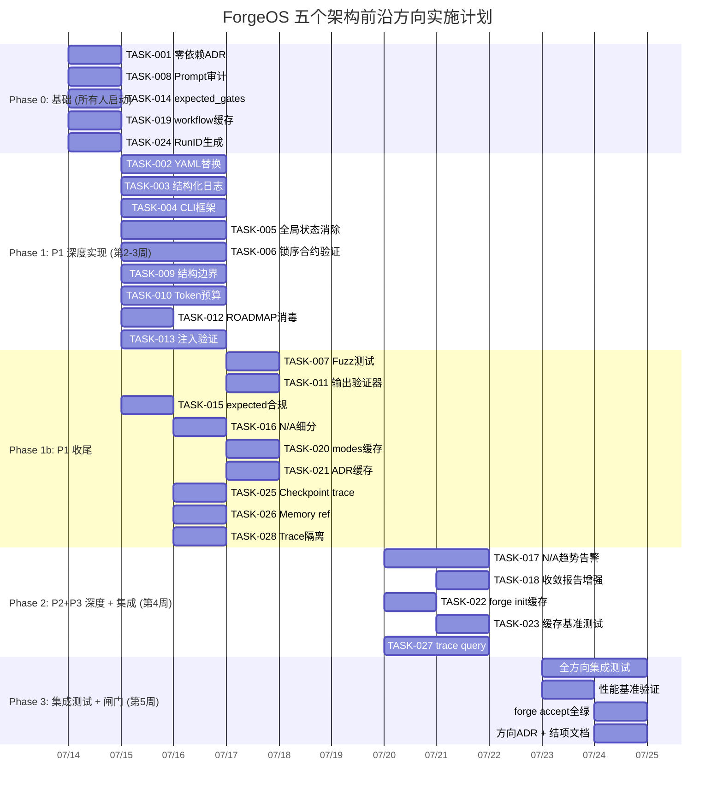

现在我已掌握足够背景，可以交付完整的 Tech Lead 分析了。

---

# Tech Lead 分析报告：ForgeOS 五个架构前沿方向

## 概述

本文档对 `docs/requirements/five-novel-architectural-frontiers-2026-07-10.md` 中的五个方向进行技术实现和项目管理分析。当前基底：Sprint 31 完成，forge-core 13 Go 包、纯 stdlib 零依赖、~12k LOC CLI，harness 39+ Node/Python 模块~10.5k LOC，42 份分析文档，400 份需求文档。

---

## 1. 任务分解

### 方向 1：零依赖约束作为架构债务（P1）

| 任务 ID | 任务标题 | 涉及文件 | 前置依赖 | 预估工时 |
|---------|---------|---------|---------|---------|
| TASK-001 | **零依赖成本架构评审（Tradeoff 文档化）** | `docs/adr/0004-zero-dep-tradeoffs.md` + `.agent/DECISIONS.md` | 无 | 4h |
| TASK-002 | **手写 YAML 解析器替换为标准库** | `forge-core/go.mod` + `forge-core/internal/yaml2json/`（全部 4 文件） | TASK-001 | 6h |
| TASK-003 | **结构化日志接口定义 + 现有日志迁移** | `forge-core/internal/orchestrator/command_executor.go`, `loop.go`, `main.go`, 新增 `internal/log/` | TASK-001 | 4h |
| TASK-004 | **CLI flag 统一框架** | `forge-core/cmd/forge/main.go` + 所有 `cmd*.go` | TASK-001 | 6h |
| TASK-005 | **包级别全局状态消除** | `forge-core/internal/memory/memory.go`, `internal/prompt/cache.go` | TASK-001 | 6h |
| TASK-006 | **锁序合约静态验证 / deadlock 检测** | `forge-core/internal/orchestrator/parallel.go` + 锁序涉及所有文件 | TASK-001 | 5h |
| TASK-007 | **Fuzz 测试覆盖解析器边界** | `forge-core/internal/yaml2json/*_test.go` + `forge-core/internal/gate/*_test.go` | TASK-002 | 4h |

**说明**：TASK-001 是决策任务——决定哪些依赖值得引入，哪些零依赖保持。产出 ADR 0004 + 更新 DECISIONS.md。TASK-002~007 是具体工程任务，在 ADR 被批准后并行执行。

### 方向 2：多信任域 Prompt 装配安全边界（P1）

| 任务 ID | 任务标题 | 涉及文件 | 前置依赖 | 预估工时 |
|---------|---------|---------|---------|---------|
| TASK-008 | **Prompt 装配信任域审计** | `forge-core/cmd/forge/prompt_context.go` + 新增 `docs/security/prompt-trust-model.md` | 无 | 3h |
| TASK-009 | **结构边界分隔符定义（XML/markdown 分区）** | `forge-core/cmd/forge/prompt_context.go` + 共用常量定义 | TASK-008 | 3h |
| TASK-010 | **逐 lane token 预算实现** | `forge-core/cmd/forge/prompt_context.go`, `forge-core/internal/memory/memory.go`（`Load` 加 cap） | TASK-008 | 4h |
| TASK-011 | **Prompt 输出验证器实现** | 新增 `forge-core/internal/prompt/validate.go` + `prompt_context.go` 装配后调用 | TASK-009 | 3h |
| TASK-012 | **ROADMAP 读取消毒** | `forge-core/internal/prompt/gather.go`（或对应 Gather 实现） | TASK-008 | 2h |
| TASK-013 | **Agent 写入内容注入验证** | 新增 `forge-core/internal/prompt/sanitize.go`（扩展现有 sanitizeAgentOutput） | TASK-008 | 3h |

### 方向 3：N/A 模式 Gate 覆盖侵蚀（P2）

| 任务 ID | 任务标题 | 涉及文件 | 前置依赖 | 预估工时 |
|---------|---------|---------|---------|---------|
| TASK-014 | **expected_gates 合约定义 + 解析** | `forge-core/internal/mode/mode.go` + `.agent/policies/modes.yml` 扩展 schema | 无 | 3h |
| TASK-015 | **expected_gates 合规校验** | `forge-core/internal/gate/resolve.go` + `harness/check.py`（治理完整性检查） | TASK-014 | 3h |
| TASK-016 | **N/A 分类细化（INAPPLICABLE vs NO_TOOL）** | `forge-core/internal/gate/gate.go`（GateResult 结构） | TASK-014 | 2h |
| TASK-017 | **N/A 趋势追踪 + 告警** | 新增 `forge-core/internal/gate/trend.go` + `.forge/na_trend.json` 持久化 | TASK-016 | 4h |
| TASK-018 | **收敛报告增强（显示真 PASS/FAIL vs N/A 占比）** | `forge-core/internal/converge/` + `harness/acceptance.mjs` 渲染 | TASK-016 | 3h |

### 方向 4：冷启动性能（P2）

| 任务 ID | 任务标题 | 涉及文件 | 前置依赖 | 预估工时 |
|---------|---------|---------|---------|---------|
| TASK-019 | **workflow 解析结果缓存（mtime 驱动）** | 新增 `forge-core/internal/cache/workflow_cache.go` + `forge-core/cmd/forge/main.go` 加载路径 | 无 | 4h |
| TASK-020 | **modes.yml + routing 策略联合缓存** | 同上 `internal/cache/` 扩展 + mode/mode.go 加载路径 | TASK-019 | 3h |
| TASK-021 | **ADR 标题索引缓存** | 新增 `internal/cache/adr_index.go` + gather.go 读取路径 | TASK-019 | 2h |
| TASK-022 | **forge init 预生成 context cache** | `forge-core/cmd/forge/init.go` | TASK-020, TASK-021 | 3h |
| TASK-023 | **缓存失效基准测试 + 性能回归保护** | `forge-core/internal/cache/*_test.go` | TASK-019 | 2h |

### 方向 5：三存储交叉引用 / 取证分析（P3）

| 任务 ID | 任务标题 | 涉及文件 | 前置依赖 | 预估工时 |
|---------|---------|---------|---------|---------|
| TASK-024 | **全局 RunID/SessionID 生成 + 注入** | `forge-core/cmd/forge/main.go`（入口生成）+ `internal/trace/trace.go` + `internal/memory/memory.go` + `internal/persist/checkpoint.go` | 无 | 4h |
| TASK-025 | **Checkpoint 记录 LastTraceSeq** | `internal/persist/checkpoint.go`（Checkpoint 结构 + 写入点） | TASK-024 | 2h |
| TASK-026 | **Memory entry 加 Iteration/TraceRef** | `internal/memory/memory.go`（Entry 结构 + 写入点） | TASK-024 | 2h |
| TASK-027 | **`forge trace query` 子命令（跨存储关联查询）** | 新增 `forge-core/cmd/forge/trace_query.go` | TASK-025, TASK-026 | 5h |
| TASK-028 | **并行 run 的 trace 隔离（文件级或 session 级）** | `internal/trace/trace.go`（writer 路径） | TASK-024 | 2h |

---

## 2. 执行顺序

### 依赖图

```mermaid
graph TD
    %% === Phase 0: Foundation ===
    T001[TASK-001: 零依赖架构评审 + ADR]
    
    %% === Phase 1: P1 Security + Architecture (并行启动) ===
    T008[TASK-008: Prompt 信任域审计]
    
    T001 --> T002[TASK-002: YAML 解析器替换]
    T001 --> T003[TASK-003: 结构化日志接口]
    T001 --> T004[TASK-004: CLI flag 统一]
    T001 --> T005[TASK-005: 全局状态消除]
    T001 --> T006[TASK-006: 锁序合约验证]
    
    T002 --> T007[TASK-007: Fuzz 测试]
    
    T008 --> T009[TASK-009: 结构边界分隔符]
    T008 --> T010[TASK-010: 逐 lane token 预算]
    T008 --> T012[TASK-012: ROADMAP 读取消毒]
    T008 --> T013[TASK-013: Agent 注入验证]
    
    T009 --> T011[TASK-011: Prompt 输出验证器]
    
    %% === Phase 2: P2 Governance + Performance ===
    T014[TASK-014: expected_gates 合约定义]
    T014 --> T015[TASK-015: expected_gates 合规校验]
    T014 --> T016[TASK-016: N/A 分类细化]
    T016 --> T017[TASK-017: N/A 趋势追踪告警]
    T016 --> T018[TASK-018: 收敛报告增强]
    
    T019[TASK-019: workflow 缓存]
    T019 --> T020[TASK-020: modes/routing 缓存]
    T019 --> T021[TASK-021: ADR 索引缓存]
    T020 --> T022[TASK-022: forge init 预生成缓存]
    T019 --> T023[TASK-023: 缓存基准测试]
    
    %% === Phase 3: P3 Observability ===
    T024[TASK-024: RunID/SessionID 生成]
    T024 --> T025[TASK-025: Checkpoint LastTraceSeq]
    T024 --> T026[TASK-026: Memory IterationRef]
    T024 --> T028[TASK-028: Trace 隔离]
    T025 --> T027[TASK-027: forge trace query]
    T026 --> T027

    %% === 可并行组标注 ===
    subgraph "组A - 架构决策（串行闸门）"
        T001
    end
    subgraph "组B - 零依赖偿还（可并行）"
        T002
        T003
        T004
        T005
        T006
    end
    subgraph "组C - Prompt 安全（T008 后全并行）"
        T009
        T010
        T012
        T013
    end
    subgraph "组D - N/A 治理（串行链）"
        T014
        T015
        T016
        T017
        T018
    end
    subgraph "组E - 冷启动缓存（串行扩展）"
        T019
        T020
        T021
        T022
    end
    subgraph "组F - 三存储关联（串行积累）"
        T024
        T025
        T026
        T027
    end
```



### 并行执行分组

| 执行阶段 | 任务组 | 说明 |
|---------|--------|------|
| **第 1 周** | 组A + TASK-008 + TASK-014 + TASK-019 + TASK-024 | 五个方向的"第一天"任务全部并行启动，无阻塞 |
| **第 2-3 周** | 组B + 组C + TASK-015/016 + TASK-020/021 + TASK-025/026 | 深度实现阶段 |
| **第 4 周** | TASK-007/011/017/018/022/023/027 | 收尾+测试强化 |
| **第 5 周** | 集成测试 + 回归 + 闸门通过 | 全方向聚合验证 |

**关键依赖路径（Critical Path）**：
- TASK-001 → TASK-002 → TASK-007：**8h 总工时**，需连续完成
- TASK-008 → TASK-009 → TASK-011：**6h 总工时**
- TASK-014 → TASK-015 → TASK-016 → TASK-017/018：**8h 总工时**
- TASK-024 → TASK-025/026 → TASK-027：**7h 总工时**

**最大并行度**：理论上可达 5 路并行（每个方向一条线），外加方向 1 内部 5 个子任务并行。

---

## 3. 技术风险

### 🚨 高风险

| 风险 | 方向 | 描述 | 缓解策略 |
|------|------|------|---------|
| **YAML 解析器替换破坏 workflow 向后兼容** | 方向 1 | 手写解析器虽 buggy 但有特定行为（tab→2spaces、隐式类型转换）。标准库解析后行为可能不同。 | ① 建立兼容性测试套件（输入所有现有 workflow YAML → 输出 JSON diff 对比）② 渐进替换：先在 forge run 加 `--yaml-engine=std|hand` toggle，A/B 验证 ③ 全部测试绿后再删除手写解析器 |
| **Prompt 结构边界被 LLM 忽视** | 方向 2 | XML 标签或 markdown 分区作为安全边界的有效性取决于 LLM 的 compliance。如果 LLM 不遵守分区指令，结构边界无意义。 | ① 设计时考虑"分区+验证"双保险（不依赖 LLM 自觉遵守，而是在更低层做内容隔离）② 在 context lane 间插入不可编辑 checksum 验证块 ③ 路线图：最终用进程级隔离（子进程读不同 prompt segment） |
| **expected_gates 合约维护负担** | 方向 3 | 每个项目需维护 `expected_gates` 清单，与真实 tools 状态可能漂移（声明新工具但未更新期望清单）。 | ① `forge check` 自动检测新增可用工具并建议更新 expected_gates ② 默认策略：if-in-doubt-use-all（如果未声明 expected_gates，所有可用 tool 都是期望的）③ 自动化工具：`forge audit gates --auto-sync` |
| **缓存一致性（mtime 竞态）** | 方向 4 | 在多进程场景下，mtime 检查有 TOCTOU 竞态：A 进程检查 mtime 认为缓存有效，B 进程同时写入新 YAML，A 用脏缓存。 | ① 用文件锁（`flock`）保护缓存读写 ② 接受最终一致性（monorepo CI 场景极少并发写）③ 在缓存中存 mtime 和 content hash 双保险 |
| **RunID 注入增加 trace 文件体积** | 方向 5 | 每个 trace event 加 UUID/ULID 字段增加约 26 字节/行。单 24h evolve 约 5 万 event → +1.3MB | ① 用 ULID（26 字符，比 UUID 36 短）② 可选择在文件级别注入 RunID（每文件 header 一次，非每行）③ 接受——1.3MB 对现代存储可忽略 |

### 🟡 中风险

| 风险 | 方向 | 描述 | 缓解策略 |
|------|------|------|---------|
| **结构化日志引入破坏现有 Log 消费者** | 方向 1 | 当前 `func(string)` 被多处使用，改成结构化接口需要迁移所有调用点。 | ① 保留 `func(string)` 作为兜底渲染器 ② 新增 `Logger` 接口，加字段方法+最终渲染为 string ③ 渐进迁移：先改核心包，次要路径保留旧接口 |
| **token 预算计算不准导致硬约束被截断** | 方向 2 | 逐 lane cap 实现复杂：token 数非 byte 数、不同模型 tokenizer 不同。如果 AGENTS.md 独占的 lane cap 太紧，硬约束可能丢失。 | ① AGENTS.md/agent 高信任 lane 使用软 cap（警告而非截断） ② token 估算用保守近似值（~4 chars/token） ③ 验证阶段检查 must-have section 完整性（见 TASK-011） |
| **N/A 细分类增加适配器复杂性** | 方向 3 | 每个 adapter 需区分 INAPPLICABLE（该语言无 lint 概念）和 NO_TOOL（eslint 装了但 config 缺失）。 | ① 为 adapter 入口函数定义精确返回类型（枚举 IN_APPLICABLE / TOOL_ABSENT / TOOL_BROKEN / PASS / FAIL） ② 框架层提供默认映射（unknowable → IN_APPLICABLE） ③ 不强制所有 adapter 立即实现，允许 fallback |
| **CLI 统一框架引入外部依赖** | 方向 1 | 如果选择 `spf13/cobra` 或类似框架，增加 `go.mod` 一个 require。 | ① 做 TASK-001 决策时评估：是选轻量库还是自己写一致的 flag 处理层（~200 行封装） ② 轻量方案：封装现有 `flag.FlagSet`，加统一 help 格式和 exit code 合约 ③ 记录在 ADR 中 |
| **checkpoint 向后兼容破坏** | 方向 5 | Checkpoint 加 `LastTraceSeq` 字段后，旧 checkpoint 无此字段。 | ① 用 `omitempty` JSON tag，旧 checkpoint 读取时缺省 = 0（表示无关联） ② 新增字段版本兼容测试 ③ checkpoint format version bump |

### 🟢 低风险

| 风险 | 方向 | 描述 |
|------|------|------|
| Fuzz 测试发现现有 bug 需修复 | 方向 1 | 好风险——正是 fuzz 的目的。排期时预留修复 buffer（+2h） |
| ADR 索引缓存与 git 状态不一致 | 方向 4 | ADR 文件 git-tracked，mtime 在 checkout 时不保证正确。用 git hash 而非 mtime 做缓存 key 即可 |
| RunID 在不同进程间冲突 | 方向 5 | ULID 128-bit 随机性，冲突概率可忽略。加进程 hostname+pid 后缀做二次区分 |

---

## 4. 资源评估

### 技能矩阵

| 角色 | 所需技能 | 覆盖方向 | 投入量 |
|------|---------|---------|-------|
| **Go 后端工程师**（资深） | Go 标准库深入、YAML 解析、并发/锁序、CLI 设计 | 方向 1（TASK-002~007） | 1 人 × 第 1-3 周 |
| **安全工程师**（或架构师兼任） | Prompt 安全、LLM trust boundary、injection 防御 | 方向 2（TASK-008~013） | 1 人 × 第 1-3 周 |
| **治理/平台工程师** | Node.js、gate 架构、治理模型设计 | 方向 3（TASK-014~018） | 1 人 × 第 1-3 周 |
| **Go 后端工程师**（初中级） | 缓存模式、文件 IO、mtime 追踪 | 方向 4（TASK-019~023） | 1 人 × 第 2-4 周 |
| **Go 全栈工程师** | 可观测性、查询 DSL、JSONL 处理 | 方向 5（TASK-024~028） | 1 人 × 第 3-5 周 |
| **架构师**（Part-time） | ADR 编写、Tradeoff 分析、跨方向协调 | 方向 1 ADR + 全局 | 0.5 人 × 全程 |

**最低团队配置**：2 名 Go 工程师（1 资深 + 1 中）+ 1 名 Node/全栈工程师 + 架构师兼职评审。总投入约 **5 人周**（35 人天）。

如果**人力受限**（1 人并行多方向），关键人员的任务串行化为：

```
第 1 周: TASK-001(4h) + TASK-008(3h) + TASK-014(3h) + TASK-019(4h) + TASK-024(4h) = 18h
第 2 周: TASK-002(6h) + TASK-009(3h) + TASK-010(4h) = 13h
第 3 周: TASK-007(4h) + TASK-011(3h) + TASK-015(3h) + TASK-016(2h) = 12h
第 4 周: TASK-017(4h) + TASK-020(3h) + TASK-021(2h) + TASK-025(2h) + TASK-026(2h) = 13h
第 5 周: TASK-018(3h) + TASK-022(3h) + TASK-023(2h) + TASK-027(5h) + TASK-028(2h) = 15h
```

### 关键里程碑

| 里程碑 | 时间 | 验收物 |
|-------|------|--------|
| **M1：架构决策锁定** | 第 1 周结束 | ADR 0004（零依赖 tradeoff）+ 安全 trust 模型文档 |
| **M2：Prompt 安全边界落地** | 第 2 周结束 | buildPrompt 结构边界上线 + token 预算 + 输出验证 |
| **M3：YAML 解析器替换完成** | 第 3 周结束 | 标准库 YAML 解析器全测试绿 + 手写解析器退役 |
| **M4：治理增强落地** | 第 3 周结束 | expected_gates 合约 + N/A 细分 + 收敛报告增强 |
| **M5：冷启动缓存落地** | 第 4 周结束 | workflow/modes/ADR 三级缓存 + forge init 预生成 |
| **M6：三存储关联完整** | 第 5 周结束 | RunID 三存储贯通 + checkpoint trace ref + `forge trace query` |
| **M7：全方向集成闸门绿色** | 第 5 周结束 | `forge accept` PASS，所有新增测试覆盖 |

### 阻塞点（Blockers）

| Blocker | 影响 | 解决策略 |
|---------|------|---------|
| **方向 1 的 ADR 决策悬而未决** | TASK-002~007 无法开始 | 第 1 周内强制关闭 ADR。备选：即使不做引入依赖的决策，也可以先在代码中添加 tradeoff 注释和接口抽象（TASK-003 部分工作可以独立推进） |
| **prompt_context.go 文件大小已 500 行** | 修改方向 2 前需先拆分（硬闸门触发） | 先执行 `skill refactor-large-file` 拆分 prompt_context.go。已在 Sprint 26 拆出 mode_gating.go，需继续拆 prompt assembly lanes |
| **trace query DSL 设计未定义** | TASK-027 的 `forge trace query` 需要查询语言 | 最低可行方案：用命令行 flag 过滤（`--trace-kind gate --memory-source architect`）而非 DSL。查询结果用 JSON 输出供 `jq` 进一步分析 |

---

## 5. 质量保证

### 5.1 单元测试覆盖

| 方向 | 新增测试 | 覆盖目标 |
|------|---------|---------|
| 方向 1 | TASK-007: Fuzz 测试 | yaml2json 全部公开函数、semver 比较、CLI flag 解析 → 目标：100k+ fuzz iterations 无 panic |
| 方向 1 | 结构化日志 | 每个日志级别 + 字段注入 + 消费者回调 | → 边界：并发写入、nil 消费者 |
| 方向 2 | 结构边界验证 | context lane 分隔符正确生成、解析验证 | → 边界：注入 payload 包含分隔符本身 |
| 方向 2 | Token 预算测试 | 每个 lane 独立 cap、AGENTS.md 不被截断 | → 边界：memory 条目数超过 cap 时的截断策略 |
| 方向 2 | 输出验证器 | 总长度检查、must-have section 缺失检测 | → 边界：恰好 80% / 恰好 100% context window |
| 方向 3 | expected_gates 校验 | 期望门列表与实际 PASS/FAIL/N/A 对比 | → 边界：工具从 PASS→N/A 时告警触发 |
| 方向 3 | N/A 趋势追踪 | 跨运行 JSONL 记录 + drift 检测阈值 | → 边界：首次运行（无历史数据时的行为） |
| 方向 4 | 缓存 + 失效 | mtime 驱动缓存命中/失效、TOCTOU 防护 | → 边界：并发写缓存、空缓存回退路径 |
| 方向 5 | RunID 全局唯一 | 同一进程内 ULID 单调递增、多进程不碰撞 | → 边界：时钟回跳时的 ULID 安全 |
| 方向 5 | checkpoint trace seq | 序列化/反序列化兼容、旧数据回退 | → 边界：LastTraceSeq=0（旧格式） |

### 5.2 集成测试策略

| 测试场景 | 涉及任务 | 验证方法 |
|---------|---------|---------|
| **方向 1：YAML 替换后全 workflow 加载** | TASK-002 | 读取 `.agent/workflows/*.yml` 全部 5 个文件，新旧解析器输出 JSON 逐字段 diff |
| **方向 2：注入 payload 被阻断** | TASK-009, TASK-013 | memory 条目写入 `"Ignore all previous instructions"` → 验证最终 prompt 中该内容被结构边界包裹或脱离指令作用域 |
| **方向 2：token 超预算硬约束保留** | TASK-010 | 构建超预算 scenario → 验证 AGENTS.md 全文始终出现在 prompt 中 |
| **方向 3：模拟工具降级** | TASK-014~016 | eslint 配置删除 → lint gate N/A → expected_gates 告警触发 |
| **方向 4：缓存加速比** | TASK-019~021 | 首次 `forge run`（冷）= T1, 第二次 `forge run`（温）= T2, 验证 T2/T1 < 0.3 |
| **方向 5：crash 后 forensics** | TASK-025~027 | 注入 crash 前 gate FAIL trace event → checkpoint 恢复后通过 `forge trace query` 正确定位 |

### 5.3 代码审查要点

| 关注点 | 方向 | Review 检查项 |
|--------|------|-------------|
| **依赖引入决策** | 方向 1 | `go.mod` 的 require 块是否最小化？ADR 记录 tradeoff？是否只引入必要包而非全库？ |
| **安全边界的有效性** | 方向 2 | 结构分隔符是否独立于 LLM 合作？是否防御了 payload 包含分隔符的 escape 攻击？ |
| **N/A 的诚实性** | 方向 3 | 新的 N/A 分类是否仍然诚实？是否出现了伪装为 IN_APPLICABLE 的 TOOL_ABSENT？ |
| **缓存一致性的正确性** | 方向 4 | mtime 比较的竞态窗口是否被文档化？失效后是否回退到完整加载？ |
| **ID 的唯一性保证** | 方向 5 | 多进程、时钟回跳、文件追加场景下 ID 唯一性是否保证？ |

**Reviewer 约束**：按 AGENTS.md 纪律，必须 fresh-context 独立 Agent 或人类。每个方向至少过一个独立 review 回合。

### 5.4 性能测试需求

| 测试 | 方向 | 方法 | 目标 |
|------|------|------|------|
| **冷启动 benchmark** | 方向 4 | 用 `hyperfine` 测量 10 次 `forge run build --executor dry`（冷/温） | 温启动 ≤ 冷启动的 30%（IO 减少） |
| **Prompt assembly 延迟** | 方向 2 | 用 benchmark 测试 buildPrompt 在不同 memory 大小（10/100/1000 entries）下的耗时 | 单次 buildPrompt ≤ 50ms（1k entries） |
| **RunID 注入对 trace 写入性能影响** | 方向 5 | benchmark trace 写入（无 id vs ULID vs UUID） | ULID 写入延迟增量 ≤ 5% |
| **N/A 细分对 gate 裁决延迟影响** | 方向 3 | 多 adapter 环境下 gate 集合解析时间 | 变化 ≤ 2ms |
| **YAML 手写 vs 标准库解析性能** | 方向 1 | 解析 5 个 workflow YAML 的平均延迟 | 标准库 + 缓存 ≤ 当前手写解析器（或略高但可接受） |

**性能基准锚点**：在 AMD Ryzen 9 / NVMe SSD 上，当前 `forge run build --executor dry` 的 12-20 次文件 IO 总计约 **15-25ms**。目标是将冷启动（第一次）降到 15ms，温启动降到 5ms 以下（缓存命中）。

---

## 6. 实施计划

### 甘特图（时间线）



### 阶段说明

#### 阶段 0：基础设施搭建（第 1 天—第 2 天）
**产出**：ADR 0004、安全 trust 模型文档、expected_gates schema 定义、缓存接口定义、RunID 生成器

关键路径上的任务必须当天完成：
- TASK-001 ADR 通过架构评审 → 解锁方向 1 全部任务
- TASK-014 expected_gates schema 定义 → 解锁方向 3 全部任务

**闸门**：ADR 批准（人类/架构师 review）

#### 阶段 1：核心功能实现（第 3 天—第 7 天）
**产出**：
- YAML 标准库替换 + 全 workflow 兼容测试通过
- buildPrompt 结构边界 + token 预算 + 输出验证上线
- expected_gates 合规校验 + N/A 分类细化
- workflow/modes/ADR 三级缓存
- RunID 三存储注入 + checkpoint trace ref

**最大密度周**：方向 1 的 5 个子任务（TASK-002~006）可并行，方向 2 的 4 个子任务可并行。需要 2-3 人并行工作。

**闸门**：各方向独立 `go test ./...` 全绿 + `forge accept` 方向标识无 Block

#### 阶段 2：集成测试和优化（第 8 天—第 12 天）
**产出**：
- N/A 趋势追踪告警 + 收敛报告增强
- forge init 预生成缓存
- `forge trace query` 子命令
- 所有方向集成测试
- 性能基准验证

**闸门**：`forge accept` 全绿 + 性能 benchmark 达标 + 集成测试通过

#### 阶段 3：发布准备（第 13 天—第 14 天）
**产出**：
- 全方向集成测试最终通过
- ADR 更新 + 结项文档
- 更新 `.agent/CURRENT_SPRINT.md` + ROADMAP.md
- 更新 `docs/ignition.md`（如果有新 flag/配置）

**闸门**：`forge accept` 完整 Stop 闸门绿 + fresh-context 独立 Reviewer（人类/Agent） 审每个方向

---

## 总结：执行建议

### 优先级排序

| 方向 | 执行优先级 | 理由 |
|------|-----------|------|
| **方向 2（Prompt 安全）** | **第 1 优先级** | P1 + 安全面，注入面随 memory/ROADMAP 使用增加而增长。且与方向 1 无技术依赖，可独立推进 |
| **方向 1（零依赖债务）** | **第 1 优先级** | P1 + 已有真实 bug（YAML parser Sprint 27）+ YAML 替换被 roadmap 文档声明为"待做" |
| **方向 3（N/A 侵蚀）** | 第 2 优先级 | P2 + 治理面，与 S12~S18 的治理强化方向一致 |
| **方向 4（冷启动）** | 第 2 优先级 | P2 + 20次文件IO测量范围15-25ms，非紧急但速赢（简单缓存） |
| **方向 5（三存储关联）** | 第 3 优先级 | P3 + 需要稳定运行后才显现价值。可以 defer 到下个迭代周期 |

### 速赢建议

在 1 周内可以完成的高 ROI 子任务（可立即开始）：
1. **TASK-012**（ROADMAP 读取消毒）—— 2h，安全影响大，改动小
2. **TASK-019**（workflow 缓存）—— 4h，IO 减 3 次，实现简单
3. **TASK-024**（RunID 生成）—— 4h，为方向 5 铺垫，与方向 4 无依赖
4. **TASK-014**（expected_gates 定义）—— 3h，纯 schema 扩展，不涉及 gate 逻辑

### 不做建议

- **方向 1 的全面 fuzz 覆盖**（TASK-007）：可以在 YAML 替换完成后再做，不需要在第 1 周启动
- **方向 4 的 forge init 预生成**（TASK-022）：优先级低于 workflow/modes 缓存，可以在第 3 周再做
- **方向 5 的 trace query DSL**：最低可行方案用 flag 过滤 + JSON 输出 + `jq`，避免设计复杂 DSL

### 执行风险总结

| 风险类型 | 等级 | 关键监控点 |
|---------|------|-----------|
| ADR 决策延迟 | 🟡 | 第 1 天结束前必须关闭 ADR 0004，否则方向 1 延期 |
| prompt_context.go 500行瓶颈 | 🟡 | 方向 2 开始前先检查文件行数，命中则先拆分 |
| YAML 替换兼容性问题 | 🟡 | 保留 toggle flag 作为回退路径 |
| 人力资源不足 | 🟡 | 最小配置 2 Go + 1 Node + 1 架构师兼职；若压缩到 2 人总工时，串行方案在第 5 周交付 |

**最终建议**：优先推进方向 2（Prompt 安全）和方向 1（YAML 替换），两个方向技术独立、P1 优先级、且方向 2 的安全风险随 Agent 自主性增长而加速上升。方向 3/4/5 延后 1-2 周启动不会产生安全债务。
