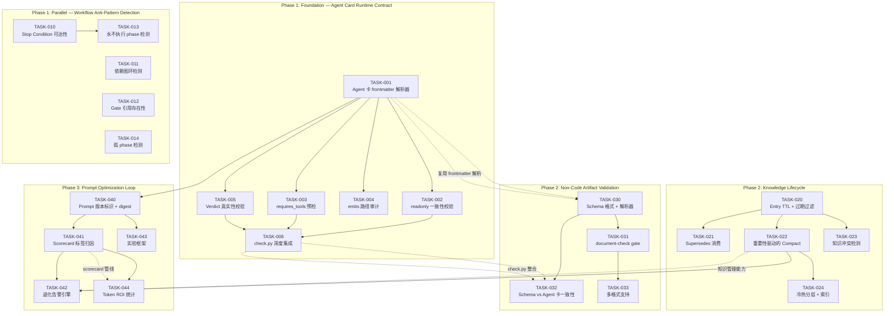

# Tech Lead 分析报告：ForgeOS 五个高价值扩展方向（V49）

---

## 0. 前置说明

本文分析基于 `docs/requirements/five-novel-extension-frontiers-v49.md` 以及代码库现状（forge-core Go 运行时 18 包 · ~35k LOC + harness 39+ 模块 · ~10.5k LOC + .agent/ 治理层）。**不重复文档中的代码级证据**，仅从工程实现和项目管理角度给出可操作的任务拆解、风险识别与实施计划。

---

## 1. 任务分解（TASK 清单）

每个任务 2–4 小时可完成。按「依赖先行、风险优先」原则排序。

### 方向②：Agent 卡行为契约的运行时履约验证（P1 — 推荐先启动）

| ID | 标题 | 涉及文件 | 前置 | 工时 |
|---|---|---|---|---|
| TASK-001 | Agent 卡 frontmatter 结构化解析器 | `forge-core/cmd/forge/prompt_context.go`（新增 `parseCardFrontmatter`）+ `internal/asset/agent_card.go`（新文件） | 无 | 3h |
| TASK-002 | readonly 声明一致性校验 | `forge-core/cmd/forge/engine_build.go`（phase 启动前检查点）+ `harness/check.py`（新增 `check_agent_workflow_readonly_consistency`） | TASK-001 | 2h |
| TASK-003 | requires_tools 可用性预检（`command -v` 桥） | `forge-core/cmd/forge/prompt_context.go`（`requiresToolsGuard` 前插 `toolProbe`）+ `internal/asset/agent_card.go` | TASK-001 | 3h |
| TASK-004 | emits 路径产出审计（git diff + fs scan） | `forge-core/cmd/forge/gates.go`（新增 `postPhaseEmitCheck` gate）+ `internal/asset/agent_card.go` | TASK-001 | 4h |
| TASK-005 | Verdict 内容真实性启发式交叉验证 | `forge-core/cmd/forge/gates.go`（新增 `verdictTruthCheck`）+ `forge-core/cmd/forge/detect_parsers.go`（扩展 verdict 提取） | TASK-001 | 3h |
| TASK-006 | check.py 集成：agent 卡引用深度检查 | `harness/check.py`（扩展 `check_workflow_agent_refs` 加入声明一致性） | TASK-001 | 2h |

### 方向⑤：工作流编排反模式静态检测（P2 — 最快见效，可并行启动）

| ID | 标题 | 涉及文件 | 前置 | 工时 |
|---|---|---|---|---|
| TASK-010 | Stop Condition 可达性分析 | `harness/check.py`（新增 `check_stop_condition_reachability`） | 无 | 3h |
| TASK-011 | 依赖图环检测（`detectCycle` 算法） | `forge-core/internal/orchestrator/waves.go`（Kahn 前插 DFS 环检）| 无 | 2h |
| TASK-012 | Gate 引用存在性校验 | `harness/check.py`（扩展 `check_workflow_control_flow` 检查 `required_gates`） | 无 | 2h |
| TASK-013 | 永不执行 phase 检测（mode×lifecycle 组合分析） | `harness/check.py`（新增 `check_unreachable_phase`）| TASK-010 | 3h |
| TASK-014 | 孤 phase 检测（产出不被消费） | `harness/check.py`（新增 `check_orphan_phase`）| 无 | 2h |

### 方向③：跨会话知识生命周期管理（P1 — 基础最好，可尽早启动）

| ID | 标题 | 涉及文件 | 前置 | 工时 |
|---|---|---|---|---|
| TASK-020 | Entry 扩展：`created_at` + `ttl_days` + 过期过滤 | `forge-core/internal/memory/memory.go`（扩展 Entry）+ `forge-core/cmd/forge/prompt_memory.go`（过滤过期） | 无 | 3h |
| TASK-021 | Supersedes 字段消费：知识淘汰/降权 | `forge-core/cmd/forge/prompt_memory.go`（召回时排除/降权 superseded）+ `forge-core/internal/memory/memory_compact.go`（压缩时优先淘汰） | TASK-020 | 3h |
| TASK-022 | 重要性驱动的 Compact 策略重构 | `forge-core/internal/memory/memory_compact.go`（两阶段：先保高 Confidence，再按量修剪） | TASK-020 | 4h |
| TASK-023 | 知识冲突检测（文本相似度 + topic 聚类） | `forge-core/internal/memory/memory.go`（新增 `DetectContradiction`）+ `forge-core/cmd/forge/prompt_memory.go`（注入冲突标注） | TASK-020 | 4h |
| TASK-024 | 冷热分层 + 按 topic 分片索引 | `forge-core/internal/memory/memory.go`（新增 `Hot/Cold` 分区 + `ShardByTopic`）+ `forge-core/cmd/forge/prompt_memory.go`（热注入/温检索/冷归档） | TASK-022 | 4h |

### 方向④：非代码产物的结构化验证框架（P2 — 需方向②基础）

| ID | 标题 | 涉及文件 | 前置 | 工时 |
|---|---|---|---|---|
| TASK-030 | 产出结构契约 schema 格式设计 + 解析器 | `.agent/schemas/prd.yaml`（新增示范 schema）+ `forge-core/internal/gate/schema_check.go`（新文件：schema 解析器） | TASK-001（复用 frontmatter 解析器） | 3h |
| TASK-031 | document-check gate 适配器 | `harness/adapters.mjs`（新增 `document-check` 适配器）+ `forge-core/cmd/forge/gates.go`（注册新 gate） | TASK-030 | 4h |
| TASK-032 | 结构契约 vs agent 卡散文一致性校验 | `harness/check.py`（新增 `check_schema_agent_consistency`） | TASK-030 | 2h |
| TASK-033 | 多格式支持（.md section check, .json JSON Schema, .yaml YAML Schema） | `forge-core/internal/gate/schema_check.go`（策略分发） | TASK-031 | 3h |

### 方向①：Prompt 有效性测量与优化闭环（P0 — 价值最高，依赖最多，放最后）

| ID | 标题 | 涉及文件 | 前置 | 工时 |
|---|---|---|---|---|
| TASK-040 | Prompt 版本标识 + frontmatter SHA-256 摘要 | `forge-core/cmd/forge/prompt_context.go`（扩展 `buildPrompt`）+ `forge-core/internal/prompt/prompt.go`（扩展 `Build` 签名 + 返回 digest） | TASK-001 | 3h |
| TASK-041 | Scorecard 标签归因（`prompt_digest` 字段 + 写入管线） | `forge-core/internal/routing/scorecard.go`（扩展 Scorecard）+ `harness/scorecard-update.mjs`（管线写入 digest） | TASK-040 | 2h |
| TASK-042 | prompt 质量退化告警引擎 | 新文件 `forge-core/cmd/forge/prompt_degradation.go` | TASK-041 + TASK-022 | 4h |
| TASK-043 | Workflow prompt_variant 试验框架 | `forge-core/cmd/forge/engine_build.go`（variant 解析）+ `forge-core/cmd/forge/prompt_context.go`（variant 选择逻辑） | TASK-040 | 4h |
| TASK-044 | Token ROI 统计 + context window 利用率仪表盘 | 新文件 `forge-core/cmd/forge/prompt_roi.go`（token 利用分析）+ `forge-core/cmd/forge/gates.go`（信号输出） | TASK-041 | 3h |

### 任务汇总

| 方向 | 任务数 | 总预估工时 | 并行性 |
|---|---|---|---|
| ② Agent 卡验证 | 6 | 17h | 中等（TASK-002/003/004/005 可部分并行） |
| ⑤ 工作流反模式 | 5 | 12h | 高（4 个独立检查可全并行） |
| ③ 知识生命周期 | 5 | 18h | 中低（链式依赖） |
| ④ 非代码产物验证 | 4 | 12h | 中（需等待 TASK-001/030） |
| ① Prompt 优化闭环 | 5 | 16h | 低（链式依赖，且依赖②③基础设施） |
| **总计** | **25** | **75h** | |

---

## 2. 执行顺序（任务依赖图）



### 可并行执行的任务组

| 并行组 | 任务 | 最佳分配方式 |
|---|---|---|
| **G1**（全并行） | TASK-010 / T011 / T012 / T014 | 4 人各认领一个检查 |
| **G2**（依赖 T001 后并行） | TASK-002 / T003 / T004 / T005 | 4 人各认领一个校验点 |
| **G3**（依赖 T020 后并行） | TASK-021 / T022 / T023 | 3 人各认领一个消费方向 |
| **G4**（依赖 T030 后并行） | TASK-031 / T032 | 2 人并行开发 |

---

## 3. 技术风险

### 3.1 高风险项

| 风险 | 涉及方向 | 严重度 | 描述 | 缓解策略 |
|---|---|---|---|---|
| **Agent 卡 frontmatter 格式不一致** | ②④ | 🔴 高 | 现有 12 个 agent 卡使用散文格式而非结构化 frontmatter（`**readonly**: true` 是 markdown 粗体渲染，不是 YAML frontmatter）。解析器需同时兼容两种格式 | 先设计双模式 parser：先尝试 YAML frontmatter（`---` 包裹块），回退到正则提取 `**key**` 模式。在 TASK-001 新增 `parseCardFrontmatter` 覆盖两种格式的单元测试 |
| **memory.jsonl 文件膨胀 + O(N) 扫描** | ③ | 🟠 中 | 当前 `Read` 扫描全部行。一个月 evolve 运行可能产生数万条 entry → 每次 prompt 构建都 O(N) 扫描 → 延迟累加 | TASK-024 冷热分层是必须的。在实施前加文件大小警戒线：当 `memory.jsonl > 10MB` 时触发告警。TASK-020 的 TTL 过滤在内存层面做（不缓解 IO），但 TASK-022 的 Compact 两阶段可大幅缩减 volume |
| **Stop Condition 可达性分析的误报** | ⑤ | 🟠 中 | metric 可能被 workflow 外系统赋值（如 `FileDelta` 从 git diff 计算），伪可达性分析会产生误报 | 在 `check.py` 中维护一个「外部信号白名单」列表，对这些信号跳过可达性检查。默认 warn 不 block，仅 `lifecycle: production` 下才 block |
| **Verdict 真实性交叉验证的启发式质量** | ② | 🟠 中 | 简单关键词比例启发式可能误判（如 reviewer 为了简洁写了「APPROVE」但细节是空的）→ 假阳性告警 | 采用多层启发式：level-1（关键词存在性检查）→ level-2（sentiment/text length ratio）→ level-3（LLM-as-judge 可选）。默认只 warn。具体阈值通过实测 20+ real review 输出标定 |
| **prompt digest 与 scorecard 归因的管线耦合** | ① | 🔴 高 | prompt digest 需要在 `prompt.Build` 输出时计算，但要写入 scorecard 需要在 `harness/scorecard-update.mjs` 中接收。跨进程（Go → Node）传递新字段需要数据契约变更 | `scorecards.json` schema 新增可选字段。先做 Go 端 digest 计算 + 写入 file，再更新 Node scorecard-update 管线。两阶段发布以降低风险 |

### 3.2 外部依赖分析

| 依赖 | 涉及任务 | 替代方案 |
|---|---|---|
| PyYAML（`check.py` 已有） | TASK-010/012/013/014 | 无（已内置，风险低） |
| `git diff`（产出路径审计） | TASK-004 | 非 git 工作目录降级为 fs scan |
| `command -v` 跨平台（requires_tools 预检） | TASK-003 | Windows 用 `where`；Go 的 `exec.LookPath` 原生跨平台 |
| 文本相似度库（冲突检测） | TASK-023 | 纯 Go 实现 Jaccard + TF-IDF（无外部依赖）。现有 `internal/prompt` 已有 BM25-lite，可复用 |

### 3.3 性能瓶颈

| 瓶颈 | 涉及任务 | 当前表现 | 优化策略 |
|---|---|---|---|
| `memory.Read` 全量扫描 | TASK-020/024 | O(N) | 冷热分层后热数据常驻内存，冷数据按需读取。首次实现无需索引，当 memory.jsonl > 50K 条目时再加分片索引 |
| `check.py` 多次 YAML 解析 | TASK-010/012/013/014 | 每次检查独立 load | 引入 `CachedYAMLLoader` 单次加载缓存结果，跨检查共享 |
| scorecard 管线写入频率 | TASK-041 | 每 phase 写一次 | digest 写入可 batch（每 workflow 写一次而非每 phase），降低 IO 压力 |

### 3.4 测试覆盖难点

| 难点 | 原因 | 策略 |
|---|---|---|
| 环检测测试（TASK-011） | 需要构造复杂的有环/无环依赖图 | 纯函数，单元测试覆盖：自环、2-node 环、3-node 环、多环、无环、有孤链 |
| 知识冲突检测测试（TASK-023） | 语义相似度测试需要精心构造正例/负例 | 用已知 assertion 的 pair（正：矛盾句、负：互补句）构建 fixture。初期用简单 Jaccard + 阈值，不追求完美 NLP |
| Prompt 优化闭环的端到端测试（TASK-042） | 需要 simulate degrade scenario | 用 mock scorecard 注入退化数据 + mock prompt context 验证告警触发。不依赖真实 LLM 调用 |

---

## 4. 资源评估

### 4.1 团队结构建议

| 角色 | 人数 | 核心职责 | 分配方向 |
|---|---|---|---|
| **Go 运行时工程师**（senior） | 1 | forge-core Go 包开发（内存/编排/prompt/asset） | 方向③主程，方向②④⑤ Go 侧 |
| **Go 运行时工程师**（mid） | 1 | forge-core Go 包开发（gate/converge/routing/scorecard） | 方向①主程，方向② gate 侧 |
| **全栈工程师**（Node + Python） | 1 | harness 适配器 + check.py + scorecard 管线 | 方向⑤主程，方向②④ Node/Python 侧 |
| **QA/测试工程师** | 1 | 集成测试 + 端到端测试 + 性能基准 | 覆盖所有方向 |

**建议最少团队规模：2 人（1 Go + 1 全栈）做 Phase 1，Phase 2/3 扩展到 3–4 人。**

### 4.2 关键里程碑

| 里程碑 | 时间 | 验收标准 |
|---|---|---|
| **M1: Foundation 就绪** | 第 1–2 周 | TASK-001（frontmatter 解析器）+ TASK-011（环检测）合并到 main。`check.py` 新增 `check_workflow_control_flow` 检查 `required_gates` 存在性。`forge check` 通过新增检查 |
| **M2: Agent 卡验证 MVP** | 第 3–4 周 | TASK-002/003/004/005 合并。`forge run` 在 phase 启动前做 `requires_tools` 预检 + `readonly` 一致性校验。产出路径审计在 post-phase 报告 warn |
| **M3: Workflow 反模式检测 MVP** | 第 3–4 周 | TASK-010/012/013/014 合并。`forge check` 检测 stop_condition 不可达、永不执行 phase、孤 phase |
| **M4: 知识生命周期 MVP** | 第 5–7 周 | TASK-020/021/022 合并。memory 按 TTL 过期过滤，Supersedes 生效，Compact 改为重要性驱动 |
| **M5: 非代码产物闸门 MVP** | 第 7–8 周 | TASK-030/031 合并。首个 `.agent/schemas/prd.yaml` schema 落地，`forge run` 在 PRD phase 后做 section 检查 |
| **M6: Prompt 优化闭环 MVP** | 第 9–12 周 | TASK-040/041/042/043 合并。prompt digest 归因到 scorecard，退化告警触发，`--prompt-experiment` 标志可用 |

### 4.3 阻塞点（Blockers）与解决策略

| Blocker | 影响 | 解决策略 |
|---|---|---|
| **Agent 卡 frontmatter 格式分歧** | 阻塞 TASK-002/003/004/005/006/030 等 8 个任务 | 决策：统一用 YAML frontmatter（`---` 包围块）作为标准格式。现有 12 个 agent 卡在 Phase 1 前一次性迁移。用 `scripts/migrate-agent-cards.sh` 自动化迁移 |
| **memory 格式与 Compact 策略 API 变更** | 阻塞 TASK-020/021/022/024 | 向后兼容：新字段 `created_at`/`ttl_days` 为 `omitempty`。旧 entry 加载时为 0 值，`ttl_days=0` 表示永不过期，不破坏已有数据 |
| **check.py 执行性能** | TASK-010/013 需要 mode×lifecycle 组合枚举（4×4=16） | 如果组合枚举超过 100ms，加 cache。实测前先做原型验证 |
| **scorecard-update.mjs 管线依赖** | TASK-041 需要 Node 端配合 | 先做 Go 端独立写 digest 文件，不阻塞 Node 端。Node 端更新作为独立子任务（2h） |

---

## 5. 质量保证

### 5.1 单元测试覆盖要求

| 任务 | 核心逻辑 | 测试目标 | 覆盖率目标 |
|---|---|---|---|
| TASK-001 | frontmatter 解析（YAML + 正则双模式） | 12 个现有 agent 卡 + 边界（无 frontmatter、空 frontmatter、畸形 frontmatter） | ≥90% |
| TASK-011 | `detectCycle` | 自环/2-node 环/3-node 环/无环/多环/孤链/空图 | 100%（纯函数） |
| TASK-020 | TTL 过期过滤 | 过期/未过期/ttl_days=0 永不过期/已损坏 CreatedAtUnix | ≥90% |
| TASK-021 | Supersedes 消费 | 被 supersedes（排除/降权）/supersedes 链/循环 supersedes（无限链防护） | ≥90% |
| TASK-022 | 重要性驱动 Compact | 高 Confidence 保留/低 Confidence 修剪/混合/空/全保留边界 | ≥85% |
| TASK-023 | 冲突检测 | 正例（矛盾句对）/负例（互补句对）/边界（完全重复/语义无关） | ≥85% |
| TASK-030 | schema 解析 | 合法 schema/非法 schema/缺失字段/递归嵌套 | ≥85% |
| TASK-040 | prompt digest 计算 | SHA-256 一致性/digest 不因顺序微调变化/碰撞防护 | ≥90% |
| TASK-041 | scorecard digest 归因 | 写入正确字段/旧 scorecard 向后兼容/缺失 digest 不崩溃 | ≥85% |
| TASK-042 | 退化告警引擎 | 统计显著下降触发/冷启动不误报/小样本降级/趋势上升不误报 | ≥90% |

### 5.2 集成测试策略

| 测试场景 | 涉及任务 | 测试方法 |
|---|---|---|
| agent 卡 frontmatter → workflow 一致性端到端 | TASK-001 → TASK-002 → engine_build.go | 构造一个 workflow 声明 `readonly: false` 但 agent 卡声明 `readonly: true` 的场景，验证 `forge run` 拒绝或告警 |
| requires_tools 预检阻断 | TASK-003 | 声明 `requires_tools: [nonexistent-tool]`，验证 phase 在起跑 LLM 调用前就 fail |
| memory TTL 跨会话过滤 | TASK-020 → prompt_memory.go | 注入一条 30 天前的 entry，验证 prompt 构建时不包含该条目 |
| stop_condition 不可达 | TASK-010 | 构造一个引用未出现 metric 的 workflow，验证 `forge check` 报告不可达 warning |
| prompt digest → scorecard 管线完整回归 | TASK-040 → TASK-041 | `forge run` 后检查 `scorecards.json` 中有 `prompt_digest` 字段 |
| 非代码产物 schema 闸门 | TASK-030 → TASK-031 | 产出不完整的 PRD → 验证 gate FAIL；产出完整的 PRD → 验证 gate PASS |

### 5.3 代码审查要点

| 审查主题 | 特别注意 |
|---|---|
| **frontmatter 解析器** | 不要 panic；所有解析路径返回错误而非静默默认值；拼写容错（大小写不敏感、下划线/空格 flex） |
| **检测逻辑误报率** | 所有告警默认 `warn` 而非 `block`。生产 lifecycle 下的 `block` 必须经 reviewer 确认 |
| **memory 数据兼容** | 新字段必须 `omitempty`。读旧文件不能中断。`Compact` 不能删除旧格式数据 |
| **跨进程数据契约** | Go→Node（scorecard）新字段必须在 schema 中标记为 `optional`。Node 端读旧版 JSON 不崩溃 |
| **check.py 性能** | 每个检查函数不超过 50 行（现有惯例）。YAML 加载必须缓存，不重复加载 |
| **waves.go 环检测** | 返回错误时必须是具体的「哪个 phase→哪个 phase 的环」。不能只报「有环」 |
| **告警信息可操作性** | 每一条告警/错误必须包含 actionable 的信息（文件路径 + 行号 + 建议修复） |

### 5.4 性能测试需求

| 场景 | 基准 | 目标 |
|---|---|---|
| check.py 检查 5 个 workflow 文件 | < 500ms | < 800ms（增长在可接受范围） |
| memory.Load 1000 条 entry | < 10ms | < 10ms（不变） |
| memory.Compact 1000 条 entry | < 50ms | < 200ms（新策略更复杂，上限放宽） |
| prompt digest 计算（每次 Build） | 微秒级 | < 1ms |
| phase 启动前预检开销（requires_tools + readonly） | 无 | < 50ms |
| schema 结构验证（100KB 大小的 PRD） | 无 | < 10ms |

---

## 6. 实施计划

### 阶段 1：基础设施搭建（第 1–2 周）

**目标**：完成 Agent 卡 frontmatter 解析器 + Workflow 反模式检测 MVP。

```
Week 1         Week 2
├──T001───────┤    Agent 卡 frontmatter 解析器
├──T011───────┤    依赖图环检测（waves.go）
├──T012───────┤    Gate 引用存在性校验（check.py）
├──T014───────┤    孤 phase 检测（check.py）
├──T010────┐   │    Stop Condition 可达性分析
            └───T013  永不执行 phase 检测
├──T020────┐   │    Entry TTL 扩展（启动知识生命周期）
            └───────  T021 Supersedes 消费（可在本周末并行启动）
```

**交付物**：
- `forge-core/internal/asset/agent_card.go`（新文件）：frontmatter 结构化类型 + 解析器
- `forge-core/internal/orchestrator/waves.go`：新增 `detectCycle` 函数
- `harness/check.py`：新增 4 个工作流检查函数
- 12 个 agent 卡迁移为标准 YAML frontmatter 格式
- 单元测试覆盖所有新代码

**闸门检查**：
```bash
node harness/acceptance.mjs   # forge accept 必须全通过
python3 harness/check.py .    # forge check 新增检查必须集成
go test ./forge-core/internal/orchestrator/... -v -run Cycle   # 环检测测试
```

### 阶段 2：核心功能实现（第 3–6 周）

**目标**：Agent 卡运行时验证 MVP + 知识生命周期 MVP。

```
Week 3         Week 4         Week 5         Week 6
├──T002───────┤               │               │   readonly 一致性校验
├──T003───────┤               │               │   requires_tools 预检
├──T004───────┤               │               │   emits 路径审计
├──T005───────┤               │               │   Verdict 真实性校验
├──T006───────────────┤       │               │   check.py 深度集成
├──T021───────────────┤       │               │   Supersedes 消费
│               ├──T022───────────────┤       │   重要性驱动的 Compact
│               ├──T023───────────────┤       │   知识冲突检测
│               │               ├──T024───────┤   冷热分层 + 索引
```

**交付物**：
- `forge-core/cmd/forge/engine_build.go`：phase 启动前 3 个检查点
- `forge-core/cmd/forge/gates.go`：post-phase 审计 gate
- `forge-core/internal/memory/memory_compact.go`：重写的两阶段 Compact
- `forge-core/internal/memory/memory.go`：冲突检测 + 冷热分区
- `forge-core/cmd/forge/prompt_memory.go`：Supersedes 感知的召回 + 冲突标注注入
- 集成测试覆盖所有端到端场景

**闸门检查**：
```bash
# Agent 卡验证
go test ./forge-core/cmd/forge/... -v -run TestAgentCard -count=1

# 知识生命周期
go test ./forge-core/internal/memory/... -v -run "TestCompact|TestSupersedes|TestContradiction" -count=1

# 整体回归
node harness/acceptance.mjs
```

### 阶段 3：非代码产物验证 + Prompt 优化闭环（第 7–12 周）

**目标**：非代码产物闸门 MVP + Prompt 优化闭环 MVP。

```
Week 7         Week 8         Week 9         Week 10        Week 11        Week 12
├──T030───────┤               │               │               │               │   Schema 格式 + 解析器
│   ├──T031───────────────┤   │               │               │               │   document-check gate
│   ├──T032───────────────┤   │               │               │               │   Schema vs Agent 卡一致性
│   │               ├──T033───────┤           │               │               │   多格式支持
│   │               │   ├──T040───────────────┤               │               │   Prompt 版本标识 + digest
│   │               │   │   ├──T041───────────────┤           │               │   Scorecard 标签归因
│   │               │   │   │   ├──T042───────────────────┤   │               │   退化告警引擎
│   │               │   │   │   │               ├──T043───────────────┤       │   实验框架
│   │               │   │   │   │               │   ├──T044───────────────┤   │   Token ROI 统计
```

**交付物**：
- `.agent/schemas/prd.yaml`：第一个非代码产物 schema（示范文件）
- `harness/adapters.mjs`：`document-check` 适配器
- `forge-core/internal/gate/schema_check.go`：schema 解析 + 验证引擎
- `forge-core/cmd/forge/prompt_degradation.go`：退化告警引擎
- `forge-core/cmd/forge/prompt_roi.go`：token ROI 统计
- `forge-core/cmd/forge/engine_build.go`：prompt_variant 支持
- 所有方向的端到端集成测试

**闸门检查**：
```bash
# 非代码产物验证
go test ./forge-core/internal/gate/... -v -run TestSchemaCheck -count=1

# Prompt 闭环
go test ./forge-core/cmd/forge/... -v -run "TestPromptDigest|TestDegradation|TestROI" -count=1

# 完整回归
node harness/acceptance.mjs
python3 harness/check.py .
```

### 阶段 4：发布准备（第 13 周）

**目标**：稳定性提升 + 文档 + 性能 baseline。

| 活动 | 工时 | 说明 |
|---|---|---|
| 性能基准测试（memory 10K entry / check.py 全量 / 环检测 100-node） | 8h | 建立回归基线，记入 `docs/performance/` |
| 边界情况巡检：agent 卡旧格式兼容 / memory 空文件 / workflow 缺失字段 | 4h | 确保所有旧数据向前兼容 |
| 文档更新：`docs/requirements/` 新增实施记录 / ADR 更新 | 4h | 记录架构决策和实现思路 |
| 闸门全量跑通 + CI pipeline 集成 | 4h | 确保 `.github/workflows/forge.yml` 包含新 gate |
| 团队复盘 + 技术债记录 | 4h | 记录 Phase 1–3 中发现的改进点 |

---

## 7. 最终建议

### 执行优先级

```
Phase 1 (Week 1-2):    方向⑤ + TASK-001
                       理由：最快见效、零依赖、低风险

Phase 1a (Week 3-4):   方向②（Agent 卡验证）
                       理由：地基性工作，后面方向④依赖

Phase 2 (Week 5-7):    方向③（知识生命周期）
                       理由：基础最好（字段已埋好），中等风险

Phase 2a (Week 7-8):   方向④（非代码产物验证）
                       理由：依赖方向②的 frontmatter 基础设施

Phase 3 (Week 9-12):   方向①（Prompt 优化闭环）
                       理由：价值最高但依赖最多，放在最后
```

### 最关键的三个决策

1. **Agent 卡 frontmatter 格式统一**（影响 TASK-001→TASK-006→TASK-030 八项任务）：
   - 建议立即启动一次性 migration：12 个现有 agent 卡全部转为标准 YAML frontmatter
   - 双模式解析器（YAML + 正则回退）确保 Old agent 卡不被破坏

2. **memory 向后兼容契约**（影响 TASK-020→TASK-024 五项任务）：
   - 全部新字段加 `omitempty`；`ttl_days=0` 语义为「永不过期」；旧文件 0 值按永不过期处理
   - 避免「先迁移数据再升级代码」的两步操作

3. **告警默认 warn 而非 block**（影响所有检测逻辑）：
   - 新引入的反模式/契约校验全部默认 warn 级别
   - 仅 `lifecycle: production` + workflow 显式 `enforce: true` 时才 block
   - 减少误报对现有用户的冲击，渐进式采纳

### 技术债注意事项

- **双模式 frontmatter 解析器**（YAML + 正则）应在 Phase 1 末尾清理：如果所有 agent 卡已完成迁移，移除正则回退路径，简化维护负担
- **memory 冷热分层的索引设计**不要在 Phase 2 过度设计：初期 `hot = last 32 entries` 简单规则即可，索引优化留到 memory.jsonl > 50K 条目时再处理
- **check.py 函数数量增长**：Phase 1 会从 ~15 个检查函数增长到 ~25 个。建议 Phase 1 末尾做一次 runner 重构（按 check 类别分组、并行执行），避免单文件膨胀超过 500 行

---

*本分析基于 V49 文档 + 代码库扫描。所有任务预估为本人工时（单人专注开发），团队开发时根据并行度可压缩至 50–60% 日历时间。*
