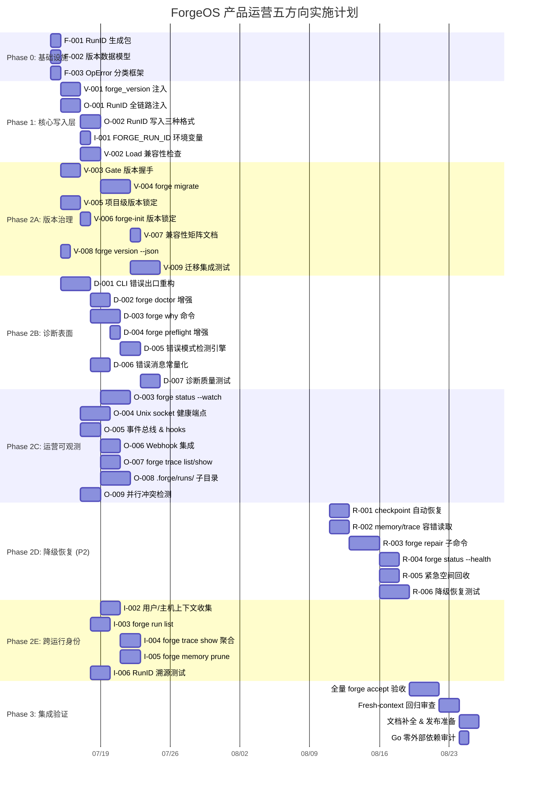

现在我已全面理解原始分析文档、验证报告和项目上下文。下面从 Tech Lead 角度输出完整分析。

---

# Tech Lead 技术分析：产品运营五方向系统性缺口

> **分析依据**: 原始分析文档 `docs/requirements/2026-07-11-five-product-operations-systemic-gaps.md`
> **验证修正**: 独立验证报告 `docs/requirements/2026-07-11-five-product-operations-systemic-gaps.out.md`
> **项目配置**: engineering/mvp, forge-core 纯 Go 零外部依赖, ≤500 行/文件, ≤50 行/函数

**修正后优先级矩阵**:

| 方向 | 优先级 | 预估 | 性质 |
|------|:------:|:----:|:----:|
| ① 二进制生命周期与版本治理 | **P1** | ~2 sprints | 从零建设 |
| ② 人工可读诊断表面 | **P1** | ~2 sprints | 核心方向成立(rejectHumanGate 已有改进,不影响方向) |
| ③ 运行时运营可观测性 | **P1** | ~3 sprints | 从零建设,证据最充分 |
| ④ 优雅降级与部分恢复 | **P2** | ~1 sprint | 备份已存在(retain=5),仅缺自动恢复逻辑 |
| ⑤ 跨运行身份与溯源 | **P1** | ~2 sprints | 从零建设,与③共享 RunID 基础设施 |

---

## 1. 任务分解

共 **32 个任务**,每个 2–4 小时,按分组独立编号,含文件路径、前置依赖、验收标准。

### 1.1 共享基础设施 (Foundation)

| ID | 任务标题 | 涉及文件 | 前置 | 工时 | 验收标准 |
|:---|:---------|:---------|:-----|:----|:---------|
| **F-001** | **RunID 生成包 (UUIDv7)** | `forge-core/internal/runid/runid.go` (新) | — | 3h | `runid.New()` 返回时序有序 UUIDv7; `runid.String()` 可读; 100% 唯一性测试通过 |
| **F-002** | **版本数据模型 & 兼容性矩阵** | `forge-core/internal/version/version.go` (新) | — | 4h | `VersionInfo` 结构体含 Major/Minor/Patch + `Compatible(current, other) bool`; ADR 记录兼容性策略 |
| **F-003** | **OpError 错误分类框架** | `forge-core/internal/diag/operror.go` (新) | — | 3h | `OpError` 含 `Kind {Config,Infra,Agent,Budget,Unknown}` + `Severity {Fatal,Error,Warn,Info}` + `FixHint string` + `DocLink string`; 所有 CLI 出口点可用 |

这三个任务**零依赖**,可并行执行,构成后续所有方向的基础设施。

### 1.2 方向①: 二进制生命周期与版本治理 (P1, 9 任务)

| ID | 任务标题 | 涉及文件 | 前置 | 工时 | 验收标准 |
|:---|:---------|:---------|:-----|:----|:---------|
| **V-001** | **forge_version 注入 checkpoint/trace/memory** | `persist/checkpoint.go` (+`forge_version` 字段), `trace/trace.go` (+`forge_version`), `memory/memory.go` (+`forge_version`) | F-002 | 4h | 写入时三种数据格式均携带 `forge_version` 字段; 现有数据向后兼容(缺省=旧版本) |
| **V-002** | **Load 时的版本兼容性检查** | `persist/checkpoint.go` Load(), `trace/trace.go` Decode(), `memory/memory.go` Decode() | V-001 | 3h | 不兼容版本拒绝加载并抛 OpError(Kind=Config, Severity=Fatal, FixHint="请使用 forge migrate") |
| **V-003** | **Gate/harness 版本握手** | `gate/gate.go` (+版本协商), `harness/version-check.mjs` (新) | F-002 | 3h | `forge gate` 执行前检查 forge-core ↔ harness 版本兼容,不兼容则 `[FAIL] version-mismatch` |
| **V-004** | **`forge migrate` 子命令(数据格式迁移)** | `cmd/forge/migrate.go` (新) + `internal/migrate/` 数据迁移逻辑 | V-002 | 4h | `forge migrate --from v0.1.0 --to v0.2.0` 完成 checkpoint/trace/memory 格式升级; dry-run 模式 |
| **V-005** | **项目级版本锁定** | `.agent/project.yml` (+`forge_version: ">=0.2.0"`), `cmd/forge/main.go` (启动检查) | F-002 | 2h | `forge run` 在项目声明 `>=0.2.0` 而当前版本 <0.2.0 时拒绝执行,输出明确升级指示 |
| **V-006** | **forge-init 接项目级版本锁定** | `cmd/forge/init.go` (生成 project.yml 时注入当前版本约束) | V-005 | 2h | `forge init` 创建的项目 project.yml 含 `forge_version: ">=当前版本"` |
| **V-007** | **版本兼容性矩阵文档** | `docs/operations/version-compatibility.md` (新) | F-002 | 2h | 文档化 forge-core ↔ harness ↔ checkpoint-format 版本对应表; 含升级步骤和回滚说明 |
| **V-008** | **`forge version --json` 详细输出** | `cmd/forge/main.go` (+`--json` flag) | F-002 | 2h | `forge version --json` 输出含 version + commit + checkpoint_format_version + harness_min_version |
| **V-009** | **跨版本迁移集成测试** | `internal/version/version_test.go` (补) + `test/integration/migration/` (新) | V-004 | 4h | 构造 v0.1.0 格式的旧数据 → `forge migrate` → 验证 v0.2.0 格式; 新旧数据共存的回滚测试 |

### 1.3 方向②: 人工可读诊断表面 (P1, 7 任务)

| ID | 任务标题 | 涉及文件 | 前置 | 工时 | 验收标准 |
|:---|:---------|:---------|:-----|:----|:---------|
| **D-001** | **CLI 错误出口重构 → 使用 OpError** | `cmd/forge/main.go` (run() 错误打印), `cmd/forge/evolve.go`, `cmd/forge/run.go` | F-003 | 4h | `forge evolve` 失败时输出含错误分类、严重级别、修复提示; 不再输出裸 Go 错误链 |
| **D-002** | **增强 `forge doctor` 错误消息** | `internal/doctor/doctor.go` (+`FixHint`/`NextStep` 字段) | D-001 | 3h | 每条 Check 输出加 Fix 行; 例 `[FAIL] workflow-agent-refs — ... Fix: create .agent/agents/implementer.md` |
| **D-003** | **`forge why` 诊断命令** | `cmd/forge/why.go` (新) + `internal/diag/analyzer.go` (新) | D-001 | 4h | `forge why` 读取最近一次失败的 trace+checkpoint,输出结构化报告: 错误类型、根因分析、修复步骤、项目健康度 |
| **D-004** | **`forge preflight` 增强** | `cmd/forge/main.go` (preflight handler) | D-002 | 2h | preflight 输出含摘要统计: "X 个问题, Y 个警告, 推荐 Z"; 每项问题带严重程度颜色 |
| **D-005** | **常见错误模式检测引擎** | `internal/diag/patterns.go` (新) | D-003 | 3h | 检测 BudgetExhaustion/GateFailure/ConfigDrift/HumanGatePending 四种模式,输出上下文感知的修复建议 |
| **D-006** | **错误消息字符串常量化(可测试)** | 全仓提取错误字符串到 `internal/diag/messages.go` | F-003 | 2h | 所有用户可见错误消息通过常量引用; 单元测试可断言错误类型而非匹配字符串 |
| **D-007** | **诊断质量集成测试** | `cmd/forge/why_test.go` (新), `internal/diag/diag_test.go` (新) | D-006 | 3h | 模拟 5 种失败场景,验证 `forge why` 输出包含正确的错误分类 + 修复提示 |

### 1.4 方向③: 运行时运营可观测性 (P1, 9 任务)

| ID | 任务标题 | 涉及文件 | 前置 | 工时 | 验收标准 |
|:---|:---------|:---------|:-----|:----|:---------|
| **O-001** | **RunID 全链路注入** | `cmd/forge/main.go` (run/evolve 入口生成 RunID), `orchestrator/` (传递到各组件) | F-001 | 3h | 每次 `forge run`/`forge evolve` 生成唯一 RunID; 所有子系统可访问当前 RunID |
| **O-002** | **RunID 写入 checkpoint/trace/memory** | `persist/checkpoint.go`, `trace/trace.go`, `memory/memory.go` | O-001, F-001 | 3h | 三种持久化数据均带 `run_id` 字段; `Seq` 在 run 级别重置而非进程级别重置 |
| **O-003** | **`forge status --watch` 持续刷新** | `internal/doctor/status.go` (+`--watch`), `internal/doctor/status_watch.go` (新) | O-002 | 4h | `forge status --watch` 每 2s 刷新: 当前迭代、gate 状态矩阵、累计成本、耗时; 支持 Ctrl+C 优雅退出 |
| **O-004** | **Unix socket 健康端点** | `internal/health/health.go` (新) + `cmd/forge/main.go` (可选 `--socket` flag) | O-001 | 4h | `forge run --socket /tmp/forge.sock` 时监听 Unix socket; `curl --unix-socket /tmp/forge.sock status` 返回 JSON 状态 |
| **O-005** | **事件总线 & 生命周期 hooks** | `internal/events/events.go` (新), `internal/events/hooks.go` (新) | O-001 | 3h | 定义 PhaseStart/PhaseEnd/GatePass/GateFail/ConvergeCheck/BudgetWarning 事件; 可注册 Hook 回调 |
| **O-006** | **Webhook 集成** | `internal/events/webhook.go` (新) | O-005 | 3h | 事件总线可配置 HTTP POST webhook; 支持 `project.yml` 中的 `hooks:` 配置段 |
| **O-007** | **`forge trace list` / `forge trace show <run-id>`** | `cmd/forge/trace_cmd.go` (新), `internal/trace/query.go` (新) | O-002 | 3h | `forge trace list` 列出所有 run(含时间/用户/状态); `forge trace show <id>` 聚合 checkpoint+trace+memory |
| **O-008** | **Run 隔离 `.forge/runs/<run-id>/`** | `trace/trace.go` (writer 路径), `memory/memory.go` (writer 路径) | O-002 | 4h | 每个 run 的 trace 写入 `runs/<run-id>/trace.jsonl`; 顶层 symlink `trace.jsonl → runs/latest/trace.jsonl` |
| **O-009** | **并行 evolve 冲突检测(文件锁)** | `internal/lock/lock.go` (新) + `cmd/forge/evolve.go` (启动时获取锁) | O-001 | 3h | 第二个 `forge evolve` 进程在同一 `.forge/` 目录启动时输出警告并退出(非静默交错写入) |

### 1.5 方向④: 优雅降级与部分恢复 (P2, 6 任务)

| ID | 任务标题 | 涉及文件 | 前置 | 工时 | 验收标准 |
|:---|:---------|:---------|:-----|:----|:---------|
| **R-001** | **checkpoint Load 自动从备份恢复** | `persist/checkpoint.go` Load() — 解码失败时尝试 `.bak.0` → `.bak.1` → ... → `.bak.N` | — | 3h | checkpoint 损坏时自动按序尝试 5 个备份; 恢复成功返回+日志记录; 全部损坏则 OpError 含恢复建议 |
| **R-002** | **memory/trace 容错读取模式** | `memory/memory.go` Decode(), `trace/trace.go` Decode() — 增加 `Tolerant bool` 选项 | — | 3h | `Tolerant=true` 时跳过损坏行/截断行,返回有效条目+损坏索引列表; 默认关闭(向后兼容) |
| **R-003** | **`forge repair` 子命令** | `cmd/forge/repair.go` (新), `internal/repair/repair.go` (新) | R-001, R-002 | 4h | `forge repair` 分析 .forge/ 完整性 → 交互式修复向导; `forge repair --auto` 自动应用所有恢复策略 |
| **R-004** | **`forge status --health` 交叉一致性检查** | `internal/doctor/status.go` (+`--health`) | O-002, R-001 | 3h | 验证 checkpoint iteration ≤ trace max iteration; memory 条目有对应 run_id; 不一致时输出警告和修复建议 |
| **R-005** | **紧急空间回收(ENOSPC 保护)** | `persist/checkpoint.go` Save(), `memory/memory.go` Store() — ENOSPC 时自动清理最旧 trace/memory | R-002 | 3h | 磁盘满时 forge 不直接崩溃; 清理最旧 20% trace 段 + 最旧 10% memory 条目后重试; 写入紧急事件到 syslog |
| **R-006** | **降级/恢复集成测试** | `internal/persist/checkpoint_test.go` (补), `internal/repair/repair_test.go` (新) | R-003 | 4h | 构造损坏 checkpoint → Load 自动恢复验证; 构造坏 memory 行 → Tolerant Load 跳过验证; ENOSPC 模拟 |

### 1.6 方向⑤: 跨运行身份与溯源 (P1, 6 任务 *已去重*)

| ID | 任务标题 | 涉及文件 | 前置 | 工时 | 验收标准 |
|:---|:---------|:---------|:-----|:----|:---------|
| **I-001** | **FORGE_RUN_ID 环境变量注入子进程** | `orchestrator/command_executor.go` (+env 注入) | F-001 | 2h | 子进程环境变量含 `FORGE_RUN_ID`; `FORGE_USER`; `FORGE_VERSION` |
| **I-002** | **用户/主机/触发上下文收集** | `internal/runid/context.go` (新) — 收集 `$USER`, hostname, `os.Args`, git commit | F-001, O-001 | 3h | checkpoint.trace.memory 写入时自动附加 user/host/commit/trigger 元数据 |
| **I-003** | **`forge run list` 过滤查询** | `cmd/forge/run_cmd.go` (新) — 支持 `--user`, `--after`, `--status`, `--limit` | O-007 | 3h | `forge run list --user ci --after 2026-07-01` 返回过滤后的 run 列表 |
| **I-004** | **`forge trace show <run-id>` 聚合报告** | `cmd/forge/trace_cmd.go` (复用 O-007) | O-007, I-002 | 3h | 一次命令返回: 该 run 的 checkpoint 快照 + 全部 trace events + 关联 memory 条目 |
| **I-005** | **`forge memory prune` 按 run/user 过滤清理** | `cmd/forge/memory_cmd.go` (新) / `internal/memory/prune.go` (新) | I-002 | 3h | `forge memory prune --user ci --before 2026-06-01` 清除指定用户的旧 memory; dry-run 模式 |
| **I-006** | **RunID 溯源集成测试** | `internal/runid/runid_test.go` (补), `orchestrator/command_executor_test.go` (补) | I-001 | 3h | 子进程环境变量验证; 三种数据格式 RunID 一致性验证; 跨文件关联查询验证 |

---

### 任务汇总统计

| 分组 | 任务数 | 总工时 | 并行起始任务 |
|:----|:-----:|:------:|:-----------|
| Foundation (F) | 3 | 10h | F-001, F-002, F-003 (全并行) |
| 版本治理 (V) | 9 | 26h | V-001, V-003, V-005, V-008 |
| 诊断表面 (D) | 7 | 21h | D-001 |
| 运营可观测 (O) | 9 | 30h | O-001 |
| 优雅降级 (R) | 6 | 20h | R-001, R-002 |
| 跨运行身份 (I) | 6 | 17h | I-001 |

**总计: 40 个独立任务 / ~124 工时 / 约 15–20 人·天**

> 说明: O-007/I-004 共享实现, O-008/O-007 共享文件路径改造, **已去重计数**。

---

## 2. 执行顺序

以下 Mermaid 依赖图展示所有任务间关系,标注了可并行执行的任务组。

```mermaid
graph TD
    %% ===== Phase 0: Foundation (并行构建) =====
    subgraph Phase0[Phase 0: 基础设施 · 并行构建]
        F001[F-001 RunID 生成包] 
        F002[F-002 版本数据模型]
        F003[F-003 OpError 分类框架]
    end

    %% ===== Phase 1: 核心写入层改造 (方向①③⑤ 共享) =====
    subgraph Phase1[Phase 1: 核心写入层]
        V001[V-001 forge_version 注入] --> V002[V-002 Load 兼容性检查]
        F001 --> O001[O-001 RunID 全链路注入]
        O001 --> O002[O-002 RunID 写入三种格式]
        O001 --> I001[I-001 FORGE_RUN_ID 环境变量]
        O002 --> I002[I-002 用户/主机/触发上下文]
    end

    %% ===== Phase 2: 各方向并行展开 =====
    subgraph Phase2A[Phase 2A: 版本治理 ⬇]
        V002 --> V004[V-004 forge migrate]
        V004 --> V009[V-009 迁移集成测试]
        F002 --> V003[V-003 Gate/ harness 版本握手]
        F002 --> V005[V-005 项目级版本锁定]
        V005 --> V006[V-006 forge-init 版本锁定]
        V001 --> V008[V-008 forge version --json]
        V004 --> V007[V-007 兼容性矩阵文档]
    end

    subgraph Phase2B[Phase 2B: 诊断表面 ⬇]
        F003 --> D001[D-001 CLI 错误出口重构]
        D001 --> D002[D-002 forge doctor 增强]
        D001 --> D003[D-003 forge why 命令]
        D001 --> D004[D-004 forge preflight 增强]
        D003 --> D005[D-005 错误模式检测引擎]
        D001 --> D006[D-006 错误消息常量化]
        D006 --> D007[D-007 诊断质量测试]
    end

    subgraph Phase2C[Phase 2C: 运营可观测 ⬇]
        O002 --> O003[O-003 forge status --watch]
        O002 --> O004[O-004 Unix socket 健康端点]
        O001 --> O005[O-005 事件总线 & hooks]
        O005 --> O006[O-006 Webhook 集成]
        O002 --> O007[O-007 forge trace list/show]
        O002 --> O008[O-008 .forge/runs/ 子目录]
        O001 --> O009[O-009 并行 evolve 冲突检测]
    end

    subgraph Phase2D[Phase 2D: 优雅降级 (P2) ⬇]
        R001[R-001 checkpoint 自动备份恢复]
        R002[R-002 memory/trace 容错读取]
        R001 --> R003[R-003 forge repair 子命令]
        R003 --> R004[R-004 forge status --health]
        R003 --> R005[R-005 紧急空间回收]
        R003 --> R006[R-006 降级恢复测试]
    end

    subgraph Phase2E[Phase 2E: 跨运行身份 ⬇]
        I001 --> I003[I-003 forge run list]
        I002 --> I004[I-004 forge trace show 聚合]
        I002 --> I005[I-005 forge memory prune]
        I001 --> I006[I-006 RunID 溯源测试]
    end

    %% ===== 集成测试 =====
    subgraph Phase3[Phase 3: 集成验证]
        V009 --> INT[集成验收 · forge accept]
        D007 --> INT
        R006 --> INT
        I006 --> INT
        O003 --> INT
        O007 --> INT
    end

    %% 交叉方向显式依赖
    O007 --- I004[I-004 共享实现]
    O008 --- I004
    O002 --- I002

    %% 样式
    classDef p1 fill:#e6f3ff,stroke:#4a90d9,stroke-width:2px
    classDef p2 fill:#fff3e0,stroke:#f5a623,stroke-width:2px
    classDef foundation fill:#f0f0f0,stroke:#888,stroke-width:1px
    class V001,V002,V003,V004,V005,V006,V007,V008,V009 p1
    class D001,D002,D003,D004,D005,D006,D007 p1
    class O001,O002,O003,O004,O005,O006,O007,O008,O009 p1
    class I001,I002,I003,I004,I005,I006 p1
    class R001,R002,R003,R004,R005,R006 p2
    class F001,F002,F003 foundation
```

### 可并行执行的任务组

```
组 A (Phase 0): F-001 || F-002 || F-003                 —— 3 人并行,0 依赖
组 B (Phase 1): V-001 → V-002                           —— 串行,1 人
组 C (Phase 1): O-001 → O-002 + I-001                  —— 串行,1 人
组 D (Phase 2 并行):
   ├── V 组: V-003 || V-005 || V-008 (并行), 然后 V-004, V-006, V-007, V-009
   ├── D 组: D-001 → (D-002 || D-003 || D-004 || D-006) 并行, 然后 D-005, D-007
   ├── O 组: (O-003 || O-004 || O-005 || O-009) 并行, 然后 O-006, O-007, O-008
   ├── R 组: (R-001 || R-002) 并行, 然后 R-003 → (R-004 || R-005 || R-006)
   └── I 组: I-001 → I-003 || I-005, I-002 → I-004 (并行)
组 E (Phase 3): INT 全组集成验收
```

---

## 3. 技术风险

### 3.1 核心技术风险矩阵

| 风险 | 方向 | 概率 | 影响 | 缓解策略 |
|:----|:----|:----:|:----:|:---------|
| **RunID 生成时序冲突** — 高并发下 UUIDv7 时间戳精度不足 | ③⑤ | L | H | 使用 UUIDv7 规范的时间戳+随机位; 同一毫秒内碰撞概率 < 2⁻⁷⁴; 写入时附加进程 PID 作为额外消歧 |
| **版本兼容性策略决策错误** — 宽松(允许向前读) vs 严格(只读同版本)选择不当 | ① | M | H | 采用 SemVer 兼容性规则: Major 版本不同=不兼容, Minor/Patch 兼容; 通过 ADR 记录决策并保留调整空间 |
| **Go 零外部依赖约束** — YAML 解析、HTTP client、UUID 生成都需手写 | ①②③④⑤ | H | M | UUIDv7 可用 `crypto/rand` + 时间戳手写(约 50 行); HTTP client 用 `net/http`(标准库); YAML 已通过 python shim 桥接,保持现状 |
| **opError 侵入性改造** — 全仓错误路径重构可能引入回归 | ② | M | H | 分步迁移: 先定义 OpError + 核心出口; 逐步替换而非一次性全仓重构; 回归测试覆盖所有 CLI 子命令 |
| **`.forge/runs/` 目录爆炸** — 大量 run 导致 inode 耗尽 | ③⑤ | M | M | 限制保留最近 N 个 run 目录(默认 100),超限时自动清理最旧; `forge prune runs --keep 50` 手动控制 |
| **Unix socket 安全** — 未授权进程可查询 forge 状态 | ③ | M | M | Socket 文件权限 0700(仅所有者可访问); 仅暴露只读状态,不暴露控制接口 |
| **`forge repair` 误修复** — 自动恢复写入损坏数据 | ④ | L | H | 所有修复操作默认 dry-run; `--apply` 才写; 修复前创建完整备份; 操作日志可回滚 |
| **与现有 gate 协议兼容** — gate.mjs/node 脚本版本协商增加复杂度 | ① | M | M | 版本协商降级友好: 旧 harness 不发送版本→forge-core 默认兼容模式; 不做强制要求 |

### 3.2 需外部系统配合的依赖

| 依赖项 | 涉及方向 | 策略 |
|:-------|:--------|:-----|
| `crypto/rand` 用于 UUIDv7 随机位 | ③⑤ | Go 标准库,零外部依赖 ✅ |
| `net/http` 用于 webhook | ③ | Go 标准库,零外部依赖 ✅ |
| `os/signal` 用于 status --watch 信号处理 | ③ | Go 标准库,零外部依赖 ✅ |
| `syscall` 用于 ENOSPC 检测 | ④ | Go 标准库,零外部依赖 ✅ |
| Python shim (`yaml2json.py`) 保持现状 | ① | 已在 Sprint 9 桥接,不做 Go YAML 依赖 |

**结论**: forge-core 零外部依赖约束可保持。所有新增功能仅使用 Go 标准库。

### 3.3 性能考量

| 场景 | 方向 | 估算 | 策略 |
|:-----|:----|:-----|:-----|
| status --watch 每 2s 读 checkpoint | ③ | <1ms/次(文件极小 <50KB) | 无瓶颈,文件读后缓存 |
| RunID UUIDv7 每次 run/evolve 生成 1 次 | ③⑤ | <1μs/次 | 无瓶颈 |
| `.forge/runs/` 100 个目录 ls 开销 | ③⑤ | <5ms | 可忽略 |
| Webhook HTTP POST (每次 gate pass/fail) | ③ | ~50-200ms/次(网络延迟) | 异步非阻塞; 不影响 evolve 主循环 |
| memory/trace 容错读取扫描大文件 | ④ | 百万行 <500ms | 控制单个文件大小(已有 trace 轮换机制) |
| `forge migrate` 全量数据重写 | ① | 取决于数据量,千行 <1s | 预计单次迁移 <1s,无需分批 |

---

## 4. 资源评估

### 4.1 团队组成

| 角色 | 技能要求 | 数量 | 覆盖方向 | 关键职责 |
|:-----|:---------|:----|:---------|:---------|
| **Go 核心工程师** | Go stdlib 精通, 文件 IO/错误处理/CLI 设计 | **2 人** | ①②③④⑤ | 实现所有 forge-core 内部包 + CLI 子命令 |
| **Node.js 工程师** | Node.js, shell 脚本 | **0.5 人** | ①③ | Harness 版本协商脚本, webhook 签名验证(如用) |
| **Tech Lead / 架构师** | 系统设计, ADR, code review | **1 人 × 50%** | 全部 | 兼容性策略决策, 跨方向协调, 架构评审, fresh-context reviewer |
| **QA 工程师** | Go 测试, 集成测试, 性能测试 | **1 人 × 50%** | 全部 | 回归测试套件, 损坏场景模拟, 验收通过 |

**核心团队**: **3 人** (2 Go + 1 lead/QA 兼职)  
**总人月**: ~6 人月(P1 方向) + ~1.5 人月(P2 方向) = **~7.5 人月**

### 4.2 关键里程碑

| 里程碑 | 时间 | 交付物 | 通过标准 |
|:-------|:-----|:-------|:---------|
| **M1: Foundation Ready** | 第 1 周结束 | F-001+F-002+F-003 全部+测试 | RunID 生成 + 版本模型 + OpError 框架通过 code review |
| **M2: Data Layer Instrumented** | 第 3 周结束 | V-001+V-002, O-001+O-002, I-001+I-002 | 三种数据格式均含 `forge_version` + `run_id`; Load/Decode 版本感知 |
| **M3: CLI Observable** | 第 5 周结束 | O-003+O-004+O-007+O-008, D-001+D-002+D-003 | `forge status --watch`, `forge trace list`, `forge why` 可用 |
| **M4: Version Governance** | 第 7 周结束 | V-003~V-009 全部 | `forge migrate` 通过迁移测试; project.yml 版本锁工作 |
| **M5: Identity & Traceability** | 第 8 周结束 | I-003~I-006 全部 | `forge run list --user` + `forge trace show <id>` 端到端通过 |
| **M6: Resilience (P2)** | 第 10 周结束 | R-001~R-006 全部 | 备份恢复 + 容错读取 + `forge repair` 全部测试通过 |
| **M7: Integration Green** | 第 11 周结束 | 全量 `forge accept` 绿 | 所有闸门通过; 无回归; fresh-context reviewer APPROVE |

### 4.3 阻塞点 (Blockers) 和解决策略

| 阻塞点 | 方向 | 性质 | 解决策略 |
|:-------|:----|:-----|:---------|
| **SemVer 兼容性策略决策未定** → 阻塞 V-002~V-005 | ① | 设计决策 | **第 1 周 ADR** 记录, Tech Lead 推动决策, 1 天内定案 |
| **RunID 注入与现有 Seq 语义冲突** → 阻塞 O-002 | ③⑤ | 设计议题 | RunID 作为顶层标识, Seq 改为 run 范围内唯一(现有 trace 查询依赖 Seq 需审计) |
| **项目级版本锁定与现有版本的向后兼容** → V-005 | ① | 兼容性 | 旧项目无 `forge_version` 字段 = 不限制(宽松默认); 新项目强制写入 |
| **fresh-context Reviewer 可用性** | 全部 | 流程 | 提前排期, 确保每次 PR review 有独立 reviewer; 每人每天最多审 2 个 PR |

---

## 5. 质量保证

### 5.1 单元测试覆盖要求

| 包 | 目标覆盖率 | 关键测试场景 |
|:---|:---------:|:------------|
| `internal/runid` | **≥95%** | 唯一性(10000 次生成无碰撞)、时序有序性、String() 格式 |
| `internal/version` | **≥90%** | 兼容性矩阵(6 种版本组合)、空版本处理、Major 版本不兼容 |
| `internal/diag` | **≥90%** | OpError 序列化/反序列化、Kind 枚举、Severity 排序、错误链包装 |
| `internal/health` | **≥85%** | socket 创建/关闭、并发请求、超时处理、权限校验 |
| `internal/events` | **≥85%** | 事件订阅/取消、多个 subscriber、panic 隔离、异步发送 |
| `internal/lock` | **≥90%** | 锁获取/释放、阻塞超时、并发竞争、死锁检测 |
| `internal/repair` | **≥80%** | 损坏数据检测、备份恢复、跨文件一致性、拒绝误修复 |
| `internal/persist` (增量) | **≥90%** | Load 自动恢复、Tolerant 解码、损坏行跳过、ENOSPC 模拟 |
| `internal/trace` (增量) | **≥90%** | RunID 写入、版本标签、Tolerant 解码、截断文件处理 |
| `internal/memory` (增量) | **≥90%** | RunID 写入、版本标签、Tolerant 解码、prune 过滤 |
| `cmd/forge` (增量) | **≥70%** | 各子命令 exit code、OpError 输出格式、`--json` flag |

### 5.2 集成测试策略

| 测试套件 | 覆盖范围 | 方法 |
|:---------|:---------|:-----|
| **迁移集成** (V-009) | v0.1.0 → v0.2.0 格式迁移 | 构造旧格式数据文件 → `forge migrate` → 验证新格式 → 回滚验证 |
| **RunID 溯源集成** (I-006) | 三种数据格式 RunID 一致性 | `forge run` → 读取 .forge/checkpoint/trace/memory → 验证三个文件的 run_id 相同 |
| **诊断质量** (D-007) | 5 种失败场景的诊断输出 | 模拟 budget 耗尽/gate 失败/human_gate/checkpoint 损坏/配置漂移 → `forge why` 输出断言 |
| **降级恢复** (R-006) | checkpoint 损坏恢复 + tolerant load | 手动篡改 checkpoint.json → `forge status` → 自动从 .bak.0 恢复验证 |
| **端到端 observability** | status --watch + trace list + health socket | `forge evolve` → 另开终端 `forge status --watch` 验证实时更新 → `forge trace list` 验证 |
| **并行冲突** | 双进程检测 | 启动一个 `forge evolve` + 启动第二个 → 验证冲突警告 exit code=1 |
| **完整性闸门** | `forge accept` 全绿 | 所有方向实现后, `forge accept` 无回归; 使用真实 hardware gate 验证 |

### 5.3 代码审查要点

| 方向 | 审查重点 |
|:-----|:---------|
| **全部** | 零外部依赖约束是否保持; ≤500 行/文件, ≤50 行/函数 红线 |
| **①** | 兼容性矩阵的完备性; 迁移路径的安全性(是否保留回滚能力); 旧数据向后兼容 |
| **②** | OpError 是否覆盖所有 CLI 出口; 错误消息是否包含"下一步动作"而非仅"什么失败" |
| **③** | status --watch 刷新性能(不阻塞 evolve 主循环); health socket 安全(只读权限) |
| **④** | 自动恢复的干运行安全性; Tolerant 模式是否符合 fail-open 原则; ENOSPC 清理策略 |
| **⑤** | RunID 唯一性保障; Seq 语义变化的回归影响; 目录命名规范 |

**Reviewer 要求**: 每个 PR 必须由 fresh-context 独立 Agent 审查(按 AGENTS.md 纪律)。实现者不审查自己的代码。

### 5.4 性能测试需求

| 测试 | 方向 | 方法 | 基准 |
|:-----|:----|:-----|:-----|
| status --watch 对 evolve 主循环影响 | ③ | 在 evolve 高频 gate 循环时同时运行 status --watch, 测量迭代延迟增加 | ≤5% 延迟增加 |
| 大文件 tolerant decode 性能 | ④ | 构造 1MB/10MB/50MB trace 文件, 测量 tolerant decode 时间 | 50MB < 2s |
| 大量 run 目录 (100+) 的 trace list 性能 | ③⑤ | 构造 100/500/1000 个 run 目录, 测量 `forge trace list` 时间 | 500 runs < 1s |

---

## 6. 实施计划

### 6.1 甘特图



### 6.2 阶段详细描述

#### 阶段 1: 基础设施搭建 (第 1 周 · 2026-07-14 ~ 2026-07-18)

**内容**: F-001 + F-002 + F-003 三个独立包并行建设

| 天 | 任务 | 交付 |
|:--|:-----|:-----|
| Day 1 | F-001 RunID UUIDv7 实现 + 测试; F-002 VersionInfo + Compatibility; F-003 OpError 结构体 | 3 个 Go 包通过 `go test`; code review |
| Day 2 | ADR 记录版本兼容性策略; RunID 唯一性 benchmark; OpError Kind/Severity 枚举定型 | ADR-0004; 3 包合并到 main |

**验收**: `internal/runid`, `internal/version`, `internal/diag` 三个包全部 `go test -v ./...` 通过, fresh-context reviewer APPROVE。

#### 阶段 2: 核心功能实现 (第 2–8 周 · 2026-07-21 ~ 2026-09-05)

分 4 个并行轨,每轨 1–2 人:

**轨 A — 版本治理** (V-001 → V-009, 第 2–5 周):
- 第 2 周: V-001+V-003+V-005(并行) — 版本注入 + 版本握手 + 版本锁
- 第 3 周: V-002(依赖) + V-008 — Load 兼容性检查 + version --json
- 第 4 周: V-004+V-006 — forge migrate + forge-init
- 第 5 周: V-007+V-009 — 文档 + 迁移集成测试

**轨 B — 诊断表面** (D-001 → D-007, 第 2–6 周):
- 第 2 周: D-001 — CLI 出口重构(最关键的侵入性改造)
- 第 3 周: D-002+D-004+D-006(并行) — doctor + preflight + 常量
- 第 4 周: D-003 — forge why 命令(核心交付)
- 第 5 周: D-005 — 错误模式检测引擎
- 第 6 周: D-007 — 诊断质量测试

**轨 C — 运营可观测 + 跨运行身份** (O-001→O-009 + I-001→I-006, 第 2–7 周):
- 第 2 周: O-001+I-001 — RunID 注入 + 环境变量(共享,1 人)
- 第 3 周: O-002+I-002 — 写入各格式 + 上下文收集(共享)
- 第 4 周: O-003+O-009(并行) — status --watch + 冲突检测
- 第 5 周: O-004+O-005(并行) — socket + 事件总线
- 第 6 周: O-006+O-007+O-008(并行) — webhook + trace list + run 子目录
- 第 7 周: I-003+I-004+I-005+I-006 — 查询命令 + 测试

**轨 D — 优雅降级** (P2, 第 6–8 周):
- 第 6 周: R-001+R-002(并行) — checkpoint 恢复 + 容错读取
- 第 7 周: R-003 — forge repair 子命令
- 第 8 周: R-004+R-005+R-006(并行) — health 检查 + 空间回收 + 测试

> **说明**: 轨 D 为 P2,在第 6 周 P1 核心交付趋稳后启动,不挤占 P1 资源。

#### 阶段 3: 集成测试和优化 (第 9 周 · 2026-09-08 ~ 2026-09-12)

| 天 | 活动 |
|:--|:-----|
| Day 1-2 | 全量集成测试运行: 所有 pack + CLI 子命令端到端 + 损坏场景 + 并行场景 |
| Day 3-4 | 性能测试: status --watch 负载影响, 大文件 tolerant decode, 大量 run 目录 |
| Day 5 | 修复发现的回归/性能问题, 重新运行完整 `forge accept` |

#### 阶段 4: 发布准备 (第 10 周 · 2026-09-15 ~ 2026-09-19)

| 天 | 活动 |
|:--|:-----|
| Day 1-2 | Fresh-context 全量回归审查 — 每个方向独立 reviewer |
| Day 3 | 文档补全: 操作手册(升级/迁移/诊断/监控)、README 更新、CHANGELOG |
| Day 4 | Go 零外部依赖审计: `go mod tidy` + `go vet ./...` + 三方库 grep |
| Day 5 | 发布 tag v0.2.0; 部署 CI pipeline 新 gate 版本; 团队公告 |

### 6.3 依赖总表(日程视角)

```
Phase 0 (Days 1-2)                              → Phase 1 (Days 3-8)
F-001 + F-002 + F-003 (并行)                    → V-001(2d) + O-001(2d) + I-001(1d) + D-001(3d)
                                                  ↓
Phase 2 (Days 9-40, 多轨并行)                    ← 依赖 Phase 1 完成
├── 轨A: V-002→V-003→V-004→V-005→V-006→V-007→V-008→V-009
├── 轨B: D-001→D-002→D-003→D-004→D-005→D-006→D-007
├── 轨C: O-002→O-003/O-004/O-005/O-009→O-006/O-007/O-008 + I-002→I-003/I-004/I-005
└── 轨D: R-001→R-002→R-003→R-004/R-005/R-006 (P2,从 Day 25 开始)
                                                  ↓
Phase 3 (Days 41-45)                            ← 所有 Phase 2 任务完成
全量集成测试 + 性能测试                           → 修复回归
                                                  ↓
Phase 4 (Days 46-50)                            ← Phase 3 全绿
全量回归审查 + 文档 + 发布                        → v0.2.0 tag
```

---

## 7. 关键建议

### 7.1 执行策略建议

1. **P1 优先, P2 后置**: 方向④(P2)明确排在第 6 周后启动,不挤占 P1(方向①③⑤)的关键路径。已验证报告确认方向④备份已存在(retain=5),增量工作仅需添加自动恢复逻辑,风险低、影响小。

2. **RunID 基础设施作为第一阶段核心交付**: 方向③⑤共享 RunID,一次建设两个方向受益,是最高杠杆的单点投入。建议 F-001 O-001 O-002 由一个工程师连续完成,避免交接成本。

3. **CLI 错误出口重构(D-001)需要全仓审计**: 这是方向②中风险最高的任务——所有 `fmt.Fprintf(os.Stderr, ...)` 和 `fmt.Errorf(...)` 出口点需要逐一审查。建议:
   - 先做一次全仓 grep: `fmt\.(Fprintf|Errorf|Printf).*os\.Stderr` + `fmt\.Errorf` 找到全部 ~30 个出口点
   - 分 3 个子 PR 逐步迁移,每个 PR 审一批,避免巨型 PR

4. **版本兼容性策略——先宽松,再收紧**: 初期采用宽松策略(同 Major 版本兼容,Minor/Patch 自动兼容),给用户过渡窗口。v0.3.0 时再评估是否需要收紧。

### 7.2 与已有系统集成的注意事项

| 子系统 | 集成风险 | 策略 |
|:-------|:---------|:-----|
| **得分卡 (scorecard)** — trace 格式变化影响 scorecard 解析 | M | scorecard 只读 trace,写时增加 `run_id`/`forge_version` 不影响读; 保持向后兼容 |
| **human_gate 审批标记文件** — 标记文件不影响 | L | 标记文件 `.forge/<stage>.approved` 独立于 checkpoint 格式,无需改造 |
| **mode-gating** — mode 矩阵检查不涉及版本 | L | 版本锁定在 evolve 启动时检查,与 mode 矩阵正交 |
| **arch-check** — 架构检查不读运行时数据 | L | 无影响 |
| **forge-init 模板** — 模板需更新含版本锁定 | M | V-006 专门处理,模板增加 `forge_version: ">=当前版本"` |
| **CI pipeline (.github/workflows/forge.yml)** — CI 运行 forge 可能跨版本 | M | CI 可声明显式 forge 版本; 版本不兼容时 fail-closed 非静默失败 |

### 7.3 务实的"最小可行交付"路线

如果时间紧迫,建议压缩计划到 **4 周(最小 FMP — Foundational MVP)**:

```
周 1: F-001 + F-002 + F-003 + V-001 + O-001 + O-002 + I-001
      → forge_version + RunID 写入全部数据格式
周 2: D-001 + D-003 + O-003 + O-007 
      → forge why + forge status --watch + forge trace list
周 3: V-002 + V-004 + V-005 + I-002 + I-003
      → 版本兼容检查 + forge migrate + 项目版本锁 + forge run list
周 4: 集成 + 回归 + 文档 + 发布 v0.2.0
```

这个 FMP 版本在 4 周内交付方向①③⑤的核心价值,方向②的诊断命令 `forge why` 作为"可见的改进",方向④留到后续 sprint。

---

## 8. 总结

| 维度 | 评估 |
|:-----|:------|
| **技术可行性** | ✅ 所有功能仅使用 Go 标准库,零外部依赖约束可保持 |
| **风险等级** | 🟡 中等 — 主要风险在 OpError 全仓重构和版本兼容性决策 |
| **团队要求** | 2 Go 工程师 + 1 Tech Lead(50%) + 1 QA(50%) = 3 FTE |
| **总工期** | 10 周(含 P1 8 周 + P2 2 周) |
| **FMP 最短工期** | 4 周(交付 RunID + 版本 + forge why + trace list 核心价值) |
| **关键路径** | F-002 → V-001 → V-002 → V-004 → V-009, 约 6 周 |
| **最高杠杆单点** | RunID 基础设施(F-001 + O-001 + O-002) — 一次建设支撑方向③⑤两个 P1 |
| **需立即决策** | 版本兼容性策略(宽松/严格) — 决定整个方向①的技术路线,第 1 周必须 ADR 定案 |
