Now I have a thorough understanding of the codebase. Let me produce the comprehensive Tech Lead analysis.

---

# Tech Lead 分析报告：ForgeOS 五生产级扩展方向

## 1. 任务分解

### 方向 ①：预测性成本估算与预算治理

| 任务 ID | 标题 | 涉及文件 | 前置依赖 | 预估(h) |
|---|---|---|---|---|
| TASK-001 | **历史成本数据管道重构** — 将 `scorecard_wind.go` 中的 `distinctScorecardPairs` / `traceHasModelCost` 抽入新 `internal/costhistory` 包,提供查询接口 `AvgCostByTaskType(model, task_type) → (avgUsd, sampleCount, p50, p95)` | 新 `forge-core/internal/costhistory/` + `cmd/forge/scorecard_wind.go` | 无 | 4 |
| TASK-002 | **Pre-flight cost estimator 引擎** — 实现 `estimateRunCost(runConfig, history) → (low, high, confidence, breakdown[])`。读 workflow 定义枚举 phase 数量、model tier、预期 loop-back 次数;结合历史数据输出美元区间;冷启动回退 tier 定价表 | 新 `forge-core/internal/costhistory/estimator.go` | TASK-001 | 4 |
| TASK-003 | **`forge run/evolve --dry-cost` CLI flag** — 接入 estimator,在 `main.go` / `evolve.go` 入口处拦截,不执行只输出估算报告。复用 `forge scorecard --summary` 的表格渲染风格 | `cmd/forge/main.go` + `cmd/forge/evolve.go` | TASK-002 | 2 |
| TASK-004 | **Cost anomaly detection** — 每 phase 执行后比较 `actual cost vs history p95`,偏差 > 2σ 输出 `⚠ cost anomaly`。注入 `Observe` hook 回调路径,可配 `--cost-anomaly-action=warn|block` | `cmd/forge/cost.go` + `internal/orchestrator/budget.go` | TASK-001 | 3 |
| TASK-005 | **`forge cost` CLI 子命令** — 聚合 `trace.jsonl` 输出文本表格,支持 `--since 7d --by phase --by agent --by model --json`。复用 `forge scorecard` 的表格渲染器 | 新 `cmd/forge/cost_cli.go` | TASK-001 | 3 |
| TASK-006 | **`project.yml` budget 段 + `forge accept` budget 合规** — 声明 `budget: { monthly_hard_cap, monthly_alert_at, owner }`;`forge accept` 增加 N/A 预言 `budget_check`;超限 WARN/BLOCK 看 enforce | `cmd/forge/validate.go` + `internal/asset/asset.go` (Workflow) + `harness/check.py` | TASK-005 | 3 |

### 方向 ②：语义收敛验证

| 任务 ID | 标题 | 涉及文件 | 前置依赖 | 预估(h) |
|---|---|---|---|---|
| TASK-010 | **可执行验收标准引擎** — 支持 ROADMAP.md 的 `[accept: "node --test && grep ..."]` 语法;`internal/converge` 中 `evalOne` 分发到 `evalAcceptScript`;复用 `CommandExecutor`(timeout + output cap);返回值 "PASS"|"FAIL"|"NA"(工具缺) | `internal/converge/converge.go` + `internal/converge/accept.go` | 无 | 4 |
| TASK-011 | **`Signals.AcceptancePass` + `acceptance_pass` metric** — 扩展 `Signals` 加 `AcceptancePass float64`(0-1 比例);`evalOne` 加 `"acceptance_pass"` 分支;workflow `stop_condition` 中可用 `all_of: [acceptance_pass >= 1.0]` | `internal/converge/converge.go` + `internal/asset/asset.go` (Criterion) | TASK-010 | 2 |
| TASK-012 | **Agent-generated self-check 协议** — `buildPrompt` 注入自检指令;`cost.go` 第三级 fallback 解析器(已有 `parseConfidenceScore` 模式)扩展读取 `SELF_CHECK:` 行;信号作为轻量 `self_check_score` 注入 converge(权重低于 gate) | `cmd/forge/prompt_context.go` + `cmd/forge/cost.go` | TASK-010 | 3 |
| TASK-013 | **`forge converge --verbose` dashboard** — 输出每个 metric 的原始值 + 历史趋势(上次/上上次值);收敛报告加时间线(类似 `forge log` 风格) | `cmd/forge/evolve.go` + `internal/converge/converge.go` (Render) | TASK-011 | 2 |
| TASK-014 | **`forge accept` 集成 acceptance 脚本** — 作为新 probe 接入(非载重 N/A 模式);`acceptance-kernel.mjs` 加 `probeAcceptance`;区分 `--env test` 沙箱 vs 生产 | `harness/acceptance-quality.mjs` + `acceptance-kernel.mjs` | TASK-010 | 3 |

### 方向 ③：多仓库舰队治理

| 任务 ID | 标题 | 涉及文件 | 前置依赖 | 预估(h) |
|---|---|---|---|---|
| TASK-020 | **`forge fleet init` 子命令** — 创建 fleet 治理仓架子(全局 `policies.yml` / `modes.yml` / `.arch/rules.yaml`);输出"fleet manifest"JSON 描述可治理仓库列表 | 新 `cmd/forge/fleet.go` | 无 | 3 |
| TASK-021 | **`forge fleet sync` 拉取式策略同步** — 从中央仓 git pull,本地 `project.yml` 声明 `fleet:` 段(`{ central_repo, branch, sync_on_run: true }`);`forge run` 入口自动检查 pending sync;`forge fleet diff` 展示本地 vs 中央差异 | `cmd/forge/fleet.go` + `internal/gate/resolve.go` | TASK-020 | 4 |
| TASK-022 | **Fleet-wide scorecard 聚合** — 各仓可选推送 scorecards 到共享位置;`forge fleet scorecard --by-repo --by-team` 输出跨仓聚合视图(cost/quality/loopback/convergence rate) | 新 `cmd/forge/fleet_scorecard.go` | TASK-001 + TASK-021 | 3 |
| TASK-023 | **`forge fleet audit` 跨仓治理审计** — 类似 `forge accept` 但跨仓;遍历 fleet manifest 中所有仓,聚合各仓的 gate/acceptance/secret-scan/SCA 状态为表格 | `cmd/forge/fleet.go` + `harness/check.py` | TASK-021 | 4 |
| TASK-024 | **Gradual policy rollout** — `policies.yml` 支持 `policy_canary: { team: team-alpha, duration: 2weeks }`;`forge sync` 本地检测 pending 策略时输出 `⚠ pending fleet policy P3`;`forge accept` 添加 advisory 输出 | `harness/policies.yml` + `harness/check.py` + `cmd/forge/fleet.go` | TASK-021 | 3 |

### 方向 ④：异步协作人审界面

| 任务 ID | 标题 | 涉及文件 | 前置依赖 | 预估(h) |
|---|---|---|---|---|
| TASK-030 | **Rich approval metadata** — `.forge/<stage>/` 目录存储结构化审批 JSON(状态/批准人/条件/过期/loop-back 目标);向后兼容:无目录时退回到二进制 `.forge/<stage>.approved` | `cmd/forge/approve.go` + `cmd/forge/gates.go` (approvalPath) | 无 | 3 |
| TASK-031 | **`forge approve` 子命令扩展** — `forge approve <stage> --with-conditions "..." --expires 72h`;`forge reject <stage> --reason "..." --loop-back-to <phase>`;写入结构化 JSON,不破坏现有 `--approved` flag | `cmd/forge/approve.go` | TASK-030 | 3 |
| TASK-032 | **`forge status` 待审面板** — 读取 `.forge/<stage>/` 所有目录,展示各闸门状态 + 等待时长 + 审批元数据;当前 `forge approve list` 更名为 `forge status`(或增加 alias) | `cmd/forge/approve.go` (rename/reorg) | TASK-030 | 2 |
| TASK-033 | **Async review workflow** — `forge run design` 在 human_gate 处非终止,持久化等待标记后 exit 0;`forge review design` 读取等待标记、展示 diff/产出物/裁决请求,交互式审查;基于文件系统的 `durable_wait` 轻量替代 | `cmd/forge/evolve.go` + `cmd/forge/approve.go` + `internal/persist/checkpoint.go` | TASK-030 + TASK-031 | 4 |
| TASK-034 | **Diff-aware approval context** — `forge approve design --review` 展示变更摘要(修改文件列表、产出物 diff、关键决策、cost/latency 统计)后再要求批准 | `cmd/forge/approve.go` + `internal/trace/trace.go` (summary) | TASK-031 | 3 |
| TASK-035 | **条件批准验证** — 人类批准带 `conditions` 后,下一阶段开始前验证条件是否被处理(用方向 ② 的 acceptance 脚本机制);不满足则输出 `⚠ approval condition not yet satisfied` | `internal/converge/conditions.go` | TASK-010 + TASK-031 | 3 |

### 方向 ⑤：自治运行可观测性与事后调试

| 任务 ID | 标题 | 涉及文件 | 前置依赖 | 预估(h) |
|---|---|---|---|---|
| TASK-040 | **`forge log --timeline` 结构化视图** — 读 `.forge/trace.jsonl` 渲染为多层级时间线(iteration→phase→gate → cost/duration/verdict);`--phase <name>` / `--since` / `--kind` 过滤;trace 轮转(每 5000 事件新文件) | 新 `cmd/forge/log_cli.go` + `internal/trace/trace.go` | 无 | 4 |
| TASK-041 | **`forge diff --runs` 运行对比** — 接受两个 trace.jsonl(或 checkpoint ID),输出结构化对比:phase 数/总成本/时长/loop-back 差异;phase 级 model/cost/duration 对比表;甘特图格式 | 新 `cmd/forge/diff_runs.go` + `internal/trace/trace.go` | TASK-040 | 4 |
| TASK-042 | **Failure root-cause summary (`forge run --explain`)** — 读 trace.jsonl 分析失败链;纯规则引擎(非 LLM):gate FAIL→检查 budget 耗尽→检查 phase error→输出根因推断;复用 `internal/doctor` 现有诊断 | `cmd/forge/preflight.go` + `internal/doctor/doctor.go` | TASK-040 | 3 |
| TASK-043 | **Phase replay (`forge replay --phase <name>`)** — 从 trace 提取指定 phase 的 prompt + 元数据,用**当前代码** + **相同 model tier** 重跑;只输出对比报告不修改文件;诚实标注 LLM 非确定性 | 新 `cmd/forge/replay.go` + `internal/persist/replay_test.go` 模式扩展 | TASK-040 | 4 |
| TASK-044 | **Trace 轮转 + 压缩 + 自动清理** — 每 5000 事件轮转;旧 trace 可选 gzip 压缩;`forge log --last` 默认只读最新;`--all` 合并;保持 `trace.jsonl` 格式向后兼容 | `internal/trace/trace.go` (Emit 加轮转) | TASK-040 | 2 |
| TASK-045 | **`forge log --redact` 敏感信息过滤** — 复用 `secret-scan.mjs` 模式;trace 中 prompt/response 字段可选过滤 API key/密钥证书/`-----BEGIN`;输出前加 `⚠ REDACTED` 标注 | `cmd/forge/log_cli.go` | TASK-040 | 2 |

---

## 2. 执行顺序

### 依赖图

```mermaid
graph TD
    %% Sprint A: 基础设施层
    T001[TASK-001: 成本历史数据管道] --> T002[TASK-002: Pre-flight estimator 引擎]
    T001 --> T004[TASK-004: Cost anomaly detection]
    T001 --> T005[TASK-005: forge cost CLI]
    T002 --> T003[TASK-003: --dry-cost flag]
    T005 --> T006[TASK-006: project.yml budget + accept合规]
    
    T040[TASK-040: forge log --timeline] --> T041[TASK-041: forge diff --runs]
    T040 --> T042[TASK-042: forge run --explain]
    T040 --> T043[TASK-043: Phase replay]
    T040 --> T044[TASK-044: Trace 轮转+压缩]
    T040 --> T045[TASK-045: forge log --redact]
    
    T030[TASK-030: Rich approval metadata] --> T031[TASK-031: forge approve 扩展]
    T030 --> T032[TASK-032: forge status 面板]
    T031 --> T033[TASK-033: Async review workflow]
    T031 --> T034[TASK-034: Diff-aware approval context]
    
    T010[TASK-010: 可执行验收标准引擎] --> T011[TASK-011: AcceptancePass signal]
    T010 --> T012[TASK-012: Agent self-check 协议]
    T010 --> T014[TASK-014: forge accept 集成]
    T011 --> T013[TASK-013: forge converge --verbose]
    
    %% Cross-direction dependencies
    T010 --> T035[TASK-035: 条件批准验证]
    T031 --> T035
    T030 --> T033
    
    T020[TASK-020: forge fleet init] --> T021[TASK-021: forge fleet sync]
    T021 --> T022[TASK-022: Fleet scorecard]
    T021 --> T023[TASK-023: forge fleet audit]
    T021 --> T024[TASK-024: Gradual policy rollout]
    T001 --> T022
    
    %% Parallel groups
    subgraph SprintA[阶段 A: 成本 + 可观测]
        T001
        T002
        T004
        T005
        T040
        T044
    end
    
    subgraph SprintA2[阶段 A: 审批元数据]
        T030
        T032
    end
    
    subgraph SprintB1[阶段 B: 成本完成 + 可观测完成]
        T003
        T006
        T041
        T042
        T045
    end
    
    subgraph SprintB2[阶段 B: 审批扩展 + 验收基础]
        T031
        T034
        T010
        T012
    end
    
    subgraph SprintC1[阶段 C: 验收完成 + 条件审批]
        T011
        T013
        T014
        T035
        T033
    end
    
    subgraph SprintC2[阶段 C: 舰队基础]
        T020
        T043
    end
    
    subgraph SprintD[阶段 D: 舰队完成]
        T021
        T022
        T023
        T024
    end
```



### 可并行执行的任务组

| 组 ID | 任务 | 并行理由 |
|---|---|---|
| **P1** | TASK-001, TASK-040, TASK-030, TASK-010, TASK-020 | 五个方向的基础设施互不依赖:成本管道、trace 渲染、审批元数据、验收引擎、fleet 初始化完全独立 |
| **P2** | TASK-002+TASK-005, TASK-041, TASK-031+TASK-032, TASK-012, TASK-044 | 各自方向的第二阶段,仍无交叉依赖 |
| **P3** | TASK-003+TASK-006, TASK-042+TASK-045, TASK-034, TASK-011+TASK-014 | 成本完成 + 可观测完成 + 审批完善 + 验收信号初步 |
| **P4** | TASK-013, TASK-035+TASK-033, TASK-043, TASK-021 | converge 仪表盘、条件审批、phase replay、fleet sync 可并行 |
| **P5** | TASK-022+TASK-023+TASK-024 | 舰队聚合审计 — 依赖 TASK-021 完成 |

---

## 3. 技术风险

### R-01: `project.yml budget` 段设计的复杂性（方向 ①）

- **风险**:预算治理若被理解为"真美元硬墙"而非"声明式纪律",会引入计费系统类复杂度,远超 v2 范围。
- **缓解**:明确限定为**声明式预算纪律**(有限超限时 WARN,持续超限时 BLOCK,enforce 级可控),不跟踪真实账单。`monthly_hard_cap` 只是 `forge cost --since 30d` 的结果与 `budget` 声明的比较。真正的美元硬墙留给计费系统集成(方向 ③ 的舰队层级)。

### R-02: Trace 轮转导致下游工具路径断裂（方向 ⑤）

- **风险**:现有 `scorecard_wind.go`、`forge log`、`forge diff --runs` 都假设 `trace.jsonl` 是单文件。轮转为 `trace.1.jsonl`、`trace.2.jsonl` 可能打破假设。
- **缓解**:轮转逻辑在 `internal/trace` 包中,同时提供 `LatestTraceFile()` 和 `AllTraceFiles()`;`scorecard_wind.go` 读最新,`forge log --all` 用 `AllTraceFiles()`。保持 `trace.jsonl` 作为当前文件的 symlink(向后兼容)。

### R-03: 验收脚本的安全性（方向 ②）

- **风险**:ROADMAP 中的 `[accept: "node --test ..."]` 是可执行命令,恶意或错误的脚本可能破坏开发环境。
- **缓解**:复用 `CommandExecutor` 的现有安全护栏(timeout + output cap + process group 隔离);加 `--sandbox` 严格模式(只读文件系统 + 禁网络 + 强制 timeout 30s);验收脚本不在无头 agent 执行的 privilege 路径上运行(仅 `forge accept` 本地触发)。

### R-04: ADR-0003 submodule 路径解析改造的冲击（方向 ③）

- **风险**:ADR-0003 决策 3 的 `FORGE_PROJECT_ROOT` 改造需要修改 6 个 harness 工具的自身位置锚定逻辑。这是执法热路径——改坏会导致跨项目假绿/假红。
- **缓解**:① 先做**阶段 A(本地原型**,可逆)不做远程;② 每个改动的工具需要有 fixture 证明 "在 submodule 中 + `FORGE_PROJECT_ROOT` 指向项目根 → ROOT 正确";③ 仅 forge-init 新项目用 submodule,现有项目继续用原地复制(`forge migrate --fleet` 可选迁移)。

### R-05: `forge replay` 的非确定性偏差（方向 ⑤）

- **风险**:LLM 天然非确定,replay 的输出不可能与历史完全一致。用户可能误判 replay 结果为新 bug。
- **缓解**:replay 报告以**结构对比**为主(phase duration / model tier / cost / exit code / gate verdict),prompt→response 的语义对比标记为"informational, may differ"。输出诚实标注 "model output may differ from original due to LLM non-determinism"。

### R-06: 条件批准的执行验证（方向 ④ + 方向 ② 交叉）

- **风险**:人类说 "approved with conditions: must add test coverage for auth endpoints",系统如何判断条件是否满足?用 LLM 理解条件→LLM 可靠性问题。用关键词匹配→太粗糙。
- **缓解**:初始版本要求人类条件**引用可验证的 acceptance 标准**(如 "must pass `node --test test/auth.test.mjs`")。条件字段支持 `[accept: ...]` 语法,系统用方向 ② 的引擎验证。纯自然语言条件标记为 "condition noted, verification N/A — operator must confirm manually"。

### R-07: Fleet 冷启动时的空 scorecard（方向 ③）

- **风险**:初始舰队无历史 scorecard,`forge fleet scorecard` 输出空表,用户无法判断"系统正常工作"还是"数据没来"。
- **缓解**:空表诚实标注 "no scorecard data yet — run at least one forge evolve per repo"。在 fleet init 模板中加一条示例 run 的 smoke test 产生首条记录。

### R-08: Web UI vs CLI 的边界保持（全方向）

- **风险**:这些方向中方向 ① 的 dashboard、方向 ② 的 converge dashboard、方向 ⑤ 的 trace timeline 很容易滑向"我们是不是需要个 Web UI"——这会超出三周期约束。
- **缓解**:明确 CLI-first 纪律。表格输出、curses/TUI 风格(参考 pi 的 TUI 组件)是可接受的;Web UI 归 v3。每个方向的产出物必须可 `|` pipe 给 `grep`/`jq`/`less`。

---

## 4. 资源评估

### 开发人员技能要求

| 方向 | 核心技能 | 需要人数 | 说明 |
|---|---|---|---|
| ① 成本 | Go(文件 I/O + 浮点精度) + CLI 设计 | 1-2 | 需要理解浮点美元精度、trace 数据结构 |
| ② 语义收敛 | Go(信号扩展 + eval 引擎) + 安全认知 | 1-2 | 验收脚本沙箱设计需要安全意识 |
| ③ 舰队 | Go(git 操作) + Node.js(harness 改造) + 多仓协调设计 | 1-2 | ADR-0003 路径解析改造涉及 harness(Node.js) |
| ④ 人审 | Go(CLI 交互 + 文件系统) + TUI 设计 | 1-2 | `forge review` 交互模式需要 curses/TUI 经验 |
| ⑤ 可观测 | Go(trace 解析 + 文本渲染) + 数据分析思维 | 1-2 | trace 轮转/压缩需要文件系统设计经验 |

**整体团队推荐**:2-3 名全栈工程师(Go + Node.js),每人可并行负责 1-2 个方向。方向 ③(fleet)需要额外 1 人专注 harness 改造(ADR-0003 路径解析部分)。

### 关键里程碑

| 里程碑 | 时间 | 可验证产出 |
|---|---|---|
| M1: Sprint A 完成 | ~2 周 | `forge run --dry-cost` 输出成本估算;`forge log --timeline` 渲染时间线;`forge status` 显示待审闸门;验收脚本引擎解析 `[accept: ...]` |
| M2: Sprint B 完成 | ~4 周 | `forge cost` CLI 工作;`forge diff --runs` 对比两 trace;`forge approve/reject` 语义扩展;`forge converge --verbose` 显示历史趋势 |
| M3: Sprint C 完成 | ~6 周 | Acceptance 信号接入 `forge accept`;条件批准验证工作;fleet init 创建治理仓;phase replay 可用 |
| M4: Release | ~8 周 | 五个方向全部功能可独立验证;`forge accept` ACCEPTED;所有 sprint 通过 fresh-context review |

### 阻塞点与解决策略

| 阻塞点 | 影响方向 | 策略 |
|---|---|---|
| ADR-0003 拍板延迟 | ③ | 先做"轻量版"：无 submodule,`forge fleet sync` 基于 git clone + file copy。submodule 改造作为独立工作流在 ADR 批准后追加 |
| Claude JSON cost `total_cost_usd` 4 位精度限制 | ① | 诚实接受精度限制;scorecard 和 estimator 使用 micro-dollar(已有)并标注精度预期 |
| 多测试套件并行安全(验收脚本可能互相干扰) | ② | 验收脚本强制在临时目录运行;CLEANUP=always 策略;与 app-test 相同的隔离机制 |
| `forge review` 交互模式的 TUI 复杂度 | ④ | MVP 不要求全 TUI:纯 prompt 驱动(读→展示→确认)即可;TUI/curses 作为 v1.1 增强 |
| Trace 文件在并行 phase 场景下的并发写入 | ⑤ | 已分析:当前串行执行,锁已经存在;并行化时用 per-phase trace file 再合并(方向 ⑤ 的后期路线图) |

---

## 5. 质量保证

### 单元测试覆盖要求

| 层级 | 最低覆盖 | 关键测试点 |
|---|---|---|
| 成本估算引擎 | 90%+ | 冷启动回退、全历史数据、空历史、混合 model tier、loop-back 倍数计算 |
| 验收脚本引擎 | 95%+ | 超时切断、沙箱隔离、N/A 降级、PASS/FAIL 判定、恶意命令阻断 |
| Trace 轮转 | 90%+ | 精确 5000 事件轮转、gzip 压缩/解压、symlink 一致性、并发写入安全 |
| Fleet sync | 85%+ | git 操作成功/失败/冲突、本地覆盖优先、diff 对比准确、canary 策略时间推移 |
| 审批元数据 | 95%+ | 向后兼容(无目录退回到 `.approved`)、JSON 解析容错、过期判断、条件验证 |
| 跨方向集成 | 80%+ | 条件批准 + 验收引擎集成、舰队聚集 + cost history 集成、trace 轮转 + scorecard 集成 |

### 集成测试策略

| 测试场景 | 方法 | 自动/手动 |
|---|---|---|
| 方向 ① 端到端 | `forge run --dry-cost` 输出格式正确;`forge cost --since 30d` 聚合非空;`project.yml` budget 超限时 `forge accept` 输出 WARN | 自动 |
| 方向 ② 端到端 | ROADMAP 含 `[accept: ...]` 条目;`forge accept` 执行脚本并记录结果;`forge converge --verbose` 显示 acceptance 信号 | 自动 |
| 方向 ③ 端到端 | `forge fleet init` 创建仓;`forge fleet sync` 拉取后 `project.yml` 含 fleet 段;`forge fleet audit` 输出表格 | 混合（需要 git 远程） |
| 方向 ④ 端到端 | `forge approve stage --with-conditions` 写入 JSON;`forge reject stage --loop-back-to X` 验证跳转;`forge status` 显示待审 | 自动 |
| 方向 ⑤ 端到端 | `forge log --timeline` 输出含 iteration/phase/gate 三层;`forge diff --runs` 输出对比表;`forge run --explain` 分析失败链 | 自动 |
| **回归:forge accept ACCEPTED** | 所有方向变更后,`forge accept` 仍 ACCEPTED;无假绿/假红 | 自动(CI gate) |

### 代码审查要点

| 审查维度 | 重点检查项 |
|---|---|
| **API 向后兼容** | 新字段/flag 是否保持默认值向后兼容;`.forge/*.approved` 二进制标记是否仍受支持 |
| **Honesty 合规** | 所有 N/A 路径是否诚实标注;cold start 是否标注 uncertainty;replay 是否标注非确定性 |
| **安全** | 验收脚本是否沙箱化;审批元数据是否防篡改(MVP 不做加密但需设计签名预留);trace 是否可能泄露敏感信息 |
| **文件/函数体积** | 遵守 CLAUDE.md 红线:单文件 ≤ 500 行,函数 ≤ 50 行。预计 `fleet.go` 和 `log_cli.go` 会面临压力——需提前规划拆分 |
| **零外部依赖** | forge-core 内部包不得引入外部依赖;Node.js harness 不得新增 npm 包 |
| **ForgeOS 自省** | 本仓是否 dogfood 自身新功能?例如方向 ① cost telemetry 应该用于 ForgeOS 自身的 evolve 成本追踪 |

### 性能测试需求

| 场景 | 负载 | 要求 |
|---|---|---|
| Trace 渲染(方向 ⑤) | 10,000 事件 trace 文件 | `forge log --timeline` 输出 < 2s;内存 < 50MB |
| 成本估算(方向 ①) | 10,000 条 scorecard 记录 | 估算计算 < 100ms;缓存预热后 < 10ms |
| Fleet audit(方向 ③) | 10 个仓库,每仓 500 文件 | 审计执行 < 30s;网络延迟不计入 |
| 验收脚本(方向 ②) | 20 条验收标准 | 串行执行总超时 < 60s(每条默认 10s 超时) |

---

## 6. 实施计划

### 甘特图

```gantt
title ForgeOS 五扩展方向实施计划
dateFormat  YYYY-MM-DD
axisFormat  %m-%d

section 基础设施(并行启动)
方向①:成本历史管道            :a1, 2026-07-14, 2d
方向⑤:Trace timeline CLI      :a2, 2026-07-14, 2d
方向④:审批元数据+status       :a3, 2026-07-14, 2d
方向②:验收脚本引擎            :a4, 2026-07-14, 3d
方向③:fleet init              :a5, 2026-07-14, 2d

section Sprint A (Week 1-2)
方向①:Estimator引擎+--dry-cost   :2026-07-16, 3d
方向①:forge cost CLI             :2026-07-18, 2d
方向⑤:Trace轮转+forge log完成     :2026-07-16, 3d
方向⑤:forge run --explain         :2026-07-19, 2d
方向④:forge approve/reject扩展    :2026-07-16, 3d
方向④:forge status面板            :2026-07-18, 1d
方向②:Agent self-check协议        :2026-07-17, 2d
方向②:AcceptancePass signal       :2026-07-19, 2d

section Sprint B (Week 3-4)
方向①:Cost anomaly+project.yml budget :2026-07-21, 3d
方向⑤:forge diff --runs                :2026-07-21, 3d
方向⑤:forge replay --phase             :2026-07-24, 2d
方向④:Diff-aware approval context      :2026-07-21, 2d
方向④:条件批准验证                      :2026-07-23, 2d
方向②:forge converge --verbose         :2026-07-21, 2d
方向②:forge accept集成                  :2026-07-23, 2d

section Sprint C (Week 5-6)
方向④:Async review workflow(forge review) :2026-07-28, 3d
方向⑤:forge log --redact                  :2026-07-28, 2d
方向③:forge fleet sync                    :2026-07-28, 3d
方向③:Phase replay完善                    :2026-07-30, 2d

section Sprint D (Week 7-8)
方向③:Fleet scorecard + audit + canary rollout :2026-08-04, 4d
全方向回归测试+文档+CI集成                     :2026-08-06, 3d
Release v2.5                                    :milestone, 2026-08-10, 0d
```

### 阶段详细说明

#### 阶段 A:基础设施搭建（第 1-2 周）— 5 个方向同步启动

**目标**:每个方向产出独立可验证的"骨架"产出,不要求全功能。

| 天 | 活动 | 产出 |
|---|---|---|
| 1-2 | 并行启动 5 个方向的基础包创建 | `internal/costhistory/`、`cmd/forge/log_cli.go`、`internal/converge/accept.go`、`cmd/forge/fleet.go`、`cmd/forge/approve.go` 扩展 |
| 3-4 | 各方向核心逻辑完成+测试 | cost history 查询引擎原型、trace 时间线渲染、验收脚本解析+执行、fleet manifest 结构、审批元数据 JSON schema |
| 5-7 | CLI flag + 集成拼接 | `--dry-cost` 完整流程、`forge log --timeline` 输出、`forge status` 命令、`forge approve --with-conditions`、fleet init 完整模板 |
| 8-10 | Fresh-context review 5 方向 × reviewer | 每个方向独立 reviewer,修复发现的 bug |

**阶段 A 验收**:`forge run --dry-cost` 输出合规;`forge log --timeline` 显示 trace 事件;`forge status` 列出待审闸门;acceptance 引擎解析 `[accept: ...]`;`forge fleet init` 创建治理仓骨架。`forge accept` ACCEPTED。

#### 阶段 B:核心功能实现（第 3-4 周）— 方向交叉开始

**目标**:各方向核心功能完成,方向 ② 和 ④ 开始交叉集成。

| 天 | 活动 | 产出 |
|---|---|---|
| 11-13 | 方向 ① cost anomaly + project.yml budget;方向 ⑤ diff + replay | anomaly 检测在 phase 执行后触发;`forge diff --runs` 对比两 trace;`forge replay` 输出对比报告 |
| 14-16 | 方向 ④ diff-aware context + 条件批准验证;方向 ② converge dashboard | `forge approve --review` 展示变更摘要;条件批准触发方向 ② 的 acceptance 验证;`forge converge --verbose` 显示历史趋势 |
| 17-18 | 方向 ② forge accept 集成;方向 ④ async review workflow 初版 | acceptance 脚本作为 forge accept probe;`forge review design` 展示等待标记 |

**阶段 B 验收**:每个方向至少 2 个 CLI 子命令可工作;方向间集成(条件批准→验收验证)有端到端测试。`forge accept` ACCEPTED。

#### 阶段 C:集成测试和优化（第 5-6 周）— 舰队治理启动

**目标**:方向 ④ async review 完整、方向 ③ fleet sync 基线、全方向性能优化。

| 天 | 活动 | 产出 |
|---|---|---|
| 19-21 | 方向 ④ async review workflow 完成(交互模式);方向 ⑤ trace redact | `forge review` 支持展示+批准+拒绝;trace redact 过滤敏感信息 |
| 22-24 | 方向 ③ fleet sync + 本地覆盖 + fleet diff | `forge fleet sync` 拉取中央策略;`forge fleet diff` 展示差异;本地 `project.yml` override 生效 |
| 25-26 | 性能基准测试 + 优化 | trace 渲染(10K event) < 2s;成本估算 < 100ms;验收脚本并行执行 |

**阶段 C 验收**:`forge review design` 端到端交互通过;`forge fleet sync` 从中央仓拉取策略。`forge accept` ACCEPTED。

#### 阶段 D:发布准备（第 7-8 周）— 舰队聚合 + 文档 + CI

| 天 | 活动 | 产出 |
|---|---|---|
| 27-29 | 方向 ③ fleet scorecard + audit + canary rollout | 跨仓成本/质量聚合;`forge fleet audit` 输出跨仓表格;canary 策略时间推移验证 |
| 30-32 | 文档 + ADR 更新 + CI 集成 | 更新 ROADMAP.md + CURRENT_SPRINT;为五个方向各写 ADR(设计决策记录);CI 中新测试用例加入 `forge accept` |
| 33-34 | Frozen + 全回归 | 全 `go test ./...`、`forge accept`、fresh-context review 5 方向 |
| 35 | **Release v2.5** | 标记 tag,更新 CHANGELOG |

**阶段 D 验收**:5 方向全部功能可独立验证;`forge accept` ACCEPTED;无已知 regression;ADR 记录设计决策。

---

## 总结建议

### 优先实施顺序(推荐)

根据代码库准备度(已验证)和用户价值(高),推荐在 Sprint **N+1** 启动以下任务:

1. **TASK-040** (`forge log --timeline`):已有完整 trace 框架,2 天可产出 MVP。这是最重要的"我能看到发生了什么"工具,为方向 ⑤ 其他任务奠定基础。
2. **TASK-001** (成本历史数据管道):已有 scorecard + trace 数据,抽取到新包后方向 ① 的任务都可基于它。
3. **TASK-030** (Rich approval metadata):改动小(新增目录结构,保持向后兼容),但解锁方向 ④ 全部后续任务。
4. **TASK-010** (验收脚本引擎):独立于其他方向,且是方向 ② + 方向 ④ 交叉点的基础。

### 避免的陷阱

- **不要低估 ADR-0003 改造**:方向 ③ 的路径解析改造是真正的硬核工作。启动方向 ③ 前先完成 ADR-0003 的阶段 A(本地原型,可逆)。不要等远程拍板。
- **保持 ForgeOS 边界纪律**:Web UI 不做;外部依赖不引入;honesty 不妥协。诚实标 N/A 和 uncertainty 是品牌价值,不是弱点。
- **先拆分,再继续**:`fleet.go` 和 `log_cli.go` 预计会快速增长。按本次拆分的任务边界提前分割文件,避免 sprint 27 那样的"并行拆 500 行"火急场景。
- **Reviewer 必须 fresh-context**:每个方向的每次提交必须由独立 agent 审查。这既是 AGENTS.md 红线,也是方向 ② 引入可执行脚本后安全的关键保障。
