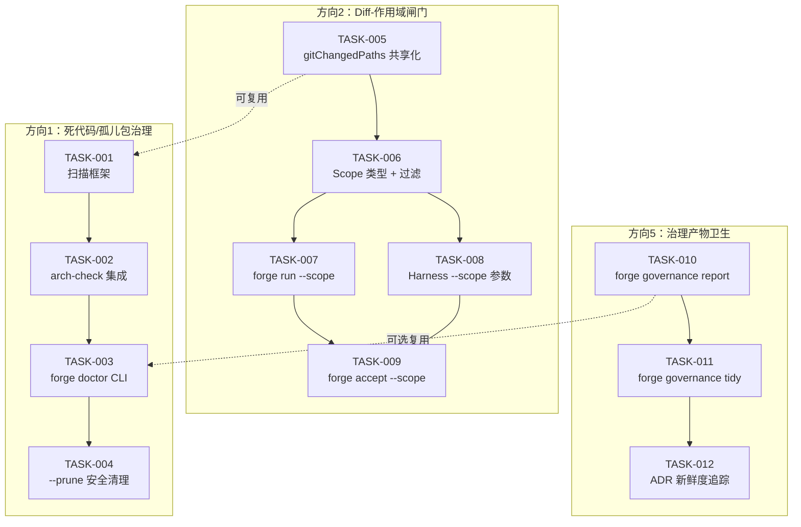
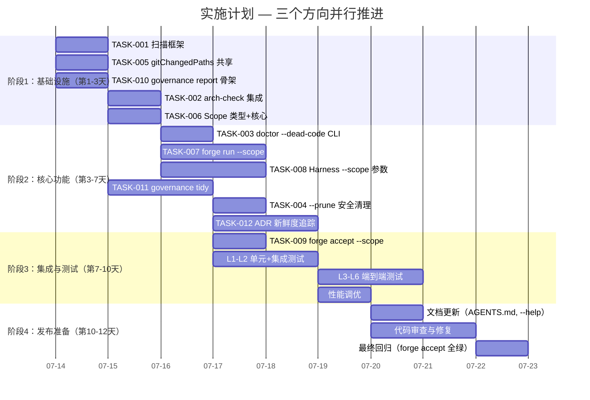

# Tech Lead 分析报告：三个新颖方向的工程落地

> **基于代码验证报告（Code Verification Report）**，聚焦三个确认原创的方向：**方向1（死代码/孤儿包治理）、方向2（Diff-作用域闸门）、方向5（治理产物卫生）**。
>
> 方向3（成本预估算）已在 `preflight.go` 实现，方向4（自测试）已有 300+ 行分析文档 —— 本文不再重复，仅作上下文引用。

---

## 1. 任务分解

以下将三个方向拆解为 12 个可执行任务，每任务 2–4 小时。

| 任务 ID | 任务标题 | 方向 | 涉及文件 | 前置依赖 | 预估工时 | 验收标准 |
|---|---|---|---|---|---|---|
| TASK-001 | **扫描框架：添加孤儿包/死代码检测能力** | 方向1 | `harness/arch/scan.mjs`（+add `scanDeadCode`）, `harness/arch/arch-check.mjs`（+import） | 无 | 3h | `scan.mjs` 导出 `scanDeadCode(root, rules)` 函数，对每个 Go 包扫描：1) 是否零生产文件（仅 test） 2) 是否零被引用（go/packages 或 heuristic）。两种 `scan.mjs` 输出模型兼容。 |
| TASK-002 | **添加 `checkOrphanPackages` 到 arch-check** | 方向1 | `harness/arch/arch-check.mjs`（+checkOrphanPackages），`.arch/rules.yaml`（+orphan_package 预算） | TASK-001 | 2h | 新 check 运行后输出 `[PASS] orphan-packages` 或 `[FAIL] orphan-packages — ...`。默认阈值：零文件 + 零引用 = 孤儿。集成到主 runner 的 checks 数组。 |
| TASK-003 | **`forge doctor --dead-code` CLI 命令** | 方向1 | `forge-core/cmd/forge/main.go`（+subcommand）, `forge-core/cmd/forge/doctor.go`（+deadCodeHandler）, `forge-core/internal/doctor/deadcode.go`（新文件） | TASK-002 | 3h | `forge doctor --dead-code` 输出格式为 `PACKAGE_PATH [orphan|unused|empty] reason`。零孤儿时返回 0。集成到现有 doctor 框架。 |
| TASK-004 | **`forge doctor --dead-code --prune` 安全清理** | 方向1 | `forge-core/internal/doctor/deadcode.go`（+prune 选项） | TASK-003 | 2h | `--prune` 将孤儿包移入 `.forge/graveyard/<timestamp>/` 而非直接删除。被清理列表写入日志。dry-run 模式仅预览。 |
| TASK-005 | **重构 `gitChangedPaths` 为共享工具函数** | 方向2 | `forge-core/internal/gate/gitdiff.go`（新文件），`forge-core/cmd/forge/route.go`（refactor import），`forge-core/cmd/forge/engine_build.go`（refactor import） | 无 | 2h | `internal/gate` 包导出 `ChangedPaths(root string) []string`，类型+行为与现有 `gitChangedPaths` 完全兼容。现有两个 consumer 迁移到此，删除原地实现。带单元测试。 |
| TASK-006 | **`gate.Scope` 类型 + 文件过滤核心逻辑** | 方向2 | `forge-core/internal/gate/scope.go`（新文件），`forge-core/internal/gate/scope_test.go` | TASK-005 | 3h | `Scope` 类型定义：`type Scope struct { ChangedPaths []string; Mode Mode; Lifecycle string }`。`FilterGates(gates []GateConfig, scope Scope) []GateConfig` 函数：传入 changed paths 和 scope 配置，仅返回 scope 内应执行的 gate。无 changed-files → 全量扫描（安全降级）。 |
| TASK-007 | **`forge run --scope <changed|full>` 熔断语义** | 方向2 | `forge-core/internal/gate/scope.go`（+parseScopeFlag），`forge-core/cmd/forge/engine_build.go`（+scope wiring），`forge-core/cmd/forge/main.go`（flag 注册） | TASK-006 | 3h | `forge run --scope=changed` 仅对 changed files 相关的包跑 arch-check/check.py。`--scope=full`（默认）= 当前行为。JSON 输出含 scope 信息。 |
| TASK-008 | **Harness gate.mjs `--scope <paths>` 参数** | 方向2 | `harness/gate.mjs`（+--scope 参数过滤），`harness/arch/arch-check.mjs`（+--scope 参数） | TASK-006 | 3h | gate.mjs 接受 `--scope=file1,file2,...`，内部将 check 限定到指定文件。arch-check.mjs 接受 `--scope=dir1,dir2,...` 限定扫描域。无 scope 参数 = 全量。 |
| TASK-009 | **`forge accept --scope` Stop 门集成** | 方向2 | `harness/acceptance.mjs`（+scope 参数透传），`forge-core/internal/gate/resolve.go`（+scope-enabled GatesGreen） | TASK-007, TASK-008 | 2h | `forge accept --scope=<paths>` 通过 scope 限制后的门集合聚合 verdict。`harness/acceptance-kernel.mjs` 无 scope 参数时行为不变。 |
| TASK-010 | **`forge governance report` 治理资产盘点命令** | 方向5 | `forge-core/cmd/forge/main.go`（+subcommand），`forge-core/cmd/forge/governance.go`（新文件），`forge-core/internal/doctor/governance.go`（+盘点函数） | 无 | 3h | `forge governance report` 输出：ADR 总数、最新/最旧 ADR、每个 ADR 的测试状态（绿/红/无）、governance 资产列表。支持 `--json`、`--outdated` 过滤。 |
| TASK-011 | **`forge governance tidy` 治理清理命令** | 方向5 | `forge-core/cmd/forge/governance.go`, `forge-core/internal/doctor/governance.go`（+tidy） | TASK-010 | 3h | `forge governance tidy --dry-run` 列出可清理项（孤立 ADR 文件、未引用的 governance 资产）。`forge governance tidy --apply` 执行清理（移动而非删除，默认 30 天保留期）。 |
| TASK-012 | **ADR 新鲜度追踪 + 自动检测** | 方向5 | `forge-core/internal/adr/freshness.go`（新文件），`forge-core/internal/doctor/governance.go`（+freshness check），更新 `Bootstrap.md` 或 `AGENTS.md` 中 ADR 指引 | TASK-011 | 3h | 每个 ADR 文档的 frontmatter 或 git 历史自动检测最后修改日。`forge governance report --outdated` 列出超过 90 天未更新的 ADR。ADR test 若持续 N 次绿可标记为 "verified"。 |

---

## 2. 执行顺序与任务依赖



### 可并行执行的任务组

| 并行组 | 任务 | 依赖 |
|---|---|---|
| **组A**（起步即可并行） | TASK-001, TASK-005, TASK-010 | 无 |
| **组B**（方向1+2 可并行推进） | TASK-002 + TASK-006 | T001, T005 |
| **组C**（方向2 两条子线并行） | TASK-007 + TASK-008 | T006 |
| **组D**（三位一体验收） | TASK-004 + TASK-009 + TASK-011 | T003, T007+T008, T010 |

---

## 3. 技术风险

### 3.1 风险矩阵

| 风险 | 影响方向 | 概率 | 严重度 | 应对策略 |
|---|---|---|---|---|
| **孤儿包误报**（Go src 通过 ast 间接引用 vs `go list` 的 Deps） | 方向1 | 中 | 中 | 双路径验证：`go list -json ./...` 的 Deps + 文件系统 heuristics。任一报 orphan 则标记可疑（WARN），双报才硬 FAIL。 |
| **scope 过窄导致漏检**（改了 A 包但 B 包隐式受影响，scope 没覆盖） | 方向2 | 高 | 高 | scope 默认只做 **PASS 加速——不改变 FAIL 语义**：被 scope 跳过的 gate 标记为 `NA + scoped`，不在 FAIL 计数内。`--scope=full` 回归全量。Blast radius 扩展：调用 `risk.FromChangedPaths` 将影响面扩大到相关包。 |
| **Harness gate 的 --scope 参数设计复杂度** | 方向2 | 中 | 中 | 每个 check 自行决定 scope 语义（gate.mjs 按文件过滤，arch-check.mjs 按目录过滤）。保持 scope 为可选优化，不改变 check 本身的输出结构。 |
| **governance tidy 误删** | 方向5 | 低 | 高 | 采用「移动→gc 期→确认删除」三级策略。`--apply` 默认写入 `.forge/graveyard/governance/<date>/`，保留 30 天。提供 `forge governance tidy --undo` 恢复命令。 |
| **ADR 新鲜度启发式不准确**（git 历史漂移 vs 手动 last-reviewed 字段） | 方向5 | 中 | 低 | 双信号：1) git 最后修改日 2) ADR 文档 frontmatter 的 `last-reviewed: YYYY-MM-DD` 字段（人工标注）。两个都超期才告警。 |
| **与现有 `forge accept` 集成时的 N/A 语义冲突** | 方向2 | 中 | 中 | scope 跳过的 gate 在结果中标记为 `NA + category:"scoped"`。现有 `GatesGreen` 逻辑的 `catNoTool` / `catInapplicable` 保持不变；加新 category `catScoped`，仅当 lifecycle 为 production 时视为 block（其他 lifecycle 豁免）。 |

### 3.2 技术难点

1. **Go 包依赖图的准确获取**：`go list -json ./...` 输出 Deps（传递依赖），但不直接给出谁 import 了谁。孤儿检测需反向查询 `importers`。可以使用 `go list -json -deps ./...` 或自己构建 graph。另一种方案是使用 `go/packages` 库（但 forge-core 零外部依赖）。折中：在 harness/Node 层做 heuristic（parse `import` 语句），在 Go 层走 `go list`。Node heuristic 的误报由 Go 层验证兜底。

2. **Scope 的 Blast Radius 扩展**：只扫描 changed files 是不够的 —— 改了 `interface.go` 则所有实现者都应纳入 scope。方案：复用现有的 `internal/risk` 包的 `FromChangedPaths` 函数，它已实现了路径 substring + 风险分类。加一个 `ExpandScope(changed []string) []string` 函数，使用同样的路径模式匹配扩展 scope。

3. **多语言下的 scope 一致性**：Go 文件改了，JS gate 也该跑吗？答案是**按包/目录关联**：`src/go/` 的变更不应触发 `harness/` 的 gate。路径 prefix 匹配是简单可行的方案。

---

## 4. 资源评估

### 4.1 人员技能需求

| 角色 | 人数 | 核心技能 | 负责任务 |
|---|---|---|---|
| **Go 后端工程师** | 1 | Go 标准库、CLI 设计、包结构 | TASK-003~007, TASK-010~012 |
| **Node/全栈工程师** | 1 | Node.js、正则/ast 解析、CLI 工具链 | TASK-001~002, TASK-008~009 |
| **Tech Lead / 架构师** | 0.5 | 方案评审、跨方向协调、代码审查 | 所有任务的质量把关 |

> **核心团队 = 2 人**。方向 1 和方向 5 高度重叠（Go 侧），方向 2 跨 Go+Node。

### 4.2 关键里程碑

| 里程碑 | 交付物 | 预计耗时（人天） | 依赖 |
|---|---|---|---|
| **M1：扫描就绪** | arch-check 能检测孤儿包 | 1 | TASK-001, TASK-002 |
| **M2：CLI 就绪** | `forge doctor --dead-code` 可用 | 1.5 | TASK-003 |
| **M3：Scope 核心就绪** | `internal/gate/scope.go` + 测试 | 1.5 | TASK-005, TASK-006 |
| **M4：Harness scope 就绪** | `gate.mjs --scope` 可工作 | 1.5 | TASK-008 |
| **M5：全链路 scope** | `forge run --scope=changed` 端到端 | 1 | TASK-007, TASK-009 |
| **M6：治理报告就绪** | `forge governance report` 可用 | 1 | TASK-010 |
| **M7：治理清理就绪** | `forge governance tidy` 可用 | 1 | TASK-011 |
| **M8：ADR 新鲜度就绪** | `forge governance report --outdated` 可用 | 1 | TASK-012 |

### 4.3 阻塞点与解决策略

| 阻塞点 | 影响 | 策略 |
|---|---|---|
| **Go 包依赖图的反向查询**（`go list` 不直接给出谁 import 了某包） | TASK-001 | **Plan A**（首选）：`go list -json ./... | jq 'select(.ImportPath != null) | {pkg: .ImportPath, imports: .Imports}'` → 自行建图 → invert。**Plan B**（降级）：`rg 'forgeos/forge-core/internal/xxx' --include '*.go'` heuristic。**Plan C**（精简版）：只看目录是否存在 production .go 文件（零文件即为孤儿），忽略引用检查。 |
| **scope 与现有 gate 输出格式不兼容** | TASK-009 | 在 `acceptance-kernel.mjs` 新增 status `NA` 的子类 `scoped`，不改变 `PASS/FAIL/NA` 的三态枚举。现有 consumer 兼容。 |
| **`forge doctor --dead-code` 需要扫描整个 repo** | TASK-003 | 首次运行可能较慢。加 `--fast` 模式（仅检查上次 doctor 后修改过的包）。结果缓存到 `.forge/deadcode-cache.json`。 |

---

## 5. 质量保证

### 5.1 单元测试覆盖要求

| 包/文件 | 最低覆盖率要求 | 关键测试场景 |
|---|---|---|
| `internal/gate/scope.go` | 90% | 空 scope、全 scope、路径匹配、Blast radius 扩展、与 risk 包的集成 |
| `internal/doctor/deadcode.go` | 85% | 零文件目录、纯 test 目录、被引用的包、跨包引用、嵌套路径 |
| `internal/doctor/governance.go`（新增函数） | 80% | ADR 盘点、新鲜度计算、tidy dry-run、tidy apply+undo |
| `harness/arch/scan.mjs`（新增函数） | 90% | Go 包扫描、引用检测、多语言忽略 |
| `harness/arch/arch-check.mjs`（新增 check） | 85% | 孤儿包检测、阈值配置、混合结果（pass+fail） |
| `harness/gate.mjs`（--scope） | 80% | 文件过滤、目录过滤、无 scope 降级 |

### 5.2 集成测试策略

| 测试等级 | 测试内容 | 工具/方法 |
|---|---|---|
| **L1：Go 单元测试** | scope 逻辑、doctor CLI、governance 命令 | `go test -race ./internal/gate/... ./internal/doctor/...` |
| **L2：Harness 单元测试** | arch-check new checks、gate.mjs --scope | `node harness/test_*.mjs`（复用现有测试框架） |
| **L3：端到端（方向1）** | `forge doctor --dead-code` 在 forge-core 自身跑，验证零孤儿（假设没有） | 手动 + `acceptance-test.mjs` 扩充 |
| **L4：端到端（方向2）** | `forge run --scope=changed` + 修改一个文件 → 仅跑相关 gate | 新建 `harness/test_scope.mjs` |
| **L5：端到端（方向5）** | `forge governance tidy --dry-run` + 清理 + `--undo` | 新建 `harness/test_governance.mjs` |
| **L6：回归** | `forge accept` 全量跑一次 | 复用现有 CI（`.github/workflows/forge.yml`） |

### 5.3 代码审查要点

| 审查维度 | 具体要点 |
|---|---|
| **方向1：孤儿检测** | 误报率控制（`go list` vs heuristic 双路径）、是否处理了 Go 的 `internal` 可见性规则、test only 目录的正确识别 |
| **方向2：Scope** | 空 changed paths 时安全降级（全量）、--scope 与现有 CLI flag 的交互（如 --diff-files）、scope 结果在 JSON 输出中的表示 |
| **方向2：Blast Radius** | `ExpandScope` 是否过度扩展（把无关包纳入导致性能劣化）、扩展逻辑是否与 `internal/risk` 的路径模式一致 |
| **方向5：治理清理** | `--apply` 是否真的只移动不删除、`.forge/graveyard/` 的 gc 策略是否明确、ADR frontmatter 的 `last-reviewed` 格式文档化 |
| **跨方向** | 错误信息的可操作性（是否告诉用户怎么做而不是只报错）、与 `AGENTS.md` 红线的兼容性 |

### 5.4 性能测试需求

| 场景 | 测试方法 | 通过标准 |
|---|---|---|
| `forge doctor --dead-code` 全量扫描（~200 Go 文件） | `time forge doctor --dead-code` | < 2s（含 `go list` 一次开销） |
| `forge run --scope=changed`（1 文件变更时） | 对比 `--scope=full` 的执行时间 | scope 模式 ≤ 全量模式 30% 的时间 |
| `forge governance report --outdated` | `time` | < 500ms |
| `forge accept --scope` | `time` | < 全量 `forge accept` 50% 的时间（10+ gate 时） |

---

## 6. 实施计划

### 甘特图（人天，2 人并行）



### 每日交付节奏

```
Day 1-3（阶段1：基础设施搭建）
  输出：
    - scan.mjs 新增 scanDeadCode 函数
    - arch-check.mjs 新增 checkOrphanPackages check（初始 WARN 级别）
    - internal/gate/gitdiff.go 共享 ChangedPaths
    - internal/gate/scope.go + scope_test.go（纯逻辑，无 CLI）
    - internal/doctor/governance.go 新增 Report 函数签名
    - internal/gate/scope_test.go 全绿

Day 3-7（阶段2：核心功能实现）
  输出：
    - forge doctor --dead-code 可用（含 --prune --dry-run）
    - forge run --scope=changed 可用（含 blast radius）
    - gate.mjs --scope=<paths> 可用
    - arch-check.mjs --scope=<dirs> 可用
    - forge governance report 可用（--json, --outdated）
    - forge governance tidy --dry-run / --apply 可用
    - ADR frontmatter last-reviewed 字段规范文档化

Day 7-10（阶段3：集成测试与优化）
  输出：
    - forge accept --scope 端到端通过
    - 所有 L1-L2 测试：`go test -race ./...` 全绿
    - 所有 L3-L6 测试：新建 test 文件通过
    - scope 场景性能达标（changed=1 文件时 ≤ 全量 30% 时间）

Day 10-12（阶段4：发布）
  输出：
    - AGENTS.md 更新：新增死代码/孤儿包为「规范」
    - --help 文本更新
    - 代码审查 round-trip 完成
    - forge accept 全绿（所有闸门）
    - 发布 PR + CHANGELOG 条目
```

### 优先级建议

```
第一优先级（最高 ROI，最低风险）：
  TASK-001 + TASK-002  → 零风险死代码检测上线
  TASK-005 + TASK-006  → Scope 核心能力就绪

第二优先级（中 ROI，中风险）：
  TASK-010             → 治理可见性上线（report 仅读取，零破坏）
  TASK-003             → 死代码 CLI 完整

第三优先级（高价值，需前序就绪）：
  TASK-007 + TASK-008 + TASK-009  → Scope 全链路
  TASK-004             → 安全清理
  TASK-011 + TASK-012  → 治理自动化
```

---

## 附：与现有架构的兼容性

### 不需要修改的现有模块

| 现有模块 | 原因 |
|---|---|
| `internal/asset` | 不变。死代码检测在包层级，不影响 asset 加载。 |
| `internal/orchestrator` | 不变。Scope 只在 gate 层面过滤，不改变编排流程。 |
| `internal/converge` | 不变。Scope 不改变收敛逻辑（只是减少跑的门数量）。 |
| `internal/risk` | 不变。我们在 `ExpandScope` 中 *消费* risk 的输出。 |
| `internal/mode` / `internal/routing` | 不变。Scope 不改变 mode/routing 逻辑。 |
| `harness/check.py` | 不变（但 scope 集成时可能通过 `--scope` 参数缩小扫描范围）。 |

### 需要扩展的接口

| 接口 | 新增内容 |
|---|---|
| `harness/acceptance-kernel.mjs` | 新增 `NA` 子分类 `scoped`。修改 `decide()` 纯函数理解新的 category。 |
| `internal/gate/gate.go` | 新增 `Scope` 类型、`ExpandScope` 函数、`FilterGates` 函数。 |
| `internal/doctor/` | 新增 `deadcode.go`、扩展 `governance.go`。 |

### 与工程红线的关系（AGENTS.md）

| 红线 | 影响 |
|---|---|
| **体积 / 函数长度** | 所有新文件 ≤ 500 行，新函数 ≤ 50 行。Scope.go 预计 ~200 行。 |
| **零外部依赖** | 全程遵守。Go 侧纯标准库，Node 侧纯 built-in。 |
| **治理完整性** | 方向 5 直接增强这个红线（检查 ADR ↔ 代码双向一致性）。 |
| **先拆分再继续** | 任一方向的首个任务达到 400 行时先重构。 |
