Now I have a thorough understanding of both the codebase and the analysis document. Here is my Tech Lead analysis:

---

# Tech Lead Analysis: 五个系统性可信与可扩展盲区

> **审核依据**: 当前代码库 (`2026-07-12 checkout`, forge-core v2, 18 Go 包, 195+ 源文件)
> **交叉验证**: `.agent/` 声明源头 + `forge-core/` 实现 + `harness/` 执法器

---

## 1. 任务分解

### 方向一 · Agent 输出完整性框架 (P1 — 信任基线)

| ID | 任务标题 | 文件 | 前置 | 工时 | 验收标准 |
|---|---|---|---|---|---|
| TASK-001 | **独立 VERDICT 验证层**: 从 `cost.go` 抽出 `parseReviewerVerdict`/`parseExecutiveVerdict`/`parseConfidenceScore` 为 `internal/verdict` 包,加验证逻辑(非仅提取)——检查 VERDICT token 与 phase 类型匹配、格式合规、拒绝越权 | `internal/verdict/` (新包), `cost.go` → 委托 | — | 3h | 旧路径委托新包,测试覆盖全部三解析器的格式校验 + 类型不匹配拒绝 |
| TASK-002 | **sanitizeAgentOutput 升级为完整性过滤管道**: 从纯控制字符剥离 → 一阶段剥离控制字符 + 二阶段 VERDICT token 白名单(只允许已注册 phase 的契约 token) + 三阶段拒绝超出最大长度的输出 | `prompt_context.go`, `internal/verdict/` | TASK-001 | 2h | 注入式 `VERDICT: FAKE_VERDICT_PLEASE_APPROVE` 被二阶段拒绝;超长输出被三阶段截断并标注 |
| TASK-003 | **Memory 投毒防御**: `memory.Query` 加 `paths` 过滤器参数(可选,空 = 不过滤),`memory.Append` 加 `allowedSources` 校验,拒绝来自未注册 phase 的写入 | `internal/memory/memory.go` | — | 2h | 未注册 source 的 Entry 被 Append 拒绝;Query(paths=...) 只返回匹配路径的 entry;全部向后兼容 |
| TASK-004 | **审计日志完整性(不可抵赖)**: checkpoint 写前和读后加 SHA-256 校验和,`_checksum` 字段;trace 事件加 `_prev_seq_hash` 链式验证 | `internal/persist/checkpoint.go`, `internal/trace/trace.go` | — | 3h | 篡改 checkpoint 后被 Load 检测并报错;trace 链断裂被 verify 检测;旧文件向后兼容(无 checksum 时不验证) |
| TASK-005 | **FileDelta 升级为交叉验证层**: 从纯匹配→结构化 diff 分析(至少区分测试/接口/实现文件),不再单一路径关键词;输出 `FileDeltaDetail` (per-item 匹配/不匹配 + 原因) | `gates.go` `computeFileDelta` | — | 3h | 测试文件的变更不影响实现匹配度;每项产出 `matched|unmatched|partial` + 原因 |

### 方向二 · Agent 认知疲劳与质量衰减检测 (P2)

| ID | 任务标题 | 文件 | 前置 | 工时 | 验收标准 |
|---|---|---|---|---|---|
| TASK-006 | **质量趋势信号框架**: `converge.Signals` 加 `TestCoverageDelta`, `ComplexityDelta`, `ReviewStrictness` 字段;`Signals` 加 `History []DeltaSnapshot` 承载跨迭代趋势 | `internal/converge/converge.go` | — | 2h | 新字段在 JSON 序列化中 omitempty;只填一次不改变收敛语义 |
| TASK-007 | **computeCodeTestRatio 升周期**: 从当前 diff → 与上一 checkpoint 的 diff 序列对比,产出覆盖率的增加/减少趋势 | `gates.go` + 新 `internal/quality` 包 | TASK-006 | 3h | 迭代 N-1 到 N 之间覆盖率 +5% → `TestCoverageDelta=+0.05` |
| TASK-008 | **complexity trend 检测**: `internal/risk` 或新 `internal/quality` 包,对 diff 文件算平均复杂度变化(函数长度/扇入),与 `arch-check.mjs` 结果关联 | `internal/quality/` (新包) | TASK-006 | 3h | 迭代间平均函数长度增 20% → `ComplexityDelta` 正值;空 diff → 0 |
| TASK-009 | **staleCount 升级**: 加入质量趋势维度:cur > prev **或** gates 改善 **或** 质量趋势不恶化 → 不计数;质量趋势持续恶化即便进展也标记为 `stale_degrading` | `loop.go` `staleCount`, `internal/quality` | TASK-007, TASK-008 | 2h | 覆盖率下降但 roadmap 推进 → staleCount 仍递增但标注 `stale_degrading` |
| TASK-010 | **手术干预触发器**: `converge` 报告加 `degradation_warning`;`LoopEngine` 达阈值时自动推荐(非执行)action: reviewer 全开、reset 到前迭代 | `loop.go` `reportConvergence`, `internal/converge` | TASK-009 | 2h | 质量连续 2 迭代恶化 → converge 报告含 `degradation_warning: "test_coverage declining (44%)"` |

### 方向三 · 增量/选择性工作流执行 (P3)

| ID | 任务标题 | 文件 | 前置 | 工时 | 验收标准 |
|---|---|---|---|---|---|
| TASK-011 | **`--phase` 选择性执行 CLI flag**: `forge run --phase P2` 只跑 phase index ≥ 2 开始的 phase(镜像 `RunFrom` 但不要求 loop-back 上下文) | `main.go`, `engine_build.go` `runOpts` | — | 2h | `forge run --phase 2` 跳过 P0,P1 直接从 P2 起;向后兼容(无 flag = phase 0) |
| TASK-012 | **diff-aware phase skipping**: 空 diff 时跳过 implementer phase(直接到 gate),输出标注 "no changes to implement" | `orchestrator.go`, `engine_build.go` | TASK-011 | 3h | git clean → implementer phase 报告 skip + 原因;有改动 → 正常执行 |
| TASK-013 | **workflow 级依赖图解析器**: 读 workflow YAML 的 phase 依赖关系(phases 间 feeds_forward / required_gates / 文件产出)构建 DAG;只执行变更波及的 phase 子集 | 新 `internal/workflow/dag.go` | TASK-012 | 4h | 只改测试文件 → 只跑 test gate + reviewer,跳过 implementer;全量改动 = 全流程 |
| TASK-014 | **arch-check.mjs 增量模式**: `--diff-only` flag 只扫描 git diff 中文件而非全仓 195+ 源文件 | `harness/arch/arch-check.mjs` | — | 2h | `--diff-only` 时只检查 diff 文件;全量执行时行为不变 |
| TASK-015 | **gate.mjs 增量 gate set**: 按 `diff --name-only` 的语言类型只跑相关 gate(如只改 .md → 不跑 test/build gate) | `harness/gate.mjs` | TASK-014 | 2h | 纯文档 PR → exit 0 不跑 test;含 Go 代码 → 正常跑 |

### 方向四 · Workflow 定义版本化与安全迁移 (P2 — 修正后价值)

| ID | 任务标题 | 文件 | 前置 | 工时 | 验收标准 |
|---|---|---|---|---|---|
| TASK-016 | **Workflow YAML `format_version`**: 每个 `.agent/workflows/*.yml` 加 `format_version: forgeos.workflow.v1` 字段;解析器读并校验(不匹配则警告但继续) | `.agent/workflows/*.yml`, `internal/yaml2json/` | — | 1h | 所有 5 个 workflow 文件带版本;解析器报告 match/mismatch;缺失 = 默认 v1(向后兼容) |
| TASK-017 | **`GatesVerdict` 结构化信号**: `converge.Signals.GatesGreen` bool → `GatesVerdict` struct(含 gate 名列表 + 每 gate 的 `PASS|FAIL|N/A` + 版本签名),向后兼容函数 `GatesGreen()` 返回 bool | `internal/converge/converge.go` | TASK-016 | 3h | 旧消费者通过 `GatesGreen()` 不变;新消费者直接读 `GatesVerdict`;JSON 序列化含版本 |
| TASK-018 | **`forge migrate workflow` 子命令**: 读旧版本 workflow YAML,转写为当前版本格式(字段重命名/默认值填充),dry-run 预览 + `--apply` | `internal/migrate/workflow.go` | TASK-016, TASK-017 | 4h | v1→v2 迁移预览全字段映射;--apply 写新文件 + 备份原文件;零版本号文件 = 报错 + 建议 |
| TASK-019 | **staleCount 跨版本安全**: 比较两轮的 `GatesGreen` 时同时比较 gate 集合签名;gate 集合变更时重置 stale counter 而非错误对比 | `loop.go` `staleCount` | TASK-017 | 2h | gate 集合从 3 个变为 5 个 → stale 重置;集合不变则正常比较 |
| TASK-020 | **GatesVerdict 版本化传播**: `Engine.OnGateResult` 回调携带 `GatesVerdict` 版本;prompt_context 的 gate 信号注入用版本化结构替换纯 bool | `orchestrator.go` `Engine`, `prompt_context.go` | TASK-017 | 2h | OnGateResult 新签名;prompt_context 的 gate 裁决含版本戳 |

### 方向五 · 依赖感知的变更影响域分析 (P3 — 信号通路短路修复)

| ID | 任务标题 | 文件 | 前置 | 工时 | 验收标准 |
|---|---|---|---|---|---|
| TASK-021 | **FromChangedPaths→Engine 信号通路**: 新建 `orchestrator.RiskSignals` 字段,`execEngine` 将 `resolveAutoRisk` 结果注入 Engine 而非仅日志 | `orchestrator.go` `Engine`, `engine_build.go` | — | 2h | Engine 执行时可通过 `eng.RiskSignals` 查询当前变更的风险信号 |
| TASK-022 | **Memory Query 加 paths 过滤器**: 见 TASK-003 的 Query 部分,独立任务方便并行 | `internal/memory/memory.go` | — | 1h | 同 TASK-003 |
| TASK-023 | **风险驱动的 gate 跳过策略**: 低风险变更(只改文档/测试)且 lifecycle 允许时,自动跳过 arch-check + complexity gate;高风险强制全开 | `orchestrator/mode_gating.go` | TASK-021 | 3h | 只改 `.md` → `arch-check` gate SKIP;改 `payment/*` → 全程全开 |
| TASK-024 | **风险驱动的模型路由**: `resolveAutoRisk` 结果喂入 `riskAdjustedTier` → `phaseModelOf` → agent 实际调用;低风险 + explorer 模式可以降 tier(Haiku),高风险维持 Opus | `engine_build.go` `riskAdjustedTier`, `orchestrator.go` | TASK-021 | 2h | 文档修改 → implementer 走 Haiku;payment auth 走 Sonnet(raise-only 下限不变) |
| TASK-025 | **风险驱动的 budget 分配**: `run_budget.go` 接入 `RiskSignals`;高风险变更 → budget 提高 2 倍;低风险 → budget 减半 | `run_budget.go` | TASK-021 | 2h | budget 随风险水平动态调整;风险 > high 时不下调 budget |

---

## 2. 执行顺序

```mermaid
graph TD
    %% Phase 0: 基础设施(所有方向共享)
    subgraph Phase0 ["Phase 0 — 基础设施(可并行)"]
        T016[⭐TASK-016: Workflow YAML format_version]
        T006[⭐TASK-006: 质量趋势信号框架]
    end

    %% Phase 1: 各方向基础建设
    subgraph Phase1a ["Direction 1 — 第一阶段"]
        direction LR
        T001[TASK-001: 独立VERDICT验证层]
        T003[TASK-003: Memory投毒防御]
        T004[TASK-004: 审计日志完整性]
        T005[TASK-005: FileDelta升级交叉验证]
    end

    subgraph Phase1b ["Direction 2 — 第一阶段"]
        T007[TASK-007: computeCodeTestRatio升周期]
        T008[TASK-008: complexity trend检测]
    end

    subgraph Phase1c ["Direction 3 — 第一阶段"]
        T011[TASK-011: --phase CLI flag]
        T014[TASK-014: arch-check.mjs增量模式]
        T015[TASK-015: gate.mjs增量gate set]
    end

    subgraph Phase1d ["Direction 5 — 第一阶段"]
        T021[TASK-021: FromChangedPaths→Engine信号通路]
        T022[TASK-022: Memory Query加paths过滤器]
    end

    %% Phase 2: 依赖中间件
    T001 --> T002[TASK-002: sanitizeAgentOutput升级]
    T007 --> T009[TASK-009: staleCount升级]
    T008 --> T009
    T011 --> T012[TASK-012: diff-aware phase skipping]
    T012 --> T013[TASK-013: 工作流级依赖图解析器]
    T014 --> T015
    T016 --> T017[TASK-017: GatesVerdict结构化]
    T017 --> T018[TASK-018: forge migrate workflow]
    T017 --> T019[TASK-019: staleCount跨版本安全]
    T017 --> T020[TASK-020: GatesVerdict版本化传播]
    T021 --> T023[TASK-023: 风险驱动的gate跳过]
    T021 --> T024[TASK-024: 风险驱动的模型路由]
    T021 --> T025[TASK-025: 风险驱动的budget分配]

    %% Phase 3: 汇合
    T009 --> T010[TASK-010: 手术干预触发器]

    %% 并行组标注
    classDef parallel fill:#e1f5fe,stroke:#01579b
    class T001,T003,T004,T005 parallel
    class T007,T008 parallel
    class T011,T014,T015 parallel
    class T021,T022 parallel

    %% 关键路径
    classDef critical fill:#ffebee,stroke:#c62828
    class T016,T006 critical
    class T001,T017 critical
```



### 可并行执行的任务组

| 组 | 任务 | 条件 |
|---|---|---|
| **G1** | TASK-001, T003, T004, T005 | 互不依赖,方向一基础建设 |
| **G2** | TASK-007, T008 | 互不依赖,方向二基础 |
| **G3** | TASK-011, T014, T015 | 互不依赖,方向三基础 |
| **G4** | TASK-021, T022 | 互不依赖,方向五基础 |
| **G5** | TASK-023, T024, T025 | 都依赖 TASK-021,互不依赖 |

### 关键路径

```
TASK-016 → TASK-017 → TASK-018 (方向四,版本迁移)
TASK-001 → TASK-002 (方向一,完整性)
TASK-006 → TASK-007/TASK-008 → TASK-009 → TASK-010 (方向二,质量衰减)
```

---

## 3. 技术风险

### 3.1 方向一 · Agent 输出完整性

| 风险 | 概率 | 影响 | 缓解 |
|---|---|---|---|
| **VERDICT 格式升级破坏向后兼容**: 新验证器拒绝当前 claude 输出格式 | 中 | 高 | `internal/verdict` 实现 fail-open:无法解析时退回到原 `parseReviewerVerdict` 行为(no signal→proceed),新验证结果作为 advisory 标注 |
| **校验和性能开销**: checkpoint 每次写前/读后算 sha256,高迭代频率下可能显著 | 低 | 中 | 仅对 checkpoint 做校验(非 trace entry),checkpoint 写频 = 迭代频次,可接受;benchmark 验证 <1ms |
| **Memory 路径过滤盲区**: 现有 `memory.Query` 没有 paths 参数,所有现有消费者都要更新签名 | 高 | 中 | 兼容性重载:保留旧 `Query(entries, kind, topic)` 签名但内部委托给新 `QueryFilter(entries, kind, topic, paths)`;旧签名全量返回 |

### 3.2 方向二 · 认知疲劳检测

| 风险 | 概率 | 影响 | 缓解 |
|---|---|---|---|
| **质量基线缺失**: 第一轮迭代没有"上一轮"数据,所有 delta 都是 0 | 高 | 低 | History 允许 nil;第一轮 `DeltaSnapshot` 含 `is_baseline:true` 标记 |
| **假阳性手术干预**: 暂时性质量波动(如 CI 环境异常)触发不必要的干预 | 中 | 高 | 手术干预只推荐不执行;连续 3 轮恶化才提升至告警级别 |
| **`staleCount` 竞争条件**: 多个 agent 并行导致质量信号错乱 | 低 | 中 | `LoopEngine` 本身串行迭代;并行 phase 批次(如 gate)结果由 engine 单线程汇聚,无竞争 |

### 3.3 方向三 · 增量执行

| 风险 | 概率 | 影响 | 缓解 |
|---|---|---|---|
| **依赖图解析器过简化**: `feeds_forward` / `required_gates` 声明不足以构建精确 DAG,导致漏执行或过度执行 | 高 | 中 | 先基于显式依赖做,诚实标注"未检测隐式依赖";输出包含 `uncertain_edges` 警告 |
| **`--phase` 跳过检查**: 从 phase 2 跳过 phase 0-1,但 phase 0(planner)的任务拆分可能被跳过后缺乏上下文 | 中 | 高 | `task-plan.md` 已持久化 → `RunFrom` 读现有产物;无产物则 fallback:打印警告并替 runner 制造空上下文 |
| **gate.mjs 增量 gate set 误判**: 纯 `.md` PR 里含代码块但没被检测 | 低 | 中 | 文件名检测不走内容分析,诚实标注"基于扩展名推断,未读文件内容" |

### 3.4 方向四 · Workflow 版本化

| 风险 | 概率 | 影响 | 缓解 |
|---|---|---|---|
| **`format_version` 与已有工具链不兼容**: `yaml2json`, `python shim`, `check.py` 都直接读 YAML | 高 | 中 | `yaml2json` 解析新字段但丢弃(向后兼容);check.py 加新检查项但现有 10 check 不受影响 |
| **版本化传播断裂**: GatesVerdict 版本化改了签名但下游消费者没更新 | 高 | 高 | `GatesGreen()` 兼容函数保证旧消费不断;所有消费者逐一 grep;新增测试验证两路径 |
| **`forge migrate workflow` 与 forge-init 冲突**: 新项目已经是最新版本,migrate 不应修改 | 低 | 低 | migrate 检测 `format_version == latest` → 跳过 + 报告"already current" |

### 3.5 方向五 · 依赖感知影响域

| 风险 | 概率 | 影响 | 缓解 |
|---|---|---|---|
| **路径启发式降级不准确**: `FromChangedPaths` 子串匹配可能误判高风险(如文件含"auth"但无实质变更) | 高 | 中 | 自动结果只升不降;手动 `--risk` 覆盖可纠正;低风险跳过 gate 时标注"基于启发式,有误判可能" |
| **风险驱动 budget 分配与用户预期不符**: 用户预期一次实现花 $X,budget 因风险调整变 $2X | 中 | 中 | budget 调整默认 advisory(标注但不执行);`--risk-budget-adjust` flag 启用自动调整 |
| **风险信号与 gate 跳过策略冲突**: security gate 被"低风险"跳过但真存在安全漏洞 | 高 | 高 | production lifecycle 一票否决所有跳过;非 production 跳过时标注 `(not production — risk-based skip)` |

---

## 4. 资源评估

### 4.1 开发人员技能要求

| 角色 | 数量 | 技能 | 负责方向 |
|---|---|---|---|
| **Go 核心工程师** | 2 | Go 标准库,包设计,JSON/YAML 处理 | 方向一(验证层),方向二(质量框架),方向四(版本化),方向五(Engine 集成) |
| **Node/JS 全栈工程师** | 1 | Node.js, MJS,E2E 测试 | 方向三(harness gate.mjs, arch-check.mjs),方向一(审计日志) |
| **架构师/技术写手** | 1 | YAML schema 设计,workflow 编排,团队协作 | 方向四(YAML 版本化 schema),方向三(依赖图设计),整体验收 |

### 4.2 关键里程碑

| 里程碑 | 时间 | 交付物 | 依赖 |
|---|---|---|---|
| **M0: 基础设施完成** | Day 3-4 | TASK-006(质量框架),TASK-016(workflow version schema),TASK-004(校验和) | — |
| **M1: 信任基线完成** | Day 6-8 | TASK-001到TASK-005全部(方向一完整),验收:注入式 VERDICT 被拒绝 | TASK-001↔TASK-005 |
| **M2: 版本迁移工具** | Day 9-10 | TASK-016到TASK-020全部(方向四完整),验收:旧 v1 YAML migrate→v2 | TASK-016,TASK-017 |
| **M3: 选择性执行 MVP** | Day 7-9 | TASK-011到TASK-015(方向三),验收:只改文档→只跑部分 gate | TASK-011,TASK-014 |
| **M4: 质量检测闭环** | Day 8-10 | TASK-006到TASK-010(方向二完整),验收:持续恶化触发 warning | TASK-006→TASK-010 |
| **M5: 信号通路打通** | Day 7-9 | TASK-021到TASK-025全部(方向五),验收:FromChangedPaths 输出驱动执行策略 | TASK-021→TASK-025 |
| **M6: 整合验收** | Day 12-14 | `forge accept: ACCEPTED`,全部新功能 end-to-end 测试通过 | M1–M5 |

### 4.3 阻塞点与解决策略

| 阻塞点 | 影响 | 解决策略 |
|---|---|---|
| **方向一的内存投毒防御需修改已有 consumer API** (TASK-003 `memory.Query` 签名变更) | 阻塞方向一完成 | 保留旧签名 + 新增 `QueryFilter`;全部 18 Go 包 grep 现有调用,逐处判断是否需要迁移 |
| **方向四 migrate workflow 需要 write permission** (`--apply` 写 workflow YAML) | 阻塞 M2 | 默认 dry-run;--apply 前备份(`.agent/workflows/*.yml.bak`);测试验证回滚路径 |
| **方向五 risk 驱动的 gate 跳过与 production lifecycle 互斥** | 高影响 | 已有 `production lifecycle floor` 机制(一票否决 gate 跳过);非 production 跳过时日志标注 |
| **方向三依赖图解析器的 phase 依赖声明可能不足** | 中等影响 | 依赖图解析器同时检测 `feeds_forward` 和 `required_gates` + 文件名产出模式;缺失时宣布"full run"而非冒险部分运行 |
| **现有 29 个 sprint 积累的测试需验证向后兼容** | 时间开销 | CI 全跑 `go test -race ./...` + `forge accept`;每个任务的 AC 含对旧用例的回归验证 |

---

## 5. 质量保证

### 5.1 单元测试覆盖要求

| 包/模块 | 最低覆盖率 | 重点测试 |
|---|---|---|
| `internal/verdict` (新) | 95% | 每种 VERDICT token 的 parse/validate/reject;溢出/截断;UTF-8 边界 |
| `internal/quality` (新) | 90% | 覆盖率 delta 计算空输入;复杂度趋势空 diff;多迭代衰减计算 |
| `internal/workflow/dag.go` (新) | 90% | 空 workflow;循环依赖检测;单 phase 零依赖;DAG 可达性;边遗漏 |
| `internal/migrate/workflow.go` (新) | 85% | v1→v2 字段映射;格式错误输入;dry-run vs apply;回滚路径 |
| `internal/memory/memory.go` | 现有 + 新增 10 用例 | `QueryFilter` 精确匹配;`Append` 拒绝未注册 source;空 paths 全量返回 |
| `internal/trace/trace.go` | 现有 + 链式校验 5 用例 | 篡改检测;空链;向后兼容无校验和格式 |
| `cmd/forge/gates.go` | 现有 + `computeFileDelta` 5 用例 | 测试文件 vs 实现文件区分;0 匹配;100% 匹配;部分匹配 |
| `loop.go` `staleCount` | 现有 + 质量趋势 5 用例 | 质量下降但进展;质量稳定但停滞;质量改善;gate 集合变更 |

### 5.2 集成测试策略

| 测试场景 | 方法 | 方向 |
|---|---|---|
| **VERDICT 注入攻击** | fake agent 输出含假 `VERDICT: APPROVE`,验证 `parseReviewerVerdict` 输出 ok=false | D1 |
| **Memory 投毒** | unregistered source 调用 `Append`,验证返回 error | D1 |
| **质量衰减闭环** | 模拟 3 轮迭代(覆盖率下降→停滞→提升),验证 `staleCount` 持续递增+0+reset | D2 |
| **增量执行** | git clean → `forge run --phase 2`,验证 implementer phase 被 skip | D3 |
| **版本迁移** | 旧 format 的 build.yml → `forge migrate workflow --dry-run` → 预览正确;--apply 后校验 `format_version` | D4 |
| **风险驱动执行** | 改 `README.md` → forge run 自动跳过 arch-check gate | D5 |
| **向后兼容** | 全部现有 211 自测 + 39 app 测试;新旧信号并行验证无变化 | 全部 |

### 5.3 代码审查要点

| 审查项 | 检查人 | 检查内容 |
|---|---|---|
| **向后兼容性** | Reviewer | 旧 consumer 是否因新签名/新字段 break;新增 `GatesGreen()` 函数是否正确委托 |
| **honesty 边界** | Reviewer(fresh-context) | 新功能是否诚实标注"启发式""未读文件内容""可能误判"等局限 |
| **包依赖** | arch-check | 新包是否引入循环依赖;`internal/verdict` 是否只 import `asset`+stdlib |
| **文件/函数长度** | gate.mjs | 新增函数 ≤ 50 行;文件 ≤ 500 行(拆包优先) |
| **安全** | Security Engineer(人) | VERDICT 解析器是否 fail-open;Memory source 校验是否可绕过 |

### 5.4 性能测试需求

| 测试 | 目标 | 工具 |
|---|---|---|
| **checkpoint 校验和** | <1ms per checkpoint | `go test -bench=. ./internal/persist/` |
| **sanitizeAgentOutput 大输出** | 100KB 输出 < 5ms | `go test -bench=. ./cmd/forge/` 新增 |
| **arch-check.mjs --diff-only** | 小改动 < 500ms vs 全量 ~3s | `hyperfine 'node arch-check.mjs --diff-only' 'node arch-check.mjs'` |
| **从 1000 memory entry 中 QueryFilter** | < 1ms | `go test -bench=. ./internal/memory/` 新增 |

---

## 6. 实施计划

```mermaid
gantt
    title 五个盲区实施计划 (14 工作日/3 日历周)
    dateFormat  YYYY-MM-DD
    axisFormat  %m-%d

    section Phase 0: 基础设施(3d)
    TASK-016: workflow format_version           :p0, 2026-07-13, 1d
    TASK-006: 质量趋势信号框架                    :p0, 2026-07-13, 2d
    TASK-004: 审计日志校验和                      :p0, 2026-07-14, 2d

    section Phase 1: 五方向并行建设(6d)
    TASK-001: 独立VERDICT验证层               :d1a, after p0, 2d
    TASK-003: Memory投毒防御                   :d1b, after p0, 2d
    TASK-005: FileDelta升级交叉验证             :d1c, after p0, 2d

    TASK-007: coverage升周期                   :d2a, after p0, 2d
    TASK-008: complexity trend                 :d2b, after p0, 2d

    TASK-011: --phase CLI flag                 :d3a, 2026-07-15, 2d
    TASK-014: arch-check增量模式                :d3b, 2026-07-15, 2d
    TASK-015: gate.mjs增量gate set             :d3c, after d3b, 2d

    TASK-017: GatesVerdict结构化                :d4a, after p0, 2d

    TASK-021: FromChangedPaths→Engine通路       :d5a, after p0, 2d
    TASK-022: Memory Query+paths过滤器          :d5b, after p0, 1d

    section Phase 2: 信号汇合(4d)
    TASK-002: sanitizeAgentOutput升级           :after d1a, 2d
    TASK-009: staleCount升级                   :after d2a, 2d
    TASK-010: 手术干预触发器                     :after d2a, 2d
    TASK-012: diff-aware phase skipping        :after d3a, 2d
    TASK-013: 依赖图解析器                       :after d3a, 3d
    TASK-018: forge migrate workflow           :after d4a, 3d
    TASK-019: staleCount跨版本安全              :after d4a, 2d
    TASK-020: GatesVerdict版本化传播            :after d4a, 2d
    TASK-023: 风险驱动gate跳过                  :after d5a, 2d
    TASK-024: 风险驱动模型路由                   :after d5a, 2d
    TASK-025: 风险驱动budget分配                :after d5a, 2d

    section Phase 3: 集成验收(4d)
    forge-accept 全绿                          :after d1c, d2a, d3c, d4a, d5b, 4d
```

### 6.1 阶段详情

#### 阶段 1: 基础设施搭建 (Day 1-3)

| Day | 任务 | 交付 |
|---|---|---|
| 1 | TASK-016 Workflow YAML `format_version` schema 设计 + 5 YAML 全部加版本字段 | `.agent/workflows/*.yml` 全带版本;解析器告警机制 |
| 1-2 | TASK-006 `converge.Signals` 扩展:质量趋势字段 | 新 `Signals` struct + 向后兼容测试 |
| 2-3 | TASK-004 审计日志:checkpoint SHA-256 + trace 链式校验 | `checkpoint.go` 读写校验;trace verify 函数 |

**闸门**: `forge accept: ACCEPTED`(211 自测全绿 + 39 app 测试全绿)

#### 阶段 2: 核心功能实现 (Day 4-9)

**并行流 A (方向一)** — 2 人 Go 工程师

| Day | 任务 |
|---|---|
| 4-5 | TASK-001 `internal/verdict` 包:三解析器抽取 + 格式校验 + token 白名单 |
| 6-7 | TASK-003 Memory 投毒防御:source 白名单 + QueryFilter |
| 5-6 | TASK-005 `computeFileDelta` 升级:结构化 diff 分析 |
| 7-8 | TASK-002 `sanitizeAgentOutput` 管道化:三阶段过滤 |
| 验收 | 注入 VERDICT 被拒绝;超长输出截断并标注;malformed output 被记录 |

**并行流 B (方向二)** — 1 人 Go 工程师

| Day | 任务 |
|---|---|
| 4-5 | TASK-007 + TASK-008 `internal/quality` 包 |
| 6-7 | TASK-009 `staleCount` + 质量趋势维度 |
| 8-9 | TASK-010 手术干预触发器 |
| 验收 | 质量连续 2 迭代恶化→ converge report 含 `degradation_warning` |

**并行流 C (方向三+)** — 1 人 Node 工程师

| Day | 任务 |
|---|---|
| 4-5 | TASK-011 `--phase` CLI + TASK-014 `arch-check.mjs --diff-only` |
| 5-6 | TASK-015 `gate.mjs` 增量 gate set |
| 6-8 | TASK-012 diff-aware phase skipping + TASK-013 依赖图解析器 |
| 验收 | 只改 `.md` → `arch-check` 跳过且 `implementer` phase skip |

**并行流 D (方向四)** — 1 人 Go 工程师

| Day | 任务 |
|---|---|
| 4-5 | TASK-017 `GatesVerdict` struct + `GatesGreen()` 兼容函数 |
| 6-8 | TASK-018 `forge migrate workflow` 子命令 |
| 7-8 | TASK-019 + TASK-020 staleCount 跨版本 + OnGateResult 版本化 |
| 验收 | v1→v2 dry-run 全字段映射;--apply 写新文件;旧 consumer 通过兼容函数不变 |

**并行流 E (方向五)** — 1 人 Go 工程师

| Day | 任务 |
|---|---|
| 4-5 | TASK-021 `Engine.RiskSignals` 注入 + TASK-022 Memory QueryFilter |
| 6-7 | TASK-023 风险驱动 gate 跳过 |
| 7-8 | TASK-024 + TASK-025 风险驱动模型路由 + budget 分配 |
| 验收 | 文档修改 → implementer 走 Haiku + arch-check 跳过;payment 改 → 全程全开 |

#### 阶段 3: 集成测试和优化 (Day 10-12)

| Day | 活动 |
|---|---|
| 10 | 五方向横向集成测试:全量 `go test -race ./...` + `forge accept` |
| 10-11 | perf benchmark:校验和开销(`<1ms`)、增量 arch-check 对比(小改动 `<500ms` vs 全量 `~3s`) |
| 11 | 向后兼容验证:全部 211 自测 + 39 app 测试 + 3 个 dogfood 场景 |
| 12 | 修正方向四事实错误:docs 更新(Checkpoint/Trace/Memory 已有 _format 的诚实描述) |
| 12 | honesty 检查:每个新功能标注边界(启发式、未读内容、fail-open 语义) |

#### 阶段 4: 发布准备 (Day 13-14)

| Day | 活动 |
|---|---|
| 13 | `docs/tech-lead/2026-07-12-five-blindspots-tech-lead-analysis.md` 写入 |
| 13 | `CHANGELOG` / `CURRENT_SPRINT.md` 下一 sprint 计划更新 |
| 14 | 全部 5 方向 fresh-context reviewer 独立审查 |
| 14 | 最终 `forge accept: ACCEPTED` |

---

## 总结

| 维度 | 评估 |
|---|---|
| **总工时** | ~45-50 人日(5 方向并行 3 周,2-3 名工程师) |
| **高风险任务** | TASK-013(依赖图解析器,首次实现),TASK-018(migrate workflow,需写文件),TASK-023(gate 跳过策略,安全敏感) |
| **最值得做** | TASK-001+002(方向一信任基线)和 TASK-016+017(方向四版本化框架)——奠定长期工程质量的基石 |
| **"先不发"的候选** | TASK-010(手术干预触发)可搁置到下一轮:质量检测先做,干预现只告警不执行已足够 |
| **修正后最大价值** | 方向一(信任基线,P1) > 方向四(版本化,P2,修正后) > 方向二(质量检测,P2) > 方向五(信号打通,P3) > 方向三(增量执行,P3) |
