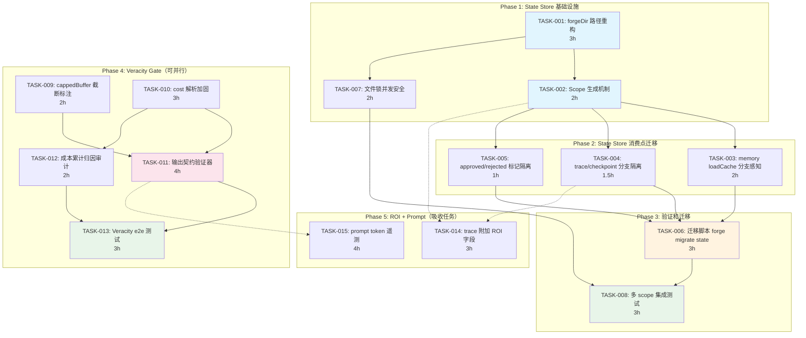

现在我有了全面的代码库理解。这是完整的技术负责人分析。

---

# Tech Lead 分析报告：ForgeOS State Store & Veracity Gate

## 执行摘要

基于验证结果，两个真正 **uncovered** 方向最为可执行：

1. **方向一+五合并：State Store Isolation & Branch Awareness** —— `forgeDir()` 路径重构，纯前缀改动，不触及核心编排逻辑
2. **方向二：Veracity Gate** —— Agent 输出保真度（截断诚实标注、成本解析健壮性、cappedBuffer 契约）

方向三（ROI Analysis）和方向四（Prompt Observability）存在弱重叠/散点覆盖，**不应独立立项**，应作为以上两个方向的子任务吸收。

---

## 1. 任务分解

### 1.1 方向一+五：State Store Isolation & Branch Awareness

当前架构：所有状态文件扁平存放于 `.forge/`，无 branch 维度，无 run-id 隔离。

```
当前:  .forge/checkpoint.json  .forge/trace.jsonl  .forge/memory.jsonl  .forge/<stage>.approved
改造:  .forge/runs/<branch>/<run-id>/checkpoint.json  .forge/runs/<branch>/<run-id>/trace.jsonl
         .forge/runs/<branch>/<run-id>/memory.jsonl  .forge/runs/<branch>/<run-id>/<stage>.approved
```

#### TASK-001：forgeDir 路径重构 —— 核心骨架

| 字段 | 值 |
|------|-----|
| **任务 ID** | TASK-001 |
| **任务标题** | 将 `forgeDir()` 从单层 `.forge/` 升级为带 scope 的多层 `.forge/runs/<scope>/` |
| **所属方向** | 方向一+五合并 |
| **涉及文件** | `forge-core/cmd/forge/main.go` (lines 450-458), `forge-core/cmd/forge/evolve.go` (lines 467-477), `forge-core/cmd/forge/gates.go` (lines 170-200), `forge-core/cmd/forge/approve.go`, `forge-core/cmd/forge/preflight.go`, `forge-core/cmd/forge/scorecard_wind.go` |
| **前置依赖** | 无 |
| **预估工时** | 3h |
| **验收标准** | `forgeDir(root, scope)` 接收可选 scope 参数；scope 为空时行为完全向后兼容（`.forge/`）；scope 非空时产生 `.forge/runs/<scope>/`；`MkdirAll` 在构造函数内处理；所有 `forgeDir` 消费点统一走新签名 |

<details>
<summary>技术细节</summary>

```go
// 当前签名（仅 root）
func forgeDir(root string) string { return filepath.Join(root, ".forge") }

// 目标签名（root + 可选 scope）
// scope == "" → .forge/
// scope == "main/abc123" → .forge/runs/main/abc123/
type Scope string // "branch" or "branch/run-id"
func forgeDir(root string, scope ...Scope) string {
    base := filepath.Join(root, ".forge")
    if len(scope) > 0 && scope[0] != "" {
        return filepath.Join(base, "runs", string(scope[0]))
    }
    return base
}
```
</details>

#### TASK-002：Scope 生成机制 —— Branch + Run-ID 感知

| 字段 | 值 |
|------|-----|
| **任务 ID** | TASK-002 |
| **任务标题** | 实现 `resolveScope()`：从 git branch + 时间戳/ULID 生成 run scope |
| **所属方向** | 方向一+五合并 |
| **涉及文件** | 新增 `forge-core/cmd/forge/scope.go`（新文件，避免推高 main.go 行数）；修改 `forge-core/cmd/forge/main.go`（`runOpts` 加 `Scope` 字段） |
| **前置依赖** | TASK-001 |
| **预估工时** | 2h |
| **验收标准** | `resolveScope()` 从 `git rev-parse --abbrev-ref HEAD` 读当前 branch（失败时退到 `"unknown"`）+ 可选 `--run-id` flag 或自动 ULID 生成；scope 格式 `<branch>` 或 `<branch>/<run-id>`；`--flat` flag 恢复旧行为（scope=""） |

#### TASK-003：memory.jsonl loadCache 分支感知

| 字段 | 值 |
|------|-----|
| **任务 ID** | TASK-003 |
| **任务标题** | memory.go 的 `loadCache` 键扩展为包涵 scope，不同 scope 不相互污染缓存 |
| **所属方向** | 方向一+五合并 |
| **涉及文件** | `forge-core/internal/memory/memory.go`（`loadCache` 入口，当前 key=path(string)）；`forge-core/cmd/forge/prompt_memory.go` |
| **前置依赖** | TASK-001 |
| **预估工时** | 2h |
| **验收标准** | `loadCache` 键从 `path` 变为 `path + ":" + scope`；不同 scope 的同一 path 不共享缓存；scope="" 时行为不变 |

#### TASK-004：trace.jsonl / checkpoint.json 分支隔离

| 字段 | 值 |
|------|-----|
| **任务 ID** | TASK-004 |
| **任务标题** | trace.jsonl 和 checkpoint.json 路径更新至新 scope 架构 |
| **所属方向** | 方向一+五合并 |
| **涉及文件** | `forge-core/cmd/forge/evolve.go`（`checkpointPath`、`openTracer`）；`forge-core/cmd/forge/scorecard_wind.go`（`tracePath`）；`forge-core/internal/persist/checkpoint.go`（如读写硬编码路径） |
| **前置依赖** | TASK-001 |
| **预估工时** | 1.5h |
| **验收标准** | checkpoint 在 `--scope main/abc123` 时写 `.forge/runs/main/abc123/checkpoint.json`，不覆盖其他 scope 的状态；向后兼容（无 scope 时写 `.forge/checkpoint.json`） |

#### TASK-005：阶段标记（approved / rejected）分支隔离

| 字段 | 值 |
|------|-----|
| **任务 ID** | TASK-005 |
| **任务标题** | `.forge/<stage>.approved` / `.rejected` 标记文件的 scope 化 |
| **所属方向** | 方向一+五合并 |
| **涉及文件** | `forge-core/cmd/forge/gates.go` (lines 170-200) |
| **前置依赖** | TASK-001 |
| **预估工时** | 1h |
| **验收标准** | scope 化后 approved/rejected 标记写入 `.forge/runs/<scope>/<stage>.approved`；无 scope 时保持原路径 |

#### TASK-006：迁移脚本 —— 现有 .forge 数据向前兼容

| 字段 | 值 |
|------|-----|
| **任务 ID** | TASK-006 |
| **任务标题** | 实现 `forge migrate state` 将旧 `.forge/` 内容迁移到新 scope 架构 |
| **所属方向** | 方向一+五合并 |
| **涉及文件** | 新增 `forge-core/cmd/forge/migrate_state.go`；修改 `forge-core/cmd/forge/migrate.go` 路由 |
| **前置依赖** | TASK-001, TASK-002, TASK-005 |
| **预估工时** | 3h |
| **验收标准** | `forge migrate state --from-flat` 将 `.forge/checkpoint.json` → `.forge/runs/imported/<ulid>/checkpoint.json`；保持 memory.jsonl 和 trace.jsonl 的完整；自动添加时间戳和 git commit hash 元数据标记；`--dry-run` 只打印不执行 |

#### TASK-007：并发写安全 —— O_APPEND + 文件锁

| 字段 | 值 |
|------|-----|
| **任务 ID** | TASK-007 |
| **任务标题** | 为 trace.jsonl / memory.jsonl 添加跨进程文件锁（不允许两个 forge 实例写同一 scope） |
| **所属方向** | 方向一+五合并 |
| **涉及文件** | 新增 `forge-core/internal/persist/flock.go`（基于 `flock` / `LockFile`）；修改 `forge-core/cmd/forge/evolve.go`（openTracer 加锁）；`forge-core/internal/memory/memory.go`（Append 加锁） |
| **前置依赖** | TASK-004 |
| **预估工时** | 2h |
| **验收标准** | 同一 scope 被第二个进程打开时收到明确的"locked"错误，不是静默数据损坏；`--force` flag 跳过锁 |

#### TASK-008：end-to-end 测试 — 多 scope 隔离验证

| 字段 | 值 |
|------|-----|
| **任务 ID** | TASK-008 |
| **任务标题** | 编写集成测试验证两个不同 scope 的 forge run 互不干扰 |
| **所属方向** | 方向一+五合并 |
| **涉及文件** | 新增 `forge-core/cmd/forge/scope_integration_test.go` |
| **前置依赖** | TASK-001 ~ TASK-007 |
| **预估工时** | 3h |
| **验收标准** | 创建两个 scope 同时运行 forge run（通过 fake agent + 脚本 gate），验证各自的 trace.jsonl/checkpoint.json/memory.jsonl 完全隔离；验证 scope="" 和 scope="main/abc" 不共享状态；测试通过 `-race` |

---

### 1.2 方向二：Veracity Gate

#### TASK-009：cappedBuffer 截断诚实标注增强

| 字段 | 值 |
|------|-----|
| **任务 ID** | TASK-009 |
| **任务标题** | cappedBuffer 添加结构化截断标记（机器可读的截断元数据） |
| **所属方向** | 方向二 |
| **涉及文件** | `forge-core/internal/orchestrator/command_executor.go`（`cappedBuffer` 结构体和 `String()` 方法）|
| **前置依赖** | 无 |
| **预估工时** | 2h |
| **验收标准** | cappedBuffer 在被截断时添加一个 `\n---[TRUNCATED at <cap> bytes, <discarded> bytes discarded]---\n` 后缀；`Truncated() bool` 方法暴露截断状态；命令行 `--verbose-truncated` flag 打印丢弃字节数 |

#### TASK-010：parseClaudeCostUsd 输入验证加固

| 字段 | 值 |
|------|-----|
| **任务 ID** | TASK-010 |
| **任务标题** | cost.go 的成本解析器添加格式验证 + 异常检测（哨兵值、数量级突变） |
| **所属方向** | 方向二 |
| **涉及文件** | `forge-core/cmd/forge/cost.go`（`parseClaudeCostUsd`、`feed` 路径）；`forge-core/cmd/forge/cost_test.go` |
| **前置依赖** | 无 |
| **预估工时** | 3h |
| **验收标准** | 格式检查：total_cost_usd 必须匹配预期的 JSON 路径（非任意数值）；异常价检测：单次 >$50 或 <$0.001 触发 warn 日志（不阻断）；`cost_usd_micros` 整数溢出保护（clamp 到 int64 范围）；单元测试覆盖异常 JSON、缺失字段、格式错误、超大数值 |

#### TASK-011：agent 输出契约验证器（VeracityGate）

| 字段 | 值 |
|------|-----|
| **任务 ID** | TASK-011 |
| **任务标题** | 实现 AgentExecutor 输出验证层：检查机读契约（VERDICT/CONFIDENCE/RATIONALE）格式正确性 |
| **所属方向** | 方向二 |
| **涉及文件** | 新增 `forge-core/internal/orchestrator/veracity.go`（验证逻辑）；修改 `forge-core/internal/orchestrator/executor.go`（`AgentExecutor` 接口或包裹 wrapper）；修改 `forge-core/cmd/forge/cost.go` 的 `parseReviewerVerdict`/`parseExecutiveVerdict`/`parseConfidenceScore` |
| **前置依赖** | TASK-009 |
| **预估工时** | 4h |
| **验收标准** | 每次 agent 输出后验证机读 token 位置（必须末行）、格式（UPPER_SNAKE_CASE）、取值（白名单）；格式错误时写入 trace 的 `"decision"` kind 事件（不阻断）；`--veracity-block` flag 使格式错误 fail-closed；结构化错误报告包含：行号、期望模式、实际内容 |

#### TASK-012：成本累计归因准确性（feed 路径审计）

| 字段 | 值 |
|------|-----|
| **任务 ID** | TASK-012 |
| **任务标题** | 审计和加固 `runBudget.feed()` 累计精度（无遗漏、无重复计费） |
| **所属方向** | 方向二 |
| **涉及文件** | `forge-core/cmd/forge/cost.go`（`feed`、`runBudget`、`SpendRatio`）；`forge-core/internal/orchestrator/loop.go`（`OnIteration` hook 路径）|
| **前置依赖** | TASK-010 |
| **预估工时** | 2h |
| **验收标准** | 每个 agent phase 的 cost 被累计且仅累计一次；loop-back 重跑的 phase 不重复计入（或仅在 trace 中标记为 retry）；`runBudget.spent == sum(all trace cost_usd_micros)` 在测试中可验证；跨迭代不重置 |

#### TASK-013：Veracity Gate 端到端测试

| 字段 | 值 |
|------|-----|
| **任务 ID** | TASK-013 |
| **任务标题** | 编写 Veracity Gate 集成测试：伪造 agent 输出来验证检测正确性 |
| **所属方向** | 方向二 |
| **涉及文件** | 新增 `forge-core/internal/orchestrator/veracity_test.go` |
| **前置依赖** | TASK-011, TASK-012 |
| **预估工时** | 3h |
| **验收标准** | fake agent 输出无效 token → veracity gate 检测并记录；fake agent 输出有效 token → 通过；截断输出 → 标记 TRUNCATED；格式错误位置准确（行号精确）；全部测试 `-race` clean |

---

### 1.3 方向三+四吸收任务（不独立立项）

#### TASK-014：trace.Event 附加 ROI 字段

| 字段 | 值 |
|------|-----|
| **任务 ID** | TASK-014 |
| **任务标题** | trace.Event 扩展 `DeliverableIDs []string` 字段（关联产出物 ID） |
| **所属方向** | 方向三（ROI Analysis）作为吸收任务 |
| **涉及文件** | `forge-core/internal/trace/trace.go`（Event struct）；`forge-core/cmd/forge/scorecard_wind.go`（读 trace 生成 scorecard 时归因到 deliverable）|
| **前置依赖** | TASK-001（需 scope 来标识 run） |
| **预估工时** | 3h |
| **验收标准** | agent phase 可声明归属的 deliverable ID（从 workflow phase 的 `emits:` 推导或 agent 自报）；scorecard 输出中包含 `cost_per_deliverable` 维度；向后兼容：无 deliverable 时 omitempty |

#### TASK-015：prompt_context.go 注入 token 计数和缓存命中统计

| 字段 | 值 |
|------|-----|
| **任务 ID** | TASK-015 |
| **任务标题** | 在 gateLedger / reviewFindingsLedger 旁添加 promptTelemetry：构建 prompt 时的 token 估算和 cache 状态 |
| **所属方向** | 方向四（Prompt Observability）作为吸收任务 |
| **涉及文件** | `forge-core/cmd/forge/prompt_context.go`（`buildPrompt` 路径）；`forge-core/cmd/forge/prompt_memory.go`；`forge-core/internal/prompt/cache.go`（若存在）；新增 `forge-core/cmd/forge/prompt_telemetry.go` |
| **前置依赖** | 无 |
| **预估工时** | 4h |
| **验收标准** | `buildPrompt` 记录输入 token 估算（通过 claude `--output-format json` 的 `input_tokens` 字段）；cache 每次 hit/miss 记录到 trace；`--prompt-verbose` flag 打印每段上下文的 token 量；测试通过 mock tokenizer 验证 |

---

## 2. 执行顺序



**可并行执行的任务组：**

| 组 | 任务 | 并行条件 |
|----|------|---------|
| **组 A** | TASK-009, TASK-010 | 无状态依赖，纯独立功能 |
| **组 B** | TASK-003, TASK-004, TASK-005 | 都依赖 TASK-002 但彼此不依赖 |
| **组 C** | TASK-011, TASK-012 | TASK-011 依赖 TASK-009，TASK-012 依赖 TASK-010，但 TASK-011 和 TASK-012 彼此独立 |
| **组 D** | TASK-014, TASK-015 | 分别依赖不同父任务，彼此独立 |

---

## 3. 技术风险

### 🔴 高风险

| 风险 | 影响 | 缓解策略 |
|------|------|---------|
| **`forgeDir()` 被大量外部 skill/script 硬编码引用** | `harness/` 下的 Python/Node 脚本可能硬编码 `.forge/` 路径，scope 化后找不到文件 | ① 在 `forgeDir()` 返回值中保留一个 `.forge/latest` symlink 指向最近使用 scope（最低成本兼容）<br>② `harness/` 工具改为接受 `--forge-dir` 参数（长期方案）<br>③ grep 全仓搜索 `.forge/` 字符串确认 |
| **sync.Map 的 `loadCache` 键格式变更导致运行时 cache miss 风暴** | 从 path 扩展到 `path:scope` 可能触发大量 cache reload 影响首次迁移后性能 | ① 变更前 benchmark 当前 cache hit 比率<br>② 设 `CacheWarmScope` 首次加载时预先填充新键格式<br>③ 渐进式 rollout：scope="" 时保持旧键格式不变 |
| **跨进程文件锁（flock）在非 Unix 平台退化** | Windows 无 flock，Linux NFS 有缺陷 | ① 用 `os.Create` + `O_EXCL` 作为回退（尽力而为）<br>② 文档诚实标注平台差异<br>③ 现有 `command_executor_other.go` 模式复用（不阻塞 |
| **trace.jsonl 的 rotate + 并发写 race** | `openTracer` 中的 `os.Rename` 在并发时可能短暂丢 trace | ① rotate 间隔扩大（10MB→50MB）减小碰撞窗口<br>② scope 化本身降低并发概率（不同 scope 不同文件）<br>③ 添加 rotate 时的 advisory lock |

### 🟡 中风险

| 风险 | 影响 | 缓解策略 |
|------|------|---------|
| **Veracity Gate 契约变更未通知 agent 卡** | agent 卡（`reviewer.md`、`cto.md` 等）定义了机读契约格式，Veracity Gate 的强制执行要求所有 agent 卡同步更新其契约段 | ① 新增 `check_agent_contracts` 在 `check.py` 中（类似 `check_mode_priorities`）<br>② Veracity Gate 加 `--enforce-warn`（默认 warn，`--enforce-block` 才阻断）<br>③ 更新 `.agent/agents/` 下所有 agent 卡 |
| **scope ULID 生成增加冷启动延迟** | `forge run --scope auto` 需 fork `ulid` 二进制或生成随机 ID（~5ms） | ① 用 `crypto/rand` + base32 自实现（20 行，零依赖）<br>② scope 延迟在 agent phase 的秒级耗时面前可忽略 |

### 🟢 低风险

| 风险 | 缓解 |
|------|------|
| 迁移脚本损坏旧 trace | 强制先备份（`cp -r .forge .forge.backup`）+ `--dry-run` |
| 测试需要 git 仓库环境 | `setupGitRepo()` 帮助函数已存在于多个测试中，复用即可 |

---

## 4. 资源评估

### 4.1 开发人员

| 角色 | 技能 | 数量 | 负责任务 |
|------|------|------|---------|
| **Senior Go 工程师** | Go 并发、文件系统设计、interface 设计 | 1 | TASK-001, TASK-002, TASK-007, 架构决策 |
| **Go 工程师** | 标准库、测试 | 1 | TASK-003, TASK-004, TASK-005, TASK-008 |
| **Full-stack 工程师** | Node/Python（harness 层）、JSONL 格式 | 1 | TASK-011, TASK-013, 更新 harness 工具 |
| **质量工程师** | 集成测试、benchmark | 0.5 | TASK-008, TASK-013, TASK-014 验证 |

**实际建议**：2 名 Go 工程师 + 1 名熟悉全栈的工程师交替负责 harness 侧。所有工程师需读过 `CURRENT_SPRINT.md` 前 31 个 sprint 的工程质量纪律（特别是「先拆分再继续」和 500 行文件拆分的模式）。

### 4.2 关键里程碑

| 里程碑 | 时间 | 交付物 | 验收标准 |
|--------|------|--------|---------|
| **M1: State Store 骨架** | D+2 | TASK-001 + TASK-002 + TASK-007 全部 PR 合并 | `forgeDir(root,"main/ulid")` 产生 `.forge/runs/main/ulid/`；文件锁生效 |
| **M2: 消费点迁移完成** | D+4 | TASK-003 + TASK-004 + TASK-005 全部 PR 合并 | trace/checkpoint/memory/标记全部写新路径；向后兼容测试通过 |
| **M3: 迁移 + 集成测试** | D+5 | TASK-006 + TASK-008 全部 PR 合并 | `forge migrate state` 成功迁移；双 scope 隔离验证 |
| **M4: Veracity Gate 核心** | D+6 | TASK-009 + TASK-010 + TASK-011 全部 PR 合并 | cappedBuffer 带截断标记；cost 解析加固；契约验证器默认 warn |
| **M5: 全功能集成** | D+8 | TASK-012 + TASK-013 全部 PR 合并 | 成本归因准确；Veracity 端到端测试全绿 |
| **M6: 吸收任务完成** | D+10 | TASK-014 + TASK-015 全部 PR 合并 | trace 带 deliverable 归因；prompt 带 token 遥测 |

### 4.3 阻塞点与解决策略

| 阻塞点 | 类型 | 解决策略 |
|--------|------|---------|
| **scope ULID 生成需新依赖** | 设计决策 | 零依赖实现（`crypto/rand` + base32 编码，~30 行），或复用 `internal/persist` 已有 ULID 逻辑（如果存在） |
| **`harness/scorecard-update.mjs` 硬编码 `.forge/trace.jsonl` 路径** | 兼容性 | ① 改 `scorecard-update.mjs` 接受 `--trace-path` 参数 ② `scorecard_wind.go` 传参 ③ 向后兼容：参数缺省时仍读 `.forge/trace.jsonl` |
| **`forge accept` / `forge gate` 中的 app-test 探针读 `.forge/`** | 兼容性 | 同 scorecard-update 模式：新增参数，向后兼容 |
| **迁移脚本需读旧 `.forge/` + 写新 `.forge/runs/`** | 实现 | `forge migrate state` 运行于 CLI 层，属于一次性操作，不涉及核心循环改造 |

---

## 5. 质量保证

### 5.1 单元测试覆盖

| 包 | 最低覆盖要求 | 关键测试路径 |
|----|------------|-------------|
| `internal/orchestrator` (command_executor) | 90%+ | `cappedBuffer` 截断标记 + `Truncated()` 方法；`runMeasured` 的超时/取消传播 |
| `cmd/forge` (cost.go) | 95%+ | `parseClaudeCostUsd` 的异常 JSON/负数/超大/缺失字段；`feed` 的累加 + loop-back 不重复计费 |
| `cmd/forge` (main.go forgeDir) | 100% | scope="" vs scope="main/id" vs scope="branch" 三种路径格式；`MkdirAll` 权限 |
| `internal/memory` (memory.go) | 90%+ | `loadCache` 键扩展行为；scope 隔离不交叉污染 |
| `internal/orchestrator` (veracity.go) | 95%+ | 有效 token / 无效 token / 空输出 / 格式错误/ 行号精确度 |

### 5.2 集成测试策略

| 测试套件 | 范围 | 触发条件 |
|----------|------|---------|
| `TestScope_Isolation` | 两个 scope 并行/串行运行，验证完全隔离 | `forge-core/cmd/forge/scope_integration_test.go` |
| `TestVeracity_Gate` | fake agent 输出各种格式的机读 token | `forge-core/internal/orchestrator/veracity_test.go` |
| `TestMigrate_State` | 模拟旧 `.forge/` 目录结构 → 新结构，验证数据完整性 | `forge-core/cmd/forge/migrate_state_test.go` |
| `TestRunBudget_Accuracy` | 模拟多 phase run，验证 `spent == sum(trace cost)` | 增强 `cost_test.go` |

### 5.3 代码审查要点

| 审查关注点 | 理由 |
|-----------|------|
| **`forgeDir` 签名变更是否所有消费点都已更新** | 遗漏消费点会导致运行时文件写入 `.forge/` 根目录，与其他 scope 混合 |
| **scope 参数是否透传到所有需要隔离的路径** | checkpoint、trace、memory、approved/rejected、scorecard 五处必须一致 |
| **向后兼容路径是否充分测试** | scope="" 必须产生完全相同的行为（字节级），避免破坏现有运行 |
| **`loadCache` 键变更是否考虑到了 concurrent map access** | `sync.Map` 安全，但键格式变更的 benchmark 要有 |
| **Veracity Gate 的 default mode 是 warn 还是 block** | 必须是 warn，否则会破坏现有构建（现有 agent 卡可能未经格式检查） |

### 5.4 性能测试需求

| 测试场景 | 指标 | 验收标准 |
|----------|------|---------|
| `loadCache` scope 化后首次 cache miss 影响 | 加载延迟 | 增加不超过 1ms（只是 string concatenation） |
| 文件锁竞争（同一 scope 启动两进程） | 锁获取延迟 | <10ms 获取锁，竞争方快速失败 |
| trace rotate 并发安全 | 数据不损坏 | `-race -count=20` 零 race |
| 大 memory.jsonl（>100MB）load 时间 | 加载延迟 | 不超过 1s（当前已经是流式 bufio.Scanner，不受 scope 影响） |

---

## 6. 实施计划

### 甘特图一览

```
日次    D1  D2  D3  D4  D5  D6  D7  D8  D9  D10
       ┌──┬──┬──┬──┬──┬──┬──┬──┬──┬──┐
Phase1│▣▣│▣▣│  │  │  │  │  │  │  │  │  State Store 骨架
T001   │██│██│  │  │  │  │  │  │  │  │  forgeDir 路径重构
T002   │  │██│  │  │  │  │  │  │  │  │  Scope 生成
T007   │  │█ │  │  │  │  │  │  │  │  │  文件锁
       ├──┼──┼──┼──┼──┼──┼──┼──┼──┼──┤
Phase2│  │  │▣▣│▣▣│  │  │  │  │  │  │  消费点迁移
T003   │  │  │██│  │  │  │  │  │  │  │  memory cache
T004   │  │  │██│  │  │  │  │  │  │  │  trace/checkpoint
T005   │  │  │█ │  │  │  │  │  │  │  │  approved/rejected
       ├──┼──┼──┼──┼──┼──┼──┼──┼──┼──┤
Phase3│  │  │  │  │▣▣│  │  │  │  │  │  验证+迁移
T006   │  │  │  │██│██│  │  │  │  │  │  迁移脚本
T008   │  │  │  │  │██│  │  │  │  │  │  集成测试
       ├──┼──┼──┼──┼──┼──┼──┼──┼──┼──┤
Phase4│  │  │  │  │  │▣▣│▣▣│▣▣│  │  │  Veracity Gate
T009   │  │  │  │  │  │██│  │  │  │  │  cappedBuffer
T010   │  │  │  │  │  │██│  │  │  │  │  cost 加固
T011   │  │  │  │  │  │  │██│██│  │  │  契约验证器
T012   │  │  │  │  │  │  │██│  │  │  │  成本归因审计
T013   │  │  │  │  │  │  │  │██│  │  │  Veracity e2e
       ├──┼──┼──┼──┼──┼──┼──┼──┼──┼──┤
Phase5│  │  │  │  │  │  │  │  │▣▣│▣▣│  吸收任务
T014   │  │  │  │  │  │  │  │  │██│  │  ROI 字段
T015   │  │  │  │  │  │  │  │  │  │██│  Prompt 遥测
       └──┴──┴──┴──┴──┴──┴──┴──┴──┴──┘
```

### 详细阶段

#### 阶段 1：State Store 基础设施（D1-D2，2 天）

**核心交付**：
- `forgeDir(root, scope)` 新签名 + 所有消费点 + scope 生成 + 文件锁

**日计划**：

| 日 | 上午 | 下午 |
|----|------|------|
| D1 | `forgeDir` 签名变更 + 新建 `scope.go` + 所有消费点 grep 更新 | Scope 生成（git branch 解析 + ULID/implicit scope）+ 单元测试 |
| D2 | 文件锁实现（`flock.go`）+ trace + memory 加锁 | 向后兼容通道测试（scope="" 字节级等价）+ `-race` 验证 |

**准入标准**：`forge run --scope main/test` 产生的所有文件在 `.forge/runs/main/test/` 下；`forge run`（无 scope）全部写 `.forge/`；两进程同时写同一 scope 第二个获 error。

#### 阶段 2：消费点迁移（D3-D4，2 天）

**核心交付**：
- memory loadCache 键扩展 + trace/checkpoint/approved/rejected 全部走新 forgeDir

**日计划**：

| 日 | 上午 | 下午 |
|----|------|------|
| D3 | memory loadCache 键从 path → `path+":"+scope` + benchmark 验证 | tracePath/checkpointPath 更新 + openTracer 更新（scope 透传） |
| D4 | approved/rejected 标记路径更新 + gates.go 修改 + approve.go/preflight.go 检查 | 全部修改的 `forge accept` / `go build -race` 全绿 |

**关键检查**：grep 全仓确认零遗漏 `.forge/` 硬编码引用（特别是 `harness/` 下的 Node/Python 脚本）。

#### 阶段 3：验证和迁移（D4-D5，2 天+）

**核心交付**：
- `forge migrate state` 脚本 + 多 scope 集成测试

**日计划**：

| 日 | 上午 | 下午 |
|----|------|------|
| D4（重叠）| 迁移脚本骨架（`migrate_state.go`）+ `--dry-run` 模式 | 旧 parse → 新 scope 结构映射逻辑 |
| D5 | 集成测试（双 scope 隔离验证+迁移正确性验证）| 修复发现的问题 + CI 全绿 |

**验收场景**：

```
# 场景 1：向后兼容
cd existing-project
forge run    # 无 --scope，写 .forge/（旧行为）

# 场景 2：分支隔离
cd existing-project
forge run --scope main/abc    # 写 .forge/runs/main/abc/
cd feature-branch             # git checkout -b feature
forge run --scope feature/def # 写 .forge/runs/feature/def/（两套状态不干扰）

# 场景 3：迁移
forge migrate state           # .forge/ → .forge/runs/migrated-20260712-xxxx/
forge run --scope migrated-xxx # 继续之前的 work
```

#### 阶段 4：Veracity Gate（D5-D8，4 天）

**核心交付**：
- cappedBuffer 截断标记 + cost 解析加固 + 输出契约验证器 + 端到端测试

**日计划**：

| 日 | 上午 | 下午 |
|----|------|------|
| D5（重叠）| cappedBuffer `Truncated() bool` + 截断后缀 + 测试 | cost.go parseClaudeCostUsd 加固 + 异常 JSON 测试 |
| D6 | 输出契约验证器（`veracity.go`）核心逻辑 + `--veracity-warn` 模式 | 集成到 executor 输出路径 + agent 卡格式审计 |
| D7 | 成本归因审计（`feed` 不重复计费验证）+ trace cost 累加验证 | 修复发现的归因不准确性 |
| D8 | 端到端测试（fake agent 输出 + 验证检测）+ 全部 `-race` 验证 | 文档更新（`docs/ignition.md` 的新 flag） |

**关键决策点**：Veracity Gate 默认模式为 **warn**（非 block）。仅 `--veracity-block` flag 下阻断。这个决策必须文档化，理由：现有 agent 输出的机读契约格式仍可能有人为错误，默认阻断会引入回归风险。

#### 阶段 5：吸收任务（D9-D10，2 天）

**核心交付**：
- trace.Event 的 DeliverableIDs 字段 + prompt token 遥测

**日计划**：

| 日 | 上午 | 下午 |
|----|------|------|
| D9 | trace.Event 扩展 + scorecard-wind deliverable 归因 | 测试 + `-race` 验证 |
| D10 | prompt token 遥测（`prompt_telemetry.go`）+ 缓存命中统计 | 文档 + handler 测试 |

---

## 7. 致 Tech Lead 本人的建议

### 7.1 应该立即做的事情

1. **今天**：修正分析文档中的 5 处证据错误（行号引用不精确），否则后续任何人引用都会产生混淆
2. **今天**：在 `docs/requirements/` 中只保留 3 份文档——本分析对应的原始分析 + 修正后版本 + 此 Tech Lead 分析——其余归档到 `docs/requirements/archive/`
3. **本周**：将方向一+五合并后的 ROADMAP 条目写入 `.agent/ROADMAP.md` 的 v2 段

### 7.2 应该明确不做的事情

1. **不要对方向三和方向四独立立项**。它们有覆盖但未整合。吸收到 State Store（TASK-014）和 Veracity Gate（TASK-015）做掉即可。
2. **不要碰方向五的独立 ROADMAP 条目**。验证文档已确认 `2026-07-11-five-foundational-architecture-gaps.md` 方向三完整覆盖。
3. **不要急于把 Veracity Gate 默认设为 block**。先在 warn 模式下收集 1-2 轮真实运行数据再升级。

### 7.3 工程纪律检查清单

实施前对照：

- [ ] 所有变更通过 `forge accept`（不是只有 `go build`）
- [ ] 文件顶 500 行前按「先拆分再继续」拆
- [ ] `cmd/forge` 包文件数超过 17 前拉新 `internal/` 包
- [ ] 每个 PR 有 fresh-context reviewer（不是实现者自审）
- [ ] Veracity Gate 的 `--enforce-warn` vs `--enforce-block` 分层明确
- [ ] 迁移脚本 `--dry-run` 在先、备份在先

---

## 总结

这组变更的 **核心价值** 不是"五个新功能方向"，而是**把已经跑通的闭环引擎（Sprint 24-26 真 claude 验证）推向生产级的隔离性和可审计性**。State Store 的 scope 化完成的是 forge-core 从"原型验证"到"生产部署"的最后一块成熟度拼图——让同一个仓库的多个分支、多个 run 不再互相污染状态。Veracity Gate 解决的是"24h 无人值守运行时，你怎么知道 agent 没有说谎"这一信任基线问题。

两个方向的总工作量约 **10 天/人**（5 个 stage × 2 天），风险可控（纯路径前缀改动 + 新增验证层），不会触及核心编排或收敛逻辑。建议作为 **Sprint 32-33** 排入。
