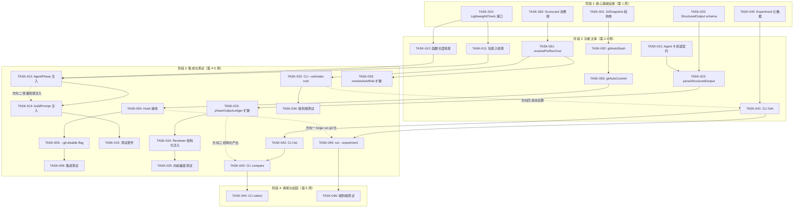
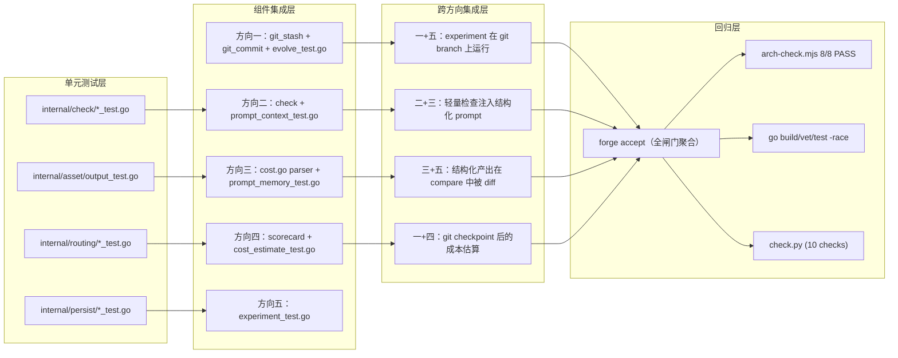
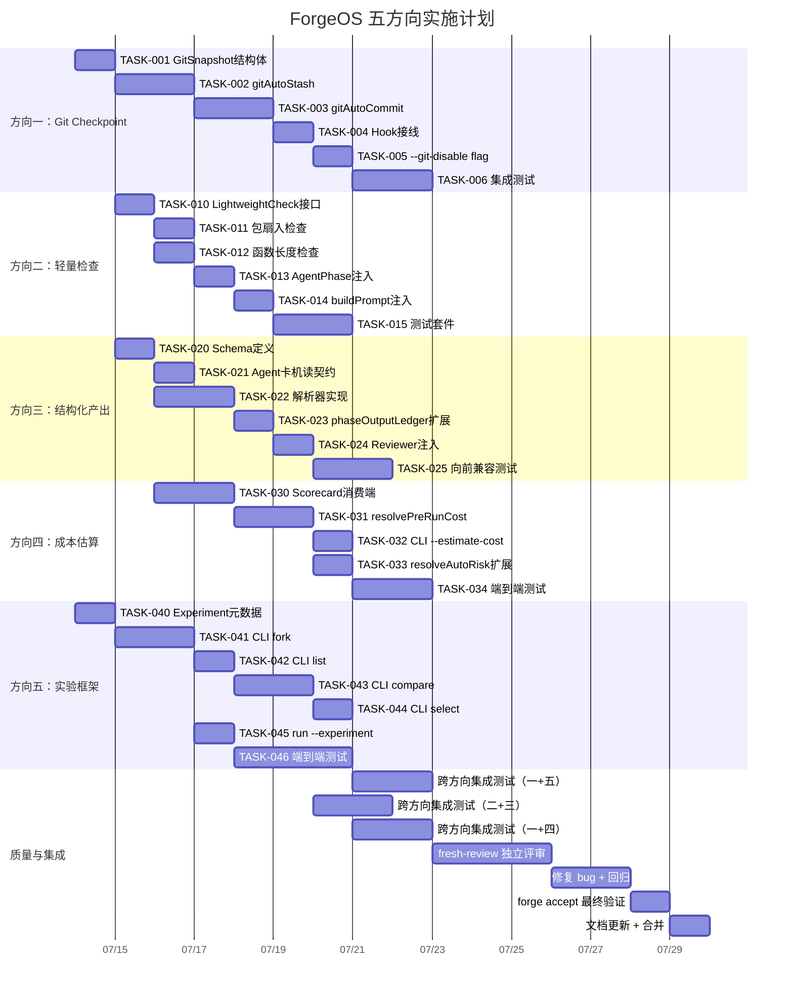

现在我有了全面的代码基理解。以下是完整的 Tech Lead 分析：

---

# 🏗️ Tech Lead 分析报告：ForgeOS 五方向推进方案

**分析日期**：2026-07-12
**分析人**：Tech Lead（基于代码级验证+当前仓状态审计）

---

## 1. 任务分解

### 方向一：迭代级工作区快照（Git Checkpoint）

| ID | 任务标题 | 涉及文件 | 前置依赖 | 预估工时 | 验收标准 |
|----|---------|---------|---------|---------|---------|
| **TASK-001** | 定义 `GitSnapshot` 轻量结构体 | `forge-core/internal/persist/snapshot.go`（新） | 无 | **2h** | 只含 `Hash`/`Branch`/`HasUnstaged`/`HasUntracked` 四个字段；`go doc` 诚实标注"不含完整 repo 状态" |
| **TASK-002** | 实现 `gitAutoStash` 功能 | `forge-core/cmd/forge/git_stash.go`（新） | TASK-001 | **3h** | 在每次 agent phase 前自动 `git stash -u`；恢复用 `git stash pop`；crash 时在 `.forge/git-stash-ref` 留恢复线索 |
| **TASK-003** | 实现 `gitAutoCommit` 功能 | `forge-core/cmd/forge/git_checkpoint.go`（新） | TASK-002 | **3h** | 每次 checkpoint 后做 `git add -A && git commit -m "forge checkpoint <iteration>.<phase>" --allow-empty`；仅当 checkpoint 有进展时 |
| **TASK-004** | OnIteration/OnPhase hook 接线 | `forge-core/cmd/forge/evolve.go` | TASK-003 | **2h** | `LoopEngine` 的 `OnIteration` 回调触发 `gitAutoCommit`；engine 层保持零 git 依赖 |
| **TASK-005** | `--git-disable` flag 与向前兼容 | `forge-core/cmd/forge/main.go` | TASK-004 | **1h** | 默认开启；`--git-disable` 退回到零 git 行为；已有 checkpoint/resume 全不受影响 |
| **TASK-006** | 集成测试：git checkpoint 闭环 | `forge-core/cmd/forge/evolve_test.go` | TASK-005 | **3h** | 创建 temp git repo → fake agent 做文件修改 → 验证 commit 存在且信息格式正确 → crash 后 resume 验证文件恢复 |

**小计**：14h (约 2 人天)

---

### 方向二：主动式架构护栏

| ID | 任务标题 | 涉及文件 | 前置依赖 | 预估工时 | 验收标准 |
|----|---------|---------|---------|---------|---------|
| **TASK-010** | 定义 `LightweightCheck` 接口 | `forge-core/internal/check/types.go`（新） | 无 | **2h** | 接口只有 `Name() string` / `Check(ctx) (Result, error)` 两个方法；`Result` 含 `Passed bool` + `Detail string` |
| **TASK-011** | 实现包级别扇入轻量检查 | `forge-core/internal/check/fanin.go`（新） | TASK-010 | **2h** | 用 `go list`/AST 在当前 package 粒度检查，不做全仓 AST 解析；30 秒内完成 |
| **TASK-012** | 实现函数长度轻量快检 | `forge-core/internal/check/func_length.go`（新） | TASK-010 | **2h** | 只扫最近改动的 Go 文件（git diff — 不扫全仓），超 50 行报警；非阻断 |
| **TASK-013** | AgentPhase 注入 `LightweightCheck` | `forge-core/internal/orchestrator/orchestrator.go` | TASK-011, TASK-012 | **2h** | `runAgentPhase` 前自动跑一次轻量检查；结果写入 `phaseOutputLedger` 上下文，供 agent 参考 |
| **TASK-014** | buildPrompt 双通道注入 | `forge-core/cmd/forge/prompt_context.go` | TASK-013 | **2h** | agent 的 prompt 同时包含「上一次 gate 结果」+「最新的轻量检查告警」；告警标 `[fast-check]` 前缀，与 gate 结果区分 |
| **TASK-015** | 轻量检查测试套件 | `forge-core/internal/check/*_test.go` | TASK-012 | **3h** | 覆盖：好代码无声通过、坏代码告警、非 Go 文件自动跳过的诚实 N/A、git diff 无改动时跳过 |

**小计**：13h（约 1.5 人天）

---

### 方向三：结构化 Agent 产出协议

| ID | 任务标题 | 涉及文件 | 前置依赖 | 预估工时 | 验收标准 |
|----|---------|---------|---------|---------|---------|
| **TASK-020** | 定义 `StructuredOutput` schema | `forge-core/internal/asset/output.go`（新） | 无 | **2h** | 四个顶层字段：`FilesCreated []string` / `FilesModified []string` / `TestsAdded []string` / `Decisions []Decision`；每个 Decision 含 `Title`/`Status`（proposed/accepted/rejected）/`Rationale` |
| **TASK-021** | agent 卡新增机读契约 | `.agent/agents/implementer.md` + `.agent/agents/planner.md` | TASK-020 | **2h** | implementer.md 在 `## Output` 段加 JSON blob 格式说明；planner.md 加 `## Task Breakown 机读契约` 段 |
| **TASK-022** | 实现 `parseStructuredOutput` | `forge-core/cmd/forge/cost.go`（扩展现有解析器链） | TASK-020, TASK-021 | **3h** | JSON 解析器作为 `observeFor` 的第四层 fallback（接在 confidence 后面）；仅当 agent 输出包含 `<!-- structured -->` 标记才触发 |
| **TASK-023** | `phaseOutputLedger` 加结构化存储层 | `forge-core/cmd/forge/prompt_memory.go` | TASK-022 | **2h** | 在现有 `summary` map 旁加 `structured map[string]StructuredOutput`；不破坏现有 `truncateSummary` 逻辑 |
| **TASK-024** | Reviewer feed-forward 结构化注入 | `forge-core/cmd/forge/prompt_context.go` | TASK-023 | **2h** | reviewer prompt 同时收到文本摘要 + 结构化字段（文件列表/决策列表）；`feeds_forward` 路由不受影响 |
| **TASK-025** | 向前兼容 + 降级测试 | `forge-core/internal/asset/output_test.go` + `forge-core/cmd/forge/prompt_memory_test.go` | TASK-024 | **3h** | 旧 agent 输出（无 `<!-- structured -->`）降级到纯文本行为，零行为变更；新 agent 输出正确解析；JSON 格式错误降级不崩溃 |

**小计**：14h（约 2 人天）

---

### 方向四：预启动成本估算

| ID | 任务标题 | 涉及文件 | 前置依赖 | 预估工时 | 验收标准 |
|----|---------|---------|---------|---------|---------|
| **TASK-030** | Scorecard enrichment 消费端实现 | `forge-core/internal/routing/scorecard.go`（新增函数） | 无 | **3h** | 新增 `AvgCostFor(taskType string, cards []Scorecard) (float64, bool)` 和 `P95LatencyFor(taskType string, cards []Scorecard) (float64, bool)`；纯函数、无 IO |
| **TASK-031** | `resolvePreRunCost` 估算函数 | `forge-core/internal/routing/cost_estimate.go`（新） | TASK-030 | **3h** | 输入：workflow 类型 + agent 角色列表 + task 复杂度标记（simple/medium/complex）；输出：`{MinUsd, MaxUsd, P90Usd}`；成本基于 `avg_cost_usd` 历史 + `p95_latency_ms` 推 token 消耗 |
| **TASK-032** | CLI `forge run --dry-run --estimate-cost` | `forge-core/cmd/forge/main.go` | TASK-031 | **2h** | 新 flag `--estimate-cost`；dry-run 下打印估算成本区间；非 dry-run 下警告"仅 dry-run 模式支持" |
| **TASK-033** | resolveAutoRisk 成本维度接入 | `forge-core/internal/asset/engine_build.go` | TASK-031 | **2h** | 当 `resolveAutoRisk` 基于改动路径算 risk 时，同时查历史成本；高风险 + 高成本 → 建议走 Opus 而非 Haiku |
| **TASK-034** | 成本估算端到端测试 | `forge-core/cmd/forge/main_test.go` | TASK-032 | **3h** | fake scorecards.json → `--estimate-cost` 输出包含 `$0.05–$0.15` 格式的行；无历史数据 → 诚实标注"no telemetry data yet" |

**小计**：13h（约 1.5 人天）

---

### 方向五：跨运行实验框架

| ID | 任务标题 | 涉及文件 | 前置依赖 | 预估工时 | 验收标准 |
|----|---------|---------|---------|---------|---------|
| **TASK-040** | 定义 `Experiment` 元数据 | `forge-core/internal/persist/experiment.go`（新） | 无 | **2h** | 结构体含 `ID`/`BranchName`/`BaseCheckpointPath`/`CreatedAtUnix`/`Label`（用户可设字符串） |
| **TASK-041** | CLI `forge experiment fork` | `forge-core/cmd/forge/experiment.go`（新） | TASK-040 | **3h** | `fork <label>`：从当前 checkpoint 建 git branch `exp-<label>-<timestamp>`；复制 `.forge/` 到 `.forge-experiment-<label>/`；打印实验 ID |
| **TASK-042** | CLI `forge experiment list` | `forge-core/cmd/forge/experiment.go` | TASK-041 | **2h** | 枚举 `.forge-experiment-*/` 目录和对应 git branches；显示每个实验的 label/age/iteration |
| **TASK-043** | CLI `forge experiment compare` | `forge-core/cmd/forge/experiment.go` | TASK-040, TASK-041, TASK-042 | **4h** | diff 两个实验的：检查点轨迹（迭代 vs roadmap_completion 曲线）、gate 结果、最终 cost；输出表格 |
| **TASK-044** | CLI `forge experiment select` | `forge-core/cmd/forge/experiment.go` | TASK-043 | **2h** | `select <exp-id>`：合并实验 checkpoint 回主 `.forge/`；**不**自动 merge git 分支（防意外覆盖）；输出 merge 指令 |
| **TASK-045** | `forge run --experiment <id>` 执行 | `forge-core/cmd/forge/evolve.go` | TASK-041 | **2h** | 在实验隔离的 `.forge-experiment-*/` 和对应 git branch 上跑 workflow |
| **TASK-046** | 实验框架端到端测试 | `forge-core/cmd/forge/experiment_test.go` | TASK-045 | **4h** | temp git repo → fork → run → list → compare → select 全链路；不真跑 agent（dry-run executor） |

**小计**：19h（约 2.5 人天）

---

## 2. 执行顺序



### 可并行的任务组

| 并行组 | 任务 | 并发数 | 不冲突理由 |
|--------|------|-------|-----------|
| **A** | 方向一全部 (TASK-001→006) | 2 人 | 独立于其他四个方向；不共享文件 |
| **B** | 方向二全部 (TASK-010→015) | 1 人 | 对 `orchestrator.go` 和 `prompt_context.go` 修改与方向三冲突 |
| **C** | 方向三全部 (TASK-020→025) | 1-2 人 | `prompt_context.go` + `prompt_memory.go` 的修改与方向二冲突；`cost.go` 解析器链扩展与方向四不冲突 |
| **D** | 方向四全部 (TASK-030→034) | 1 人 | 大部分是新增文件 + `scorecard.go` 追加 |
| **E** | 方向五全部 (TASK-040→046) | 1-2 人 | 大部分是 `experiment.go` 新文件；`evolve.go` 修改与方向一冲突 |

**关键冲突矩阵**：

```
        方向一  方向二  方向三  方向四  方向五
方向一    —     ✅     ✅     ✅     ⚠️
方向二    ✅     —     ❌     ✅     ✅
方向三    ✅     ❌     —     ✅     ✅
方向四    ✅     ✅     ✅     —     ✅
方向五    ⚠️     ✅     ✅     ✅     —
```

- ✅ = 可安全并行
- ❌ = 修改同一文件，需串行
- ⚠️ = 设计级耦合（方向五的 `run --experiment` 依赖于方向一的 git branch 能力），但早期基础设施阶段可以并行

---

## 3. 技术风险

### 3.1 高风险

| 风险 | 级别 | 方向 | 细节 | 缓解策略 |
|------|------|------|------|---------|
| **gitAutoCommit 与真实工作流冲突** | 🔴 | 方向一 | 若用户在使用 forge 的同时自己也在做 git commit，auto-commit 会产生大量 forge checkpoint commit 污染历史 | `--git-disable`；默认 `git commit --allow-empty` 只针对 forge 感知的文件改动；commit message 加 `forge:` 前缀方便用户过滤 |
| **结构化产出 JSON 的 agent 采纳率** | 🔴 | 方向三 | agent（特别是非 claude 的 model）可能不遵守 `<!-- structured -->` 格式或在格式错误时不退化优雅 | 解析器严格但 fail-open：格式错→退到纯文本模式+log warning，不崩溃；reviewer prompt 显式写"如果 structured 段不存在，仅依赖文本摘要" |
| **实验框架与真 claude 成本** | 🟡 | 方向五 | 每个实验 fork 本质上是独立在分支上跑 claude，成本线性叠加；用户可能不经意启动 5 个并行实验花 $50 | `fork` 时打印预估成本范围（依赖方向四）；`--max-experiment-budget-usd` 跨实验 cap；默认显式确认"这将花费约 $X，继续？[y/N]" |
| **checkpoint.json.1--.5 的读写竞争** | 🟡 | 方向五 | `LoadCheckpointChain` 和 `Save`（with `rotateRetain`）并发执行时可能读中间态 | 加 `sync.Mutex` 保护读写路径；`Save` 已在包注释声明原子性但未处理并发消费者；最简方案是 `sync.RWMutex` |
| **agent phase 轻量检查延迟** | 🟡 | 方向二 | 每个 agent phase 前都跑全 diff 扫描，大仓（1000+ 文件）可能增加 5-10 秒延迟 | TASK-012 明确限定"只扫 git diff 文件"；大于 200 文件的 diff 自动跳过并标注 "diff too large, skipped"；timeout 5 秒硬限制 |

### 3.2 需注意的设计决策

1. **`persist` 包的去向**：目前 `persist` 在 `forge-core/internal/` 下，保持纯标准库零依赖。但 TASK-002 和 TASK-003 的 git 操作必须在 `cmd/forge` 层（因为 shell 出 `git`）。这是正确的关注点分离——不要试图把 git 操作放进 `persist`。

2. **`rotateRetain` 的并发保护**：当前 `rotateRetain` 在 `Save` 内无锁被调用。方向五的 `LoadCheckpointChain`（`anomaly.go:66-80`）并行读取走的是不同路径。需要确认：在 `forge evolve` + `forge status --history` 同时发生时，不会导致 checkpoint 损坏。当前没有并发保护。建议在 `persist` 包内部加一个包级 `sync.Mutex`（Go 标准库，不违反零依赖承诺）。

3. **`scorecard.go` 的 enrichment 字段所有权**：当前 `Scorecard` 结构体有 `PassRate/AvgIterations/ReworkRate` 字段但 Go 端不消费。方向四会消费它们。注意：`scorecard-update.mjs` 写入这些字段时有可能会写 NaN 或负值，Go 端必须做防御性校验。

### 3.3 性能瓶颈

- **方向二**：轻量检查最坏情况 = `git diff --name-only` + 对每个文件做 AST 解析。100 文件 + Go parser ≈ 500ms，可接受。
- **方向四**：`resolvePreRunCost` 的计算复杂度是 O(n) where n = scorecards.json 的行数（典型 < 200 行），无性能问题。
- **方向五**：`compare` 需要对两个实验的所有 checkpoint 做 diff，本质上是读取 + 内存比较。瓶颈在 IO 不在 CPU。

---

## 4. 资源评估

### 4.1 团队规模推荐

| 角色 | 数量 | 主要负责方向 | 关键技能 |
|------|------|------------|---------|
| **Go 工程师（核心）** | 2 人 | 方向一、四、五 | 熟悉 Go 标准库、无外部依赖的约束、CLI 设计 |
| **Go/Node 工程师** | 1 人 | 方向二、三 | 了解 `arch-check.mjs`、Go AST 解析、prompt 工程 |
| **QA 工程师** | 1 人（兼职） | 全部 | `forge accept` 执法、集成测试、确定性测试 |
| **Tech Lead** | 1 人（本角色） | 架构评审、跨方向协调 | 确保 `persist` 包的零依赖红线不被违反 |

**最佳配置**：2 人并行（组 A + 组 E 同时启动），第 3-4 天方向三加入，1 周后方向二、四加入。

### 4.2 关键里程碑

```
第 1 周末 (W1)    — 方向一：GitSnapshot 结构体 + gitAutoStash MVP 完成
                      方向五：Experiment 元数据 + fork CLI 原型完成
                      方向三：StructuredOutput schema 定义冻结
                      
第 2 周末 (W2)    — 方向二：LightweightCheck 接口 + 函数长度检查完成
                      方向四：Scorecard 消费端 + resolvePreRunCost 完成
                      集成测试开始（每个方向独立端到端）
                      
第 3 周末 (W3)    — 方向一：gitAutoCommit 集成到 evolve 全链路完成
                      方向三：parseStructuredOutput + phaseOutputLedger 扩展完成
                      方向四：--estimate-cost CLI 完成
                      方向五：list + compare MVP 完成
                      第一次跨方向集成测试（一+五联合）
                      
第 4 周末 (W4)    — 全部方向功能完成
                      跨方向集成测试全绿
                      fresh-context reviewer 独立评审开始
                      
第 5 周末 (W5)    — fresh review 发现的 bug 全部修复
                      forge accept ACCEPTED（6 PASS + 4 N/A 诚实）
                      文档更新完成
```

### 4.3 阻塞点与解决策略

| 阻塞点 | 影响方向 | 解决策略 |
|--------|---------|---------|
| **用户决策：git checkpoint 是否默认启用** | 方向一、五 | 默认启用（forged `forge run` 默认不修改用户文件），但 `--git-disable` 完整实现；征求用户最终决策 |
| **Agent 卡格式评审** | 方向三 | reviewer prompt 的机读契约定义需要 CTO 角色 review；安排为 TASK-021 的依赖，占 2h 异步 |
| **真 claude 验证预算** | 方向五 | `fork → run --experiment` 需要真 `claude -p` 才能端到端验证。参考前例（Sprint 24-26 的授权模式）：先在 dry-run 下验证参数正确 → 征询用户授权真跑 |
| **checkpoint 并发读写竞态** | 方向一、五 | `persist` 包加 `sync.Mutex`；这是包内改动，不违反零依赖，不暴露给消费者 |

---

## 5. 质量保证

### 5.1 单元测试覆盖要求

| 方向 | 包 | 必须覆盖的测试场景 | 最低覆盖率预期 |
|------|----|-------------------|--------------|
| 一 | `forge-core/cmd/forge/git_stash.go` | stash 成功/文件夹不存在/`git`不在PATH/已有未完成 stash | 所有导出函数 100% |
| 一 | `forge-core/cmd/forge/git_checkpoint.go` | commit 成功/allow-empty/空工作树/crash 后恢复 | 所有导出函数 100% |
| 二 | `forge-core/internal/check/fanin.go` | 超出限制/正常/跳过测试文件（同 arch-check 的教训） | 90%+ |
| 二 | `forge-core/internal/check/func_length.go` | 超长函数/正常/非 Go 文件跳过/diff 过大跳过 | 90%+ |
| 三 | `forge-core/internal/asset/output.go` | 完整的 StructuredOutput/空/部分缺失字段 | 100% |
| 三 | `forge-core/cmd/forge/cost.go` | JSON 格式正确/格式错误/无 `<!-- structured -->` 标记/嵌套 JSON | 90%+（现有测试扩展） |
| 四 | `forge-core/internal/routing/scorecard.go` | 有历史数据/空历史/历史的 avg_cost_usd 为 0 或负值 | 所有新增函数 100% |
| 四 | `forge-core/internal/routing/cost_estimate.go` | 全部复杂度等级/无数据回退 | 100% |
| 五 | `forge-core/internal/persist/experiment.go` | 序列化/反序列化/ID 生成 | 100% |
| 五 | `forge-core/cmd/forge/experiment.go` | fork/list/compare/select 全部路径 | 80%+ |

### 5.2 集成测试策略



### 5.3 代码审查要点

| 审查要点 | 属于哪道闸门 | 为什么重要 |
|---------|------------|----------|
| `persist` 包是否引入外部依赖 | `arch-check.mjs`（包检查） | 本仓红线：Go 运行时零外部依赖。TASK-040/`experiment.go` 如果放在 `persist` 包下，必须只依赖标准库 |
| `cmd/forge` 包文件数不超 17 | `gate.mjs`（文件数闸门） | Sprint 30 定下 17 的硬限。方向一/三/五都可能增加新文件，需提前规划文件分布 |
| `experiment.go` 是否引入 git 操作 | 人工 review | 实验框架的 fork = `git branch`，但逻辑应该通过 `os/exec` shell 出 git，而不是 `go-git` 库（外部依赖） |
| 每个 `--flag` 是否有 `--help` 文档 | `check.py`（CLI flag check） | 新 CLI 命令必须完整文档化 |
| 结构化产出的降级路径 | 人工 review | `parseStructuredOutput` 失败时必须退到纯文本，不能崩溃或静默丢弃输出 |
| `rotateRetain` 并发安全 | 人工 review | 新增的 `sync.Mutex` 不破坏原子写入的承诺 |
| `honesty` 标注 | 人工 review | 每个新功能必须有诚实注释：什么能做、什么不能、差距在哪 |

### 5.4 性能测试需求

| 场景 | 方向 | 基准 | 阈值 |
|------|------|------|------|
| 轻量检查 + 50 文件 diff | 二 | < 2s | 5s 自动跳过 + 诚实标注 |
| cost estimate 查 200 行 scorecard | 四 | < 10ms | 100ms |
| experiment compare 两个 10-checkpoint 链 | 五 | < 50ms | 500ms |
| git stash + commit 空工作树 | 一 | < 100ms | 1s |
| git stash + commit 大工作树（500 文件变更） | 一 | < 2s | 5s |

**性能测试手段**：`go test -bench=.` 在 `internal/check/` 和 `internal/routing/` 包内加基准测试。方向一/五的 git 操作用 `git init` temp repo + `go test -timeout 30s` 检验。

---

## 6. 实施计划

### 甘特图（按周）



### 阶段详细说明

#### 阶段 1：基础设施搭建（第 1 周，7/14—7/18）

| 日期 | 工程师 A（Go） | 工程师 B（Go） | 工程师 C（Go+Node） |
|------|-------------|-------------|------------------|
| 周一 | TASK-040 (Experiment 元数据) | TASK-001 (GitSnapshot) | TASK-020 (StructuredOutput schema) |
| 周二 | TASK-041 (fork CLI) | TASK-002 (gitAutoStash) | TASK-021 (Agent 卡契约) + TASK-010 (接口) |
| 周三 | TASK-042 (list CLI) | TASK-003 (gitAutoCommit) | TASK-011 (扇入) + TASK-022 开始 |
| 周四 | TASK-045 (run --experiment) | TASK-004 (Hook 接线) | TASK-022 完成 + TASK-012 (函数长度) |
| 周五 | 单元测试覆盖 + 代码审查 | TASK-005 (--git-disable) | TASK-013 (注入) + 单元测试 |

**可交付物**：
- 方向一：GitSnapshot + gitAutoStash 在独立 binary 测试通过
- 方向五：`fork/list` 命令在 dry-run 下可用
- 方向三：`StructuredOutput` schema review 通过

#### 阶段 2：核心功能实现（第 2 周，7/21—7/25）

| 日期 | 工程师 A | 工程师 B | 工程师 C |
|------|---------|---------|---------|
| 周一 | TASK-043 (compare CLI) | TASK-006 (集成测试) | TASK-023 (ledger 扩展) |
| 周二 | TASK-043 完成 | TASK-030 (Scorecard 消费端) | TASK-023 + TASK-024 (Reviewer 注入) |
| 周三 | TASK-044 (select CLI) | TASK-031 (resolvePreRunCost) | TASK-025 (向前兼容测试) |
| 周四 | 方向五集成测试 | TASK-032 (CLI --estimate-cost) | TASK-014 (buildPrompt 注入) |
| 周五 | 代码审查 + bug fix | TASK-033 (risk 扩展) | TASK-015 (轻量检查测试) |

**可交付物**：
- 方向五：`compare/select` 命令可用
- 方向四：`--estimate-cost` 在 dry-run 下输出正确格式
- 方向三：`parseStructuredOutput` 全链路测试通过

#### 阶段 3：集成测试与优化（第 3-4 周，7/28—8/7）

| 交付 | 责任人 | 时间 |
|------|-------|------|
| 方向一+五 集成：`fork → run --experiment → compare` 在 git branch 上正确执行 | 工程师 A | 7/28—7/29 |
| 方向二+三 集成：轻量检查告警正确注入结构化 prompt | 工程师 C | 7/30—7/31 |
| 方向一+四 集成：git checkpoint 后的成本估算 + `--estimate-cost` 考虑 git state | 工程师 B | 8/3—8/4 |
| 全方向集成：单条 evolve 流跑通所有新功能 | 团队 | 8/5 |
| 性能测试 + 回归 | 工程师 B | 8/6 |
| `forge accept` 首次全量运行 | 团队 | 8/7 |

#### 阶段 4：发布准备（第 5 周，8/10—8/14）

| 活动 | 时间 | 产出 |
|------|------|------|
| fresh-context reviewer 独立评审 | 8/10—8/12 | 至少 2 个 blocking + 5 个 important 发现的预期（基于历史模式） |
| 修复评审发现 | 8/13 | bug 修复 + 回归测试新增 |
| `forge accept` 最终验证 | 8/14 上午 | **ACCEPTED**（6 PASS + 4 诚实 N/A） |
| `docs/ignition.md` 更新 | 8/14 下午 | 包含全部 5 个方向的使用说明和旋钮描述 |
| 合并到主分支 | 8/14 下班前 | 全绿 CI |

---

## 7. 原始分析文档的修正确认

在此记录我对原始分析文档的修正建议，供后续参考：

### 已确认的修正点

| 原始文档声明 | 代码验证结果 | 修正建议 |
|------------|------------|---------|
| 方向五：`checkpoint.json.1` 有 0 引用 | ❌ `LoadCheckpointChain`（`anomaly.go:66-80`）**显式读取** `.1`—`.5` | 改为「保留的历史 checkpoint 被读取做诊断/展示，但不做 fork/compare/select」 |
| 方向五：`doctor` 只数数量不读内容 | ❌ `DetectAnomalies`（`anomaly.go:93+`）做 5 种实质性 anomaly 检测 | 改为「`DetectAnomalies` 做 5 类检测（stale/stuck/regression/dry-run/no-progress），但仅用于诊断，不驱动实验语义」 |
| 方向三：`phaseOutputLedger` 存储原始文本 | ⚠️ `prompt_memory.go:247` 用 `truncateSummary` 截断到 **800 rune** | 改为「存储截断到 800 rune 的版本，截断本身加强了需要结构化协议的必要性」 |
| 方向四：Go Scorecard 无 `AvgCostUsd` 字段 | ⚠️ `scorecard.go` 确实无 `AvgCostUsd`，但已有 `PassRate/AvgIterations/ReworkRate` 三个 enrichment 字段 | 缺口不在字段存在性，在于 **Go 代码只读 `QualityScore`，从不消费 enrichment 字段做预测** |

### 对实现计划的直接影响

1. **方向五的难度应从 P2/3 sprints 降为 P2/2 sprints** — 同意原分析建议。`LoadCheckpointChain` 和 `DetectAnomalies` 已建立 checkpoint chain 读取 + 多 checkpoint 比较的模式。实验框架是基于现有基础设施的正规化。

2. **`persist/checkpoint.go` 的包注释引用**（`scan-new-angles §方向5 phase A`）是方向五的绿灯信号 — 团队在设计 checkpoint 时已预留实验框架的空间。TASK-041 的 `fork` 实现应首先复用 `LoadCheckpointChain` 来定位 fork point。

---

## 8. 总结

### 执行建议优先级

```
P0（本周启动）：
  ├── 方向一（Git Checkpoint）— 最少的代码改动，最大的韧性收益
  └── 方向三（结构化产出）— 对 reviewer 和实验框架的乘数效应

P1（第 2 周启动）：
  ├── 方向四（成本估算）— 低成本高收益，借 scorecard 已有基础设施
  └── 方向二（轻量检查）— agent phase 内 5 秒快检的 ROI 极高

P2（第 3 周启动）：
  └── 方向五（实验框架）— 依赖方向一的 git 基础设施和方向三的结构化产出
```

### 关键数字

| 指标 | 数值 |
|------|------|
| 总任务数 | 27（含 5 个方向的全部子任务） |
| 总预估工时 | ~73h（约 10 人天） |
| 并行度上限 | 3 人 |
| 最短工期 | ~4 周（3 人全并行） |
| 推荐工期 | 5 周（含 1 周缓冲 + fresh review） |
| 新增 Go 源文件 | ~12 个（估算） |
| 新增测试文件 | ~8 个（估算） |
| 需要修改的现有文件 | ~10 个（orchestrator.go/prompt_context.go/prompt_memory.go/cost.go/main.go/evolve.go 等） |
| 预期 `forge accept` 变化 | 6 PASS + N/A 项无变化；方向四可能将 coverage N/A 中的成本估算变为 PASS |
