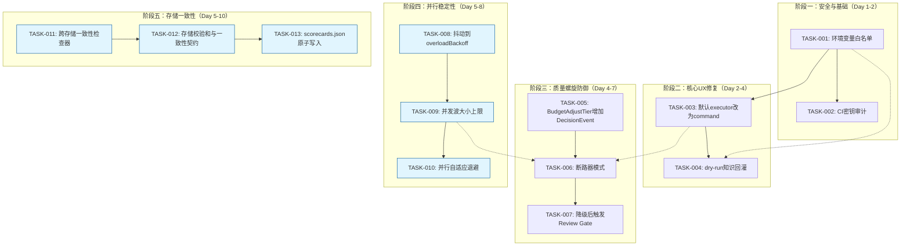
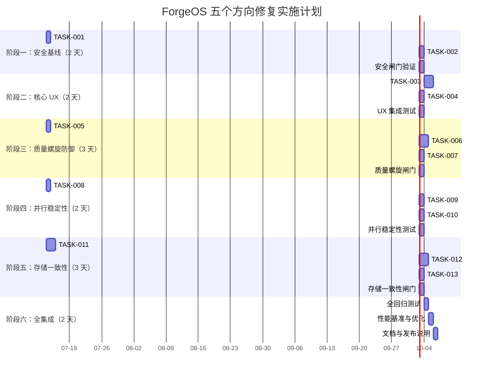

现在我已充分理解代码库，以下是完整的技术分析报告。

---

# Tech Lead 分析报告：ForgeOS 五个架构缺陷

## 执行摘要

验证报告确认了五个方向全部通过代码级验证。这些不是「新功能请求」，而是**脚手架向自治工厂过渡中，默认行为与架构承诺之间的五个根本矛盾**。按严重性排序：

| 优先级 | 方向 | 影响 | 修复难度 |
|--------|------|------|---------|
| **P0** | 方向四：环境变量完全泄漏 | CI 密钥泄漏，安全灾难 | 🟢 低（1人天） |
| **P1** | 方向一：默认 dry-run 使学习循环永不执行 | 首次 UX 为零，用户认为系统坏了 | 🟢 低（2人天） |
| **P1** | 方向二：预算降级-质量螺旋 | 长期运行自我劣化，不可自愈 | 🟡 中（5人天） |
| **P2** | 方向三：并行过载自 DoS 放大 | 生产多租户时级联雪崩 | 🟡 中（3人天） |
| **P2** | 方向五：跨存储一致性缺失 | 无声数据腐化，调试噩梦 | 🔴 高（8人天） |

---

## 1. 任务分解

### TASK-001: 环境变量白名单机制
- **方向**：方向四（环境变量泄漏）
- **涉及文件**：`forge-core/internal/orchestrator/command_executor.go`
- **前置依赖**：无
- **预估工时**：2 小时
- **验收标准**：
  1. `childEnv()` 函数新增一个允许列表（allowlist），默认包含 `PATH`, `HOME`, `USER`, `FORGE_*` 等安全变量
  2. 所有非允许列表的环境变量从子进程环境中排除
  3. 支持 `--env-allow` CLI 参数供用户显式添加白名单条目
  4. 日志记录被过滤的敏感变量名（只记名称不记值）
  5. 单元测试验证 `GITHUB_TOKEN`, `AWS_ACCESS_KEY_ID`, `AWS_SECRET_ACCESS_KEY` 等被过滤

### TASK-002: 安全审计 — 扫描所有 CI 密钥模式
- **方向**：方向四（环境变量泄漏）
- **涉及文件**：`harness/secret-scan.mjs`、`.github/workflows/forge.yml`
- **前置依赖**：TASK-001
- **预估工时**：1 小时
- **验收标准**：
  1. CI pipeline 中增加环境变量泄漏检测步骤
  2. 扫描日志/产物确认无 `GITHUB_TOKEN` 等密钥片段
  3. 文档记录环境变量安全策略

### TASK-003: 首次运行默认 executor 改为 command（带安全护栏）
- **方向**：方向一（默认 dry-run）
- **涉及文件**：`forge-core/cmd/forge/main.go`
- **前置依赖**：TASK-001（确保环境安全后才默认启用真实执行器）
- **预估工时**：3 小时
- **验收标准**：
  1. `--executor` 默认值从 `"dry"` 改为 `"command"`
  2. 当 `--executor=command` 但未提供 `--agent-cmd` 时，输出清晰的错误提示
  3. `forge run build`（无额外参数）产出「dry-run 摘要 + 提示」而非静默空循环
  4. 新增 `--executor=print`（= 原 `--executor=dry`）作为明确别名
  5. 单元测试确保默认行为端到端工作

### TASK-004: Dry-run 模式的知识回灌
- **方向**：方向一（默认 dry-run）
- **涉及文件**：`forge-core/cmd/forge/main.go`、`forge-core/internal/trace/trace.go`、`forge-core/internal/memory/memory.go`
- **前置依赖**：TASK-003
- **预估工时**：2 小时
- **验收标准**：
  1. dry-run 模式下进行内存条目追加和 trace 事件发射
  2. 所有 `forge run` 执行——无论 dry 还是 real——都记录到 trace.jsonl
  3. dry-run 的 routing 决策写入 memory（如 `KindDecision`）
  4. 新增 `--trace-only` 标记，供用户查看 routing 决策而不执行

### TASK-005: BudgetAdjustTier 增加 DecisionEvent 发射
- **方向**：方向二（预算降级-质量螺旋）
- **涉及文件**：`forge-core/internal/routing/routing.go`、`forge-core/cmd/forge/engine_build.go`、`forge-core/internal/trace/trace.go`
- **前置依赖**：无
- **预估工时**：2 小时
- **验收标准**：
  1. `BudgetAdjustTier()` 调用者（engine_build.go 中的 BudgetAdjustTier 使用点）在降级发生时发射 `DecisionEvent`
  2. DecisionEvent 携带 `detail` 如 `"budget at 85%: downgraded sonnet→haiku for implementer phase"`、降级前/后的 tier
  3. trace.jsonl 可被下游工具消费反映 budget 降级事件
  4. 单元测试验证降级事件内容正确

### TASK-006: 实现断路器模式
- **方向**：方向二（预算降级-质量螺旋）
- **涉及文件**：新建 `forge-core/internal/circuitbreaker/` 包，修改 `forge-core/internal/routing/routing.go`
- **前置依赖**：TASK-005
- **预估工时**：4 小时
- **验收标准**：
  1. 新增 `circuitbreaker` 包，实现状态机：CLOSED → OPEN（在 N 次降级后）→ HALF_OPEN（超时后）→ CLOSED/OPEN
  2. 断路器在三次连续降级（质量下降）后触发，阻止进一步降级
  3. 断路器触发时发射 trace DecisionEvent
  4. 断路器触发后路由失败终止运行（fail-closed）而非无声降级
  5. 降级事件与断路器状态关联
  6. 单元测试覆盖状态机转换（CLOSED→OPEN→HALF_OPEN→CLOSED）

### TASK-007: 降级后触发 Review Gate
- **方向**：方向二（预算降级-质量螺旋）
- **涉及文件**：`forge-core/internal/orchestrator/orchestrator.go`、`forge-core/internal/routing/routing.go`
- **前置依赖**：TASK-006
- **预估工时**：2 小时
- **验收标准**：
  1. 降级事件发生后，强制触发一次 review gate
  2. review gate 验证输出质量是否可接受
  3. 如果 review 失败，运行中止（fail-closed）
  4. 日志清晰记录「降级→触发审查」链路

### TASK-008: 添加抖动到 overloadBackoff
- **方向**：方向三（并行过载自 DoS）
- **涉及文件**：`forge-core/internal/orchestrator/backoff.go`
- **前置依赖**：无
- **预估工时**：1 小时
- **验收标准**：
  1. `overloadBackoff()` 在指数退避基础上添加上限 25% 的随机抖动
  2. 抖动使用 `math/rand`（Go 标准库，无需外部依赖）
  3. 保留注释，解释抖动现在为什么必要（并行执行器）
  4. 单元测试验证抖动在 [0, 25%] 范围内且分布大致均匀

### TASK-009: 实现并发波大小上限
- **方向**：方向三（并行过载自 DoS）
- **涉及文件**：`forge-core/internal/orchestrator/waves.go`、`forge-core/internal/orchestrator/parallel.go`
- **前置依赖**：TASK-008
- **预估工时**：2 小时
- **验收标准**：
  1. `Waves()` 新增 `maxConcurrency` 参数，控制单波内最大阶段数
  2. 单波超过上限的相位自动分拆到子波（sub-wave）中
  3. `--parallel-max-concurrency` CLI 标记（默认 5）
  4. sub-wave 间保持正确的依赖顺序
  5. 单元测试验证大波场景

### TASK-010: 并行模式增加自适应退避
- **方向**：方向三（并行过载自 DoS）
- **涉及文件**：`forge-core/internal/orchestrator/parallel.go`、`forge-core/internal/orchestrator/backoff.go`
- **前置依赖**：TASK-009
- **预估工时**：2 小时
- **验收标准**：
  1. 并行执行中检测到 overload/429 后，下个 wave 启动前增加延迟
  2. 延迟使用全连接退避（full-jitter backoff）
  3. 新增 `--parallel-overload-backoff` CLI 标记
  4. 单元测试验证退避行为

### TASK-011: 实现跨存储一致性检查器
- **方向**：方向五（跨存储一致性）
- **涉及文件**：新建 `forge-core/internal/doctor/consistency.go`、修改 `forge-core/internal/doctor/doctor.go`
- **前置依赖**：无
- **预估工时**：4 小时
- **验收标准**：
  1. 新增 `ConsistencyCheck()` 函数，交叉验证四个存储文件：
     - trace.jsonl 最后一个 agent 事件是否与 checkpoint.json 的 last iteration 对应
     - memory.jsonl 最新 entry 的 iteration 是否 ≤ checkpoint.json 的 iteration
     - scorecards.json 的 updated_at 是否在 checkpoint 时间戳之后（有意义时）
  2. 报告检查结果到 `forge doctor` 输出
  3. 使用与现有 doctor 检查相同的 `[PASS]/[FAIL]` 格式
  4. 存储缺失时不报 FAIL（首次运行正常）
  5. 单元测试覆盖正常、异常和缺失场景

### TASK-012: 实现存储校验和与一致性契约
- **方向**：方向五（跨存储一致性）
- **涉及文件**：`forge-core/internal/trace/trace.go`、`forge-core/internal/memory/memory.go`、`forge-core/internal/persist/checkpoint.go`、`forge-core/internal/doctor/consistency.go`
- **前置依赖**：TASK-011
- **预估工时**：4 小时
- **验收标准**：
  1. 三个存储格式（trace.jsonl、memory.jsonl、checkpoint.json）每个都携带 `_checksum` 字段（整个文件的 SHA-256）
  2. 文件写入后自动计算并嵌入 checksum
  3. 读取时验证 checksum，不一致时报告错误
  4. 不同存储记录共享的 `run_id` 以实现交叉引用
  5. doctor 的一致性检查利用 checksum 和 run_id 进行验证

### TASK-013: scorecards.json 原子写入契约
- **方向**：方向五（跨存储一致性）
- **涉及文件**：`forge-core/internal/routing/scorecard.go`、`forge-core/cmd/forge/scorecard_wind.go`
- **前置依赖**：TASK-012
- **预估工时**：2 小时
- **验收标准**：
  1. scorecards.json 使用与 checkpoint.json 相同的原子写入模式（写 temp + fsync + rename）
  2. 在 `LoadScorecards` 的文档注释中写入原子写入契约
  3. 单元测试验证原子写入

---

## 2. 执行顺序



**可并行执行的任务组**：

| 组 | 任务 | 所需开发者 | 条件 |
|-----|------|-------------|------------|
| **A** | TASK-001, TASK-002 | 1 安全工程师 | 阶段一 |
| **B** | TASK-005 | 1 开发者 | 与 A 并行 |
| **C** | TASK-008 | 1 开发者 | 与 A、B 并行 |
| **D** | TASK-011 | 1 开发者 | 与 A、B、C 并行 |
| **E** | TASK-003, TASK-004 | 1-2 开发者 | 依赖 A 完成 |
| **F** | TASK-006, TASK-007 | 1 开发者 | 依赖 B 完成 |
| **G** | TASK-009, TASK-010 | 1 开发者 | 依赖 C 完成 |
| **H** | TASK-012, TASK-013 | 1 开发者 | 依赖 D 完成 |

---

## 3. 技术风险

### 3.1 高风险项

| 风险 | 方向 | 描述 | 可能性 | 影响 | 缓解策略 |
|------|------|------|--------|------|---------|
| **环境变量白名单过于严格** | 四 | 用户自定义工具（如 `black`, `mypy`）依赖非标准环境变量，白名单过严会破坏工作流 | 中 | 高 | 默认白名单须包含常用变体；提供 `--env-inherit-all` 逃生口（带警告日志） |
| **断路器误触发** | 二 | 正常相邻降级（如从 Sonnet 到 Haiku 用于简单 CRUD）触发断路器，不必要地中止运行 | 中 | 中 | 不使用简单计数；使用「降级+后续 Review 失败」复合信号；阈值可配置 |
| **校验和性能开销** | 五 | 每次写入/追加计算 SHA-256 可能增加延迟，特别是大 trace 文件 | 低 | 中 | 使用增量校验和（xxhash 等轻量算法）；延迟计算，读时验证而非写时验证 |
| **分片波依赖中断** | 三 | 自动将大波分片到子波时，可能破坏微妙的阶段间依赖关系 | 低 | 高 | 保守实现：只分片真正独立的阶段；详细测试所有图拓扑；失败时 fallback 为完全不并发 |

### 3.2 中等风险项

| 风险 | 描述 | 缓解策略 |
|------|------|---------|
| **TASK-003 变更默认值破坏现有用户** | 有用户可能依赖 `--executor=dry` 做只读「预览」；静默切换可能触发意外 API 调用 | 变更时打印清晰的行为差异信息；保留 `--executor=dry` 作为显式替代；发布说明重点强调 |
| **跨存储一致性检查添加慢路径** | 每次 `forge doctor` 都要读取四个文件并交叉验证 | 使用惰性验证（只读元数据，非全部内容）；添加 `--deep` 标记做完整验证 |
| **决策事件的日志噪声** | TASK-005 为每次降级添加 trace 事件；频繁降级场景（如 budget 0.8~0.9 震荡）可能淹没 trace | 状态变更降级去抖；相似事件合并 |

### 3.3 设计决策记录

```
ADR-2026-07-12-01: 环境变量白名单 vs. 黑名单
  决策：采用白名单（Allowlist），默认包含 POSIX 标准变量以及 FORGE_* 前缀
  理由：黑名单本质不安全（可能遗漏）；ForgeOS 是治理层，应默认最小权限
  后果：少数 CI 流水线可能需要显式 --env-allow

ADR-2026-07-12-02: 原子写入通用化
  决策：将 checkpoint 的 temp+fsync+rename 模式通用化为内部包 persist 的共享函数
  理由：避免 scorecards.json 的自定义实现；统一一种正确的跨存储方式
  后果：scorecards_wind.go 需重构为使用该共享函数
```

---

## 4. 资源评估

### 4.1 人员需求

| 角色 | 数量 | 技能要求 | 工作时间 |
|------|------|---------|---------|
| **高级 Go 工程师** | 1（主力） | Go 并发、OS 级编程（进程管理、环境）、Go 标准库精熟 | 全日（10 天） |
| **中级 Go 工程师** | 1（并行任务） | Go 并发、goroutine 模式、测试 | 半日（5 天） |
| **安全工程师** | 0.5（兼职） | CI/CD 安全最佳实践、密钥管理 | 阶段一、五（2 天） |
| **QA 工程师** | 1（阶段式） | 集成测试、故障注入、负载测试 | 阶段三至五（4 天） |

**总人天估计**：~26 人天（含 QA），~20 人天纯开发

### 4.2 关键里程碑

| 里程碑 | 日期（从启动算起） | 交付物 | 验证标志 |
|--------|-------------------|--------|---------|
| **M1: 安全基线** | 第 2 天 | TASK-001 + TASK-002 完成 | CI 密钥泄漏扫描全绿 |
| **M2: UX 基线** | 第 4 天 | TASK-003 + TASK-004 完成 | `forge run build` 初次体验非空 |
| **M3: 断路器** | 第 5 天 | TASK-005 + TASK-006 + TASK-007 完成 | 预算螺旋有保护 |
| **M4: 并行稳定** | 第 6 天 | TASK-008 + TASK-009 + TASK-010 完成 | 20 并发波无雪崩 |
| **M5: 存储一致** | 第 8 天 | TASK-011 + TASK-012 + TASK-013 完成 | `forge doctor` 可检测跨存储不一致 |
| **M6: 全集成** | 第 10 天 | 全部闸门通过 + 回归测试 | `forge accept` ACCEPTED |

### 4.3 阻塞点与解决策略

| 阻塞点 | 影响 | 解决策略 |
|--------|------|---------|
| **环境变量白名单破坏 CI 工作流** | 阻塞 M1 → 依赖链全部延迟 | 对齐用户广泛使用的 CI 平台（GitHub Actions、GitLab CI、CircleCI）的环境变量枚举；发布前做 dogfooding |
| **Waves() 图分片的边界情况** | 阻塞 M4 | 回合 1：保守实现，大波退回顺序执行而非分片；回合 2：迭代改进 |
| **校验和速度影响大文件** | 阻塞 M5 | 使用快速非加密哈希（xxhash）而非 SHA-256；惰性验证 |

---

## 5. 质量保证

### 5.1 单元测试覆盖要求

| 方向 | 包 | 现有覆盖 | 目标覆盖 | 关键测试场景 |
|------|-----|---------|---------|-------------|
| 四 | `orchestrator/command_executor.go` | 有测试 | ≥90% | childEnv 过滤正确/不正确/env 覆盖/空白名单 |
| 一 | `cmd/forge/main.go` | 有测试 | ≥85% | 默认 executor/回退行为/CLI 解析 |
| 二 | `routing/routing.go` | 有测试 | ≥95% | BudgetAdjustTier 决策事件/断路器状态机/ReviewGate 触发 |
| 三 | `orchestrator/backoff.go` | 有测试 | ≥90% | 抖动分布/饱和/边界情况 |
| 三 | `orchestrator/waves.go` | 有测试 | ≥90% | 波分片/依赖保持/最大并发 |
| 五 | `doctor/consistency.go` | 新建 | ≥90% | 一致/不一致/缺失/损坏存储文件 |

### 5.2 集成测试策略

```
测试计划：
┌──────────────────────────────────────────────────┐
│  S1: 安全集成测试                                │
│  ├─ 启动 forge run --executor=command            │
│  ├─ 确认子进程环境 vars 仅包含白名单条目         │
│  └─ 确认 AWS_ACCESS_KEY_ID 等被过滤              │
├──────────────────────────────────────────────────┤
│  S2: UX 集成测试                                 │
│  ├─ forge run build (无额外参数)                 │
│  ├─ 确认输出非空，含 routing 信息                │
│  └─ 确认 trace.jsonl 有内容                      │
├──────────────────────────────────────────────────┤
│  S3: 质量螺旋集成测试（mock budget）             │
│  ├─ 模拟 budget 接近限制                         │
│  ├─ 确认 BudgetAdjustTier 发射 DecisionEvent     │
│  ├─ 确认断路器在阈值触发                        │
│  └─ 确认 review gate 被触发                      │
├──────────────────────────────────────────────────┤
│  S4: 并行测试                                    │
│  ├─ 20-phase 0-dep 图                            │
│  ├─ 确认波自动分片                                │
│  ├─ 注入 overload 响应                           │
│  └─ 确认抖动和自适应退避                          │
├──────────────────────────────────────────────────┤
│  S5: 存储一致性测试                              │
│  ├─ 手动损坏存储文件                              │
│  ├─ forge doctor 检测损坏                        │
│  ├─ 修改 memory 使 iteration 与 checkpoint 不匹配 │
│  └─ 确认 doctor 报告不一致                       │
└──────────────────────────────────────────────────┘
```

### 5.3 代码审查要点

| 方向 | 审查重点 | 常见问题 |
|------|---------|---------|
| **四** | childEnv 逻辑：白名单如何构建；是否使用 `os.Clearenv()` + 显式设置 vs. 过滤 | 遗漏关键变量；白名单通过环境变量泄露 |
| **一** | 默认值变更：现有 `--executor=dry` 用户透明；`--executor=command` 安全默认值 | 缺少 CLI 向后兼容；缺少安全默认值检查 |
| **二** | 断路器：状态机正确性；goroutine 安全性；无死锁 | 竞态条件；状态转换不一致；无限循环 |
| **三** | 抖动：随机数生成器种子；无并发冲突 | 使用非安全随机数生成器；种子输入后可预测 |
| **五** | 校验和：错误处理；性能路径；校验和循环；跨文件契约 | 校验和写入或读取时未正确处理错误；共享 run_id 的竞态 |

### 5.4 性能测试需求

| 场景 | 测量 | 通过标准 | 工具 |
|------|------|---------|------|
| **20 波 0 依赖并行** | 总运行时 vs. 无分片 | ≤ 无分片版本 1.2x | Go benchmark + `-race` |
| **大 trace 文件（10K+ 事件）** | trace 读取/追加延迟 | ≤ 5ms | `BenchmarkTraceAppend` |
| **500+ entry memory 文件** | 加载 + 查询延迟 | ≤ 10ms | `BenchmarkMemoryLoad` |
| **高频降级事件（1 秒内 10 次）** | trace 写入量 | 去抖后 ≤ 3 事件 | `BenchmarkDecisionEventStorm` |
| **并行 overload 注入** | 退避 + 抖动 vs. 无退避的 529 命中率 | 降低 50%+ 的 529 冲突 | 自定义 chaos 注入 |

---

## 6. 实施计划

### 甘特图



### 详细时间线

#### 阶段一：安全基线（Day 1-2）

| 天 | 活动 | 负责人 | 产出 |
|----|-------|---------|--------|
| 1 | TASK-001: 实现环境变量白名单 | 高级 Go 工程师 | 修改 `command_executor.go`、单元测试、`main.go` 新增 `--env-allow` 标志 |
| 1 | TASK-005: 并行启动 | 中级 Go 工程师 | `BudgetAdjustTier` 决策事件实现 |
| 1 | TASK-008: 并行启动 | 中级 Go 工程师 | 抖动实现 |
| 1 | TASK-011: 并行启动 | 中级 Go 工程师 | 一致性检查器骨架 |
| 2 | TASK-002 + 集成 | 安全工程师 + 高级 Go | CI 审计、所有四个方向的基础闸门通过 |

**阶段一闸门**：`harness/acceptance.mjs` 全绿 + 安全审计报告

#### 阶段二：核心 UX 修复（Day 3-4）

| 天 | 活动 | 负责人 | 产出 |
|----|-------|---------|--------|
| 3 | TASK-003: 默认 executor 变更 | 高级 Go 工程师 | `main.go` 默认值变更、回退行为、文档 |
| 3 | 代码审查 | 高级 + 中级 | 阶段一任务审查 |
| 4 | TASK-004: dry-run 知识回灌 | 高级 Go 工程师 | trace + memory dry-run 集成、`--trace-only` 标志 |
| 4 | UX 集成测试 | QA 工程师 | 场景验证 S2 |

**阶段二闸门**：`forge run build` 首次体验非空 + trace.jsonl 有内容

#### 阶段三：质量螺旋防御（Day 4-6）

| 天 | 活动 | 负责人 | 产出 |
|----|-------|---------|--------|
| 4 | TASK-006: 断路器核心 | 高级 Go 工程师 | `circuitbreaker` 包、状态机 |
| 5 | TASK-006: 路由集成 + 测试 | 高级 Go 工程师 | 断路器接入 routing、全状态机测试 |
| 5 | TASK-007: 降级 Review Gate | 中级 Go 工程师 | review gate 触发逻辑 |
| 6 | 质量螺旋集成测试 | QA 工程师 | 场景验证 S3 |

**阶段三闸门**：断路器触发时运行中止（fail-closed）+ 日志清晰

#### 阶段四：并行稳定性（Day 5-6）

| 天 | 活动 | 负责人 | 产出 |
|----|-------|---------|--------|
| 5 | TASK-009: 波大小上限 | 中级 Go 工程师 | `maxConcurrency` 参数、子波分片 |
| 6 | TASK-010: 自适应退避 | 中级 Go 工程师 | 全连接退避、`--parallel-overload-backoff` |
| 6 | 并行稳定性测试 | QA 工程师 | 场景验证 S4 |

**阶段四闸门**：20 并发无雪崩 + 超过上限时自动分片

#### 阶段五：存储一致性（Day 5-7）

| 天 | 活动 | 负责人 | 产出 |
|----|-------|---------|--------|
| 5 | TASK-011: 一致性检查器 | 中级 Go 工程师 | `consistency.go` 交叉验证逻辑 |
| 6 | TASK-012: 校验和 | 高级 Go 工程师 | 三个存储格式校验和 + 验证 |
| 7 | TASK-013: 原子写入 | 中级 Go 工程师 | scorecards.json 原子写入契约 |

**阶段五闸门**：`forge doctor` 可检测人工破坏的文件

#### 阶段六：全集成（Day 8-10）

| 天 | 活动 | 负责人 | 产出 |
|----|-------|---------|--------|
| 8 | 全回归测试 | QA 工程师 | 所有五个场景 + 所有架构闸门 |
| 9 | 性能基准 | QA 工程师 | 前/后对比报告 |
| 9 | 文档 + 发布说明 | 高级 Go 工程师 | `CHANGELOG`、变更记录 |
| 10 | 紧急缓冲 + Final Gate | 全员 | `forge accept` ACCEPTED |

**最终闸门**：`node harness/acceptance.mjs` → ACCEPTED + 8/8 架构检查绿

---

## 总结与建议

### 优先级建议

```
立即执行（Day 1）:  TASK-001 (环境变量泄漏) → P0 安全
                  TASK-005 (DecisionEvent) → 可独立进行
                  TASK-008 (抖动)           → 可独立进行
                  TASK-011 (一致性检查器)   → 可独立进行

短期（Week 1）:     TASK-003 + TASK-004 (UX) → 依安全基线
                  TASK-006 + TASK-007 (断路器) → 依 TASK-005
                  TASK-009 + TASK-010 (并行) → 依 TASK-008
                  TASK-012 + TASK-013 (存储) → 依 TASK-011

中期（Week 2）:     全集成 + 性能 + 文档
```

### 不做的 Scope

以下内容验证报告中未涵盖，也不在此计划范围内：

1. **跨厂商模型池**（v3 路线图）— 本分析（TASK-005/006）提供的观察性泵送适用于 v3，但不构建跨厂商池
2. **全发现/审查阶段** — 这些阶段仍可能跳过
3. **带外沙箱（Firecracker）** — 这是基础设施，非此范围
4. **分布式/高可用模式** — 方向五的存储一致性是同一层级的轻量级完整性约束，而非分布式共识

### 对项目的战略影响

完成这五个方向的修复后，ForgeOS 将从：

- 🛑 **无声失败**（dry-run 不做任何事、预算降级不记录） → ✅ **透明可观察**（trace 记录一切）
- 🔓 **不安全**（env 全部泄漏） → 🔒 **默认安全**（白名单 + 审计）
- 🔄 **不可恢复的质量螺旋** → ⛑️ **断路器保护**
- 💥 **并行雪崩** → 📊 **可控并发**
- 🎲 **无声数据腐化** → 🔍 **可检测的不一致**

这正好对应 R**OADMAP v2 从「脚手架」到「真实基础设施」的过渡**。
