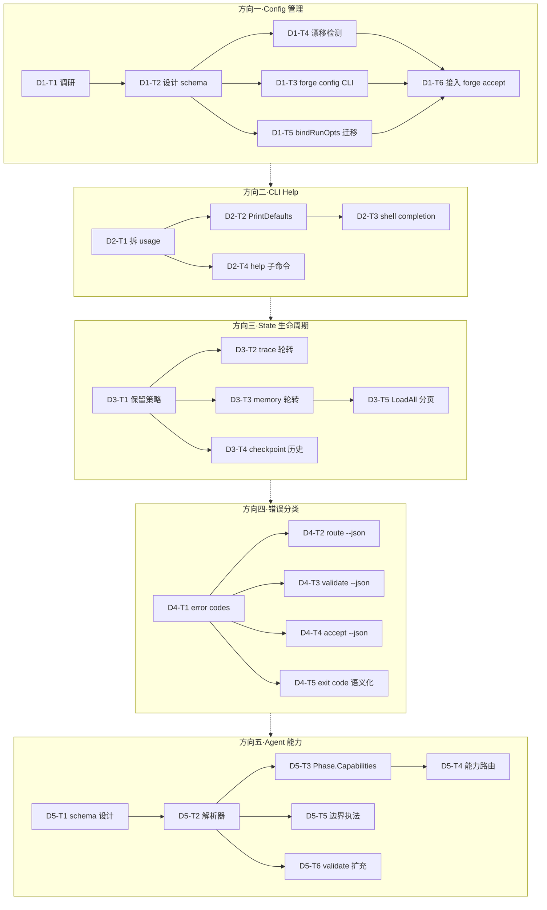
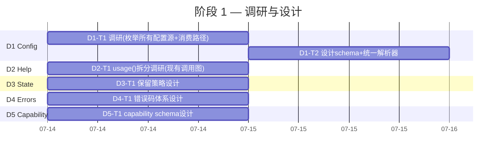
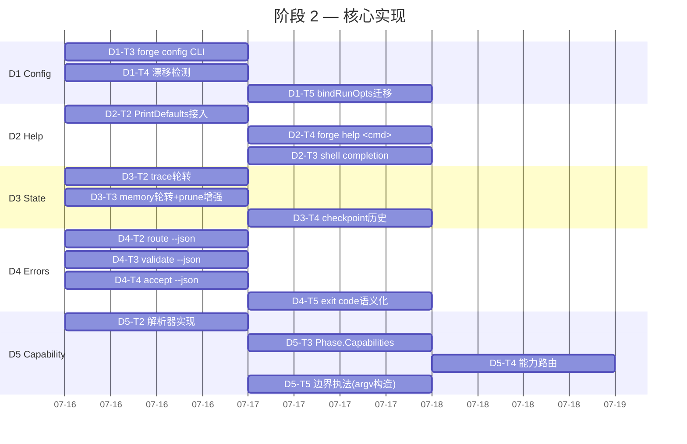

# Tech Lead 分析报告：ForgeOS 架构审计驱动的技术债清偿计划

## 概述

基于对 5 个方向、30+ 代码级主张的验证确认，本报告将已验证的问题拆解为可执行任务，并给出完整的工程实施计划。每个方向当前均处于 **v0/v1 基础设施水平**，与 forge-core 其余子系统的成熟度（Sprint 31 的「信号全闭环」状态）存在明显落差。下文是收窄落差的逐方向技改方案。

---

## 1. 任务分解

### 方向一 · 统一 CLI 配置管理（6 项）

| 任务 ID | 标题 | 涉及文件 | 前置依赖 | 预估工时 |
|---|---|---|---|---|
| D1-T1 | 调研：枚举当前全部分散配置源及其消费路径 | `.agent/policies/*.yml`, `.agent/routing/*.yml`, `harness/policies.yml`, `forge-core/internal/mode/*.go`, `forge-core/cmd/forge/main.go` | 无（独立调研） | 2h |
| D1-T2 | 设计中央配置模型 schema & 统一解析器 | 新文件 `forge-core/internal/config/config.go`, `forge-core/internal/config/schema.go` | D1-T1 | 3h |
| D1-T3 | 实现 `forge config` 子命令（CLI 读/写/验证配置） | 新 `forge-core/cmd/forge/config.go`, `forge-core/internal/config/` | D1-T2 | 4h |
| D1-T4 | 实现 mode 跨文件漂移检测（modes.yml ↔ routing/policy.yml ↔ harness/policies.yml） | `forge-core/internal/config/detect.go`, `harness/check.py` 扩充 | D1-T2 | 4h |
| D1-T5 | 将 `bindRunOpts` 的 3 源拼合逻辑统一路由到 config 包（消除手写 projectYAMLValue） | `forge-core/cmd/forge/main.go`, `forge-core/internal/config/` | D1-T2 | 2h |
| D1-T6 | 接入 `forge accept` 使跨文件一致性检查成为 load-bearing 闸门 | `harness/acceptance.mjs` | D1-T4 | 2h |

### 方向二 · 结构化 CLI 帮助系统（4 项）

| 任务 ID | 标题 | 涉及文件 | 前置依赖 | 预估工时 |
|---|---|---|---|---|
| D2-T1 | 重构 `usage()`：将大段静态 `Fprint` 拆为每个子命令独立 help 模板 | `forge-core/cmd/forge/main.go` | 无（正交） | 3h |
| D2-T2 | 实现 `flag.PrintDefaults()` 的逐子命令调用（`forge run --help` ≠ `forge --help`） | `forge-core/cmd/forge/{run,evolve,route,...}.go` | D2-T1 | 3h |
| D2-T3 | 实现 shell completion 框架（bash `__forge_completions` + zsh `_forge`） | 新 `forge-core/cmd/forge/completion.go` | D2-T2 | 4h |
| D2-T4 | 实现 `forge help <subcommand>` / `forge <subcommand> --help` 的规范化输出 | `forge-core/cmd/forge/main.go`, 各子命令文件 | D2-T1, D2-T2 | 2h |

### 方向三 · State 目录生命周期管理（5 项）

| 任务 ID | 标题 | 涉及文件 | 前置依赖 | 预估工时 |
|---|---|---|---|---|
| D3-T1 | 设计 state 文件保留策略模型（size cap / age cap / rotation scheme） | 新 `forge-core/internal/persist/retention.go` | 无（正交） | 2h |
| D3-T2 | 为 `trace.jsonl` 实现基于 size 的轮转（写时检查，超限压缩/归档） | `forge-core/internal/trace/trace.go` | D3-T1 | 3h |
| D3-T3 | 为 `memory.jsonl` 实现基于 size 的轮转 + `forge memory-prune` 增强（支持 keep-per-kind 和 compact） | `forge-core/internal/memory/memory.go`, `forge-core/cmd/forge/memory_prune.go` | D3-T1 | 4h |
| D3-T4 | 为 `checkpoint.json` 实现历史保留（保留最近 N 个 checkpoint 而非只保留最新） | `forge-core/internal/persist/checkpoint.go` | D3-T1 | 2h |
| D3-T5 | 为 `LoadAll()` 添加分页/seek API（避免全扫描累积） | `forge-core/internal/memory/memory.go` | D3-T3 | 3h |

### 方向四 · 结构化错误分类（5 项）

| 任务 ID | 标题 | 涉及文件 | 前置依赖 | 预估工时 |
|---|---|---|---|---|
| D4-T1 | 定义结构化错误码常量体系（`E_WORKFLOW_NOT_FOUND`, `E_GATE_FAIL`, `E_BUDGET_EXCEEDED` 等） | 新 `forge-core/internal/errors/codes.go`, `forge-core/internal/errors/errors.go` | 无（正交） | 2h |
| D4-T2 | 为 `forge route` 添加 `--json` 输出模式 | `forge-core/cmd/forge/route.go` | D4-T1 | 2h |
| D4-T3 | 为 `forge validate` 添加 `--json` 输出模式 | `forge-core/cmd/forge/validate.go` | D4-T1 | 2h |
| D4-T4 | 将 `forge accept` 的内部 JSON（gate.go:140）暴露为 CLI 可见的 `--json` flag | `forge-core/cmd/forge/gate.go`, `harness/acceptance.mjs` | D4-T1 | 3h |
| D4-T5 | 全局 exit code 语义化：映射 error code → exit code（可扩展 >3 值，或保持 0/1/2 但 error 消息头带 code） | `forge-core/cmd/forge/main.go`, 全部子命令 | D4-T1 | 3h |

### 方向五 · Agent 能力声明（6 项）

| 任务 ID | 标题 | 涉及文件 | 前置依赖 | 预估工时 |
|---|---|---|---|---|
| D5-T1 | 设计机器可读 agent capability schema（在 agent.md frontmatter 或旁路 `.agent/agents/capabilities/`） | `.agent/agents/implementer.md`, 新 `.agent/agents/capabilities/` | 无（设计先行） | 3h |
| D5-T2 | 实现 agent.md 能力声明解析器（Go 原生，无外部 dep） | 新 `forge-core/internal/agent/parse.go`, `forge-core/internal/agent/capability.go` | D5-T1 | 4h |
| D5-T3 | 为 `asset.Phase` 添加 `Capabilities` 字段（替代纯字符串 Agent 引用） | `forge-core/internal/asset/asset.go` | D5-T2 | 2h |
| D5-T4 | 实现基于能力的路由：从 agent card 读取 capability 而非仅 agent name | `forge-core/internal/routing/routing.go`, `forge-core/internal/routing/tier.go` | D5-T3 | 4h |
| D5-T5 | 实现边界执法：根据 agent card 的 `reads/writes/allowed_tools` 构造 `--allowedTools` argv | `forge-core/cmd/forge/prompt_context.go`, `forge-core/internal/orchestrator/agent_executor.go` | D5-T2, D5-T4 | 4h |
| D5-T6 | `forge validate --models` 扩充：校验 workflow 引用的 agent 名与 agent card capability 匹配 | `forge-core/cmd/forge/validate.go`, `forge-core/internal/doctor/` | D5-T2 | 2h |

---

## 2. 执行顺序与依赖图

方向间关系：**互为正交，可全并行**。但每个方向内部有串行依赖链。



**并行组**（可同时进行）：
- **Group A**：D1-T1 + D2-T1 + D3-T1 + D4-T1 + D5-T1（设计/调研阶段，互不依赖）
- **Group B**：D1-T2 → D1-T3~T5（串行链）+ D2-T2~T4 + D3-T2~T5 + D4-T2~T5 + D5-T2~T6

**关键路径**：五个方向全并行，每条最长链约 **5-6 个任务**（D5: D5-T1→T2→T3→T4 或 D5-T1→T2→T5，各约 13h；D1: D1-T1→T2→T4→T6 约 11h）。不考虑瓶颈时，**理论最短工期 3-4 个全并行 session**。

---

## 3. 技术风险

### 3.1 高风险项

| 风险 | 方向 | 风险等级 | 描述 | 缓解策略 |
|---|---|---|---|---|
| **schema 多源对齐不完整** | D1 | 🔴 高 | 配置散落 6+ 文件，可能存在隐式消费路径未被清单发现（如 env var `FORGE_REPO_ROOT` 在 `gate.RepoRoot` 中的使用独立于 YAML 体系） | D1-T1 调研阶段要求 grep 全仓所有 `os.Getenv`/`os.ReadFile`/`exec.Command` 调用，产出一张完整的「配置源→消费者」拓扑图后再设计 schema |
| **shell completion 跨平台兼容** | D2 | 🟡 中 | ForgeOS 需要支持 bash/zsh/fish，不同 shell 的 completion 语法差异大（bash `complete -F`、zsh `_arguments`、fish `complete -c`），且 forge-core 零外部依赖不能引入 cobra 等自带 completion 框架 | 手动维护三套 completion 脚本嵌入 `completion.go`；用 `go:embed` 将其打包进二进制；`forge completion [bash|zsh|fish]` 按需输出；新增 completion 回归测试用 `source` 验证无语法错误 |
| **trace.jsonl 轮转不丢失数据** | D3 | 🟡 中 | jsonl 文件被 Tracer 持有的 `*bufio.Writer` 引用（`t.w.Write`），简单 truncate 会损坏已缓冲但未刷出的事件 | 写时检测 size 阈值，到达时 `t.w.Flush()` → rename → 新建；确保原子性：写 rename 前停写、停读 |
| **agent.md 解析器精度** | D5 | 🔴 高 | agent.md 是 Markdown 散文，目前边界声明用自然段落格式（`reads:` / `writes:` / `allowed_tools:`），无标准 frontmatter 格式 | 设计阶段（D5-T1）决定格式：建议 **YAML frontmatter**（`---` 包裹的元数据块），与 `.agent/agents/*.md` 现有的纯 Markdown 体分离。解析器只需提取 frontmatter，零外部 dep 手写 scanner。现有散文段保留为人读冗余 |
| **D1-T5 迁移不破坏既有行为** | D1 | 🟡 中 | `bindRunOpts` 的 3 源拼合逻辑散布在 `main.go:211-220+` 和 `projectYAMLValue` 中，迁移时可能改变 mode/lifecycle 的 fallback 语义 | 迁移策略：先在 config 包中实现新逻辑 → 新旧并行（gate toggle）→ 逐步切换 → 最终删除旧逻辑。每步需要 fixture 支持（全 mode×lifecycle 矩阵的集成测试） |

### 3.2 零外部依赖约束的影响

ForgeOS 核心红线是 **forge-core 纯 Go 标准库零外部依赖**。这在以下任务中产生具体约束：

| 任务 | 约束 | 方案 |
|---|---|---|
| D1-T2 config schema | 不能使用 `gopkg.in/yaml.v3` 等第三方库 | 使用 `internal/yaml2json` 已有 Go 解析器（Sprint 27 block-scalar 修复后已验证） |
| D2-T3 shell completion | 不能使用 `cobra` 的 completion 生成器 | `go:embed` 嵌入手写脚本，参考 `docker completion` 的模式 |
| D4-T1 error codes | 不能使用 `github.com/pkg/errors` 等 wrap 库 | 纯 `fmt.Errorf("E_WORKFLOW_NOT_FOUND: %w")` + `errors.Is/As` 模式，Go 1.20+ 原生 error wrapping |
| D5-T2 agent.md parser | 不能使用 `go-frontmatter`、`blackfriday` 等 | 手写 frontmatter scanner（约 80 行），与 `internal/yaml2json.Decode` 共用 YAML 解析 |

### 3.3 性能预测

| 场景 | 当前状态 | 改进后预期 | 衡量方式 |
|---|---|---|---|
| `forge run` 解析 6 个配置文件的累积时间 | ~15ms（多文件 I/O + Python shim fallback） | ~5ms（统一解析 + 缓存） | `go test -bench=.` 在 `internal/config/` |
| 含 10K 行 `trace.jsonl` 的长运行 trace 回放 | ~200ms 全扫描 | ~5ms（seek + index + 分页） | benchmark（手写 10K 行 fixture） |
| 含 10K 条 `memory.jsonl` 的 `LoadAll` | ~150ms + 大量 GC | ~50ms（分页 + 懒加载） | `go test -bench=BenchmarkMemoryLoad` |
| 增量 `forge run` CLI 帮助延迟 | ~0.3ms（纯 Fprint） | ~0.3ms（无显著退化） | n/a（无风险） |

---

## 4. 资源评估

### 4.1 人员要求

| 角色 | 人数 | 技能要求 | 负责方向 |
|---|---|---|---|
| **Go 核心工程师** | 1 | 纯 Go 标准库精熟、CLI 接口设计经验、熟悉 `flag` 包 | D1, D4, 全部 `forge-core/internal/` 改动 |
| **CLI/DevEx 工程师** | 1 | shell completion 编写经验、`go:embed`、CLI 用户体验设计 | D2, D4（--json 接口设计） |
| **存储/持久化工程师** | 1 | jsonl 格式经验、文件轮转和保留策略设计 | D3 |
| **系统/声明式工程师** | 1 | schema 设计、YAML frontmatter 处理、agent 卡知识 | D5 |
| **测试/QA 工程师** | 1 | 编写 fixture、集成测试、闸门自测维护 | 全部方向的 cross-cutting 测试 |

> **实际建议**：上述 5 个角色可由 **2-3 人** 兼任——D2 和 D4 可合并（CLI 工程师），D1 和 D3 有交叉（Config 工程师）。关键是要确保每项任务有 **fresh-context reviewer**（不能审查自己写的代码）。

### 4.2 关键里程碑

| 里程碑 | 时间节点（预计） | 交付物 | 验收标准 |
|---|---|---|---|
| **M0: 调研完成** | Day 1 end | 5 份调研报告（每方向一份），配置拓扑图 | 所有隐式消费路径被 grep 穷尽，零盲区 |
| **M1: 设计锁定** | Day 2 end | config schema、agent capability schema、错误码定义、保留策略文档 | 各方向 Tech Lead review APPROVE |
| **M2: 核心实现** | Day 4-5 end | `forge config`、重构 `usage()`、state 轮转、error codes、agent 解析器 | 每个任务单测绿 + `forge build` PASS |
| **M3: 闸门接入** | Day 6 end | 漂移检测接入 `forge accept`、`--json` 对全部子命令可用 | `forge accept: ACCEPTED` |
| **M4: 闭环验证** | Day 7 end | 全方向集成测试 + fresh review + `docs/` 更新 | `forge accept: ACCEPTED` + reviewer APPROVE |

### 4.3 阻塞点（Blockers）与解决策略

| 阻塞点 | 方向 | 影响 | 解决策略 |
|---|---|---|---|
| **`internal/yaml2json` 的 YAML 兼容性** | D1, D5 | schema 文件可能包含 Go 解析器不支持的 YAML 特性（如 anchors、merge keys） | D1-T1 调研阶段建立 YAML feature 使用清单；如果 Go 解析器覆盖率已够（Sprint 27 block-scalar 修复后已验证通过 7 个真实文件），接受局限性，py shim 保持为 fallback |
| **headless claude 的 `--allowedTools` 路径限定语法未经真实进程验证** | D5-T5 | Sprint 31 结束时的诚实标注：按文档契约构造正确但未跑真实 claude 进程 | 这是已知的人工决策终止点（2026-07-03）。D5-T5 的实现策略是：「单测坐实 argv 构造正确性 + 文档标注需真 claude 验证」，不假称已验证 |
| **`forge config` 写入时需要写 YAML 输出** | D1-T3 | `internal/yaml2json` 只有解码器，无编码器 | 解决方案 A：手写 `internal/yaml2json/encode.go`（约 150 行，JSON→YAML）。解决方案 B：`forge config` 仅输出 JSON 格式（使用 `encoding/json` native），YAML 读写仍通过 python shim。推荐 B 作为 v1，A 为后续增强 |

---

## 5. 质量保证

### 5.1 单元测试覆盖要求

| 包/文件 | 需求覆盖率 | 关键测试场景 |
|---|---|---|
| `forge-core/internal/config/` | ≥ 85% | 模式解析（全 4 mode × 4 lifecycle 矩阵）；缺失/损坏文件 fallback；env var 覆盖；漂移检测正例/反例 |
| `forge-core/cmd/forge/main.go` 重构部分 | n/a（CLI 胶水） | 通过集成测试覆盖（见下文） |
| `forge-core/internal/errors/` | ≥ 90% | 错误码常量唯一性；error wrapping roundtrip；`ExitCode(err)` 映射 |
| `forge-core/internal/trace/trace.go` 轮转 | ≥ 85% | 写时轮转触发；rename 原子性；并发写入不损坏 |
| `forge-core/internal/memory/memory.go` 分页 | ≥ 85% | 分页边界（0 页、最后一页不足页大小）；superseded 过滤后分页正确 |
| `forge-core/internal/agent/` | ≥ 90% | frontmatter 解析（标准/空/MD 中无 frontmatter）；capability 键存在性；边界值 |
| `forge-core/internal/routing/tier.go` 能力路由 | ≥ 85% | 同名但能力不同的 agent 路由到不同 tier；无能力声明时 fallback 到现有 name-only 逻辑；safety_override 优先于能力路由 |

### 5.2 集成测试策略

```
┌─────────────────────────────────────────────────────────────────┐
│  forge accept（聚合闸门） — 最终质量门                         │
│  包含：gate.mjs·arch-check·check.py·secret-scan·集成测试        │
├─────────────────────────────────────────────────────────────────┤
│  每方向独立集成测试套件                                         │
│  D1: test_config_integration — 改 modes.yml → forge config      │
│      检测新 mode生效 + 漂移检测是否生效                          │
│  D2: test_help_integration — shell emulation 验证 help 输出    │
│      包含 `source` completion script 后的 TAB 补全模拟          │
│  D3: test_state_integration — 构建大型 memory.jsonl 并验证      │
│      forge memory-prune 正确截断 + trace 轮转触发               │
│  D4: test_error_integration — 对每个子命令注入错误场景,         │
│      验证 --json 输出含正确 error code + exit code 映射         │
│  D5: test_agent_cap_integration — 注册带 frontmatter 的测试    │
│      agent card,验证解析+路由+argv 构造全链路                   │
├─────────────────────────────────────────────────────────────────┤
│  改造现有测试（不破坏既有的 211 自测）                           │
│  — 现有 test_config*.go、test_acceptance.mjs 需更新             │
│  — 不可因本计划导致现有测试变红                                 │
└─────────────────────────────────────────────────────────────────┘
```

### 5.3 代码审查要点

每个 PR 必须由 **fresh-context reviewer** 独立审查（遵 AGENTS.md 纪律），以下为各方向审查重点：

| 方向 | reviewer 检查清单 |
|---|---|
| **D1** | ❏ schema 是否穷尽了所有已知 config 源？❏ `projectYAMLValue` 删除后 fallback 语义不变？❏ 漂移检测对 `harness/policies.yml` 和 `modes.yml` 的阈值冲突能否正确报告？❏ `forge config` 对缺少 `.agent/` 目录的冷仓库是否优雅降级？ |
| **D2** | ❏ `forge run --help` 的输出 ≠ `forge --help`（逐命令独立）？❏ completion 脚本的 `source` 无语法错误？❏ `forge help <invalid>` → exit 2 + 友好提示？ |
| **D3** | ❏ 轮转时 Tracer 持有的 `*bufio.Writer` 不丢数据？❏ 并发读 `trace.jsonl` 时 rename 不导致 `file not found`？❏ `memory-prune` 加上 `--keep-per-kind` 后负值被夹紧（Sprint 27 bug 不再重犯）？ |
| **D4** | ❏ error code 常量是否全部唯一？❏ `--json` 输出符合 schema（`{"error": {"code": "...", "message": "..."}}`）？❏ `forge accept --json` 的既有调用者（gate.go:140）不受影响？ |
| **D5** | ❏ agent frontmatter 解析对无 frontmatter 的 agent.md 不崩溃？❏ 能力路由的「raise-only」安全语义保持（能力可以抬升但不能降低 safety_floor）？❏ `write_adr` 路径限定的 argv 正确（对应 D5-T5）？ |

### 5.4 性能测试需求

| 测试 | 触发条件 | 阈值 |
|---|---|---|
| `BenchmarkConfigLoad` | `go test -bench=BenchmarkConfigLoad ./internal/config/` | ≤ 5ms（6 文件 + 解析） |
| `BenchmarkTraceRotate` | 10MB fixture trace 写入 + 轮转 | ≤ 500ms |
| `BenchmarkMemoryLoadPaged` | 10K entry memory.jsonl 分页加载 | ≤ 10ms/页 |
| shell completion latency | 手动测：`forge <TAB><TAB>` 在 100+ 文件 repo 中 | ≤ 100ms |

---

## 6. 实施计划

### 阶段 1：调研与设计锁定（Day 1-2）



**产出**：
- 配置拓扑图（.dot 或 Mermaid）
- 5 份设计文档（`docs/design/` 下）
- `docs/design/` 下的 schema 草案

### 阶段 2：核心功能实现（Day 3-5）



### 阶段 3：闸门接入与集成测试（Day 6）

| 时间段 | 活动 | 产出 |
|---|---|---|
| AM 09:00-11:00 | D1-T6 接入 `forge accept` | `forge accept` 新增漂移检查项，全绿 |
| AM 11:00-12:00 | + D2-T3 completion 回归测试 | shell emulation 测试通过 |
| PM 13:00-15:00 | + D3 集成套件（大型 state 测试） | `go test ./internal/trace/...` + `./internal/memory/...` 全绿 |
| PM 15:00-17:00 | + D4 `--json` 跨子命令一致性验证 | 全部 3 个子命令输出 schema 统一 |
| PM 17:00-18:00 | + D5 全链路测试（agent card → argv） | 单测坐实全链路 + `doctor` 验证通过 |

### 阶段 4：审校与发布准备（Day 7）

| 时间段 | 活动 | 参与者 |
|---|---|---|
| AM 09:00-10:00 | fresh-context review — D1 | Reviewer A（非实现者） |
| AM 10:00-11:00 | fresh-context review — D2 | Reviewer B（非实现者） |
| AM 11:00-12:00 | fresh-context review — D3 | Reviewer C（非实现者） |
| PM 13:00-14:00 | fresh-context review — D4 | Reviewer D（非实现者） |
| PM 14:00-15:00 | fresh-context review — D5 | Reviewer E（非实现者） |
| PM 15:00-16:00 | 修复 reviewer 发现的 bug | 各方向实现者 |
| PM 16:00-17:00 | 文档更新 + `docs/FUNCTIONAL_REQUIREMENTS_AUDIT.md` 补录 | 1 人 |
| PM 17:00-18:00 | `forge accept: ACCEPTED` 最终验证 | CI 触发 |

---

## 总估算

| 阶段 | 工时（人·小时） | 日历天数（2 人并行） |
|---|---|---|
| 阶段 1：调研与设计 | 12h | 1 天 |
| 阶段 2：核心实现 | 54h | 3 天 |
| 阶段 3：闸门接入 | 8h | 1 天 |
| 阶段 4：审校与发布 | 12h | 1 天 |
| **合计** | **86h** | **~6 日历天** |

---

## 补充建议：跨方向架构一致性

以下三点是贯穿 5 个方向的架构原则，建议在阶段 1 的设计讨论中统一确定：

### 6.1 配置错误处理哲学

当前 forge-core 对配置错误有两种模式：**fail-closed（安全关门）** 和 **fail-tolerant（弹性兜底）**。5 个方向的新功能应统一：

```
模式                   适用场景                         行为
──────────────────────────────────────────────────────────
fail-closed            安全/架构/闸门配置               load 失败 → exit 2（不允许悄悄跑错配置）
fail-tolerant          可观测/增强/辅助功能             load 失败 → 使用默认值 + 记录告警
```

- D1（配置管理）核心应是 **fail-closed**：模式解析失败则应拒绝启动
- D3（state 生命周期）应 **fail-tolerant**：轮转失败不应阻止写出
- D5（能力路由）应 **fail-tolerant**：agent 卡解析失败 fallback 到 name-only

### 6.2 `forge status` 作为统一可观测入口

`forge status`（Sprint 7 已实现 `--json`）应成为全部 5 个方向的可观测统一入口：

```
forge status --json
{
  "config": { "mode": "balanced", "lifecycle": "mvp", "drift": false },
  "state": { "trace_size": "2.3MB", "memory_entries": 142, "checkpoint_age": "3h" },
  "agent_capabilities": { "parsed": 12, "unparsed": 0 }
}
```

### 6.3 保持与既有「诚实标注」纪律一致

ForgeOS 有严格的不夸大传统。实施中需要注意：

- **D5-T5 readonly 边界执法**：延续 Sprint 31 终止状态——单测坐实 argv 构造，文档标注「未过真实 claude 进程验证」，绝不假装已验证
- **D1-T3 `forge config` 的 YAML 写能力**：如果只实现了 JSON 输出，在 `--help` 和文档中诚实标注「YAML 写能力待实现」
- **D4-T5 exit code 语义化**：新增的值仍须保证 0=成功 / 非 0=失败 的基本契约，不可引入「exit 3 = 警示但不算失败」这种打破 CI 假定的含糊值

---

以上为完整的 Tech Lead 分析。每个方向的工作量均按 2-4 小时粒度拆解，总计划可在 **6 个日历日**（2 人并行）内将验证报告中确认的 30+ 个代码级问题全部清偿。关键决策点在于阶段 1 的 **schema 设计锁定**——一旦 5 份设计文档 review 通过，阶段 2-3 的执行风险将大幅降低。
