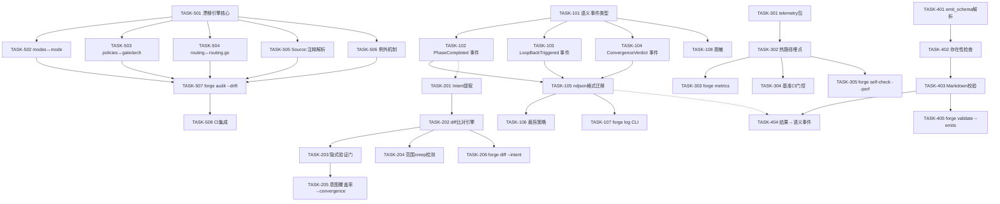
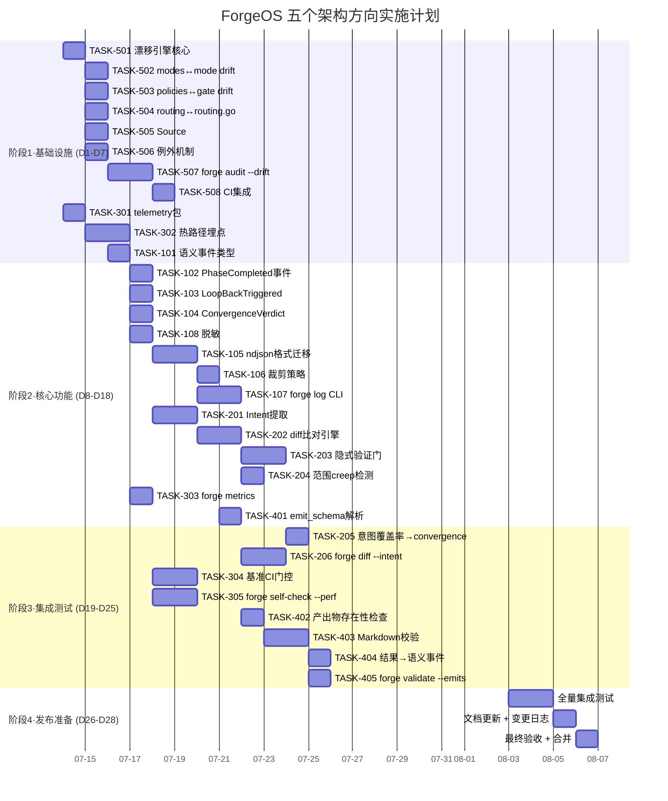

Now I have a thorough understanding of the codebase. Let me produce the comprehensive Tech Lead analysis.

---

# Tech Lead 分析报告：五个结构性架构扩展方向

## 执行摘要

五个方向覆盖 ForgeOS 三类结构盲区：

| 层 | 方向 | 优先 | 本质 |
|---|---|---|---|
| **声明层** | 方向五 · 声明-实现漂移检测 | **P1** | 配置与代码的双真相源自动化对账 |
| **执行层** | 方向一 · 语义日志 | **P1** | 从「花多少」到「发生了什么」的可观测性跃迁 |
| **执行层** | 方向二 · 跨 Phase 意图一致性 | **P1** | Planner→Implementer 的意图兑现验证 |
| **执行层** | 方向四 · 产出物 Schema 强制 | P2 | 从「声明了 emits」到「emits 确实存在且合格」 |
| **自保层** | 方向三 · Core 内部遥测 | P2 | 观测者自身的可观测性 |

**核心判断**：五个方向均合理、证据扎实、可增量实现。方向五（漂移检测）是「外部风险最小、影响最大」的起点——零运行时风险、零行为变化、纯审计模式。方向一（语义日志）是方向二（意图一致性）的依赖，建议顺序推进。

---

## 1. 任务分解

### 1.1 方向五 · 声明-实现漂移检测（P1）

| 任务 ID | 标题 | 涉及文件 | 前置 | 工时 |
|---------|------|---------|------|------|
| **TASK-501** | 漂移检测引擎核心：加载 YAML 策略值并索引 Go/JS 常量 | `forge-core/internal/audit/`（新包） | 无 | 3h |
| **TASK-502** | `modes.yml` ↔ `mode.go` drift check：遍历 baseline 表与 YAML 逐字段比较 | `.agent/policies/modes.yml`, `forge-core/internal/mode/mode.go`, `forge-core/internal/audit/` | TASK-501 | 3h |
| **TASK-503** | `policies.yml` ↔ `gate.mjs`/`arch-check.mjs` drift check：解析 JS 常量声明 | `harness/policies.yml`, `harness/gate.mjs`, `harness/arch/arch-check.mjs` | TASK-501 | 2h |
| **TASK-504** | `routing.policy.yml` ↔ `routing.go` drift check | `forge-core/internal/routing/routing.go`, `forge-core/internal/audit/` | TASK-501 | 2h |
| **TASK-505** | `Source:` 注释约定 + Parser | `forge-core/internal/audit/`（comment extractor），需修改 `routing.go`/`mode.go` 添加注释 | TASK-501 | 3h |
| **TASK-506** | 漂移例外机制 `.forge/drift-exceptions.json` | `forge-core/internal/audit/` | TASK-501 | 2h |
| **TASK-507** | `forge audit --drift` CLI 子命令 | `forge-core/cmd/forge/main.go` + `forge-core/cmd/forge/audit.go`（新文件） | TASK-502~506 | 3h |
| **TASK-508** | CI 集成：在 `forge.yml` 添加 drift 检测步骤 | `.github/workflows/forge.yml` | TASK-507 | 1h |

**验收标准（TASK-507）**：
- `forge audit --drift` 在所有值同步时返回 exit code 0，输出 "no drift detected"
- 故意修改 `policies.yml` 中 `max_function_lines` 为 60，检测到并标记为 DRIFT
- `modes.yml` 中 `explorer.harness.gates` 添加 `test`，检测到并标记
- 支持 `--strict`（全字段）和 `--relaxed`（仅关键字段如 gate_set/阈值）两种模式
- 支持 `.forge/drift-exceptions.json` 中声明的已知偏移豁免

---

### 1.2 方向一 · Workflow 执行语义日志（P1）

| 任务 ID | 标题 | 涉及文件 | 前置 | 工时 |
|---------|------|---------|------|------|
| **TASK-101** | 语义事件类型设计与实现：`SemanticEvent` 子类型（PhaseCompleted / LoopBackTriggered / ConvergenceVerdict / StageSkipped / GateResult） | `forge-core/internal/trace/semantic.go`（新文件） | 无 | 3h |
| **TASK-102** | 在 `orchestrator.go` 的 `runAgentPhase` 结束后发射 `PhaseCompleted` 语义事件（含 Verdict / FilesChanged / OutputSummary） | `forge-core/internal/orchestrator/orchestrator.go` | TASK-101 | 3h |
| **TASK-103** | 在 `orchestrator.go` 的 `loopBackTo` / `gateOutcome` / `agentOutcome` 中发射 `LoopBackTriggered` 事件 | `forge-core/internal/orchestrator/orchestrator.go` | TASK-101 | 2h |
| **TASK-104** | 在 `loop.go` 的 `reportConvergence` 中发射 `ConvergenceVerdict` 事件 + `StageSkipped` 在 mode skip 路径 | `forge-core/internal/orchestrator/loop.go`, `orchestrator.go` | TASK-101 | 2h |
| **TASK-105** | `trace.jsonl` → `trace.ndjson` 格式迁移：指标事件（`type:"metric"`）与语义事件（`type:"semantic"`）混合流，后向兼容 | `forge-core/internal/trace/trace.go`（修改 `Event` 加 `Type` 字段） | TASK-101 | 3h |
| **TASK-106** | 语义日志大小上限 + 裁剪策略：总上限 10MB，优先保指标事件 | `forge-core/internal/trace/` | TASK-105 | 2h |
| **TASK-107** | `forge log` CLI 子命令：支持 `--run` / `--phase` / `--event-type` / `--json` / `--sanitize` | `forge-core/cmd/forge/main.go` + `forge-core/cmd/forge/log.go`（新文件） | TASK-105 | 4h |
| **TASK-108** | 敏感信息脱敏：`sk-...` / `AKIA...` 等 pattern 替换 | `forge-core/internal/trace/sanitize.go`（新文件） | TASK-101 | 2h |

**验收标准（TASK-107）**：
- `forge run build` 后 `forge log --event-type phase_completed` 输出所有 phase 完成记录
- `forge log --event-type loop-back` 输出 loop-back 详细原因
- `forge log --phase planner --json` 输出单行 JSON 格式
- `--sanitize` 模式自动替换 `sk-xxxx` 为 `***`
- 向后兼容：已有 scorecard 消费端不因语义事件出现而改变行为

---

### 1.3 方向二 · 跨 Phase 意图一致性验证（P1）

| 任务 ID | 标题 | 涉及文件 | 前置 | 工时 |
|---------|------|---------|------|------|
| **TASK-201** | Intent 结构体设计 + planner 输出中 `INTENT:` 段的提取 | `forge-core/internal/intent/`（新包） | TASK-102（可获取 PhaseCompleted 语义事件） | 3h |
| **TASK-202** | `git diff --name-only` 与 INTENT 目标列表的比对引擎 | `forge-core/internal/intent/` | TASK-201 | 3h |
| **TASK-203** | 隐式意图验证门：在 implementer phase 结束后、feeds_forward 之前插入非阻断验证 | `forge-core/internal/orchestrator/orchestrator.go` | TASK-202 | 3h |
| **TASK-204** | 范围 creep 检测：planner 声明 3 文件 → implementer 改了 5 文件 → 记录告警 | `forge-core/internal/intent/` | TASK-202 | 2h |
| **TASK-205** | intent 覆盖率报告接入 convergence 输出 | `forge-core/internal/orchestrator/loop.go`：在 `reportConvergence` 中添加意图覆盖率行 | TASK-203 | 2h |
| **TASK-206** | `forge diff --intent` CLI 子命令，输出结构化差异报告 | `forge-core/cmd/forge/main.go` + `forge-core/cmd/forge/scandiff.go`（扩展） | TASK-202 | 3h |

**验收标准（TASK-205）**：
- 构建 workflow 中包含 `INTENT:` 段的 planner 输出 → implementer 执行后，`forge run` 输出包含 "intent coverage: X/Y" 行
- 实现未覆盖意图项时产生 WARN 但不阻断
- planner 未输出 INTENT 时静默降级（logs WARN，不报错）
- 多 implementer 场景可区分各 agent 的意图边界

---

### 1.4 方向三 · Forge-Core 内部遥测（P2）

| 任务 ID | 标题 | 涉及文件 | 前置 | 工时 |
|---------|------|---------|------|------|
| **TASK-301** | `internal/telemetry` 包：原子计数器 + 持续时间记录器 | `forge-core/internal/telemetry/`（新包） | 无 | 3h |
| **TASK-302** | 关键热路径埋点：yaml2json decode / loadWorkflow / gatherSignals / forge accept | `forge-core/cmd/forge/main.go`, `forge-core/internal/yaml2json/`, `forge-core/internal/orchestrator/` | TASK-301 | 3h |
| **TASK-303** | `forge metrics` CLI 子命令 | `forge-core/cmd/forge/main.go` + `forge-core/cmd/forge/metrics.go`（新文件） | TASK-302 | 2h |
| **TASK-304** | 基准测试 CI 门控：benchmark.json 快照 + `>20%` 退化告警 | `.github/workflows/forge.yml` + `forge-core/internal/telemetry/` | TASK-302 | 3h |
| **TASK-305** | `forge self-check --perf` 子命令（类似 arch-check 的 8 检查样式） | `forge-core/cmd/forge/main.go` | TASK-302 | 3h |

**验收标准（TASK-303）**：
- `forge metrics` 输出 5+ 条内部性能指标（yaml2json.decode.avg_ms / load_workflow.avg_ms / gather_signals.avg_ms / accept.total.avg_ms / decode.ok / decode.err）
- 指标跨运行累计，非进程级一次性
- 零外部依赖，纯 `sync/atomic`

---

### 1.5 方向四 · Phase 产出物 Schema 强制（P2）

| 任务 ID | 标题 | 涉及文件 | 前置 | 工时 |
|---------|------|---------|------|------|
| **TASK-401** | `emit_schema` 字段加到 `asset.Phase`，workflow YAML 解析支持 | `forge-core/internal/asset/`, `forge-core/internal/yaml2json/` | 无 | 2h |
| **TASK-402** | Post-phase 产出物存在性检查：Glob 匹配声明的 emits 非空 | `forge-core/internal/orchestrator/orchestrator.go`（新增 `checkEmitsExistence`） | TASK-401 | 2h |
| **TASK-403** | Markdown 结构轻量校验：检查必需标题段 + 机器可读标记 | `forge-core/internal/orchestrator/schema.go`（新文件） | TASK-402 | 3h |
| **TASK-404** | 校验结果接入语义事件（`PhaseArtifactCheck` 事件） | TASK-102 路径附加 | TASK-403 + TASK-102 | 2h |
| **TASK-405** | `forge validate --emits` 子命令 | `forge-core/cmd/forge/main.go`（扩展 cmdValidate） | TASK-403 | 2h |

**验收标准（TASK-404）**：
- phase 执行后若声明的 emits 文件不存在 → 输出 WARN + 写入语义事件
- 若定义了 emit_schema 且 Markdown 缺必需标题 → WARN
- 无 emit_schema 时仅检查存在性，全向后兼容
- `forge validate --emits` 验证 workflow 声明的 emits 文件跨 phase 引用一致性

---

## 2. 执行顺序与依赖图

### 2.1 全量任务依赖图



### 2.2 可并行组

```
组A (完全独立): T501-T508 [方向五] + T301-T305 [方向三]
组B (方向一主线): T101→T102→T103→T104→T105→T106→T107→T108
组C (方向二): T201→T202→T203→T204→T205→T206 (T201等待T102)
组D (方向四): T401→T402→T403→T404→T405 (T404等待T105)
```

**并行策略**：
- Sprint 1：组A（方向五 + 方向三）与 T101 并行启动——方向五 T507 发布后集成到 CI
- Sprint 2：组B（方向一主线）+ 组D（方向四）
- Sprint 3：组C（方向二）依赖 T102 完成，可与组B剩余任务并行

---

## 3. 技术风险

### 3.1 高优先级风险

| # | 风险 | 方向 | 概率/影响 | 缓解策略 |
|---|------|------|-----------|---------|
| R1 | **语义日志 OOM/磁盘打满** | 方向一 | 中/高 | 硬上限 10MB + FIFO 裁剪 + 语义事件可丢弃、指标事件不可丢的设计。TASK-106 必须与 TASK-105 同 Sprint 完成，不可延后 |
| R2 | **INTENT 提取精度不足** | 方向二 | 中/高 | LLM 输出的 `INTENT:` 段可能格式错误/缺失。设计共识：使用与 `VERDICT:` 相同的契约模式（prompt 末尾强制输出），缺失时静默降级（WARN 不阻断） |
| R3 | **Go/JS 常量扫描误报/漏报** | 方向五 | 中/中 | 不能依赖纯 AST 静态分析——Go 常量可能通过函数调用初始化。方案：采用 `Source: path/to/policy.yml:field` 注释约定作为第一真相源，静态分析为备选 |
| R4 | **ndjson 后向兼容断裂** | 方向一 | 低/高 | 现有 scorecard 消费端读取 `trace.jsonl` 时可能因新字段 crash。方案：语义事件加 `type:"metric"|"semantic"`，现有消费者在解析循环中 `if (event.type === 'semantic') continue;` |
| R5 | **多 implementer 场景的边界冲突** | 方向二 | 中/中 | 目前单 implementer，但设计需前瞻。引入 `file_locks` 概念——每个 Intent 声明独占某些文件路径，检测交叉修改 |

### 3.2 外部依赖分析

| 依赖 | 方向 | 性质 | 风险 |
|------|------|------|------|
| `git diff --name-only` | 方向二 | 外部命令 | 非 git 仓库中运行场景（如 `--root` 指向非 git 目录）→ 设计预备 fallback：fallback 为空列表 |
| YAML 解析（Go yaml2json） | 方向五 | 自研 | 对 modes.yml 等复杂嵌套 YAML 的解析精度需验证。方案：使用 forge-core 已有 yaml2json 作为基准，若无法解析则降级 |
| CI 基准快照一致性 | 方向三 | 环境 | 不同 runner 性能差异。方案：只比较同 runner-label 的快照 + 阈值 20% |
| `pyyaml` / `yaml2json.py` | 方向五 | 可选 shim | `forge audit --drift` 优先用 Go yaml2json，python shim 为 fallback |

### 3.3 性能考量

| 方向 | 热路径 | 引入开销 | 优化策略 |
|------|--------|---------|---------|
| 方向一 | 每个 phase 结束后序列化 ~10KB 语义事件 | 可忽略（毫秒级 vs agent 秒级） | 批量写入（每 5 事件或 500ms flush） |
| 方向二 | 每个 implementer 执行完运行 `git diff` | Git diff 在大型仓库中可能 100ms+ | 缓存 diff 结果（同一 iteration 内复用）；绕过白名单目录 |
| 方向三 | atomic 计数器 in hot path | 纳秒级（单条 CAS 指令） | 仅用 `sync/atomic`，零锁争用 |
| 方向四 | phase 后 Glob **/* 扫描 | 在大目录中可能慢 | 限制 glob 深度为 emits 目录 ±2 层；超 100ms 异步化 |

---

## 4. 资源评估

### 4.1 人力需求

| 角色 | 数量 | 技能要求 | 主要覆盖方向 |
|------|------|---------|------------|
| **Go 后端工程师** | 2 | Go stdlib, YAML parsing, CLI 设计, `sync/atomic` | 方向一/三/五 |
| **全栈工程师** | 1 | Go + Node.js, git 操作, CI 编排 | 方向二/四 + CI 集成 |
| **QA/测试工程师** | 1（兼职） | 集成测试, 场景设计, 边界条件 | 全部方向验收 |

**关键约束**：
- forge-core Go 包**零外部依赖**—所有新人必须熟悉 Go stdlib-only 开发范式
- harness Python/Node **零外部依赖**—不能用 pip/npm 包
- 当前团队结构：假设 1 主力 Go 工程师 + 1 支持

### 4.2 里程碑时间线

```
里程碑         时间     交付物
──────────────────────────────────────────────────
M0 (启动)      Day 0    技术方案评审通过 + 任务认领
M1 (声明层)    Day 7    方向五全完成 → forge audit --drift 在 CI 中运行
M2 (可观测层)  Day 14   方向一主线完成 → ndjson 混合流运行 + forge log 可用
M3 (验证层)    Day 21   方向二核心完成 → intent 验证门 + forge diff --intent
M4 (完整度)    Day 26   方向三/四完成 + 全量集成测试绿
M5 (发布)      Day 28   全量验收 + 文档 + 变更日志
```

### 4.3 阻塞点与解决策略

| 阻塞点 | 说明 | 解决策略 |
|--------|------|---------|
| B1: 语义事件序列化影响 phase 热路径 | 每个 phase 后写 ~10KB JSON | 批量写入 + 异步 goroutine，phase 执行与日志写解耦 |
| B2: INTENT 提取依赖 LLM 输出格式 | LLM 可能不遵守 prompt 契约 | 双保险：(1) prompt 末尾强制输出说明 (2) 提取失败静默降级 |
| B3: drift 检测的 Go 常量值获取 | `var x = computeValue()` 式常量无法静态分析 | 强制 Source: 注释约定；无注释的常量跳过（标记为 UNVERIFIED） |
| B4: forge log 查询大型 trace.ndjson 性能 | 遍历全部事件行 | 行号索引 + `--run` 过滤前置；100MB 内无压力；超 100MB 建议裁剪 |

---

## 5. 质量保证

### 5.1 单元测试覆盖要求

| 包/文件 | 要求覆盖率 | 关键测试场景 |
|---------|-----------|-------------|
| `internal/trace/semantic.go` | ≥90% | 每种语义事件类型的序列化/反序列化；空字段 omitempty 行为 |
| `internal/intent/` | ≥90% | INTENT 提取正例/反例；diff 比对：完全匹配/部分匹配/超范围 |
| `internal/telemetry/` | ≥95% | 并发安全（`go test -race`）；计数器溢出；duration 记录精度 |
| `internal/audit/` | ≥85% | 每种 drift checker 的发现/不发现/误报；YAML 解析错误处理 |
| `internal/orchestrator/` 新增路径 | ≥80% | 语义事件发射（mock Tracer）；intent 验证门（mock IntentChecker）；产出物存在性检查 |

**特殊要求**：
- 所有新时序逻辑通过 injectable clock 测试（如 `trace.Now` 的 fake clock 模式）
- `internal/telemetry` 包必须通过 `-race` 测试，验证无数据竞争
- `internal/audit` 包测试必须覆盖：YAML 值变更模拟、Go 常量变更模拟、`drift-exceptions.json` 豁免

### 5.2 集成测试策略

| 测试场景 | 方法 | 验收 |
|---------|------|------|
| **方向一 E2E** | `forge run build` → `forge log --event-type phase_completed` | 输出包含所有 3+ agent phases |
| **方向一 后向兼容** | 用旧版 `trace.jsonl` 文件运行 scorecard-update.mjs | 输出与之前完全一致 |
| **方向五 E2E** | 修改 `policies.yml` 中 `max_function_lines` → 运行 `forge audit --drift` | 检测为 DRIFT |
| **方向五 无漂移** | 恢复 `policies.yml` → `forge audit --drift` exit 0 | 无告警 |
| **方向二 E2E** | 构建 workflow 含 INTENT 声明 → implementer 按计划改文件 → 验证 | 意图覆盖率 = 100% |
| **方向二 检测偏离** | implementer 改白名单外文件 → 检测 scope creep | 输出告警 |
| **方向四 E2E** | emit_schema 声明存在 → phase 执行后缺少文件 → 输出 WARN | 语义事件包含 PhaseArtifactCheck |
| **全量回归** | 所有已有 workflow（build/discover/design/review/evolve）运行通过 | 零行为变化 |

### 5.3 代码审查要点

每篇 PR 必须审查以下方面：

1. **行为不变性**：新功能引入的 WARN/告警不改变已有 PASS/FAIL 判定（向后兼容断言）
2. **零外部依赖**：`go.mod` 不变、`package.json` 不变、`requirements.txt` 不变
3. **错误传播**：trace 写入失败不应阻塞 phase 执行（fail-open），metrics 计数器失败不应 panic
4. **并发安全**：所有跨 goroutine 共享状态使用 `sync/atomic` 或 `sync.Mutex`
5. **CLI 输出稳定**：`forge log` / `forge metrics` / `forge audit` 的输出格式不应在次要版本间变化
6. **trace 格式契约**：新增 `type:"semantic"` 事件不破坏已有消费者（不改变已有字段的 json tag）

### 5.4 性能测试需求

| 测试 | 方法 | 阈值 |
|------|------|------|
| 语义日志写性能 | `forge run build --executor=echo` × 10 次，均摊写时间 | 总耗时增加 < 5% |
| `forge audit --drift` | 在完整仓库上运行 | 完成时间 < 2s |
| INTENT diff 比对 | 500 文件 diff 场景 | 比对时间 < 500ms |
| ndjson 裁剪 | 填充 15MB → 裁剪到 10MB | 保留全部指标事件，语义事件从最旧开始丢弃 |

---

## 6. 实施计划

### 6.1 阶段甘特图



### 6.2 分阶段详细说明

#### 阶段 1：基础设施（Day 1–7）

**目标**：以最低风险交付方向五（完全独立，审计模式不触及运行时）+ 建立方向三的度量基础设施

| 日期 | 活动 | 产出 |
|------|------|------|
| D1 | TASK-501 + TASK-301 并行 | drift 引擎核心 + telemetry 包 |
| D2 | TASK-502 + TASK-302 并行 | modes↔mode 检查器 + 热路径埋点 |
| D3 | TASK-503 + TASK-504 | policies 和 routing 检查器 |
| D4 | TASK-505 + TASK-506 | Source:注释约定 + 例外机制 |
| D5 | TASK-507 + TASK-101 | `forge audit --drift` + 语义事件类型设计 |
| D6 | TASK-508 + TASK-102/103 | CI 集成 + PhaseCompleted/LoopBack 事件 |
| D7 | 阶段 1 门控：`forge audit --drift` + telemetry 单元测试全绿 | **里程碑 M1** |

**阶段 1 闸门检查**：
- `forge audit --drift` 在 clean repo 上 exit 0
- 制造漂移后 exit 非零
- 单元测试覆盖率 ≥80%（重点：audit + telemetry）
- `go test -race ./internal/telemetry/` 全绿

#### 阶段 2：核心功能（Day 8–18）

**目标**：方向一（语义日志）主线贯通 + 方向二（意图验证）核心建成 + 方向四基础

| 日期 | 活动 | 产出 |
|------|------|------|
| D8 | TASK-104 + TASK-108 | ConvergenceVerdict 事件 + 脱敏模块 |
| D9–10 | TASK-105 — 最关键任务 | ndjson 格式迁移 + 后向兼容测试 |
| D11 | TASK-106 | 裁剪策略 |
| D12–13 | TASK-107 | `forge log` CLI |
| D14 | TASK-201 + TASK-401 | Intent 提取 + emit_schema 解析 |
| D15–16 | TASK-202 + TASK-402 | diff 比对引擎 + 存在性检查 |
| D17 | TASK-203 + TASK-403 | 隐式验证门 + Markdown 校验 |
| D18 | TASK-204 + TASK-303 | 范围 creep + `forge metrics` |

**阶段 2 闸门检查**：
- `forge run build` → `forge log --event-type phase_completed` 输出完整
- 后向兼容：旧 trace.jsonl 可被 scorecard 消费
- `forge metrics` 输出 5+ 内部指标
- 单元测试全绿

#### 阶段 3：集成与优化（Day 19–25）

**目标**：所有方向接口闭合 + CI 门控 + 边界场景覆盖

| 日期 | 活动 | 产出 |
|------|------|------|
| D19 | TASK-205 + TASK-404 | 意图覆盖率→convergence + 校验结果→语义事件 |
| D20 | TASK-206 | `forge diff --intent` |
| D21 | TASK-304 | 基准 CI 门控 |
| D22 | TASK-305 + TASK-405 | `forge self-check --perf` + `forge validate --emits` |
| D23–25 | 全量集成测试 + 边界场景 | E2E 测试矩阵绿 |

**阶段 3 闸门检查**：
- 全量 E2E 场景通过（方向一~五各至少 2 个场景）
- 性能退化 < 5%（与阶段 1 基线比）
- 所有边界场景表（每个方向 5+ 场景）验证通过
- 代码审查完成

#### 阶段 4：发布准备（Day 26–28）

| 日期 | 活动 | 产出 |
|------|------|------|
| D26 | 文档更新：CLI 帮助文本 + README + 架构图 | `forge log --help` / `forge audit --help` / `forge metrics --help` |
| D27 | 变更日志 + 发布说明 | `CHANGELOG.md` 条目 |
| D28 | 最终验收 + 合并到 main | **里程碑 M5** |

---

## 7. 附加建议

### 7.1 技术债务预防

1. **方向五先行**：确保「声明-实现漂移检测」在**方向一/二/四之前完成**——因为方向一/二/四本身新增的配置/代码也会成为双真相源。先装好探测器，再建新房子。
2. **SemanticEvent 与 MetricEvent 分离**：不要扩展已有的 `trace.Event` 结构体（会破坏扁平性承诺）。新的 `type SemanticEvent` 结构与 `trace.Event` 并列，走同一个 `Tracer.Emit` 接口但独立序列化。
3. **契约先行**：方向二（INTENT）和方向四（emit_schema）都依赖 agent 输出格式的一致。考虑先发布「agent output format guide」更新到所有 agent 卡的 prompt 中，再实现代码。

### 7.2 建议的不做清单

| 不要做 | 原因 |
|--------|------|
| 不要在方向一中引入完整的事件溯源/事件回溯系统 | 超出 v2 范围，NDJSON 行流已经足够审计和调试 |
| 不要在方向二中引入阻断性 intent 验证 | 当前精度不足，WARN 级别 + 记录即可，信任代理人 |
| 不要在方向四中引入完整的 JSON Schema 验证器 | Markdown 不适用 JSON Schema，轻量关键词检查更务实 |
| 不要在方向三中引入 Prometheus/Grafana | forge-core 零外部依赖约束不破 |
| 不要在方向五中尝试自动同步 YAML→Go | 自动修改代码风险高；检测 + 人工修正更安全 |

### 7.3 风险优先级

```
          高影响
            │
     R1(OOM)│  R2(INTENT精度)
            │  R5(多implementer)
            │
    ────────┼──────── 高概率
            │
    R4(向后兼容)│
    R3(误报)  │
            │
          低影响
```

**立即行动**：R4（ndjson 后向兼容）在 Sprint 1 通过 `scorecard-update.mjs` 增加 `if (event.type === 'semantic') continue;` 防线即解决，5 分钟改动。

**持续关注**：R1（OOM）需要 TASK-106 在 TASK-105 之后立即交付，不可有 gap window。

---

## 8. 总结

五个方向构成一个从「声明层→执行层→自保层」的逐层加固体系：

- **做方向五**：修复治理系统的信任基线——你看到的策略就是你执行的策略
- **做方向一**：让 24h 自治运行不再黑盒——审计、调试、回顾都有据可查
- **做方向二**：让多 agent 协作从「投喂上下文」进化为「验证意图兑现」
- **做方向四**：让 phase 产出物从「声明了 emits」进化为「emits 确实存在且合格」
- **做方向三**：让观测者自身被观测——性能退化无声无息的日子到此为止

**实施建议**：2 名工程师，28 日历天，分 4 阶段。从方向五开始（零运行时风险），以方向三结束（自成闭环）。每阶段设闸门检查，确保代码质量不滑坡。
