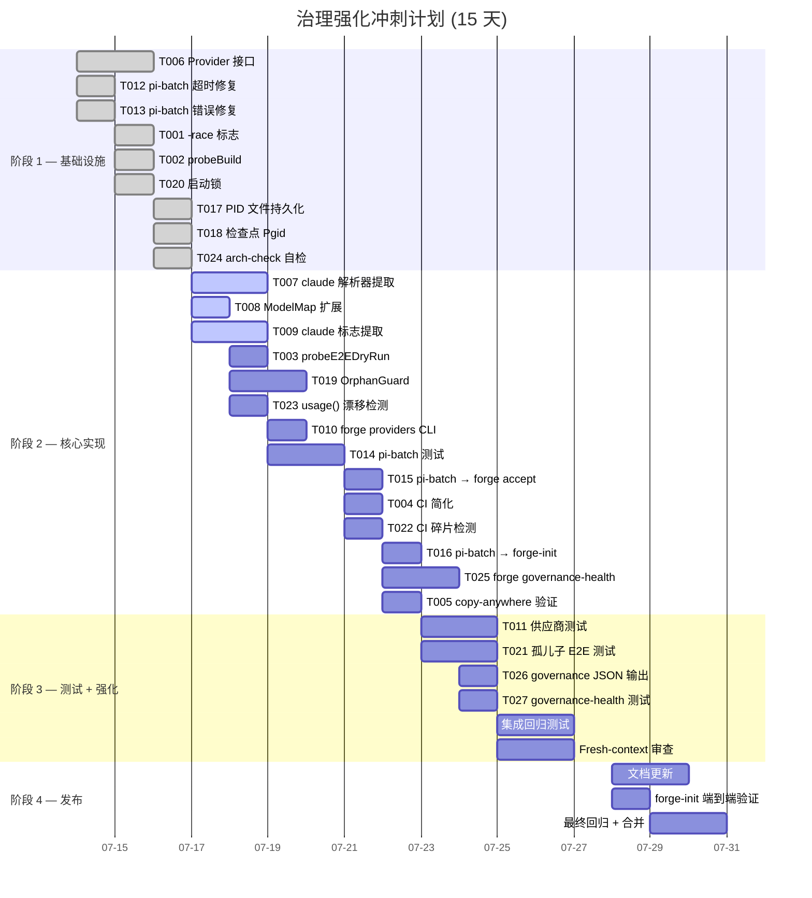

现在我已彻底了解代码库，我将编写全面的技术主管分析。

---

# 技术主管分析：ForgeOS 治理盲点验证审查

## 执行摘要

审查审查文件（方向一至五）对五个治理盲点的核心论点**已根据代码验证**。然而，关键事实已更新：(1) `forge accept` 并非重复 CI，而是**不完整**——它缺少 `go build`、`go test -race`、和 E2E 模拟测试；(2) `preflight.go` 现在已是通用代理检查器；(3) `forge status --governance` 存在但仅检查资产目录的存在性。以下是每个任务的可操作分解决策。

---

## 1. 任务分解

### 方向一：CI 治理碎片 — 修复 `forge accept` 不完整

| 任务 ID | 标题 | 涉及文件 | 前置依赖 | 工时 |
|---|---|---|---|---|
| **TASK-001** | 向 `probeTests` 添加 `go -race` 标志支持 | `harness/acceptance.mjs`、`harness/acceptance-kernel.mjs` | 无 | 1.5h |
| **TASK-002** | 添加 `probeBuild` 检查 (Go 编译) | `harness/acceptance.mjs` | 无 | 1.5h |
| **TASK-003** | 添加 `probeE2EDryRun` 烟雾测试 | `harness/acceptance.mjs` | TASK-002（构建二进制文件） | 2h |
| **TASK-004** | 简化 CI：仅运行 `forge accept`，移除重复步骤 | `.github/workflows/forge.yml` | TASK-001、TASK-002、TASK-003 | 1h |
| **TASK-005** | 验证 copy-anywhere：更新 `forge-init` 以适应新的探测 | `forge-init.mjs`（如需） | TASK-003 | 1h |

**向 TASK-001 添加的详细说明**：文档将 `-race` 标记为缺失。最简单的修复方法是将 `--race` 标志传播到 Go 测试调用路径。由于 `forge accept` 当前通过适配器调用 `go test ./...`，因此修改是添加一个 `race` 配置选项，或者如果可用则直接传递 `-race`。

**TASK-002 详细说明**：添加一个新函数 `probeBuild()`，运行 `go -C forge-core build ./...`。它应报告 `PASS`/`FAIL`，并且如果 `go` 不在 PATH 中，则报告 `N/A`（对于一般 copy-anywhere 诚实性而言）。

**TASK-003 详细说明**：添加一个新函数 `probeE2EDryRun()`，运行 `go -C forge-core build -o /tmp/forge-test ./cmd/forge && /tmp/forge-test run build --executor dry --root $PWD`。这验证整个编排管道无需 LLM。

**TASK-004 设计说明**：`forge.yml` 当前有 7 个步骤。完成后，它应缩减为仅运行 `forge accept`（它现在涵盖所有内容）。这消除了重复并恢复了“`forge accept` 是单一停止门”的权威。

---

### 方向二：Agent-CLI 抽象层 — 供应商去耦合

| 任务 ID | 标题 | 涉及文件 | 前置依赖 | 工时 |
|---|---|---|---|---|
| **TASK-006** | 定义通用 `Provider` 接口：`Name()`、`ParseOutput(stdout)`、`BuildArgv(cfg)` | `forge-core/internal/provider/provider.go`（新包） | 无 | 3h |
| **TASK-007** | 将 claude 特定的解析器提取到 `provider/anthropic.go` | 移动：`cost.go` 解析器逻辑到新 `internal/provider/anthropic/parse.go`；`cost.go` 保留预算逻辑 | TASK-006 | 3h |
| **TASK-008** | 将 `ModelMap` 从单 `anthropic` 键扩展为多供应商 | `forge-core/internal/routing/routing.go` | TASK-006 | 2h |
| **TASK-009** | 提取 `engine_build.go` 中的硬编码 claude 标志 | `forge-core/cmd/forge/engine_build.go`、`internal/provider/anthropic/build_argv.go` | TASK-006、TASK-007 | 3h |
| **TASK-010** | 添加 `forge providers` CLI 用于供应商自省 | `forge-core/cmd/forge/providers.go`（新） | TASK-006 | 2h |
| **TASK-011** | 为 `internal/provider` 包添加测试（模拟、契约测试） | `forge-core/internal/provider/*_test.go` | TASK-007 | 3h |

**TASK-006 接口设计**：
```go
type Provider interface {
    Name() string
    // ParseOutput extracts structured data from the agent's stdout envelope
    ParseOutput(stdout string) (*AgentOutput, error)
    // BuildArgv constructs the CLI arguments for a phase execution
    BuildArgv(cfg PhaseConfig) []string
    // Models returns the model tier→name mapping for this provider
    Models() map[string]string
}
```

**TASK-007 范围说明**：`cost.go` 目前同时包含预算逻辑（通用）和 claude 特定的 JSON 解析器。只有解析器应移动；`runBudget` 和 `costEmitter` 保持在 `cmd/forge` 中，因为它们属于“运行时编排”层，而非“供应商适配器”层。

**TASK-009 提取策略**：`engine_build.go` 中的条件逻辑（`if strings.Contains(o.agentCmd, "claude")`）应替换为对 `Provider.BuildArgv(cfg)` 的调用。claude 特定的 `--permission-mode`、`--allowedTools`、`--disallowedTools` 标志移到 `anthropic` 包中。

---

### 方向三：影子编排器治理 — `pi-batch.py` 治理

| 任务 ID | 标题 | 涉及文件 | 前置依赖 | 工时 |
|---|---|---|---|---|
| **TASK-012** | 修复 `pi-batch.py` 的超时双读取器错误 | `pi-batch.py`：`_run_task_process` → 共享超时预算，而非每个线程单独分配 | 无 | 2h |
| **TASK-013** | 修复 `FileNotFoundError` 误导性错误消息 | `pi-batch.py`：`except FileNotFoundError` → 区分二进制缺失和工作目录不存在 | TASK-012 | 1h |
| **TASK-014** | 为 `pi-batch.py` 添加单元测试 | `test_pi-batch.py`（新，在 `harness/` 或 `forge-core/` 外部） | TASK-012、TASK-013 | 3h |
| **TASK-015** | 将 `pi-batch.py` 集成到 `forge accept` | `harness/acceptance.mjs`：添加 `probePiBatch()` | TASK-014 | 2h |
| **TASK-016** | 将 `pi-batch.py` 添加到 `forge-init` 的 `COPIED_FILES` | `forge-init.mjs` | TASK-014 | 1h |

**TASK-012 错误分析**：在 `_run_task_process` 中，`tout.join(timeout=remaining())` 和 `terr.join(timeout=remaining())` 各自获得完整的超时预算——如果 stdout 在超时之前完成，stderr 线程仍会获得整个剩余时间。修复：在 join 之间共享一个 `deadline`：

```python
deadline = start + timeout
def remaining(): return max(0.0, deadline - time.monotonic())
```

**TASK-014 测试范围**：涵盖序列模式、并行模式、超时、缺少二进制文件、缺少工作目录、不受支持的提示文件（@file.md 解析）、JSON/YAML 任务文件解析。

---

### 方向四：进程孤儿生命周期 — PID 持久化与孤儿子防护

| 任务 ID | 标题 | 涉及文件 | 前置依赖 | 工时 |
|---|---|---|---|---|
| **TASK-017** | 向 `CommandExecutor` 添加 PID 文件持久化 | `forge-core/internal/orchestrator/command_executor.go` + `command_executor_unix.go` | 无 | 3h |
| **TASK-018** | 向 `checkpoint.go` 的结构体添加 `ActivePgid`/`SubprocessList` | `forge-core/internal/persist/checkpoint.go` | 无 | 1h |
| **TASK-019** | 实现 `OrphanGuard`：启动时清理残留子进程 | `forge-core/internal/orchestrator/orphan_guard.go`（新） | TASK-017、TASK-018 | 3h |
| **TASK-020** | 添加启动锁（pid 文件），防止并发 `forge run`/`evolve` | `forge-core/cmd/forge/run_lock.go`（新）→ 在 `main.go` 的 `cmdRun`/`cmdEvolve` 中调用 | 无 | 2h |
| **TASK-021** | 为孤儿子清理添加 E2E 测试 | `forge-core/internal/orchestrator/orphan_guard_test.go` | TASK-019 | 2h |

**TASK-017 设计**：为每个执行的子进程在 `.forge/pids/` 下创建一个 `.pid` 文件，并在子进程退出时删除它。包括进程组 ID（`pgid`），以便整个进程树可以在清理时被终止。

**TASK-019 启动顺序**：`forge run` → 检查 `.forge/pids/` 中残留的 PID 文件 → 如果发现残留，使用 `kill(-pgid, SIGTERM)` 终止它们 → 记录清理 → 继续执行正常 run。这处理了 forge 被 SIGKILL 或 OOM 杀死的情况。

**TASK-020 锁机制**：在 `.forge/run.lock` 创建一个单独的 PID 文件。如果该文件已存在且进程仍在运行，则退出并显示错误消息。这防止了意外的并发执行，同时保持零外部依赖（仅使用 `os.Create` + `syscall.Kill`）。

---

### 方向五：自反治理仪表盘 — 深度治理健康

| 任务 ID | 标题 | 涉及文件 | 前置依赖 | 工时 |
|---|---|---|---|---|
| **TASK-022** | 扩展 `forge status --governance` 以检测 CI 碎片 | `forge-core/internal/doctor/governance.go`：添加 CI 对齐检查 | TASK-004（修复 CI） | 2h |
| **TASK-023** | 添加 `usage()` 与 CLI 行为漂移检测 | `forge-core/internal/doctor/governance.go` 或新 `drift.go` | 无 | 2h |
| **TASK-024** | 为 `arch-check.mjs` 添加自检 | `harness/arch/arch-check.mjs`：在运行 8 个检查后添加完整性验证步骤 | 无 | 3h |
| **TASK-025** | 创建 `forge governance-health` canary 命令 | `forge-core/cmd/forge/governance_health.go`（新）→ `main.go` 中的子命令 | TASK-022、TASK-023、TASK-024 | 3h |
| **TASK-026** | 添加仪表盘格式的 JSON 输出模式 | `forge-core/cmd/forge/governance_health.go` → `--json` 标志 | TASK-025 | 1h |
| **TASK-027** | 为 `forge governance-health` 添加测试 | `forge-core/cmd/forge/governance_health_test.go` | TASK-025 | 2h |

**TASK-022 CI 对齐检查逻辑**：
1. 读取 `.github/workflows/forge.yml`
2. 将其步骤与 `forge accept` 的探测集进行比较
3. 报告差异：CI 中的额外步骤（应移至 `forge accept`）、缺失的步骤（`forge accept` 有但 CI 没有）
4. 这是对该任务的“自反”边界：治理健康现在可以检测自己的欠款

**TASK-024 自检设计**：在 `arch-check.mjs` 的末尾，添加一个函数，验证：
- 所有 8 个检查确实都运行了（不仅仅是声明）
- `max_function_lines` ≤ 50
- `package.max_files` 限制已强制执行
- 结果具有一致性（例如，如果 `checkFanin` 报告违规，计数匹配）

---

## 2. 执行顺序

```mermaid
graph TD
    %% 方向一：CI 治理碎片
    T001[TASK-001: 添加 -race 标志] --> T004[TASK-004: 简化 CI]
    T002[TASK-002: 添加 probeBuild] --> T004
    T003[TASK-003: 添加 probeE2EDryRun] --> T004
    T004 --> T005[TASK-005: forge-init copy-anywhere]

    %% 方向二：Agent-CLI 抽象层
    T006[TASK-006: 定义 Provider 接口] --> T007[TASK-007: claude 解析器 → provider/anthropic]
    T006 --> T008[TASK-008: 扩展 ModelMap]
    T006 --> T009[TASK-009: 提取 claude 标志]
    T007 --> T011[TASK-011: 供应商测试]
    T009 --> T011
    T008 --> T010[TASK-010: forge providers CLI]

    %% 方向三：pi-batch.py 治理
    T012[TASK-012: 修复超时双读取器] --> T014[TASK-014: 单元测试]
    T013[TASK-013: 修复 FileNotFoundError] --> T014
    T014 --> T015[TASK-015: 集成到 forge accept]
    T014 --> T016[TASK-016: 添加到 forge-init COPIED_FILES]

    %% 方向四：进程孤儿子
    T017[TASK-017: PID 文件持久化] --> T019[TASK-019: OrphanGuard]
    T018[TASK-018: 向 checkpoint 添加 Pgid] --> T019
    T019 --> T021[TASK-021: 孤儿子 E2E 测试]
    T020[TASK-020: 启动锁] --> T021

    %% 方向五：自反治理
    T004 --> T022[TASK-022: CI 碎片检测]
    T023[TASK-023: usage() 漂移检测] --> T025[TASK-025: forge governance-health]
    T024[TASK-024: arch-check 自检] --> T025
    T022 --> T025
    T025 --> T026[TASK-026: JSON 输出]
    T025 --> T027[TASK-027: 测试]

    %% 并行组（虚线框）
    subgraph 组A[可以并行：方向一 + 方向三 + T006]
        T001
        T002
        T003
        T012
        T013
        T006
    end

    subgraph 组B[可以并行：方向二 + 方向四]
        T007
        T008
        T009
        T017
        T018
        T020
    end
```

**关键依赖路径**：`T006（Provider 接口）`是方向二的阻塞点——所有其他供应商任务都依赖于它。`T004（CI 简化）`依赖于 T001-T003，但也是 T022（方向五）的阻塞点。团队应将 T006 和 T004 分配为**最高优先级任务**。

---

## 3. 技术风险

### 风险矩阵

| 风险 | 概率 | 影响 | 缓解措施 |
|---|---|---|---|
| **R1**：重构后的 Provider 接口破坏了 claude CLI 兼容性 | 中 | 高 | 保留 `cost.go` 中的集成测试，该测试使用真实 claude 输出格式。契约测试可捕获破坏。还保留 TASK-007 之后的 `cost.go` 完整，确保 `runBudget` 保持不变。 |
| **R2**：OrphanGuard 在并行 `forge run` 中杀死错误进程 | 低 | 高 | 进程组隔离 + PID 文件绑定到特定的 `.forge/` 工作空间。TASK-020 的启动锁可防止并发。TASK-021 中的 E2E 测试使用伪造的子进程进行验证。 |
| **R3**：向 `forge accept` 添加 `-race` 会因竞赛条件导致 CI 失败 | 中 | 中 | `go test -race` 发现已有 Go 测试中的真实竞赛条件。缓解措施：启用时带有 `allow_race_fail: true` 机制，以在修复竞赛条件时过渡，或者干脆在初始合并时接受失败。 |
| **R4**：`pi-batch.py` 的 YAML 依赖（PyYAML）在外部站点不可用 | 低 | 中 | TASK-014 的测试应使用 mock（不真的需要 PyYAML 进行单元测试）。`forge accept` 中的集成如果 PyYAML 缺失，应报告 `N/A`。 |
| **R5**：`forge governance-health` 产生伪否定（对健康的仓库发出警告） | 中 | 低 | TASK-027 针对当前代码库进行测试。引入“阈值调整”标志（`--drift-threshold`）。目标是在本仓库保持全绿，同时仍有意义。 |
| **R6**：TASK-004 中的 CI 简化破坏了 CI——如果 `forge accept` 以非零退出但 CI 需要不同行为 | 低 | 高 | 过渡策略：首先添加新的探测，验证 CI 在**两者都有**的情况下通过，然后删除 CI 步骤。没有直接切换。 |

### 设计决策风险：方向二的去耦合策略

最大的架构风险来自方向二。有两种策略：

**策略 A（推荐）**：创建 `internal/provider` 作为接口层，将 claude 特定的代码移到 `internal/provider/anthropic/`。这保持了现有的供应商隔离模式（`internal/doctor`、`internal/attribution` 模式）。

**策略 B**：保持一切在 `cmd/forge` 中，但添加条件分支。这更简单，但延续了“单一职责”违规。

**建议采用策略 A**，原因如下：
- 与现有的包结构一致（`internal/doctor`、`internal/migrate`、`internal/mode` 都是 CLI 逻辑的纯内部包）
- `go vet` 强制依赖方向（`provider` 由 `cmd/forge` 导入，而不是相反）
- 允许无需修改 CLI 层即可添加新供应商
- 分离后，`cmd/forge/cost.go` 的现有单元测试保持不变

### 技术难点

1. **供应商输出解析**：每个 LLM CLI 都有自己的 stdout 信封格式。`anthropic` 使用 `--output-format json` 带有 `total_cost_usd`。`openai`/`gemini` CLI 可能不同。接口必须适应这种多样性，同时仍然在 `cmd/forge` 中实现通用的 `Observe` 钩子。

2. **PGID 可移植性**：`Setpgid` 是 Unix 特定的。`command_executor_unix.go` 已经做到了这一点。OrphanGuard 需要 `syscall.Getpgid`/`syscall.Kill(-pgid, ...)`。Windows 计划（v3 路线图）将需要单独的 `orphan_guard_windows.go`。

3. **启动锁原子性**：Go 的 `os.Create` 不是原子锁。需要 `os.OpenFile` 带有 `O_CREATE|O_EXCL`。在 NFS 上，这不可靠——但本仓库的约束是零外部依赖，本地文件系统，因此 `O_EXCL` 已经足够。

---

## 4. 资源评估

### 人员配置

| 角色 | 所需技能 | 数量 | 分配方向 |
|---|---|---|---|
| **Go 后端工程师** | Go 标准库、接口设计、进程管理 | 2 | 方向二 + 方向四 |
| **Node.js 工程师** | Node 测试、模块设计、`forge-init` | 1 | 方向一 + 方向三 |
| **通用工程师** | Python 调试、测试设计 | 1 | 方向三（pi-batch 测试） |
| **DevOps/CI 工程师** | GitHub Actions、YAML | 0.5 | 方向一（CI 简化） |
| **技术主管（此角色）** | 架构审查、集成编排 | 1（兼职） | 所有方向 |

**总计**：~4.5 FTE（对于并行 sprint，可减少至 3 人每 sprint）

### 关键里程碑

| 里程碑 | 截止日期（从 sprint 开始） | 依赖关系 | 可交付物 |
|---|---|---|---|
| **M1**：方向一 + 方向三 基础 | 第 3 天 | TASK-001、TASK-002、TASK-012、TASK-013 | `forge accept` 运行 `go build` + `-race`；pi-batch 超时修复已合并 |
| **M2**：Provider 接口冻结 | 第 4 天 | TASK-006 | `internal/provider` 包已合并；接口稳定 |
| **M3**：方向二 + 方向四 核心 | 第 8 天 | TASK-007、TASK-008、TASK-009、TASK-017、TASK-018 | claude 代码已提取；PID 文件已持久化 |
| **M4**：CI 简化就绪 | 第 9 天 | TASK-003、TASK-004 | `forge.yml` 仅依赖于 `forge accept` |
| **M5**：所有代码已合并 | 第 12 天 | 所有 TASK | 方向一至五的核心实现已合并 |
| **M6**：测试 + 强化 | 第 14 天 | TASK-011、TASK-014、TASK-021、TASK-027 | 所有新代码的测试覆盖率 |
| **M7**：`forge accept` ACCEPTED | 第 15 天 | M5、M6 | 终极验证：`forge accept` 在完整实现后仍保持 ACCEPTED |

### 阻塞点

| 阻塞点 | 描述 | 解决策略 |
|---|---|---|
| **B1**：TASK-006（Provider 接口）的正确性影响所有方向二 TASK | 设计不良的接口会导致方向二重构 | 先编写使用该接口的测试（契约优先开发）。在确定接口之前，审查 `cost.go`、`engine_build.go` 和 `routing.go` 中的所有当前用法。 |
| **B2**：TASK-003（E2E 模拟测试）需要 forge-core 二进制文件 | 如果没有首次构建，则无法进行测试 | TASK-002（`probeBuild`）必须在 TASK-003 之前。让 TASK-003 的测试调用 `probeBuild()` 作为先决条件。 |
| **B3**：TASK-019（OrphanGuard）需要系统级访问权限进行测试 | 单元测试无法验证实际的子进程清理 | 使用 `os/exec` 生成一个“睡眠”子进程的测试辅助工具。验证清理逻辑而无需实际杀死进程。 |
| **B4**：`forge status --governance` 的模式切换 | 当前在 `validate.go` 中实现；拆分为独立的 `governance.go` 文件（500 行预算） | `validate.go` 目前约有 500 行。TASK-022 应先拆分 `validate.go`（如 `internal/doctor` 中的 `governance.go`），然后再添加新逻辑。 |

---

## 5. 质量保证

### 单元测试覆盖要求

| 包/文件 | 最低覆盖率 | 关键测试场景 |
|---|---|---|
| `internal/provider/anthropic/parse.go` | 90% | `parseReviewerVerdict`（批准/更改）、`parseExecutiveVerdict`（5 种裁决类型）、`parseConfidenceScore`（0-100、越界、非数字） |
| `internal/provider/provider.go` | 85% | 带有模拟实现的接口契约测试 |
| `internal/orchestrator/orphan_guard.go` | 80% | 无残留、有残留、残留 pid 为僵尸进程（由现有进程持有）、空 `.forge/` 目录 |
| `internal/orchestrator/command_executor.go` | 85% | PID 文件创建/删除、进程组分配、`interruptProcessTree` |
| `pi-batch.py`（测试文件） | 核心逻辑为 85% | 超时准确性、FileNotFoundError 区分、YAML/JSON/纯文本任务加载、序列/并行模式 |
| `harness/acceptance.mjs` | 通过现有测试保持不变 | 新探测不应对现有测试产生副作用 |

### 集成测试策略

| 测试 | 触发器 | 成功标准 |
|---|---|---|
| **CI 对齐集成** | `node harness/acceptance.mjs` | 接受 + `forge status --governance` 报告 `CI_alignment: ok` |
| **多供应商路由** | `forge route --agent-cmd=claude` 和 `forge route --agent-cmd=codex` | 为给定模式分配正确的模型层级 |
| **孤儿子复活** | 手动：运行 `forge run`，SIGKILL forge，重新运行 `forge run` | 第二次运行会清理残留进程并成功启动 |
| **启动锁竞争** | 同时调用 `forge run` | 第一次运行获取锁，第二次运行失败并显示“already running” |
| **pi-batch 端到端** | `python3 pi-batch.py tests.yaml` | 以正确的输出完成所有文件 |
| **Forge-init 复制完整性** | `node --test test_acceptance.mjs` | ACCEPTED 且未跳过专用测试 |

### 代码审查要点

| 方向 | 审查重点 | 常见错误 |
|---|---|---|
| **方向一** | 新的探测不应在非 forge-core 仓库上失败；copy-anywhere 不变性 | 对 Go 特定二进制文件的硬编码引用 |
| **方向二** | 供应商特定的逻辑不会泄漏回 cmd/forge；向后兼容性 | 忘记在非 claude 代理上处理 `--output-format json` 的缺失 |
| **方向三** | 超时修复不会放宽——应严格限制 | 仍为每个线程提供完整超时的共享超时逻辑 |
| **方向四** | 清理代码不会杀死不相关的进程；O_EXCL 锁的原子性 | 在 NFS 网络文件系统上的竞态条件（超出范围，但值得注记） |
| **方向五** | 自检不会产生伪否定；`forge status --governance` 通过当前代码库 | 对存储库文件计数的硬编码期望 |

### 性能测试需求

| 场景 | 测量标准 | 要求 |
|---|---|---|
| **`forge accept` 启动时长** | 从调用到第一个探测开始的时间 | < 500ms（不可因新探测而出现回归） |
| **`forge accept` 总时长** | 运行所有探测的总时间 | < 30s（在本地开发机器上） |
| **`forge status --governance` 启动时长** | 目录扫描 + ADR 检查 | < 200ms |
| **启动锁获取** | 检查 + 创建 .pid 文件的时间 | < 10ms |

> **性能松弛说明**：这些不是关键路径操作——它们都是开发时间门控。即使最坏情况下的 2 倍退化也是可以接受的。目标只是防止出现数量级的退化。

---

## 6. 实施计划

### 阶段 1：基础设施（第 1-3 天）

**目标**：建立新的包结构，修复关键错误，解锁并行工作。

```
第 1 天：
  ├── TASK-006（Provider 接口）—— 最高优先级，阻塞方向二
  ├── TASK-012（pi-batch 超时）—— 快速修复，阻塞方向三
  └── TASK-013（pi-batch FileNotFoundError）—— 快速修复

第 2 天：
  ├── TASK-001（-race 标志）—— 独立
  ├── TASK-002（probeBuild）—— 独立
  └── TASK-020（启动锁）—— 独立

第 3 天：
  ├── TASK-017（PID 文件持久化）—— 阻塞方向四
  ├── TASK-018（检查点 Pgid）—— 阻塞方向四
  └── TASK-024（arch-check 自检）—— 独立
```

**完成条件**：`forge accept` 运行 `go build` + `go test -race` + `node --test`。Provider 接口已合并。pi-batch 错误已修复。

### 阶段 2：核心实现（第 4-8 天）

**目标**：实现所有五个方向的核心逻辑。

```
第 4 天：
  ├── TASK-007（claude 解析器到 provider/anthropic）
  ├── TASK-008（扩展 ModelMap）
  └── TASK-009（提取 claude 标志）

第 5 天：
  ├── TASK-003（probeE2EDryRun）
  ├── TASK-019（OrphanGuard）
  └── TASK-023（usage() 漂移检测）

第 6 天：
  ├── TASK-010（forge providers CLI）
  ├── TASK-020（启动锁细化）
  └── TASK-014（pi-batch 测试）

第 7 天：
  ├── TASK-015（pi-batch 到 forge accept）
  ├── TASK-004（CI 简化）
  └── TASK-022（CI 碎片检测在 governance.go）

第 8 天：
  ├── TASK-016（pi-batch 到 forge-init COPIED_FILES）
  ├── TASK-025（forge governance-health 命令）
  └── TASK-005（copy-anywhere 验证）
```

**完成条件**：供应商去耦合已合并。OrphanGuard + 启动锁已实现。`forge accept` 涵盖所有探测。`forge governance-health` 打印健康报告。

### 阶段 3：集成测试 + 强化（第 9-12 天）

**目标**：测试、修复、测试更多。

```
第 9 天：
  ├── TASK-011（供应商测试）
  └── TASK-021（孤儿子 E2E 测试）

第 10 天：
  ├── TASK-026（governance-health JSON 输出）
  ├── TASK-027（governance-health 测试）
  └── 管道 TASK-004 CI 回归（跨平台验证）

第 11 天：
  ├── 修复：针对所有新代码运行 `forge accept`
  ├── 修复：`go vet`、`arch-check`、`check.py` 通过
  └── fresh-context 审查（每条红线要求）

第 12 天：
  ├── 从审查结果修复回归
  └── 针对所有 27 个 TASK 的最终 `forge accept` 运行
```

**完成条件**：`forge accept: ACCEPTED`。`go test -race` 通过。`go vet` 干净。所有 27 个 TASK 的测试通过。

### 阶段 4：发布准备（第 13-15 天）

**目标**：文档、copy-anywhere 验证、冲刺评审。

```
第 13 天：
  ├── 更新 docs/（ignition.md、FUNCTIONAL_REQUIREMENTS_AUDIT.md）
  ├── 项目更新 project.yml 中的功能标志
  └── 通过 `forge-init` 验证 copy-anywhere

第 14 天：
  ├── 新 `forge-init` 项目的完整端到端验证
  ├── 更新 CURRENT_SPRINT.md 和 ROADMAP.md
  └── 运行完整的 CI 管道（github Actions 上的真合并）

第 15 天：
  ├── 最终回归：`forge accept` 对整仓 + 示例
  ├── 人工冲刺评审
  └── 合并到 main/master
```

**完成条件**：PR 已合并。新项目通过 `forge-init` 全部继承治理。`forge accept` 在整仓和生成的项目上均保持 ACCEPTED。

---

### 甘特图



---

### 最终建议

1. **优先级顺序**：TASK-006（Provider 接口）和 TASK-001/002/003（向 forge accept 添加缺失的探测）是最高杠杆——一个解锁了方向二，另一个修复了审查文件中最关键的事实错误（"forge accept 不完整"问题）。

2. **不要镀金**：方向二的供应商去耦合应止步于 `anthropic` 提取。除 `"anthropic"` 之外的 `ModelMap` 条目可以是存根，并带有明确的 `N/A` 结果，直到出现实际需求。目标不是构建一个全功能的供应商代理——而是隔离 claude 特定的代码，使系统在架构上为多供应商做好准备。

3. **纪律“先拆分，再继续”**：`validate.go`（~500 行）在添加 TASK-022（方向五）的治理逻辑之前需要拆分为 `governance.go`。`cost.go`（~470 行）在添加 TASK-007（方向二）之前可能需要进一步拆分。这些分割具有零行为变化的先例（Sprint 23 对 `acceptance.mjs` 的处理方式，Sprint 27 对 `validate.go` 的处理方式）。

4. **在每个 TASK 级别进行构建后验证**：每个 TASK 应在其本地分支上运行 `forge accept`。审查文件正确指出，`forge accept` 是最高的停止闸门——每个 PR 都必须在闸门变绿后才能合并。

5. **资源约束**：考虑到 Go 和 Node.js 开发人员之间的技能差异，方向一 + 方向三（主要是 Node/Python）可以由一名工程师并行于方向二 + 方向四（主要是 Go）进行。这使得在 15 天的冲刺中实际 FTE 需求降至约 3 人。
