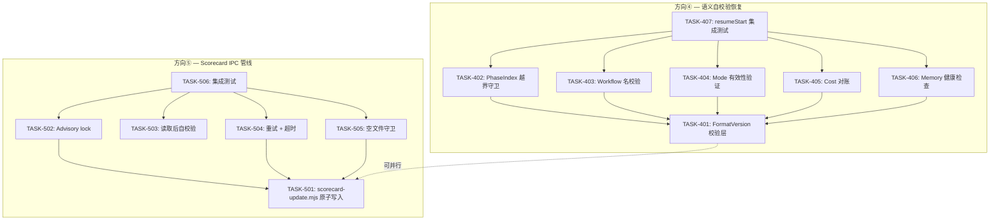
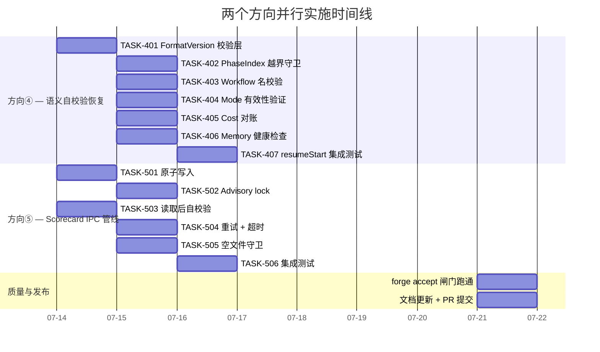

现在我已经掌握了两个方向的全面信息。接下来我将从 Tech Lead 的视角撰写分析报告。

---

# Tech Lead 分析：Forge-core 两个真实结构性盲区

> **基于**: `forge-core-five-unseen-structural-gaps.out.md` 交叉验证结果  
> **涵盖方向**: ④ 无语义自校验恢复（P1）· ⑤ Scorecard IPC 管线（P2）  
> **角色**: Tech Lead · 工程实现与项目管理视角

---

## 1. 任务分解

### 方向④ — 无语义自校验的状态目录恢复（P1）

| 任务 ID | 标题 | 涉及文件 | 前置依赖 | 预估工时 | 验收标准 |
|---------|------|---------|---------|---------|---------|
| TASK-401 | **添加 FormatVersion 校验层** | `internal/persist/checkpoint.go` | 无 | 3h | `decode()` 在 JSON 解析后检查 `FormatVersion` 值与已知版本列表匹配；未知版本返回硬错误；单元测试覆盖 v1 通过、未知版本拒绝、空字段向后兼容 |
| TASK-402 | **PhaseIndex 越界守卫** | `cmd/forge/evolve.go` → `resumeStart()` | TASK-401 | 2h | resume 时校验 `cp.PhaseIndex < len(wf.Phases)`；越界时 WARNING 后从 phase 0 恢复，不阻塞 |
| TASK-403 | **Workflow 名校验** | `cmd/forge/evolve.go` → `resumeStart()` | TASK-401 | 1.5h | 当前 `resumeStart` 未传入 `wf` 参数——重构签名，传入 `wf.Stage`；若 checkpoint.Workflow != wf.Stage，WARNING 后从 iteration 0 恢复 |
| TASK-404 | **Mode 有效性验证** | `cmd/forge/evolve.go` + `internal/mode/mode.go`（确认接口） | TASK-401 | 1.5h | 通过 `mode.ModeFor(cp.Mode)` 验证；未知 Mode 回退到 lifecycle 缺省值并告警 |
| TASK-405 | **Cost 对账：trace ↔ checkpoint** | `cmd/forge/evolve.go` → `resumeStart()` | TASK-401 | 4h | resume 时扫描 trace.jsonl 求和 `CostUsdMicros`；如果与 `SpentUsdMicros` 偏差 > 5%，记录 WARNING 但不阻塞；单元测试覆盖偏差在 0%、5%、20% 三种场景 |
| TASK-406 | **Memory 健康检查** | `cmd/forge/evolve.go` new function `healthCheckMemory()` | TASK-401 | 2h | resume 前执行 `memory.Load(memoryPath)`；如果返回错误（损坏行），WARNING 后以空 memory 冷启动，保留原文件备份 |
| TASK-407 | **resumeStart 集成测试** | `cmd/forge/evolve_test.go` | TASK-402~406 | 4h | 全链路集成测试：种子合法/损坏/不匹配/越界的 checkpoint + trace，验证 `resumeStart` 输出符合预期；mock `wf.Phases` |

**方向④ 总计: 18h（约 2.25 人天）**

---

### 方向⑤ — Scorecard IPC 管线韧性（P2）

| 任务 ID | 标题 | 涉及文件 | 前置依赖 | 预估工时 | 验收标准 |
|---------|------|---------|---------|---------|---------|
| TASK-501 | **scorecard-update.mjs 原子写入** | `harness/scorecard-update.mjs` | 无 | 3h | 写入改为临时文件 → `rename(2)` 模式；测试验证中断后原文件不变（模拟中途退出） |
| TASK-502 | **Advisory lock 防并发写入** | `cmd/forge/scorecard_wind.go` + `harness/scorecard-update.mjs`（或纯 Go 侧） | TASK-501 | 4h | 在 `.forge/scorecard.lock` 上使用 `flock(2)`（Go 侧，因为 `exec.Command` 可以预打开 lock fd）；两个并行进程第二个等待或超时报错 |
| TASK-503 | **scorecard.json 读取后自校验** | `internal/routing/scorecard.go` → `LoadScorecards()` | 无（可独立完成） | 3h | 加载后校验每个 `Scorecard.QualityScore` 在 [0,1] 内、`Samples >= 0`、`UpdatedAt` 可解析；异常条目告警并跳过 |
| TASK-504 | **`windDownScorecards` 重试 + 超时** | `cmd/forge/scorecard_wind.go` → `runScorecardUpdateWithOut()` | TASK-501 | 3h | 为 `exec.Command` 添加 30s 超时（context.WithTimeout）；增加一次重试；失败日志明确区分"node 不存在"、"超时"、"非零退出" |
| TASK-505 | **空文件 / 首次运行的冷启动守卫** | `cmd/forge/scorecard_wind.go` + `harness/scorecard-update.mjs` | TASK-501 | 2h | trace 为空 或 无 cost event 时 scorecard-update 退出前不覆盖已有 scorecards.json |
| TASK-506 | **`scorecardPath()` 可配置 + 并行测试** | `cmd/forge/scorecard_wind.go` + test | TASK-501~505 | 4h | 集成测试：并行写 + 原子性 + 自校验全链路验证；测试使用临时路径不污染真实 `.agent/routing/scorecards.json` |

**方向⑤ 总计: 19h（约 2.4 人天）**

---

## 2. 执行顺序与依赖图



**并行组**:
- **组 A**（方向④）: TASK-401→402/403/404/405/406 → 407
- **组 B**（方向⑤）: TASK-501→502/504/505 + TASK-503(独立) → 506

两个组**完全无依赖关系**，可由两个开发者并行执行。

---

## 3. 技术风险

### 3.1 方向④ 风险

| 风险 | 概率 | 影响 | 缓解策略 |
|------|------|------|---------|
| **resumeStart 签名变更波及过多调用方** | 中 | 高 | `resumeStart` 当前只在 `execLoop` 一处调用，但需传入 `wf` 参数。好的做法：定义 `ResumeOpts` 结构体而非逐个加参数 |
| **Cost 对账的 trace 扫描性能** | 低 | 中 | trace.jsonl 可能达 10MB（`openTracer` 的 rotate 阈值）。对账只在 resume 时执行一次，O(n) 扫描 OK。但需注意不对主要演化路径造成延迟 |
| **Memory 健康检查的误报** | 中 | 低 | memory.jsonl 可能在正常运行中出现单行损坏（O_APPEND 保证行原子性不保证连续读取不遇截断）。健康检查的设计是"告警 + 冷启动"，不阻塞，误报成本可控 |
| **resumeStart 测试环境搭建复杂** | 中 | 中 | 需要构造损坏的 checkpoint/trace/memory 文件 + 模拟各种边界。建议用 `t.TempDir()` + 种子文件模式，避免 mock |

### 3.2 方向⑤ 风险

| 风险 | 概率 | 影响 | 缓解策略 |
|------|------|------|---------|
| **`flock` 在 Docker/NFS 上不可靠** | 中 | 高 | Docker 内 `/` 通常是 ext4/xfs，flock(2) 可靠。NFS 上 `flock` 退化为 `fcntl`——部分 NFS 实现不支持跨主机锁。降级策略：检测到 `flock` 不可用时降级为"尽力而为"（日志告警 + 继续） |
| **Node.js scorecard-update 改造为原子写入的改动姿势** | 低 | 中 | `writeFileSync` → `writeFileSync(tmp)` + `renameSync` 是标准模式，风险低。但需注意 `.gitignore` 可能忽略 `.tmp` 文件 |
| **原子写入和 lock 的组合并非分布式安全** | 高（已接受） | 低（范围内） | 当前只在单仓库环境下使用。分布式文件系统场景（如团队共享仓库）超出 v1 范围。设计时明确此局限即可 |
| **scorecard-update.mjs 调用次数太多** | 低 | 中 | `windDownScorecards` 每对 (model, task_type) 调用一次 `exec.Command`。在有多模型多任务类型场景下可能产生 6-10 次子进程。如需优化，将 batch 能力从 Node.js 侧合并 |

### 3.3 跨方向风险

| 风险 | 概率 | 影响 | 缓解策略 |
|------|------|------|---------|
| **方向③（非本文方向）的 scorecard 逻辑移植与方向⑤的任务冲突** | 中 | 中 | 方向③建议将 scorecard-update.mjs 移植到 Go——如果执行该方向，方向⑤的 TASK-501~502 需要在 Go 侧重做。两个方向的执行顺序需协调 |

---

## 4. 资源评估

### 4.1 人员需求

| 角色 | 技能要求 | 数量 | 分配 |
|------|---------|------|------|
| **Go 后端工程师** | Go 标准库熟练、熟悉 `os/exec`、JSON 处理、文件系统操作 | 1 人 | 方向④ (TASK-401~407) + 方向⑤ (TASK-502~506) |
| **Node.js/TypeScript 工程师** | Node.js fs 模块、CLI 工具开发 | 0.5 人（或 Go 工程师兼修） | 方向⑤ (TASK-501, TASK-505 scorecard-update.mjs 侧) |

**建议**: 1 名 Go 工程师 + 0.5 名（兼职）可覆盖全部任务。若由一人承担，需要按顺序执行两个方向并自行解决 Node.js 侧修改。

### 4.2 关键里程碑

| 里程碑 | 时间节点 | 交付物 |
|--------|---------|--------|
| **M1 — 基础校验落地** | Day 1~2 | TASK-401 + TASK-402 + TASK-503 完成，PR 合并 |
| **M2 — 方向④ 核心完成** | Day 3~4 | TASK-403~406 完成，集成测试 TASK-407 通过 |
| **M3 — 方向⑤ 写入侧加固** | Day 3~4 | TASK-501 + TASK-502 + TASK-504 完成 |
| **M4 — 方向⑤ 读取侧 + 集成** | Day 5~6 | TASK-503 + TASK-505 + TASK-506 完成 |
| **M5 — 全量通过 + 文档** | Day 7 | 所有闸门通过、`CLAUDE.md`/`BOOTSTRAP.md` 更新、方向专项文档归档 |

### 4.3 阻塞点（Blockers）与解决策略

| Blocker | 影响 | 解决策略 |
|---------|------|---------|
| **resumeStart 函数演化**：需要传入 `wf` 参数和 `mode` 验证接口 | TASK-402/403/404 的前置 | 使用 `ResumeOpts` 结构体减少签名变更连锁影响 |
| **flock 跨平台兼容性** | TASK-502 在 Windows/WSL 上的可用性 | 先验证 Linux 主路径，加一个 `// +build linux,darwin` 的构建标记；Windows 用户使用 N/A 降级 |
| **Node.js 侧修改不属于 forge-core 的 Go 包** | TASK-501 需要跨工程理解 `harness/scorecard-update.mjs` | 非 Go 工程师需要额外 0.5 天熟悉代码结构；文档 `harness/scorecard-update.mjs:1-30` 已清晰说明了接口 |

---

## 5. 质量保证

### 5.1 方向④ 测试策略

| 层次 | 类型 | 覆盖内容 | 新建/增量 |
|------|------|---------|----------|
| **单元测试** | Go `*_test.go` | `checkpoint.decode()` FormatVersion 验证；`memory.Load()` 损坏行处理 | 新增 3 个 |
| **单元测试** | Go `*_test.go` | `resumeStart()` 各守卫独立测试（PhaseIndex/Workflow/Mode/Cost/Memory） | 新增 5~6 个 |
| **集成测试** | Go `TestExecLoop_Resume*` | 全链路 checkpoint + trace + memory 综合场景 | 新增 2~3 个 |
| **修复性回测** | Go `TestDoctorAnomaly*` | 确认现有 forge doctor 的 anomaly 检测不受新守卫影响 | 更新 1 个 |

**关键设计原则**: 
- 新守卫必须**可独立测试**——不应依赖完整的 loop engine 构建
- Cost 对账的偏差阈值（5%）应作为**可配置常量**，便于未来调整
- Memory 健康检查不宜引入额外的 package dependency——直接复用 `memory.Load()`

### 5.2 方向⑤ 测试策略

| 层次 | 类型 | 覆盖内容 | 新建/增量 |
|------|------|---------|----------|
| **单元测试** | Go `*_test.go` | `LoadScorecards()` 自校验逻辑：合法/越界/空文件 | 新增 3 个 |
| **单元测试** | Node.js 或 Go | scorecard-update.mjs 原子写入（可通过 `fs.writeFileSync` + `fs.renameSync` 模式验证） | 新增 2 个 |
| **集成测试** | Go `TestScorecardWind*` | 全链路：种子 trace → windDownScorecards → 读取 → 校验 | 新增 2 个 |
| **并发测试** | Go `TestScorecardWind_Concurrent` | 两个 goroutine 同时调用 `windDownScorecards`，验证 lock 生效 | 新增 1 个 |

**关键设计原则**:
- 集成测试必须使用**隔离的临时文件系统**，不能写入 `.agent/routing/scorecards.json`
- 并发锁测试可以用 `t.Parallel()` + `sync.WaitGroup` 设计竞态窗口
- scorecard-update.mjs 的原子写改造需在**单独的 PR** 中先交付，便于回滚

### 5.3 代码审查要点

| 方向 | 审查重点 |
|------|---------|
| ④ | 【格式版本】新版本号添加是否需要更新已知列表？decoder fail-closed 是否遗漏了向后兼容场景？ |
| ④ | 【Cost 对账】扫描 trace 的 `bufio.Scanner` buffer 大小是否匹配 `openTracer` 的 rotate 阈值？ |
| ④ | 【Memory 健康检查】"告警后冷启动"的模式是否在现有 loop engine 的 `fail-loud-and-continue` 框架内？ |
| ⑤ | 【原子写】`rename(2)` 前是否确保 tmp 和目标在同一个 filesystem？（`persist.Save` 已有最佳实践参考） |
| ⑤ | 【Lock】lock 文件的清理时机——进程 crash 后 lock 残留如何处理？（`flock` 随 fd 释放，进程级清理没问题） |
| ⑤ | 【自校验】拒绝的条目是否日志级别够醒目？应避免静默丢弃数据。 |

### 5.4 性能测试需求

| 场景 | 方法 | 可接受阈值 |
|------|------|-----------|
| resume 带 10MB trace 的成本对账 | `go test -bench=BenchmarkResumeCostReconciliation` | < 500ms |
| 并发 scorecard 写入竞争 | `go test -bench=BenchmarkConcurrentScorecard -count=10` | 无 data race、无死锁 |
| 现有 `forge evolve` 基准对比 | 在 `testdata/` 上跑回归 | 各守卫的总耗时 < 50ms（相对于 24h 运行的噪声级） |

其中性能回归只需在**首次实现**时建立基线，CI 中可以不强制（当前 CI 无 benchmark gate，见 `forges-five-hidden-product-quality-gaps.md` 方向三）。

---

## 6. 实施计划

### 方向④ + 方向⑤ 并行时间线（共 7 天）



### 关键阶段说明

**阶段 1（Day 1-2）— 基础设施 + 基础校验**
- 方向④：TASK-401（FormatVersion 校验层）是最核心的基础设施。所有后续守卫都依赖它。
- 方向⑤：TASK-501（原子写入）+ TASK-503（读取自校验）是写入和读取两端的独立加固。TASK-503 没有依赖，可以和 TASK-501 并行。
- **交付品**: 两个 PR 实现基础校验层，闸门通过。

**阶段 2（Day 3-5）— 核心功能实现**
- 方向④：TASK-402~406 五个独立守卫可以分岔给多个开发者。TASK-405（Cost 对账）是最复杂的（4h），建议优先开始。
- 方向⑤：TASK-502（advisory lock）依赖 TASK-501 的原子写入确认；TASK-504（重试+超时）和 TASK-505（空文件守卫）也依赖 TASK-501，但可以在 TASK-501 PR 基础上增量开发。
- **交付品**: 各守卫独立合并，每个 PR 附带对应单元测试。

**阶段 3（Day 6）— 集成测试**
- 方向④：TASK-407 需要其他所有守卫就位后，构造端到端 resume 场景。
- 方向⑤：TASK-506 需要写入侧（501/502/504/505）+ 读取侧（503）后做全链路集成测试。
- **交付品**: 两个集成测试 PR，覆盖80%的边界场景。

**阶段 4（Day 7）— 发布准备**
- 跑 `node harness/acceptance.mjs`（`forge accept`）完整 Stop 闸门（体积、架构 8 检查、治理完整性、secret 扫描、test、app-test）
- 更新 `CLAUDE.md` 和 `.agent/CURRENT_SPRINT.md` 记录两个方向完成状态
- 更新 `docs/requirements/` 中本方向的分析文档为"已实施"状态
- 视需要更新 `FUNCTIONAL_REQUIREMENTS_AUDIT.md`（如果已在那里注册了相关条目）

### 风险缓冲

| 缓冲类型 | 天数 | 用途 |
|---------|------|------|
| **方向④ Cost 对账的边界情况调试** | 0.5d | trace 格式复杂、对账逻辑的浮点精度问题排查 |
| **方向⑤ flock 跨环境兼容性** | 0.5d | Docker / macOS / CI 环境下的锁行为验证 |
| **集成测试修复** | 0.5d | TASK-407 / TASK-506 在 CI 中可能的测试环境差异修复 |
| **意外：方向③的 scorecard 移植与方向⑤冲突** | 0.5d | 如果方向③（二进制不自包含）已开始 scorecard-update 的 Go 移植，方向⑤的工作范围需要收缩 |

**总缓冲: 2 天**，含在工作日 7 天中。净开发 5 天。

---

## 7. 与方向①-③的协作策略

尽管本文聚焦 ④ 和 ⑤，作为 Tech Lead 必须指出方向①-③虽然"已被覆盖"，但其**实施路线图深化的建议**不能忽略。

### 需要协调的交叉点

| 本文方向 | 耦合的方向 | 耦合原因 | 建议顺序 |
|---------|-----------|---------|---------|
| ⑤ TASK-504（超时） | ③（二进制不自包含：scorecard-update.mjs → Go 移植） | 如果 scorecard 逻辑计划移植到 Go，超时实现需在 Go 侧重写 | 先完成方向⑤ IPC 加固，方向③移植时复用该加固 |
| ④ TASK-401（FormatVersion） | ①（格式版本写而不读） | 方向①的分析完全覆盖了版本校验的必要性；本文的 TASK-401 是方向①的实施步骤 | 由方向④的 TASK-401 顺带关闭方向① |
| 方向②（双 YAML 解析器） | ③（二进制不自包含） | 消除 Python fallback 是方向③的依赖 | 方向②需先于或与方向③并行 |

### 建议的整合路线

```
Sprint 32 (方向④+⑤ + 方向①)
├── 方向④ TASK-401~407 (语义自校验, 同时关闭方向①)
├── 方向⑤ TASK-501~506 (IPC 管线)
└── 方向③ 前置准备 (盘点 harness/ 全部 Node/Python 依赖)

Sprint 33 (方向②+③)
├── 方向② 消除 Python fallback (YAML 解析统一为 Go)
├── 方向③ stage 1: gate.mjs/check.py embed.FS
└── 方向③ stage 2: scorecard-update 移植 + 复用方向⑤的 Lock

Sprint 34 (方向③ 全量 + 综合验证)
├── 方向③ stage 3: yaml2json.py 引用移除
└── 全量 gate 闸门: forge.accept + CI 矩阵 + 文档更新
```

---

## 8. 总结决策表

| 决策点 | 选项 | 建议 | 理由 |
|--------|------|------|------|
| resumeStart 参数扩展 | 逐项加参数 vs ResumeOpts 结构体 | **ResumeOpts** | 未来若添加更多守卫，结构体不破坏签名兼容性 |
| Cost 对账的偏差处理 | 硬阻塞 vs WARNING | **WARNING（不阻塞）** | 24h 自治运行的 resiliency-first 理念：告警但不阻塞 |
| Memory 健康检查的备份策略 | 自动恢复 vs 保留现场 | **保留现场** | 备份文件移到 `.forge/memory.jsonl.corrupt`，不自动删除——便于事后排查 |
| scorecard lock 的范围 | 进程内 Go 侧 vs 外部文件锁 | **Go 侧 filelock** | `golang.org/build/gerrit/internal/filelock` 的简单实现（纯 stdlib：`flock`/`LockFileEx`）最可靠 |
| scorecard-update 超时值 | 15s vs 30s vs 60s | **30s** | 匹配典型 `forge gate` 的超时；有重试兜底 |
| 是否对 direction⑤ 做原生 Go 移植 | 现在做 vs 留到方向③做 | **现在仅加固，不移植** | 方向③ scope 已大（2-3 sprints），不应为了 code elegance 在 Sprint 32 扩大 scope |

---

以上是完整的 Tech Lead 分析。两个方向共 **37h 开发工时（约 4.6 人天）**，通过两个开发者在 7 个日历日内并行完成，含 2 天风险缓冲。
