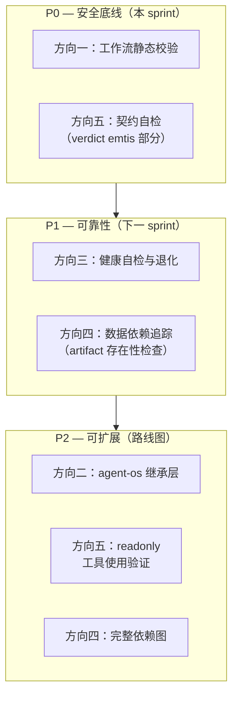

我已经完整阅读了 `forged-architecture-five-fresh-horizons.md`。以下是从架构师视角所做的系统性分析。

---

# 架构分析报告：ForgeOS 五条高价值扩展方向

## 1. 架构评估

### 1.1 当前架构的核心优势

| 维度 | 评价 |
|------|------|
| **关注点分离** | forge-core (Go 运行时) / harness (Node/Python 闸门) / agent 定义 (Markdown+YAML) 三层清晰分离，是可持续演进的基础 |
| **声明式控制面** | Workflow YAML 作为控制面文件的设计理念正确——将「意图」与「执行」解耦，这是 ForgeOS 区别于普通 agent 编排器的根本 |
| **失败封闭哲学** | 核心路径 (I/O、checkpoint、memory) 采用 fail-closed，防止了静默数据损坏，对自治运行时至关重要 |
| **闸门体系** | 体积闸门 → 架构闸门 → 治理闸门 → secret 扫描的四层治理流水线设计良好，有明确的拒绝/接受语义 |
| **预算控制** | `BudgetExhausted` 闭包 + `--max-agent-calls` 的双层预算防护提供了运行时成本安全网 |
| **ADR 驱动** | 架构决策有文档记录 (ADR-0003 等)，为后续实现提供了设计依据，避免了「先写代码再问为什么」 |

### 1.2 关键架构局限性（基于五方向分析）

**① 宽容解析器的设计矛盾**

`LoadWorkflowJSON` 的「missing fields => zero-valued-but-usable」是当前最深层的架构矛盾点。ForgeOS 的身份是**声明式治理运行时**，但控制面文件的解析却采用了「数据面」的宽容策略。这不是一个 bug，而是一个有意识但需要重新评估的设计决策：

- **为什么当时这样做**：v2 单仓单流程下，作者需要快速迭代 workflow 定义，宽容解析避免了「改一个字段要改三处」的摩擦
- **为什么现在需要改变**：当 `forge-init` 把 workflow 复制到新项目，或 `forge migrate` 改写 workflow 时，宽容变成了危险的静默降级
- **核心矛盾**：治理运行时的控制面应该是最严格的部分，但当前恰好相反——控制面宽容，数据面 (checkpoint/memory) 严格

**② 健康模型的缺失**

当前健康模型是隐式的、二元的：起跑前 `quickDoctorCheck`（健康 → 跑；不健康 → 不跑），运行中只有 `WARNING` 日志或 panic。缺少一个显式的、多级健康状态机。这意味着：

- 所有「部分健康」的场景走相同的 fail-closed 路径（全面停）或 warn-and-continue 路径（无视风险）
- 没有自适应降级——磁盘 IO 从 10ms 退化到 500ms 但还没到 error 阈值时，什么都不发生
- 审计链断裂的检测发生在事后 (`forge doctor`)，而非运行中

**③ 跨工作流数据依赖的架构真空**

ForgeOS 的脊柱是 5 个 workflow 的时序链，但 `LoadWorkflowJSON` 永远只加载**一个** workflow。这不是实现问题，是**架构设计缺失**——没有「脊柱上下文」这个概念。每个 `forge run` 调用是一个独立的执行上下文，上一个上下文的输出不会自动传递到下一个。Agent 卡中的 `emits` 声明是**数据契约的声明**，但缺少**数据契约的执行器**。

**④ 契约验证的被动性**

大量治理逻辑存在于 agent 卡散文 (VERDICT, CONFIDENCE, emits, readonly) 中，由 LLM 自行遵守。运行时的角色是**被动解析器**——agent 写了才认，不写就静默放过。这与「治理运行时」的身份产生了根本性矛盾：一个治理系统不应该信任其治理对象的自我报告，而应该主动验证。

### 1.3 架构债务清单

| 债务项 | 来源 | 偿还成本估计 | 风险等级 |
|--------|------|-------------|----------|
| ADR-0003 子模块继承层已设计但零代码 | 路线图决策 | **高**——越晚实现，上游策略漂移越多 | 🔴 高 |
| 工作流定义无静态校验 | 设计决策（宽容解析） | **中**——需要新验证层，核心引擎不动 | 🔴 高 |
| 无运行态健康状态机 | 从未设计 | **中**——新子系统，与既有回调点集成 | 🟡 中 |
| 跨阶段数据流仅有散文约定 | 从未设计 | **中高**——需要「脊柱上下文」概念 | 🟡 中 |
| 契约验证仅为被动解析 | 设计决策（v2 探索模式） | **低-中**——post-phase 钩子已有，加验证逻辑 | 🟡 中 |

---

## 2. 扩展方向

基于文档的五条产品方向，我从架构层面识别出以下**五个补充性的架构扩展方向**。这些不是替代五个方向，而是支撑它们的使能架构。

### 方向 A：Phase 类型插件注册表（Phase Type Registry）

**为什么需要**

当前 phase 类型（`implementer`, `reviewer`, `planner`, `architect` 等）的执行行为通过 `engine_build.go` 中的 switch/if-else 链选择。这导致：

- 新增 phase 类型必须修改 forge-core
- 自定义 phase 行为（如企业内部的 `compliance-checker`）无法在不 fork 的情况下实现
- 每个 phase 类型对应的契约验证逻辑（方向五）也无法独立扩展

**核心挑战**

- 如何在不引入 Go plugin 复杂性的前提下实现类型注册（Go plugin 在 Linux 上可用但增加了部署复杂度）
- 注册的 phase 类型如何声明自己需要哪些契约验证（verdict? confidence? emits? readonly?）
- 向后兼容：现有 phase 类型作为内置注册项

**架构变更概要**

```
// 当前：硬编码
switch phase.Type {
case "implementer": ...
case "reviewer": ...
}

// 目标：注册表
registry.Register("implementer", &ImplementerPhaseFactory{
  ContractVerifiers: []ContractVerifier{VerdictVerifier, EmitsVerifier},
})
```

**影响分析**

- forge-core: 新增 `PhaseRegistry` 包，抽取现有 phase 类型到注册模式
- harness: 无影响
- 用户：可写自定义 phase 类型 YAML + 本地注册

### 方向 B：信号类型系统与代数（Signals Type System）

**为什么需要**

当前 `converge.Signals` 是一个扁平的 struct，字段按需添加。五个方向将引入至少 5 个新信号：

| 方向 | 新信号 |
|------|--------|
| 健康自检 | `HealthLevel`, `DegradationTrend` |
| 数据依赖追踪 | `MissingArtifacts` |
| 契约自检 | `ContractFidelity`, `ReadonlyViolations` |
| 工作流校验 | `ValidationErrors`（起跑前） |
| 继承层 | `InheritanceResolutionStatus` |

如果每个新信号继续作为 ad-hoc struct 字段添加，最终会得到一个难以维护的、几百行的结构体。需要引入**信号类型系统**和**信号代数**——typed signals 和 derived/computed signals。

**核心挑战**

- 信号需要支持组合：`ContractFidelity < 0.5 OR MissingArtifacts > 0` 应是一个合法表达式
- 信号有不同生命周期：起跑前校验 vs 运行时 vs post-phase
- 信号需要可序列化到 checkpoint，以便跨 `forge run` 调用传递

**架构变更概要**

```
type SignalValue interface {
  Type() SignalType
  Score() float64  // 规约到 [0,1] 用于 stop_condition
}

type TypedSignal[T any] struct {
  Value T
  Weight float64
}

// Derived signal: 由其他信号计算得出
type DerivedSignal struct {
  Expression string  // 简单的 DSL 或 Go 函数
  DependsOn  []SignalID
}
```

**影响分析**

- forge-core: 新增 `signals` 包，重构 `converge.Signals` 和 `stop_condition` 评估
- 不破坏现有 YAML：stop_condition 保持字符串表达式，解析器升级

### 方向 C：观察性上下文传播（Observability Context Propagation）

**为什么需要**

当前 trace.jsonl 是扁平事件序列。要支持：

- 健康自检（方向三）需要「最近 5 分钟 overload 率」的趋势分析——需要事件有时间和执行上下文
- 跨阶段依赖追踪（方向四）需要知道「这个 artifact 是哪个 workflow 的哪个 phase 产生的」
- 契约自检（方向五）需要知道「这个 contract violation 发生在哪个 phase 的哪个 iteration」

需要引入结构化的 trace/span 上下文：每个 `forge run` 一个 trace，每个 phase 迭代一个 span，事件挂载到 span 下。

**核心挑战**

- 与既有 trace.jsonl 格式向后兼容：新事件可以有 `trace_id`/`span_id`，旧事件继续工作
- 不引入 OpenTelemetry 依赖（零外部依赖规则）：自建轻量级上下文传播
- 内存开销：不能在每个事件中复制完整上下文

**架构变更概要**

```
// 当前事件
{ "type": "phase_start", "phase": "implementer", "ts": 123 }

// 目标事件
{ 
  "type": "phase_start", 
  "trace_id": "run-20260712-001",
  "span_id": "phase-3-iter-2",
  "parent_span_id": "phase-3",
  "phase": "implementer", 
  "ts": 123 
}
```

**影响分析**

- forge-core: 新增 `tracer` 包重构，引入 span 概念；`trace.Emit` 接口向后兼容（自动注入 trace_id）
- `forge doctor`: 可执行跨 phase 查询，如 `trace query --span-type phase --duration > 30s`
- 健康检查：可直接查询最近 N 秒内当前 span 的错误率

### 方向 D：检查点格式版本化与迁移（Checkpoint Schema Versioning）

**为什么需要**

五个方向都会向 checkpoint.json 写入新字段：健康状态、依赖图状态、契约验证历史。当前 checkpoint 无 `schema_version` 字段，格式演进意味着破坏所有现有 checkpoint。

**核心挑战**

- 迁移策略：向前迁移（读旧格式写新格式）是必须的，向后迁移（读新格式写回旧格式）是可选
- 字段级别的迁移 vs 整体版本跳转：字段独立演进还是版本整体递增
- 测试负担：每个版本迁移路径都需要测试

**架构变更概要**

```
// checkpoint.json v1
{
  "schema_version": 1,
  "run_id": "...",
  "memory_path": "..."
}

// v2 迁移
{
  "schema_version": 2,
  "run_id": "...", 
  "memory_path": "...",
  "health_status": {  // 新增
    "level": "degraded",
    "reason": "trace_io_failures:5"
  }
}
```

**影响分析**

- forge-core: 新增 `checkpoint/migration.go`，版本号 + 迁移函数注册表
- `forge resume`: 自动检测版本并迁移到最新
- 外部工具：读取 checkpoint 的脚本需要适配（但版本号帮助它们做条件处理）

### 方向 E：脊柱编排骨架（Spine Orchestration Skeleton）

**为什么需要**

当前 `forge run` 一次只执行一个 workflow。但五个方向中的**数据依赖追踪（方向四）** 和**健康自检（方向三）** 需要跨 workflow 的上下文。没有脊柱级编排：

- `forge run evolve` 不知道 `forge run design` 输出了什么信号
- 健康状态的跨阶段积累无法传递（设计阶段 budget 告警，构建阶段不知道）
- 无法表达「只有 discover → design → review → build 全部成功后，才能执行 evolve」的流水线语义

**核心挑战**

- 不能重构成一个全局 DAG 调度器——那样架构变动太大
- 需要在「保持每个 workflow 独立可执行」和「提供脊柱级上下文传递」之间找到平衡
- 工作流间的数据传递格式需要约定（通过 checkpoint 的公共字段？还是新的 inter-workflow 文件？）

**架构变更概要**

轻量级方案——不引入编排引擎，只在 checkpoint 中增加 `spine_context` 字段：

```go
type Checkpoint struct {
    // 既有字段
    RunID    string
    Workflow string
    
    // 新增
    SpineContext *SpineContext // 可选，不存在时降级为独立执行
}

type SpineContext struct {
    PhaseResults []WorkflowResult // 已执行的脊柱阶段结果摘要
    AccumulatedSignals Signals     // 跨阶段累积信号
}
```

**影响分析**

- forge-core: 新增 `spine` 包，提供轻量级上下文读写；`forge run --spine` 可选启用
- forge run: 默认行为不变，加 `--spine` 标志后自动读取/写入脊柱上下文
- 不破坏现有工作流：spine 上下文是可选字段

---

## 3. 接口设计建议

### 3.1 关键模块接口设计原则

```
┌─────────────────────────────────────────────────────────────┐
│                    接口设计五大原则                           │
├─────────────────────────────────────────────────────────────┤
│ 1. 每个横向能力一条接口：验证器、健康监视器、契约验证器、      │
│    依赖解析器、继承解析器各为一个 Go interface               │
│ 2. 接口尽量小（ISP）：Validator 不做 HealthMonitor 的事       │
│ 3. 可组合：ValidatorSet 聚合多个 Validator                    │
│ 4. 可观测：每个接口方法的 error 路径携带结构化上下文           │
│ 5. 向后兼容：新接口方法使用可选参数模式（Functional Options）  │
└─────────────────────────────────────────────────────────────┘
```

### 3.2 建议引入的抽象层

**第一层：验证/检查抽象（立即引入）**

```go
// 单一职责：验证工作流定义的结构合法性
type WorkflowValidator interface {
    Validate(wf *Workflow) []ValidationIssue
}

type ValidationIssue struct {
    Severity   IssueSeverity // Error | Warning | Info
    Phase      string        // 关联 phase（可选）
    Field      string        // 关联字段（可选）
    Code       string        // 机器可读的错误码
    Message    string        // 人类可读的描述
    Suggestion string        // 修复建议（可选）
}

// 组合多个验证器
type ValidatorSet []WorkflowValidator

func (vs ValidatorSet) Validate(wf *Workflow) []ValidationIssue {
    var all []ValidationIssue
    for _, v := range vs {
        all = append(all, v.Validate(wf)...)
    }
    return all
}
```

**第二层：运行时健康抽象（方向三的使能器）**

```go
type HealthMonitor interface {
    Status() HealthLevel           // 当前健康等级
    RecordEvent(HealthEvent)       // 记录健康事件
    DegradationPlan() *Degradation // 当前推荐的降级策略
    Probe() HealthProbeResult      // 主动探测关键资源
}

type HealthLevel int
const (
    HealthUnknown  HealthLevel = iota
    HealthHealthy
    HealthDegraded
    HealthFailed
)

type Degradation struct {
    ReduceAgentCalls *int  // nil 表示不修改
    ReduceOutputBytes *int
    DisableOptionalIO bool
    Action            DegradationAction // Noop | Throttle | GracefulShutdown
}
```

**第三层：契约验证抽象（方向五的使能器）**

```go
type ContractVerifier interface {
    // VerifyPhase 在 phase 执行完毕后调用
    VerifyPhase(phase *Phase, output *AgentOutput, workdir string) []ContractViolation
}

type ContractViolation struct {
    Type       ViolationType // MissingVerdict | MissingConfidence | EmitNotProduced | ReadonlyWrite
    Phase      string
    Agent      string
    Expected   string // 期望值描述
    Actual     string // 实际值描述
    Severity   ViolationSeverity
}
```

**第四层：数据依赖解析抽象（方向四的使能器）**

```go
type DependencyResolver interface {
    ExpectedArtifacts(workflowName string, phaseName string) []ArtifactSpec
    ResolveArtifact(spec ArtifactSpec, spineCtx *SpineContext) (*ResolvedArtifact, error)
    RecordArtifact(workflowName string, phaseName string, artifact *ResolvedArtifact) error
}

type ArtifactSpec struct {
    PathPattern string   // 如 "docs/design/*.md"
    Required    bool     // 必须存在才能继续
    ConsumedBy  []string // 下游 phase 列表
}
```

**第五层：继承解析抽象（方向二的使能器）**

```go
type InheritanceResolver interface {
    // ResolvePath 返回实际生效的文件路径
    // 如 ResolvePath(".agent/agents/architect.md") 
    // → 优先返回 project/.agent/agents/architect.md（如果存在）
    // → 否则返回 submodule/.agent/agents/architect.md
    ResolvePath(relativePath string) (string, error)
    
    // ResolveAll 返回一个路径→源路径的完整映射
    ResolveAll(pattern string) (map[string]string, error)
}
```

### 3.3 向后兼容策略

每条新接口都必须遵循「**三阶段引入**」模式：

| 阶段 | 行为 | 用户可见影响 |
|------|------|------------|
| **Phase 1: 宣告**（v2.x） | 接口存在但验证器只记录 warning，不阻止执行 | `forge run` 日志中出现 `[validation] ...` warning |
| **Phase 2: 告警**（v2.y） | 验证失败给出显式警告，推荐修复 | 输出中有 `WARN` 标记，但执行继续 |
| **Phase 3: 治理**（v3.0） | 验证失败遵循 mode gating——explorer 模式警告，strict 模式中断 | `forge run` 在 strict 模式下因验证失败退出 |

对于 checkpoint/memory 格式变更：**读写分离版本化**。写入器始终写最新版本，读取器可以读 N 个旧版本。`schema_version` 字段始终存在。

---

## 4. 技术选型

### 4.1 约束条件重申

ForgeOS 的技术栈决策受三条不可违反的约束约束：

| 约束 | 来源 | 理由 |
|------|------|------|
| forge-core (Go) **零外部依赖** | 工程红线 | 最小化供应链风险，简化构建和部署 |
| harness (Node/Python) **零外部依赖** | 工程红线 | 同上 |
| 不引入 OPA/Rego/Temporal 等重型框架 | 架构文档 | v2 阶段不适合引入有状态分布式系统 |

### 4.2 各方向技术选型分析

#### 方向一：工作流静态分析器

| 选项 | 方案 | 评估 |
|------|------|------|
| **A. 基于 Go 类型的反射校验** ✅ **推荐** | 利用 Go struct tag 表达验证规则 + 自建校验器 | 零依赖，与既有类型绑定，编译时安全 |
| B. YAML Schema (JSON Schema 方言) | 引入第三方 schema 库 | 有外部依赖，违反零依赖规则 |
| C. External linter (独立 binary) | 新 binary + harness 包装 | 增加部署复杂度，但隔离了风险 |

**推荐 A**。Go 的 struct tag + 自建反射校验器能覆盖所有需求（悬空引用检查需要 AST 遍历，可以走 `reflect` + 自建 graph 遍历）。示例：

```go
type Workflow struct {
    Phases []Phase `validate:"unique_names,no_cyclic_depends,dive"`
}

type Phase struct {
    Name        string `validate:"required"`
    OnFail      *OnFailStrategy
    FreshContext *bool
    FeedsForward *bool `validate:"mutex_with=FreshContext"` // 自定义 tag
    Stage       string `validate:"oneof=discovery design review build evolve"`
}
```

#### 方向三：运行态健康自检

| 选项 | 方案 | 评估 |
|------|------|------|
| **A. 自建健康状态机** ✅ **推荐** | 一个 struct + 多维度投票逻辑，复用 `sleep`/`BudgetExhausted` 回调点 | 零依赖，~200 行核心代码，完全可控 |
| B. Go `expvar` + 外部采集 | 使用 stdlib `expvar` 暴露健康指标，外部工具消费 | 只能暴露指标，不能主动触发降级 |
| C. 引入 circuit breaker 库 | 如 `sony/gobreaker` | 有外部依赖，且 breaker 模式不完全匹配「多级降级」需求 |

**推荐 A**。健康状态机的核心逻辑简单（投票 → 等级 → 降级动作），不值得引入外部库。关键设计决策：

```go
// 健康投票者接口——可扩展
type HealthVoter interface {
    Vote() HealthVote
}

// 内置投票者
type DiskIOVoter struct { /* 检查 trace.jsonl 写入延迟 */ }
type BudgetVoter struct { /* 检查 budget 水位趋势 */ }
type MemoryCorruptionVoter struct { /* 检查 memory.Load 错误率 */ }

// 组合投票 → 等级
type HealthStateMachine struct {
    Voters []HealthVoter
    currentLevel HealthLevel
    history      []HealthEvent // 用于趋势分析
}
```

#### 方向四和五：数据依赖与契约验证

| 选项 | 方案 | 评估 |
|------|------|------|
| **A. 自建轻量级检查器** ✅ **推荐** | 文件系统存在性检查 + `git diff` 只读检查 + 输出解析 | 零依赖，每个检查 20-50 行，职责单一 |
| B. OPA/Rego 策略引擎 | 声明式策略语言 | 违反零外部依赖，且 OPA 的 learning curve 对使用者不友好 |
| C. 嵌入 Lua 脚本 | 允许用户写自定义验证脚本 | 灵活性高但增加了攻击面和复杂度，v2 过早 |

**推荐 A**。契约验证的核心操作简单（文件存在？git diff 为空？输出包含模式？），不值得引入策略引擎。如果未来验证规则复杂到需要 DSL，也应该是 ForgeOS 自建的小 DSL 而非 OPA。

#### 方向二：agent-os 继承层

| 选项 | 方案 | 评估 |
|------|------|------|
| **A. git submodule + 路径解析** ✅ **贴紧 ADR-0003** | 子模块 + 项目层覆盖的路径查找 | 完全兑现已有设计，与 git 生态集成 |
| B. Go 嵌入 (embed.FS) 叠加 | 编译时嵌入上游资产，运行时叠加项目层 | 丢失了 git submodule 的可升级性 |
| C. 符号链接策略 | 项目层通过 symlink 指向上游 | 跨平台兼容性差（Windows） |

**推荐 A**。ADR-0003 的设计已经为此做了完整分析。只需在 `LoadWorkflowJSON` / `LoadAgentCard` / `LoadModeConfig` 等加载函数中加入 `InheritanceResolver.ResolvePath()` 调用即可。

### 4.3 自建 vs 采购决策矩阵

| 能力 | 自建 | 采购/集成 | 决策 |
|------|------|----------|------|
| 工作流校验 | **40-80 LOC**，核心逻辑简单 | JSON Schema 库需引入外部依赖 | ✅ 自建 |
| 健康状态机 | **~200 LOC**，Go stdlib 足够 | circuit breaker 库不合适 | ✅ 自建 |
| 契约验证 | **每检查 20-50 LOC** | OPA 太重 | ✅ 自建 |
| 数据依赖追踪 | **~150 LOC**，文件存在性检查 | 无合适现成方案 | ✅ 自建 |
| 继承层路径解析 | **~50 LOC** 路径查找 | git submodule 本身就是机制 | ✅ 自建 |
| 结构化追踪 | **~300 LOC** span 上下文 | OpenTelemetry 需外部依赖 | ✅ 自建（或 v3 评估 OTel） |
| 策略引擎 | 复杂度高，谨慎 | OPA/Rego for v3 | ⏸️ 推迟到 v3 |

---

## 5. 实施路线图

### 5.1 优先级排序



**排序逻辑**：

| 优先级 | 方向 | 理由 |
|--------|------|------|
| **P0** | 方向一 + 方向五（核心） | 消除**静默行为退化**的风险，安全底线 |
| **P1** | 方向三 + 方向四（artifact 检查） | 提升运行时韧性，防止 audit 链断裂导致烧钱 |
| **P2** | 方向二 + 方向五（扩展）+ 方向四（扩展） | 多项目协作场景才需要，当前单仓无紧迫性 |

### 5.2 阶段划分与里程碑

#### Phase 1：安全加固（目标：2-3 周）

| 周 | 工作项 | 交付物 | 验收标准 |
|----|--------|--------|---------|
| W1 | 工作流静态校验器 | `workflow/validate.go` | 能检测 phase 名冲突、悬空引用、循环依赖、stage gating 矛盾、feeds_forward+FreshContext 冲突 |
| W1 | 验证器集成 | LoadWorkflowJSON 调用 ValidatorSet | `forge run` 输出中包含 validation warnings |
| W2 | 契约验证器（verdict + emits） | `contract/verifier.go` | post-phase 检测 missing verdict / missing emits |
| W2 | 契约验证集成 | `OnPhase` 回调中调用 ContractVerifier | 契约违反记录到 memory 和 trace |
| W3 | 治理闸门对接 | mode gating 考虑 validation issues | explorer 模式 warn，strict 模式 reject |

**里程碑 M1：安全加固完成** ✅

- `forge run` 在起跑前报告所有工作流结构问题
- post-phase 记录契约违反到 memory
- strict mode 下结构错误直接拒绝执行

#### Phase 2：运行时韧性（目标：3-4 周）

| 周 | 工作项 | 交付物 | 验收标准 |
|----|--------|--------|---------|
| W4 | 健康状态机 | `health/machine.go` | 多维度投票 → HEALTHY / DEGRADED / FAILED |
| W4 | 内置投票者 | DiskIOVoter, BudgetVoter, MemoryCorruptionVoter | 每个投票者在对应资源异常时正确降级 |
| W5 | 降级动作 | 自动收紧 max-agent-calls, 禁用可选 IO | DEGRADED 时内存/IO 消耗降低 ≥50% |
| W5 | 恢复检测 | 定时探测机制，健康恢复后自动扩回 | 磁盘恢复后自动回到正常参数 |
| W6 | artifact 存在性检查 | `DependencyResolver.ExpectedArtifacts` | 跨 workflow 的 emits 声明被执行时验证文件存在 |
| W6 | MissingArtifacts 信号 | 注入 converge.Signals | stop_condition 可以配置 `missing_artifacts == 0` |
| W7 | 集成测试 | 模拟磁盘满、memory 损坏、artifact 缺失等场景 | 所有退化路径有测试覆盖 |

**里程碑 M2：运行时韧性完成** ✅

- 磁盘满时自动降级而非 fail-closed 或 silent continue
- 契约违反 + artifact 缺失影响 stop_condition
- 测试覆盖故障注入场景

#### Phase 3：可扩展架构（目标：4-6 周，可并行）

| 工作项 | 依赖 | 预估 |
|--------|------|------|
| 方向二：agent-os 继承层路径解析 | 无 | 2 周 |
| 方向五：readonly + tool_use 验证 | Phase 1 的 ContractVerifier | 1 周 |
| 方向四：完整依赖图（非仅存在性） | Phase 2 的 DependencyResolver | 2 周 |
| Phase Type 注册表（扩展方向 A） | 无（但需架构评审） | 2 周 |
| 观察性上下文传播（扩展方向 C） | 无（但需与 trace 集成） | 2 周 |
| 检查点版本化（扩展方向 D） | Phase 1-2 稳定后才引入 | 1 周 |

**里程碑 M3：可扩展架构完成** ✅

- `forge-init --from upstream/repo` 正确建立继承关系
- readonly phase 的 git diff 检测输出违反信号
- trace 事件包含 span 上下文

### 5.3 风险点与缓解策略

| 风险 | 概率 | 影响 | 缓解策略 |
|------|------|------|---------|
| **R1**: 验证规则过于严格破坏现有 workflow | 中 | 高 | 三阶段引入（warn → 告警 → 拒绝）；提供 `forge validate --fix` 自动修复常见问题 |
| **R2**: 健康状态机的降级动作与既有的 budget/throttle 逻辑产生冲突 | 低 | 高 | 健康状态机应**读取**既有 budget 状态，而非写；降级动作只做阈值参数调整，不做状态覆盖 |
| **R3**: checkpoint 格式变更导致 `--resume` 断裂 | 中 | 高 | schema_version + 迁移函数；所有新字段都用 `omitempty` + 指针，旧 checkpoint 读为 nil |
| **R4**: 契约验证误报（verdict 存在但格式不标准被判定缺失） | 中 | 中 | 宽松匹配 + 易配置的验证规则；用户可通过 workflow YAML 调整验证严格度 |
| **R5**: agent-os 继承层路径解析与既有文件路径硬编码冲突 | 中 | 中 | 在 `Load*` 函数中 injected resolver，不修改全域路径；提供迁移期间的双重检查日志 |
| **R6**: 过度架构化——为「可能不需要」的场景引入复杂抽象 | 低 | 中 | 坚持 YAGNI：每个接口先有一个实现（YAGNI 模式——先有具体实现，再提取接口） |

### 5.4 不做事项（明确负向范围）

```
┌─────────────────────────────────────────────────────────────────┐
│                      明确不做的边界                             │
├─────────────────────────────────────────────────────────────────┤
│ ❌ 不实现全局 DAG 调度器（保留独立 workflow 执行模型）            │
│ ❌ 不引入 OPA/Rego/Temporal/Lua 等外部框架                       │
│ ❌ 不实现远程报警（PagerDuty/Slack），只记录到 trace/memory       │
│ ❌ 不实现运行时热重载（每次 forge run 重新读取）                  │
│ ❌ 不实现 TLA+ 模型检查（留待 v3）                               │
│ ❌ 不改写既有的 memory/checkpoint 格式（只增加字段）              │
│ ❌ 不做在线策略分发（submodule + git 已足够）                     │
└─────────────────────────────────────────────────────────────────┘
```

---

## 总结

五条方向揭示了一个清晰的模式：**ForgeOS 的「宣言式治理」哲学在控制面（workflow 定义）和执行面（agent 输出解析）之间存在一致性缺口**。控制面宽容，执行面被动。这五个方向本质上是用代码补全「治理运行时」的承诺——让声明被验证、让契约被强制、让退化和可观测。

**架构层面的核心建议**：

1. **先从 P0 安全加固入手**——方向一（校验器）+ 方向五（契约验证）的共同基础是一个 `ValidationIssue` 类型和 post-phase 钩子，实现代价最低，安全收益最高
2. **坚持零外部依赖**——所有五个方向的核心逻辑都可以在 50-200 LOC 内自建完成，不值得引入外部框架
3. **接口先行，实现随后**——在写具体验证逻辑之前，先定义 `WorkflowValidator`、`ContractVerifier`、`HealthMonitor`、`DependencyResolver`、`InheritanceResolver` 五个接口，确保各方向的集成点一致
4. **三阶段引入所有破坏性变更**——warn → 告警 → 拒绝，给用户迁移时间
5. **不预先为「可能需要的」复杂度投资**——信号代数、插件注册表、脊柱编排骨架这些架构扩展方向是有价值的，但应在 P0/P1 实现之后、有了具体使用场景时再引入
