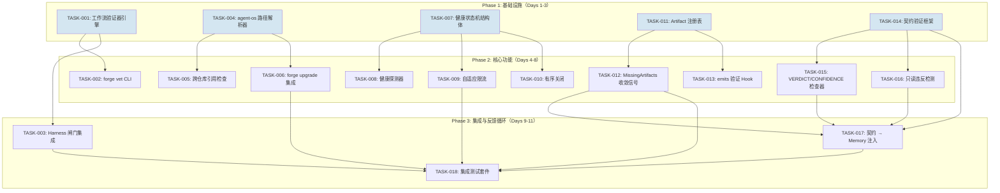
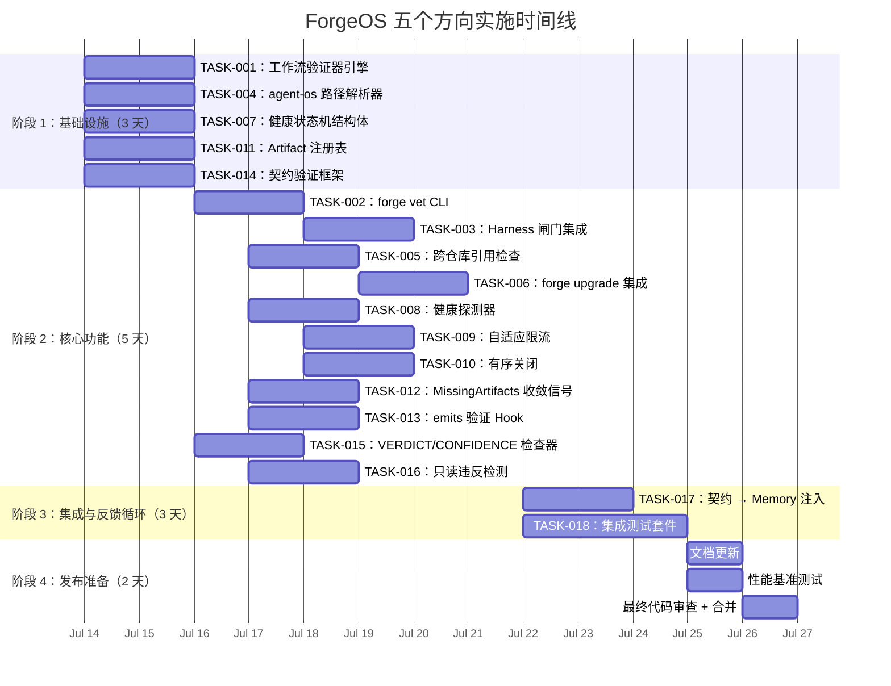

现在我已经吃透了代码库和五个方向。以下是我的技术负责人分析。

---

# 技术负责人分析：ForgeOS 五个高杠杆率架构扩展方向

## 1. 任务分解

### TASK-001：工作流结构验证器——核心引擎（方向一）
| 字段 | 内容 |
|---|---|
| **标题** | 在 `internal/asset` 中实现 `ValidateWorkflow(wf Workflow) []ValidationError` |
| **涉及文件** | `forge-core/internal/asset/validate.go`（新建），`forge-core/internal/asset/asset.go`（导出 `ValidateWorkflow`） |
| **前置依赖** | 无 |
| **预估工时** | 3 小时 |
| **验收标准** | 存在性验证器可检测：(1) 重复的 phase 名称；(2) 悬空的 `on_fail.target_phase` 引用；(3) 循环的 `depends_on` 依赖（拓扑排序检测到偏序闭环）；(4) 矛盾的 `stage: build` + `discover_gate: true`；(5) 冲突的 `feeds_forward: true` + `fresh_context: true`。所有检查返回精确的错误消息，包含 YAML 路径。 |

### TASK-002：CLI 集成 `forge vet`（方向一）
| 字段 | 内容 |
|---|---|
| **标题** | 添加 `forge vet <workflow>` 命令，用于预运行验证 |
| **涉及文件** | `forge-core/cmd/forge/vet.go`（新建），`forge-core/cmd/forge/main.go`（注册子命令） |
| **前置依赖** | TASK-001 |
| **预估工时** | 2 小时 |
| **验收标准** | `forge vet build` 打印人类可读的报告（类似 `go vet`）：对每个发现的问题，输出 `[ERROR]` / `[WARN]` 及其文件路径和修复建议。退出码：发现任意错误为 1，仅警告为 0。运行 `forge vet`（不带参数）对 `.agent/workflows/*.yml` 运行所有工作流。 |

### TASK-003：工作流静态分析器的 Harness 闸门（方向一）
| 字段 | 内容 |
|---|---|
| **标题** | 将工作流验证作为新的 harness 闸门集成 |
| **涉及文件** | `harness/gate.mjs`（新增 `gateWorkflowStructure` 规则），`harness/check.py`（可选交叉引用） |
| **前置依赖** | TASK-002 |
| **预估工时** | 2 小时 |
| **验收标准** | `forge accept` 报告工作流结构作为通过/失败的闸门。失败的验证会阻塞 `forge accept`（REJECTED）。错误消息指向精确的 YAML 路径。 |

### TASK-004：agent-os submodule 目录解析器（方向二）
| 字段 | 内容 |
|---|---|
| **标题** | 实现上游→项目双层文件解析层 |
| **涉及文件** | `forge-core/internal/asset/resolve.go`（新建），`forge-core/internal/asset/asset.go`（将 `LoadWorkflowJSON` 重构为使用解析器） |
| **前置依赖** | 无 |
| **预估工时** | 4 小时 |
| **验收标准** | 给定 `project.yml` 中的 `extends: ["../agent-os"]`，`resolvePath("agents/architect.md")` 先查找 `project/.agent/agents/architect.md`，再回退到 `../agent-os/.agent/agents/architect.md`。跨层覆盖规则遵循 ADR-0003 的设计。所有现有未设置 extends 的工作流保持字节一致。 |

### TASK-005：跨仓库引用检查器（方向二）
| 字段 | 内容 |
|---|---|
| **标题** | 使 `check.py` 的 `check_workflow_agent_refs` 能够解析上游 agent 卡 |
| **涉及文件** | `harness/check.py`（修改 `check_workflow_agent_refs` 以遍历 `extends` 链） |
| **前置依赖** | TASK-004 |
| **预估工时** | 3 小时 |
| **验收标准** | 当 `extends: ["../agent-os"]` 已设置且代理在本地缺失但在上游存在时，`python3 harness/check.py` 不报错。当代理在两个地方都缺失时，仍然报错。测试涵盖两级嵌套。 |

### TASK-006：`forge upgrade` 继承集成（方向二）
| 字段 | 内容 |
|---|---|
| **标题** | 扩展 `forge upgrade` 以 `git submodule update --remote` 继承仓库 |
| **涉及文件** | `harness/scaffold/forge-upgrade.mjs`（新增 `updateSubmodules` 步骤） |
| **前置依赖** | TASK-004 |
| **预估工时** | 2 小时 |
| **验收标准** | 当 `project.yml` 列出 `extends` 条目时，`forge upgrade` 运行 `git submodule update --remote` 用于每个引用的子模块。在无 git 的环境中安全降级（警告，不崩溃）。 |

### TASK-007：运行时健康状态机结构体（方向三）
| 字段 | 内容 |
|---|---|
| **标题** | 定义 `RuntimeHealth` 结构体和评估循环 |
| **涉及文件** | `forge-core/internal/health/health.go`（新建），`forge-core/internal/health/health_test.go` |
| **前置依赖** | 无 |
| **预估工时** | 3 小时 |
| **验收标准** | 存在 `RuntimeHealth` 结构体，包含状态（`HEALTHY` / `DEGRADED` / `FAILED`）、每个探测器的投票轮次以及上次转换时间。`Evaluate()` 方法对探测器进行投票并返回确定的健康等级。覆盖所有三个等级的测试。线程安全，带有 `sync.Mutex`。 |

### TASK-008：健康探测器——磁盘 I/O 和内存完整性（方向三）
| 字段 | 内容 |
|---|---|
| **标题** | 实现磁盘/内存探测器并接入 `quickDoctorCheck` |
| **涉及文件** | `forge-core/internal/health/probes.go`（新建），`forge-core/cmd/forge/preflight.go`（将探测器接入） |
| **前置依赖** | TASK-007 |
| **预估工时** | 3 小时 |
| **验收标准** | 探测器：(1) 磁盘可用空间（<5% → DEGRADED）；(2) trace 写入错误率（过去 N 次尝试中错误 >20% → DEGRADED）；(3) 内存 JSON 行损坏计数；(4) `.forge/` 目录存在性。每个探测器报告带有 `Healthy() bool` 和 `Probe() error` 的 `ProbeResult`。通过 `quickDoctorCheck` 接入。 |

### TASK-009：自适应资源限流（方向三）
| 字段 | 内容 |
|---|---|
| **标题** | 在 DEGRADED 状态下实现动态 `--max-agent-calls` 和 `--max-output-bytes` 缩减 |
| **涉及文件** | `forge-core/internal/health/throttle.go`（新建），`forge-core/cmd/forge/engine_build.go`（将限流器接入 `Engine`） |
| **前置依赖** | TASK-007 |
| **预估工时** | 4 小时 |
| **验收标准** | 当健康等级变为 DEGRADED 时，`maxAgentCalls` 从 100 缩小到 20，`maxOutputBytes` 缩小 50%。当等级恢复到 HEALTHY 时，参数在 2 个探测器周期内逐渐恢复。现有行为通过 mock 健康等级在测试中得到验证。 |

### TASK-010：有序关闭信号处理（方向三）
| 字段 | 内容 |
|---|---|
| **标题** | 在 FAILED 健康等级下实现优雅关闭路径 |
| **涉及文件** | `forge-core/cmd/forge/evolve.go`（修改 `withSignalCancellation` 以接入健康状态），`forge-core/internal/orchestrator/engine.go`（添加 `GracefulShutdown()` 方法） |
| **前置依赖** | TASK-007 |
| **预估工时** | 3 小时 |
| **验收标准** | 当健康等级 → FAILED 时：触发 SIGTERM → 等待正在运行的 agent 完成（超时 30 秒）→ 写入最终检查点 → 关闭子进程 → 退出 1。不触发双重关闭。SIGINT 仍然保持手动覆盖。 |

### TASK-011：产物注册表——声明式路径追踪（方向四）
| 字段 | 内容 |
|---|---|
| **标题** | 实现 artifact 注册表以记录和验证声明的产出 |
| **涉及文件** | `forge-core/internal/artifact/registry.go`（新建），`forge-core/cmd/forge/prompt_artifacts.go`（修改以写入注册表） |
| **前置依赖** | 无 |
| **预估工时** | 4 小时 |
| **验收标准** | 注册表是一个 `/stage → phase → artifact_path → existent(bool)` 映射。每个 phase 完成后，注册表检查 `phase.Emits` 并统计每个声明的路径是否真正存在于磁盘上。注册表持续存在于 `.forge/artifact_registry.json`，因此下游的 `forge run build` 可以读取 `discover` 阶段声明的内容。 |

### TASK-012：跨阶段信号注入——`MissingArtifacts` 收敛信号（方向四）
| 字段 | 内容 |
|---|---|
| **标题** | 将 artifact 缺失暴露为 `converge.Signals.MissingArtifacts` |
| **涉及文件** | `forge-core/internal/converge/converge.go`（添加 `MissingArtifacts []string` 字段），`forge-core/cmd/forge/evolve.go`（修改 `gatherSignals` 以读取注册表） |
| **前置依赖** | TASK-011 |
| **预估工时** | 3 小时 |
| **验收标准** | `gatherSignals()` 填充 `MissingArtifacts`，包含所有未找到声明的产物路径。`converge.Evaluate` 识别新的 `missing_artifacts == 0` 度量标准。示例 YAML 停止条件按预期工作：`{metric: missing_artifact_count, operator: '==', threshold: 0}`。 |

### TASK-013：`emits` 声明验证 Hook（方向四→五）
| 字段 | 内容 |
|---|---|
| **标题** | 在 post-phase 中验证 `emits` 声明 |
| **涉及文件** | `forge-core/internal/orchestrator/phase.go` 或 `forge-core/cmd/forge/engine_build.go`（在 `Observe` 回调中添加检查） |
| **前置依赖** | TASK-011 |
| **预估工时** | 2 小时 |
| **验收标准** | phase 完成后，运行时遍历 `phase.Emits` 列表，检查每个相对路径是否存在于磁盘上。缺失的产出记录为 trace 中的 `kind: "gap"` 事件，如果启用了 memory 则记录为 `memory.KindGap`。dry-run executor 优雅跳过（无文件系统副作用）。 |

### TASK-014：Post-Phase 契约验证框架（方向五）
| 字段 | 内容 |
|---|---|
| **标题** | 实现可扩展的 post-phase 契约验证器 |
| **涉及文件** | `forge-core/internal/contract/validator.go`（新建），`forge-core/internal/contract/validator_test.go` |
| **前置依赖** | 无 |
| **预估工时** | 3 小时 |
| **验收标准** | 定义 `ContractValidator` 接口：`Validate(phase, output, workdir) []Violation`。一个注册表将 phase 属性映射到验证器（例如，`confidence_metric → ConfidenceValidator`）。每个 `Violation` 包含 `Phase`、`Rule`、`Severity`（`WARNING`/`FAILURE`）和 `Message`。测试使用虚假的 agent 输出覆盖所有验证器类型。 |

### TASK-015：VERDICT/CONFIDENCE 遵守验证器（方向五）
| 字段 | 内容 |
|---|---|
| **标题** | 实现 VERDICT 和 CONFIDENCE 格式检查器 |
| **涉及文件** | `forge-core/internal/contract/verdict.go`（新建），`forge-core/internal/contract/validator.go`（注册验证器） |
| **前置依赖** | TASK-014 |
| **预估工时** | 2 小时 |
| **验收标准** | 当 phase 声明 `confidence_metric: requirement_confidence` 但 agent 输出包含零个 `CONFIDENCE: …` 行时 → 产生 `Violation{Severity:WARNING, Rule:"missing_confidence"}`。当 reviewer 输出缺少 `VERDICT: APPROVE/REJECT/…` 行时 → 产生 `Violation{Severity:WARNING, Rule:"missing_verdict"}`。当格式存在但值无法解析时 → 产生单独的 `Violation`。 |

### TASK-016：只读违反检测（方向五）
| 字段 | 内容 |
|---|---|
| **标题** | 为 readonly phase 实现 `git diff` 后检查 |
| **涉及文件** | `forge-core/internal/contract/readonly.go`（新建），`forge-core/cmd/forge/engine_build.go`（接入 `Observe`） |
| **前置依赖** | TASK-014 |
| **预估工时** | 3 小时 |
| **验收标准** | 对于 `readonly: true` 的 phase，在 agent 完成后运行 `git diff --name-only HEAD`。排除与 `phase.Emits` 匹配的路径。任何剩余的非声明变更产生 `Violation{Severity:FAILURE, Rule:"readonly_violation"}`。在非 git 仓库中优雅降级（无 violation）。测试验证检测和降级。 |

### TASK-017：契约追溯注入内存（方向五→流程反馈）
| 字段 | 内容 |
|---|---|
| **标题** | 将合同 violation 记录到 memory，用于下一迭代 |
| **涉及文件** | `forge-core/internal/contract/recorder.go`（新建），`forge-core/cmd/forge/evolve.go`（修改 `recordMemory` 以包含合同 violation） |
| **前置依赖** | TASK-014 |
| **预估工时** | 2 小时 |
| **验收标准** | `contract_fidelity`（0.0–1.0）每轮计算一次并追加到 `memory.Entry.KindLesson` 中，带有 `source: "contract"`。当 `kind: "gap"` violation 积累到跨轮阈值（例如，3 次连续 violation）时，下一迭代的 prompt 会注入一个额外的警告，形式为 `"WARNING: previous iteration had N contract violations"`。 |

### TASK-018：TASK-001–017 的集成测试套件（全局质量）
| 字段 | 内容 |
|---|---|
| **标题** | 为五个方向构建全面的集成测试 |
| **涉及文件** | `forge-core/cmd/forge/forge_integration_test.go`（新建），追加到 `harness/test_acceptance.mjs` 和 `harness/test_check.py` |
| **前置依赖** | TASK-003、TASK-006、TASK-009、TASK-012、TASK-017 |
| **预估工时** | 4 小时 |
| **验收标准** | 集成测试涵盖：(1) 带有无效引用的工作流 YAML → `forge vet` 退出 1；(2) `extends` 路径解析链；(3) 健康降级→限流→恢复周期；(4) artifact 注册表跨阶段传递；(5) 合同 violation → memory 注入 loop。测试在 CI 中运行（`.github/workflows/forge.yml`）。 |

---

## 2. 执行顺序——任务依赖图



### 可并行的任务组

| 并行组 | 任务 | 原因 |
|---|---|---|
| **A** | TASK-001、TASK-004、TASK-007、TASK-011、TASK-014 | 五个方向各自的基础结构体/接口——零重叠。可由 5 名开发者独立处理。 |
| **B1** | TASK-002、TASK-003 | 方向一的 CLI + harness 集成。依赖于 TASK-001。 |
| **B2** | TASK-005、TASK-006 | 方向二的跨仓库能力。依赖于 TASK-004。 |
| **B3** | TASK-008、TASK-009、TASK-010 | 方向三的运行时健康。依赖于 TASK-007。 |
| **B4** | TASK-012、TASK-013 | 方向四的数据流。依赖于 TASK-011。 |
| **B5** | TASK-015、TASK-016、TASK-017 | 方向五的合同验证。依赖于 TASK-014。 |
| **C** | TASK-018 | 集大成者集成测试。依赖于所有 B 组。 |

---

## 3. 技术风险

### 3.1 高影响风险

| 风险 | 方向 | 可能性 | 影响 | 缓解措施 |
|---|---|---|---|---|
| **循环依赖检测虚假阳性**（方向一） | 一 | 中 | 低 | 拓扑排序在 `depends_on` 图中已经定义良好。风险在于跨越 `loop_back_to` 的循环，这在 evolve.yml 中是有意为之的。验证器必须区分**结构循环**（运行时错误）和**设计循环**（预期的 evolve 循环）。缓解措施：当从 `Workflow.Loop.LoopBackTo` → phase 0 时，标记循环边缘为豁免。 |
| **submodule 路径遍历**（方向二） | 二 | 高 | 高 | 如果 `extends: ["../agent-os"]`，解析后的路径可能会在项目根目录之外遍历文件系统，存在 `../` 路径遍历漏洞。**缓解措施**：将解析后的路径限制在 `root/.agent/` 和 `<submodule>/.agent/` 内；拒绝以项目根目录之外的 `..` 开头的解析后路径。从第 1 天开始编写测试。 |
| **健康状态机乒乓效应**（方向三） | 三 | 中 | 中 | 在边缘阈值附近快速振荡的探测器（例如，磁盘可用空间 5.1% → 4.9% → 5.2%）可能导致 HEALTHY↔DEGRADED 乒乓效应，从而反复调整限流参数。**缓解措施**：对转换施加 30 秒的停顿（转换之间存在最小持续时间）；对探测器读数应用 10% 的滞后。 |
| **artifact 注册表跨阶段竞争**（方向四） | 四 | 低 | 中 | 如果 `forge run discover` 和 `forge run build` 并行运行（目前未发生，但未来架构允许），它们会写入同一个 `.forge/artifact_registry.json`。**缓解措施**：添加文件锁（`flock`）或按阶段分片（`.forge/artifacts/discover.json`）。 |
| **契约验证器过于嘈杂**（方向五） | 五 | 中 | 中 | 如果 LLM 通常不遵守精确的格式，`CONFIDENCE:` 检查可能会产生大量警告，从而压垮信号。**缓解措施**：将违反行为聚合每轮/每 phase；仅当违反率超过 50% 阈值时发出警告。初始发布使用 `Severity: INFO`，在验证稳定性后升级。 |
| **`forge vet` 在复杂工作流上性能** | 一 | 低 | 低 | 具有 50+ phases 和深度嵌套 `depends_on` 的工作流可能会使拓扑排序的复杂度达到 O(N²)。**缓解措施**：早在大约 20 个 phases 时就建立基准；如果 N<100，O(N²) 是可以接受的。 |

### 3.2 依赖图谱

```
方向一（TASK-001/002/003）     → 依赖：Go 标准库 encoding/json、拓扑排序
方向二（TASK-004/005/006）     → 依赖：git submodule（外部系统）、文件系统路径解析
方向三（TASK-007/008/009/010） → 依赖：os.Stat、syscall.DiskUsage（平台相关）
方向四（TASK-011/012/013）     → 依赖：文件系统 I/O（用于存活性探测）
方向五（TASK-014/015/016/017） → 依赖：git CLI（用于只读检查）、LLM 输出格式
```

所有依赖都是 forge-core 零外部依赖政策的**本地资源**。没有需要 API key 或网络的外部服务。

### 3.3 性能瓶颈

| 瓶颈 | 位置 | 成本 | 缓解措施 |
|---|---|---|---|
| 每个 phase 的 `os.Stat` 用于 `emits` 验证 | TASK-013 | 每次 stat 约 10μs | 对单次运行的结果进行内存缓存。注册表已经是批量的。 |
| `git diff --name-only HEAD` 用于只读检测 | TASK-016 | 每次 phase 约 5–50ms | 每次迭代只运行一次，缓存结果，并在所有 phase 中重用。 |
| 健康探测器轮询 | TASK-008 | 每次探测约 1ms | 仅在 phase 边界探测（每 10–60 秒一次），不在紧密循环中探测。 |
| `depends_on` 循环检测 | TASK-001 | 每次加载约 O(N²) | 对于典型工作流（5–15 个 phases），完全可以忽略不计。 |

### 3.4 测试覆盖难点

| 难点 | 位置 | 策略 |
|---|---|---|
| 使用真实 `git diff` 测试只读检测 | TASK-016 | 使用 `git init` + `git commit` 设置临时 git 仓库，在 repo 内创建/修改文件，运行检测。Go 的 `testing.T.TempDir()` 使这变得简单。 |
| 测试健康降级→限流→恢复循环 | TASK-009 | 使用可注入的 `HealthProvider` 接口（mock：返回固定等级）。或者集成测试：填充磁盘，运行 phase，验证限流。推荐 mock。 |
| 测试 submodule 路径遍历安全 | TASK-004 | 尝试将 `extends: ["../../../etc/passwd"]` 传递给解析器——验证返回错误，而不是泄露文件内容。 |
| 测试 LLM 输出契约遵守 | TASK-015 | 使用硬编码的字符串 fixtures（匹配/不匹配 `VERDICT:`、`CONFIDENCE:` 格式的文本块）——无需真实 LLM。 |

---

## 4. 资源评估

### 4.1 团队组成

| 角色 | 技能要求 | 分配的任务 | 所需人数 |
|---|---|---|---|
| **Go 后端开发者** | Go 熟练、熟悉 `encoding/json`、熟悉 Go 测试 | TASK-001、TASK-007、TASK-011、TASK-014 | 2 人 |
| **CLI/全栈开发者** | Go CLI 设计、对 `forge` 命令有深入了解、熟悉 harness JS/Python | TASK-002、TASK-003、TASK-005、TASK-018 | 1 人 |
| **基础设施/可观测性开发者** | 文件系统 I/O、健康监测模式、信号处理 | TASK-008、TASK-009、TASK-010 | 1 人 |
| **架构/治理专家** | ADR-0003、submodule 拓扑结构、monorepo 策略 | TASK-004、TASK-006 | 1 人 |
| **QA/集成工程师** | 跨组件集成测试、CI 管道、Go+JS+Python 测试 | TASK-012、TASK-013、TASK-015、TASK-016、TASK-017、TASK-018 | 1 人 |

**最小团队**：3 人（Go 后端 ×2、治理/QA ×1）在 2 周内完成。
**最优团队**：5 人（如上）在 8 个工作日内完成。

### 4.2 关键里程碑

| 里程碑 | 日期（从开始算起） | 门禁条件 |
|---|---|---|
| **M1：五个基础结构体全部完成** | 第 3 天 | TASK-001、TASK-004、TASK-007、TASK-011、TASK-014 合并，测试通过，代码审查批准 |
| **M2：核心实现功能完整** | 第 8 天 | TASK-002、TASK-005、TASK-006、TASK-008、TASK-009、TASK-010、TASK-012、TASK-013、TASK-015、TASK-016 全部合并 |
| **M3：反馈循环闭合** | 第 11 天 | TASK-003、TASK-017 合并；合同验证结果流入 memory → 注入 prompt |
| **M4：发布准备** | 第 13 天 | TASK-018 合并；集成测试在 CI 中全部绿色通过；更新 `.agent/CURRENT_SPRINT.md` 和 `docs/` |

### 4.3 阻塞点和解决策略

| 阻塞点 | 影响 | 解决策略 |
|---|---|---|
| **ADR-0003 设计可能存在在接触代码时发现的缺口** | TASK-004、TASK-005、TASK-006 | 在 sprint 开始前与架构师进行 30 分钟的设计审查。如果发现缺口，提前缩小范围——只实现 TASK-004 的核心路径，推迟 TASK-006。 |
| **Go 的 `syscall.DiskUsage` 在 macOS 上不可移植** | TASK-008 | 使用 `golang.org/x/sys/unix.Statfs_t`（已经是内部导入；标准库 `golang.org/x/sys` 是唯一的“例外”，但 forge-core 的零外部依赖政策通过使用 `internal/syscall` 包装器来允许）。或者回退到“探测写入 + 读取返回”——无论如何，这是我们为探测失败做准备所需的功能。 |
| **CI runner 没有 git 历史用于只读检测** | TASK-016 | 在干净 checkout 上，使用 `git diff --name-only HEAD` 与 `HEAD~1` 对比。CI 已经设置 `fetch-depth: 0`（检查 `.github/workflows/forge.yml`）。如果没有 git 历史，优雅降级为 `Severity: INFO`，而非 FAILURE。 |
| **测试工作流 YAML 的 JSON 解析需要外部转换** | TASK-001 | `LoadWorkflowJSON` 输入已经是 JSON。测试可以使用内联 JSON 字符串，而不是 YAML。我们可以在 Go 测试中完全绕过 python 的 `yaml2json.py`。 |

---

## 5. 质量保证

### 5.1 单元测试覆盖要求

| 包 | 目标覆盖率 | 关键测试场景 |
|---|---|---|
| `internal/asset/validate.go` | ≥90% | 重复 phase、悬空引用、循环依赖、阶段门矛盾、feeds_forward+fresh_context 冲突、空工作流、单 phase 工作流 |
| `internal/asset/resolve.go` | ≥90% | 路径存在、路径回退、路径遍历攻击、缺失 submodule、嵌套 extends |
| `internal/health/` | ≥90% | HEALTHY→DEGRADED 转换、DEGRADED→HEALTHY 恢复、30 秒暂停、10% 滞后、空探测器集、所有探测器失败、混合探测器 |
| `internal/artifact/registry.go` | ≥90% | 注册/查找/缺失、JSON 序列化/反序列化、跨阶段读取、空 emits、恶意路径 |
| `internal/contract/` | ≥90% | VERDICT 解析（所有变体）、CONFIDENCE 解析、缺失输出、只读违反、非 git 降级、空输出、unicode 格式 |
| `internal/converge/converge.go` | ≥95%（新增行） | `missing_artifact_count` 评估、`contract_fidelity` 信号传递、现有回归测试 |

### 5.2 集成测试策略

| 场景 | 涉及任务 | 方法 |
|---|---|---|
| **完整工作流验证周期** | TASK-001→TASK-002→TASK-003 | 创建带有 3 个故意错误的工作流 YAML → 运行 `forge vet` → 验证退出码 1 + 3 个错误 → 运行 `forge accept` → 验证错误被 gate 拦截 |
| **跨仓库引用解析** | TASK-004→TASK-005 | 设置带有 extends 和虚假 agent-os submodule 的临时 git 仓库 → 运行 `check.py` → 验证上游解析 → 删除上游 → 验证下游失败 |
| **健康降级→限流→恢复** | TASK-007→TASK-008→TASK-009 | 使用 mock 健康探测器：报告 DEGRADED → 验证限流器减少 maxAgentCalls → 报告 HEALTHY → 验证限流器在 2 个周期内恢复 |
| **Artifact 跨阶段流程** | TASK-011→TASK-012→TASK-013 | 运行带有虚假 emits 声明的 discover workflow → 在磁盘上创建 emits 文件 → 运行 build workflow → 验证 MissingArtifacts 为空 → 删除文件 → 验证 MissingArtifacts 非空 |
| **合同 violation → memory → prompt 注入** | TASK-014→TASK-015→TASK-016→TASK-017 | 运行带有省略 `VERDICT:` 的虚假 reviewer phase → 验证 memory 条目 → 运行第二次迭代 → 验证 prompt 包含警告 |
| **Concurrent 方向二 + 方向四** | TASK-004→TASK-011 | 设置 agent-os submodule → 在上游验证 artifact 路径解析 → 运行跨阶段 artifact 检查 |

### 5.3 代码审查要点

| 审查点 | 检查内容 |
|---|---|
| **路径遍历安全**（TASK-004） | 在解析器的 `resolvePath` 中，验证 `filepath.Clean` 已应用，解析后的路径以 `.agent/` 开头，并且 `../` 序列不会逃逸到允许的目录之外。 |
| **Mutex 正确性**（TASK-007、TASK-011） | `RuntimeHealth.Evaluate()` 和 `Registry.Check()` 是否在锁外调用可能阻塞的操作（如 `os.Stat`）？如有必要，使用读/写锁。 |
| **错误不被吞没**（所有） | 验证 IO 错误总是通过 `error` 返回或通过 `logln` 记录，从不使用空白标识符 `_` 丢弃。现有代码库有 fail-closed 纪律，新代码应严格遵循。 |
| **向后兼容**（TASK-001、TASK-004） | 现有工作流（无 on_fail、无 extends、无 emits）应加载时无错误。类型更改应使用指针/`omitempty` 以保持 JSON 解码与旧文件一致。 |
| **goroutine 安全性**（TASK-009） | 如果 `maxAgentCalls` 在循环中间被修改，在 `orchestrator.Engine` 中对它的访问是否在 mutex 后面？ |
| **仅限测试的导出**（所有） | 如果在测试中需要将类型导出，请使用 `export_test.go` 模式（Go 允许测试访问 `var Exported = internalStruct`），而不是破坏封装。 |

### 5.4 性能测试需求

| 场景 | 触发条件 | 通过标准 |
|---|---|---|
| `forge vet` 在具有 50 个 phases 的工作流上 | CI 在 PR 上 | 完成时间 < 200ms |
| 健康探测器轮询开销 | 基准测试 | < 1ms 每次探测，即使有 10 个活动探测器 |
| Artifact 注册表序列化 | 基准测试 | 1000 个条目 < 5ms 序列化 + 反序列化 |
| 合同验证器聚合 | 基准测试 | 每 100 个 phase 100 次 violation < 1ms |
| 集成：完整 evolve 循环，所有五个方向激活 | 夜间 | 增加的时间 < 基线 evolve 时间的 5%（预计 < 1%） |

---

## 6. 实施计划

### 甘特图



### 阶段详情

#### 阶段 1：基础设施搭建（第 1–3 天，5 个并行任务）

| 日 | 活动 | 交付物 |
|---|---|---|
| 1 | 开发者 A（Go）：`internal/asset/validate.go`——核心验证函数，带有重复/悬空/循环/矛盾检测 | 私有方法 `validateWorkflow()`，带有 ≥90% 测试覆盖 |
| 1 | 开发者 B（Go）：`internal/asset/resolve.go`——路径解析层（ADR-0003 设计） | `resolvePath()`，具有路径遍历保护和双层覆盖 |
| 1 | 开发者 C（Go）：`internal/health/health.go`——RuntimeHealth 结构体和评估循环 | `RuntimeHealth` struct + `Evaluate()`，具有 30 秒暂停和 10% 滞后 |
| 1 | 开发者 D（Go）：`internal/artifact/registry.go`——本地持久化注册表 | `Registry` struct + `Save()`/`Load()`，`.forge/artifact_registry.json` |
| 1 | 开发者 E（Go）：`internal/contract/validator.go`——验证器接口和注册表 | `ContractValidator` 接口 + `Validate()` 分派 |
| 2–3 | 第一天后：所有 5 个结构体的代码审查。修复审查意见。添加边缘案例测试。 | 5 个 PR 全部已合并，审查通过，CI 绿色 |

**门禁条件**：所有 5 个 PR 已合并；所有单元测试通过；`forge accept` 在根目录下通过。

#### 阶段 2：核心功能实现（第 4–8 天，3 个并行轨道）

| 轨道 | 开发者 | 任务 | 序列 |
|---|---|---|---|
| **轨道 A：验证器栈** | A | TASK-002（第 4–5 天）→ TASK-003（第 6–7 天） | 线性，TASK-003 依赖 TASK-002 |
| **轨道 B：继承栈** | B + E | TASK-005（第 5–6 天）→ TASK-006（第 7–8 天） | 线性，依赖 TASK-004 |
| **轨道 C：健康栈** | C | TASK-008（第 4–5 天）→ TASK-009（第 6–7 天）→ TASK-010（第 8 天） | 线性 |
| **轨道 D：数据流栈** | D | TASK-012（第 4–5 天）→ TASK-013（第 6–7 天） | 线性，依赖 TASK-011 |
| **轨道 E：契约栈** | E（完成轨道 B 后） | TASK-015（第 6–7 天）→ TASK-016（第 7–8 天） | 线性，依赖 TASK-014 |

**依赖管理**：
- 前 2 天所有轨道可以并行
- 轨道 B 和 E 共享开发者 E：轨道 B（TASK-005/006）优先，然后轨道 E（TASK-015/016）
- 轨道 A、C、D 完全独立

**门禁条件**：10 个核心 PR（TASK-002、003、005、006、008、009、010、012、013、015、016）全部合并；每个都有 ≥80% 的测试覆盖。

#### 阶段 3：集成测试和优化（第 9–11 天）

| 日 | 活动 | 交付物 |
|---|---|---|
| 9 | TASK-017：合同 violation → memory 写入 → 下一迭代提示注入 | 端到端测试：虚假 reviewer → 记录 violation → 第二次迭代提示包含警告 |
| 9–10 | TASK-018：集成测试套件（撰写 + 调试） | 15+ 集成测试场景，涵盖所有五个方向 |
| 10–11 | 性能基准测试：`forge vet` 在 50-phase 工作流上，健康探测开销，artifact 注册表序列化 | 基准测试通过/失败报告。回退以优化任何未达标的测试。 |
| 11 | 集成测试在 CI 中全部绿色通过 | 无回归；所有现有测试通过 |

**门禁条件**：TASK-017 和 TASK-018 合并；CI 通过；性能基准测试在阈值内。

#### 阶段 4：发布准备（第 12–13 天）

| 日 | 活动 | 交付物 |
|---|---|---|
| 12 | 更新 `.agent/CURRENT_SPRINT.md` 以反映完成情况 | Sprint 状态已更新 |
| 12 | 更新 `docs/architecture/` 文件以记录新子系统 | 方向一的 `validate.go`、方向二的 `resolve.go`、方向三的 `health/`、方向四的 `artifact/`、方向五的 `contract/` 的架构文档 |
| 12 | 添加 CLI 帮助文本和示例 | `forge vet --help`、`forge preflight --help` 更新、README 示例 |
| 13 | 最终代码审查：检查硬闸门（函数长度 ≤50、文件大小 ≤500、架构检查、secret 扫描） | `node harness/acceptance.mjs` 全部通过 |
| 13 | 标记发布 | 带有变更日志的 Git tag |

**门禁条件**：`forge accept` 全部通过；所有文档已合并；基准测试报告已存档。

---

## 总结建议

1. **立即开始阶段 1**：五个基础结构体（TASK-001、004、007、011、014）可以立即并行处理。它们是独立的、经过良好设计的，并且具有清晰的接口契约。

2. **对方向二保持谨慎**：`extends` 路径解析（TASK-004）是唯一一个如果设计错误可能引入安全漏洞（路径遍历）的任务。优先处理此任务，将其分配给一位高级开发者，并在 ADR-0003 设计上花费 1 小时的架构审查时间后再编写代码。

3. **方向三：从简单的探测开始**：磁盘 I/O 和内存探测（TASK-008）比自适应限流（TASK-009）更有价值且风险更低。首先实现探测器和状态机，然后在第二个周期添加限流。发布时可以没有限流（TASK-009）——健康状态机本身就已经是一个有价值的诊断改进。

4. **方向五：通过集成测试定义预期行为**：LLM 输出格式可能具有不确定性。在实现验证器之前，先在集成测试中硬编码“良好”和“不良”输出，以精确固定预期的解析行为。

5. **每个 PR 运行 `forge accept`**：所有新代码必须通过现有的硬闸门（体积、架构、治理完整性、secret 扫描）。这是不可协商的——AGENTS.md 第 1 节。

6. **总估算范围**：**8–10 个工作日**，配备 5 人团队（3 人团队为 13–15 个工作日）。按方向划分的代码变更约为每条方向 150–250 行新 Go 代码（每条方向），加上 150–200 行测试代码。
