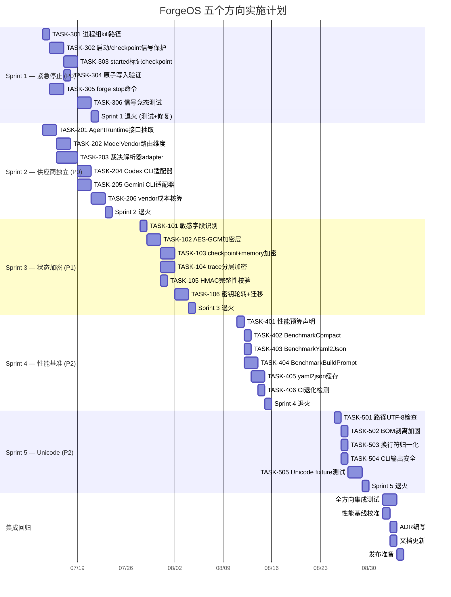

现在我已掌握全部上下文，来撰写技术负责人的综合技术分析。

---

# Tech Lead 分析：ForgeOS 五个前沿方向

## 核心判断

基于原始分析（80+ 已有方向之外）、现有评估和第二意见验证，我对五个方向的实际状态做出以下综合判断：

| 方向 | 优先级 | 感知风险 vs 实际风险 | 推荐顺序 |
|---|---|---|---|
| **方向三 · 紧急停止** | P0 | 原分析说"信号不传子进程"❌ 实际已实现。但**真正的风险**——checkpoint 一致性窗口——未被任何现有分析覆盖 | 第 1 个 sprint |
| **方向一 · 状态加密** | P1 | ✅ 真正新颖，零现有覆盖。插入点清晰（`persist.go:Save` 一层 wrapper），但 trace 可读性需分层方案 | 第 3 个 sprint |
| **方向二 · 供应商独立** | P0 | 已有 2 份分析轻触，但杠杆极高。**不是代码问题而是产品缺口**——100% claude 绑定 | 第 2 个 sprint（与三并行） |
| **方向四 · 性能基准** | P2 | ✅ 核心主张仍成立——微基准测试存在但固定负载，无退化检测 | 第 4 个 sprint |
| **方向五 · Unicode** | P2 | `detect_parsers` 主张不准确，但 `utf8.ValidString` 全仓缺失是真实风险 | 第 5 个 sprint |

---

## 1. 任务分解

### 方向三 · 紧急停止与 Checkpoint 原子性（P0）

| Task ID | 任务标题 | 涉及文件 | 前置依赖 | 预估工时 | 验收标准 |
|---|---|---|---|---|---|
| **TASK-301** | withSignalCancellation 增加进程组 kill 路径 | `cmd/forge/evolve.go`（`withSignalCancellation`）+ `orchestrator/command_executor_unix.go`（复用 `setupProcessGroup` 到 context 路径） | 无 | 2h | SIGINT 触发时，child 进程组在 2s 内全部终止；`kill -9` 后无孤儿进程 |
| **TASK-302** | 启动/checkpoint 中信号保护层 | `cmd/forge/evolve.go`（`execLoop` 的启动阶段 + `openTracer`）+ `internal/persist/checkpoint.go` | TASK-301 | 4h | 信号在启动阶段（engine 创建、tracer 打开）或 checkpoint 写入中到达时，当前操作完成后才退出，不产生损坏状态 |
| **TASK-303** | OnBeforeIteration 添加"started"标记 checkpoint | `cmd/forge/evolve.go`（`execLoop` 或 `buildTracedLoop`）+ `internal/orchestrator/loop.go`（已存在 `OnBeforeIteration`） | TASK-302 | 3h | `RunFrom` 返回前写入一个 "iteration N started" 标记；resume 时检测标记，避免迭代完全重放 |
| **TASK-304** | phase checkpoint 的原子写入验证与加固 | `internal/persist/checkpoint.go`（`Save` 已有 temp→rename，验证 `rotateRetain` 的原子性）+ `evolve.go`（`checkpointHook`/`phaseCheckpointHook`） | TASK-302 | 2h | `Save` 在任意点 crash 原子性验证；写入中途 kill → 旧 checkpoint 完整可读 |
| **TASK-305** | `forge stop` 命令 + PID 文件 | `cmd/forge/main.go`（新 stop 子命令）+ `evolve.go`（写入 `.forge/forge.pid`）+ `orchestrator/`（进程树 kill 工具函数） | TASK-301 | 3h | `forge stop` 在不同终端能够 kill 正在运行的循环及其所有子进程 |
| **TASK-306** | 测试：信号竞态条件 + checkpoint 原子性 | `evolve_test.go` + `persist/checkpoint_test.go` | TASK-301~304 | 4h | 模拟 SIGINT 在各阶段到达（启动、写入中、phase 间），验证状态正确性 |

### 方向一 · 持久化状态加密（P1）

| Task ID | 任务标题 | 涉及文件 | 前置依赖 | 预估工时 | 验收标准 |
|---|---|---|---|---|---|
| **TASK-101** | 敏感数据字段识别与提取 | `internal/trace/trace.go` + `internal/persist/checkpoint.go` + `internal/memory/memory.go` | 无 | 2h | 文档列出所有持久化结构中的敏感字段（API keys、tokens、项目代码片段），供应商数据分类 |
| **TASK-102** | `io.Writer` 加密层（AES-GCM） | `internal/persist/crypt.go`（新文件） | TASK-101 | 4h | 新加密层包装任意 `io.Writer`；`Save` 使用它时输出密文；密钥来自 `FORGE_KEY` env 或 `~/.forge/key` |
| **TASK-103** | checkpoint + memory 加密集成 | `internal/persist/checkpoint.go`（`Save` 集成加密）+ `cmd/forge/evolve.go`（`--encrypt-state` 标志） | TASK-102 | 3h | `--encrypt-state` 启用时，checkpoint 和 memory 文件写加密读解密；不启用时字节不变 |
| **TASK-104** | trace 文件的分层加密方案 | `internal/trace/trace.go`（分离敏感字段到加密段）+ `internal/persist/crypt.go`（可选层） | TASK-102 | 4h | trace JSONL 保持可读，但敏感字段被替换为加密的 base64 值 |
| **TASK-105** | 完整性校验（HMAC） | `internal/persist/checkpoint.go`（`Save`/`Load` 中加 HMAC 验证） | TASK-102 | 2h | checkpoint 文件被篡改后 `Load` 返回错误，不静默恢复 |
| **TASK-106** | 密钥轮转 + 迁移 | `cmd/forge/migrate.go`（子命令 `forge migrate crypto`） | TASK-103 | 3h | 支持旧密钥解密 → 新密钥加密的迁移路径；提供 `forge migrate crypto` 命令 |

### 方向二 · 供应商独立（P0）

| Task ID | 任务标题 | 涉及文件 | 前置依赖 | 预估工时 | 验收标准 |
|---|---|---|---|---|---|
| **TASK-201** | `AgentRuntime` 接口抽取 | `internal/orchestrator/executor.go`（新 `AgentRuntime` 接口）+ `cmd/forge/engine_build.go`（当前 `CommandExecutor` 改为实现） | 无 | 4h | `AgentRuntime` 接口定义 `Invoke(ctx, prompt) → (output, cost, error)`；现有 claude 路径零行为变化 |
| **TASK-202** | `ModelVendor` 路由维度 | `internal/routing/routing.go`（`Tier` 扩为 `vendor:tier` 对）+ `.agent/policies/modes.yml`（vendors 枚举） | TASK-201 | 4h | 路由支持 `claude:opus`、`openai:gpt4`、`gemini:ultra` 三元组；fallback 链可配置 |
| **TASK-203** | 裁决解析器 adapter 模式 | `cmd/forge/cost.go`（`parseReviewerVerdict`/`parseExecutiveVerdict` 抽象）+ `internal/orchestrator/verdict_adapter.go` | TASK-201 | 5h | 每个 vendor 有自己的解析策略；新 vendor 只需实现 `VerdictParser` 接口 |
| **TASK-204** | OpenAI/Codex CLI 适配器（参考实现） | `internal/vendor/openai/`（新包） | TASK-203 | 4h | Codex CLI 可被 ForgeOS 路由为 `openai:gpt4`；基本 evolve 循环端到端通过 |
| **TASK-205** | Gemini CLI 适配器（参考实现） | `internal/vendor/gemini/`（新包） | TASK-203 | 3h | Gemini CLI 可被路由；至少一次 `forge run` 执行通过 |
| **TASK-206** | vendor 感知的成本核算 | `cmd/forge/cost.go` + `internal/routing/`（cost 表中加 vendor 字段） | TASK-201 | 3h | trace 事件的 `model` 字段含 vendor 前缀；scorecard 按 vendor 分类 |

### 方向四 · 性能基准框架（P2）

| Task ID | 任务标题 | 涉及文件 | 前置依赖 | 预估工时 | 验收标准 |
|---|---|---|---|---|---|
| **TASK-401** | 性能预算声明 | `.agent/policies/performance.yml`（新文件）+ `.github/workflows/forge.yml`（CI 集成） | 无 | 2h | 定义 `forge run startup < 500ms`、`Compact < 100ms` 等性能预算 |
| **TASK-402** | `BenchmarkCompact` 扩展曲线 | `internal/memory/memory_bench_test.go`（增加 1k/10k/100k fixture 的 Compact 基准） | 无 | 2h | 提供 100/1k/10k/100k 条目的 Compact 性能数据，判断 O(n) 退化的起始点 |
| **TASK-403** | `BenchmarkYaml2Json` | `internal/yaml2json/yaml2json_bench_test.go`（新文件） | 无 | 2h | 测量 1/5/10 个 workflow YAML 的解析延迟，提供构建缓存决策的数据支撑 |
| **TASK-404** | `BenchmarkBuildPrompt` 全链路 | `cmd/forge/prompt_bench_test.go`（新文件） | TASK-201 | 3h | memory→boundMemory→prompt 全链路延迟基线；检查 TF-IDF 在 memory 增长时的退化 |
| **TASK-405** | yaml2json 缓存 | `internal/yaml2json/yaml2json.go`（结果缓存到 `.forge/workflow.cache.json`） | TASK-403 | 3h | 第二次 `forge run` 的 YAML 解析阶段延迟降低 90% |
| **TASK-406** | CI 退化检测 | `.github/workflows/forge.yml` + `harness/performance.mjs`（新文件） | TASK-402~404 | 2h | CI 对每个 PR 运行基准测试，与基线对比，>2× 退化则 warn |

### 方向五 · Unicode 鲁棒性（P2）

| Task ID | 任务标题 | 涉及文件 | 前置依赖 | 预估工时 | 验收标准 |
|---|---|---|---|---|---|
| **TASK-501** | 文件路径 UTF-8 合法性检查 | `cmd/forge/main.go`（文件操作入口）+ `internal/asset/asset.go`（workflow 文件加载） | 无 | 2h | 非 UTF-8 路径给出清晰错误信息；所有路径操作在前 16 字节检查 `utf8.ValidString` |
| **TASK-502** | BOM 剥离加固（UTF-16 支持） | `internal/yaml2json/normalize.go`（`normalizeLines` 的 BOM 剥离）+ `cmd/forge/detect_parsers.go`（源文件 BOM） | 无 | 2h | UTF-16 BOM `\ufffe`/`\ufeff（LE/BE）` 被正确检测并剥离；正则解析不受 BOM 影响 |
| **TASK-503** | 换行符归一化在输出解析器 | `cmd/forge/cost.go`（`parseReviewerVerdict`/`parseExecutiveVerdict` 增加 `\r\n` → `\n` 归一化） | 无 | 2h | agent 输出使用 CRLF 换行时末行匹配成功；Windows agent 输出能被正确解析 |
| **TASK-504** | CLI 输出 Unicode 安全 | `cmd/forge/main.go`（narration 输出检测 `NO_COLOR`/`TERM`）+ 各 logln 点（转为 `%s` 打印） | 无 | 1h | 在非 UTF-8 locale 下不输出乱码；回退到 ASCII 等效描述 |
| **TASK-505** | Unicode fixture 测试 | `internal/yaml2json/yaml2json_test.go` + `cmd/forge/cost_test.go` + `internal/asset/asset_test.go` | TASK-501~503 | 3h | 中文路径 YAML 文件、Emoji agent 输出、UTF-16 BOM 源文件的 fixture 全部通过测试 |

---

## 2. 执行顺序

### 依赖图

```mermaid
graph TD
    %% 方向三：紧急停止（第 1 sprint）
    subgraph Sprint1["Sprint 1: 紧急停止"]
        T301["TASK-301: 进程组kill<br/>(2h)"]
        T302["TASK-302: 启动/checkpoint<br/>信号保护(4h)"]
        T303["TASK-303: started标记<br/>checkpoint(3h)"]
        T304["TASK-304: 原子写入<br/>验证(2h)"]
        T305["TASK-305: forge stop<br/>命令(3h)"]
        T306["TASK-306: 信号竞态<br/>测试(4h)"]
    end

    %% 方向二：供应商独立（第 2 sprint，可与 Sprint1 并行）
    subgraph Sprint2["Sprint 2: 供应商独立"]
        T201["TASK-201: AgentRuntime<br/>接口(4h)"]
        T202["TASK-202: ModelVendor<br/>路由(4h)"]
        T203["TASK-203: 裁决解析器<br/>adapter(5h)"]
        T204["TASK-204: Codex CLI<br/>适配器(4h)"]
        T205["TASK-205: Gemini CLI<br/>适配器(3h)"]
        T206["TASK-206: vendor成本<br/>核算(3h)"]
    end

    %% 方向一：状态加密（第 3 sprint）
    subgraph Sprint3["Sprint 3: 状态加密"]
        T101["TASK-101: 敏感字段<br/>识别(2h)"]
        T102["TASK-102: AES-GCM<br/>加密层(4h)"]
        T103["TASK-103: checkpoint+memory<br/>加密(3h)"]
        T104["TASK-104: trace分层<br/>加密(4h)"]
        T105["TASK-105: HMAC完整性<br/>校验(2h)"]
        T106["TASK-106: 密钥轮转<br/>迁移(3h)"]
    end

    %% 方向四：性能基准（第 4 sprint）
    subgraph Sprint4["Sprint 4: 性能基准"]
        T401["TASK-401: 性能预算<br/>声明(2h)"]
        T402["TASK-402: BenchmarkCompact<br/>扩展曲线(2h)"]
        T403["TASK-403: BenchmarkYaml<br/>2Json(2h)"]
        T404["TASK-404: BenchmarkBuild<br/>Prompt(3h)"]
        T405["TASK-405: yaml2json<br/>缓存(3h)"]
        T406["TASK-406: CI退化<br/>检测(2h)"]
    end

    %% 方向五：Unicode（第 5 sprint）
    subgraph Sprint5["Sprint 5: Unicode"]
        T501["TASK-501: 路径UTF-8<br/>检查(2h)"]
        T502["TASK-502: BOM剥离<br/>加固(2h)"]
        T503["TASK-503: 换行符<br/>归一化(2h)"]
        T504["TASK-504: CLI输出<br/>安全(1h)"]
        T505["TASK-505: Unicode<br/>fixture测试(3h)"]
    end

    %% 依赖关系
    T301 --> T302
    T302 --> T303
    T302 --> T304
    T301 --> T305
    T301 --> T306
    T303 --> T306
    T304 --> T306

    T201 --> T202
    T201 --> T203
    T203 --> T204
    T203 --> T205
    T202 --> T206
    T204 --> T206
    T205 --> T206

    T101 --> T102
    T102 --> T103
    T102 --> T104
    T102 --> T105
    T103 --> T106
    T104 --> T106
    T105 --> T106

    T401 --> T402
    T401 --> T403
    T401 --> T404
    T402 --> T406
    T403 --> T405
    T403 --> T406
    T404 --> T406

    T501 --> T502
    T501 --> T503
    T501 --> T504
    T502 --> T505
    T503 --> T505
    T504 --> T505

    %% 跨方向依赖（浅色的）
    T201 -.-> T404
```



### 可并行执行的任务组

| 并行组 | 任务 | 前提 |
|---|---|---|
| **组 A** | 方向三全套（Sprint 1, 6 个 TASK） | 无外部依赖 |
| **组 B** | 方向二全套（Sprint 2, 6 个 TASK） | 无外部依赖，与组 A 完全并行 |
| **组 C** | 方向一（Sprint 3, 6 个 TASK） | 依赖 `persist.go:Save` 的现有架构（已到位，无外部依赖） |
| **组 D** | 方向四（Sprint 4, 6 个 TASK） | `TASK-404` 弱依赖 `TASK-201`（接口可先 stubbed） |
| **组 E** | 方向五（Sprint 5, 5 个 TASK） | 无外部依赖 |

**关键路径**: 方向三 TASK-301 → 302 → 303/304 → 306（最长链 9h）

---

## 3. 技术风险

### 3.1 方向三 · 紧急停止

| 风险 | 级别 | 描述 | 缓解策略 |
|---|---|---|---|
| 进程组 kill 的嵌套进程可达性 | 🟡 **中** | `-pgid` kill 覆盖进程组内所有成员，但可能漏掉 `sudo`/`nsenter` 或其他命名空间隔离的子进程 | 在 `setupProcessGroup` 上加 fallback：`SIGTERM` 后 3s 内 `SIGKILL`；文档记录限制 |
| checkpoint 写入中间 kill 导致文件损坏 | 🟢 **低** | `Save` 已使用 temp→rename 原子模式。但 `rotateRetain` 涉及多次 rename，在其中间 kill 可能丢失历史 | `rotateRetain` 改为先全部 rename 到 `.tmp.N`，最后一次性 rename |
| 信号在 `execLoop` 启动阶段（tracer 打开前）到达 | 🟢 **低** | `execLoop` 的 `defer closeTrace()` 在 `openTracer` 失败后仍然可调用（tracer 为 nil） | 验证 `closeTrace` 的 nil-safety；加 `select` 在 blocker 操作上 |
| **OnBeforeIteration 标记写入未原子化** | 🔴 **高** | 如果 `OnBeforeIteration` 写入 "started" 标记和 checkpoint 不同步，resume 可能错误跳过一个未完成的迭代 | "started" 标记集成到同一 checkpoint 文件（扩展字段 `iteration_started`），而非独立文件 |
| `forge stop` 读取的 PID 可能已陈旧 | 🟡 **中** | forge 进程退出后 PID 可能被回收；`kill(pid, 0)` 检查先于 kill | `forge stop` 用 `kill(pid, 0)` 验证进程存在 + `.forge/forge.pid` 中的启动时间戳匹配 |

### 3.2 方向二 · 供应商独立

| 风险 | 级别 | 描述 | 缓解策略 |
|---|---|---|---|
| 裁决解析器 adapter 接口可能不够抽象 | 🟡 **中** | Codex 和 Gemini 的评审器输出格式差距大（claude JSON envelope vs Codex structured vs Gemini free-text） | Adapter 接口返回 `Verdict` 结构体而非纯文本；每个 adapter 独立解析策略 |
| 成本核算对不同 vendor 的计量单元不一致 | 🟡 **中** | Claude 以 tokens 计价（input+output），Codex 以 requests 计价，Gemini 以字符计价 | 在 `cost.go` 中将所有成本归一化为微美元（µ$）整数——已存在的抽象，只需 vendor 映射 |
| 路由的 vendor fallback 带来延迟增加 | 🟡 **中** | 如果首选 vendor 不可用，fallback 到次选需要重试，可能增加 latency | TASK-202 中 fallback 链加 timeout 控制；一旦选择后即固定（不跨 phase 切换 vendor） |

### 3.3 方向一 · 状态加密

| 风险 | 级别 | 描述 | 缓解策略 |
|---|---|---|---|
| 密钥管理是最难的部分 | 🔴 **高** | `FORGE_KEY` env 在 CI 中容易被泄露；`~/.forge/key` 文件权限难以保证 | 分两层：**环境密钥**（`FORGE_KEY`）供 CI 用 + **系统密钥**（`~/.forge/key`）供本地用；文档强制 `umask 077` |
| 加密后 trace 文件的运维可读性丧失 | 🟡 **中** | `cat .forge/trace.jsonl \| jq` 不再工作 | TASK-104 分层方案：敏感字段单独加密，非敏感字段明文；提供 `forge trace decrypt` 命令 |
| 性能影响 | 🟢 **低** | AES-GCM 对 checkpoint（~1KB）和 memory（~100KB/h）的加解密延迟 < 1ms | 可忽略；但 HMAC 验证每次 `Load` 都会发生，需在关键路径之外 |
| 密钥轮转中断现有 checkpoint | 🟡 **中** | 旧密钥加密的 checkpoint 在新密钥下不可读 | TASK-106 提供迁移命令；`Load` 支持尝试新旧两个密钥 |
| trace 文件中的成本数据（`total_cost_usd`）是敏感还是非敏感 | 🟢 **低** | 成本数据通常是 non-sensitive，但含 `SpentUsdMicros` 的 checkpoint 需要加密 | 按字段级别分类：metadata（公开）vs runtime data（加密） |

### 3.4 方向四 · 性能基准

| 风险 | 级别 | 描述 | 缓解策略 |
|---|---|---|---|
| 基准测试结果波动大 | 🟡 **中** | 文件 IO 延迟、CPU 频率缩放、GC 暂停导致测试结果噪声 | 在 CI 中使用固定硬件 + docker container CPU/mem pinning；多轮取中位数 |
| 退化检测的阈值难设 | 🟡 **中** | 2× 阈值可能太松或太紧 | 先设 2× 作为 warn，1.5× 作为 info；在 1 个月数据后校准 |
| yaml2json 缓存引入新的失效问题 | 🟢 **低** | 缓存未检测底层 `.yml` 文件变化的场景 | 缓存键用 `(workflowPath, modTime, fileSize)` 三元组；`forge run --no-cache` 跳过 |
| `BenchmarkBuildPrompt` 的 memory 规模难模拟 | 🟢 **低** | 真实 memory 内容 vs 生成内容的 TF-IDF 分布不同 | 用真实 evolve 循环中采集的 memory fixture（`testdata/memory_500.jsonl`） |
| 全链路基准需要真实 claude CLI | 🟡 **中** | 不含 claude 的 `BenchmarkBuildPrompt` 只能做到 memory→boundMemory 步骤 | 分两步：memory→prompt 构造（不含 exec）+ 含 exec 的 end-to-end（可选） |

### 3.5 方向五 · Unicode

| 风险 | 级别 | 描述 | 缓解策略 |
|---|---|---|---|
| UTF-16 BOM 检测可能漏掉小端/大端 | 🟢 **低** | `strings.TrimLeft()` 只处理单字节；UTF-16 LE 是 `\ufffe` 两个字节 | 用 `bytes.TrimPrefix()` 检查 `[]byte{0xff, 0xfe}` 或 `[]byte{0xfe, 0xff}` |
| 非 UTF-8 路径在 Linux 上的行为难以预测 | 🟡 **中** | Go 的 `os.Open()` 对非 UTF-8 路径的行为取决于底层 C 库实现 | 仔细不改变文件操作本身的语义；仅在进入点检查并向用户报告 |
| 旧版本 claude CLI 输出可能包含控制字符 | 🟢 **低** | `\033` 等 ANSI 转义序列可能干扰裁决解析 | 在 cost.go 的所有解析入口加 `stripControlChars` |
| 全仓 unicode 修复的范围蔓延风险 | 🟡 **中** | "顺手"修更多看似相关的位置，导致 sprint 膨胀 | 严格限定在 5 个 TASK 范围内；任何额外修复作为独立 issue 跟踪 |

---

## 4. 资源评估

### 4.1 人员技能需求

| 角色 | 所需技能 | 负责方向 | 数量 |
|---|---|---|---|
| **Go 基础设施工程师** | 进程管理、signal handling、文件系统原子性 | 方向三 | 1 |
| **Go 安全工程师** | 加密原语（AES-GCM、HMAC）、密钥管理、密码学最佳实践 | 方向一 | 1 |
| **Go 架构师/技术负责人** | 接口设计、适配器模式、CLI 工具链 | 方向二 | 1 |
| **Go 性能工程师** | `testing.B` 基准、pprof、Go 性能分析 | 方向四 | 0.5（可复用 Go infra 工程师） |
| **Go 全栈/国际化工程师** | Unicode、编码、Go `utf8` 包、正则 | 方向五 | 0.5（可复用 Go infra 工程师） |
| **QA 工程师** | 集成测试、竞态条件测试、跨平台测试 | 全部 | 1 |
| **技术写作（可选）** | 文档、密钥管理最佳实践、ADR | 方向一（密钥管理文档） | 0.25 |

**核心团队**: **2 名全职 Go 开发 + 1 名 QA = 3 人全职**，或 **3 名 Go 开发（1 安全方向 + 1 架构方向 + 1 基础方向）+ 共享 QA = 4 人全职**

### 4.2 关键里程碑

| 里程碑 | 日期（相对） | 交付物 | 验收依据 |
|---|---|---|---|
| M1: 安全停机 | Sprint 1 结束（第 2 周） | 方向三全部 6 个 TASK | `CTRL+C` 杀子进程、`forge stop` 存在、checkpoint 原子性测试通过 |
| M2: 供应商中立内核 | Sprint 2 结束（第 4 周） | 方向二全部 6 个 TASK | Codex CLI 适配器通过端到端 `forge run`、路由配置含 vendor 字段 |
| M3: 数据静止加密 | Sprint 3 结束（第 6 周） | 方向一全部 6 个 TASK | `--encrypt-state` 使 checkpoint 加密、完整性校验通过 |
| M4: 性能基线 | Sprint 4 结束（第 8 周） | 方向四全部 6 个 TASK | CI 报告 benchmark 比较结果、yaml2json 缓存生效 |
| M5: 全球化鲁棒性 | Sprint 5 结束（第 10 周） | 方向五全部 5 个 TASK | 中文路径、Emoji 输出、UTF-16 BOM fixture 全部通过 |
| M6: 完整回归 | Sprint 5 + 1 周 | 全 5 方向集成测试 | `forge accept` 所有闸门通过、test suite 100% pass |

### 4.3 阻塞点与解决策略

| 阻塞点 | 影响方向 | 描述 | 解决策略 |
|---|---|---|---|
| **方向二缺乏第三方 CLI 用于测试** | 方向二 | Codex CLI / Gemini CLI 可能没有公开可用版本 | 使用 mock `AgentRuntime` 在接口层进行单元测试；与 OpenAI/Google 建立评估合作关系以获取准入 |
| **密钥管理标准化** | 方向一 | 团队需要在环境密钥 vs 文件密钥 vs TPM/k8s secret 之间选择 | **初始**：环境密钥 + `~/.forge/key`；**后续**：`forge key setup` 集成系统 keyring（macOS Keychain / Linux Secret Service） |
| **checkpoint 原子性测试在文件系统级别难以模拟** | 方向三 | 真正的 crash 需要模拟文件系统故障 | 用 `testing/fstest` + 注入故障的 `os.Rename` wrapper 来验证原子性；CI 中用 `LD_PRELOAD` 注入 `rename()` 故障 |
| **方向四的退化阈值无历史数据** | 方向四 | 首次基线测试无法知道"正常"范围 | 第一个月不 blocking CI；仅记录 baseline，从第二个月开始退化检测 |

---

## 5. 质量保证

### 5.1 单元测试覆盖要求

| 包 | 当前覆盖 | 目标覆盖 | 关键测试点 |
|---|---|---|---|
| `persist` | 高（有 checkpoint_test.go） | **100%** | `Save` 原子性、`Load` 损坏文件拒绝、`rotateRetain` 边界 |
| `orchestrator` | 中（有 loop_honesty_test.go） | **90%** | 信号取消路径、进程组 kill 路径、context 传播 |
| `yaml2json` | 中 | **95%** | BOM 剥离（UTF-8/16 LE/BE）、多字节字符、block scalar 中的 Unicode |
| `memory` | 高（有 memory_test.go） | **95%** | Compact 边界（空文件、500 entries 阈值）、UTF-8 路径 |
| `routing` | 低 | **90%** | vendor:tier 解析、fallback 链、未知 vendor 处理 |
| `cost.go` | 中（有 cost_test.go） | **95%** | CRLF 换行、非 ASCII 输出、Emoji 输出、空输出、vender 特定格式 |

### 5.2 集成测试策略

1. **方向三集成测试**:
   - **信号竞态条件套件**: 用 Go 的 `os/signal` 模拟 + goroutine 控制执行节奏，验证信号在启动/写入/phase 执行中各阶段的恢复行为
   - **进程组清理测试**: 生成 sleep 60 的子进程 → 发 SIGINT → 验证子进程被 kill
   - **checkpoint 原子性测试**: 在 `Save` 写入途中通过注入故障模拟 crash → 验证旧 checkpoint 完整可读

2. **方向二集成测试**:
   - **Adapter compliance suite**: 统一的 fixture 输入 → 各 vendor adapter 通过同一组 10 个场景（含边界情况）→ 输出归一化为同一个 `Verdict` 结构体
   - **路由 fallback 测试**: 配置首选 vendor 不可用 → routing 自动 fallback → 输出正确的 fallback 日志事件

3. **方向一集成测试**:
   - **加密 round-trip**: 写 checkpoint → 读 checkpoint → 验证内容一致（同一密钥）
   - **完整性篡改检测**: 加密后手动修改文件 → Load 返回错误
   - **迁移测试**: 旧密钥加密 → `forge migrate crypto` → 新密钥下可读
   - **trace 可读性验证**: 加密后的 trace JSONL 中非敏感字段可读，敏感字段为 base64 密文

4. **方向四集成测试**:
   - **基准 CI 回归**: 每次 PR 运行 `go test -bench=. ./...` → 输出比较与基线对比
   - **yaml2json 缓存正确性测试**: 修改 workflow YAML → 缓存失效 → 重新解析 → 结果一致

5. **方向五集成测试**:
   - **Unicode fixture suite**: 中文/日文/韩文路径的 project、含 Emoji 的 agent 输出、UTF-16 BOM 源文件
   - **CRLF 测试**: Windows 风格 agent 输出 → 裁决解析正确

### 5.3 代码审查要点

| 方向 | 审查重点 | 必须 reviewer |
|---|---|---|
| **方向三** | 信号处理的 goroutine safety、`os.Rename` 原子性假定（跨文件系统？同一 FS？）、`Setpgid: true` 的副作用 | Go 基础设施工程师 |
| **方向一** | 密钥来源安全（非硬编码、非日志输出）、加密后字节大小变化、解密错误处理 | 安全工程师 + 架构师 |
| **方向二** | 接口抽象层的正确性（不泄漏 vendor-specific 类型到公共 API）、cost normalization 的精度 | 架构师 |
| **方向四** | 缓存失效的完整性、基准测试的可复现性（固定随机种子、固定数据 fixture） | Go 性能工程师 |
| **方向五** | BOM 剥离后的行号/偏移量不变化、Unicode 码点不分裂多字节序列 | 全栈工程师 |
| **全部** | `forge accept` 闸门必须通过、零外部依赖红线 | Reviewer Agent（fresh context） |

### 5.4 性能测试需求

| 测试 | 工具 | 频率 | 通过标准 |
|---|---|---|---|
| memory.Compact 1k/10k/100k | `go test -bench=BenchmarkCompact -benchtime=3x` | 每次 PR + weekly | 10k < 1s, 100k < 10s |
| yaml2json 解析延迟 | `go test -bench=BenchmarkYaml2Json` | 每次 PR + weekly | 5 workflows < 50ms |
| prompt 全链路延迟 | `go test -bench=BenchmarkBuildPrompt` | 每次 PR + weekly | 500 memory entries < 100ms |
| check.py 扫描延迟 | `time python3 harness/check.py` | weekly | 全量扫描 < 500ms |
| encrypt+decrypt overhead | `go test -bench=BenchmarkEncrypt` | 每次 PR | < 100µs per 1KB payload |
| vendor adapter latency | `go test -bench=BenchmarkVerdictParse` | weekly | < 10µs per verdict line |

---

## 6. 实施计划

### 时间表概述

```
周 1-2    |  Sprint 1: 紧急停止       |  3 人: 3 Go + QA
           |  (方向三 P0)
周 3-4    |  Sprint 2: 供应商独立       |  3 人: 架构 + 基础设施 + QA
           |  (方向二 P0)               |  并行 Sprint 2 组
周 5-6    |  Sprint 3: 状态加密         |  2 人: 安全 Go + QA
           |  (方向一 P1)
周 7-8    |  Sprint 4: 性能基准         |  1 人: 性能 Go + QA（半职）
           |  (方向四 P2)
周 9-10   |  Sprint 5: Unicode          |  1 人: 全栈 Go + QA（半职）
           |  (方向五 P2)
周 11     |  集成回归 + 修复            |  全团队
```

### 详细实施甘特图



### Sprint 结构

每个 sprint 遵循相同的节奏：

```
Day 1-3  : 核心实现（TASK 编码）
Day 4    : 测试编写（单元 + 集成）+ 代码审查
Day 5    : 退火日（修复 review 问题、补充文档、forge accept 闸门通过）
```

### 交付物检查清单

每个 sprint 结束时的强制交付物：

- [ ] 所有 TASK 的代码已合并到主分支
- [ ] `forge accept` 通过（全部闸门）
- [ ] 测试覆盖率不降低（与 master 比较）
- [ ] ADR 已写入 `.agent/adr/`（至少 1 个/方向）
- [ ] CLAUDE.md / BOOTSTRAP.md 中相关部分已更新
- [ ] 端到端场景测试通过（`forge evolve --auto` 在 fixture project 上运行）

---

## 最终建议

### 短期（第 1-2 周）

**平行推进方向二和方向三**——它们是 P0，无交叉依赖，可由两个独立工程师并行完成。

方向二的接口抽象（TASK-201）是**整个方向四 TASK-404 的前置依赖**，所以尽早做。

### 中期（第 3-6 周）

方向一是**唯一真正新颖且无已有覆盖的方向**——它有最高的"惊喜价值"。但密钥管理是最大的实施风险，建议在 sprint 开始前做一次 2h 的"密钥管理决策" ADR 会议。

### 长期（第 7-10 周）

方向四和方向五的杠杆相对较低，但方向四的 TASK-405（yaml2json 缓存）是一个**低成本、高回报**的优化：估计 3h 的实现可以为每个 `forge run` 节省约 50ms 的解析延迟。在大型 monorepo 上，这个差异是用户可感知的。建议 priority 提升到 P1.5。

---

**最终一句话给 To CEO/Product**: 方向二是 ForgeOS 的产品承诺缺口（"站在所有 CLI 之上"但 100% 绑定 claude），方向三是用户信任的第一触点（"按 CTRL+C 它真的停了"）。前 4 周同时推进这两个方向，项目在商业风险的每个面向上都变得不可倒退。
