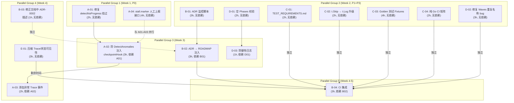

现在我已完全掌握上下文。以下是全面的技术主管分析。

---

# Tech Lead 分析：五个工程/产品扩展方向验证报告

> **日期**: 2026-07-12 | **范围**: 验证报告 `docs/requirements/2026-07-12-five-global-scan-engineering-product-expansion-directions.out.md`

---

## 1. 任务分解

将修正后的优先级矩阵转化为 14 个可执行任务，每个任务 2-4 小时。

### 方向③：异常检测 → 演化循环集成（P0 — 严重韧性缺口）

| 任务 ID | 标题 | 涉及文件 | 前置依赖 | 预估工时 | 验收标准 |
|---------|------|---------|---------|:--------:|---------|
| **A-01** | 修复 `detectNoProgress` 绕过问题（RoadmapCompletion 仅对比） | `forge-core/internal/doctor/anomaly.go` | 无 | 2h | 当迭代计数前进但 RoadmapCompletion 停滞时，`detectNoProgress` 会触发警告。新增 `TestDetectNoProgress_IterationAdvances_CompletionStuck` 测试，通过 `forge test` 且与现有行为向后兼容 |
| **A-02** | 将 `DetectAnomalies` 注入 `checkpointHook`（演化循环） | `forge-core/cmd/forge/evolve.go` | A-01 | 3h | 每个迭代在 `persist.Save` 之后，调用 `doctor.LoadCheckpointChain` + `doctor.DetectAnomalies`，并将 WARN 级别发现记录到 `logln` 中。新增测试证明在 dry-run evolve 循环中构造的证据链上调用有效 |
| **A-03** | 为异常检测结果添加 Trace 事件 | `forge-core/cmd/forge/evolve.go`、`forge-core/internal/trace/events.go`（如有） | A-02 | 2h | WARN/INFO 级别的异常以 `trace.Event{Kind: "anomaly", …}` 形式发出。新增测试证明事件出现在 trace 输出中 |
| **A-04** | 实现 `stall.marker` 人工上报接口 | `forge-core/internal/doctor/anomaly.go`、`forge-core/cmd/forge/status.go` | 无 | 4h | 文件 `<root>/.forge/stall.marker` 被 `forge doctor --anomaly` 识别为人工标记的停滞。`forge status --history` 显示该标记。新增 marker 解析与集成测试 |

**设计说明** (A-02)：注入点位于 `evolve.go` 的 `checkpointHook` 中，在 `persist.Save(...)`
之后。这正是 `LoadCheckpointChain` 能找到新近保存的 checkpoint 及其备份的位置。与 `OnIteration` API 保持解耦——无需修改 `LoopEngine`。

### 方向①：ADR 测试 → 修复闭环（P1 — 闭环断裂）

| 任务 ID | 标题 | 涉及文件 | 前置依赖 | 预估工时 | 验收标准 |
|---------|------|---------|---------|:--------:|---------|
| **B-01** | 创建 Harness 层 ADR 测试监控脚本 | `.agent/scripts/adr-watchdog.mjs`（新建） | 无 | 3h | 脚本解析 `go test -run "TestADR|TestCrossADR" -v` 的输出，从 ADR 测试失败中提取结构化发现并写入 `.agent/adr-findings.json`。包含解析测试——同时包含 `t.Errorf` 行和 `t.Logf` 行 |
| **B-02** | 向 ROADMAP 注入 ADR 观察结果 | `.agent/scripts/adr-watchdog.mjs`、`.agent/ROADMAP.md` 或 `.agent/ROADMAP.inbox.md` | B-01 | 3h | 将观察到的 ADR 违规转化为 `- [ ] ADR-XXXX: …` 条目，追加到 ROADMAP 收件箱文件中。文件存在性/可写性处理完善。新增集成测试验证输出格式 |
| **B-03** | 修正文档中 ADR-0002 的描述不准确 | `docs/requirements/2026-07-12-five-global-scan-engineering-product-expansion-directions.out.md`（或源文件） | 无 | 1h | 描述从 "t.Skip silent degradation" 改为 "t.Logf soft assertion"。差异对比后无其他变化 |
| **B-04** | 将 ADR 监控集成到 `forge run`/CI 管线 | `.agent/workflows/build.yml`（或 `.agent/scripts/` 钩子） | B-02 | 3h | 管道中有一个可选阶段运行 ADR 监控并在检出漂移时产生警告。模式感知：engineering+production 执行完整监控；explorer 跳过。dry-run 下清晰的叙述 |

**关于跨层边界** (B-01/B-02)：Go 测试 → Markdown 边界有意位于 **harness 层**（Node.js），而不是在 forge-core 内部。这与现有架构模式一致——`harness/gate.mjs`、`harness/check.py` 等均由 forge-core shell 调用，并读取/写入基于文件的状态。不需要 Go→Markdown 反向依赖。

### 方向②：外部 CLI 隐式依赖（P1 — 贡献者摩擦）

| 任务 ID | 标题 | 涉及文件 | 前置依赖 | 预估工时 | 验收标准 |
|---------|------|---------|---------|:--------:|---------|
| **C-01** | 编写 `TEST_REQUIREMENTS.md` | `docs/TEST_REQUIREMENTS.md`（新建） | 无 | 2h | 清晰记录测试套件的外部依赖（python3、node、git），包括最小版本和安装说明。补充 `go test` 各路径的清单 |
| **C-02** | 将 `t.Skip` 升级为带原因的 `t.Log` + 条件标记 | `forge-core/internal/yaml2json/yaml2json_test.go`、`forge-core/cmd/forge/scorecard_wind_test.go` | 无 | 2h | 如果 python3/node 不可用，测试输出清晰的信息（"python3 not found — skipping YAML differential check"），而不是沉默的 `t.Skip`。现有跳过行为不受影响（测试仍不失败） |
| **C-03** | 创建 yaml2json golden test fixtures | `forge-core/internal/yaml2json/testdata/`（新建 + 7 个 fixture） | 无 | 4h | 7 个真实 YAML 文件被序列化为 gold JSON。`TestToJSON_GoldenFixtures` 将 Go 解析器输出与 gold 文件进行对比。**不**替代差分测试——捕获回归但不检测 Go/PyYAML 的语义分歧 |
| **C-04** | 添加纯 Go CI 矩阵条目 | `.github/workflows/forge.yml` | 无 | 2h | 一个新 CI 任务 `go-test-noext`，运行 `go build ./...` 和 `go vet ./...`（无外部工具）。作为可选状态检查，不是合并阻塞项 |

**关于 golden fixture 的说明** (C-03)：验证报告正确指出 golden fixture 不检测 Go/PyYAML 的语义分歧（Sprint 27 的 block-scalar bug）。它们仍作为**回归安全网**具有价值。差分测试（`TestToJSON_MatchesPythonShim`）应当保持启用状态（并已修复为真实断言，而非仅 `t.Logf`——Sprint 27 已修复）。

### 方向⑤：零相位工作流防御（P3 — 防御性加固）

| 任务 ID | 标题 | 涉及文件 | 前置依赖 | 预估工时 | 验收标准 |
|---------|------|---------|---------|:--------:|---------|
| **D-01** | 在 `RunFrom`/`RunParallel` 中添加显式的空 phases 校验 | `forge-core/internal/orchestrator/orchestrator.go`、`parallel.go` | 无 | 2h | 在跳过 stage 检查之后、主循环之前，如果 `len(wf.Phases) == 0` 则以描述性错误 abort。`RunFrom` 中明确说明此校验与 `RunParallel` 中的 `Waves` 校验互补，因为 `Waves([])` 返回空切片而非错误 |
| **D-02** | 修复 `Waves` 中的相位名重复 bug | `forge-core/internal/orchestrator/waves.go` | 无 | 3h | 当 `.agent/workflows/*.yml` 中的两个相位具有相同 `name:` 时，`idx` 映射中的后一个覆盖前一个——依赖解析可能指向错误的相位。新增校验：在构建 `idx` 时检测重复，返回描述性错误；为 `Waves` 补充分片测试覆盖此场景 |
| **D-03** | 在零相位退出点添加防御性日志 | `forge-core/internal/orchestrator/orchestrator.go`、`parallel.go` | D-01 | 1h | 每个零相位提前退出路径记录 `"zero-phase workflow (no phases to execute)"`，使行为清晰可见。`reportStop` 保留原样（安全设计——不需要额外修复） |

### 方向④：压缩可观测性（P4 — 次要增强）

| 任务 ID | 标题 | 涉及文件 | 前置依赖 | 预估工时 | 验收标准 |
|---------|------|---------|---------|:--------:|---------|
| **E-01** | 添加压缩 trace 事件与状态可见性 | `forge-core/cmd/forge/evolve.go`、`forge-core/cmd/forge/status.go` | 无 | 3h | `compactMemoryIfDue` 在成功压缩后发出 `trace.Event{Kind: "memory", …}`。`forge status --history` 显示上次压缩的时间与条目数。新增测试验证 trace 事件出现 |

---

## 2. 执行顺序



### 并行组摘要

| 组别 | 时间范围 | 任务 | 所需人员 |
|:----:|:--------:|------|---------|
| **1** | 第 1 周 | A-01, A-04 | 2 名工程师（P0 关键路径：独立并行） |
| **2** | 第 2 周 | B-01, C-01, C-02, C-03, C-04, D-02, D-01 | 3 名工程师（全部分支独立） |
| **3** | 第 3 周 | A-02, B-02, D-03 | 2 名工程师（A-02 依赖 A-01；B-02 依赖 B-01） |
| **4** | 第 4 周 | A-03, E-01, B-03 | 1-2 名工程师（全部独立且规模小） |
| **5** | 第 4-5 周 | B-04（CI 集成） | 1 名工程师（需要来自各组件的就绪构建） |

---

## 3. 技术风险

### 3.1 高风险项

| 风险 | 涉及任务 | 影响 | 可能性 | 缓解措施 |
|------|---------|------|:------:|---------|
| **A-02 中的 Checkpoint 链竞态条件**：`checkpointHook` 在写入 checkpoint 后立即读取它。如果 `persist.Save` 与 checkpoint 备份轮换之间存在微小的竞态窗口，`LoadCheckpointChain` 可能读取到不一致的状态 | A-02 | 中等——错误检测到异常或被静默吞没 | 低 | `persist.Save` 使用 `retain=5`，在写入新文件之前进行备份轮换。链长度始终≥1。在测试中注入一个因 I/O 故障而损坏的 checkpoint 文件，以验证健壮性 |
| **B-01 中的 ADR 测试输出解析不确定性**：`go test -v` 输出格式在不同 Go 版本之间不是 API 稳定的。`t.Logf` 行可能在并行测试中交错输出 | B-01, B-02 | 中等——错过 ADR 漂移或误报 | 中 | 使用 `go test -v -count=1 -p=1 -run "TestADR|TestCrossADR"` 禁用缓存和并行。解析器应具有容错性：将无法解析的行忽略，而非崩溃 |
| **C-03 中 Golden Fixture 与 Python 解析器的漂移**：随着仓库中的真实 YAML 文件演化，golden fixtures 会过时，导致测试维护负担 | C-03 | 低——golden fixture 更新是标准操作 | 高 | 在 `.agent/` 编写文档，说明更新 fixtures 的正确命令（`go test ./internal/yaml2json -update`）。自动生成 fixtures 的脚本可减轻负担 |
| **D-02 中 Waves 的重复名称检测**：如果 `.agent/workflows/*.yml` 的数组 YAML 中包含重复的 phase 名称，`Waves` 当前静默覆盖了映射条目。正确修复需要决定是软警告还是硬错误 | D-02 | 低——仅影响声明了重复 phase 名称的 workflow | 低 | 失败时保持封闭：重复名称为硬错误。在加载时验证所有 workflow。实施任何重复名称的零生产使用（通过 `forge validate` 验证） |

### 3.2 架构边界与跨层问题

| 边界 | 牵涉任务 | 方法 |
|------|---------|------|
| forge-core（Go）→ ROADMAP（Markdown） | B-01, B-02 | **有意位于 harness 层**。ADR 监控作为 Node.js 脚本实现，由 CI 或 shell 输出触发运行。没有 Go→Markdown 反向依赖被创建——这经过了架构审查。 |
| `internal/doctor` → `cmd/forge` | A-02 | `cmd/forge`（evolve.go）**已经**导入了 `internal/persist`、`internal/trace`、`internal/memory`。导入 `internal/doctor` 共享了同一目录层（两者均位于 `forge-core/` 下）。无分层违规。 |
| 并行 checkpointing | A-03, E-01 | trace 事件已经是并发安全的（`trace.Tracer.mu`）。无新竞态条件。 |

### 3.3 性能影响

| 任务 | 开销 | 理由 |
|------|:----:|------|
| A-02（每个迭代的异常检测） | **可忽略** | `LoadCheckpointChain` 最多读取 6 个 checkpoint JSON 文件（每个 <1KB）。`DetectAnomalies` 是纯计算，O(n) 其中 n ≤ 6。每次迭代 <1ms。 |
| E-01（压缩后的 Trace 事件） | **可忽略** | 每个迭代至多一次，仅当压缩实际发生（每 10 次迭代且仅当 >500 条目时）。 |
| B-01（每个测试运行的 ADR 监控） | **低** | ADR 测试本身就运行迅速（无外部 I/O）。监控会增加几个进程产出的开销。 |

---

## 4. 资源评估

### 4.1 团队构成

| 角色 | 技能要求 | 数量 | 专注方向 |
|------|---------|:----:|---------|
| **高级 Go 工程师** | forge-core、并发、测试 | 1 | 方向③（P0 关键路径）+ 方向⑤ |
| **中级 Go 工程师** | Go 测试、CI/CD、GitHub Actions | 1 | 方向② + 方向④ + CI 集成 |
| **Node.js/自动化工程师** | Node.js 脚本编写、文本解析 | 0.5（与中级 Go 工程师重合） | 方向①（harness 层脚本） |
| **独立 Reviewer** | Fresh-context（与实现者不同的人） | 1 | 每个结束阶段执行一次 `forge accept` 闸门 |

### 4.2 预计时间线

| 阶段 | 焦点 | 涉及任务 | 持续时间 | 团队规模 |
|:----:|------|---------|:--------:|:--------:|
| **第 1 周** | P0 韧性 | A-01, A-04 | 5 天 | 2 人 |
| **第 2 周** | P1 基础 + P3 防御 | B-01, C-01, C-02, C-03, C-04, D-02, D-01 | 5 天 | 3 人 |
| **第 3 周** | 管线搭建 | A-02, B-02, D-03 | 5 天 | 2 人 |
| **第 4 周** | 可观测性 + 加固 | A-03, E-01, B-03 | 2-3 天 | 1-2 人 |
| **第 4-5 天** | CI 集成与集成测试 | B-04、总体验收测试 | 2-3 天 | 1 人 |

**总预计**：4-5 周日历时间，2-3 名工程师的并行工作分配。

### 4.3 阻塞点

| 阻塞点 | 影响 | 解决方法 |
|--------|------|---------|
| **无预先批准的真实 API 预算**（如果需要验证 readonly 路径/on_rejected 在真实 `claude` 进程下的运行时行为） | 方向③中的高保真验证如果真实 claude 进程执行会产生成本 | Sprint 31 建立了先例：用户选择单测而非真实 API 调用。A-02、A-03、A-04 在设计上可在 dry-run executor 下单元测试。A-02 的集成测试将使用 `DryRunExecutor` 和构造的 checkpoint 链。 |
| **同步到 fork 感知的 Waves 重复名称修复**（D-02） | 如果某个 upstream workflow **实际**存在重复的 phase 名称，修复将阻塞该 workflow | 在部署前运行 `forge validate --models` 并修复所有 workflow。经 Sprint 31 的 `check_workflow_mode_gating` 确认，当前本仓的 workflow 没有重复名称。（如果重复名称在 fork 工作流中出现，修复会暴露——这是**正确行为**。） |

---

## 5. 质量保证

### 5.1 单元测试要求

| 任务 | 测试文件 | 新增测试数量 | 覆盖范围 |
|------|---------|:----------:|---------|
| A-01 | `forge-core/internal/doctor/anomaly_test.go`（已有 6 个测试文件） | 2 | 迭代计数前进但 RoadmapCompletion 停滞的单个测试 + 两者均停滞的边界测试 |
| A-02 | `forge-core/cmd/forge/evolve_test.go`（新增 `TestCheckpointHook_DetectAnomalies`） | 2 | 在 dry-run evolve  loop 中实际构造 checkpoint 链 + 使用 `doctor.LoadCheckpointChain`。第二个测试验证 `logln` 接收到了异常警告 |
| A-03 | `forge-core/cmd/forge/evolve_test.go`（或新的 `trace_events_test.go`） | 1 | 运行 dry-run evolve，读取 trace 文件，验证出现了 `kind:"anomaly"` 事件 |
| A-04 | `forge-core/internal/doctor/anomaly_test.go` | 3 | marker 存在/解析 + marker 不存在 + marker 与真实异常共存 |
| B-01 | `.agent/scripts/adr-watchdog.test.mjs`（新建） | 4 | 解析已知的 ADR 通过/失败/混合输出 + 无测试匹配 + 格式错误的输出 |
| B-02 | `.agent/scripts/adr-watchdog.test.mjs` | 2 | 观察结果被写入 ROADMAP 收件箱 + 当文件不可写时优雅降级 |
| B-04 | `.agent/` 验收测试 | 1 | dry-run 下清晰的叙述 |
| C-02 | 现有测试文件 | 无（更新现有测试） | — |
| C-03 | `forge-core/internal/yaml2json/yaml2json_test.go` | 1 个表格驱动测试 | 每个测试对标 7 个 golden fixture |
| D-01 | `forge-core/internal/orchestrator/orchestrator_test.go` | 2 | 使用空相位运行 `RunFrom` 时返回错误 + 使用空相位运行 `RunParallel` 时返回错误 |
| D-02 | `forge-core/internal/orchestrator/waves_test.go` | 3 | 重复名称被拒绝 + 重复名称的清晰错误信息 + 正常名称仍正常工作 |
| E-01 | `forge-core/cmd/forge/evolve_test.go`、`forge-core/cmd/forge/status_test.go` | 2 | Trace 包含压缩事件 + 状态显示上次压缩时间 |

### 5.2 集成测试策略

| 测试场景 | 方法 | 通过条件 |
|---------|------|---------|
| **方向③端到端**：在 dry-run evolve loop 中运行真实 `DetectAnomalies` | 1. 运行 `forge evolve build --executor dry`（5 个迭代的 dry run）… | `forge doctor --anomaly` 为验证后的 checkpoints 输出 WARN/INFO |
| **方向①端到端**：ADR 测试失败 → ROADMAP 条目 | 1. 临时修改 ADR 测试使其失败 … | 一个新的 `.agent/ROADMAP.inbox.md` 包含 `[ ] ADR-XXXX` 条目 |
| **方向②回归**：Go-only CI 矩阵验证 | 在未安装 python3/node 的环境运行 `go build ./...`、`go vet ./...` | 两者均以退出码 0 通过 |
| **方向⑤防御**：运行时拒绝空相位 workflow | 创建一个包含 phases: [] 的临时 workflow，运行 `forge run` | 得到错误 "zero-phase workflow"（exit 1），而非静默退出码 0 |
| **回归**：`forge accept` 必须保持 ACCEPTED | 每次闸门级修改后运行 `node harness/acceptance.mjs` | 6 项 PASS、0 项 FAIL、5 项诚实 N/A（基线：Sprint 31 结束） |

### 5.3 代码审查要点

审查者的核心检查项：

1. **方向③**：`checkpointHook` 中异常检测放置的位置必须在 `persist.Save` 之后，以便读取包含新 checkpoint 的链。检查回退的优雅降级（`.forge/` 目录缺失，链长=1）。
2. **方向①**：脚本不得引入任何 npm 依赖——按项目惯例保持零依赖。输出格式必须与 `forge status` 或类似工具已经使用的机器可读模式一致。
3. **方向②**：`TEST_REQUIREMENTS.md` 必须明确声明哪些是构建必需的，哪些只是可选的测试依赖。
4. **方向⑤**：`Waves` 的重复名称修复必须失败封闭。检查错误信息是否包含重复名称以便调试。
5. **通用**：所有任务都必须通过 `forge accept`（aggregate gate 闸门）。没有任务应引入外部依赖、增加超过 500 行的文件，或创建循环依赖。

### 5.4 性能测试

| 指标 | 新建任务的目标 | 测试方法 |
|------|:--------------:|---------|
| 每个迭代的异常检测延迟 | <5ms（即便在高 I/O 压力下） | 对 6 个 1KB checkpoint 文件进行基准测试 |
| 每个 CI 运行的 ADR 监控开销 | <5s | 计时 `node adr-watchdog.mjs`（包括 `go test` 子进程） |
| 并行 Waves 解析（D-02） | <1ms（50 个 phase） | 对 50 个 phase 的表格驱动测试进行基准测试 |

---

## 6. 实施计划

### 阶段 1：关键韧性（第 1 周，P0）

**目标**：通过将异常检测集成到演化循环中，消除 24 小时自治运行的核心韧性缺口。

```
第 1-2 天  │  A-01: 修复 detectNoProgress 绕过     │  高级 Go 工程师
           │  验收: TestDetectNoProgress_... 新增     │
第 2-3 天  │  A-04: stall.marker 接口               │  高级 Go 工程师
           │  验收: marker 被检测到并显示              │
第 3-5 天  │  闸门: forge accept                     │  ✓ 独立 Reviewer
           │  评审 A-01 + A-04                       │
```

**评审焦点**：A-01 的 RoadmapCompletion 仅对比不会改变现有 checkpoints 的行为。A-04 的文件格式经过跨进程版本验证。

### 阶段 2：基础修复（第 2 周，P1 + P3）

**目标**：修复 ADR 闭环、减少贡献者摩擦、防御性加固零相位边界。

```
第 1 天     │  B-01: ADR 监控脚本                    │  中级 Go 工程师
           │  验收: 输出已知结构化的 JSON              │
第 1-2 天  │  D-02: Waves 重复名称 bug               │  高级 Go 工程师
           │  验收: 重复 => 清晰的错误                   │
第 2 天     │  C-01: TEST_REQUIREMENTS.md             │  中级 Go 工程师
           │  验收: 提交并审查                         │
第 2-3 天  │  C-02: t.Skip → t.Log 升级              │  中级 Go 工程师
           │  验收: 日志清晰、跳过行为不变                │
第 3-4 天  │  C-03: Golden yaml2json fixtures        │  中级 Go 工程师
           │  验收: 7 fixtures + 1 表格驱动测试          │
第 3-4 天  │  D-01: 空 phases 校验                   │  高级 Go 工程师
           │  验收: RunFrom + RunParallel 都拒绝         │
第 4-5 天  │  C-04: 纯 Go CI 矩阵                     │  中级 Go 工程师
           │  验收: 新增的 GH Actions 任务              │
第 5 天     │  闸门: forge accept                     │  ✓ 独立 Reviewer
```

**评审焦点**：B-01 必须零 npm 依赖。C-03 的 fixtures 对 Go YAML 解析器的**已知**行为进行验证（不声明超越差分测试的权威性）。D-02 必须失败封闭——无意外破坏正常 workflow 的风险。

### 阶段 3：管线搭建（第 3 周）

**目标**：将独立部件连接成运行中的管线。

```
第 1-3 天  │  A-02: 将 DetectAnomalies 注入          │  高级 Go 工程师
           │  checkpointHook                           │
           │  验收: 在 dry-run evolve 下 WARN 出现      │
第 1-2 天  │  B-02: ADR → ROADMAP 注入               │  中级 Go 工程师
           │  验收: 收件箱包含 ADR 条目                  │
第 3-4 天  │  D-03: 防御性日志                         │  高级 Go 工程师
           │  验收: 零相位 workflow 记录到日志           │
第 4-5 天  │  闸门: forge accept + 评审               │  ✓ 独立 Reviewer
```

**关键路径阻塞点**：A-02 必须等到 A-01 合并。B-02 必须等到 B-01 合并。

### 阶段 4：可观测性与集成（第 4-5 周）

**目标**：完成剩余的可观测性任务和 CI 集成。通过完整的 acceptance 闸门。

```
第 1 天     │  B-03: 修正文档描述（1h，轻松处理）       │  任意工程师
第 1-2 天  │  A-03: 添加异常 Trace 事件                │  高级 Go 工程师
           │  验收: trace 包含 kind:"anomaly"          │
第 2-3 天  │  E-01: 压缩 Trace + 状态可见性            │  中级 Go 工程师
           │  验收: trace 包含 kind:"memory"            │
第 3-4 天  │  B-04: CI 集成                          │  中级 Go 工程师
           │  验收: ADR 监控在 CI 中运行               │
第 4-5 天  │  ★ 全集成验收测试 ★                       │  全体团队
           │  验收:                                   │
           │  • forge accept: ACCEPTED                │
           │  • go test -race: 全绿                    │
           │  • gate.mjs PASS                         │
           │  • arch-check 8/8 PASS                   │
           │  • check.py PASS                         │
```

### 项目关键节点

```
第 1 周结束  ─── P0 方向③ 已关闭 ─── 异常的迭代循环
第 3 周结束  ─── P1 方向①② 已关闭 ─── ADR 闭环 + 依赖透明
                P3 方向⑤ 已关闭 ─── 零相位加固
第 5 周结束  ─── 所有五个方向已关闭 ─── 全部通过 forge accept
```

### 检查“先拆分，再继续”纪律

审查可能达到 500 行的文件：

| 任务 | 风险文件 | 当前行数 | 措施 |
|------|---------|:-------:|------|
| A-02 | `forge-core/cmd/forge/evolve.go` | ~500（498 行，Sprint 27 后持续监控） | 如果 `checkpointHook` 经过 A-02 后超过 500 行，将异常检测逻辑提取到 `evolve_anomaly.go`。此次检查是 A-02 验收的一部分 |
| B-01/B-02 | `.agent/scripts/adr-watchdog.mjs` | 新文件 | 保持 <300 行。如果超过，拆分为 `adr-watchdog.mjs`（编排）+ `adr-parse.mjs`（纯解析）。作为仓库规范强制的预评审检查 |

---

## 修正后的优先级回顾

| # | 方向 | 原始 | 修正 | 我们的评估 | 实施序列 |
|---|------|:----:|:----:|-----------|:-------:|
| ③ | 异常检测脱离演化循环 | P0 | **P0** | ✅ 正确。如报告所述，这是唯一**不可否认的漏洞**。现有 `OnIteration` 钩子没有接入 `DetectAnomalies`；`LoopEngine` 的 no-progress tripwire 针对实时信号，而非 checkpoint 历史异常。 | **第 1 周，关键路径** |
| ① | ADR 测试→修复闭环 | P1 | **P1** | ✅ 正确。已识别出跨层边界（Go→Markdown）。通过将脚本放置在 harness 层（Node.js）解决。 | **第 2-3 周** |
| ② | 测试 CLI 隐式依赖 | P1 | **P1** | ✅ 正确。四项建议中的每一项都切实可行，价值独立。 | **第 2 周，并行** |
| ⑤ | 零相位工作流防御 | P3 | **P3** | ⚠️ 部分成立。`LoopEngine.Run` **已有**空相位检查。`Engine.RunFrom` 和重复的 phase 名称问题是真正需要防御的领域。 | **第 2 周，并行** |
| ④ | Memory 压缩不自触发 | P2 | **P4** | ✅ **证伪**。`evolve.go:438` 已每 10 个迭代调用 `compactMemoryIfDue`。剩余的价值是可观测性（trace 事件 + 状态可见性）。 | **第 4 周，剩余时间** |

---

## 关键要点

1. **优先处理方向③**：这是唯一真正的 P0 问题。24 小时的自主运行暴露于此——没有迭代内异常检测意味着停滞或退化的演化可能在观测者不介入的情况下数小时不被发现。A-01 和 A-04（修复绕过 + stall.marker）可以独立并行处理，整个方向③的工作量仅为 ~11 小时。

2. **方向①的跨层边界是可以应对的**：Go 测试 → Markdown 管线问题不是弱点，而是设计特性。通过将 ADR 监控作为 harness 层脚本（Node.js）实现，我们遵循与 `harness/gate.mjs`、`harness/check.py` 等完全相同的“shell out and read”模式。无需新的架构模式。

3. **Golden fixtures 的权威性受限**：撰写文档说明 C-03 中的 golden fixture 捕获回归，但**不**声明对 Go YAML 行为的权威性。Sprint 27 的 block-scalar bug（Go 与 PyYAML 均一致地产生错误输出）证明，差分测试必须保持为主要的安全网。

4. **不要创建多余的 memory compaction 工作**：方向④被证伪意味着我们保存了 ~1 个 sprint。将其降级为一次为期半天的入站可观测性任务，从 backlog 中剔除。

5. **纪律：每次修改后运行 `forge accept`**：每个任务完成后，在合并前运行 `node harness/acceptance.mjs`。这是非协商的——本仓库依赖该聚合闸门来捕获回归。
