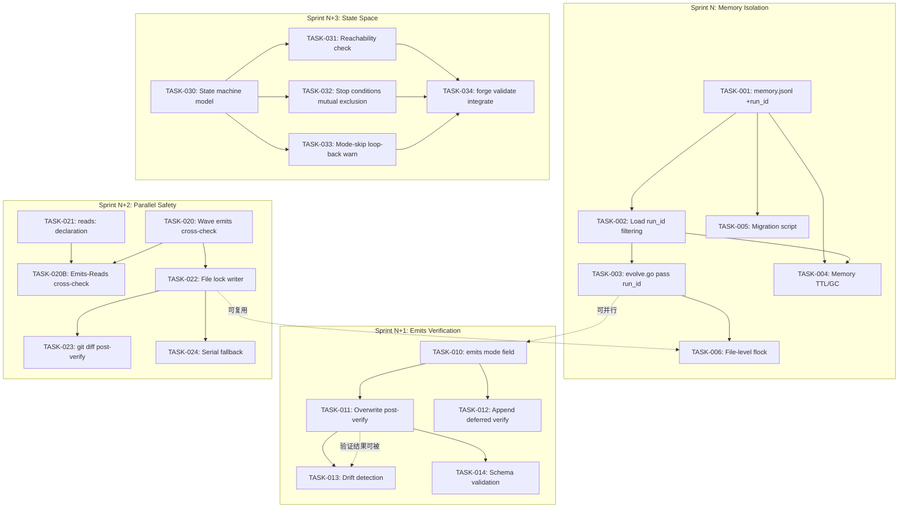

# Tech Lead 评审：五方向扩展工程实施分析

**评审角色**: Tech Lead  
**日期**: 2026-07-12  
**范围**: 基于架构评审的 P0/P1/P2 方向（方向④暂搁置）

---

## 1. 任务分解

### 方向③ —— Memory 隔离（P0）

| 任务 ID | 标题 | 涉及文件 | 前置依赖 | 预估工时 | 验收标准 |
|---------|------|---------|---------|---------|---------|
| TASK-001 | `memory.jsonl` 追加 `run_id` 字段 | `memory.go`, `types.go`, `evolve.go` | 无 | 2h | evolve 写入的每条 memory record 包含 `run_id`；已有 record 向后兼容（默认空字符串） |
| TASK-002 | `Load` 加入 `run_id` 过滤参数 | `memory.go:Load` 及其调用链 | TASK-001 | 3h | `Load(runID)` 只返回匹配 `run_id` 的 record；空 `run_id` 兼容旧数据 |
| TASK-003 | `evolve.go` loop 中传递当前 `run_id` | `cmd/forge/evolve.go:168-175`, `orchestrator/loop.go` | TASK-002 | 2h | 每次 evolve 调用生成唯一 `run_id`，传入 `Load`；同一仓库并发 evolve 不互相读取 |
| TASK-004 | Memory TTL / GC 机制 | `memory.go`, 新增 `memory_cleanup.go` | TASK-001 | 4h | 超过 TTL（默认 7 天）的 record 被 `maintainMemory` 清理；TTL 可配置 |
| TASK-005 | Memory Migrate 脚本（旧→新格式） | 新增 `cmd/forge/migrate_memory.go` | TASK-001 | 2h | 提供 `forge migrate memory` 命令，给所有无 `run_id` 的 record 补 `run_id` |
| TASK-006 | 文件级锁（进程级互斥） | 新增 `memory_lock.go`（基于 `flock`） | TASK-003 | 3h | 同一 `.forge/memory.jsonl` 的并发写入被序列化；超时 5s 后报错而非静默覆盖 |

**共计**: 16h（4 人·天）

---

### 方向② —— Emits 验证（P1）

| 任务 ID | 标题 | 涉及文件 | 前置依赖 | 预估工时 | 验收标准 |
|---------|------|---------|---------|---------|---------|
| TASK-010 | `emits:` 追加 `mode` 字段（schema） | `types.go`, `workflow_schema.go` | 无 | 2h | YAML 中 `emits` 支持 `mode: overwrite\|append`；默认 `overwrite`；schema 校验 |
| TASK-011 | Overwrite 模式 emits 后验证（存在+非空） | `verify.go` 或新增 `emits_verify.go` | TASK-010 | 4h | 每个 overwrite-mode phase 完成后，检查 emits 文件存在且非空；失败则标记 phase 告警 |
| TASK-012 | Append 模式 emits 的延迟验证 | `workflow.go:verify`, `orchestrator/loop.go` | TASK-010 | 4h | `append` 模式 emits 不在 per-phase 检查；在 workflow 级别汇总结案后一次校验 |
| TASK-013 | 漂移检测（git diff 工作树 vs emits） | 新增 `drift_check.go` | TASK-011 | 5h | `forge verify --drift` 对比 `emits` 声明的文件 vs git 追踪的文件；检出未声明文件 + 缺失声明文件 |
| TASK-014 | Schema 验证（emits 文件格式合规） | 新增 `schema_validator.go` | TASK-011 | 4h | 根据 `emits.schema:` 引用的 JSON Schema，对 emits 文件做合规校验；schema 验证失败不阻塞但记录到 trace |

**共计**: 19h（~5 人·天）

---

### 方向① —— 并行冲突检测（P1）

| 任务 ID | 标题 | 涉及文件 | 前置依赖 | 预估工时 | 验收标准 |
|---------|------|---------|---------|---------|---------|
| TASK-020 | Wave 内 `emits` 交叉检测 | `parallel.go`, `wave.go` | 无 | 4h | wave 构建后检查同 wave 内 phase 的 emits 路径是否有重叠；有重叠则自动串行化（移至下 wave） |
| TASK-021 | `reads:` 声明字段（追加） | `types.go`, `workflow_schema.go` | 无 | 3h | YAML 中 phase 可以声明 `reads:[paths]`；与 `emits` 交叉检测联动 |
| TASK-020B | Emits-Reads 交叉冲突检测 | `parallel.go`, `scheduler.go` | TASK-020, TASK-021 | 3h | 同一 wave 内，一个 phase emits 路径与另一 phase reads 路径重叠 → 串行化 |
| TASK-022 | 文件锁写入（write-lock per phase） | 新增 `file_locker.go`（`flock` 封装） | TASK-020 | 4h | 每个 phase 写入 emits 前获取文件锁，写入后释放；锁等待超时可配置（默认 30s） |
| TASK-023 | git diff + emits 后检测冲突 | 新增 `post_parallel_verify.go` | TASK-022 | 4h | `forge verify` 在 parallel mode 完成后，检测两个 phase 是否修改了同一文件的不同部分（基于 git diff hunk 分析） |
| TASK-024 | 自动串行化 fallback 通道 | `scheduler.go`, `parallel.go` | TASK-020, TASK-022 | 3h | 文件锁冲突超时后，phase 自动降级到串行执行；降级事件记录到 trace |

**共计**: 21h（~5 人·天）

---

### 方向⑤ —— 状态空间验证（P2）

| 任务 ID | 标题 | 涉及文件 | 前置依赖 | 预估工时 | 验收标准 |
|---------|------|---------|---------|---------|---------|
| TASK-030 | 基础状态机模型提取 | 新增 `statemachine.go`（从 `Engine` + `phase_runner.go` 提取） | 无 | 4h | 将 workflow 执行过程建模为状态图：phase→gate→phase…；输出 DOT graph |
| TASK-031 | 静态可达性检查 | 新增 `reachability.go` | TASK-030 | 5h | 给定所有 gate 的可能分支，检查每个 phase 都可到达；不可达 phase 报告 warning |
| TASK-032 | Stop 条件互斥验证 | 新增 `stop_verifier.go` | TASK-030 | 4h | 检测两条 `stop` 条件是否在同一状态下同时满足（矛盾）；检测同一条件被不同 gate 以矛盾方式引用 |
| TASK-033 | Mode-skip + loop-back 空轮检测 | `mode_gating.go`, `phase_runner.go` | TASK-030 | 3h | 如果 loop_back 的 `target_phase` 会被当前 mode skip → 发出 warning 而非静默空转 |
| TASK-034 | `forge validate workflow` 集成 | `cmd/forge/validate.go` | TASK-031, TASK-032, TASK-033 | 3h | `forge validate workflow` 运行上述全部检查；结果以 JSON 输出（CI 友好） |

**共计**: 19h（~5 人·天）

---

## 2. 执行顺序与依赖图



### 可并行的任务组

| 并行组 | 任务 | 说明 |
|--------|------|------|
| **Group A** | TASK-001, TASK-005, TASK-010 | schema 变更可同时进行，互不冲突 |
| **Group B** | TASK-002, TASK-004 | 依赖 TASK-001，但彼此独立 |
| **Group C** | TASK-011, TASK-012 | 依赖 TASK-010，逻辑独立 |
| **Group D** | TASK-020, TASK-021 | 方向① 的前置条件，彼此独立 |
| **Group E** | TASK-031, TASK-032, TASK-033 | 依赖 TASK-030，彼此独立 |

---

## 3. 技术风险

### 🔴 高风险

| 风险 | 描述 | 影响方向 | 缓解策略 |
|------|------|---------|---------|
| **R1: 旧 memory 数据兼容性** | 大量已有 `.forge/memory.jsonl` 没有 `run_id` 字段。如果 Load 过滤默认只看到空 run_id 的记录，可能打破现有 workflow 的行为假设 | ③ | TASK-005 迁移脚本必须在 TASK-002 之前规划；默认 `run_id=""` Load 仍返回旧数据；可配置严格模式 |
| **R2: flock 在 CI/Docker 中的行为** | `flock` 在部分 CI runner（某些 Linux 内核版本、容器无 `/proc` 挂载）可能不可用或产生虚假冲突 | ①③ | `file_locker.go` 必须提供 fallback（spinlock + fsync + pid file）；在 CI 中加 mock flock |
| **R3: Git diff 后检测的假阳性** | 两个 phase 对同一文件的非重叠 hunk 修改，git diff 可能报告冲突但实际无内容冲突（如各自追加不同段落） | ① | TASK-023 只标记为 **potential conflict** 而非错误；需人工审查；后期可引入 3-way merge 精确检测 |

### 🟡 中风险

| 风险 | 描述 | 影响方向 | 缓解策略 |
|------|------|---------|---------|
| **R4: Schema 验证性能** | 如果 emits 文件很大（如完整 PRD >500KB），JSON Schema 验证可能拖慢 phase 间切换延迟 | ② | TASK-014 默认只在 `forge verify` 时执行，不在 runtime 执行；runtime 只做存在+非空检查 |
| **R5: State machine 提取的误差** | Gate 条件表达式（`on_fail`, `on_success` 的评估逻辑）可能存在不易建模的副作用 | ⑤ | 状态模型只做**严格近似**（over-approximation），宁可报告误报也不漏报；表达式求值器需独立测试 |

### 🟢 低风险

| 风险 | 描述 | 影响方向 | 缓解策略 |
|------|------|---------|---------|
| **R6: 方向① 的锁超时设置** | 锁超时设太短 → 频繁降级串行化（性能退化）；设太长 → phase 挂起 | ① | 默认 30s；可通过 `parallel.lock_timeout` 配置；release note 中强调 |
| **R7: reads: 声明的 adoption barrier** | 开发者忘记声明 `reads`，导致交叉检测无效 | ① | TASK-021 的 `reads` 是**可选**字段，不是强制；可通过 linter 规则逐步推行 |

---

## 4. 资源评估

### 人员技能需求

| 角色 | 数量 | 关键技能 | 负责方向 |
|------|------|---------|---------|
| **Go 后端工程师**（核心） | ≥2 | Go 并发、文件系统编程、`flock`/`fcntl` 经验 | 方向③① |
| **Go 后端工程师**（平台） | 1 | Go `os/exec`、git plumbing、JSON Schema 验证 | 方向②⑤ |
| **QA 工程师** | 1 | Go testing、concurrent test 设计、CI 集成 | 全部，偏方向③① |
| **文档工程师** | 0.5 | YAML schema 文档、migration guide | 全部 |

### 关键里程碑

| 里程碑 | 时间点 | 交付物 | 验收 gate |
|--------|-------|--------|----------|
| **M1: Memory 隔离完成** | Sprint N 末 | `forge evolve` 带 `run_id`、flock、迁移脚本 | 双进程并发 evolve 数据不交叉（集成测试） |
| **M2: Emits 验证就绪** | Sprint N+1 末 | `forge verify` 支持 emits 存在+模式+漂移检查 | 实验 workflow 通过 emits 验证；漂移错误检出率 100% |
| **M3: 并行安全基线** | Sprint N+2 末 | 第一个 `depends_on` workflow 可安全运行 + 自动串行化降级 | 两 phase 冲突写入 100% 检出；降级后结果正确 |
| **M4: 状态空间验证** | Sprint N+3 末 | `forge validate workflow` 含全部检查 | 全部 5 个 workflow 通过可达性检测；最坏 case 检测时间 <2s |

### 阻塞点（Blockers）

| Blocker | 涉及 | 描述 | 解决策略 |
|---------|------|------|---------|
| **B1: flock 跨平台兼容性** | TASK-006, TASK-022 | macOS `flock` 语义与 Linux 不完全一致（尤其在 NFS 上） | 实现 layer：`flock_darwin.go` + `flock_linux.go` + `flock_fallback.go`（使用 `os.Create` + `syscall.FcntlFlock`） |
| **B2: memory 文件膨胀** | TASK-004 | 如果 GC 没来得及清理，`memory.jsonl` 可能膨胀到 MB 级 | 加 `max_file_size` 硬上限（默认 10MB），超限时 `forge` 拒绝写入并报错 |
| **B3: Git diff 后检测需要 git repo** | TASK-023 | `.forge` 目录可能独立于 git repo 存在 | TASK-023 检测到 no git repo 时自动跳过后检测，只输出 info-level 日志 |

---

## 5. 质量保证

### 单元测试覆盖要求

| 组件 | 最低覆盖率 | 关键测试用例 |
|------|----------|------------|
| `memory.go:Load` (+ `run_id`) | 95% | 单 run_id 过滤、多 run_id 混合、空 run_id 兼容、无匹配 case |
| `memory.go:Append` (+ `run_id`) | 95% | 正常追加、并发 append（race test）、文件锁争用 |
| `file_locker.go` | 100% (L1) | 加锁-释放、重入锁拒绝、超时争用、超时后 fallback |
| `wave.go:CrossCheck` | 90% | emits 重叠检测、emits-reads 检测、无重叠通过 |
| `reachability.go` | 90% | 线性路径、分支路径、不可达 phase、环状 stop 条件 |
| `stop_verifier.go` | 95% | 矛盾条件、非矛盾条件、多个 gate 引用同一条件 |
| `emits_verify.go` | 90% | overwrite 验证通过、文件缺失、空文件、append 跳过 |

### 集成测试策略

| 场景 | 测试文件 | 自动化方式 | 频率 |
|------|---------|----------|------|
| 并发 evolve 同仓库 | `memory_concurrent_test.go` | `go test -race -count=5` | CI 每次 push |
| Wave 串行化正确 | `wave_serialize_test.go` | `go test` + mock scheduler | CI 每次 push |
| Emits 验证 workflow | `testdata/workflow/verify/...` | `forge verify` + golden file | CI 每次 push |
| 状态空间验证 | `testdata/workflow/state/...` | `forge validate workflow` + golden file | CI 每天 |
| Git diff 后检测 | `testdata/git/*.sh` | shell test fixture + `git init` | CI 每次 push |

### 代码审查要点

| 审查点 | 重点关注 | 对应方向 |
|--------|---------|---------|
| **并发安全性** | `sync.Map`、`flock`、`go test -race` 是否通过 | ③① |
| **向后兼容性** | 新增字段是否 `omitempty`、旧数据读取是否无警告 | ③ |
| **错误处理路径** | 文件锁超时后的 fallback 是否记录 trace、不 panic | ① |
| **性能 hot path** | `Load` 过滤 `run_id` 是否 O(n) scan 导致 loop 迭代变慢（应加索引）| ③ |
| **schema 扩展性** | `emits` 的 `mode` 字段是否可用其他字段扩展 | ② |

### 性能测试需求

| 测试 | 场景 | 目标 | 方向 |
|------|------|------|------|
| Memory Load 延迟 | 10K records, 100K records 下 `Load(run_id)` | <5ms (10K), <50ms (100K) | ③ |
| 文件锁争用 | 4 进程同时写入 50 files | 总完成时间增加 ≤ 串行基线 × 1.5 | ① |
| Wave 检查 overhead | 50 个 phase, 200 emits 声明 | <100ms | ① |
| 状态空间检查 | 最复杂 workflow（~20 phase, ~15 gate） | <2s | ⑤ |

---

## 6. 实施计划

### 甘特图

```mermaid
gantt
    title ForgeOS 五方向扩展实施时间表
    dateFormat  YYYY-MM-DD
    axisFormat  %m-%d

    section 方向③ Memory 隔离 (P0)
    TASK-001: +run_id schema       :done, a1, 2026-07-21, 1d
    TASK-005: Migration script     :done, a2, 2026-07-21, 1d
    TASK-002: Load filtering       :crit, a3, after a1, 2d
    TASK-004: TTL/GC               :a4, after a1, 2d
    TASK-003: evolve.go pass       :crit, a5, after a3, 1d
    TASK-006: File-level flock     :a6, after a5, 2d
    Memory 集成测试                 :a7, after a5, 1d
    Memory 稳定性测试               :a8, after a7, 1d

    section 方向② Emits 验证 (P1)
    TASK-010: emits mode schema    :b1, after a1 a2, 1d
    TASK-011: Overwrite verify     :b2, after b1, 2d
    TASK-012: Append deferred      :b3, after b1, 2d
    TASK-013: Drift detection      :b4, after b2, 2d
    TASK-014: Schema validation    :b5, after b2, 2d
    Emits 集成测试                  :b6, after b4 b5, 1d

    section 方向① 并行冲突检测 (P1)
    TASK-020: Wave cross-check     :c1, 2026-08-04, 2d
    TASK-021: reads: declaration   :c2, 2026-08-04, 2d
    TASK-020B: Emits-Reads cross   :c3, after c1 c2, 2d
    TASK-022: File lock writer     :c4, after c3, 2d
    TASK-024: Serial fallback      :c5, after c4, 2d
    TASK-023: git diff post-verify :c6, after c4, 2d
    并行安全集成测试                 :c7, after c5 c6, 1d

    section 方向⑤ 状态空间验证 (P2)
    TASK-030: State machine model  :d1, 2026-08-18, 2d
    TASK-031: Reachability         :d2, after d1, 2d
    TASK-032: Stop mutual exclude  :d3, after d1, 2d
    TASK-033: Mode-skip loop warn  :d4, after d1, 2d
    TASK-034: forge validate       :d5, after d2 d3 d4, 2d
    状态空间集成测试                 :d6, after d5, 1d

    section 发布准备
    doc: 文档更新                  :e1, after a8 b6 c7 d6, 2d
    perf: 性能回归测试              :e2, after e1, 1d
    release: 发布 v0.x              :crit, e3, after e2, 1d
```

### 阶段详情

#### 阶段 1：Memory 隔离基础设施（Sprint N — 7/21–7/27）

| 天 | 活动 | 交付 | 负责人 |
|---|------|------|--------|
| D1 | TASK-001 + TASK-005 | schema 就绪 + 迁移脚本 | Go Core A |
| D2-D3 | TASK-002 + TASK-004 | `Load` 过滤 + TTL/GC | Go Core A |
| D4 | TASK-003 | `evolve.go` run_id 传递，端到端打通 | Go Core A |
| D5 | TASK-006 | flock 实现 + 跨平台适配 | Go Core B |
| D6 | 集成测试 + race test | 双进程并发 evolve 测试通过 | QA |
| D7 | 稳定性测试 + 文档 | M1 里程碑达成 | 全员 |

**阶段 Gate**: `go test -race -count=10 ./internal/memory/...` 零失败；2 进程并发 evolve 100 轮后 memory 文件无交叉。

---

#### 阶段 2：Emits 验证（Sprint N+1 — 7/28–8/03）

| 天 | 活动 | 交付 | 负责人 |
|---|------|------|--------|
| D1 | TASK-010 | `emits.mode` schema + 旧数据兼容 | Go Core B |
| D2-D3 | TASK-011 | Overwrite 后验证 | Go Core B |
| D4-D5 | TASK-012 | Append 延迟验证 | Go Core B |
| D5-D6 | TASK-013 + TASK-014 | 漂移检测 + schema 验证 | Go Core B |
| D7 | 集成测试 | M2 里程碑达成 | QA |

**阶段 Gate**: 现有 5 个 workflow 全部通过 `forge verify`（无破坏）；故意写错 emits 路径触发验证失败。

---

#### 阶段 3：并行安全（Sprint N+2 — 8/04–8/10）

| 天 | 活动 | 交付 | 负责人 |
|---|------|------|--------|
| D1-D2 | TASK-020 + TASK-021 | Wave 交叉检测 + `reads:` 声明 | Go Core A |
| D3-D4 | TASK-020B + TASK-022 | Emits-Reads 检测 + 文件锁写入 | Go Core A |
| D5 | TASK-024 | 自动串行化 fallback | Go Core A |
| D6 | TASK-023 | Git diff 后检测（有 git repo 时） | Go Core B |
| D7 | 集成测试 | M3 里程碑达成 | QA |

**阶段 Gate**: 构造测试 workflow（声明 `depends_on`）并行运行 50 次，零冲突写入；冲突场景 100% 检出。

---

#### 阶段 4：状态空间验证（Sprint N+3 — 8/11–8/17）

| 天 | 活动 | 交付 | 负责人 |
|---|------|------|--------|
| D1-D2 | TASK-030 | 状态机模型提取 | Go Core A |
| D3-D4 | TASK-031 + TASK-032 | 可达性 + stop 互斥 | Go Core A |
| D5 | TASK-033 | Mode-skip loop 空转检测 | Go Core B |
| D6 | TASK-034 | `forge validate workflow` 集成 | Go Core B |
| D7 | 集成测试 | M4 里程碑达成 | QA |

**阶段 Gate**: 全部 5 个 workflow 通过可达性验证；故意设矛盾 stop 条件 → 验证报错；验证时间 ≤2s。

---

#### 阶段 5：发布准备（8/18–8/20）

| 天 | 活动 | 交付 | 负责人 |
|---|------|------|--------|
| D1-D2 | 文档更新（migration guide + schema 变更 + 新 CLI 命令） | 文档 PR | 文档 |
| D3 | 性能回归测试 + 全量 CI 通过 | 性能基线报告 | QA |
| D4 | 发布 v0.5.0（或下个版本号）| Release notes + tag | 全员 |

---

## 总结：执行建议

### 优先原则

1. **P0 方向（Memory 隔离）必须先于所有其他方向**——它不完成，不能跑任何新 workflow。代价最高的静默错误，修复成本最低。
2. **P1 方向（Emits 验证 + 并行冲突）可以部分并行**——TASK-010（emits mode schema）与 TASK-020（wave 交叉检测）的开发人员不重叠，可并行。
3. **方向④ 搁置直到第一个真实用户报告资源瓶颈**——届时根据 bottleneck profile（CPU / memory / IO）定制方案。

### 需要立刻做的三件事

1. **今天**：确认 Sprint N 的 slot（谁来做 TASK-001 — TASK-006）
2. **本周**：写 TASK-001 的 `types.go` 变更文档（RFC 格式），让团队 review 后尽快合并
3. **本 sprint**：在 CI 中加入双进程并发 evolve 的集成测试 fixture（在 memory 隔离未就绪时是 expected failure，但 fixture 先准备好）

### 不需要做的事（N/A 清单）

- 方向④ 的 resource-aware scheduler（搁置）
- 方向③ 的 per-run memory directory 方案（评审已否决，认为 run_id 过滤 + flock 性价比更高）
- TASK-023 的 git diff 精确冲突合并（3-way merge 是 future work，当前只做 potential conflict 标记）
- 所有方向的 coverage/lint/typecheck/build 自动化（CI 已有，按 CLAUDE.md 标 N/A）
