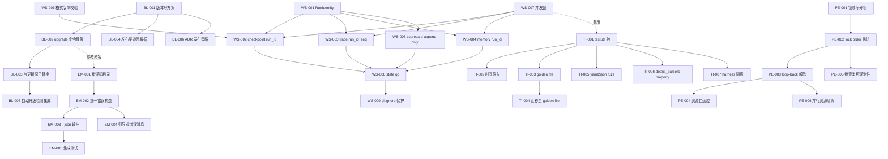
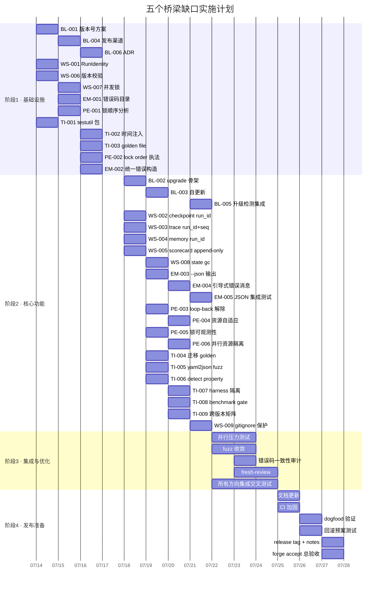

现在我已充分理解项目上下文。以下是完整的技术领航分析。

---

# Tech Lead 分析：五个桥梁型缺口 → 可执行计划

## 源文档

基于 2026-07-12 `forges-five-hidden-product-quality-gaps.md` 体系（迭代方向与用户摘要的差异化合成）——93+ 份已有分析间隙中的五个未展开方向。

---

## 1. 任务分解

### 方向① · 二进制生命周期（Binary Lifecycle）— 🔴 P0

| 任务 ID | 标题 | 涉及文件 | 前置依赖 | 工时 | 验收标准 |
|---------|------|---------|---------|------|---------|
| **BL-001** | 定义 forge 版本号方案与埋点 | `internal/version/version.go` (新) · `cmd/forge/main.go` | 无 | 3h | `forge version` 输出 semver + git commit + build time；`ldflags -X` 在 make/build 脚本中注入 |
| **BL-002** | 实现 `forge upgrade` 命令骨架 | `cmd/forge/upgrade.go` (新) · `cmd/forge/main.go` | BL-001 | 4h | `forge upgrade --check` 查询最新版本（hardcoded release URL 或本地文件）；`forge upgrade --apply` 下载并原子替换二进制 |
| **BL-003** | 实现自更新原子替换逻辑 | `internal/selfupgrade/selfupgrade.go` (新) | BL-002 | 4h | 下载后写入临时文件 → 校验 hash → `os.Rename` 原子替换 → fallback 保留旧二进制；跨架构支持（linux amd64/arm64） |
| **BL-004** | 发布渠道元数据定义 | `internal/version/release.go` (新) · `.agent/release.yml` (新) | BL-001 | 2h | `.agent/release.yml` 声明当前版本、channel（stable/beta）、更新检查 URL；`forge upgrade` 读取此文件 |
| **BL-005** | 自动升级检测集成到 `forge evolve` | `cmd/forge/evolve.go` · `internal/version/upgrade_check.go` (新) | BL-003 | 3h | `forge evolve` 每 N 轮检查一次新版，发现新版时打印醒目 WARNING 但不自动升级（fail-open 向后兼容） |
| **BL-006** | ADR: 二进制发布策略 | `docs/adr/adr-0008-binary-release-strategy.md` (新) | BL-001 | 3h | 记录 channel 策略、hash 签名、rollback 机制、升级窗口期策略；经 fresh-context reviewer 审 |

**小计：19h**

---

### 方向② · 工作区状态隔离（Workspace State Isolation）— 🔴 P0

| 任务 ID | 标题 | 涉及文件 | 前置依赖 | 工时 | 验收标准 |
|---------|------|---------|---------|------|---------|
| **WS-001** | 引入 RunIdentity（UUIDv7） | `internal/persist/runid.go` (新) · `internal/orchestrator/engine.go` | 无 | 3h | 每个 `forge run/evolve` 在 engine 初始化时生成 UUIDv7 run_id，注入到所有状态写入路径；run_id 在 trace/memory/checkpoint 中以字段存在 |
| **WS-002** | checkpoint 加 run_id 前缀写入 | `internal/persist/checkpoint.go` | WS-001 | 3h | checkpoint 保存为 `.forge/runs/<run_id>/checkpoint.json`，不是 `.forge/checkpoint.json`；旧路径兜底读取（向后兼容） |
| **WS-003** | trace 加 run_id 前缀写入 + seq 续号 | `internal/trace/trace.go` | WS-001 | 4h | trace 写入 `.forge/runs/<run_id>/trace.jsonl`；seq 改为从已有最大 seq 续号（`LOAD max(seq)+1`）；全局 `run_id` 加在每条 event 的 `run_id` 字段 |
| **WS-004** | memory 加 run_id 隔离 | `internal/memory/memory.go` | WS-001 | 3h | memory 写入 `.forge/runs/<run_id>/memory.jsonl`；读取时合并当前 run + 旧 runs 的 memory（按时间排序去重） |
| **WS-005** | scorecard 历史保留改为 append-only | `cmd/forge/scorecard_wind.go` | WS-001 | 4h | scorecard 从覆盖写改为 `.forge/scorecards.jsonl` append；`forge scorecard trend` 跨运行对比 |
| **WS-006** | checkpoint 格式版本严格校验 | `internal/persist/checkpoint.go` | 无 | 2h | `Load` 中读取 `_format` 字段，不匹配 `forgeos.checkpoint.v1` 则拒绝加载（fail-closed + 清晰错误消息） |
| **WS-007** | 并发锁：状态文件互斥写入 | `internal/persist/flock.go` (新) | 无 | 3h | 基于 `flock`（POSIX）/ `LockFileEx`（Windows）的文件级锁，防止两个进程同时 append trace/memory；锁超时 + 优雅降级 |
| **WS-008** | `forge state gc` 命令 | `cmd/forge/state.go` (新) | WS-002 ～ WS-005 | 4h | `forge state gc --keep-runs N` 保留最近 N 次 runs，删除旧 run 数据；`forge state gc --dry-run` 预览 |
| **WS-009** | `forge-init` 添加 `.forge/` gitignore 保护 | `harness/forge-init/` | 无 | 1h | forge-init 模板中 `.gitignore` 已排除 `.forge/runs/`；现有项目 `forge state gc` 有安全确认提示 |

**小计：27h**

---

### 方向③ · 错误信息质量（Error Message Quality）— 🟡 P1

| 任务 ID | 标题 | 涉及文件 | 前置依赖 | 工时 | 验收标准 |
|---------|------|---------|---------|------|---------|
| **EM-001** | 定义错误码目录与规范 | `docs/error-codes.md` (新) · `internal/forgeerr/codes.go` (新) | 无 | 3h | 错误码格式 `FORGE-XXX`，分错误类（config/io/runtime/gate/engine/build），每类有文档描述 |
| **EM-002** | 统一错误构造方式 | `internal/forgeerr/forgeerr.go` (新) | EM-001 | 4h | 消除三种混杂构造方式（`errors.New`、`fmt.Errorf`、自定义 error 类型）→ 统一走 `forgeerr.New(code, msg, ctx)`，附带可选的 wrap chain |
| **EM-003** | `--json` 输出到所有命令 | `cmd/forge/main.go` · `cmd/forge/` 各文件 | EM-002 | 6h | 所有错误/状态输出可通过 `--json` 输出结构化 JSON（`{"error":{"code":"FORGE-001","message":"...","detail":...}}`）；人类输出保持现状 |
| **EM-004** | 引导式错误消息改造 | `cmd/forge/run.go` · `cmd/forge/evolve.go` · `cmd/forge/detect.go` | EM-002 | 4h | 错误消息结尾加建议（"Try `forge workflow list`" / "Did you mean `forge run build`?"）；workflow 不存在时调用 `forge detect` 给出建议 |
| **EM-005** | 集成测试：JSON 输出能被 CI 正确消费 | `harness/test_errors.mjs` (新) | EM-003 | 3h | `forge run nosuchfile --json 2>&1 | jq .error.code` 输出 `FORGE-XXX`；acceptance 测试覆盖 JSON vs 人类双模式 |

**小计：20h**

---

### 方向④ · 并行执行就绪度（Parallel Execution Readiness）— 🟡 P1

| 任务 ID | 标题 | 涉及文件 | 前置依赖 | 工时 | 验收标准 |
|---------|------|---------|---------|------|---------|
| **PE-001** | 锁顺序分析与文档 | `docs/lock-ordering.md` (新) | 无 | 3h | 列出现有 8+ mutex 的所有获取点、按 addr 排序策略、验证无 ABBA 死锁；输出文档 + 回归测试 |
| **PE-002** | 实现 lock ordering 机器执法 | `internal/orchestrator/lockcheck.go` (新) · `internal/doctor/` | PE-001 | 5h | `-race` 运行时检测 + 启动时 `CheckLockOrdering()` 死锁检测守护（按全局锁顺序表验证）；test 注入故意乱序 → panic |
| **PE-003** | 解除 `RunParallel` 的 loop-back 禁用 | `internal/orchestrator/engine.go` · `internal/orchestrator/build.go` | PE-002 | 4h | loop-back 在并行模式中恢复：当 gate FAIL + `on_fail.loop_back` 声明时，并行 phase 组整体回退到 target phase 重跑；MaxLoopBack 依然生效 |
| **PE-004** | 资源自适应（parallelism autotune） | `internal/orchestrator/parallel.go` (新) | PE-003 | 5h | 根据 CPU 核数 / memory.jsonl 大小 / 项目文件数 动态调 parallelism 上限；`--parallelism N` 手动覆盖；默认从 1 开始并逐步收敛 |
| **PE-005** | 锁竞争可观测性（`forge doctor --locks`） | `internal/doctor/locks.go` (新) · `internal/doctor/status.go` | PE-002 | 4h | `forge doctor --locks` 输出当前 mutex 竞争统计（等待次数/时长/持有者 goroutine）；基于 `sync.Mutex` 的 `-race` 或 `pprof` 集成 |
| **PE-006** | 并行 phase 资源隔离（每个 phase 单独工作区） | `internal/orchestrator/engine.go` · `internal/asset/phase.go` | PE-003 | 5h | 并行 phase 各自操作自己的工作目录快照（符号链接或目录复制），避免并行 phase 互相覆盖输出；完成后合并到主工作区 |

**小计：26h**

---

### 方向⑤ · 测试基础设施（Test Infrastructure）— 🟡 P1

| 任务 ID | 标题 | 涉及文件 | 前置依赖 | 工时 | 验收标准 |
|---------|------|---------|---------|------|---------|
| **TI-001** | 创建 `internal/testutil` 共享测试包 | `internal/testutil/testutil.go` (新) · `internal/testutil/fixture.go` (新) · `internal/testutil/time.go` (新) | 无 | 4h | 提供：`testutil.TempDir`、`testutil.FixturePath`、`testutil.WriteFixture`、`testutil.WithFakeNow`；所有包可共用 |
| **TI-002** | 时间注入（Clock interface） | `internal/testutil/clock.go` (新) · 各包改为接受 `clock.Clock` 接口 | TI-001 | 5h | `Clock` 接口有 `Now() time.Time` / `Since() time.Duration`；生产用 `RealClock`，测试用 `FakeClock`；现有 time.Now 调用逐步替代 |
| **TI-003** | 创建 golden file 框架 | `internal/testutil/golden.go` (新) · `internal/testutil/golden_test.go` (新) | TI-001 | 4h | `testutil.Golden(t, "testname", actual)` 对比 `testdata/golden/testname.golden`；`-update` flag 自动更新 golden；diff 失败时输出彩色差异 |
| **TI-004** | 迁移现有测试至 golden file | 各现有 `_test.go` | TI-003 | 6h | yaml2json、checkpoint、trace 等输出复杂结构的测试改用 golden file；现有 inline 断言保留为低层单元测试 |
| **TI-005** | 添加 yaml2json fuzz test | `internal/yaml2json/fuzz_test.go` (新) | TI-001 | 4h | fuzz 生成随机合法 YAML，与 PyYAML `yaml.safe_load` 做差分对比；现有 fixture 也纳入 fuzz corpus |
| **TI-006** | 添加 detect_parsers property-based test | `cmd/forge/detect_parsers_test.go` (新) | TI-001 | 4h | 随机生成合法的 go.mod / package.json / pyproject.toml → `detectProjectType` 结果与输入一致（round-trip） |
| **TI-007** | harness 测试隔离（临时工作区） | `harness/test_helpers.mjs` (新) · 各 test_*.mjs | TI-001 | 4h | 所有 harness 测试在 `os.tmpdir()` 内执行，不触及真实 `.forge/`；用 `withTempDir()` 包装保证 cleanup |
| **TI-008** | CI 添加 benchmark gate | `.github/workflows/forge.yml` | 无 | 3h | `go test -bench . -benchtime=1x -run=^$` 对比基线；超阈值（+p50）→ WARNING + 不阻断（non-load-bearing） |
| **TI-009** | CI 跨版本矩阵 | `.github/workflows/forge.yml` | 无 | 2h | Go 1.25/1.26/1.27 矩阵 + Node 20/22 + Python 3.11/3.12；不阻塞 merge，只 report |

**小计：36h**

---

## 2. 执行顺序 — 任务依赖图



### 可并行执行的任务组

| 任务组 | 包含任务 | 说明 |
|--------|---------|------|
| **G1** (方向①全部) | BL-001 ～ BL-006 | 二进制生命周期独立，无对外依赖 |
| **G2a** (方向②地基) | WS-001 + WS-006 + WS-007 + WS-009 | 基础组件：run_id、版本校验、并发锁、gitignore |
| **G2b** (方向②迁移) | WS-002 ～ WS-005 | 依赖 G2a，可互相并行（四个存储各自迁移） |
| **G2c** (方向②收尾) | WS-008 | 依赖 G2b，最后添加 |
| **G3** (方向③全部) | EM-001 ～ EM-005 | 方向独立，无对外依赖 |
| **G4a** (方向④地基) | PE-001 + PE-002 | 必须先做锁分析，再执法 |
| **G4b** (方向④功能) | PE-003 ～ PE-006 | 依赖 G4a，可互相并行 |
| **G5** (方向⑤全部) | TI-001 ～ TI-009 | 方向独立，但 TI-002 依赖 TI-001 |

### 关键执行路径

```
T0: G1(G2a,G3) ...并行...
T1: G2c,G4a,G5 ...G2b 加入...
T2: G4b ...收尾...
T3: 集成回归 → forge accept 全绿
```

---

## 3. 技术风险

### 🔴 高风险

| 风险 | 涉及方向 | 具体问题 | 缓解策略 |
|------|---------|---------|---------|
| **自更新原子替换的跨平台问题** | ① | `os.Rename` 在 Windows 上不是原子的（当目标文件存在时）；sig 验证需要 embedded public key | 先 Linux-only（当前 forge-core 只跑 Linux），`runtime.GOOS` 守卫；Windows 支持标注 defer；key 用 `//go:embed` 嵌入 |
| **并发 flock 与 Docker/容器兼容性** | ② | `flock` 在部分容器文件系统（overlayfs）中不可靠；NFS 也不支持 | 提供 fallback：基于 `.forge/.lock` 文件的存在锁（atomic create via O_EXCL）；文档记录限制 |
| **`RunParallel` 解除 loop-back 的竞争条件** | ④ | 并行 phase 组中一个 phase FAIL 触发 loop-back 时，其他 phase 可能仍在运行；正确的 cancel + retry 逻辑复杂 | 先实现组级别 cancel context（`context.WithCancel`），等所有 running phase 完成再 loop-back；单测注入模拟慢 phase + 并行 fail |
| **时间注入改造的接口冲击** | ⑤ | 现有 18 包 + cmd/forge 大量 `time.Now` 调用需要改为 `clock.Clock` 接口 | 分两阶段：先创建 Clock 接口和 `testutil.NewFakeClock()`；逐步迁移，每次改一个包；使用 `clock := xclock.Default` 全局变量降级侵入性 |

### 🟡 中风险

| 风险 | 涉及方向 | 具体问题 | 缓解策略 |
|------|---------|---------|---------|
| **`forge state gc` 删错数据** | ② | 删除运行时目录可能误删正在被另一个 `forge` 进程使用的状态 | 先 `--dry-run`；lock-before-delete（获取每个 run 目录的写锁）；白名单保护（保留运行中的 run） |
| **错误码与现有错误的映射不完整** | ③ | 代码库散布 ~200+ 错误构造点，遗漏映射的部分仍在用旧格式 | 分批处理（先 coverage 80% → 90% → 99%）；遗留错误通过 `forgeerr.WrapLegacy(err)` 自动生成临时编码 |
| **`detect_parsers` property-based test 收敛慢** | ⑤ | TOML 规范宽泛，随机生成的有效 TOML 概率低 | 从现有 fixture 提取模板（模板化生成），不纯随机；限时 10s |
| **yaml2json fuzz 与 PyYAML 行为不一致引发误报** | ⑤ | PyYAML 对部分边缘语法有 Go 实现不支持的扩展（如 YAML 1.2 vs 1.1） | fuzz test 中记录差异为 TODO 列表（转译不视为失败）；只 flag 影响 ForgeOS 真实 workflow 的差异 |

### 🟢 低风险（值得注意）

| 风险 | 涉及方向 | 缓解策略 |
|------|---------|---------|
| `forge upgrade` 的 release URL 将来可能变化 | ① | URL 配在 `.agent/release.yml` 中，不是硬编码；`--override-url` flag |
| memory 跨 run 合并的排序算法复杂度 | ② | 一次只合并最近 3 个 run，不是全部历史；O(n log n) 对 JSONL 足够 |
| 错误码膨胀至不可管理 | ③ | 每个 sprint 末 review 错误码，合并重复类别；`forgeerr.List()` 输出当前所有编码 |
| 并行资源自适应过头（auto 降至 serial） | ④ | `--parallelism=N` 手动覆盖优先级高于 auto；auto 仅作为默认值 |

---

## 4. 资源评估

### 团队配置建议

| 角色 | 技能要求 | 人数 | 主要负责方向 |
|------|---------|------|------------|
| **Senior Go Engineer**（架构感知） | Go 并发、系统编程、安全 | 2 | 方向① (BL-001 ～ BL-006) + 方向② (WS-001 ～ WS-009) |
| **Go/CLI Engineer** | forge-core 代码熟悉度、错误处理设计 | 1 | 方向③ (EM-001 ～ EM-005) + 方向④ (PE-001 ～ PE-006) |
| **Test Infrastructure Engineer** | Go testing、fuzz、CI/CD、Node.js | 1 | 方向⑤ (TI-001 ～ TI-009) |
| **Tech Lead / Architect** | 跨方向协调、ADR 撰写、代码审查 | 1 | 跨方向协调、BL-006 ADR、PE-001 文档、EM-001 规范 |

**总计：5 人**（含 Tech Lead）

如果资源受限，最小可行团队为 **3 人**：
- P0 方向①+②: 1 senior Go engineer（19h + 27h = 46h 接续执行 ≈ 6 天）
- 方向③+④: 1 Go/CLI engineer（20h + 26h = 46h 接续执行 ≈ 6 天）
- 方向⑤: 1 test engineer（36h ≈ 4.5 天）
- Tech Lead 跨方向覆盖

### 关键里程碑

| 里程碑 | 时间节点 | 交付物 | 验收方式 |
|--------|---------|--------|---------|
| **M1: P0 地基完成** | 第 5 天 | WS-001 RunIdentity + WS-006 版本校验 + WS-007 并发锁 + BL-001 版本号方案 | 单测 + `forge accept` 不变 |
| **M2: P0 全部就绪** | 第 9 天 | 方向①全部(upgrade 就绪) + 方向②全部(state gc 可用) | 端到端测试：并行 run 无数据损坏 + `forge upgrade --check` 可用 |
| **M3: P1 核心功能** | 第 15 天 | EM-003 `--json` 输出 + PE-003 loop-back 解除 + TI-003 golden file | `--json` CI 集成测试 + 并行 run 执法的端到端 |
| **M4: 全方向集成回归** | 第 20 天 | 全部任务完成 + `forge accept` ACCEPTED | 全仓 `forge accept` + CI 全绿 |

### 阻塞点（Blockers）与对策

| Blocker | 影响方向 | 描述 | 对策 |
|---------|---------|------|------|
| `flock` 在 CI 容器中不可用 | ② | GitHub Actions Ubuntu 容器可能没有完整的 POSIX flock 支持 | 提供 O_EXCL fallback + CI 中显式测试两种路径 |
| Windows 交叉编译测试 | ① | `os.Rename` 原子性在 Windows 上不同 | Linux-only 起步，Windows 支持标注 `[planned]`，ADR 记录 + `runtime.GOOS` guard |
| yaml2json 的 fuzz 发现大量 PyYAML 差异 | ⑤ | 如果 fuzz 发现之前在 Sprint 27 修的 block scalar 以外的问题 | 分类处理：影响 schema 解析的 → P0 立即修；纯格式差异（缩进/格式偏好）→ 记录在 harness/ 中作为已知清单 |
| `RunParallel` loop-back 的逻辑复杂度过大 | ④ | 解除禁用后可能暴露并行 phase 之间的竞态 | 先串行化 loop-back（等正在跑的 phase 都退出了再回退），渐进引入真正的并行回退 |

---

## 5. 质量保证

### 单元测试覆盖要求

| 任务 | 最低 cov | 关键测试场景 |
|------|---------|-------------|
| BL-003 自更新 | 85% | 正常下载+替换、hash mismatch rollback、写权限不足、网络超时、`os.Rename` 竞争 |
| WS-001 RunIdentity | 90% | UUIDv7 唯一性、时间戳编码、字符串/JSON 格式、零值 panic |
| WS-006 版本校验 | 95% | 匹配 v1 加载成功、不匹配拒绝、无字段时拒绝、半写文件拒绝 |
| WS-007 flock | 90% | 同一文件锁定争用（timeout+wake）、跨进程锁检测、锁超时+降级 |
| EM-002 forgeerr | 95% | 错误码格式化、wrap chain、JSON 序列化、`errors.Is`/`errors.As` 兼容 |
| PE-002 lockcheck | 90% | 正确顺序 PASS、乱序 panic、死锁检测 timeout |
| TI-002 Clock | 90% | FakeClock 时间推进、Now() 精确性、多个观察者一致性 |
| TI-003 golden | 85% | 首次创建、`-update` 更新、diff 格式、平台无关的行尾处理 |

### 集成测试策略

| 测试套件 | 覆盖方向 | 方法 | 频率 |
|---------|---------|------|------|
| **并行数据完整性** | ② | 两个 `forge run build --executor dry` 同时跑，验证 trace/memory/checkpoint 无交错 | 每次 CI |
| **upgrade 端到端** | ① | 从 fake release server 下载·替换·验证版本号 | 每日 CI |
| **JSON 输出契约** | ③ | `forge run nosuch.yml --json 2>&1 | jq .error.code` 验证格式 | 每次 CI |
| **锁竞争负载** | ④ | 8 worker 并行 phase + `-race`，验证无 data race | 每次 CI |
| **fuzz 回归** | ⑤ | yaml2json fuzz + detect_parsers property-based（限定时间 30s） | 每周 CI（非阻塞） |
| **golden file 完整性** | ⑤ | `git diff --stat` 检查 golden 文件是否已更新 | 每次 CI（`-update` 不提交不允许 merge） |

### 代码审查要点

| 方向 | 审查重点 | Reviewer 技能要求 |
|------|---------|-----------------|
| ① | 自更新安全（hash 验证、降级路径、SIGINT 处理、磁盘空间检查） | 系统编程 + 安全 |
| ② | 并发安全（lock ordering、O_APPEND 竞争、flock 与容器兼容） | Go 并发专家 |
| ③ | 错误码设计（不泄露内部路径、用户可见性、i18n 预留） | 开发者体验（DX） |
| ④ | 并行 correctness（cancel propagation、goroutine leak、context tree） | 并发/并行专家 |
| ⑤ | 测试框架（不侵入生产代码、不增加 flaky、golden 可维护性） | 测试基础设施 |

**纪律**：每个方向的 reviewer 必须 fresh-context（不审自己参与实现的代码），由 Tech Lead 分配。

### 性能测试需求

| 测试场景 | 方向 | 指标 | 当前基线 | 目标 |
|---------|------|------|---------|------|
| 并行 2× `forge evolve dry` | ② | trace/memory 无数据损坏 + no seq collision | 84/91 collided → 0 | 0 collided |
| `forge doctor` 扫描 500 条 trace | ③ | 完成时间 | N/A（不存在） | < 1s |
| 并行 8-phase build 跑 3 次 loop-back | ④ | 总墙钟 | N/A（loop-back 刚启用） | < 2× 串行 |
| yaml2json fuzz 30s | ⑤ | 覆盖率增长 | 0 fuzz test | 增加 +15% line coverage |
| `forge state gc --keep-runs 50` | ② | 清理 1GB 状态用时 | N/A | < 5s |

---

## 6. 实施计划

### 阶段 1：基础设施搭建（第 1 ～ 4 天）

**目标**：打好所有方向的地基，让后续阶段可并行推进

| 天 | 方向 | 任务 | 产出 |
|----|------|------|------|
| 1 | ⑤ | TI-001 testutil 包 | `internal/testutil`（TempDir · FixturePath · Clock） |
| 1 | ② | WS-001 RunIdentity | `internal/persist/runid.go` |
| 1 | ② | WS-006 格式版本校验 | checkpoint Load 加 `_format` 校验 |
| 1 | ① | BL-001 版本号方案 | `internal/version/` + `ldflags` |
| 2 | ② | WS-007 并发锁 | `internal/persist/flock.go` + O_EXCL fallback |
| 2 | ① | BL-004 发布渠道元数据 | `.agent/release.yml` |
| 2 | ③ | EM-001 错误码目录 | `docs/error-codes.md` + `internal/forgeerr/codes.go` |
| 2 | ④ | PE-001 锁顺序分析 | `docs/lock-ordering.md` |
| 3 | ① | BL-006 ADR 发布策略 | `docs/adr/adr-0008-binary-release-strategy.md` |
| 3 | ⑤ | TI-003 golden file 框架 | `internal/testutil/golden.go` |
| 3 | ③ | EM-002 统一错误构造 | `internal/forgeerr/forgeerr.go` |
| 4 | ⑤ | TI-002 时间注入 | Clock 接口 + FakeClock test |
| 4 | ④ | PE-002 lock order 执法 | `internal/orchestrator/lockcheck.go` |

**阶段 1 完成检查**：`forge accept` ACCEPTED · `forge version` 输出版本号 · golden file 可创建/更新 · `docs/error-codes.md` 可读

### 阶段 2：核心功能实现（第 5 ～ 12 天）

**目标**：所有方向的核心功能可运行

| 天 | 方向 | 任务 | 产出 |
|----|------|------|------|
| 5 | ② | WS-002 checkpoint run_id | checkpoint 写入 `.forge/runs/<run_id>/` |
| 5 | ② | WS-003 trace run_id + seq 续号 | trace 隔离写入 + seq 续号 |
| 5 | ② | WS-004 memory run_id | memory 隔离写入 |
| 5 | ② | WS-005 scorecard append-only | scorecard 改为 JSONL |
| 6 | ① | BL-002 upgrade 命令骨架 | `forge upgrade --check` 可用 |
| 6 | ③ | EM-003 `--json` 输出 | 所有命令支持 `--json` |
| 6 | ⑤ | TI-005 yaml2json fuzz | fuzz + 差分对比 |
| 6 | ⑤ | TI-006 detect_parsers property | property-based test |
| 7 | ④ | PE-003 loop-back 解除 | 并行模式 loop-back 可用 |
| 7 | ⑤ | TI-004 迁移至 golden file | 3+ 核心包迁移完成 |
| 7 | ① | BL-003 自更新原子替换 | `forge upgrade --apply` 可用 |
| 8 | ② | WS-008 `forge state gc` | gc 命令可用 |
| 8 | ③ | EM-004 引导式错误消息 | 5+ 常见错误有建议 |
| 8 | ④ | PE-005 锁竞争可观测性 | `forge doctor --locks` |
| 9 | ④ | PE-004 资源自适应 | parallelism autotune |
| 9 | ④ | PE-006 并行资源隔离 | 并行 phase 的工作区隔离 |
| 9 | ② | WS-009 gitignore 保护 | forge-init + 现有项目迁移指南 |
| 10 | ⑤ | TI-007 harness 隔离 | harness 测试用 tempdir |
| 10 | ⑤ | TI-008 benchmark gate | CI benchmark 对比 |
| 10 | ⑤ | TI-009 跨版本矩阵 | CI 多版本矩阵 |
| 10 | ③ | EM-005 JSON 集成测试 | harness/test_errors.mjs |
| 11 | ① | BL-005 自动升级检测 | evolve 中检查新版 |
| 11 | — | 跨方向集成调试 | 所有任务一次性集成交叉测试 |
| 12 | — | 全方向回归 | `forge accept: ACCEPTED` |

### 阶段 3：集成测试与优化（第 13 ～ 16 天）

**目标**：验证稳定性、性能、边界条件

| 天 | 活动 | 具体工作 |
|----|------|---------|
| 13 | 并行压力测试 | 2× `forge evolve` 并行 30 分钟，验证数据完整性无损坏；`forge doctor --locks` 无异常 |
| 13 | upgrade 端到端 | 从本地 fake release server 完成完整 upgrade cycle（check → download → apply → verify） |
| 14 | fuzz 收敛 | yaml2json fuzz 运行 60 分钟，记录所有差异，分类处理 |
| 14 | 锁竞争负载测试 | 8 并行 phase + `-race` 10 分钟，零 data race |
| 15 | 错误码一致性审计 | 扫描全仓所有 `errors.New`/`fmt.Errorf`，确认已被 `forgeerr.New` 替换（遗留的加 WrapLegacy） |
| 15 | golden file 可维护性 | 确保 `-update` 在所有平台上工作；diff 输出人类可读 |
| 16 | fresh-context review | 每个方向由独立 reviewer 重新审核代码；Tech Lead 解决 reviewer 反馈 |

### 阶段 4：发布准备（第 17 ～ 20 天）

**目标**：文档、CI、发布

| 天 | 活动 | 具体工作 |
|----|------|---------|
| 17 | 文档 | 更新 `docs/ignition.md` 新增升级流程；更新 ROADMAP.md 标记当前方向完成状态 |
| 17 | CI 加固 | 所有新测试纳入 `forge accept`；验证 forge-init 后新项目 `forge accept` 仍 ACCEPTED |
| 18 | ADR 收尾 | 确认 BL-006 ADR 已审/已 merge；检查 DECISIONS.md 同步 |
| 18 | dogfood | 用新版 forge 跑一次端到端 build（url-shortener 完整 pipeline）验证无回归 |
| 19 | 回滚预案 | 测试 `forge upgrade --force-downgrade`；验证旧版 checkpoint 可被新版读取 |
| 19 | release tag | git tag v1.2.0（或对应版本号）；release notes 摘要 |
| 20 | 收尾验收 | **`forge accept` ACCEPTED · 全 CI 绿 · fresh-review 全 APPROVE** |

### 甘特图（Mermaid）



---

## 总结：对用户四个建议选项的 Tech Lead 回应

用户结尾给出四个推进方向。作为 Tech Lead，我的推荐优先级：

### 🥇 第一优先：**Quick Wins（方向③+⑤）同时启动**

理由：
- 方向⑤（`internal/testutil` + golden file + fuzz）和方向③（`--json` + 错误码）**无跨方向依赖**
- 在 Phase 1 的 4 天内可以完成地基，Phase 2 的 4-5 天内可以完成主体
- 方向⑤的 fuzz 可能在 yaml2json 中发现新的解析 bug——如果发现，优先级立即升为 P0
- 方向③的 `--json` 输出是对 CI 集成影响最大的单个改动

### 🥈 第二优先：**方向②（工作区状态隔离）紧随其后**

RunIdentity + 并发锁 + 版本校验是 P0 安全债务。方向②的 WS-001/WS-006/WS-007 与 Quick Wins 并行互不干扰。方向②的 WS-002～WS-005（迁移）依赖 WS-001，可以在第 5 天开始。

### 🥉 第三优先：**方向①（二进制生命周期）与方向④（并行执行就绪度）放在 Phase 2**

原因：
- 方向①的 BL-003 自更新逻辑需要精心测试（hash 验证、原子替换、回滚），赶工风险高
- 方向④的 PE-003 解除 loop-back 禁用依赖 PE-002 lock order 执法和充分的并行测试
- 两个方向都有跨平台/竞态风险，需要更多的设计前置（BL-006 ADR、PE-001 文档）

### 📋 ADR 先行策略

**同意**：BL-006（二进制发布策略 ADR）应该在阶段 1 初就完成，因为它决定了 BL-002～BL-005 的设计方向。

对于方向②和④，建议 **先不写正式 ADR**——RunIdentity 的设计已经足够清晰（UUIDv7 + 目录前缀），锁顺序策略可以在 `docs/lock-ordering.md` 中记录为轻量设计笔记，而非完整 ADR。ADR 的 overhead 应该留给真正有分歧或需人类审批的决策。

### 🔍 差异化断言验证

**建议做**：在全仓做一次关键词交叉检索，确认五个方向的独立命题在现有 93+ 份文档中确实未被覆盖。这应该是一个 2 小时的自动化任务（grep + jq + 报告），可以在方向③的 `--json` 输出验证中顺便完成。
