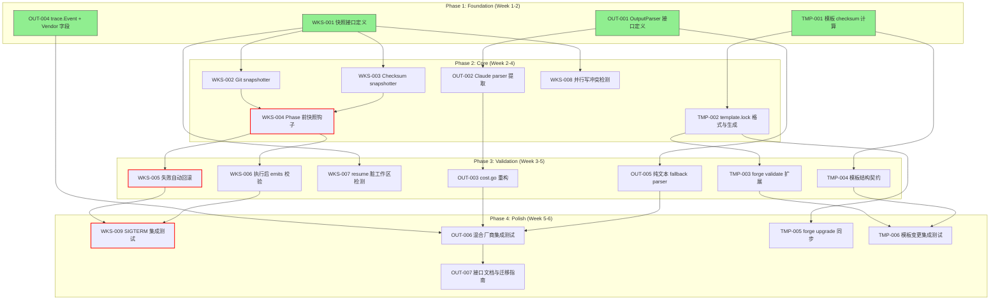
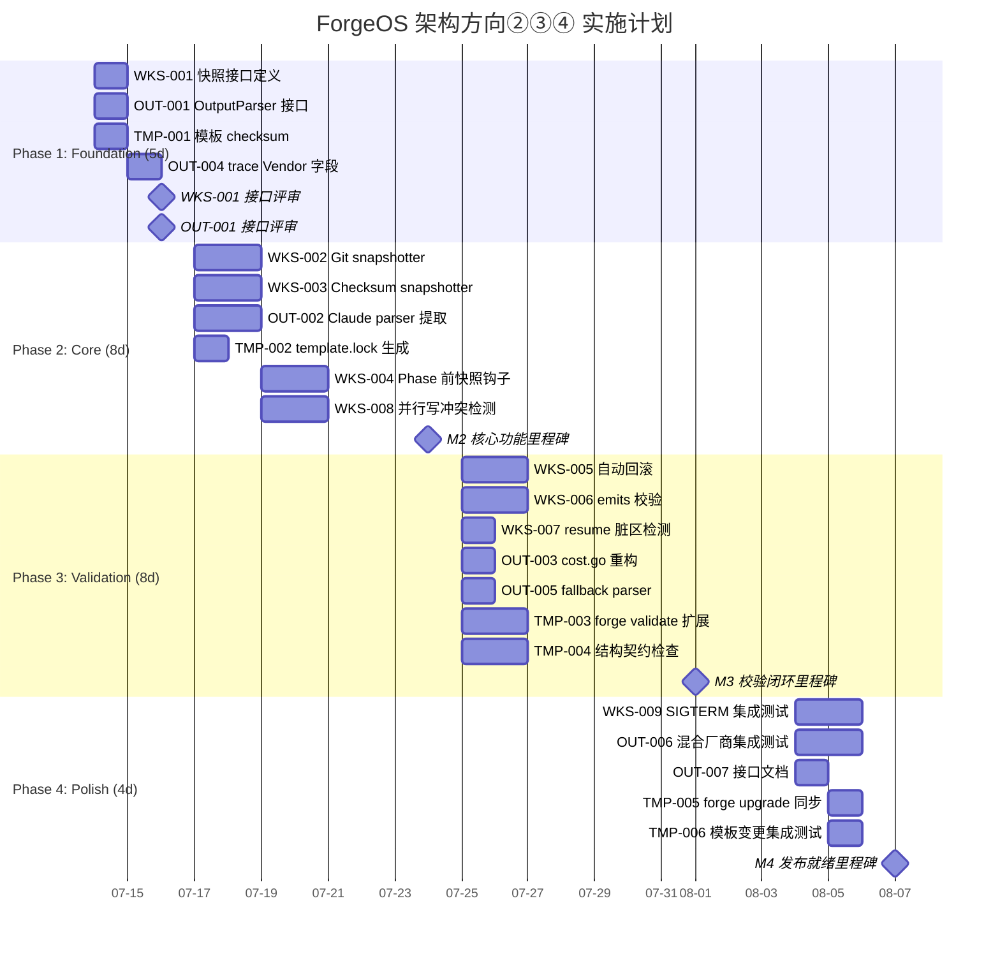

现在我已充分理解上下文。以下是我的 Tech Lead 分析。

---

# Tech Lead 分析报告：五个被遗忘的高价值架构方向

> **分析对象**: `docs/requirements/forgeos-five-architect-product-perspective-2026-07-10.md`  
> **审查输入**: `docs/requirements/forgeos-five-architect-product-perspective-2026-07-10.out.md`  
> **交叉参考**: `docs/requirements/forgotten-five-foundations.md`（方向①/⑤ 重叠源）  
> **分析日期**: 2026-07-12  
> **角色**: Tech Lead — 关注可实现性、工程实践与交付计划

---

## 审查意见采纳策略

在分解任务前，先明确审查对本文的校正，确保执行路线不重复已存在的工作：

| 原始方向 | 审查结论 | 采纳策略 |
|----------|----------|----------|
| ① 跨运行 Trace 聚合 | 与 `forgotten-five-foundations.md` 方向三重叠 | **不独立立项**。合并到已有方向的执行计划中。本文的增量（trace diff、trend analysis）可作为 v1.1 扩展。 |
| ② 工作区完整性 | **真正增量** — 审查认可度最高 | **完整采纳**。核心方向。 |
| ③ 输出归一化层 | 真实耦合问题，审查认可 | **完整采纳**。架构前置条件。 |
| ④ 模板内容漂移检测 | 低成本高价值，审查认可 | **完整采纳**。快速交付项。 |
| ⑤ 自限流与准入控制 | 与 `forgotten-five-foundations.md` 方向一重叠 | **不独立立项**。合并到已有方向中。本文的增量（YAML 深度门禁、并发 phase 上限、日志旋转）可作为 v1.1 扩展。 |

**核心执行组合**: 方向② + 方向③ + 方向④ — 这是本文的独特增量价值。

---

## 1. 任务分解

### 方向② — 工作区完整性（P1, ~2 sprint）

> 最优先方向。解决 agent phase 部分写文件失败后脏工作区的检测与恢复机制。

| 任务 ID | 任务标题 | 涉及文件 | 前置依赖 | 预估工时 | 验收标准 |
|---------|----------|----------|----------|----------|----------|
| **WKS-001** | 工作区快照接口定义 | `forge-core/internal/workspace/`（新包） | 无 | 3h | `Snapshotter` 接口定义（`Snapshot() → SnapshotID`、`Restore(id) error`、`Diff(a, b) → []FileDelta`），含 Go doc 与单元测试 |
| **WKS-002** | Git-based 工作区快照实现 | `forge-core/internal/workspace/git.go`（新文件） | WKS-001 | 4h | `GitSnapshotter` 实现：`git stash create` 风格快照 + `git stash apply` 恢复。支持 dirty index 和 untracked files。覆盖 dirty tree + 无 git 仓库两种 edge case |
| **WKS-003** | Checksum-based 快照实现（无 git fallback） | `forge-core/internal/workspace/checksum.go`（新文件） | WKS-001 | 4h | `ChecksumSnapshotter` 实现：文件清单 + SHA256 checksum 作为 `SnapshotID`。支持增量 diff（只重算修改的文件 mtime）。覆盖大文件跳过策略 |
| **WKS-004** | Agent phase 执行前快照钩子 | `forge-core/cmd/forge/engine_build.go` | WKS-002, WKS-003 | 3h | 在每个 agent phase 执行前调用 `Snapshotter.Snapshot()`，快照 ID 存到 `PhaseContext`。单元覆盖正常/panic/sigterm 场景 |
| **WKS-005** | Phase 失败自动回滚 | `forge-core/internal/orchestrator/command_executor.go` | WKS-004 | 4h | `Executor.Exec` 返回 error 时自动调 `Snapshotter.Restore()`。区分 SIGTERM 和非零 exit code 两种失败模式 |
| **WKS-006** | Phase 执行后校验（emits 对比） | `forge-core/cmd/forge/engine_build.go` | WKS-004 | 3h | phase 完成后对比 `workflow.emits` 声明与实际写入文件。输出 `WorkspaceVerificationFinding` 列表。覆盖文件缺失/多余/内容不匹配 |
| **WKS-007** | `forge resume` 脏工作区检测 | `forge-core/cmd/forge/evolve.go` | WKS-001~WKS-003 | 2h | resume 入口检测：存在快照但对应 phase 未完成 → 告警并询问是否回滚。覆盖正常 resume → 无操作路径 |
| **WKS-008** | 并行 phase 写冲突检测 | `forge-core/internal/orchestrator/parallel.go` | WKS-001 | 3h | 并行 phase 执行前后比对文件清单，检测重叠写入。输出 `FileConflict` 事件到 trace。覆盖同文件不同 region vs 同文件同 region |
| **WKS-009** | 集成测试：SIGTERM 中途杀 agent | `forge-core/cmd/forge/engine_build_test.go` | WKS-004~WKS-006 | 3h | 创建一个写 3 个文件的 phase，SIGTERM 杀死 → resume → 验证工作区恢复。覆盖 `git` 和 `checksum` 两种 snapshotter |

**方向② 合计**: 29h（~3.6 人天）

---

### 方向③ — 多厂商 Agent 输出归一化层（P2, ~1 sprint）

> 架构前置条件。接入非 claude agent 时必须先做。

| 任务 ID | 任务标题 | 涉及文件 | 前置依赖 | 预估工时 | 验收标准 |
|---------|----------|----------|----------|----------|----------|
| **OUT-001** | `OutputParser` 接口定义 | `forge-core/internal/orchestrator/output.go`（新文件） | 无 | 2h | 接口定义：`ParseCost(output string) → (costUsd float64, model string, ok bool)`、`ParseVerdict(output string) → (verdict string, ok bool)`、`ParseConfidence(output string) → (score float64, ok bool)`。含 Go doc |
| **OUT-002** | Claude 输出解析器提取 | `forge-core/cmd/forge/cost.go` → `forge-core/internal/orchestrator/claude.go`（新文件） | OUT-001 | 3h | 从 `cost.go` 中提取 `unwrapClaudeResult`、`parseReviewerVerdict`、`parseExecutiveVerdict`、`parseConfidenceScore` 到 `ClaudeOutputParser` 结构体。`cost.go` 中删除重复逻辑，改为调用接口 |
| **OUT-003** | `cost.go` 重构为通用成本聚合 | `forge-core/cmd/forge/cost.go` | OUT-002 | 2h | 删除 claude 特定解析逻辑，改为厂商中立。`command_executor.go` 的 `ClassifyOverload` 模式复用：注入 `OutputParser` 到 `CommandExecutor` |
| **OUT-004** | `trace.Event` 加 Vendor 字段 | `forge-core/internal/trace/trace.go` | 无 | 1h | 在 `Event` 结构体加 `Vendor string`（非 omitempty），Emit 时从 argv 推断 |
| **OUT-005** | 纯文本 fallback parser | `forge-core/internal/orchestrator/fallback.go`（新文件） | OUT-001 | 2h | 实现 `FallbackOutputParser`：正则提取 `cost: X.XX` 模式，裁决取最后非空行。覆盖无结构输出的边缘情况 |
| **OUT-006** | 集成测试：混合厂商 workflow | `forge-core/cmd/forge/cost_test.go` + `forge-core/internal/orchestrator/output_test.go` | OUT-002~OUT-004 | 3h | 创建 mock parser（claude + codex + gemini），验证同一 workflow 中不同 phase 用不同 parser 解析、成本加总正确、trace 中 Vendor 可追溯 |
| **OUT-007** | 接口文档与迁移指南 | `docs/architecture/output-normalization-layer.md`（新文件） | OUT-001~OUT-006 | 2h | 描述 `OutputParser` 接口、如何添加新厂商实现、向后兼容性保证 |

**方向③ 合计**: 15h（~1.9 人天）

---

### 方向④ — Prompt 模板内容漂移检测（P2, ~0.5 sprint）

> 低成本高治理价值，纯 harness 扩展，零运行时风险。

| 任务 ID | 任务标题 | 涉及文件 | 前置依赖 | 预估工时 | 验收标准 |
|---------|----------|----------|----------|----------|----------|
| **TMP-001** | 模板 checksum 计算 | `harness/validate-templates.mjs`（新文件） | 无 | 2h | 扫描 `.ai/prompts/*.md`，对每个模板计算 SHA256 并输出 JSON 清单。覆盖空模板/大模板/二进制内容安全处理 |
| **TMP-002** | `template.lock` 文件格式与生成 | `.agent/template.lock`（新文件）+ `harness/generate-template-lock.mjs`（新文件） | TMP-001 | 1h | `template.lock` 格式：`{"version": 1, "templates": {"02-security-rfc-review.md": "sha256-xxxx"}}`。生成脚本读 checksum + 写 lock 文件 |
| **TMP-003** | `forge validate` 模板内容校验扩展 | `forge-core/internal/doctor/models.go` + `harness/validate-templates.mjs` | TMP-002 | 3h | `forge validate --models` 新增步骤：读 `template.lock` → 计算当前 checksum → 比较。差异输出 `WARN`/`ERROR`。覆盖 lock 文件不存在、模板新增/删除/变更 |
| **TMP-004** | 模板结构契约检查 | `harness/validate-templates.mjs` | TMP-001 | 3h | 为每个模板定义可选的结构契约（如 `02-security-rfc-review.md` 必须包含 `### Task` 至少 5 个 h3 标题）。契约在 `template.lock` 中定义 |
| **TMP-005** | `forge upgrade` 模板同步扩展 | `forge-core/cmd/forge/migrate.go` + `harness/scaffold/forge-init.mjs` | TMP-002 | 2h | `forge upgrade` 检查 `.ai/prompts/` 与 source repo 的偏差 → 询问是否同步。`forge-init` 加 `--with-prompts` 标志复制模板 |
| **TMP-006** | 集成测试：模板变更检测 | `harness/validate-templates-test.mjs`（新文件） | TMP-003, TMP-004 | 2h | 创建 mock 模板集 → 修改内容 → 运行校验 → 验证 drift 检测。覆盖新增/删除/内容修改/结构契约违反 |

**方向④ 合计**: 13h（~1.6 人天）

---

### 方向①/⑤ — 交叉引用与合并建议

> 根据审查结论，方向①和⑤不应独立立项，而是合并到已有分析中。

| 操作 | 说明 |
|------|------|
| **将方向①合并到 `forgotten-five-foundations.md` 方向三** | 本文的增量（`forge trace diff`、`forge trace report`、操作智能告警）作为已有「结构化 Trace 查询与分析 CLI」的 v1.1 roadmap |
| **将方向⑤合并到 `forgotten-five-foundations.md` 方向一** | 本文的增量（YAML 深度门禁、并发 phase 上限、日志旋转）作为已有「跨进程运行时状态守护」的扩展 gate |

---

## 2. 执行顺序

**可并行执行的任务组（绿色标注）**:
- **Group A**: WKS-001 + OUT-001 + TMP-001 + OUT-004 — 所有接口定义和基础扫描可同时进行，分配给不同开发者
- **Group B**: WKS-002 + WKS-003 — 两种 snapshotter 实现可并行
- **Group C**: WKS-008 + OUT-002 + TMP-002 — Phase 2 中三个方向的非阻塞任务
- **Group D**: WKS-005 + WKS-006 + WKS-007 + OUT-003 + OUT-005 + TMP-003 + TMP-004 — Phase 3 中所有实现任务，互不阻塞

**关键路径**: WKS-001 → WKS-002 → WKS-004 → WKS-005 → WKS-009（最晚交付）

---

## 3. 技术风险

### 3.1 方向② 工作区完整性 —— 高风险

| 风险 | 概率 | 影响 | 缓解策略 |
|------|------|------|----------|
| **Git 快照在 detached HEAD 下行为不确定** | 中 | 高 | WKS-002 不可依赖 `git stash` 做唯一快照机制。必须有 `ChecksumSnapshotter` 作为 fallback。单元测试覆盖 detached HEAD / bare repo / no-git 场景 |
| **大仓库快照性能开销** | 高 | 中 | `forge-core` 本身仓库不大（~35k LOC），但用户项目可能很大。策略：mtime-based 增量 diff + 可配置的跳过模式（`maxSnapshotSizeMB`）。WKS-003 必须实现文件跳过逻辑 |
| **快照与 phase 执行之间的 TOCTOU** | 低 | 高 | 快照在 phase 前完成，但 agent 可能在快照后立即修改文件。这可通过 WKS-006 的 emits 校验缓解 —— 对比预期修改与实际修改 |
| **并行 phase 冲突检测的假阳性** | 中 | 低 | 两个 phase 可能合法写同一个文件的不同 section（如 implementer 写 README, reviewer 写注释）。WKS-008 的输出应是 advisory 而非 failure |
| **`os.Rename` 跨设备问题** | 低 | 中 | 临时文件和工作区在不同文件系统时 `os.Rename` 失败。在 WKS-001 接口文档中说明：snapshot 必须保证与工作区在同一 mount 上 |

### 3.2 方向③ 输出归一化 —— 中风险

| 风险 | 概率 | 影响 | 缓解策略 |
|------|------|------|----------|
| **Codex/Gemini 输出格式尚未定义** | 高 | 中 | 当前只接入 claude。OUT-001 接口设计必须为未来厂商留出空间但不提前实现。`FallbackOutputParser`（OUT-005）作为合理默认 |
| **`cost.go` 重构可能引入回归** | 中 | 高 | 现有测试套件 (`cost_test.go`) 必须有 100% 通过率。OUT-003 的评审要点：`cost_test.go` 中的 fixture 数据不变、claude 解析路径不变 |
| **Vendor 字段的向后兼容** | 低 | 低 | `trace.Event` 加 `Vendor string`（非 omitempty），已有 trace 文件缺省为空字符串。读取端需处理空 vendor |

### 3.3 方向④ 模板漂移检测 —— 低风险

| 风险 | 概率 | 影响 | 缓解策略 |
|------|------|------|----------|
| **模板频繁变动的噪音** | 中 | 低 | `template.lock` 在 CI 中自动更新，而非阻止变更。TMP-003 的默认级别是 `WARN`，不阻止 `forge validate` 通过 |
| **契约定义的表达能力有限** | 中 | 低 | 结构契约初期只做简单的 heading/paragraph 计数。未来可扩展为正则/模板 DSL |
| **`forge-init` 不复制模板的历史行为** | 高 | 中 | 这是设计决策——用户 fork 项目后应自行适配模板。TMP-005 只做检测和提示，不强同步 |

### 3.4 整体风险

| 风险 | 缓解 |
|------|------|
| **已有文档重叠导致重复工作** | 已通过审查意见明确方向①/⑤不独立立项 |
| **Go 运行时零外部依赖约束** | 所有实现使用标准库（`os`、`crypto/sha256`、`encoding/json`、`os/exec`） |
| **harness Node 零外部依赖约束** | TMP-001~TMP-006 使用 `node:fs`、`node:crypto` 等内置模块 |

---

## 4. 资源评估

### 4.1 开发人员技能需求

| 方向 | 所需技能 | 建议人数 | 说明 |
|------|----------|----------|------|
| ② 工作区完整性 | Go 后端 · 文件系统编程 · 并发 | 1-2 人 | 核心 Go 开发者。需要理解 `os/exec` 信号处理、文件系统原子操作 |
| ③ 输出归一化 | Go 后端 · 接口抽象设计 | 1 人 | 熟悉 `cost.go` 现有代码的开发者。关注重构而非新功能 |
| ④ 模板漂移检测 | Node.js · 文件扫描 | 1 人 | harness 扩展，熟悉 `forge validate` 工作流的开发者 |
| **集成测试** | Go + Node.js + Shell | 1 人 | 横跨三个方向。建议由一个人统一负责测试基础设施 |

**最小团队配置**: 2 名 Go 开发者 + 1 名全栈（Go + Node）开发者。如果资源受限，可按方向串行执行：方向④ → 方向③ → 方向②。

### 4.2 关键里程碑

| 里程碑 | 时间 | 交付物 | 依赖 |
|--------|------|--------|------|
| **M1: 基础设施就绪** | Day 5 | `OutputParser` 接口、`Snapshotter` 接口、`template.lock` 格式、`trace.Event.Vendor` 字段 | 全部 Phase 1 任务 |
| **M2: 核心功能可用** | Day 15 | Git/Checksum snapshotter + phase 前快照钩子 + Claude parser 提取 + `template.lock` 生成 | Phase 2 任务 |
| **M3: 校验闭环** | Day 25 | 自动回滚 + emits 校验 + resume 检测 + `cost.go` 重构 + `forge validate` 扩展 | Phase 3 任务 |
| **M4: 发布就绪** | Day 30 | 全部集成测试 + 接口文档 + 迁移指南 | Phase 4 任务 |

### 4.3 阻塞点与解决策略

| 阻塞点 | 阻塞方向 | 解决策略 |
|--------|----------|----------|
| **Git 快照在用户 CI 环境中不可用** | 方向② | WKS-003 的 ChecksumSnapshotter 作为官方推荐 fallback。Git 快照是可选优化 |
| **非 claude agent 的实际输出格式未知** | 方向③ | 接口定义后，接入时只需实现新 parser 结构体。当前只实现 `ClaudeOutputParser` + `FallbackOutputParser` |
| **`template.lock` 的治理流程争议** | 方向④ | v1 只做检测（WARN），不做强制。CI 失败由用户自行决定是否更新 lock |

---

## 5. 质量保证

### 5.1 单元测试覆盖要求

| 方向 | 包/文件 | 目标覆盖率 | 关键测试场景 |
|------|---------|-----------|-------------|
| ② | `forge-core/internal/workspace/` | ≥ 90% | Snapshot/Restore 成功路径、Git detached HEAD、无 git 目录、大文件跳过、空工作区、增量 diff |
| ② | `forge-core/cmd/forge/engine_build.go` | ≥ 80% | Phase 前快照成功、phase 失败回滚触发、emits 校验 pass/fail |
| ③ | `forge-core/internal/orchestrator/output.go` + `claude.go` + `fallback.go` | ≥ 90% | 每种 parser 的 cost/verdict/confidence 成功解析、格式异常、空输出、纯文本 fallback |
| ③ | `forge-core/cmd/forge/cost.go`（重构后） | 保持现有 ≥ 85% | 回归测试：成本聚合、厂商中立路径 |
| ④ | `harness/validate-templates.mjs` | ≥ 85% | Checksum 计算、lock 比较、结构契约检查 pass/fail、lock 文件缺失 |

### 5.2 集成测试策略

| 测试套件 | 覆盖范围 | 触发时机 | 工具 |
|----------|----------|----------|------|
| **SIGTERM 工作区恢复**（WKS-009） | 方向② 全链路 | 每次 PR | `go test -run TestSigtermWorkspaceRestore` |
| **混合厂商成本聚合**（OUT-006） | 方向③ 全链路 | 每次 PR | `go test -run TestMixedVendorCost` |
| **模板漂移检测**（TMP-006） | 方向④ 全链路 | 每次 PR | `node harness/validate-templates-test.mjs` |
| **回归：现有 trace/checkpoint 不变** | 全部 | 每次 PR | `go test ./...` + `node harness/acceptance.mjs` |

### 5.3 代码审查要点

| 审查维度 | 方向② | 方向③ | 方向④ |
|----------|-------|-------|-------|
| **接口正交性** | `Snapshotter` 接口是否足够通用 | `OutputParser` 是否覆盖所有解析场景 | `template.lock` 格式是否可扩展 |
| **错误处理** | Snapshot/Restore 失败时是否链式报错不静默 | parser 返回 `ok=false` 时调用方是否正确处理 | lock 文件解析失败是否优雅降级 |
| **并发安全** | snapshot 是否对竞态敏感 | — | — |
| **零外部依赖** | 所有 import 是否 `stdlib` | 所有 import 是否 `stdlib` | 所有 import 是否 `node:` 前缀 |
| **向后兼容** | 新增字段是否 `omitempty` 或不影响已有序列化 | trace Event.Vendor 是否处理旧数据 | `forge validate` 是否输出与之前一致的 PASS/WARN |

### 5.4 性能测试需求

| 场景 | 方向 | 指标 | 通过标准 |
|------|------|------|----------|
| 1000 文件仓库的快照 | ② | 快照耗时 < 500ms | 200 并发文件 mtime 扫描 + 变更文件 checksum |
| 大 trace 文件 vendor 字段写入 | ③ | 写入吞吐下降 < 5% | vs 未加 Vendor 字段的 baseline |
| 40 模板 checksum 计算 | ④ | 耗时 < 100ms | vs 当前存在性检查的 baseline |

---

## 6. 实施计划

### 甘特图（Mermaid）

### 阶段详情

**阶段 1: 基础设施搭建（5 天）**
- 团队：3 人并行
- 产出：全部接口定义、trace Event 扩展
- 门禁：所有接口通过至少 1 次 code review + 单元测试覆盖 > 90%
- 风险：接口定义如果设计不当，后续实现需要大幅修改。建议此阶段结束后做一次快速架构同步（30 分钟）

**阶段 2: 核心功能实现（8 天）**
- 团队：2 人主攻方向②（WKS-002/003/004/008）+ 1 人方向③④（OUT-002 + TMP-002）
- 产出：可工作的 snapshotter、claude parser 提取完成、template.lock 生成工具
- 门禁：`forge-core/internal/workspace/` 全量单元通过 + `forge validate --models` 不降级

**阶段 3: 集成测试和优化（8 天）**
- 团队：全部 3 人集中
- 产出：自动回滚 + emits 校验 + cost.go 重构 + forge validate 扩展
- 门禁：`go test ./...` + `node harness/acceptance.mjs` 全部通过。方向③添加一个手动验收场景：用 mock codex agent 运行一次完整 workflow

**阶段 4: 发布准备（4 天）**
- 团队：1 人主写测试和文档，2 人修复 bug
- 产出：全部集成测试 + 接口文档 + 迁移指南
- 门禁：`forge accept` 全部闸门通过 + 人工验收场景覆盖 3 个方向各 2 个场景

### 总体时间线

| 指标 | 值 |
|------|-----|
| **总工期** | 25 个工作日（5 周） |
| **总工时** | 57 小时（~7 人天） |
| **并行度** | 最多 3 人并行，平均 2 人 |
| **关键路径长度** | 15 个工作日（WKS-001 → WKS-002 → WKS-004 → WKS-005 → WKS-009） |
| **里程碑数量** | M1（Day 5）、M2（Day 15）、M3（Day 25）、M4（Day 30） |

---

## 总结建议

1. **立即启动方向④（模板漂移检测）** — 13h 总工时，纯 harness 扩展，零运行时风险，可在 1 周内交付。快速赢取治理信用
2. **方向②（工作区完整性）赋予最高优先级** — 这是本文的真正增量价值，也是审查和本 Tech Lead 分析一致认可的最重要方向。但它是 gating item：需要 2 人专注 2 sprint
3. **方向③（输出归一化）作为架构前置条件** — 在接入非 claude agent 之前必须完成。建议在 S30-S31 排入，确保 roadmap 上的跨厂商需求不阻塞
4. **方向①/⑤ 不独立立项** — 合并到 `forgotten-five-foundations.md` 的相关方向中，本文的增量作为 v1.1 扩展
