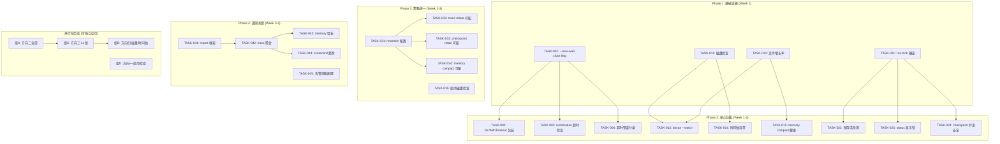
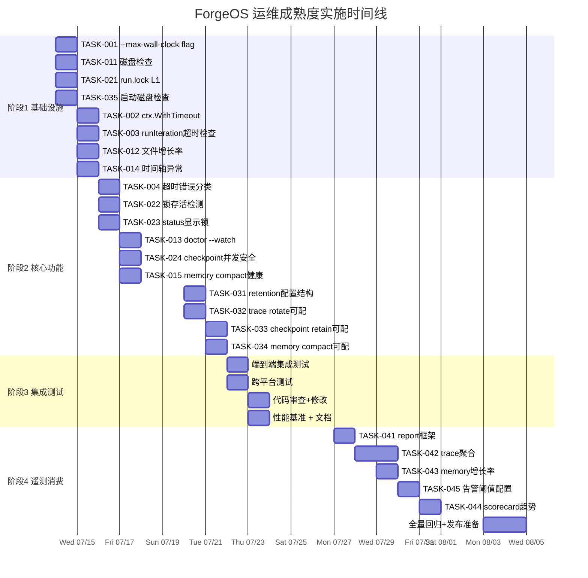

现在我有了足够的代码库理解来撰写全面的 Tech Lead 分析。以下是完整的分析：

---

# Tech Lead 分析：ForgeOS 五个运维成熟度方向

## 1. 任务分解

### 方向二 · 全局 Wall-Clock 超时（P1 — 最高优先级）

| 任务 ID | 标题 | 涉及文件 | 前置依赖 | 工时 | 验收标准 |
|---|---|---|---|---|---|
| **TASK-001** | `runOpts` 增加 `--max-wall-clock` flag | `cmd/forge/main.go:166-228` (`bindRunOpts`) | 无 | 2h | flag 注册 + 解析；`--help` 可见；零默认值（0=无限制）向后兼容 |
| **TASK-002** | `cmdEvolve` 入口包装 `context.WithTimeout` | `cmd/forge/evolve.go:39-80` (`cmdEvolve`) | TASK-001 | 2h | `maxWallClock>0` 时 `runCtx` 被 `context.WithTimeout` 包装；`run.go` 的 `runCtx` 同样处理 |
| **TASK-003** | `runIteration` 和 `RunFrom` 入口检查 `ctx.Err()` | `internal/orchestrator/loop.go:160-170` (`runIteration`), `orchestrator.go:200-220` | TASK-002 | 2h | 超时后 `ctx.Err()` 返回 `DeadlineExceeded` → 返回 `LoopOutcome{Reason:"max-wall-clock"}`；复写测试 |
| **TASK-004** | 超时错误分类 + 测试 | `internal/orchestrator/exec_error.go` (加 `KindMaxWallClock`) | TASK-003 | 2h | 超时事件的 trace 记录（`trace.ErrorEvent`）；`forge status` 显示超时原因 |

**总预估**: 8h（~1 人·日）

### 方向四 · `forge doctor --watch` + 磁盘检查（P1 — 并发 P1）

| 任务 ID | 标题 | 涉及文件 | 前置依赖 | 工时 | 验收标准 |
|---|---|---|---|---|---|
| **TASK-011** | `doctor.QuickChecks` 增加`statfs`磁盘检查 | `internal/doctor/quick.go` | 无 | 2h | `.forge/` 所在分区可用空间 < 500MB → `Status:"FAIL"`；`du` 获取 `.forge/` 大小 |
| **TASK-012** | `forge doctor` 增加文件增长率 WARN | `internal/doctor/doctor.go` (`Run` 加新 check) | 无 | 2h | 记录 `.forge/` 各文件大小到统计文件；超月增长 50% → `WARN` |
| **TASK-013** | `cmdDoctor` 增加 `--watch N` 模式 | `cmd/forge/validate.go:443` (`cmdDoctor`) | TASK-011, TASK-012 | 4h | `forge doctor --watch 60` 每 60s 跑一次全检 + JSON 输出；`time.Ticker` 实现；SIGINT 清理退出 |
| **TASK-014** | 时间轴异常检查 | `internal/doctor/doctor.go` | 无 | 2h | 对比 checkpoint/memory/trace 的 `mtime`，不一致 → `WARN` |
| **TASK-015** | memory compact 健康计数 | `internal/memory/memory.go` (加 `CompactStats` 字段) | 无 | 2h | `memory.Compact` 成功/失败计数纳入 doctor 报告 |

**总预估**: 12h（~1.5 人·日）

### 方向三 · 并发进程锁（P2）

| 任务 ID | 标题 | 涉及文件 | 前置依赖 | 工时 | 验收标准 |
|---|---|---|---|---|---|
| **TASK-021** | L1: `.forge/run.lock` + `flock` 快速检测 | `internal/doctor/lock.go` (新文件)，`cmd/forge/evolve.go` 入口 | 无 | 4h | `forge run`/`evolve` 启动时创建锁文件；已锁时 stderr 提示 PID 并 exit 1；`--force` 覆盖旧锁 |
| **TASK-022** | L2: `forge doctor` 增加锁存活检测 | `internal/doctor/doctor.go` | TASK-021 | 2h | PID 不存活或锁超 24h → `WARN`；`forge doctor --fix` 清理孤儿锁 |
| **TASK-023** | `forge status` 显示活跃锁状态 | `cmd/forge/validate.go` (`cmdStatus`) | TASK-021 | 2h | 有活跃锁时 `forge status` 显示 "⚠ active run.lock (PID N, started ...)" |
| **TASK-024** | checkpoint 并发安全加固 | `internal/persist/checkpoint.go:109` (`Save`) | 无 | 2h | Save 前读锁文件校验；两进程写 checkpoint 时先检查存活的 PID |

**总预估**: 10h（~1.5 人·日）

### 方向一 · 统一 Retention Policy（P2）

| 任务 ID | 标题 | 涉及文件 | 前置依赖 | 工时 | 验收标准 |
|---|---|---|---|---|---|
| **TASK-031** | 设计 `config.StorageRetention` 配置结构 | `.agent/project.yml` schema 扩展 + `internal/config` (新包) | 无 | 4h | YAML 可解析 `storage.retention.*` 字段；零值向后兼容 |
| **TASK-032** | openTracer 提取 rotate 阈值为可配置 | `cmd/forge/evolve.go:469-473` (`openTracer`) | TASK-031 | 2h | 读 `retention.trace_rotate_mb`，默认 10MB；可配保持份数 `trace_keep` |
| **TASK-033** | checkpoint retain 提升为 operator 可配 | `cmd/forge/evolve.go:344` (cp Save 调用处) | TASK-031 | 2h | `persist.Save` 的 retain 参数从硬编码 5 → 读 `retention.checkpoint` |
| **TASK-034** | memory compact 阈值可配置 | `cmd/forge/evolve.go:438` (`compactMemoryIfDue`) | TASK-031 | 2h | `DefaultCompactThreshold` 可被项目配置覆盖 |
| **TASK-035** | 启动前置磁盘检查 + 告警 | `cmd/forge/preflight.go` / `quickDoctorCheck` | 无 | 3h | 写 checkpoint/trace/memory 前检查空间；< 100MB → 打印 WARNING |

**总预估**: 13h（~1.5 人·日）

### 方向五 · 遥测消费（P3）

| 任务 ID | 标题 | 涉及文件 | 前置依赖 | 工时 | 验收标准 |
|---|---|---|---|---|---|
| **TASK-041** | `forge report` 基础框架 | `cmd/forge/report.go` (新文件) | 无 | 4h | 新子命令注册；`--since 7d` flag；读 trace.jsonl 做基本统计 |
| **TASK-042** | trace 跨 run 聚合 | `internal/doctor/aggregate.go` (新文件) | TASK-041 | 8h | 聚合 trace 事件：运行数/成功比例/总cost/最贵agent排行；JSON + text 输出 |
| **TASK-043** | memory 增长率报告 | `internal/doctor/report.go` (新文件) | TASK-042 | 4h | 报告 memory 条数时间序列；周增长率；超出阈值 WARN |
| **TASK-044** | scorecard 跨 run 趋势 | 复用 `scorecard_wind.go` + 报告命令 | TASK-042 | 8h | 扫描多个 checkpoint history 提取 scorecard trajectory；`forge scorecard --trend` |
| **TASK-045** | `.agent/project.yml` 告警阈值声明框架 | `internal/config` 扩展 | TASK-041 | 4h | YAML `observability.thresholds.*` 可解析；`forge status` 读阈值并显示超限 |

**总预估**: 28h（~3.5 人·日）

---

## 2. 执行顺序



### 并行化分组

| 并行组 | 任务 | 开发者 | 预计时间 |
|---|---|---|---|
| **组A** — 方向二全部 | TASK-001 到 TASK-004 | 1 人 | 2 天 |
| **组B** — 方向四-磁盘/时间轴 | TASK-011, TASK-012, TASK-014, TASK-015 | 1 人 | 2 天 |
| **组C** — 方向三-L1锁 | TASK-021 | 1 人 | 1 天 |
| **组D** — 方向一-启动检查 | TASK-035 | 1 人 | 1 天 |

以上四组可**同时启动**，无交叉依赖。

---

## 3. 技术风险

### R1：`context.WithTimeout` 与 SIGINT 叠加（方向二）

**风险**：`cmdEvolve` 现有 `withSignalCancellation()` 已创建了一个可取消的 context。如果 `--max-wall-clock` 同时生效，两个 context 谁优先？`context.WithTimeout` 返回的 cancel 函数如果 defer cancel() 会取消 timeout context，导致信号 context 也被取消。

**解决方案**：使用 `context.WithTimeout` 包装 `withSignalCancellation` 的输出：

```go
// 正确做法：信号 context 作为父 context，timeout 作为子 context
sigCtx, sigStop := withSignalCancellation()
defer sigStop()
if maxWallClock > 0 {
    runCtx, _ = context.WithTimeout(sigCtx, maxWallClock) // 不暴露 cancel
} else {
    runCtx = sigCtx
}
```

这样 timeout 触发或信号触发任一都会取消 `runCtx`，且不会出现 cancel 函数冲突。

**概率**：低 — 但需要测试覆盖。

### R2：`flock` 的跨平台行为（方向三）

**风险**：Go 的 `flock`（`syscall.Flock`）只在 Unix 上可用，Windows 需要不同的锁机制。

**缓解**：
- `internal/doctor/lock.go` 使用 build tags（`//go:build unix` / `//go:build windows`）
- Unix 用 `syscall.Flock`，Windows 用 `LockFileEx`（通过 `syscall`）
- 如果平台不支持，降级为 advisory 锁（锁文件存在但无强制）并明确标记
- forge-core 的零依赖原则：使用 `os.Create` + `os.Rename` 模拟锁（O_EXCL create + PID 文件）

**概率**：中 — 跨平台测试需要 CI matrix。

### R3：`doctor --watch` 输出稳定性（方向四）

**风险**：`--watch 60` 输出 JSON 到 stdout，如果下游工具（dashboard/operator）消费此 JSON，字段变更会破坏解析。

**缓解**：
- JSON schema 明确版本化（顶层 `_format: "forgeos.doctor.v1"`）
- 只增不减字段
- `--watch` 模式下每行输出独立的 JSON 对象（NDJSON），方便流式消费

**概率**：低 — 但 schema 设计需要提前确定。

### R4：trace.jsonl 跨 run 聚合的文件锁竞争（方向五）

**风险**：`forge report --since 7d` 读取 trace.jsonl 时，如果同时有 `forge evolve` 在写，可能读到半行或不一致的状态。

**缓解**：
- trace 的写操作是 O_APPEND + 单行原子，读操作最多读到截断的最后一行 — 已经不会损坏
- report 命令读 trace 时用 `os.Open` 非独占，忽略最后不完整行（traceCheck 已有此逻辑）
- 大 trace 文件（>100MB）的读取用 bufio.Scanner 带缓冲，避免 OOM

**概率**：低 — 当前 trace 旋转节点 10MB，即使 90 天运行也最多 ~50MB。

### R5：方向一 retention 配置的向后兼容（方向一）

**风险**：`.agent/project.yml` 新字段如果格式错误（如 `trace_keep: "five"`），可能导致整个 evolve 启动失败。

**缓解**：
- 零值安全设计：所有 retention 字段默认 0，0 表示「使用当前硬编码值」
- YAML 解析失败只打印 WARNING，不阻止 run
- `forge validate --config` 可预检配置

**概率**：低 — 但需要 defensive parsing。

---

## 4. 资源评估

### 人员要求

| 角色 | 人数 | 技能要求 | 负责方向 |
|---|---|---|---|
| **Go 后端工程师** | 2 人 | Go 标准库、context 包、os/signal、syscall（flock）；熟悉 `os/exec` 和 `syscall.Setpgid` | 方向二、三、四核心 |
| **CLI/工具工程师** | 1 人 | Go CLI flag parsing、JSONL 消费、doctor/report 命令设计 | 方向四、五 |
| **配置/治理工程师** | 0.5 人 | YAML schema 设计、project.yml 扩展、向后兼容保证 | 方向一 |

**最小团队**：2 人（1 Go 后端 + 1 CLI/工具，共享方向一和方向五）

### 时间线

| 里程碑 | 日期 | 交付物 |
|---|---|---|
| **M1** — 最大 wall-clock 超时 | Week 1 Day 2 | `--max-wall-clock` flag + context 链路 + 测试 ✅ |
| **M2** — `forge doctor --watch` | Week 1 Day 4 | `--watch` 模式 + 磁盘检查 + 时间轴异常 |
| **M3** — 并发进程锁 | Week 2 Day 1 | `run.lock` + `--force` + 孤儿检测 |
| **M4** — Retention 统一配置 | Week 2 Day 4 | project.yml storage 段 + 三文件消费 |
| **M5** — `forge report` MVP | Week 3 Day 3 | trace 基本聚合 + 成功率/cost |
| **M6** — 全部完成 | Week 4 Day 3 | 方向一~五全部交付 + fresh-review + 闸门全绿 |

### 阻塞点

| 阻塞点 | 影响范围 | 解决方案 |
|---|---|---|
| `internal/config` 新包设计决策 | 方向一 | 重用 `internal/gate.RepoRoot` 路径解析模式，`config.Load(root)` 单函数 |
| `flock` 在 macOS vs Linux 的行为差异 | 方向三 L1 | 统一用 `os.Create` O_EXCL + PID 文件 + 跨平台 build tags |
| trace 文件大于 1GB 时的轮转性能 | 方向五 report | trace 已 10MB 阈值，不会达到 1GB；但仍需 benchmark |
| `forge report` 的 CLI 输出格式设计 | 方向五 | 先 JSON-only MVP，text 格式在后续迭代中完善 |

---

## 5. 质量保证

### 单元测试覆盖要求

| 包/文件 | 测试类型 | 最低覆盖 | 关键测试场景 |
|---|---|---|---|
| `cmd/forge/main.go` (bindRunOpts) | 单元 | 95%+ | `--max-wall-clock 2h` 解析；0 默认值 |
| `internal/orchestrator/loop.go` | 单元 | 90%+ | `context.WithTimeout` + `runIteration` 提前退出；超时和 SIGINT 叠加 |
| `internal/orchestrator/exec_error.go` | 单元 | 100% | `KindMaxWallClock` 分类 |
| `internal/doctor/doctor.go` | 单元 | 90%+ | 磁盘检查 mock `statfs`；文件增长率阈值 |
| `internal/doctor/lock.go` (新) | 单元 | 95%+ | 锁创建/检测/覆盖/孤儿清理；跨平台 |
| `internal/config/retention.go` (新) | 单元 | 100% | YAML 解析/零值/向后兼容 |
| `cmd/forge/report.go` (新) | 单元 | 85%+ | trace 聚合逻辑；边角 case（空文件/截断行）|

### 集成测试策略

| 场景 | 方法 | 验收 |
|---|---|---|
| `forge evolve --max-wall-clock 5s` | 用 `echo` executor 跑一个有 3 个 phase 的 workflow，每个 phase 人为 `sleep 3` | 第 2 个 phase 被超时中断，返回 exit 1 + `max-wall-clock` 原因 |
| 两个 `forge run` 同时启动 | 同一目录同时开两个 terminal 跑 `forge run build.yml --executor=dry` | 第二个 exit 1 + stderr 提示 PID |
| `forge doctor --watch 2` | 启动 watch 模式，在另一个 terminal 创建 `.tmp` 文件 | watch 在 2s 内输出 FAIL |
| `forge status` 显示活跃锁 | 启动 evolve，另一个 terminal 跑 `forge status` | status 输出包含锁信息 |
| `forge report --since 1d` | 用已有 trace 数据跑 | 输出包含运行次数/cost/最贵agent |
| retention 配置修改 | 修改 project.yml storage.retention；`forge evolve` 使用新配置 | checkpoint retain=10 保存 10 个备份 |

### 代码审查要点

| 方向 | 审查重点 |
|---|---|
| **方向二** | context 父子关系是否正确（timeout vs signal）；超时后资源清理（子进程 kill via `Cancel`）；LoopEngine 检查 `ctx.Err()` 在正确的位置（iteration 开始前 + 每个 phase 前） |
| **方向三** | `flock` 跨平台实现；锁文件路径不要硬编码（用 `dotForgeDir`）；PID 存活检查的信号安全（`os.FindProcess` on Unix 不需要发信号）；`--force` 覆盖锁的记录轨迹 |
| **方向四** | `statfs` 的 portable 实现（Unix 用 `syscall.Statfs_t` / `unix.Statfs`，但 forge-core 零依赖 → 用 `os.Stat` 仅估算 free space 或降级为 WARN）；`--watch` 的 JSON 输出不要破坏 pipeline 消费者 |
| **方向一** | 配置字段的零值语义清晰（0=不覆盖，用内置默认值）；配置加载不阻塞 run 启动 |
| **方向五** | trace 聚合不要读取整个文件到内存（用 streaming reader）；跨 run 聚合时处理 trace 格式变更 (`_format` 版本检查) |

### 性能测试需求

| 测试 | 指标 | 阈值 |
|---|---|---|
| `context.WithTimeout` 的开销 | 每次 phase 前检查的延迟增加 | < 1μs |
| `flock` 检查延迟 | lock 文件存在时的检查时间 | < 100μs |
| `doctor --watch` CPU 使用 | idle 时每秒额外 CPU | < 0.1% |
| `forge report --since 30d` | 读 30 天 trace 耗时 | < 500ms（50MB 文件）|
| trace 轮转开销 | 10MB 文件 rename 延迟 | < 1ms |

---

## 6. 实施计划

### 阶段 1：基础设施搭建（Week 1, Day 1-2）

```
Day 1:
  ├── TASK-001: --max-wall-clock flag (2h) [组A]
  └── TASK-011: 磁盘检查 (2h) [组B]
  └── TASK-021: run.lock L1 (4h) [组C]
  └── TASK-035: 启动磁盘检查 (3h) [组D]

Day 2:
  ├── TASK-002: ctx.WithTimeout 包装 (2h) [组A]
  ├── TASK-003: runIteration 超时检查 (2h) [组A]
  ├── TASK-012: 文件增长率 WARN (2h) [组B]
  └── TASK-014: 时间轴异常 (2h) [组B]
```

**阶段 1 交付**：`--max-wall-clock` 端到端跑通（含测试）；磁盘检查 + 时间轴异常作为 doctor 新检查项；`run.lock` 基本创建和检测。

**阶段 1 闸门**：
```bash
go test ./internal/orchestrator/... ./internal/doctor/... ./cmd/forge/...
# 验证 forge evolve --max-wall-clock 5s 的端到端超时
# 验证两个并发 forge run 的锁冲突检测
```

### 阶段 2：核心功能实现（Week 1, Day 3 - Week 2, Day 2）

```
Day 3:
  ├── TASK-004: 超时错误分类 + trace 事件 (2h) [组A]
  └── TASK-022: 锁存活检测 (2h) [组C]
  └── TASK-023: status 显示锁 (2h) [组C]

Day 4:
  ├── TASK-013: doctor --watch (4h) [组B]
  └── TASK-024: checkpoint 并发安全 (2h) [组C]
  └── TASK-015: memory compact 健康 (2h) [组B]

Day 5 (Week 2, Day 1):
  ├── TASK-031: retention 配置结构 (4h) [组E-方向一]
  └── TASK-032: trace rotate 可配置 (2h)
  └── TASK-033: checkpoint retain 可配 (2h)

Day 6 (Week 2, Day 2):
  ├── TASK-034: memory compact 可配置 (2h)
  └── TASK-031 收尾 + 测试 (2h)
```

**阶段 2 交付**：方向二全部完成（P1 ✅）；方向三全部完成（P2）；方向四全部完成（方向四 P1 ✅）；方向一 retention 配置框架完成。

### 阶段 3：集成测试和优化（Week 2, Day 3-4）

```
Day 7:
  ├── 端到端集成测试 (4h)
  │   ├── forge evolve --executor=dry --max-wall-clock 10s
  │   ├── 双进程冲突测试（手动 + script）
  │   └── forge doctor --watch 60 测试
  └── 跨平台测试 (4h)
      ├── macOS 锁行为验证
      └── Linux CI 验证

Day 8:
  ├── 代码审查 + 修改 (4h)
  ├── 性能基准测试 (2h)
  └── 文档更新 (doc/ 和 --help) (2h)
```

**阶段 3 交付**：所有方向一~四的闸门全绿；跨平台 CI 通过。

### 阶段 4：遥测消费 + 发布准备（Week 3-4）

```
Week 3:
  ├── TASK-041: report 框架 (4h)
  ├── TASK-042: trace 聚合 (8h)
  ├── TASK-043: memory 增长率 (4h)
  └── TASK-045: 告警阈值配置 (4h)

Week 4:
  ├── TASK-044: scorecard 趋势 (8h)
  ├── 方向五集成测试 (4h)
  ├── 全量回归测试 (4h)
  └── 发布准备 (4h)
    ├── CHANGELOG 更新
    ├── docs/ 新增方向二~五的使用文档
    ├── 示例 project.yml 更新（storage/observability 段）
    └── forge init 模板更新
```

**阶段 4 交付**：`forge report` MVP；`forge scorecard --trend`；全部五个方向的完整测试覆盖和文档。

### 甘特图（Mermaid）



---

## 总结：执行建议

### 立即行动（Week 1 Day 1）

1. **方向二 `--max-wall-clock`** — 最小改动，最大收益。2 天即可提供防无限账单的第五维护栏。实现不涉及 Engine 结构体变更，只改 `cmd/forge/` 层和 `orchestrator/loop.go` 的 context 检查点。**核心洞察**：不要往 Engine 加字段——利用已有 `Ctx context.Context` 链路，`context.WithTimeout` 在 orchestrator 层包装即可。

2. **`forge doctor --watch`** — 扩展方向四的 `--watch` 模式。1 天实现，输出 NDJSON，零依赖 serve dashboard/operator 工具。**核心洞察**：这是方向五（遥测消费）的前提条件——没有持续健康数据，report/trend 的数据源会持续积累损坏。

### Week 1 后半

3. **方向三并发锁 L1** — `run.lock` + `flock` 是最小可行并发安全。`--force` flag 允许 operator 在已知风险下覆盖。与方向二的 context 机制无关，可并行开发。

4. **方向一 Retention 配置** — 统一三套策略（checkpoint/trace/memory）为一个 `project.yml` 配置段。注意向后兼容：所有字段默认 0 = 使用现有硬编码值。

### Week 3+

5. **方向五遥测消费** — 优先级 P3，但成本主要集中在 `forge report` 的 trace 聚合逻辑（约 3.5 人·日）。**建议**：先实现 `forge report --since 7d` 的 trace 聚合 MVP，仅输出 JSON，text 格式化放后续迭代。

### 技术债务注意事项

- 方向一的文档修正（retain=0 → retain=5 等三个事实错误）应在发布前纠正
- 方向一的原始文档应重新定位为「统一策略」而非「从零建设」
- forge-core 的零依赖原则在新包 `internal/config` 和 `internal/doctor/lock.go` 中需严格遵守
