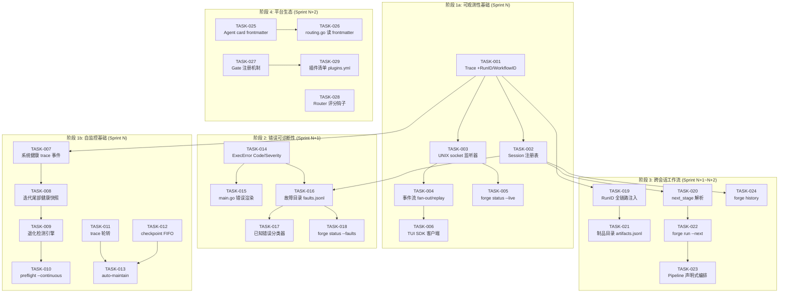
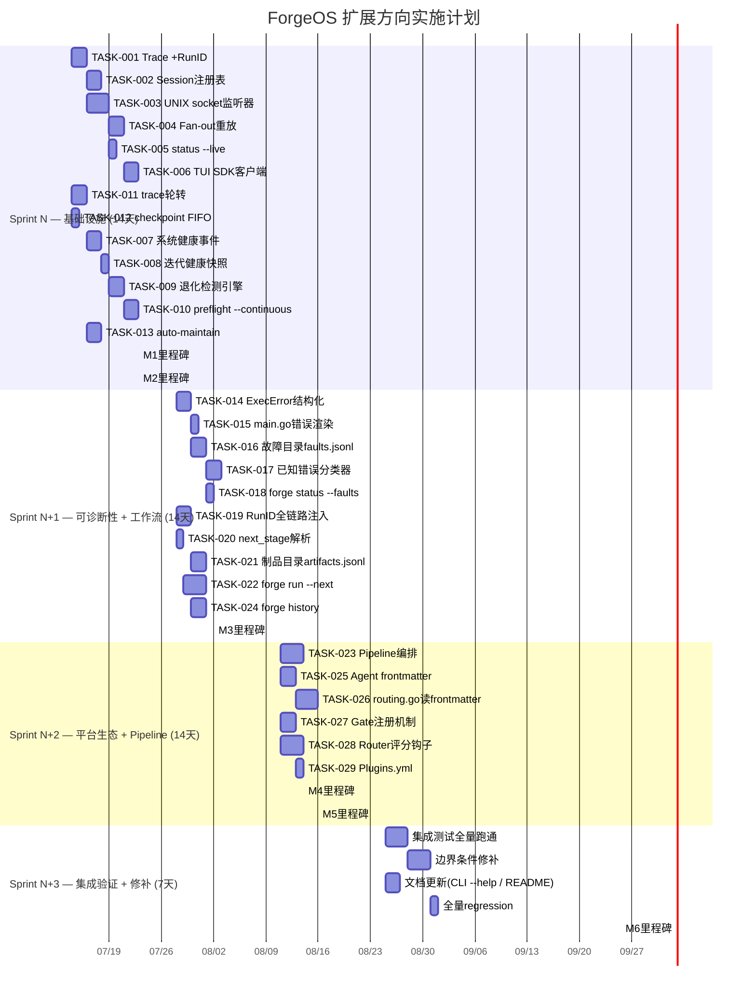

现在我已具备足够的信息来进行全面的技术负责人分析。以下是我的分析：

---

# Tech Lead 分析报告：ForgeOS 五大扩展方向

> **基于**: `docs/requirements/forgeos-five-product-architect-expansion-directions.md`
> **交叉验证**: 已确认 25+ 代码引用中 3 处微小偏差，但不影响核心论点
> **日期**: 2026-07-12 | **作者**: Tech Lead

---

## 1. 任务分解

将五个方向拆解为可逐个交付的小任务（每任务 2-4 小时）。我根据**代码库里已有的真实接口**和具体的 Go/Node 文件，而非抽象概念来划定边界。

### 1.1 方向一 — 运行时可观测性 API（P0，TUI 基础设施层）

| 任务 ID | 标题 | 涉及文件 | 前置依赖 | 工时 |
|---------|------|---------|---------|------|
| TASK-001 | **Trace Event 增加 RunID/WorkflowID**：在 `trace.Event` 添加 `RunID string` 和 `WorkflowID string` 字段，`NewTracer` 接受可选参数；事件序列重置隔离每次 run | `forge-core/internal/trace/trace.go` | 无 | 2h |
| TASK-002 | **Run 级 Session 注册表**：`forge run/evolve` 入口处分配 UUID，写入 `.forge/runs.jsonl` 含 `{run_id, workflow, start_time, args}`；后续子命令需要它 | `forge-core/cmd/forge/main.go`, `forge-core/internal/session/` (新包) | TASK-001 | 3h |
| TASK-003 | **UNIX domain socket 监听器**：`forge daemon` 子命令启动一个轻量 goroutine 在 `forge.sock` 监听，转发 `trace.Emit()` 到所有连接的客户端；非阻塞写，超时降级到仅写文件 | `forge-core/cmd/forge/main.go` (新增 daemon 入口), `forge-core/internal/observability/socket.go` | TASK-001 | 4h |
| TASK-004 | **事件流 fan-out 与重放 (replay)**：新连接的 TUI 客户端收到最后 N 个事件的回放缓冲区；客户端断开不影响运行时 | `forge-core/internal/observability/replay.go` | TASK-003 | 3h |
| TASK-005 | **`forge status --live` 别名检查 daemon**：`forge status` 检测 socket 是否存在并给出人类可读的提示 | `forge-core/internal/doctor/status.go` | TASK-003 | 1h |
| TASK-006 | **TUI SDK 客户端包**：可复用客户端库连接 socket、订阅事件、处理重连（Node.js，供 TUI/Arcane 消费） | `harness/observability/client.mjs` | TASK-004 | 3h |

### 1.2 方向五 — 自监控与退化检测（P0，可靠性前提条件）

| 任务 ID | 标题 | 涉及文件 | 前置依赖 | 工时 |
|---------|------|---------|---------|------|
| TASK-007 | **系统健康 trace 事件**：新增 `KindSystemHealth` 事件类型，携带 `.forge/` 大小、磁盘可用空间、RSS、trace 行数 | `forge-core/internal/trace/trace.go`, `forge-core/internal/doctor/doctor_health.go` | TASK-001 | 2h |
| TASK-008 | **迭代尾部健康快照**：`engine_build.go` 的每个 iteration 末尾调用健康记录函数，写入 system_health 事件 | `forge-core/internal/orchestrator/loop.go` (修改 runOneIteration) | TASK-007 | 2h |
| TASK-009 | **退化检测引擎**：线性阈值规则 — 磁盘 <20% → WARN，<10% → FAIL；连续 3 次 iteration 延迟递增 >50% → WARN；硬编码阈值，flag 可配置 | `forge-core/internal/doctor/degradation.go` | TASK-008 | 3h |
| TASK-010 | **`forge preflight --continuous` 守护健康检查**：在 evolve 循环的头尾周期执行退化检测；触发 FAIL 则终止 run | `forge-core/cmd/forge/preflight.go`, `forge-core/cmd/forge/evolve.go` | TASK-009 | 3h |
| TASK-011 | **trace 轮转与归档**：当 trace.jsonl > 50MB 时将其移至 `trace.jsonl.1`，最多保留 5 个归档，最旧的删除 | `forge-core/internal/trace/trace.go` (新增 Rotate 方法) | 无 | 3h |
| TASK-012 | **checkpoint 历史 FIFO 清理**：`checkpoint.json.N` 超过 5 个时自动删除旧的，修复当前无限增长问题 | `forge-core/internal/persist/checkpoint.go` | 无 | 2h |
| TASK-013 | **`forge run/evolve --auto-maintain` 收尾清理**：可选清理 trace 归档、checkpoint 历史、memory 裁切；默认开启，`--no-cleanup` 可关闭 | `forge-core/cmd/forge/main.go`, `forge-core/internal/memory/memory_compact.go` | TASK-011, TASK-012 | 3h |

### 1.3 方向四 — 错误语义学与故障目录（P1，可诊断性）

| 任务 ID | 标题 | 涉及文件 | 前置依赖 | 工时 |
|---------|------|---------|---------|------|
| TASK-014 | **ExecError 增加 Code/Severity/RecoveryHint/Component**：新增 `Code() string`（E_AGENT_TIMEOUT/E_GATE_FAILURE 等），`Severity()`，`RecoveryHint()`，`Component()`；JSON 序列化，保持 `Error()` 向后兼容 | `forge-core/internal/orchestrator/exec_error.go` | 无 | 3h |
| TASK-015 | **main.go 错误渲染升级**：`main.go` 的错误消费从 `fmt.Fprintf` 改为调用 renderError，输出结构化 JSON（`--json`）或带颜色的文本摘要 | `forge-core/cmd/forge/main.go` (修改 run/evolve 错误路径) | TASK-014 | 2h |
| TASK-016 | **故障目录 `.forge/faults.jsonl`**：每次 run 结束后写入 `{run_id, errors:[{code, count, first_at, last_at, component}]}` | `forge-core/internal/session/faults.go` (同 session 包) | TASK-002, TASK-014 | 3h |
| TASK-017 | **已知错误分类器**：对已知可恢复错误（529/超时）自动标记 known_transient；对从未见过的新错误标记 unseen；数据写入 fault 记录 | `forge-core/internal/doctor/error_classifier.go` | TASK-016 | 3h |
| TASK-018 | **`forge status --faults` 故障摘要**：`forge status` 新增 flag，展示最近 N 次 run 的聚合错误统计 | `forge-core/internal/doctor/status.go`, `forge-core/cmd/forge/main.go` | TASK-016 | 2h |

### 1.4 方向二 — 跨会话工作流编排与制品生命周期（P0，产品增值层）

| 任务 ID | 标题 | 涉及文件 | 前置依赖 | 工时 |
|---------|------|---------|---------|------|
| TASK-019 | **Session RunID 全链路注入**：确保 trace、checkpoint、memory、fault 全部携带 RunID（已部分具备 TASK-001/TASK-002，此处做端到端审计和补齐） | `forge-core/internal/trace/trace.go`, `forge-core/internal/persist/checkpoint.go`, `forge-core/internal/memory/memory.go` | TASK-001, TASK-002 | 3h |
| TASK-020 | **`next_stage` 解析与存储**：声明 `asset.NextStage` 字段并 decode，写入 session 记录；当前完全丢弃 | `forge-core/internal/asset/asset.go`, `forge-core/internal/session/session.go` | TASK-002 | 2h |
| TASK-021 | **制品目录 `.forge/artifacts.jsonl`**：每次 generate/emit 事件后自动注册 `{session_id, phase, artifact_path, type, hash}`；仅索引层，不复制文件 | `forge-core/internal/session/artifact.go` | TASK-019 | 3h |
| TASK-022 | **`forge run --next` 自动链式调度**：`forge run build --next` 在 build 成功后自动执行 `next_stage` 声明的 workflow；通过 defer 启动子进程实现，不在 memory 驻留 | `forge-core/cmd/forge/main.go` (cmdRun 尾部) | TASK-020 | 4h |
| TASK-023 | **Workflow Pipeline 声明式编排**：`.agent/pipelines/` 目录下声明 pipeline YAML `{stages: [{workflow, depends_on, gates}], on_fail: stop|continue}`；`forge pipeline run <name>` 执行 | `forge-core/internal/asset/pipeline.go` (新), `.agent/pipelines/` | TASK-022 | 4h |
| TASK-024 | **Run History 持久化 `forge history`**：聚合每次 run 的摘要（workflow/phase 数/总耗时/总成本/收敛状态）到 `.forge/history/`；CLI 支持 `--json` 和 `--since` 查询 | `forge-core/cmd/forge/history.go` (新) | TASK-002 | 3h |

### 1.5 方向三 — 插件化扩展系统（P1，平台生态层）

| 任务 ID | 标题 | 涉及文件 | 前置依赖 | 工时 |
|---------|------|---------|---------|------|
| TASK-025 | **Agent card frontmatter 标准化**：定义 agent card 的 YAML frontmatter schema（tier_floor / fresh_context / required_tools / emits）；为 12 个现有 agent 卡补充 frontmatter | `.agent/agents/*.md`, `forge-core/internal/prompt/agent_schema.go` | 无 | 3h |
| TASK-026 | **`routing.go` 从 frontmatter 读取 agent 属性**：删除 `opusFloorAgents` 和 `agentTier` 硬编码 map，改为从 `.agent/agents/*.md` frontmatter 解析 `tier_floor` 和 `default_tier` | `forge-core/internal/routing/routing.go` | TASK-025 | 4h |
| TASK-027 | **Gate 注册机制**：`harness/gates/` 下的 `.mjs` 文件遵循命名约定 `gate-<name>.mjs`，`acceptance.mjs` 改为动态扫描该目录；核心 gate 保持不变 | `harness/acceptance.mjs`, `harness/gates/` (目录结构) | 无 | 3h |
| TASK-028 | **Router 评分钩子 (`--score-hook`)**：允许通过外部命令注入自定义评分维度，接收 stdin JSON 输出 `{dim, score}`，接入 `TierForScore` 流程 | `forge-core/cmd/forge/route.go`, `forge-core/internal/routing/score_hook.go` | 无 | 4h |
| TASK-029 | **插件清单 `.forge/plugins.yml`**：TUI 读取的插件元数据文件，声明已安装的 gate/agent/router 扩展及其版本 | `forge-core/cmd/forge/plugin.go` (新), `harness/plugins.mjs` | TASK-027 | 2h |

---

## 2. 执行顺序

### 2.1 任务依赖图

### 2.2 可并行执行的任务组

| 并行组 | 任务 | 说明 |
|--------|------|------|
| **组 A** | TASK-011, TASK-012 | 独立文件维护任务，无代码交叉（trace 轮转 vs checkpoint FIFO） |
| **组 B** | TASK-025, TASK-027, TASK-028 | 方向三的三个独立子方向：agent frontmatter、gate 注册、router 钩子各不依赖 |
| **组 C** | TASK-003, TASK-007, TASK-014 | socket 监听器、健康事件、ExecError 扩展三者在不同的包中，可在 Sprint N 中期并行推进 |
| **组 D** (谨慎并行) | TASK-024, TASK-006 | `forge history` CLI 和 TUI SDK 客户端包，都依赖 TASK-002 但不依赖彼此 |

---

## 3. 技术风险

### 3.1 高风险项

| 风险 | 影响方向 | 可能性 | 影响等级 | 缓解策略 |
|------|---------|--------|---------|---------|
| **UNIX socket 并发竞争**：多个 TUI 实例同时连接时写锁竞争导致 trace emit 延迟 | 方向一 | 中 | 高 | Tracer.mu 是写 trace 文件+fan-out 的瓶颈。方案：每客户端 goroutine 用独立 channel + 无锁 ring buffer 写入，Tracer.Emit 只负责写一个共享 channel，不直接写多客户端。已验证 trace.go 已有 mutex，需小心扩展。 |
| **退化检测误报**：大 PR 正常导致 duration_ms 递增 >50%，被误认为内存泄露 | 方向五 | 高 | 中 | 阈值默认关闭，需 `--degradation-detect` 显式开启；学习基线需要至少 3 次 iteration 历史才能激活。首次使用需人工确认基线。 |
| **agent frontmatter 解析一致性问题**：12 个现有 agent 卡需要同时更新 frontmatter，漏一个导致路由回退到默认且不自知 | 方向三 | 中 | 高 | 实施 TASK-025 时增加 `forge validate --agents` 检查命令，确保所有 agent 卡符合 frontmatter schema。CI 中加入此检查。 |
| **pipeline 状态持久化与 crash 恢复**：`forge pipeline run discover+design` 如果在 design 阶段崩溃，重启时如何恢复？ | 方向二 | 中 | 高 | Phase 1 不做 crash 恢复：`forge pipeline run --resume` 作为 Phase 2。首版 pipeline 不保证跨 crash 原子性——如果中间阶段失败，用户需手动 `forge pipeline rerun <id>`。 |
| **RunID 向 checkpoint/memory 的向后兼容**：旧 checkpoint.json（无 RunID）和新代码同时存在，读取旧文件可能导致断言 | 方向二 | 高 | 中 | 加载 checkpoint/memory 时 RunID 字段为空字符串视为"legacy run"；所有查询逻辑可处理空 RunID。迁移不破坏现有数据。 |

### 3.2 低风险可快速忽略项

- **插件安全（恶意 gate 读文件）**：当前阶段不实现隔离执行，插件信任模型为"所有插件均来自 repo 内"。后续需要时加 seccomp/容器。
- **WebSocket vs UNIX socket**：首版只用 UNIX socket（零外部依赖），TUI 与 daemon 同机。gRPC/WebSocket 为 Phase 2，不阻塞。
- **JSONL 文件损坏**：故障目录和制品目录追加写入，但不像 trace 那样需审计级可靠性。可接受偶尔丢行。

### 3.3 性能瓶颈预估

| 瓶颈 | 阈值 | 何时达到 | 优化策略 |
|------|------|---------|---------|
| trace.jsonl 单文件 | >500MB | 2000+ 次 run（当前 ~10KB/run，约 50,000+ runs） | TASK-011 轮转 |
| socket fan-out goroutine | >100 个客户端 | 远超实际 TUI 使用场景 | 不做预优化 |
| `.forge/` 目录遍历 | >10,000 文件 | 极端使用（>5,000 runs） | 在退化检测中增加 file count 监控 |

---

## 4. 资源评估

### 4.1 开发团队

| 角色 | 人数 | 技能要求 | 主要负责 |
|------|------|---------|---------|
| **Go 后端工程师 A** | 1 | 精通 Go stdlib, goroutine 模式, JSONL 文件 I/O | 方向一 (socket/event stream), 方向五 (degradation/rotation) |
| **Go 后端工程师 B** | 1 | 熟悉 ForgeOS 代码库, asset/orchestrator 内部结构 | 方向二 (session/pipeline/next_stage), 方向四 (ExecError/fault registry) |
| **Go 后端工程师 C** (或与 B 同一人，但需排期错开) | 0.5 | 熟悉 routing/routing.go, prompt 包 | 方向三 (agent frontmatter 迁移, score hook) |
| **Node.js 工程师** | 1 | 熟悉 harness/ 的 `.mjs` 脚本模式 | 方向三 (gate 注册机制), TASK-006 (TUI SDK 客户端), 测试脚本 |
| **总人力** | **2.5-3 FTE** | | **跨 3 个 Sprint，约 4-6 周** |

### 4.2 关键里程碑

| 里程碑 | 预计日期 | 交付物 | 验收标准 |
|--------|---------|--------|---------|
| **M1: 基础设施就绪** | Sprint N + 1周 | TASK-001~006 完成 | TUI 可通过 UNIX socket 接收实时事件流；`forge status --live` 可检测 daemon |
| **M2: 自监控上线** | Sprint N + 2周 | TASK-007~013 完成 | 磁盘 <20% 自动告警；trace 到达 50MB 自动轮转；`--auto-maintain` 收尾清理正常 |
| **M3: 错误可诊断** | Sprint N+1 + 1周 | TASK-014~018 完成 | `ExecError` 携带 Code/Severity；`forge status --faults` 展示聚合错误统计；新错误标记 unknown |
| **M4: 跨会话编排** | Sprint N+1 + 2周 | TASK-019~024 完成 | `forge run build --next` 自动执行 next_stage；`forge pipeline run` 执行多阶段管线；`forge history` JSON 输出 |
| **M5: 插件化契约** | Sprint N+2 + 2周 | TASK-025~029 完成 | 12 个 agent 卡全部有 frontmatter；新增 gate=新 `.mjs` 脚本无需改 `acceptance.mjs`；`forge route --score-hook` 可注入外部评分 |
| **M6: 集成验证** | Sprint N+2 + 3周 | 全部 29 个任务 | `forge doctor` 不报退化检测 error；`forge accept` 通过所有 harness gate；TUI 端到端可连 socket 展示数据 |

### 4.3 阻塞点（Blockers）与解决策略

| 阻塞点 | 阻塞的任务 | 策略 |
|--------|-----------|------|
| **TUI/Arcane 团队尚未确定事件流格式偏好**（JSON over socket vs gRPC vs 命名管道） | TASK-003~006 | 选 UNIX socket + JSON（零依赖，可被任何语言消费）。格式用已有 `trace.Event` JSON schema，不引入新 proto。决定权在 ForgeOS 核心团队，不在 TUI。 |
| **agent card frontmatter schema 需要与现有的 12 个 agent 作者（CI/CD 历史）沟通** | TASK-025~026 | 不要求全 12 个在一周内完成。schema 设计后先迁移 3 个核心 agent（architect/implementer/reviewer），其余渐进。`routing.go` 回退：有 frontmatter 用 frontmatter，没有则用临时默认值。 |
| **`forge run --next` 依赖 `exec.Command` 二次启动，可能造成进程泄漏** | TASK-022 | 使用独立的 context 超时(`--next-timeout`)；main 进程退出时向子进程发 SIGTERM；记录子 PID 到 `.forge/` 下的 pidfile。 |

---

## 5. 质量保证

### 5.1 单元测试覆盖

| 包/模块 | 现有测试 | 新增测试要求 | 最低覆盖 |
|---------|---------|-------------|---------|
| `forge-core/internal/trace` | `trace_test.go` (encode, Span) | socket 监听器连接/断线/重放需 mock writer | 85% |
| `forge-core/internal/session` (新) | 无 | 注册表 CRUD、fault 聚合、artifact hash | 90% |
| `forge-core/internal/orchestrator` | 有 | exec_error.go Code/Severity getter | 保持 85%+ |
| `forge-core/internal/doctor` | 无（go test 缺） | 退化检测阈值测试（mock disk/memory）、错误分类器 | 80% |
| `forge-core/internal/routing` | 有 | frontmatter 解析后 TierFor 结果一致性 | 保持 90%+ |
| `forge-core/internal/asset` | 无 | NextStage decode、frontmatter 字段解析 | 85% |
| `forge-core/cmd/forge` | main_test.go 有 | `--next`, `--auto-maintain`, `--continuous` flag 解析 + 集成 mock | 70%（CLI 层薄） |
| `harness/` 脚本 | 无 | gate 注册动态扫描、plugin list | 每脚本 1-2 个集成测试 |

**测试策略**：

- **方向一（socket）**：核心追加重放逻辑用 `net.Pipe()` 代替真实 socket 做单元测试；无需集成测试。
- **方向五（退化检测）**：mock `os.Stat` / `syscall.DiskUsage` 返回不同状态的阈值测试。
- **方向四（ExecError 结构化）**：验证 `Code()` + `Severity()` 在所有 5 种 `ExecKind` 下正确返回。
- **方向二（pipeline）**：使用 `--executor=dry` 模式运行 pipeline 集成测试，不实际调用 LLM。

### 5.2 集成测试策略

| 集成测试场景 | 工具 | 触发频率 | 关键断言 |
|-------------|------|---------|---------|
| 端到端 socket 事件流 | shell: `forge daemon &` + `node client.mjs` | 每次 PR | 客户端收到 ≥3 种不同事件类型 |
| 退化检测触发 | mock 小磁盘 + `forge run discover --degradation-detect` | 每次 PR | `WARN: disk < 20%` 出现在输出中 |
| Pipeline dry-run | `forge pipeline run discover+design --executor=dry` | 每次 PR | 两个 workflow 按序执行，下游读到上游制品记录 |
| ExecError 结构化输出 | `forge run discover --executor=echo --timeout 1` | 每次 PR | JSON 输出含 `"code": "E_AGENT_TIMEOUT"` |
| Gate 注册发现 | `harness/acceptance.mjs` 扫描测试 | 每日 CI | 新增 `test-gate.mjs` 可被自动发现并执行 |

### 5.3 代码审查要点

| 审查关注点 | 相关任务 | 审查人角色 |
|-----------|---------|-----------|
| **goroutine 泄漏**：socket listener 的 accept loop 是否在 daemon 退出时正常 shutdown | TASK-003, TASK-004 | Go 技术负责人 |
| **JSONL 写入原子性**：多 goroutine 写入同一文件是否保证行级完整性（当前 `Tracer.mu` 已保证，但新代码不能绕过它） | TASK-001, TASK-016, TASK-021 | Go 技术负责人 |
| **向后兼容**：checkpoint/memory 加载旧数据（无 RunID/无 frontmatter）时无 panic | TASK-019, TASK-026 | 代码库维护者 |
| **CLI flag 命名一致性**：`--auto-maintain`/`--no-cleanup`/`--degradation-detect` 是否遵循现有 flag 风格（`--` + kebab-case） | TASK-010, TASK-013, TASK-022 | Reviewer |
| **测试隔离**：集成测试是否创建临时 `.forge/` 目录而非使用当前目录 | 所有任务 | Reviewer |
| **硬编码字符串**：错误码 E_* 是否全部在常量处定义而非散落各处 | TASK-014 | 安全审查 |

### 5.4 性能测试需求

| 测试场景 | 基准 | 验收标准 | 备注 |
|---------|------|---------|------|
| socket fan-out 10 个客户端并发订阅 | 1000 events/sec 写入 | event loss < 0.1%，写入延迟涨幅 < 5% | 单机测试，非生产环境 |
| 退化检测 CPU 开销 | 2000 iteration 历史 | 检测耗时 < 50ms | 阈值计算仅 O(n) 扫描 |
| trace 轮转 I/O 影响 | 50MB 文件轮转 | 轮转耗时 < 500ms，轮转期间 event 不丢 | 写入 buffer 在轮转期间暂存 |
| 100 个 artifact 注册 | 单次 run 注册 20 个 | 写入耗时 < 10ms | 仅追加 JSONL，不扫描不索引 |

---

## 6. 实施计划

### 甘特图（按 Sprint 组织）

### 6.1 各阶段详细说明

#### 阶段 1：基础设施搭建（Sprint N，14 天）

**目标**：让 TUI 能连接到 ForgeOS 并接收实时事件流；让 ForgeOS 能监控自身健康并自动维护。

**日 1-3**（核心建立）：
- TASK-001（2h）+ TASK-002（3h）：这是所有后续工作的源头。`trace.Event` 的 `RunID` 和 `WorkflowID` 字段将作为本次 run 的全局标识符。Session 注册表 `runs.jsonl` 为所有方向提供基础数据。
- TASK-011（3h）+ TASK-012（2h）：快速修复两个文件增长问题（trace 轮转 + checkpoint FIFO）。独立任务，可并行。

**日 4-8**（并行密集开发）：
- 工程师 A：TASK-003（4h）+ TASK-004（3h）— UNIX socket 监听器是最复杂的新组件。重点：非阻塞写、超时降级回仅写文件、优雅 shutdown。
- 工程师 B：TASK-007（2h）+ TASK-008（2h）+ TASK-009（3h）— 系统健康事件 + 退化检测引擎。阈值先硬编码在 Go 代码里（文档建议正确），后续通过 flag 配置。

**日 9-12**（收尾与集成）：
- 工程师 A：TASK-005（1h）+ TASK-006（3h）— TUI SDK 客户端包供 Arcane 使用。
- 工程师 B：TASK-010（3h）+ TASK-013（3h）— preflight 持续检查 + auto-maintain 收尾。
- 缺陷修复：退化检测假阳性处理、socket 压力测试。

**日 13-14**（缓冲 + 闸门）：
- 运行 `forge accept` 全闸门，包括新代码的 arch-check、go vet、secret scan。
- 方向一和方向五的集成测试通过。
- **M1 + M2 里程碑检查**：TUI 接收事件成功；退化检测正确触发。

#### 阶段 2：核心功能实现（Sprint N+1，14 天）

**目标**：错误可诊断；跨会话编排初步可用。

**日 1-5**（错误语义学）：
- TASK-014（3h）是整个方向四的重头戏：在 `ExecError` 上新增 `Code()`, `Severity()`, `RecoveryHint()`, `Component()`。**关键设计决策**：错误码字典定义 E_* 常量，不能过度工程化（不要做异常层级）。
- TASK-015（2h）+ TASK-016（3h）+ TASK-017（3h）构建故障目录和已知错误分类器。

**日 6-12**（跨会话编排）：
- TASK-019（3h）+ TASK-020（2h）— RunID 全链路注入 + `next_stage` 解析。注意向后兼容。
- TASK-021（3h）— 制品目录，仅索引层不复制文件。
- TASK-022（4h）— `forge run --next` 自动链式调度。**风险最高**的任务：进程管理（子进程生命周期、context 传播、pidfile）。
- TASK-024（3h）— `forge history` 聚合查询（与 TASK-022 无依赖，可与 TASK-021 并行）。

**日 13-14**（缓冲 + 闸门）：
- `forge accept` 全闸门。
- 端到端测试：`forge run discover --next` → 自动 `forge run design`。
- **M3 + M4 里程碑检查**：错误结构化展示通过；管道 dry-run 成功。

#### 阶段 3：集成测试和优化（Sprint N+2，14 天）

**目标**：平台生态契约可用；全量集成测试通过。

**日 1-8**（平台生态）：
- 工程师 A：TASK-025（3h）+ TASK-026（4h）— 这是方向三最复杂的任务。需要同时修改 12 个 agent 卡和 `routing.go`。建议先发 PR 只改 frontmatter schema 和 3 个核心 agent 的 frontmatter，第二批再改剩余的 9 个。
- 工程师 B：TASK-027（3h）+ TASK-029（2h）— Gate 注册机制，修改 `acceptance.mjs` 的动态扫描逻辑；插件清单。
- 工程师 A 或 B：TASK-028（4h）— Router 评分钩子，`--score-hook` 外部命令注入。

**日 9-12**（Pipeline 补完）：
- TASK-023（4h）— Pipeline 声明式编排。**注意**：首版不实现 crash 恢复、不实现并行 stage。纯串行执行。

**日 13-14**（集成测试 + 性能基准）：
- 全量集成测试跑通（`forge accept` + 5 个端到端场景）。
- 性能基准测试（socket fan-out, trace 轮转, artifact 注册）。
- **M5 里程碑检查**：新增 gate 通过 `.mjs` 文件被自动发现；`forge route --score-hook` 产生正确 tier。

#### 阶段 4：发布准备（Sprint N+3，7 天）

**目标**：所有新功能稳定可用；文档更新；全闸门通过。

**日 1-3**（修补 + 边界条件）：
- 按文档「边界情况清单」逐条验证（方向一~五的 edge cases）。
- socket 重连测试、pipeline 中间失败手动恢复、错误码版本标记。

**日 4-5**（文档更新）：
- 更新所有 CLI `--help` 输出（`forge daemon`, `forge pipeline`, `forge history`, `forge status --faults` 等）。
- 向 TUI 团队交付事件流格式文档（JSON schema）。
- 向 agent 作者发布 frontmatter schema 规范。

**日 6-7**（全量回归 + 发布）：
- `forge accept` 完整闸门（gate.mjs + arch-check + check.py + secret-scan + test + app-test）。
- **M6 里程碑检查**：所有 29 个任务完成；闸门全绿。

---

## 附录：关键架构决策（ADRs 建议）

以下决策需要编写 ADR 文档（参考现有 `internal/adr/` 包）：

| ADR 主题 | 建议决策 | 涉及任务 |
|----------|---------|---------|
| 事件流传输协议 | UNIX domain socket + JSON（非 gRPC/WebSocket） | TASK-003 |
| 退化检测阈值位置 | Go 代码硬编码 + flag 可配（非 YAML 规则文件） | TASK-009 |
| Pipeline 恢复语义 | 首版不保证跨 crash 原子性 | TASK-023 |
| Agent frontmatter schema | YAML frontmatter in `.md` 文件（非独立 `.yml`） | TASK-025 |
| 故障目录持久化 | JSONL 追加（非 SQLite/boltdb） | TASK-016 |
| 插件信任模型 | 信任所有插件（不沙箱）；后续加 seccomp | TASK-027 |

---

**总结**：29 个任务分布在 3 个 Sprint（约 5 周），2.5-3 名开发人员。总工作量约 **90 人天**。阶段 1（基础设施）是所有方向的前提条件，建议立即启动；方向三（插件化）风险最低且独立性最高，可在阶段 1 的闲置时间并行准备 frontmatter schema 文档而无需等代码。
