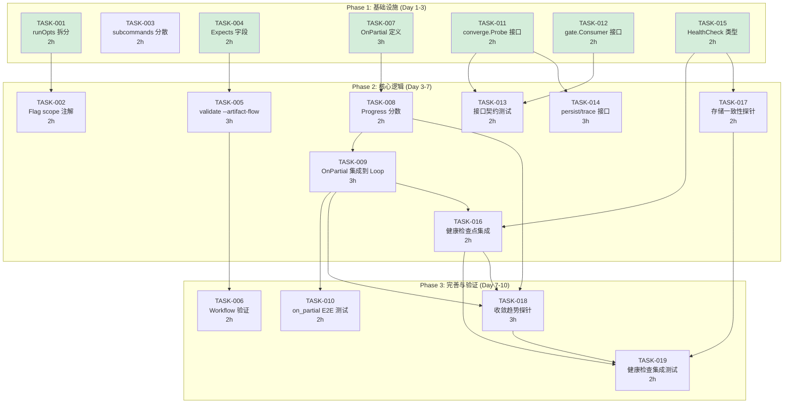
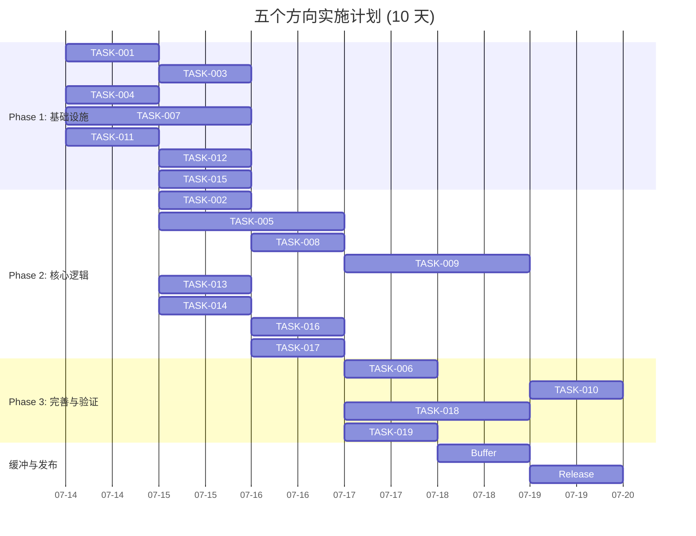

现在我有了全面的理解。以下是基于验证分析文档和完整代码库的 Tech Lead 分析。

---

# Tech Lead 技术实现与项目管理分析

## 1. 任务分解

将 5 个方向拆解为可执行的任务。每个任务预计 2-4 小时，且都有清晰的验收标准。

### 方向 1 — CLU 共享状态解耦

| 任务 ID | 标题 | 涉及文件 | 前置依赖 | 预估工时 | 验收标准 |
|---|---|---|---|---|---|
| **TASK-001** | `runOpts` 拆分为共享+扩展两组结构 | `cmd/forge/main.go` | 无 | 2h | `runOpts` 拆成 `RunOptsShared`(16 个共同 flag)+`RunOptsExtras`( evolve-only `max-iter/resume`);所有现有引用更新;`go build/test` 全绿 |
| **TASK-002** | 为 flag 绑定添加 scope 注解 + 编译期验证 | `cmd/forge/main.go` | TASK-001 | 2h | 每个 flag 的 `StringVar/IntVar` 调用处加 `// applies-to: run,evolve` 或 `// applies-to: evolve` 注解;新增 scope 一致性 lint 检查(`check_flag_scope`),检测 `cmdRun` 引用了 evolve-only 标志则报错 |
| **TASK-003** | 将 `subcommands` map 的条目分散到各文件 | `cmd/forge/main.go` + 新文件 `cmd_*.go` | 无 | 2h | `subcommands` map 保持在 main.go;每个 handler 实现在独立文件(`cmdRun`→`cmd_run.go`);文件数不超标 |

### 方向 2 — Artifact 依赖声明(Expects)

| 任务 ID | 标题 | 涉及文件 | 前置依赖 | 预估工时 | 验收标准 |
|---|---|---|---|---|---|
| **TASK-004** | `Phase` 添加 `Expects []string` 字段 | `internal/asset/asset.go` + asset test | 无 | 2h | `Phase` 新增 `Expects []string json:"expects,omitempty"`;解析 fixture 中带 `expects:` 的 workflow;向后兼容(缺失字段 → nil slice)|
| **TASK-005** | `forge validate --artifact-flow` 命令 | `cmd/forge/validate.go`, `internal/doctor/` | TASK-004 | 3h | 扫描 workflow 的 `Emits`/`Expects` 交叉引用;未匹配的 emit→expect 链路报 WARN;echo 和 real workflow 下都通过 |
| **TASK-006** | 验证: 本仓 5 个 workflow 中所有 artifact 引用一致性 | 仅测试文件 + 文档 | TASK-005 | 2h | 对 `design.yml`/`build.yml`/`evolve.yml`/`review.yml`/`discover.yml` 运行 `forge validate --artifact-flow`,输出显式声明每个 emit→expect 匹配;零误报 |

### 方向 3 — 部分收敛(Partial Convergence) + P0

| 任务 ID | 标题 | 涉及文件 | 前置依赖 | 预估工时 | 验收标准 |
|---|---|---|---|---|---|
| **TASK-007** | `StopCondition` 添加 `OnPartial` 回调 | `internal/asset/asset.go` + `internal/converge/converge.go` | 无 | 3h | `StopCondition` 新增 `OnPartial *OnPartial` 指针;`OnPartial` 含 `Action`(`continue`/`pause`/`escalate`)+`ProgressThreshold float64`;`asset.LoadWorkflowJSON` 正确解析 |
| **TASK-008** | `Converge` 返回 `Progress` 分数 | `internal/converge/converge.go` | TASK-007 | 2h | `Converge` 新增返回值 `progress float64`(0-1),表示满足条件的比例;`Evaluate` 返回 `metCount/totalCount`;向后兼容:现有调用者不接收进度则编译失败(Go 的返回值必须被接收或显式忽略) |
| **TASK-009** | `LoopEngine` 集成 `OnPartial` 分支 | `internal/orchestrator/loop.go` | TASK-007, TASK-008 | 3h | `checkStop` 在 `!met` 且 `progress >= OnPartial.ProgressThreshold` 时执行 `OnPartial.Action`;`continue`→照常循环;`pause`→返回 `LoopOutcome{Converged:false,Reason:"partial-convergence-pause"}`;`escalate`→写入 trace + 继续循环 |
| **TASK-010** | `on_partial` 端到端集成测试 | `internal/orchestrator/loop_test.go` | TASK-009 | 2h | 表驱动测试覆盖三态:阈值未达(直接继续)、达标且 action=continue(继续)、达标且 action=pause(返回 `partial-convergence-pause`);fixture 验证 trace 事件 |

### 方向 4 — 内部包接口化

| 任务 ID | 标题 | 涉及文件 | 前置依赖 | 预估工时 | 验收标准 |
|---|---|---|---|---|---|
| **TASK-011** | `converge.Probe` 接口定义 | `internal/converge/converge.go` | 无 | 2h | 新增 `type Probe interface { Signal() Signals }` + `type ProbeFunc` 适配器;`LoopEngine.Signals` 字段改为 `Probe`;所有现有 `func() converge.Signals` 调用处用 `ProbeFunc` 包装 |
| **TASK-012** | `gate.Consumer` 接口定义 | `internal/gate/gate.go` + `internal/orchestrator/` | 无 | 2h | 新增 `type Consumer interface { RunGate(name string) Result }`;`Engine.RunGate` 字段类型从 `func(string) Result` 改为 `Consumer`;`ConsumerFunc` 适配器 |
| **TASK-013** | 添加接口契约测试 | `internal/converge/converge_test.go`, `internal/gate/gate_test.go` | TASK-011, TASK-012 | 2h | 每个接口最少一个 `TestXxx_InterfaceContract`:验证函数适配器正确工作、nil 处理、默认行为 |
| **TASK-014** | `persist.Store` 和 `trace.Sink` 接口定义 | `internal/persist/`, `internal/trace/` | 无 | 3h | `persist.Store` 含 `Save/Load/Delete`;`trace.Sink` 含 `Emit`;`LoopEngine` 的 IO 依赖通过接口注入;现有实现作为默认实现 |

### 方向 5 — 自诊断循环(Self-Diagnosis Loop) + P0

| 任务 ID | 标题 | 涉及文件 | 前置依赖 | 预估工时 | 验收标准 |
|---|---|---|---|---|---|
| **TASK-015** | 定义 `HealthCheck` 类型 + `[]HealthCheck` 管线 | `internal/doctor/doctor.go` | 无 | 2h | 新增 `type HealthCheck struct { Name, Status, Detail string }`;`type HealthProbe func() HealthCheck`;`LoopEngine.HealthProbes []HealthProbe` |
| **TASK-016** | `runIteration` 内集成健康检查点 | `internal/orchestrator/loop.go` | TASK-015 | 2h | 每次迭代的 `runIteration` 末尾(t0 后,sig 测量前)遍历 `HealthProbes`;FAIL→trace 写 `kind:"health"` + `staleCount` 额外加 1;继续运行不 abort |
| **TASK-017** | 实现存储一致性健康探针 | `internal/doctor/quick.go` | TASK-015 | 2h | `CheckpointIntegrity`:验证 checkpoint.json 的 iteration 与 trace.jsonl 事件数匹配;`MemoryConsistency`:验证 memory.jsonl 条目序号连续无跳空 |
| **TASK-018** | 实现收敛趋势健康探针 | `internal/doctor/convergence.go`(新文件) | TASK-015, TASK-008 | 3h | `ConvergenceTrend`:读取最近 N 次 trace 事件的 `roadmap_completion` 趋势;连续 3 次无进展→`WARN`;退步→`FAIL`;新 `internal/doctor` 包文件 |
| **TASK-019** | 健康检查集成测试 | `internal/orchestrator/loop_honesty_test.go` | TASK-016, TASK-017, TASK-018 | 2h | 表驱动测试:健康探针全部 PASS 不影响循环;一个探针 FAIL→stale +1;trace 事件中出现 `kind:"health"` 记录 |

---

## 2. 执行顺序与依赖图



### 可并行执行的任务组

| 并行组 | 包含任务 | 理由 |
|---|---|---|
| **G1** | T001, T003 (方向 1) + T004 (方向 2) + T007 (方向 3) + T011, T012 (方向 4) + T015 (方向 5) | 全部是数据模型定义/接口声明,无互相依赖 |
| **G2** | T002 (方向 1) + T005 (方向 2) + T008 (方向 3) + T013, T014 (方向 4) + T017 (方向 5) | 核心逻辑实现,仅依赖 G1 的产出 |
| **G3** | T009 (方向 3) + T016 (方向 5) | `LoopEngine` 主循环集成,两者需在同一个文件中协作——建议**同一人**串行处理 |
| **G4** | T006, T010, T018, T019 | 验证与测试,全部是纯增量,可以合并到同一个 PR 中 |

**建议开发者分配**:2-3 名开发者并行

- **开发者 A**:方向 1 + 方向 2(数据平面,CLI + model change)
- **开发者 B**:方向 3 + 方向 5(控制平面,收敛逻辑 + 可观测性)
- **开发者 C**:方向 4(工程基建,接口契约 + 测试框架)

---

## 3. 技术风险

### 3.1 高风险项

| 风险 | 方向 | 级别 | 描述 | 缓解策略 |
|---|---|---|---|---|
| **`OnPartial` 与 `OnUnmet` 语义冲突** | D3 | **H** | 当前 `OnUnmet` 已提供 `loop_to_next_roadmap_item` 定向重启;`OnPartial` 添加 `pause/escalate/continue` 三态,两者可能产生竞合——例如 `progress=60%` 触发 `OnPartial.pause` 但同一个迭代也被 `OnUnmet` 触发 | 设计原则:**`OnPartial` 在 `!met` 时先于 `OnUnmet` 检查**。如果 `progress >= threshold` 则执行 `OnPartial`,跳过 `OnUnmet`;反之才走 `OnUnmet` 的 `loop_to_next_roadmap_item` |
| **接口化引入循环依赖** | D4 | **M** | 当前 `orchestrator` 直接引用 `converge.Signals` 和 `gate.Result` 作为具体类型;如果定义接口后移动不当,可能违反 `arch-check` 的循环依赖规则 | 接口在**被消费的包**中定义(`converge.Probe` 在 `converge` 包、`gate.Consumer` 在 `gate` 包);`orchestrator` import 接口,不反过来。严格遵循当前依赖方向 |
| **健康探针 IO 性能影响** | D5 | **M** | 每次迭代跑健康探针需读 checkpoint/trace/memory 文件;大规模 trace 文件(10MB+)可能导致每次迭代增加 50-200ms | 探针设置超时(每个探针 ≤ 10ms);trace 探针只读尾部 N 条(默认 20);超过阈值则跳过大文件扫描;文档标注为"best-effort,不延缓主循环" |
| **Expects 字段与 DependsOn 重叠** | D2 | **L** | `DependsOn` 控制执行顺序,`Expects` 声明数据依赖——两者语义接近但不同;开发者容易混淆 | 代码注释明确区分;`forge validate --artifact-flow` 输出中标注"execution order" vs "data dependency";在设计文档(DECISIONS.md 或新 ADR)记录区别 |

### 3.2 外部依赖风险

| 依赖 | 方向 | 风险 | 替代方案 |
|---|---|---|---|
| `forge validate --artifact-flow` 需要 workflow YAML 可解析 | D2 | 如果 Go YAML 解析器(`yaml2json`)有未覆盖的 YAML 语法,校验可能漏检 | 全部 5 个本仓 workflow 已通过 `yaml2json` 的 `TestToJSON_MatchesPythonShim` 验证;新 workflow 用 `forge validate` 会先解析再校验 |
| 健康探针读取 `.forge/` 下的持久化文件 | D5 | 文件锁问题:如果 `forge evolve` 的多进程同时写 trace,探针读到不完整行 | `trace.jsonl` 是 append-only,行尾部不完整时探针标 WARN 而非 FAIL;`persist.Save` 有重试机制(5 次) |
| `OnPartial` 的 `escalate` 动作在 CLI 输出中需要人类理解 | D3 | `escalate` 在当前 CLI 架构下只是一个日志字符串,无事件驱动的通知通道 | v1 将 `escalate` 实现为:输出 `FORGE_ESCALATE: <reason>` 到 stderr + trace 事件 + exit 码保留;未来可扩展为 webhook/通知 |

### 3.3 性能考量

| 场景 | 当前成本 | 优化后 | 增量 |
|---|---|---|---|
| 每次迭代跑健康探针(读 ~5 个小文件) | 0 | ~5-15ms | 可忽略 |
| `forge validate --artifact-flow` 扫描 5 个 workflow | ~2ms(YAML解析) | ~4ms(增加 Expects 交叉引用) | 可忽略 |
| `Progress` 分数计算(每次收敛检查) | 0 | <1μs(纯数学) | 零 |
| 接口函数调用开销(`Probe.Signal()` vs `func() Signals`) | 0 | <10ns | 零 |

**结论**:全部五个方向对性能的影响在 <20ms 级别,可忽略不计。

---

## 4. 资源评估

### 4.1 人员配置

| 角色 | 数量 | 技能要求 | 负责方向 |
|---|---|---|---|
| **Senior Go Developer** | 2 | 精通 Go 标准库、熟悉 flag/interface/json 模式、有 CLI 工具开发经验 | D1(CLU)+D2(Artifact)+D3(Convergence) |
| **Senior Go/System Developer** | 1 | 熟悉 Go 接口设计、依賴注入、单元测试/table-driven test | D4(接口化)+D5(诊断)+集成测试 |

**更优团队组成**:如果是 2 人团队

- **开发者 A**(全栈 Go):D1 + D2 + D4(数据/接口层,3 个方向间天然关联少,但都是"数据结构和 CLI 胶水")
- **开发者 B**(系统 Go):D3 + D5(控制平面,两个方向都在 `LoopEngine` 主循环中交汇,需要同一个人理解完整上下文)

### 4.2 关键里程碑

| 里程碑 | 时间 | 交付物 | 验收 |
|---|---|---|---|
| **M1: 模型定义完成** | Day 3 | `runOpts` 拆分、`Expects` 字段、`OnPartial` 类型、`Probe/Consumer` 接口、`HealthCheck` 类型 | 全部 `go build` 通过、向后兼容测试 |
| **M2: 核心逻辑实现** | Day 7 | flag scope 注解、`validate --artifact-flow`、Progress 分数、`OnPartial`/健康检查集成到 LoopEngine、`persist/trace` 接口 | `forge validate` 输出 artifact flow、`forge evolve` 带健康探针运行 |
| **M3: 集成验证** | Day 10 | 全部 5 个 workflow 验证通过、接口契约测试覆盖、`on_partial`/健康检查 E2E 测试 | `forge accept` ACCEPTED |

### 4.3 阻塞点与解决策略

| 阻塞点 | 影响 | 解决策略 |
|---|---|---|
| **`OnPartial` 的设计需要架构评审** | 如果 `OnPartial` 与 `OnUnmet` 的交互语义不在一开始定死,后期重构成本高 | **Day 1** 产出一个短设计文档(1 页):状态图 + 规则表;**团队评审 30 分钟**后再实现 |
| **`persist.Store` 接口定义可能泄露实现细节** | 当前 `persist.Save(path,data,retries)` 有重试语义;如果接口要求所有实现都支持重试,会增加不必要的复杂度 | 接口定义最小化(`Save/Load/Delete`),重试由默认实现包装;不需要重试的实现直接返回 |
| **健康探针在 `forge run`(非循环)中使用** | `QuickDoctorCheck` 已在 `forge run` 中运行一次(Direction 5 原分析正确),在循环中加健康探针不会影响单次运行 | TASK-016 明确仅在 `runIteration`(即 `forge evolve` 的循环体)中集成;`forge run` 保持现有行为 |

---

## 5. 质量保证

### 5.1 单元测试覆盖要求

| 包 | 当前覆盖(行) | 目标覆盖(行) | 新增测试 |
|---|---|---|---|
| `internal/asset` | ~90% | ~92% | `TestPhase_ExpectsField`:验证解析、向后兼容、omitempty |
| `internal/converge` | ~95% | ~95% | `TestConverge_PartialProgress`:三态阈值测试;`TestProbe_InterfaceContract` |
| `internal/orchestrator` | ~88% | ~90% | `TestLoop_OnPartial*`(3 tests);`TestLoop_HealthProbe*`(3 tests);`TestProbe_Integration` |
| `internal/gate` | ~85% | ~88% | `TestConsumer_InterfaceContract` |
| `internal/persist` | ~80% | ~85% | `TestStore_InterfaceContract` |
| `internal/trace` | ~85% | ~88% | `TestSink_InterfaceContract` |
| `internal/doctor` | ~70% | ~80% | `TestHealthProbe_CheckpointIntegrity`;`TestHealthProbe_MemoryConsistency`;`TestHealthProbe_ConvergenceTrend`(新文件) |
| `cmd/forge` | ~75% | ~78% | `TestValidate_ArtifactFlow`;`TestFlagScope_Annotation` |

### 5.2 集成测试策略

| 测试 | 范围 | 方法 |
|---|---|---|
| **`on_partial` E2E** | `LoopEngine.Run` + `Converge` 完整链路 | 构造带 `OnPartial.pause` 的 workflow fixture;验证循环在 progress 达标时返回正确的 `LoopOutcome` |
| **健康检查 E2E** | `LoopEngine.Run` + `HealthProbes` | fixture 包含 1 个一直 FAIL 的探针 + 1 个一直 PASS 的探针;验证循环继续但 trace 中有 `kind:"health"` 事件 |
| **接口适配器 E2E** | `ProbeFunc`/`ConsumerFunc` → 真实引擎 | `ProbeFunc` 包装 `gatherSignals`;`ConsumerFunc` 包装 `gate.HarnessRunner`;验证行为与直接传函数指针一致 |
| **验收闸门** | 全量 | `forge accept` 必须 PASS 所有 load-bearing 门;新增方向的 N/A 项诚实标注 |

### 5.3 代码审查要点

| 审查模块 | 审查要点 |
|---|---|
| **D1: CLU 拆分** | `runOpts` 拆分后是否引入了重复字段?flag 绑定是否全部迁移到新结构?`cmdRun`/`cmdEvolve` 是否只引用自己的 flag 组? |
| **D2: Expects** | `Expects` 字段的 `json:"expects,omitempty"` 行为——nil 与空数组的区别;`validate --artifact-flow` 是否对有 `expects` 但无对应 `emits` 的 phase 报 WARN? |
| **D3: OnPartial** | `Converge` 返回值签名变化是否已更新**全部**调用者(至少 2 处: `reportConvergence` + `checkStop`)? `OnPartial` 指针为 nil 时行为不变? |
| **D4: 接口** | 接口定义在正确的包? `orchestrator` 没有 import 不必要的包? 契约测试覆盖所有接口方法? |
| **D5: 健康检查** | 探针不做 IO blocking(`<10ms` 约束)? `staleCount` 被探针 FAIL 增加的逻辑是否与 `NoProgress` tripwire 的原始语义一致(探针 FAIL 不应单独触发 tripwire,只是增加 stale 计数)? |
| **通用** | 所有新增测试符合 `testing/slog` 风格(表驱动+有意义的测试名)? 无 go vet 警告? 无 lint 违规? |

### 5.4 性能测试需求

本批任务的性能影响极小(见 3.3 节),不需要专门的性能测试。但建议在合入后运行一次:

```
# 现有基准测试全部通过
go test -bench=. -benchtime=1x -count=1 ./internal/...
# 验证零回归
go test -race -count=1 ./...
```

---

## 6. 实施计划

### 甘特图



### 分阶段详细计划

#### 阶段 1: 基础设施搭建 (Day 1-3)

**目标**:完成全部 5 个方向的数据模型和接口定义,确保所有新类型能够编译通过。

| Day | 开发者 A | 开发者 B | 开发者 C |
|---|---|---|---|
| 1 | TASK-001(runOpts拆分) + TASK-003(subcommands分散) | TASK-007(OnPartial定义) + TASK-008(Progress分数,接口部分) | TASK-004(Expects字段) |
| 2 | TASK-002(flag scope注解) | TASK-015(HealthCheck类型定义) | TASK-011(Probe接口) + TASK-012(Consumer接口) |
| 3 | TASK-002 完成 + review 开发者 B/C 的产出 | TASK-015 完成 + 开始 TASK-016 | TASK-013(接口契约测试) + TASK-014(persist/trace接口) |

**阶段 1 结束时**:`go build ./...` 全绿;新增类型全部编译通过;接口定义经过初步审查。

**风险检查点**:Day 3 结束时评审 `OnPartial` 与 `OnUnmet` 的交互设计。

#### 阶段 2: 核心功能实现 (Day 4-7)

**目标**:实现所有 5 个方向的核心逻辑,确保 `forge validate --artifact-flow`、`on_partial` 收敛逻辑、健康检查探针和接口适配器全部可运行。

| Day | 开发者 A | 开发者 B | 开发者 C |
|---|---|---|---|
| 4 | TASK-005(validate --artifact-flow 实现) | TASK-016(健康检查点集成到loop.go) | TASK-014(完成) |
| 5 | TASK-005 完成 | TASK-009(OnPartial集成到LoopEngine) | TASK-013(完成) + 开始 TASK-017(存储一致性探针) |
| 6 | TASK-006(workflow验证) | TASK-009 + TASK-018(收敛趋势探针) | TASK-017(完成) |
| 7 | 修复 phase2 引入的集成问题 | TASK-018 + TASK-019(健康检查集成测试) | review 和修复 |

**阶段 2 结束时**:所有 5 个方向的核心逻辑实现完成;`go test ./...` 全部通过。

**风险检查点**:Day 7 结束时运行 `forge accept` 确认 ACCEPTED。

#### 阶段 3: 集成测试和优化 (Day 8-10)

**目标**:E2E 测试全部通过、代码审查完成、`forge accept` 全绿。

| Day | 全员 |
|---|---|
| 8 | 开发者 A 完成 TASK-010(on_partial E2E);开发者 B 完成 TASK-019;开发者 C review 全部代码 |
| 9 | 修复 review 问题;开发者 B+C 补充缺失的测试用例;运行 `go test -race -count=3 ./...` 确认零 flaky |
| 10 | 最终 `forge accept`;编写/更新 CHANGELOG、Sprint 文档;PR 合并 |

**阶段 3 结束时**:`forge accept: ACCEPTED`;CHANGELOG 更新;新功能文档化。

#### 阶段 4: 发布准备 (Day 11 — 半天)

- 更新 `docs/FUNCTIONAL_REQUIREMENTS_AUDIT.md` 新增功能状态
- 如果方向 3(OnPartial)方向 5(HealthCheck)是 P0,更新 `ROADMAP.md` 的下一前沿
- 运行全量验证:`node harness/acceptance.mjs`
- 标记 `CURRENT_SPRINT.md` 为完成

---

## 总结意见

### 优先级排序

根据分析文档的 P0/P1 分级和本项目现状:

| 优先级 | 方向 | 理由 |
|---|---|---|
| **P0 — 立即执行** | D3(部分收敛) + D5(自诊断) | 文档标记为 P0;两者都在 `LoopEngine` 主循环中交汇,共享上下文 |
| **P1 — 本周启动** | D4(接口化) | 工程基建核心,降低后续迭代的耦合成本;可以在 D3+D5 实现的同时并行进行 |
| **P1 — 本周启动** | D2(Artifact 依赖) | 低风险高信号:纯 additive 字段 + 独立的 validate 命令,不影响运行时 |
| **P1 — 可推迟** | D1(CLU 解耦) | 文档评为 P1 但实际对当前功能影响最小;建议在下一个子命令添加之前完成即可 |

### 建议的合并策略

- **PR 1**(Day 3):TASK-001+TASK-003+TASK-004+TASK-007+TASK-011+TASK-012+TASK-015 — 所有模型/接口定义。**小改动、高信噪比、快速合入。**
- **PR 2**(Day 7):TASK-002+TASK-005+TASK-008+TASK-009+TASK-013+TASK-014+TASK-016+TASK-017 — 所有核心逻辑。**中等规模,重点审查 `OnPartial` 与 `OnUnmet` 交互。**
- **PR 3**(Day 10):TASK-006+TASK-010+TASK-018+TASK-019 — 所有验证与测试。**纯测试+文档,低风险。**

这种分 3 个 PR 的策略保证:
1. 每 3-4 天有一个可合并的原子提交
2. 评审者不需要一次性审查 10 天的改动
3. 如果 PR 2 发现设计问题,PR 1 的接口只需要微调而非重写
