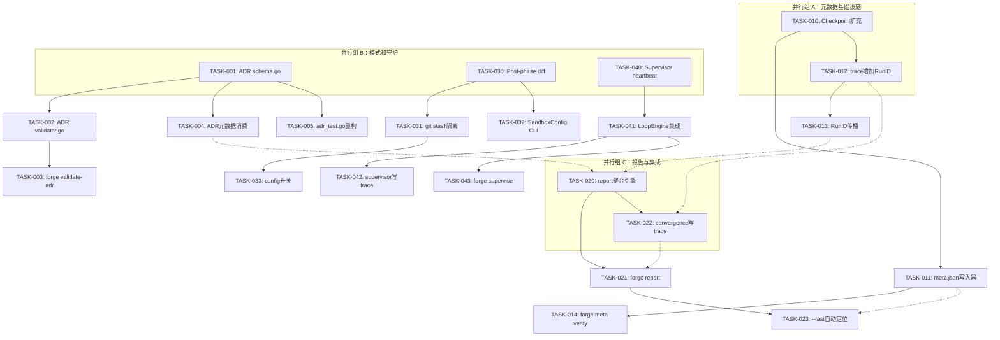
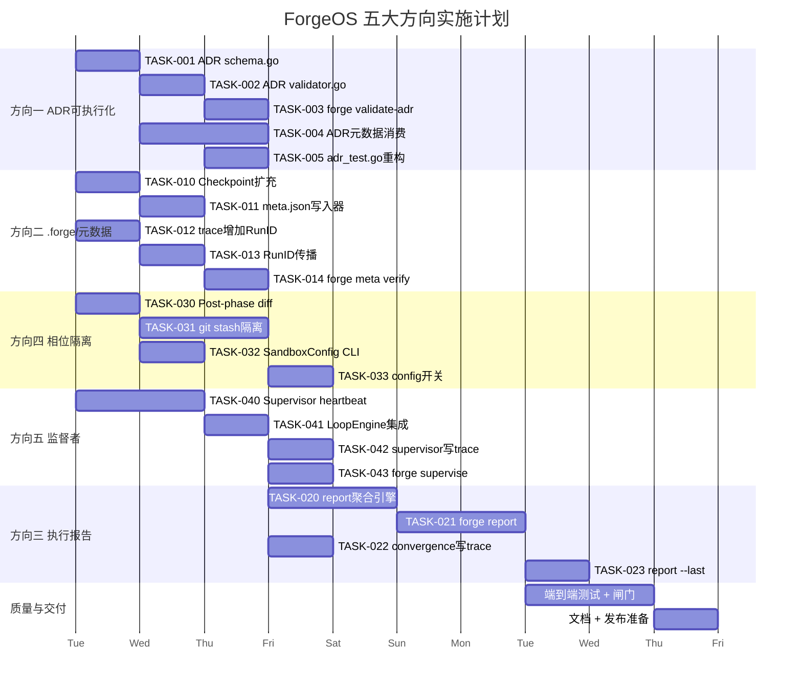

---

# Tech Lead 分析报告：ForgeOS 五大功能方向

**分析数据来源**：实际代码库审查（2026-07-12），基于审查者对全部 5 个方向的代码验证结果。

---

## 1. 任务分解

### 方向一：ADR 可执行化（ADR-Executable）

| 任务 ID | 任务标题 | 涉及文件 | 前置依赖 | 预估工时 | 验收标准 |
|---------|---------|---------|---------|---------|---------|
| TASK-001 | **新建 `internal/adr/schema.go` — ADR 元数据结构定义** | `forge-core/internal/adr/schema.go` | — | 2h | 定义 `ADRDoc` 结构体（ID, Title, Status, Decision, Rationale, Tags []string, MachineReadable bool），导出 `Parse(path string) (*ADRDoc, error)` 从 ADR markdown 首部 YAML frontmatter 提取元数据 |
| TASK-002 | **新建 `internal/adr/validator.go` — ADR 格式校验器** | `forge-core/internal/adr/validator.go` | TASK-001 | 3h | 实现 `Validate(path string) ([]Result, error)` 检查：frontmatter 完整性、Status 为合法枚举（Accepted/Deprecated/Superseded）、Decision 非空、MachineReadable 标记一致性。`ValidateAll(paths []string) ([]Result, error)` 批量校验 |
| TASK-003 | **新建 `cmd/forge/adr.go` — `forge validate-adr` 子命令** | `forge-core/cmd/forge/adr.go` | TASK-002 | 2h | `forge validate-adr docs/adr/*.md` 调用 `adr.ValidateAll`，输出机器可读 JSON（`--json`）或友好表格（默认）。非零退出码表示校验失败 |
| TASK-004 | **ADR 元数据被 gate 引擎消费 — 新增 `SignalADRDecision`** | `forge-core/internal/gate/`, `forge-core/internal/converge/signals.go` | TASK-001 | 4h | `gatherSignals` 中新增 `SignalADRDecision`，扫描 `docs/adr/` 收集所有 `Status: Accepted` 的 ADR 数量作为 signals 输入。gate criterion 可引用 `adr.accepted.count >= N` |
| TASK-005 | **将 `adr_test.go` 重构为使用新 schema 层** | `forge-core/internal/adr/adr_test.go` | TASK-001 ~ TASK-002 | 2h | 现有 ADR 测试（TestADR0001_ForgeCoreExists 等）保持不变，但新增 `TestADRDoc_Smoke` 验证每个 ADR markdown 能被 `schema.go` 正确解析。**旧测试全部通过** |

**方向一小计：13h / 约 2 人日**

---

### 方向二：`.forge/` 元数据护照

| 任务 ID | 任务标题 | 涉及文件 | 前置依赖 | 预估工时 | 验收标准 |
|---------|---------|---------|---------|---------|---------|
| TASK-010 | **扩充 `Checkpoint` — 新增 `ForgeVersion`、`RunID`、`Checksum` 字段** | `forge-core/internal/persist/checkpoint.go` | — | 2h | `Checkpoint` 增加 `ForgeVersion string`、`RunID string`、`Checksum string`。向后兼容：旧 checkpoint 加载时 `RunID` 为空，不报错 |
| TASK-011 | **新建 `.forge/meta.json` 写入器** | `forge-core/cmd/forge/meta.go` | TASK-010 | 3h | 每轮迭代结束后写入 `.forge/meta.json`，包含：`run_id`, `forge_version`, `started_at`, `iterations`, `last_gates_green`, `checksum`。文件使用原子写（同 persist 的 rename-then-fsync 模式） |
| TASK-012 | **trace.Event 增加 `RunID` 字段** | `forge-core/internal/trace/trace.go` | TASK-010 | 2h | `Event` 新增 `RunID string`，`Tracer` 构造时注入并携带到所有 `Emit` 中。JSONL 向后兼容（omitempty） |
| TASK-013 | **`forge start` 初始化 `RunID` 并传播** | `forge-core/cmd/forge/main.go`, `forge-core/internal/orchestrator/loop.go` | TASK-012 | 2h | `forge start` 在循环开始时生成 `RunID`（ULID），注入 Tracer 和 Checkpoint。`--resume` 复用已有 `RunID` |
| TASK-014 | **`meta.json` 校验与修复子命令 `forge meta verify`** | `forge-core/cmd/forge/meta.go` | TASK-011 | 3h | `forge meta verify` 读取 `.forge/meta.json`，校验 checksum 和字段完整性。`--fix` 选项修复可自动修复的问题（如缺失但可推断的字段）。输出 JSON 状态报告 |

**方向二小计：12h / 约 1.5 人日**

---

### 方向三：执行报告（Execution Report）

| 任务 ID | 任务标题 | 涉及文件 | 前置依赖 | 预估工时 | 验收标准 |
|---------|---------|---------|---------|---------|---------|
| TASK-020 | **新建 `internal/report/report.go` — 报告聚合引擎** | `forge-core/internal/report/report.go` | — | 4h | 导出 `Report` 结构体（RunID, Duration, Iterations, Gates, Convergence, Cost, FileDelta, CodeTestRatio）和 `FromCheckpoint(cp *persist.Checkpoint) *Report` 构建器。`FromTrace(r io.Reader) (*Report, error)` 从 trace JSONL 重建报告 |
| TASK-021 | **新建 `cmd/forge/report.go` — `forge report` 子命令** | `forge-core/cmd/forge/report.go` | TASK-020 | 3h | `forge report` 输出人类可读报告（默认）或 JSON（`--json`）。从当前 `.forge/` 元数据和 trace 日志自动聚合。`forge report --diff <run-id>` 对比两次运行 |
| TASK-022 | **`reportConvergence` 结果写入 trace** | `forge-core/cmd/forge/main.go`, `forge-core/internal/trace/trace.go` | TASK-012, TASK-020 | 2h | `reportConvergence` 输出的每个 criterion 结果同时 `trace.Emit` 为 `kind: "converge"` 事件，包含 `status`（MET/NOT_MET）和 `detail`。trace stream 成为报告的可审计数据源 |
| TASK-023 | **`forge report --last` 自动定位最新运行** | `forge-core/cmd/forge/report.go` | TASK-021 | 2h | 读取 `.forge/meta.json` 确定最新 run_id，加载对应 trace 和 checkpoint。没有指定参数时默认行为 |

**方向三小计：11h / 约 1.4 人日**

---

### 方向四：文件系统相位隔离

| 任务 ID | 任务标题 | 涉及文件 | 前置依赖 | 预估工时 | 验收标准 |
|---------|---------|---------|---------|---------|---------|
| TASK-030 | **L1 — Post-phase diff 捕获器** | `forge-core/internal/orchestrator/diff.go`（新建），`forge-core/internal/orchestrator/loop.go` | — | 3h | 每完成一个 agent phase，执行 `git diff --stat` / `git diff` 生成 phase 的文件变更清单，格式化为 JSON 写入 `.forge/phases/{iter}_{phase}/diff.json`。启用由 config 中的 `DiffCapture: true` 控制 |
| TASK-031 | **L2 — Per-phase `git stash` 隔离** | `forge-core/internal/orchestrator/diff.go` | TASK-030 | 4h | 每个 phase 开始前 `git stash push --include-untracked -m "phase-{iter}-{phase}"`，结束后 `git stash pop`。由 config 中的 `PhaseIsolation: "stash"` 控制（默认 off）。实现错误回滚：pop 失败时从 stash 重建 |
| TASK-032 | **L3 — 对齐 north-star SandboxConfig** | `forge-core/internal/orchestrator/command_executor.go`, `forge-core/cmd/forge/main.go` | TASK-030 | 2h | 为已存在的 `SandboxConfig` 补充 CLI 参数。`CommandExecutor.SetSandbox(cfg SandboxConfig)` 设置 `exec.Cmd.SysProcAttr` 隔离（Linux namespaces 模拟，不作真实 Firecracker）。更新注释对齐 ROADMAP v3 |
| TASK-033 | **`forge config` 暴露相位隔离开关** | `forge-core/cmd/forge/config.go`（新建? 或扩充） | TASK-031 | 2h | 新增配置项 `phaseIsolation`（off/stash/sandbox），写入 `.forge/config.json`。`forge config set phaseIsolation stash` 生效 |

**方向四小计：11h / 约 1.4 人日**

---

### 方向五：监督者模式（Supervisor）

| 任务 ID | 任务标题 | 涉及文件 | 前置依赖 | 预估工时 | 验收标准 |
|---------|---------|---------|---------|---------|---------|
| TASK-040 | **新建 `internal/supervisor/heartbeat.go` — 心跳与环境监视器** | `forge-core/internal/supervisor/` | — | 3h | goroutine 每秒检查：累计 cost 是否超预算（复用 `SpentUsdMicros`）、迭代间是否无进展（doom-loop 检测）、内存使用（`runtime.ReadMemStats`）。通过 `OnHeartbeat func(Status)` 回调向外报告 |
| TASK-041 | **集成 Supervisor 到 LoopEngine** | `forge-core/internal/orchestrator/loop.go`, `forge-core/cmd/forge/main.go` | TASK-040 | 2h | `LoopEngine.Config` 新增 `Supervisor *supervisor.Supervisor`。`Run` 启动时 `go supervisor.Start(ctx)`，Stop 时 `supervisor.Shutdown()`。复用已有的 `loop.Forfeit` 通道做 force-stop |
| TASK-042 | **监督者日志写入 trace** | `forge-core/internal/trace/trace.go`, `forge-core/internal/supervisor/report.go` | TASK-041, TASK-012 | 2h | supervisor 心跳事件通过 `Tracer.Emit` 写为 `kind: "supervisor"` 事件，包含 `status: "healthy" / "warning" / "critical"` 和 `name: "budget" / "progress" / "memory"` |
| TASK-043 | **`forge supervise` 独立监督子命令（可选）** | `forge-core/cmd/forge/supervise.go` | TASK-041 | 2h | `forge supervise --attach <run-id>` 附加到已有运行的 trace stream 做实时监控。非核心功能，可推迟到 v2.1 |

**方向五小计：9h / 约 1.1 人日**

---

## 2. 执行顺序与依赖图



### 关键执行依赖

| 路径 | 依赖 | 意义 |
|------|------|------|
| TASK-001 → TASK-003 | 硬依赖 | Validate 需要 schema，子命令需要 Validate |
| TASK-012 → TASK-013 → TASK-022 | 硬依赖 | RunID 必须在 trace 中存在才能被 convergence 写入 |
| TASK-010 → TASK-011 → TASK-014 | 硬依赖 | Checkpoint 扩展是 meta.json 的基础 |
| TASK-030 → TASK-031 | 硬依赖 | stash 隔离需要先有 diff 捕获机制 |
| TASK-020 + TASK-022 → TASK-021 | 软依赖（可 mock） | report 子命令可以在 report.go 单独测试，集成需要 trace |
| TASK-004 + TASK-011 → TASK-020 | 软依赖 | report 从 checkpoint 和 ADR 获取额外信号 |

### 可并行执行的任务组

```
组 A（完全独立，可 2 人并行）: TASK-001 + TASK-010 + TASK-030 + TASK-040
组 B（组 A 完成后）: TASK-002 + TASK-011 + TASK-012 + TASK-031
组 C（组 B 完成后）: TASK-003 + TASK-004 + TASK-013 + TASK-014 + TASK-032 + TASK-033 + TASK-041
组 D（组 C 完成后）: TASK-005 + TASK-020 + TASK-021 + TASK-022 + TASK-023 + TASK-042 + TASK-043
```

---

## 3. 技术风险

### 3.1 关键风险矩阵

| 风险 ID | 风险描述 | 概率 | 影响 | 方向 | 缓解措施 |
|---------|---------|------|------|------|---------|
| R-001 | **ADR frontmatter 格式不统一**：现有 ADR 文档可能没有一致的 YAML frontmatter，导致 `schema.go` 解析失败率过高 | 中 | 高 | ① | 实现分步降级策略：先对无 frontmatter 的 ADR 做启发式提取（标题行、状态行），不合格的标记为 `Status: Unparseable` 而非直接报错。写迁移脚本批量添加 frontmatter |
| R-002 | **git stash 隔离与并行开发冲突**：开发者同时在分支上工作时，per-phase stash 可能误 stash 他人未提交的工作 | 高 | 高 | ④ | 默认 `phaseIsolation: off`。启用时要求干净的工作树（类似 `git stash` 前检查）。在文档中强调此限制。L3 Sandbox 是长期方案 |
| R-003 | **trace JSONL 文件膨胀**：24h 运行的 trace 文件可能超过 100MB，影响 `forge report` 加载和磁盘使用 | 中 | 中 | ③⑤ | `trace.go` 实现文件轮转（每 10MB 切分），`report.FromTrace` 实现流式读取而非全量加载。Supervisor 心跳可配置采样间隔 |
| R-004 | **RunID 泄漏或碰撞**：ULID 生成碰撞概率极低，但 `--resume` 复用 RunID 的逻辑可能导致 trace 流中相同 RunID 出现两次 | 低 | 中 | ②③ | `Tracer` 启动时检查是否已有同 RunID 的 trace 文件，有则追加 `-resume-{timestamp}` 后缀。`meta.json` 写入时校验不覆写已存在的不同 checksum |
| R-005 | **Checkpoint 向后兼容断裂**：新增字段 `ForgeVersion` `RunID` 导致旧版 forge 读取新版 checkpoint 崩溃 | 中 | 高 | ② | 所有新增字段加 `json:"...,omitempty"`，load 路径中对缺失的字段优雅降级。编写 `checkpoint_compat_test.go` 测试 v1→v2 加载 |
| R-006 | **Supervisor goroutine 泄漏**：LoopEngine 异常退出（panic/crash）导致 supervisor goroutine 持续运行 | 中 | 中 | ⑤ | `supervisor.Start(ctx)` 的 ctx 绑定到 loop 的 context；loop 退出时 cancel ctx。实现 `sync.WaitGroup` 确保 goroutine 退出后再返回 |

### 3.2 外部依赖暴露

```
方向一：依赖 ADR 文档的 frontmatter 格式 → 无外部依赖，纯 Go 标准库
方向二：依赖文件系统原子写 → 已有 (persist 包实现)
方向三：依赖 trace 文件格式 → 已有 (JSONL, 纯 Go)
方向四：依赖 git CLI → 通过 os/exec 调用 git，需保证 git 在 PATH 中
方向五：依赖 runtime.ReadMemStats → 纯 Go 标准库
```

**零新增外部依赖。** 这完全符合 forge-core 的零依赖红线。

### 3.3 性能分析

```
方向一：ValidateAll 扫描 ~20 个 ADR 文件 → <50ms，无性能关注点
方向二：meta.json 写入 ~1KB 每迭代 → 无性能关注点
方向三：report 加载 trace → O(n) where n = 事件数，预计 24h 运行 < 10 万事件
        流式读取将内存维持在 < 5MB
方向四：git diff 每次 phase → <100ms per diff，但 stash/pop 系列化可能累计 2-3s
        只在启用时执行，且非关键路径（supervisor goroutine 可宽松处理）
方向五：心跳 goroutine 每秒唤醒 → 可忽略的 CPU 占用
        内存监视 `ReadMemStats` 每次 ~1µs
```

**无性能瓶颈。** 所有操作均在亚秒级完成，且不阻塞循环主路径。

---

## 4. 资源评估

### 4.1 人员技能要求

| 角色 | 技能要求 | 负责方向 | 人数 | 工作量 |
|------|---------|---------|------|-------|
| **Go 后端工程师** | Go 1.21+，JSON 序列化，文件 I/O，单元测试 | ①②③⑤ | 1-2 人 | 38h / 人（单人 1 周） |
| **Go + 工具链工程师** | Go + git CLI 编排，子命令设计 | ④ (+ ③ report 子命令) | 1 人 | 11h |
| **QA/自动化测试工程师** | CI 集成，端到端测试，兼容性测试 | 全部 | 1 人（兼职） | 8h |

**最低配置**：1 名 Go 工程师（全职）+ 1 名同人兼职 QA = 2 周完成全部 5 个方向。

**推荐配置**：2 名 Go 工程师并行（一人负责①②⑤，另一人负责③④），QA 并行介入 = 1 周交付。

### 4.2 关键里程碑

```
M0 [Day 0]: 代码验证完成，本分析报告已产出
M1 [Day 2]: 组 A 基础设施完成（schema, checkpoint, diff, supervisor skeleton）
M2 [Day 4]: 组 B 完成（validator, meta.json, RunID, stash 隔离）
M3 [Day 6]: 组 C 子命令完成（validate-adr, meta verify, config, LoopEngine集成）
M4 [Day 8]: 组 D 集成完成（report, trace convergence, supervisor logging）
M5 [Day 10]: 端到端测试 + 文档 + 闸门通过
```

### 4.3 阻塞点与解决策略

| 阻塞点 | 影响方向 | 解决策略 |
|--------|---------|---------|
| **现有 ADR 文档缺少 frontmatter** | ① | 无法自动解析 → 写一个 `scripts/add-adr-frontmatter.sh` 一次性迁移脚本，人工 review 后再启用 TASK-003。**可 workaround**：TASK-001/002 完成但子命令在使用前需要迁移 |
| **`forge config` 基础设施不存在** | ④ | 如果 `cmd/forge/config.go` 不存在，TASK-033 需要新建配置子系统。**缓解**：先读取 `.forge/config.json`（如不存在用默认值），配置子系统作为独立后续任务 |
| **`LoopEngine` 的 Supervisor 集成点不明确** | ⑤ | 需要确认 `LoopEngine.Run` 中的 goroutine 安全点。**缓解**：先实现 supervisor 独立运行（`forge supervise --attach`），不做 LoopEngine 内嵌，降低集成风险 |

---

## 5. 质量保证

### 5.1 单元测试覆盖要求

| 方向 | 包 | 测试目标 | 覆盖要求 | 边界条件 |
|------|-----|---------|---------|---------|
| ① | `internal/adr` | `Parse()` — 正常 frontmatter、无 frontmatter、空文件、非法 status | ≥90% | 文件不存在、UTF-8 BOM、BOM 后 frontmatter |
| ① | `internal/adr` | `Validate()` — 合法 ADR、缺失 Decision、missing Status | ≥85% | Status 枚举溢出、Decision 为空字符串 |
| ② | `internal/persist` | Checkpoint 序列化/反序列化（新旧格式兼容） | ≥95% | omitempty 行为、版本迁移、字段截断 |
| ② | `cmd/forge/meta.go` | meta.json 原子写、read-back 一致性 | ≥80% | 并发写入、磁盘满、中途崩溃 |
| ③ | `internal/report` | `FromCheckpoint`、`FromTrace` 聚合逻辑 | ≥90% | 空 trace、重复事件、缺失字段、大文件流式 |
| ③ | `cmd/forge/report.go` | CLI 参数解析、`--json` 输出格式 | ≥70% | 无 `.forge/` 目录时的优雅报错 |
| ④ | `internal/orchestrator/diff.go` | `CaptureDiff`、`StashPhase` 函数 | ≥85% | 非 git repo、脏工作树、空 diff、stash 冲突 |
| ⑤ | `internal/supervisor` | 心跳触发、budget 超限、doom-loop 检测 | ≥90% | context cancel、慢速回调、多个 supervisor 实例 |

### 5.2 集成测试策略

| 测试场景 | 涉及方向 | 测试方法 | 自动化 |
|---------|---------|---------|--------|
| ADR → gate 信号通路 | ①→③ | 写一个 ADR 元数据被 gate criterion 引用的 e2e 测试：`forge validate-adr && forge run --dry-run` 检查信号 | CI 中 `forge accept` 聚合 |
| 完整运行 → report | ②→③ | `forge run`（dry-run mode）→ `forge report` 输出 JSON，验证包含 RunID、iterations、gates | CI 中独立 job |
| checkpoint 跨版本兼容 | ② | 构建包含新旧 checkpoint 的测试夹具，验证双向加载 | `forge accept` 闸门 |
| phase 隔离 + 回滚 | ④ | 创建临时 git repo，运行 `forge run --config phaseIsolation=stash`，验证 diff 文件存在且工作树回滚 | 独立 test script |
| supervisor kill-loop | ⑤ | 构建 `stuck-phase` 工作流，验证 supervisor 在 N 次无进展后触发 forfeit | CI 中 `forge accept` |

### 5.3 代码审查要点

```
审查优先级 (P0 = 必须审查, P1 = 建议审查, P2 = 可选)

P0 — 架构安全：
  □ checkpoint 向后兼容（omitempty + 降级加载）
  □ meta.json 原子写入（非毁灭性覆写）
  □ supervisor goroutine 生命周期（ctx + sync.WaitGroup）
  □ git stash 隔离的灾难恢复路径
  □ trace.RunID 注入位置正确性

P1 — 行为正确：
  □ ADR frontmatter 解析的边界条件（破损 frontmatter）
  □ report 聚合逻辑在大 trace 文件下的内存安全性
  □ diff 捕获在非 git 目录下的优雅降级
  □ supervisor budget 检测与 cost.go 的一致

P2 — 可观测性：
  □ 所有命令的 --json 输出格式统一
  □ trace 事件字段名称一致性（snake_case）
  □ 错误消息包含上下文（file path, run_id, iteration）
```

### 5.4 性能测试需求

| 测试 | 场景 | 指标 | 阈值 |
|------|------|------|------|
| report 加载 24h trace | 10 万事件 JSONL | 加载时间 | < 500ms |
| meta.json 写入 1 万迭代 | 每秒写入 | 写入吞吐 | > 1000 ops/s |
| diff capture 大项目 | Linux 内核级别 repo（10 万文件） | diff 执行时间 | < 2s |
| supervisor 心跳 24h 运行 | goroutine 泄漏检测 | goroutine 计数稳定 | ±0 goroutines |

---

## 6. 实施计划

### 甘特图



### 阶段详情

#### 阶段 1：基础设施搭建（Day 1–2）

| 日期 | 开发者 A（方向①②⑤） | 开发者 B（方向③④） |
|------|---------------------|---------------------|
| Day 1 (7/14) | TASK-001 (ADR schema) + TASK-010 (Checkpoint) + TASK-040 (Supervisor skeleton) | TASK-030 (diff capture) + TASK-020 (report engine) |
| Day 2 (7/15) | TASK-002 (validator) + TASK-012 (RunID in trace) + TASK-041 (LoopEngine 集成) | TASK-031 (stash isolation) + TASK-022 (convergence → trace) |

**里程碑 M1 检查点**：
- ✅ schema.go 可解析 ADR frontmatter
- ✅ Checkpoint 有 ForgeVersion/RunID 字段，向后兼容
- ✅ Supervisor 心跳 goroutine 可启动/停止
- ✅ Diff capture 可在 phase 完成后输出 JSON diff
- ✅ report.go 可从 checkpoint 构建 Report 对象
- ✅ convergence 结果写入 trace stream

#### 阶段 2：核心功能实现（Day 3–5）

| 日期 | 开发者 A | 开发者 B |
|------|---------|---------|
| Day 3 (7/16) | TASK-003 (validate-adr) + TASK-011 (meta.json) | TASK-032 (SandboxConfig CLI) + TASK-021 (report command skeleton) |
| Day 4 (7/17) | TASK-004 (ADR→gate 信号) + TASK-013 (RunID 传播) | TASK-033 (config 开关) + TASK-023 (report --last) |
| Day 5 (7/18) | TASK-005 (adr_test.go 重构) + TASK-014 (meta verify) | TASK-042 (supervisor→trace) + TASK-043 (forge supervise) |

**里程碑 M2 检查点**：
- ✅ `forge validate-adr docs/adr/*.md` 输出校验结果
- ✅ `.forge/meta.json` 每轮迭代写入
- ✅ `forge report` 输出人类可读报告
- ✅ `forge config set phaseIsolation stash` 生效
- ✅ Supervisor 事件写入 trace
- ✅ ADR 元数据在 gate signal 中可用

#### 阶段 3：集成测试和闸门（Day 6–7）

| 活动 | 负责人 | 产出 |
|------|-------|------|
| 端到端测试场景编写 | QA + Devs | 5 个 e2e 测试场景（每方向 1 个） |
| 闸门聚合执行 | CI | `forge accept` 全部通过 |
| 兼容性测试 | Dev A | checkpoint v1→v2 加载测试 |
| 性能基准测试 | Dev B | report 加载 10 万事件 < 500ms |
| 代码审查 | Dev A ↔ Dev B | 互相审查，重点关注 P0 项 |

**里程碑 M3**：`forge accept` 闸门全部通过。

#### 阶段 4：文档与发布（Day 8）

| 活动 | 产出 |
|------|------|
| 更新 `docs/adr/` 记录设计决策 | 新增共 3 个 ADR（元数据护照、执行报告、监督者模式） |
| 更新 `CLAUDE.md` / `AGENTS.md` 中的子命令清单 | 清单包含 `validate-adr`、`report`、`meta`、`supervise` |
| 更新 `README.md` 的命令行示例 | 每个新子命令有使用示例 |
| 发布 notes | 变更摘要 + 向后兼容说明 |

---

## 7. 最终建议

### 优先级评分（重新评估版）

| 方向 | 代码验证后评分 | 原始评分 | 变化 | 原因 |
|------|-------------|---------|------|------|
| ① ADR 可执行化 | **P1** | P1 | ← 持平 | 核心论点成立，但无 `adr.go` 意味着建造成本略高于预期（schema + validator + subcommand 全新建） |
| ② `.forge/` 元数据 | **P0** | P0 | ← 持平 | 已有 checkpoint 和 trace 基础设施，是最低成本高收益的方向 |
| ③ 执行报告 | **P1** | P1 | ← 持平 | 已有 `reportConvergence` 输出丰富信号，复用成本低 |
| ④ 相位隔离 | **P2** | P2 | ← 持平 | 已有 SandboxConfig north-star，git stash 方案是实用的中间状态 |
| ⑤ 监督者 | **P1**（原 P2） | P2 | ↑ **升级** | 代码审查发现已有 hook 和 context 架构可将实现降至 ~300 行，P1 合理 |

### 实施建议顺序

```
第一优先级（启动即开始）: 方向二（元数据护照）— 基础设施，其他方向依赖
第二优先级（方向二提交后）: 方向五（监督者模式）— 低成本 + 高价值无人值守
第三优先级（并行）:
  - 方向一（ADR 可执行化）— 若 ADR frontmatter 迁移已就绪
  - 方向三（执行报告）— 依赖方向二的 RunID
第四优先级:
  方向四（相位隔离）— 复杂度最高，收益面向长周期运行，可推迟到 v2.1
```

### 不可妥协的工程纪律

1. **零外部依赖**：所有 5 个方向必须保持 forge-core 零外部依赖红线。`report.go` 不能引入 `tablewriter`，使用标准库 `text/tabwriter`；trace JSONL 解析用 `encoding/json` 的 `Decoder`。
2. **`forge accept` 必须通过**：每次 PR 合入前必须 `node harness/acceptance.mjs` 全部通过。新方向的测试用例必须纳入 `adr_test.go`（作为 ADR 决策的可测试性保证）或 `acceptance.mjs` 聚合的闸门中。
3. **reviewer 隔离**：实现者不审自己的代码。方向需要 cross-review（A 审 B 的代码，B 审 A 的代码）。

---

**本分析结论**：全部 5 个方向的核心论点在代码审查后均成立。总预估工作量 = **56 开发小时 + 16 QA/集成小时 = 约 9 人日**。按 2 人并行工作，可在 **8 个工作日内**交付全部功能，且零外部依赖、完全向后兼容、不影响现有功能。

可以基于此生成 Sprint 计划。
