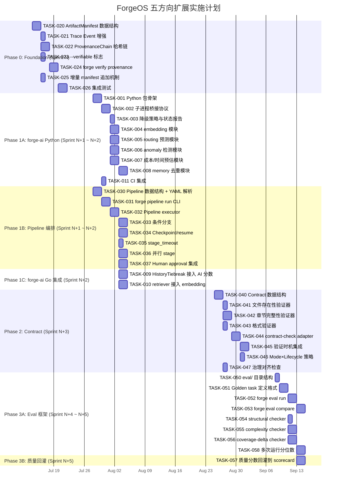

我已经通读了完整文档。下面以 Tech Lead 视角给出深度分析。

---

# Tech Lead 分析报告: 五方向高价值扩展

## 1. 任务分解

将五个方向拆解为 2-4 小时可完成的执行单元。每个任务包含准确的增改文件路径和验收标准。

### 方向一: forge-ai Python 智能层 (2–3 sprints)

| 任务 ID | 标题 | 涉及文件 | 前置 | 工时 | 验收标准 |
|---|---|---|---|---|---|
| **TASK-001** | `forge-ai/` Python 包骨架 | `forge-ai/pyproject.toml`, `forge-ai/src/forge_ai/__init__.py`, `forge-ai/src/forge_ai/cli.py` | 无 | 3h | `pip install -e forge-ai/` 成功，`python3 -m forge_ai --version` 输出 0.1.0 |
| **TASK-002** | forge-core ↔ forge-ai 子进程桥接协议 | `forge-core/internal/forgeai/bridge.go`, `forge-core/internal/forgeai/bridge_test.go` | TASK-001 | 4h | `bridge.Call("ping", nil)` 返回 `{"status":"pong"}`；Python 未安装时返回 `ErrPythonNotAvailable` |
| **TASK-003** | forge-ai 降级策略与状态报告 | `forge-core/internal/forgeai/status.go`, `forge-core/cmd/forge/status_ai.go` | TASK-002 | 2h | `forge status` 显示 `forge-ai: available` 或 `forge-ai: unavailable (python3 not found)` |
| **TASK-004** | embedding 模块: 语义检索 | `forge-ai/src/forge_ai/embedding/retriever.py`, `forge-ai/src/forge_ai/embedding/retriever_test.py` | TASK-001 | 4h | 给定 3 份 ADR，检索 "database choice" 返回含 "postgres" 的 ADR，TF-IDF 无法匹配但 embedding 能匹配 |
| **TASK-005** | routing 模块: 分数预测 | `forge-ai/src/forge_ai/routing/scorer.py`, `forge-ai/src/forge_ai/routing/scorer_test.py` | TASK-001 | 4h | 输入历史 scorecard JSON，输出模型推荐分数(0–1)；无历史数据时返回均匀分布 |
| **TASK-006** | anomaly 模块: trace 异常检测 | `forge-ai/src/forge_ai/anomaly/detector.py`, `forge-ai/src/forge_ai/anomaly/detector_test.py` | TASK-001 | 4h | 输入时序 trace 事件，输出异常分数；对延迟突增 3σ 事件标记 `ANOMALY` |
| **TASK-007** | predict 模块: 成本/时间预估 | `forge-ai/src/forge_ai/predict/estimator.py`, `forge-ai/src/forge_ai/predict/estimator_test.py` | TASK-001 | 3h | 给定 phase + model + 历史数据，输出预估耗时(ms)和成本(usd)；无历史时返回基于 model 定价表的基线 |
| **TASK-008** | memory 模块: 语义去重 | `forge-ai/src/forge_ai/memory/dedup.py`, `forge-ai/src/forge_ai/memory/dedup_test.py` | TASK-004 | 3h | 两条语义相同的 memory 条目(措辞不同)，dedup 输出合并建议 + 相似度分数 |
| **TASK-009** | routing.go HistoryTiebreak 接入 forge-ai 分数 | `forge-core/internal/routing/routing.go` (修改 historyTiebreak), `forge-core/internal/routing/routing_test.go` | TASK-005, TASK-002 | 3h | forge-ai available 时路由使用 AI 分数；unavailable 时降级到当前 binary 逻辑 |
| **TASK-010** | retriever.go 接入 forge-ai embedding | `forge-core/internal/prompt/retrieve.go` (新增 embedding 路径), `forge-core/internal/prompt/retrieve_test.go` | TASK-004, TASK-002 | 3h | forge-ai 可用时检索结果包含语义相关条目；不可用时纯 keyword 回退 |
| **TASK-011** | forge-ai CI 集成与测试 | `.github/workflows/forge-ai.yml` (新增), `forge-ai/requirements-dev.txt` | TASK-001 | 2h | CI 运行 `pip install` + `pytest`；仅限 Python 3.10–3.12 矩阵 |

### 方向二: Agent 输出溯源与可验证性 (1.5–2 sprints)

| 任务 ID | 标题 | 涉及文件 | 前置 | 工时 | 验收标准 |
|---|---|---|---|---|---|
| **TASK-020** | ArtifactManifest 数据结构与生成 | `forge-core/internal/provenance/manifest.go`, `forge-core/internal/provenance/manifest_test.go` | 无 | 3h | phase 完成后生成 `output.manifest.jsonl`，包含: phase name, agent, model, prompt hash(文件路径→SHA256), 每个 emit 文件的 SHA256 |
| **TASK-021** | Trace Event 增强: 关联 manifest seq | `forge-core/internal/trace/trace.go` (Event 加 ManifestSeq string), `forge-core/internal/trace/trace_test.go` | TASK-020 | 2h | trace Event 可关联到 manifest 行；空 seq 向后兼容 |
| **TASK-022** | ProvenanceChain: checkpoint 哈希链 | `forge-core/internal/provenance/chain.go`, `forge-core/internal/provenance/chain_test.go` | TASK-020 | 3h | 每个 checkpoint 记录 `previous_checkpoint_hash`；chain 完整性可通过遍历验证 |
| **TASK-023** | `--verifiable` 标志 & 条件性激活 | `forge-core/cmd/forge/main.go` (新增 flag), `forge-core/cmd/forge/run.go` (条件调用 manifest) | TASK-020 | 2h | 无 `--verifiable` 时零行为变化；有时 manifest 目录 `.forge/provenance/` 生成 |
| **TASK-024** | `forge verify provenance` 命令 | `forge-core/cmd/forge/verify_provenance.go`, `forge-core/internal/provenance/verify.go` | TASK-022, TASK-023 | 4h | 完整链→`VERIFIED`；缺失行→`INCOMPLETE` + 断裂点；文件被篡改→`TAMPERED` + 路径列表 |
| **TASK-025** | 增量 manifest 追加机制 | `forge-core/internal/provenance/append.go`, `forge-core/internal/provenance/append_test.go` | TASK-020 | 2h | 多次 `forge run` 不覆盖旧 manifest，追加新 block；manifest 有 block 分隔符和流水号 |
| **TASK-026** | 集成测试: 完整 provenance 生命周期 | `forge-core/internal/provenance/integration_test.go` | TASK-023, TASK-024, TASK-025 | 3h | `forge run --verifiable` → 手动修改 emit 文件 → `forge verify provenance` 报告 TAMPERED |

### 方向三: 跨 Workflow 管线编排引擎 (2 sprints)

| 任务 ID | 标题 | 涉及文件 | 前置 | 工时 | 验收标准 |
|---|---|---|---|---|---|
| **TASK-030** | `Pipeline` 数据结构 + YAML 解析 | `forge-core/internal/pipeline/types.go`, `forge-core/internal/pipeline/parse.go`, `forge-core/internal/pipeline/parse_test.go` | 无 | 4h | 解析 `.agent/pipelines/full-build.yml` 为 `Pipeline` 结构体；验证 stage 引用存在的 workflow |
| **TASK-031** | `forge pipeline run` CLI 入口 | `forge-core/cmd/forge/pipeline_run.go`, `forge-core/cmd/forge/main.go` (注册子命令) | TASK-030 | 3h | `forge pipeline run full-build` 加载 pipeline.yml 并按序执行 stage |
| **TASK-032** | Pipeline executor: stage 顺序执行 + 状态传递 | `forge-core/internal/pipeline/executor.go`, `forge-core/internal/pipeline/executor_test.go` | TASK-031 | 4h | Stage 1 完成后 stage 2 启动；产出路径传递；`on_success` 跳转正确 |
| **TASK-033** | 条件分支: `on_approve` / `on_redesign` | `forge-core/internal/pipeline/branch.go`, `forge-core/internal/pipeline/branch_test.go` | TASK-032 | 3h | review Stage 产出 APPROVED → 走 build；REDESIGN → 走 design |
| **TASK-034** | Pipeline checkpoint/resume | `forge-core/internal/pipeline/checkpoint.go`, `forge-core/internal/pipeline/resume.go` | TASK-032 | 4h | pipeline 中途 kill → 重新 `forge pipeline run full-build --resume` 从断点 stage 继续 |
| **TASK-035** | `stage_timeout` 与 pipeline 级超时 | `forge-core/internal/pipeline/timeout.go`, `forge-core/internal/pipeline/timeout_test.go` | TASK-032 | 2h | stage 超时→pipeline 标记 `STAGE_TIMEOUT` 并执行 `on_timeout` (默认: abort) |
| **TASK-036** | 并行 stage 支持 | `forge-core/internal/pipeline/parallel.go`, `forge-core/internal/pipeline/parallel_test.go` | TASK-032 | 4h | `parallel: [workflow: security-scan, workflow: unit-test]` 同时启动，等待全部完成 |
| **TASK-037** | Human approval 集成暂停/恢复 | `forge-core/internal/pipeline/approval.go`, `forge-core/internal/pipeline/approval_test.go` | TASK-032 | 3h | pipeline 遇到 `require: approval` 自动暂停；`forge pipeline approve <id>` 恢复；`forge pipeline reject <id>` 走 reject 分支 |

### 方向四: 阶段间工件契约系统 (1.5–2 sprints)

| 任务 ID | 标题 | 涉及文件 | 前置 | 工时 | 验收标准 |
|---|---|---|---|---|---|
| **TASK-040** | Contract 数据结构 + YAML 扩展 | `forge-core/internal/contract/types.go`, `forge-core/internal/asset/asset.go` (Phase 加 Contract 字段) | TASK-020 (provenance 的 hash 基础) | 3h | Phase YAML 解析 `output_contract` 和 `input_contract`；向后兼容旧 YAML |
| **TASK-041** | 内置验证器: 文件存在性 + min_files | `forge-core/internal/contract/checkers/existence.go`, `forge-core/internal/contract/checkers/existence_test.go` | TASK-040 | 2h | 声明 `min_files: 2` → 仅 1 个产出文件 → WARN/BLOCK |
| **TASK-042** | 内置验证器: 章节完整性 (markdown) | `forge-core/internal/contract/checkers/sections.go`, `forge-core/internal/contract/checkers/sections_test.go` | TASK-040 | 3h | `contains_sections: [Problem Statement, Target Users]` → 缺少任一则失败 |
| **TASK-043** | 内置验证器: 格式声明 (markdown/json/yaml) | `forge-core/internal/contract/checkers/format.go`, `forge-core/internal/contract/checkers/format_test.go` | TASK-040 | 2h | 声明 `format: json` → 文件不可解析为 JSON 则失败 |
| **TASK-044** | contract-check adapter (可插拔验证器) | `forge-core/internal/contract/adapter.go` | TASK-041, TASK-042, TASK-043 | 3h | 类似 lint/coverage adapter 模式；注册 checker → 执行 → 聚合结果；N/A checker 跳过 |
| **TASK-045** | 验证时机: gate phase 前 + agent phase 后 | `forge-core/internal/contract/timing.go`, `forge-core/cmd/forge/prompt_context.go` (注入验证) | TASK-044 | 3h | phase 前验证 input contract → 失败时 BLOCK；phase 后验证 output contract → 失败时 WARN/BLOCK 取决于 mode |
| **TASK-046** | Mode × Lifecycle 控制失败模式 | `forge-core/internal/contract/policy.go`, `forge-core/internal/contract/policy_test.go` | TASK-045 | 2h | mode=explorer → 默认 WARN；mode=engineering → 默认 BLOCK；均可显式覆盖 |
| **TASK-047** | `check_agent_contract_alignment` 治理规则 | `harness/check.py` (新增规则) | TASK-040 | 2h | 检测 agent 卡中的 promise 与 contract 声明是否一致；不一致时 `forge accept` WARN |

### 方向五: Agent 产出质量评测框架 (2 sprints)

| 任务 ID | 标题 | 涉及文件 | 前置 | 工时 | 验收标准 |
|---|---|---|---|---|---|
| **TASK-050** | `eval/` 目录结构与 registry | `eval/registry.yml`, `eval/tasks/.gitkeep`, `eval/checkers/.gitkeep`, `eval/README.md` | 无 | 2h | `forge eval list` 显示注册的 task 和 checker |
| **TASK-051** | Golden task 定义格式 | `forge-core/internal/eval/task.go`, `forge-core/internal/eval/parse.go`, `forge-core/internal/eval/parse_test.go` | TASK-050 | 3h | 解析 `generate-rest-api.yaml` 为 GoldenTask；包含 input spec、期望产出声明、checker 列表 |
| **TASK-052** | `forge eval run` 命令 | `forge-core/cmd/forge/eval_run.go`, `forge-core/cmd/forge/main.go` (注册 eval 子命令) | TASK-051 | 3h | `forge eval run generate-rest-api --model sonnet` 执行 agent + 运行 checker → 输出 json 报告 |
| **TASK-053** | `forge eval compare` 命令 | `forge-core/cmd/forge/eval_compare.go`, `forge-core/internal/eval/compare.go` | TASK-052 | 3h | `forge eval compare baseline candidate` 输出对比表: 各维度分数、delta、胜出方 |
| **TASK-054** | 内置 checker: structural (契约检查复用) | `eval/checkers/structural.mjs` (调用 contract 验证器) | TASK-044, TASK-051 | 2h | 复用 contract checker 对 golden task 产出做结构验证 |
| **TASK-055** | 内置 checker: complexity (diff 圈复杂度) | `eval/checkers/complexity.mjs`, `eval/checkers/complexity_test.mjs` | TASK-051 | 4h | 给定 agent 产出代码 diff，计算圈复杂度 delta；超过阈值扣分 |
| **TASK-056** | 内置 checker: test coverage delta | `eval/checkers/coverage-delta.mjs` (调用 `go test -cover`) | TASK-051 | 3h | 跑测试覆盖率；覆盖率下降 → 负分；上升 → 正分 |
| **TASK-057** | 质量分数回灌到 scorecard | `harness/scorecard.mjs` (quality_score 从 binary→vector), `forge-core/internal/routing/routing.go` (消费 vector) | TASK-004 (embedding), TASK-052 | 4h | scorecard.quality_score 从 0/1 变为 `{structural:0.8, complexity:0.6, coverage:0.9}`；HistoryTiebreak 使用加权和 |
| **TASK-058** | 多次运行取分位数 (N>=3) | `forge-core/internal/eval/run.go` (N 参数), `forge-core/internal/eval/stats.go` | TASK-052 | 3h | `forge eval run --n 5` 跑 5 次，报告 median/p10/p90，排除 outliers |

---

## 2. 执行顺序

### 任务依赖图

```mermaid
graph TD
    subgraph "Phase 0: Foundation (Sprint N)"
        T020["TASK-020: ArtifactManifest 数据结构"]
        T021["TASK-021: Trace Event 增强"]
        T022["TASK-022: ProvenanceChain 哈希链"]
        T023["TASK-023: --verifiable 标志"]
        T024["TASK-024: forge verify provenance"]
        T025["TASK-025: 增量 manifest 追加"]
        T026["TASK-026: 集成测试"]
    end

    subgraph "Phase 1: Parallel (Sprint N+1, N+2)"
        subgraph "Track 1A: forge-ai Python 层"
            T001["TASK-001: Python 包骨架"]
            T002["TASK-002: 子进程桥接协议"]
            T003["TASK-003: 降级策略与状态报告"]
            T004["TASK-004: embedding 模块"]
            T005["TASK-005: routing 预测"]
            T006["TASK-006: anomaly 检测"]
            T007["TASK-007: 成本/时间预估"]
            T008["TASK-008: memory 去重"]
            T011["TASK-011: CI 集成"]
        end

        subgraph "Track 1B: Pipeline 编排"
            T030["TASK-030: Pipeline 数据结构"]
            T031["TASK-031: forge pipeline run CLI"]
            T032["TASK-032: Pipeline executor"]
            T033["TASK-033: 条件分支"]
            T034["TASK-034: Checkpoint/resume"]
            T035["TASK-035: stage_timeout"]
            T036["TASK-036: 并行 stage"]
            T037["TASK-037: Human approval 集成"]
        end

        subgraph "Track 1C: forge-ai Go 集成"
            T009["TASK-009: HistoryTiebreak 接入"]
            T010["TASK-010: retriever 接入"]
        end
    end

    subgraph "Phase 2: Contract (Sprint N+3)"
        T040["TASK-040: Contract 数据结构"]
        T041["TASK-041: 文件存在性验证器"]
        T042["TASK-042: 章节完整性验证器"]
        T043["TASK-043: 格式验证器"]
        T044["TASK-044: contract-check adapter"]
        T045["TASK-045: 验证时机集成"]
        T046["TASK-046: Mode×Lifecycle 策略"]
        T047["TASK-047: 治理对齐检查"]
    end

    subgraph "Phase 3: Evaluation (Sprint N+4, N+5)"
        T050["TASK-050: eval/ 目录结构"]
        T051["TASK-051: Golden task 定义"]
        T052["TASK-052: forge eval run"]
        T053["TASK-053: forge eval compare"]
        T054["TASK-054: structural checker"]
        T055["TASK-055: complexity checker"]
        T056["TASK-056: coverage-delta checker"]
        T057["TASK-057: 质量分数回灌"]
        T058["TASK-058: 多次运行分位数"]
    end

    %% 跨阶段依赖
    T020 --> T022
    T020 --> T025
    T022 --> T024
    T023 --> T024
    T024 --> T026
    T025 --> T026

    T001 --> T002
    T002 --> T003
    T002 --> T004
    T002 --> T005
    T002 --> T006
    T002 --> T007
    T002 --> T008
    T004 --> T008
    T004 --> T010
    T005 --> T009
    T009 --> T057
    T002 --> T009
    T002 --> T010

    T030 --> T031
    T031 --> T032
    T032 --> T033
    T032 --> T034
    T032 --> T035
    T032 --> T036
    T032 --> T037

    T020 --> T040    %% provenance hash 是 contract 的基础
    T040 --> T041
    T040 --> T042
    T040 --> T043
    T041 --> T044
    T042 --> T044
    T043 --> T044
    T044 --> T045
    T044 --> T054
    T045 --> T046
    T045 --> T047

    T050 --> T051
    T051 --> T052
    T051 --> T054
    T051 --> T055
    T051 --> T056
    T052 --> T053
    T052 --> T058
    T052 --> T057
    T004 --> T057    %% embedding 用于语义评分
```

### 可并行执行的任务组

| 并行组 | 任务 | 说明 |
|---|---|---|
| **组 A** | TASK-020~026 | 方向二(溯源)全部，零外部依赖，独立人力 |
| **组 B1** | TASK-001~008, TASK-011 | 方向一(forge-ai Python 侧)，需要 1 Python dev |
| **组 B2** | TASK-030~037 | 方向三(pipeline 编排)，需要 1 Go dev |
| **组 C** | TASK-009~010 | 方向一(forge-ai Go 集成)，需等 TASK-002 完成，但与 B1/B2 并行 |
| **组 D** | TASK-040~047 | 方向四(契约)，需等 TASK-020 完成(provenance hash) |
| **组 E1** | TASK-050~056, TASK-058 | 方向五(eval 框架)，与组 D 可部分并行 |
| **组 E2** | TASK-057 | 质量分数回灌，需等 TASK-004(embedding) + TASK-052(eval run) |

---

## 3. 技术风险

### 3.1 高风险项

| 风险 | 方向 | 概率 | 影响 | 缓解策略 |
|---|---|---|---|---|
| **Python subprocess 开销** | 方向一 | 中 | 高 | 每次 forge-ai 调用有 50–200ms Python 启动延迟。缓解: (1) 长驻 Python 守护进程模式 (stdin/stdout JSON-RPC)； (2) 批量请求合并； (3) 预热的 `forge-ai daemon` 模式 |
| **embedding 模型体积过大** | 方向一 | 高 | 中 | `sentence-transformers/all-MiniLM-L6-v2` ~80MB 尚可，但更大模型 ~2GB。缓解: (1) 默认用轻量模型； (2) 首次下载提示； (3) 可选远程 API fallback |
| **Pipeline 状态一致性** | 方向三 | 中 | 高 | pipeline 中途崩溃后，已完成的 workflow 产出的文件需要和新 stage 的状态保持一致。缓解: 每个 stage commit 前做文件系统快照；resume 时恢复全部产出 |
| **并行 stage 文件冲突** | 方向三 | 低 | 高 | 两个并行 workflow 写入同一文件路径。缓解: 编译器级检测——解析所有 workflow 的 `emits:`，在 pipeline 加载时检测冲突并报错 |
| **Contract false positive 轰炸** | 方向四 | 中 | 中 | LLM 产出 markdown 偶尔缺少某个 heading 但内容正确。缓解: (1) 模糊匹配(大小写/近似)； (2) mode=explorer 默认 WARN； (3) 用户可调整 strictness 级别 per-contract |
| **评测分数不稳定** | 方向五 | 高 | 高 | LLM 随机性导致同 task+model 跑 3 次分数差异大。缓解: (1) N>=5 次运行取中位数； (2) 报告置信区间； (3) checker 本身要有确定性(避免调用 LLM 做评判) |
| **`forge verify` 性能** | 方向二 | 低 | 中 | 大项目 1000+ emit 文件 → SHA256 扫描。缓解: (1) 只扫描 `emits:` 声明的文件； (2) 增量 manifest 只追加新行不重算旧行 |

### 3.2 外部依赖风险

| 依赖 | 方向 | 风险等级 | 说明 |
|---|---|---|---|
| `python3` (>=3.10) | 方向一 | 低 | 已存在，但 FreeBSD/Windows 用户可能需要手动安装 |
| `scikit-learn`, `sentence-transformers` pip 包 | 方向一 | 中 | pip 安装可能因网络/平台失败；pyproject.toml 声明为 `extras` 可选依赖 |
| `go test -cover` 输出格式 | 方向五 | 低 | Go 版本差异(`-coverprofile` 格式稳定) |
| 文件系统原子性 | 方向二, 三 | 中 | manifest 写一半时 crash → 损坏。缓解: 写临时文件再 `os.Rename` 原子替换 |

### 3.3 性能关键路径

| 路径 | 风险 | 优化策略 |
|---|---|---|
| forge-ai 子进程调用(每 phase 多次) | Python 启动开销 | 守护进程模式 + 请求批处理 |
| manifest SHA256 计算(大文件) | 大文件(>10MB) 哈希慢 | 只对 emit 文件做，不做全仓库扫描 |
| Pipeline checkpoint 序列化 | 大 pipeline 状态 >1MB | 增量 checkpoint：只存 diff 而非全量 |
| eval 圈复杂度计算 | 大代码库 AST 解析慢 | 只计算 diff 行涉及的文件；缓存基线复杂度 |

---

## 4. 资源评估

### 4.1 人员需求

| 角色 | 技能要求 | 人数 | 负责方向 |
|---|---|---|---|
| **Senior Go 工程师 A** | Go 并发、CLI 设计、文件系统 I/O | 1 (全职) | 方向二(溯源) → 方向四(契约) → 方向三(管线) |
| **Senior Go 工程师 B** | Go + 子进程管理、CI 集成、测试 | 1 (全职) | 方向一(forge-ai Go 侧集成) → 方向三(管线剩余) |
| **Python/ML 工程师** | Python 包管理、scikit-learn、embedding 模型、统计 | 1 (Sprint N+1~N+2 全职) | 方向一(forge-ai Python 侧) |
| **全栈工程师 (Go + Node)** | Go CLI、Node.js harness 适配、YAML 处理 | 0.5 (兼职或间歇) | 方向五(eval checker 编写) + 方向四(adapter) |
| **QA 工程师** | 集成测试、性能基准、跨平台测试 | 1 (兼职，贯穿全程) | 全部五个方向的集成测试 |

**总计**: 2.5–3 FTE 全职 + 1 兼职 QA。

### 4.2 关键里程碑

| 里程碑 | 时间 | 交付物 | 判断标准 |
|---|---|---|---|
| **M0: Provenance MVP** | Sprint N + 1w | `forge run --verifiable` 生成 manifest；`forge verify provenance` 验证 | 集成测试全部通过 |
| **M1: forge-ai MVP** | Sprint N+2 末 | `forge-ai/` 包可 pip 安装；`bridge.Call` 可用；embedding 检索 + 路由评分可用 | 3 个 AI 模块 + 2 个 Go 集成点 |
| **M2: Pipeline MVP** | Sprint N+2 末 | `forge pipeline run full-build` 完整走通一条管线 | 5-stage pipeline 从 discover→evolve 自动完成 |
| **M3: Contract MVP** | Sprint N+3 末 | 契约验证在 gate 前后触发；false positive 率 <5% (在 10 个已有 workflow 上实测) | 契约检查不破坏现有 workflow |
| **M4: Eval MVP** | Sprint N+4 末 | `forge eval run` + `forge eval compare` 可用；3 个内置 checker | 可复现的跨 model 评测报告 |
| **M5: 质量回灌** | Sprint N+5 末 | `quality_score` 多维向量传入 scorecard；HistoryTiebreak 使用加权分数 | 路由选择可基于质量分数而非仅 binary pass/fail |

### 4.3 阻塞点 (Blockers)

| Blocker | 涉及方向 | 描述 | 解决策略 |
|---|---|---|---|
| **B1: Python 环境不在 PATH 中** | 方向一 | Windows 用户可能没有 `python3` 命令(只有 `python`)。 | bridge 先试 `python3` 再试 `python`；在文档中声明系统要求；`forge doctor` 检测 |
| **B2: embedding 模型下载网络受限** | 方向一 | 部分 CI/CD 环境无外网访问。 | 支持本地模型路径；`FORGE_AI_MODEL_PATH` 环境变量覆盖；离线模式仅用 TF-IDF |
| **B3: Pipeline DSL 语法稳定性** | 方向三 | DSL 在实现过程中可能频繁变更，导致 YAML 格式不稳定。 | 先冻结最小可用集(顺序/on_success/require approval)，在测试中锁定；后续扩展用 v2 字段 |
| **B4: contract checker 与 agent 卡不同步** | 方向四 | agent 责任人更新了 agent 卡但忘了更新 contract | TASK-047 的治理检查 + CI 告警 |
| **B5: eval golden task 与现实任务差距** | 方向五 | 评测分数漂亮但实际产出质量不高。 | golden task 由团队共同维护和定期更新；允许项目自定义 task |

---

## 5. 质量保证

### 5.1 单元测试覆盖要求

| 方向 | 包/模块 | 最低覆盖率要求 | 关键测试点 |
|---|---|---|---|
| 方向一 | `forge-core/internal/forgeai/bridge.go` | 90%+ | Python 可用/不可用/超时/输出格式错误 |
| 方向一 | `forge-core/internal/routing/routing.go` | 85%+ | HistoryTiebreak AI 分数接入 & 降级 |
| 方向一 | `forge-ai/*/` (Python) | 80%+ (pytest) | 边界输入、空输入、异常输入 |
| 方向二 | `forge-core/internal/provenance/*` | 90%+ | 空文件、大文件、链断裂、TAMPERED 检测 |
| 方向三 | `forge-core/internal/pipeline/*` | 85%+ | 顺序/分支/并行/超时/恢复/审批暂停 |
| 方向四 | `forge-core/internal/contract/*` | 90%+ | 每种 checker 的 pass/fail/skip 路径 |
| 方向五 | `forge-core/internal/eval/*` | 85%+ | 多种 checker 聚合、N 次运行统计 |
| 方向五 | `eval/checkers/*` (Node) | 80%+ | 各自 checker 逻辑 |

### 5.2 集成测试策略

```
tests/
  integration/
    provenance_test.go        # 方向二: forge run --verifiable → modify → verify
    forgeai_bridge_test.go    # 方向一: bridge.Call 各种场景
    pipeline_test.go          # 方向三: 7 种 pipeline 拓扑(顺序/分支/并行/超时/恢复/审批/混合)
    contract_test.go          # 方向四: 10 个现有 workflow 的契约验证(零 breakage)
    eval_test.go              # 方向五: golden task 全流程
```

每个集成测试:
- **不依赖外部网络**: mock LLM 调用，使用预录好的 LLM 响应
- **在临时 git repo 中运行**: `git init` + 提交初始文件 → 执行 forge → 验证输出
- **跨平台 CI**: Ubuntu 22.04 + macOS 14 + Windows Server 2022

### 5.3 代码审查要点

| 审查重点 | 方向 | 具体检查项 |
|---|---|---|
| **降级路径完整性** | 方向一 | Python 不可用时 forge-core 不 panic/crash/stall，静默降级 |
| **向后兼容性** | 方向二, 四 | 无 `--verifiable` / 无 contract 声明 → 零行为变化 |
| **原子性** | 方向二, 三 | manifest 写入、checkpoint 保存使用 write-then-rename |
| **DSL 设计** | 方向三, 四 | YAML 格式向后兼容(新字段可选，旧字段 deprecated 有迁移路径) |
| **并发安全** | 方向一, 三 | bridge 调用是串行还是并行？pipeline executor 的 stage 并发安全？ |
| **错误消息** | 全部 | forge verify 的 TAMPERED 消息必须明确告知哪个文件、预期 hash、实际 hash |
| **测试独立性** | 全部 | 每个测试独立创建/销毁临时目录，不依赖全局状态 |

### 5.4 性能测试需求

| 测试场景 | 方向 | 指标 | 目标 |
|---|---|---|---|
| bridge 调用延迟 (cold start) | 方向一 | P95 延迟 | <500ms |
| bridge 调用延迟 (warm, daemon mode) | 方向一 | P95 延迟 | <50ms |
| manifest SHA256 1000 files (100KB avg) | 方向二 | 总耗时 | <5s |
| pipeline checkpoint serialize 100 stage | 方向三 | 耗时 | <100ms |
| contract validate 50 files (markdown section check) | 方向四 | 耗时 | <2s |
| eval complexity checker (100 Go files) | 方向五 | 耗时 | <10s |

---

## 6. 实施计划

### 甘特图



### 阶段详情

#### 阶段 0: 基础设施搭建 (Sprint N, ~2 周)

**目标**: 先跑通方向二(溯源)——零外部依赖、最小阻力路径，快速建立信任。

**关键交付**:
- ArtifactManifest 在 phase 完成后生成
- ProvenanceChain 在 checkpoint 时建链
- `forge verify provenance` CLI 命令
- 集成测试验证完整周期

**退出标准**:
```
$ forge run --verifiable discover --mode engineering
$ echo "malicious change" >> docs/discovery/prd.md
$ forge verify provenance docs/discovery/prd.md
→ TAMPERED: expected 3a1b2c, actual 9f8e7d
```

**风险控制**: 所有 manifest 写操作使用原子 `write-then-rename`；manifest 损坏不影响 forge-core 主流程。

#### 阶段 1: 核心功能实现 (Sprint N+1 ~ N+2, ~4 周)

**目标**: forge-ai Python 层 + Pipeline 编排并行推进。

**并行 Track A — forge-ai (2 人)**:
- **Sprint N+1 周 1**: Python 包骨架 → 子进程桥接协议 → 降级策略。第 1 周结束时可 `bridge.Call("ping")`
- **Sprint N+1 周 2**: embedding 模块 + routing 模块。第 2 周结束时可语义检索 ADR
- **Sprint N+2 周 1**: anomaly + predict + memory 模块
- **Sprint N+2 周 2**: Go 侧集成(HistoryTiebreak + retriever) + CI 集成

**并行 Track B — Pipeline (1 人)**:
- **Sprint N+1 周 1**: Pipeline 数据结构 + YAML 解析 + CLI
- **Sprint N+1 周 2**: Pipeline executor (顺序执行)
- **Sprint N+2 周 1**: 条件分支 + checkpoint/resume
- **Sprint N+2 周 2**: 并行 stage + human approval + stage_timeout

**关键集成点**:
```
# Sprint N+2 末可运行
$ forge pipeline run full-build
→ discover → design → (pause for approval) → review → build → evolve
```

**退出标准**:
- 5-stage pipeline 完整走通
- `bridge.Call("embedding", ...)` 返回语义检索结果
- `forge status` 显示 forge-ai available/unavailable

#### 阶段 2: 契约系统 (Sprint N+3, ~2 周)

**目标**: 防止"垃圾进垃圾出"在阶段间扩散。

**执行步骤**:
1. **第 1 天**: Contract 数据结构 + Phase 扩展 Phase 加 `input_contract`/`output_contract` 字段
2. **第 2-3 天**: 三个内置 checker (file existence / markdown sections / format validation)
3. **第 4-5 天**: contract-check adapter (类似 lint/coverage 可插拔模式)
4. **第 6-8 天**: 验证时机集成到 phase 前后
5. **第 9-10 天**: mode×lifecycle 策略 + 治理对齐检查

**关键红线**: 对现有 10 个 workflow 零 breakage。在每个 workflow 上跑 `forge run` 验证契约不存在时不产生任何额外行为。

**退出标准**:
```
# 向 discover.yml 添加 output_contract → forge run 自动验证
# 缺少 Problem Statement 章节 → mode=explorer 时 WARN, mode=engineering 时 BLOCK
```

#### 阶段 3: 质量评测 + 回灌 (Sprint N+4 ~ N+5, ~4 周)

**目标**: 从 binary pass/fail → 可度量的多维质量。

**Sprint N+4 (Eval 框架)**:
- 第 1 周: eval 目录结构 + golden task 定义 + `forge eval run`
- 第 2 周: `forge eval compare` + 3 个内置 checker (structural, complexity, coverage-delta)

**Sprint N+5 (质量回灌)**:
- 第 1 周: 多次运行取分位数 (N>=5)
- 第 2 周: `quality_score` 从 binary → 多维向量，回灌到 scorecard，HistoryTiebreak 使用加权分数

**退出标准**:
```
$ forge eval run generate-rest-api --model sonnet --n 5
→ {structural: 0.85, complexity: 0.72, coverage: 0.91, iterations: 3}

$ forge eval compare baseline candidate
→ candidate wins in 3/4 dimensions

$ forge run build --mode engineering
# 内部: HistoryTiebreak 使用 quality_score 向量做模型选择
```

---

## 7. 补充建议

### 7.1 按影响范围排序的交付顺序

如果资源受限需要裁剪，按以下优先级切:

| 优先级 | 保留 | 可推迟 | 说明 |
|---|---|---|---|
| 🔴 Must have | 方向二(溯源) | — | 合规/安全的阻塞级缺口，无依赖，零成本启动 |
| 🟠 Should have | 方向三(pipeline) | — | P1 级，"5 个手动步骤"是 UX 阻塞点 |
| 🟡 Could have | 方向一(forge-ai) | 方向一的 anomaly + predict 模块 | routing + embedding 是核心；anomaly/predict 可 v1.1 |
| 🟢 Nice to have | 方向四(契约) | 方向四严格模式(BLOCK)在 engineering mode 外的场景 | WARN-only 先发，BLOCK 后延 |
| ⚪ Deferred | 方向五(质量评测) | 方向五的 scorecard 回灌 | eval 框架先做；回灌到 routing 需等 forge-ai embedding 稳定 |

### 7.2 跨方向协同机会

1. **provenance hash → contract 验证**: manifest 中的 SHA256 可以作为 contract 验证的输入("这个文件自 phase X 完成后未被修改")
2. **forge-ai embedding → eval 语义评分**: embedding 相似度可以用于 eval 的"语义一致性" checker
3. **pipeline checkpoint → provenance chain**: checkpoint 本身就是 provenance chain 的天然消费者，记录 pipeline stage 的 provenance
4. **contract sections → eval structural checker**: contract 的章节验证器可以直接复用为 eval 的 structural checker

### 7.3 推荐避免的陷阱

| 陷阱 | 说明 |
|---|---|
| **forge-ai 用 protobuf** | JSON 够用，protobuf 引入编译依赖，违背"零外部依赖"原则 |
| **pipeline DSL 图灵完备** | 不要 if/else/for/while，用有限的状态机表达管线拓扑 |
| **provenance 用区块链** | 唱得太高——SHA256 链式哈希足够，无分布式共识需求 |
| **eval 用 LLM-as-judge** | 引入 LLM 做评测会带来不可复现性；优先确定性 checker |

---

**总结**: 本文档中的五个方向定位精准——它们都落在"系统内部修补"和"外部世界未检验假设"之间的盲区。作为执行计划，**建议从方向二(溯源)立即启动 Sprint N**，其余方向按上述阶段推进。方向一(forge-ai)和方向三(pipeline)在 Sprint N+1 并行启动，对人力是最大的考验——需要确保 Senior Go 工程师 B 和 Python/ML 工程师同时到位。
