现在我已充分理解代码库和文档。让我系统性地进行 Tech Lead 分析。

---

# Tech Lead 分析：五项结构性缺口

## 1. 任务分解

将每个方向拆解为 2–4 小时可独立完成的可执行工作单元。

### 方向五：Checkpoint/Resume 外部状态一致性（P0）— 最高执行优先级

| 任务 ID | 标题 | 涉及文件 | 前置依赖 | 预估(h) |
|---|---|---|---|---|
| TASK-501 | **运行身份生成与存储路径**：给每个 `forge run/evolve` 分配 UUID run_id；在 `.forge/runs/<run_id>/` 下隔离 checkpoint/trace/memory | `cmd/forge/evolve.go`, `cmd/forge/main.go`, `internal/persist/*` | 无 | 3 |
| TASK-502 | **Execution Manifest 格式**：定义 `Manifest` 结构体（git HEAD、workflow content hash、project.yml hash、run_id、起始时间）；原子写入 `.forge/manifest.json` | `internal/persist/manifest.go`（新建） | TASK-501 | 3 |
| TASK-503 | **Resume 一致性检查**：`--resume` 时加载 Manifest，比对 git HEAD / workflow hash / project.yml hash；不一致则 WARN + 拒绝（除非 `--force`） | `cmd/forge/evolve.go`, `cmd/forge/main.go` | TASK-502 | 3 |
| TASK-504 | **文件系统基线快照**：在首个实现相位前记录 `readonly: false` 目录树的文件列表 + mtime；resume 时 baselines 检测外部改动 | `cmd/forge/evolve.go`, `internal/persist/baseline.go`（新建） | TASK-501 | 4 |
| TASK-505 | **Workflow 版本验证**：checkpoint 增加 `workflow_content_hash`；resume 时验证当前 workflow 文件内容是否匹配 | `internal/persist/checkpoint.go`, `cmd/forge/evolve.go` | TASK-502 | 2 |
| TASK-506 | **`forge status` 命令**：列出 `.forge/runs/` 下所有活跃/最近运行的状态（live/completed/crashed） | `cmd/forge/main.go`, `cmd/forge/status.go`（新建） | TASK-501 | 3 |

### 方向一：相位级副作用问责与补偿（P0）

| 任务 ID | 标题 | 涉及文件 | 前置依赖 | 预估(h) |
|---|---|---|---|---|
| TASK-101 | **CommandExecutor diff 审计**：agent 命令执行前后计算 git diff 基线 → diff，产出 `FileDelta`（创建/修改/删除的文件列表） | `internal/orchestrator/command_executor.go`（如存在；否则 `internal/orchestrator/exec.go`）, `internal/asset/asset.go` | 无 | 4 |
| TASK-102 | **`compensate_phase` schema**：`asset.Phase` 增加可选字段 `CompensatePhase string` 和 `EmitCompensation []string`；workflow YAML 解析支持 | `internal/asset/asset.go`, `internal/asset/asset_fields.go` | 无 | 2 |
| TASK-103 | **补偿执行引擎**：编排引擎在 `on_fail.loop_back` / `on_rejected` 触发时，先执行相位声明的补偿相位再跳转；串行 + 并行补偿顺序契约 | `internal/orchestrator/orchestrator.go`, `internal/orchestrator/parallel.go` | TASK-101, TASK-102 | 4 |
| TASK-104 | **`emits` 硬契约**：`emitsContext` 增加 `required_gates` / `emits_optional` 感知；`mode >= balanced` 时缺失 emits 文件导致相位 FAIL（除非 optional） | `cmd/forge/prompt_artifacts.go` | 无 | 3 |
| TASK-105 | **只读强制审计**：非 claude executor 路径上，`readonly: true` 相位执行后检测 diff；有改动则记录审计事件 + WARN | `cmd/forge/prompt_artifacts.go`, `internal/orchestrator/exec.go` | TASK-101 | 2 |

### 方向二：跨相位数据溯源（P1）— 方向一的数据基础

| 任务 ID | 标题 | 涉及文件 | 前置依赖 | 预估(h) |
|---|---|---|---|---|
| TASK-201 | **emits 内容哈希 + 溯源标记**：`emitsContext` 返回带 `[context:emit:FILENAME:SHA256:PHASE]` 标记的块；下游 prompt 中可见版本信息 | `cmd/forge/prompt_artifacts.go` | 无 | 3 |
| TASK-202 | **相位输出依赖版本键**：`phaseOutputLedger` 的 key 从 `phase name` 改为 `(name, iteration, loopBackCount)`；loop-back 后读取自动获得新版本 | `cmd/forge/prompt_memory.go`, `cmd/forge/prompt_context.go` | 无 | 3 |
| TASK-203 | **跨文件一致性检查**：相位声明 `emit_group` 时，编排引擎检查同一 group 的所有文件是否来自同一迭代；不一致则 WARN | `cmd/forge/prompt_artifacts.go`, `internal/asset/asset.go` | TASK-201 | 3 |

### 方向四：预测性预算经济学（P1）

| 任务 ID | 标题 | 涉及文件 | 前置依赖 | 预估(h) |
|---|---|---|---|---|
| TASK-401 | **相位级成本模型**：基于已有 scorecard 数据（`avg_cost_usd`/`DurationMs`）构建每个 `(phase_name, agent, tier)` 的预期成本查找表 | `internal/routing/scorecard.go`, `cmd/forge/engine_build.go` | 无 | 3 |
| TASK-402 | **`forge preflight build` 成本输出**：读取 workflow YAML → 查询成本模型 → 输出预期成本拆分表（planner/implementer/reviewer 各多少钱） | `cmd/forge/preflight.go` | TASK-401 | 3 |
| TASK-403 | **相位级预算预留**：`runBudget` 支持相位级分配：`phase_budget_usd` + `budget_reserve_pct`；预留预算不被其他相位挪用，剩余预算支持回拨 | `cmd/forge/cost.go` | TASK-401 | 4 |
| TASK-404 | **成本引导的 phase ordering advisory**：`forge evolve` 中，若剩余预算 < 下一完整迭代预期成本，触发 advisory（建议缩小 scope / 降 tier / 追加预算） | `cmd/forge/evolve.go`, `cmd/forge/cost.go` | TASK-401, TASK-403 | 3 |

### 方向三：Memory 知识生命周期管理（P2）— 审后降级

| 任务 ID | 标题 | 涉及文件 | 前置依赖 | 预估(h) |
|---|---|---|---|---|
| TASK-301 | **矛盾检测引擎**：`memory.Contradict(entries []Entry) []ContradictionGroup`——检测同一 Kind+Topic 下 Detail 语义对立的条目对；先基于关键词启发式，后续可扩展为 embedding 化 | `internal/memory/memory.go`, `internal/memory/contradiction.go`（新建） | 无 | 4 |
| TASK-302 | **Confidence 加权 Query 排序**：`memory.Query` 排序公式改为 `relevance × (0.5 + 0.5 × confidence) × decay(age)`；高置信度近期条目优先出现在 prompt | `internal/memory/memory.go` | 无 | 3 |
| TASK-303 | **知识来源追溯**：`Entry` 增加 `SourceRunID`, `SourcePhase`, `SourceModel` 字段；`Load`/`Query` 支持按来源过滤 | `internal/memory/memory.go` | 无 | 2 |
| TASK-304 | **利用 Supersedes 机制进行知识策展增强**：基于已有 `filterSuperseded` 机制，增加 Prompt 层告知 agent 某条目被 superseded 的元信息（而非静默过滤）；增加显式 `supersede` CLI 子命令 | `internal/memory/memory.go`, `cmd/forge/migrate.go` 或新子命令 | 无 | 3 |
| TASK-305 | **`memory compact` 质量感知增强**：`summarizeBlock` 在摘要中包含 contradiction 标记 + confidence 范围；不把被 superseded 的旧条目写入摘要 | `internal/memory/memory_compact.go` | TASK-301, TASK-304 | 3 |

---

## 2. 执行顺序

```mermaid
graph TD
    %% === Group: Infrastructure (Phase 0) ===
    subgraph Phase0["阶段 0：基础架构（可并行）"]
        T501["TASK-501: 运行身份生成与存储路径"]
        T504["TASK-504: 文件系统基线快照"]
        T101["TASK-101: CommandExecutor diff 审计"]
        T102["TASK-102: compensate_phase schema"]
        T201["TASK-201: emits 内容哈希 + 溯源标记"]
        T202["TASK-202: 相位输出依赖版本键"]
        T301["TASK-301: 矛盾检测引擎"]
        T302["TASK-302: Confidence 加权 Query"]
        T303["TASK-303: 知识来源追溯"]
        T401["TASK-401: 相位级成本模型"]
    end

    %% === Direction 5 chain ===
    T501 --> T502["TASK-502: Execution Manifest 格式"]
    T502 --> T503["TASK-503: Resume 一致性检查"]
    T502 --> T505["TASK-505: Workflow 版本验证"]
    T501 --> T506["TASK-506: forge status 命令"]
    T504 --> T503

    %% === Direction 1 chain ===
    T101 --> T103["TASK-103: 补偿执行引擎"]
    T102 --> T103
    T101 --> T105["TASK-105: 只读强制审计"]
    T104["TASK-104: emits 硬契约"] --- T201
    
    %% === Direction 2 chain ===
    T201 --> T203["TASK-203: 跨文件一致性检查"]
    T202 --> T203

    %% === Direction 4 chain ===
    T401 --> T402["TASK-402: forge preflight 成本输出"]
    T401 --> T403["TASK-403: 相位级预算预留"]
    T401 --> T404["TASK-404: 成本引导 phase ordering"]

    %% === Direction 3 chain ===
    T301 --> T305["TASK-305: compact 质量感知增强"]
    T304["TASK-304: Supersedes 策展增强"] --> T305

    %% === Cross-direction dependencies ===
    T201 -.-> T104["TASK-104 依赖 emits 溯源"]
    T202 -.-> T103["TASK-103 补偿需要版本感知"]
    
    %% === Style ===
    classDef p0 fill:#e74c3c,color:#fff,stroke:#c0392b
    classDef p1 fill:#e67e22,color:#fff,stroke:#d35400
    classDef p2 fill:#3498db,color:#fff,stroke:#2980b9
    classDef parallel fill:#2ecc71,color:#fff,stroke:#27ae60

    class T501,T502,T503,T504,T505,T506,T101,T102,T103,T104,T105 p0
    class T201,T202,T203,T401,T402,T403,T404 p1
    class T301,T302,T303,T304,T305 p2
    class T501,T504,T101,T102,T201,T202,T301,T302,T303,T401,T104 parallel
```



---

## 3. 技术风险

### 风险矩阵

| # | 风险 | 方向 | 概率 | 影响 | 缓解策略 |
|---|---|---|---|---|---|
| R1 | **并行编排中补偿执行顺序竞态**：`parallel.go` 中并发相位执行，补偿相位可能与正在运行的相位交错，undo 时机不确定 | D1 | 中 | **P0 严重** | 补偿相位在并行模式中降级为串行执行（等待所有并发相位完成后，按拓扑序逐串行执行补偿）；在并行锁顺序契约（`parallel.go:30-56`）中增加补偿锁层级 |
| R2 | **Manifest 拒绝恢复导致数据丢失**：用户 git checkout 了不同分支后 `--resume`，Manifest 不匹配 → 拒绝恢复 → 用户丢失整个 checkpoint 进度 | D5 | 高 | 中 | 实施最小破坏策略：默认 WARN + 强制 `--force` 才能继续；提供 `--resume --ignore-manifest` 紧急逃生门 |
| R3 | **emits 硬契约破坏现有 workflow**：现有 workflow 中某些 emits 文件是在特定阶段才生成的，`mode >= balanced` 的缺失 FAIL 可能导致已有运行中断 | D1 | 高 | 中 | 默认所有 emits 为 `emits_optional: true`（向后兼容）；仅当 workflow 显式声明 `emits_required: true` 时才 FAIL |
| R4 | **矛盾检测的假阳性/假阴性**：启发式关键词矛盾检测（"use JWT" vs "use OAuth2"）在语义复杂场景下可能漏检或误报 | D3 | 中 | 低 | 第一期采用关键词启发式（精确冲突词汇表）；第二期可选 embedding 语义比较（非阻塞）；矛盾集标记为 `[unverified contradiction]`，让 agent 自行判断 |
| R5 | **scorecard 历史数据不足**：`examples/go-taskd` 和 `url-shortener` 的运行历史可能不足以构建统计上显著的成本预测模型 | D4 | 中 | 中 | 初始成本模型基于默认值（Claude tier 官方定价 × 典型 prompt token 数 × 相位数）；scorecard 数据充足后自动替换 |
| R6 | **`.forge/runs/<run_id>/` 隔离导致 path 膨胀**：运行产生大量隔离子目录却没有清理机制 | D5 | 低 | 低 | `forge status` 同时提供 `forge clean --runs N`（保留最近 N 次运行，清理更早的） |
| R7 | **文件系统基线快照在大型仓库上的性能**：`forge run` 启动前递归扫描整个目录树可能很慢（100k+ 文件） | D5 | 中 | 低 | 基线快照仅在首个实现相位前执行一次；使用 `.gitignore` 过滤忽略文件；大型仓库可选择 `--no-baseline` 跳过 |

### 关键技术难点

1. **补偿动作的顺序契约**：在串行模式中，补偿相位作为跳转前的同步原语执行。在并行模式中，多个并发相位的补偿可能冲突。**方案**：补偿阶段总是串行执行——`RunParallel` 在 wave 完成后（所有并发相位结束）、跳转之前，以单 goroutine 拓扑序执行补偿相位。这样完全避免并发补偿竞态。

2. **Manifest 的降级路径设计**：完全不匹配 → 拒绝（除非 `--force`）；部分匹配（某些文件匹配但 git HEAD 变了）→ WARN + 提示风险 + 可选 `--resume --accept-drift`。checkpoint 本身永远不被 Manifest 删除——用户总可以手动 `--resume --ignore-manifest`。

3. **`phaseOutputLedger` 在并发相位下的版本键一致性**：当前 `phaseOutputLedger.record` 已经使用 mutex。新的版本键 `(name, iteration, loopBackCount)` 要求 loop-back 后新建 ledger 实例，而非复用旧的。`evolve.go` 在触发 loop-back 时需要 `newPhaseOutputLedger()`。

---

## 4. 资源评估

### 人员技能要求

| 角色 | 数量 | 关键技能 | 负责任务 |
|---|---|---|---|
| **Go 后端工程师** | 2 人 | Go 标准库、并发编程（sync.Mutex/goroutine）、JSON 序列化、文件系统 IO、git 操作 | TASK-501~506, TASK-101~105, TASK-401~404 |
| **Go 中/高级工程师** | 1 人 | 系统设计、schema 设计、memory 数据结构、编排引擎 | TASK-201~203, TASK-301~305 |
| **QA 工程师** | 1 人（50%） | 集成测试、边界场景测试、故障注入 | 所有任务的测试覆盖 |
| **技术写手** | 1 人（25%） | 更新 workflow YAML schema 文档、用户可见错误消息、CLI --help | 文档 + error message 审核 |

### 关键里程碑

| 里程碑 | 预计耗时（人·周） | 可交付物 |
|---|---|---|
| **M1：方向五基础（运行隔离 + Manifest）** | 1 周（2 人） | TASK-501~502 完成；`.forge/runs/<run_id>/` 隔离 + Manifest 写入 + 基本 resume 检查 |
| **M2：方向五完成（全量一致性保护）** | 2 周（2 人） | TASK-503~506 完成；`forge status` 可用；crash→resume 端到端测试 |
| **M3：方向一核心（diff + 补偿）** | 2 周（2 人） | TASK-101~103 完成；补偿相位可执行；YAML schema 更新 |
| **M4：方向一额外（emits 硬契约 + 只读审计）** | 1 周（1 人） | TASK-104~105 完成；向后兼容 |
| **M5：方向二（数据溯源）** | 1 周（1 人） | TASK-201~203 完成；emits 哈希标记 + 版本键 + 一致性检查 |
| **M6：方向四（预算经济学）** | 1.5 周（1 人） | TASK-401~404 完成；`forge preflight build` 成本输出 |
| **M7：方向三（Memory 策展）** | 1.5 周（1 人） | TASK-301~305 完成；矛盾检测 + 策展增强 |
| **M8：整体集成 + QA** | 1 周（3 人） | 全方向端到端集成测试；性能回归测试；文档定稿 |

**合计预计**: 10–11 人·周（约 2.5 人月）

### 阻塞点与解决策略

| 阻塞点 | 方向 | 解决策略 |
|---|---|---|
| **B1：Go `os/exec` 无内置 diff 能力** | D1 | 使用 `git diff --name-only HEAD`（同现有 `computeFileDelta`）；无 git 环境回退到 `os.Stat` 前后比较 mtime + size（粗粒度但零依赖） |
| **B2：非 git 仓库无 diff 基线** | D1, D5 | git 为主模式（ForgeOS 假设 git 作为版本控制）；无 git 时仅做 file-exists 检查（降级），WARN 告知用户 git 为推荐运行环境 |
| **B3：Manifest 中 git HEAD 在 detached HEAD 状态下无法唯一标识状态** | D5 | 使用 `git rev-parse HEAD`（commit hash）+ `git diff --quiet || echo dirty`（检测 uncommitted changes）。detached HEAD + dirty 时高阻标志 |
| **B4：scorecard 中 avg_cost_usd 可能为空（dry-run 无真实成本）** | D4 | 初始化成本使用 tier 官方定价 × 估算 token 数；scorecard 数据积累后自动替换。`forge preflight` 明确标注 estimated vs historical |

---

## 5. 质量保证

### 单元测试覆盖要求

| 包 | 文件 | 新增测试用例 | 最低覆盖目标 |
|---|---|---|---|
| `internal/persist` | `manifest.go`（新建） | Manifest 编解码、内容哈希匹配/不匹配、文件缺失、目录创建 | 90% |
| `internal/persist` | `baseline.go`（新建） | 基线快照创建、比对、外部修改检测、.gitignore 过滤 | 90% |
| `internal/persist` | `checkpoint.go` | workflow hash 版本匹配/不匹配、向后兼容（旧无 hash 字段） | 90% |
| `internal/memory` | `memory.go` | Contradict 检测、Confidence 加权排序、Source 过滤 | 90% |
| `internal/memory` | `memory_compact.go` | 摘要包含 contradiction 标记、confidence 范围、superseded 过滤 | 90% |
| `internal/orchestrator` | `orchestrator.go` / `parallel.go` | 补偿相位串行执行、loop-back 触发补偿、并行→补偿降级 | 85% |
| `cmd/forge` | `prompt_artifacts.go` | emits 硬契约（缺失 FAIL、optional 跳过）、内容哈希标记 | 85% |
| `cmd/forge` | `prompt_memory.go` | 版本键 loop-back 后新实例、context() 渲染带版本 | 85% |
| `cmd/forge` | `cost.go` | 相位级预算分配、预留回拨、budget_reserve_pct | 85% |
| `cmd/forge` | `preflight.go` | 成本预测输出（estimated vs historical） | 80% |
| `cmd/forge` | `evolve.go` | resume 一致性检查、Manifest 拒绝 + --force 覆盖 | 80% |

### 集成测试策略

| 场景 | 测试方法 | 关键断言 |
|---|---|---|
| **crash → resume 场景 A**（手工修改） | 1) `forge run build` 启动 → 2) 模拟 crash 删除进程 → 3) 手工修改文件 → 4) `forge run build --resume` | Manifest 拒绝恢复（除非 `--force`） |
| **crash → resume 场景 C**（git HEAD 漂移） | 1) 运行开始时记录 HEAD → 2) git reset --hard HEAD~1 → 3) --resume | Manifest 检测 HEAD 变化 + 拒绝 |
| **并行运行隔离** | 同时启动两个 `forge run build` 在同一目录 | `.forge/runs/<run_id_1>/` 与 `.forge/runs/<run_id_2>/` 完全隔离 |
| **相位补偿执行** | 1) YAML 定义补偿相位 → 2) 触发 loop-back → 3) 确认补偿先执行 | 补偿相位输出在 loop-back 目标前可见 |
| **emits 硬契约** | `mode=balanced` + 缺失 emits 文件 | 相位 FAIL（non-optional）或 pass + WARN（optional） |
| **Memory 矛盾检测** | 写入两条矛盾条目 → `Contradict()` | 检测到矛盾集 + prompt 附加 `[unverified contradiction]` |
| **预算预留** | 设置 `budget_reserve_pct=30` 给 reviewer + 总预算刚好覆盖 reviewer | reviewer 不被较早的便宜相位超支截停 |
| **`forge preflight build` 成本输出** | 解析 build.yml 的 7 个相位 | 输出包含 7 行预期成本 + 总计 + 标注估计来源（estimated/historical） |

### 代码审查要点

| 审查维度 | 重点方向 | 必查清单 |
|---|---|---|
| **向后兼容** | 全部 | 旧 workflow YAML 是否仍然无修改运行？旧的 checkpoint 文件在没有 `workflow_content_hash` 字段时是否能正常 Load？旧的 memory 存储加新字段后是否能 decode？ |
| **并发安全** | D1, D2, D5 | 所有新 mutable 状态是否记录了锁顺序？parallel.go 的锁顺序契约是否更新？补偿阶段是否在 wave 结束后串行执行？ |
| **无外部依赖** | 全部 | 新代码是否引入外部依赖？纯 Go 标准库 + JSON（无 protobuf/gRPC/YAML parser） |
| **错误处理** | 全部 | 所有文件操作是否有 errors.Is(err, fs.ErrNotExist) 检查？Manifest 缺失是 first-run 还是 corruption？WARNING 是否从不 abort 循环（fail-loud-and-continue 一致性）？ |
| **测试覆盖** | 全部 | 每个新 public 函数是否都有单元测试？Manifest diff 场景 A/B/C 是否都有集成测试？ |

### 性能测试需求

| 测试 | 方法 | 通过标准 |
|---|---|---|
| 基线快照延迟 | 在 `examples/`（~200 文件）和模拟大仓库（50k 文件）上测试 `os.Stat` 递归扫描时间 | 200 文件 < 10ms；50k 文件 < 500ms（使用 `.gitignore` 过滤后） |
| manifest 写入/读取延迟 | 循环 1000 次 Save/Load | 平均 < 1ms |
| memory 矛盾检测延迟 | 1000 条 entry × 10 topic 上执行 Contradict | 总时间 < 50ms（关键词启发式） |
| 成本模型查询延迟 | 1000 次查询 `(phase, agent, tier) → cost` | 平均 < 100μs（预计算查找表） |

---

## 6. 实施计划

### 时间线（按日历周，假设 2 名 Go 工程师全职 + 1 名 50%）

```
周次    1     2     3     4     5     6     7     8
Phase0  ████████████
Phase1          ████████████████
Phase2                        ████████████
Phase3                                  ████████
Phase4                                      ████
```

### 阶段 1：基础设施搭建（周 1–2）— 可并行执行

```
周 1:  
  ├── TASK-501 (运行身份 + 隔离路径)     ← 工程师 A (2天)
  ├── TASK-504 (文件系统基线)             ← 工程师 A (2天)
  ├── TASK-101 (CommandExecutor diff)     ← 工程师 B (2天)
  ├── TASK-102 (compensate_phase schema)  ← 工程师 B (1天)
  ├── TASK-201 (emits 内容哈希)           ← 工程师 B (1天)
  └── TASK-401 (成本模型)                 ← 工程师 A (1天，待周2)

周 2:
  ├── TASK-502 (Manifest 格式)            ← 工程师 A (2天)
  ├── TASK-202 (版本键)                   ← 工程师 B (2天)
  ├── TASK-301 (矛盾检测引擎)             ← 工程师 B (2天)
  ├── TASK-302 (Confidence 排序)          ← 工程师 B (1天)
  ├── TASK-303 (来源追溯)                 ← 工程师 B (1天)
  ├── TASK-401 (成本模型 — 续)           ← 工程师 A (1天)
  └── TASK-104 (emits 硬契约)            ← 工程师 A (1天)
```

**阶段 1 出口条件**：
- ✅ `.forge/runs/<run_id>/` 隔离路径工作，与旧 `.forge/checkpoint.json` 路径向后兼容
- ✅ `Manifest` 结构体定义 + 原子写入
- ✅ `CommandExecutor` 执行后产出文件改动清单
- ✅ `compensate_phase` schema 在 asset.Phase 中定义
- ✅ `emitsContext` 返回带内容哈希 + 溯源标记的块
- ✅ `phaseOutputLedger` 使用 `(name, iteration, loopBackCount)` 键
- ✅ `memory.Contradict` 可实现
- ✅ `phaseCost` 查找表构建（基于 scorecard 或默认值）

### 阶段 2：核心功能实现（周 3–5）

```
周 3:
  ├── TASK-503 (Resume 一致性检查)        ← 工程师 A (2天)
  ├── TASK-505 (Workflow 版本验证)        ← 工程师 A (1天)
  ├── TASK-103 (补偿执行引擎)             ← 工程师 B (3天)
  └── TASK-402 (preflight 成本输出)       ← 工程师 A (1天)

周 4:
  ├── TASK-506 (forge status)             ← 工程师 A (2天)
  ├── TASK-105 (只读强制审计)             ← 工程师 A (1天)
  ├── TASK-203 (跨文件一致性检查)          ← 工程师 B (2天)
  ├── TASK-304 (Supersedes 策展增强)       ← 工程师 B (1天)
  └── TASK-403 (相位级预算预留)            ← 工程师 A (2天)

周 5:
  ├── TASK-404 (成本引导 ordering)         ← 工程师 A (2天)
  ├── TASK-305 (compact 质量感知增强)      ← 工程师 B (2天)
  └── 所有单元测试编写与 review            ← 全部 (剩余时间)
```

**阶段 2 出口条件**：
- ✅ `--resume` 一致性检查端到端工作（拒绝 + WARN + `--force` 覆盖）
- ✅ 补偿相位在 loop-back 触发时按正确顺序执行（串行模式下）
- ✅ `forge preflight build` 输出预期成本表
- ✅ `forge status` 列出所有运行
- ✅ 只读相位改动检测产生审计事件
- ✅ 跨文件 emits 一致性检查 WARN
- ✅ `PhaseBudget` 在 `runBudget` 中实现
- ✅ `MemoryCompact` 摘要包含 contradiction 标记 + superseded 过滤
- ✅ 全部单元测试 > 80% 覆盖

### 阶段 3：集成测试与优化（周 6–7）

```
周 6:
  ├── 集成测试：Manifest 场景 A/B/C 全自动化
  ├── 集成测试：补偿相位在 loop-back 中的串行执行
  ├── 集成测试：并行运行隔离
  ├── 集成测试：emits 硬契约（mode=balanced + optional）
  ├── 集成测试：budget 预留（reserve_pct 不被突破）
  └── 性能回归：基线快照 + manifest 延迟

周 7:
  ├── 故障注入测试：crash mid-write → resume → checkpoint 完整性
  ├── 故障注入测试：Manifest 损坏 → resume 行为
  ├── 故障注入测试：memory 矛盾条目 → Contradict 输出
  ├── 锁顺序检查：parallel.go + 所有新 mutex 的 lock order 合规性
  ├── 向后兼容性验证：旧 checkpoint / memory / workflow 均无变化运行
  └── 文档撰写：YAML schema 更新、CLI --help 更新、.agent/ARCHITECTURE.md 更新
```

**阶段 3 出口条件**：
- ✅ 全部集成测试 PASS（包括故障注入）
- ✅ 性能测试通过标准全部满足
- ✅ 向后兼容性 100%（旧项目 `forge run` 无任何行为变化）
- ✅ 锁顺序契约文档更新

### 阶段 4：发布准备（周 8）

```
周 8:
  ├── 最终 review：所有 PR 的 fresh-context Reviewer（独立 agent）
  ├── harness 闸门增强：`harness/acceptance.mjs` 增加 arch-check 7/8（补偿相位合规性 + Manifest 格式）
  ├── end-to-end：在 examples/go-taskd 上跑完整 pipeline，端到端验证
  ├── user-facing changelog 草拟
  └── ROADMAP 进度更新 → 标记 DONE
```

**阶段 4 出口条件**：
- ✅ 所有 PR 已合入，fresh-context Reviewer 批准
- ✅ harness 闸门新增检查通过
- ✅ examples/go-taskd 端到端通过
- ✅ ROADMAP.md 更新
